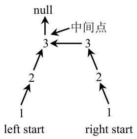
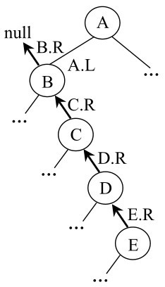
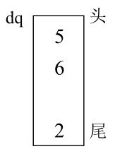
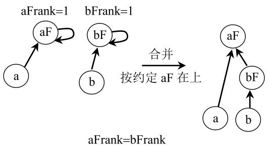
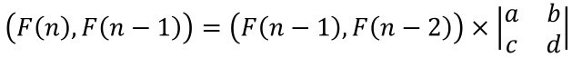
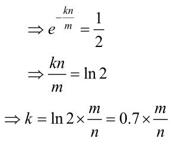
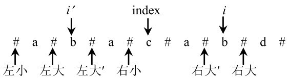

# 内容简介

这是一本程序员面试宝典！书中对IT名企代码面试各类题目的最优解进行了总结，并提供了相关代码实现。针对当前程序员面试缺乏权威题目汇总这一痛点，本书选取将近200道真实出现过的经典代码面试题，帮助广大程序员的面试准备做到万无一失。“刷”完本书后，你就是“题王”！

本书采用题目+解答的方式组织内容，并把面试题类型相近或者解法相近的题目尽量放在一起，读者在学习本书时很容易看出面试题解法之间的联系，使知识的学习避免碎片化。书中将所有的面试题从难到易依次分为“将、校、尉、士”四个档次，方便读者有针对性地选择“刷”题。本书所收录的所有面试题都给出了最优解讲解和代码实现，并且提供了一些普通解法和最优解法的运行时间对比，让读者真切地感受到最优解的魅力！

本书中的题目全面且经典，更重要的是，书中收录了大量独家题目和最优解分析，这些内容源自笔者多年来“死磕自己”的深入思考。

码农们，你们做好准备在IT名企的面试中脱颖而出、一举成名了吗？这本书就是你应该拥有的“神兵利器”。当然，对需要提升算法和数据结构等方面能力的程序员而言，本书的价值也是显而易见的。

未经许可，不得以任何方式复制或抄袭本书之部分或全部内容。

版权所有，侵权必究。


**图书在版编目（CIP）数据** 


程序员代码面试指南：IT名企算法与数据结构题目最优解/左程云著．—北京：电子工业出版社，2015.9

ISBN 978-7-121-27011-6


Ⅰ．①程…　Ⅱ．①左…　Ⅲ．①程序设计-工程技术人员-资格考试-自学参考资料　Ⅳ．①TP311.1


中国版本图书馆CIP数据核字（2015）第198018号


策划编辑：牛　勇

责任编辑：李利健

印　　刷：三河市双峰印刷装订有限公司

装　　订：三河市双峰印刷装订有限公司

出版发行：电子工业出版社

北京市海淀区万寿路173信箱　邮编：100036

开　　本：787×980　1/16

印　　张：33.25

字　　数：658.9千字

版　　次：2015年9月第1版

印　　次：2015年9月第1次印刷

定　　价：79.00元


凡所购买电子工业出版社图书有缺损问题，请向购买书店调换。若书店售缺，请与本社发行部联系，联系及邮购电话：（010）88254888。

质量投诉请发邮件至zlts@phei.com.cn，盗版侵权举报请发邮件至dbqq@phei.com.cn。

服务热线：（010）88258888。


献给左军和谢桂兰

# 特别说明

1．本书所有题目的代码都为Java实现，但这并不会妨碍其他语言使用者的阅读。这是因为笔者在实现每一道题目时，都尽最大努力回避与Java语言特性相关的写法出现，而且尽量遵循大多数编程语言共有的写法习惯。所以，将本书中的Java实现改写成其他语言的实现是非常容易的。

2．在Java中，如果想得到字符串str第*i* 个位置的字符，需用如下方式：

char p = str.charAt（i）;

本书提供的函数中有大量参数为字符串类型的函数，但如上所示的方式并不符合大多数读者的阅读习惯。为了让代码更加易读，笔者都在这样的函数中把字符串类型的参数转换成char类型数组的变量来使用，例如：

char[] charArr = str.toCharArray（）;

此时得到字符串str第*i* 个位置的字符，可以用如下方式：

char p = charArr[i];

在本书中，发生如上转换行为的函数在估算额外空间复杂度的时候，笔者并没有把charArr的空间计算在内，这是因为如果不转换成char数组，而是选择直接使用原参数str，也是完全可以的，之所以选择转换，仅仅是为了让读者更容易读懂代码；是否进行转换对算法的逻辑没有任何影响，所以不把charArr的空间算作必须使用的额外空间。

另外，本书涉及的程序源代码可以在http://www.broadview.com.cn/27011中下载。

# 推荐序1

2015年春节，因为公司业务的快速发展，我们开始寻觅优秀的笔试面试算法讲师。几经周折，找到了当时在举办线下算法分享的程云，认认真真地听他讲了一堂课，当时就认定他就是我们要找的人。

我听过很多国内顶尖ACM选手的算法分享，但是每一次听完以后总觉得我和那些人永远隔着一个断裂带，算法对我来说遥不可及，而程云讲解算法的时候总能从最小的切口讲起，由浅入深，环环相扣，不知不觉引你走向算法的核心精髓，那种醍醐灌顶的感觉能激发大家学习算法的热情，并一直推着我们前进。

这几年IT技术蓬勃发展，日新月异，对技术人才的需求日益增长，程序员招聘市场也如火如荼。在有限的三五轮面试中，国外流行让面试者编程解决某些数据结构和算法的题目，通过观察面试者编码的熟练程度、思考的速度和深度来衡量面试者的能力和潜力。国内以百度、阿里、腾讯为首的互联网企业也都逐步开始采用算法面试来筛选人才。

程云出于对算法的热爱，长期泡在careercup、leetcode等笔试面试网站上，编码解决各种最新的笔试面试编程题，对各种笔试面试编程题的解题技巧了如指掌。

算法面试普及后，传统的数据结构和算法课本讲得太过基础，又远离求职需求，国内也逐渐出现迎合求职需求的笔试面试工具书，这些书籍有些过于应试，纯粹以通过面试为导向，程云的书和那些书相比，题目更前沿，讲解更注重思考思路和代码的实践技巧，对每个题目都深挖最优解，同时根据自己在线下讲课学员们的反馈，对每个编程考题的解题反复修改，让思路更清晰。

这本书不仅可以作为面试代码指南，还可以作为学生课后的辅助练习，“刷”题5年，悉数总结都沉淀在这本书里，相信读者跟着他的引导从头到尾逐一攻克一定会有所收获。


叶向宇

牛客网CEO

# 推荐序2

初次遇见程云是在2014年8月，当时我在上一家公司工作刚好满4年，也是在那时我开始想换个环境，寻找新机会，就试着投了一家公司，结果第一次面试遇到算法题就被淘汰了。后来又面试过其他一些国内互联网公司，也总是卡在算法上。其实，之前我曾经自己在家抱着《算法导论》“啃”了几章，花了1个月的业余时间看了前5章，后面就没再继续坚持下去。看过的人都知道，虽然很有用，但实在很难“啃”。

单调地看书很枯燥，于是想到去网上找志同道合的人一起研究，就开始“逛”算法论坛。很巧的是，在某个论坛的算法板块看到一个帖子，说是在周末有算法交流班，当时我立即报名，周日的名额已满，我是很幸运地“替补”上去的。

还记得第一次交流是在程云租的房子里，小小的客厅里放了一张沙发、两排椅子和一张桌子，桌上放着笔记本电脑和一台大电视，前面还挂着白板。第一次算法交流就在这样的环境里开始了。

程云讲起题来犹如行云流水，我们听得更是酣畅淋漓，第一次听完就爱上了……当然，我说的是他的讲述。

相信大家都有过这样的经历，面对一道算法题，苦思冥想了半天，还是不知道怎么解，感觉很沮丧。如果这时突然有人把解题思路和方法以及代码都告诉你了，是不是感觉豁然开朗，心情舒畅了？这样的情景一天出现一次就可以让人感觉很开心，而如果一天连续出现二十次，那将会是什么感觉？一个字：爽！

程云把每一道题都讲解得清晰透彻，有的题目难以理解、思路诡异，他就会不厌其烦地反复讲解，用形象的方式展现复杂的逻辑，直到大家都听懂为止。给人的感觉可以说是高潮迭起，一波又一波。

后来进行第二次交流时，我带来最好的朋友一起参加。之后的交流中，我和朋友都毫不犹豫地报名参加。交流的内容涉及经典算法的高难度题目，也有一些小巧玲珑的技巧题。难题难得让人叹服，巧题巧得让人玩味。

对想去国外大公司就职的程序员来说，算法题这一关是必不可少的。程云讲述的题目是他5年“刷”题的经验积累而成的，其实只要掌握题目的解题思路和思想，就足以应付国内互联网公司程序员职位的算法面试题。不过，要想去国外的大公司，比如Google、Facebook之类的，还是要研究得透彻一些才行。

另外，除应付面试之外，还有很重要的一点，甚至是更重要的一点，就是本书可以帮我们打开思路，因为很多算法题的解法是需要逆向思维的，需要跳出原有的固定思维模式，当思维模式被打开之后，你会发现原有的事物现在看起来会有不同的看法，因为角度变了。不过这只能自己体会。

后来才知道，程云举办算法交流是为写书做准备。用他的话说：“会做题不算什么，比我“刷”题多的人我也能找出一大堆，但能给人讲明白就不容易了。”于是我后来又变成了程云在写这本书期间的试读者。

在此书还未上市之前，就能听到作者面对面地逐一讲解每一道题，真是非常难得且宝贵的经历。

如果你和我一样，对数据结构有个大概的了解，很想快速掌握算法题的解法技巧，那么这本书一定适合你！

祝每一位勤奋努力的程序员都能拿到自己满意的职位！


周宝鑫

一个程序员

# 自序

我能出书挺意外的。

在6年前的某一天，虽然我早就知道想进入那些大公司要靠“刷”代码面试题来练习编写代码的能力。可是这一天却不止如此，我突然有了心情去看代码面试题长什么样子，于是收集了代码面试的题目，越深入，我越有一种恐慌的感觉，因为感觉自己什么都不太在行，对一个归并排序（Merge sort）写出完整的代码都感觉挺费劲的，面对这个冯·诺伊曼发明的排序算法，我真有底气说自己是计算机专业的学生吗？这种打击并没有持续太久，因为爱耍小聪明的人总会特别自信。我决定开始认真面对“刷”题这件事，但那时我根本不知道我即将面对什么，更不要谈有写书的念头。

我把课余时间利用起来，心想：不就是“刷”题吗？别人能写出来，咱也能写出来。起初的心态是我不服，我就想告诉自己能行。过程虐心是肯定的，经常半夜因为看到一个复杂度特别低的算法自己真的不能理解而沮丧地睡不着觉。当时觉得找不到什么资料能彻底让我明白，书上讲得太粗浅，网上的太散乱，代码写得看不懂。起初我“刷”题的时候无数次地想放弃，因为觉得这些都是什么玩意儿！我为什么放着好好的日子不过，去找这种罪受？可是我又不甘心，虽然我不懂很多解法，但是它们真的很有意思。

我将能买到的所有相关书籍上的所有题目全都研究了一遍，不管是中文的还是英文的，我都硬着头皮“啃”。写完每道题后，我都和书上的方法进行反复对比。“啃”完了五六本书之后，距离我刚开始“刷”题已经过去16个月了。写书？别逗了，才刚看完。

“年轻人总会找借口说这个东西不是我感兴趣的，所以我做不好是应该的。但他们没有注意的是，你面对的事情中感兴趣的事情总是少数，这就使得大多数时候你做事情的态度总是很懈怠、很消极，这使你变成了一个懈怠的人。当你真正面对自己感兴趣的东西时，你发现你已经攥不紧拳头了。”时常想起本科时的毕业设计指导老师——高鹏义老师说的这句话。说得对！对一个东西，如果你没有透彻研究过，不要轻易说它不精彩。这不是博爱，而是对自己认真。

“刷”题代码达到4万行的时候，我基本上成了国内外所有热门“刷”题网站的日常用户，此时我确认了一件事情，今天的代码面试指导真的处在一个很初级的阶段，这种不健全是全方面的。

例如：

●　经常看到一篇文章前后的语境是割裂的，作者经常根据之前的一个优良解法提出更好的优化方式，但整篇文章都不提之前的解法是什么。这就导致初学者根本无法看懂；

●　几乎所有的书籍都忽略例子带来的引导作用，甚至还有不少书籍在阐述一个解法的时候只写伪代码，这就使得读者在看懂意思和自己真正能写出代码之间其实还有很多的路要走；

●　代码面试题目的特点是“多”、“杂”、“难”，从着手开始学习到最终达到自己想要的效果之间，自己对自己的评估根本无从谈起。“慢慢练吧，学海无涯”成为主要的心态，这就难免会产生怀疑的情绪；

●　看见一道新的面试题时还是会无从下手，因为之前的学习无法做到举一反三，对自己做过的题目缺乏总结和归纳。

难道“刷”题真的只适合聪明人玩？我不这么看，既然大多数内容处在有待商榷的地步，那我就去学习原论文吧。

当时一个人在国外，记得在初冬的一个下午，“刷”题已经两年之久，快吃晚饭的时候，我突然想起自己忘了吃午饭，就冲出家门去觅食。站在7-11门前的广场上，我拿着1.5美元的热狗和75美分的咖啡，微温的阳光撒在眼睛里，远远地望着即将消失的一天。我停下来，把咖啡放在斑驳的石头台子上，手里的热狗挺好看，香肠和洋葱都挺新鲜，清冷的空气吹过来，却让我的心绪更乱。旧金山的天空五彩斑斓，让漂泊者头晕目眩。哭得跟个鬼似的我除了想家，哪里敢想自己会出书呢？

当我意识到在网上很难搜到新鲜的题目时，我已经换了两家公司，反复实现了600多道题目，写了差不多10万行代码。原来只是为了找份工作而“刷”题这一初心早就忘了，变成了兴趣并坚持了这么久，我自己也感到意外。更奇怪的是，我已经完全乐在其中，同时交流欲望越来越强，时常和同事们展开这方面的讨论。发现很多书上的解法不是最优，很多题目其实和同事们讨论的做法更好，发现高手特别多，但好像都懒得动笔。

有一天，我看到自己写的题目，想到自己那些抓心挠肝的日子，突然觉得要不出书吧？我已经离不开这种感觉了，如果这不是真爱，那什么才是呢？

这不是一个励志的故事，是一个爱“刷”题的人决定把很多最优解讲出来，就这么简单。


左程云

2015年7月20日

# 目录

[推荐序1](#calibre_link-2)

[推荐序2](#calibre_link-3)

[自序](#calibre_link-4)

[第1章　栈和队列](#calibre_link-5)

[设计一个有getMin功能的栈](#calibre_link-6)

[由两个栈组成的队列](#calibre_link-7)

[如何仅用递归函数和栈操作逆序一个栈](#calibre_link-8)

[猫狗队列](#calibre_link-9)

[用一个栈实现另一个栈的排序](#calibre_link-10)

[用栈来求解汉诺塔问题](#calibre_link-11)

[生成窗口最大值数组](#calibre_link-12)

[构造数组的MaxTree](#calibre_link-13)

[求最大子矩阵的大小](#calibre_link-14)

[最大值减去最小值小于或等于num的子数组数量](#calibre_link-15)

[第2章　链表问题](#calibre_link-16)

[打印两个有序链表的公共部分](#calibre_link-17)

[在单链表和双链表中删除倒数第K个节点](#calibre_link-18)

[删除链表的中间节点和a/b处的节点](#calibre_link-19)

[反转单向和双向链表](#calibre_link-20)

[反转部分单向链表](#calibre_link-21)

[环形单链表的约瑟夫问题](#calibre_link-22)

[判断一个链表是否为回文结构](#calibre_link-23)

[将单向链表按某值划分成左边小、中间相等、右边大的形式](#calibre_link-24)

[复制含有随机指针节点的链表](#calibre_link-25)

[两个单链表生成相加链表](#calibre_link-26)

[两个单链表相交的一系列问题](#calibre_link-27)

[将单链表的每*K* 个节点之间逆序](#calibre_link-28)

[删除无序单链表中值重复出现的节点](#calibre_link-29)

[在单链表中删除指定值的节点](#calibre_link-30)

[将搜索二叉树转换成双向链表](#calibre_link-31)

[单链表的选择排序](#calibre_link-32)

[一种怪异的节点删除方式](#calibre_link-33)

[向有序的环形单链表中插入新节点](#calibre_link-34)

[合并两个有序的单链表](#calibre_link-35)

[按照左右半区的方式重新组合单链表](#calibre_link-36)

[第3章　二叉树问题](#calibre_link-37)

[分别用递归和非递归方式实现二叉树先序、中序和后序遍历](#calibre_link-38)

[打印二叉树的边界节点](#calibre_link-39)

[如何较为直观地打印二叉树](#calibre_link-40)

[二叉树的序列化和反序列化](#calibre_link-41)

[遍历二叉树的神级方法](#calibre_link-42)

[在二叉树中找到累加和为指定值的最长路径长度](#calibre_link-43)

[找到二叉树中的最大搜索二叉子树](#calibre_link-44)

[找到二叉树中符合搜索二叉树条件的最大拓扑结构](#calibre_link-45)

[二叉树的按层打印与ZigZag打印](#calibre_link-46)

[调整搜索二叉树中两个错误的节点](#calibre_link-47)

[判断t1树是否包含t2树全部的拓扑结构](#calibre_link-48)

[判断t1树中是否有与t2树拓扑结构完全相同的子树](#calibre_link-49)

[判断二叉树是否为平衡二叉树](#calibre_link-50)

[根据后序数组重建搜索二叉树](#calibre_link-51)

[判断一棵二叉树是否为搜索二叉树和完全二叉树](#calibre_link-52)

[通过有序数组生成平衡搜索二叉树](#calibre_link-53)

[在二叉树中找到一个节点的后继节点](#calibre_link-54)

[在二叉树中找到两个节点的最近公共祖先](#calibre_link-55)

[Tarjan算法与并查集解决二叉树节点间最近公共祖先的批量查询问题](#calibre_link-56)

[二叉树节点间的最大距离问题](#calibre_link-57)

[先序、中序和后序数组两两结合重构二叉树](#calibre_link-58)

[通过先序和中序数组生成后序数组](#calibre_link-59)

[统计和生成所有不同的二叉树](#calibre_link-60)

[统计完全二叉树的节点数](#calibre_link-61)

[第4章　递归和动态规划](#calibre_link-62)

[斐波那契系列问题的递归和动态规划](#calibre_link-63)

[矩阵的最小路径和](#calibre_link-64)

[换钱的最少货币数](#calibre_link-65)

[换钱的方法数](#calibre_link-66)

[最长递增子序列](#calibre_link-67)

[汉诺塔问题](#calibre_link-68)

[最长公共子序列问题](#calibre_link-69)

[最长公共子串问题](#calibre_link-70)

[最小编辑代价](#calibre_link-71)

[字符串的交错组成](#calibre_link-72)

[龙与地下城游戏问题](#calibre_link-73)

[数字字符串转换为字母组合的种数](#calibre_link-74)

[表达式得到期望结果的组成种数](#calibre_link-75)

[排成一条线的纸牌博弈问题](#calibre_link-76)

[跳跃游戏](#calibre_link-77)

[数组中的最长连续序列](#calibre_link-78)

[*N* 皇后问题](#calibre_link-79)

[第5章　字符串问题](#calibre_link-80)

[判断两个字符串是否互为变形词](#calibre_link-81)

[字符串中数字子串的求和](#calibre_link-82)

[去掉字符串中连续出现*k* 个0的子串](#calibre_link-83)

[判断两个字符串是否互为旋转词](#calibre_link-84)

[将整数字符串转成整数值](#calibre_link-85)

[替换字符串中连续出现的指定字符串](#calibre_link-86)

[字符串的统计字符串](#calibre_link-87)

[判断字符数组中是否所有的字符都只出现过一次](#calibre_link-88)

[在有序但含有空的数组中查找字符串](#calibre_link-89)

[字符串的调整与替换](#calibre_link-90)

[翻转字符串](#calibre_link-91)

[数组中两个字符串的最小距离](#calibre_link-92)

[添加最少字符使字符串整体都是回文字符串](#calibre_link-93)

[括号字符串的有效性和最长有效长度](#calibre_link-94)

[公式字符串求值](#calibre_link-95)

[0左边必有1的二进制字符串数量](#calibre_link-96)

[拼接所有字符串产生字典顺序最小的大写字符串](#calibre_link-97)

[找到字符串的最长无重复字符子串](#calibre_link-98)

[找到被指的新类型字符](#calibre_link-99)

[最小包含子串的长度](#calibre_link-100)

[回文最少分割数](#calibre_link-101)

[字符串匹配问题](#calibre_link-102)

[字典树（前缀树）的实现](#calibre_link-103)

[第6章　大数据和空间限制](#calibre_link-104)

[认识布隆过滤器](#calibre_link-105)

[只用2GB内存在20亿个整数中找到出现次数最多的数](#calibre_link-106)

[40亿个非负整数中找到没出现的数](#calibre_link-107)

[找到100亿个URL中重复的URL以及搜索词汇的top K问题](#calibre_link-108)

[40亿个非负整数中找到出现两次的数和所有数的中位数](#calibre_link-109)

[一致性哈希算法的基本原理](#calibre_link-110)

[第7章　位运算](#calibre_link-111)

[不用额外变量交换两个整数的值](#calibre_link-112)

[不用任何比较判断找出两个数中较大的数](#calibre_link-113)

[只用位运算不用算术运算实现整数的加减乘除运算](#calibre_link-114)

[整数的二进制表达中有多少个1](#calibre_link-115)

[在其他数都出现偶数次的数组中找到出现奇数次的数](#calibre_link-116)

[在其他数都出现k次的数组中找到只出现一次的数](#calibre_link-117)

[第8章　数组和矩阵问题](#calibre_link-118)

[转圈打印矩阵](#calibre_link-119)

[将正方形矩阵顺时针转动90°](#calibre_link-120)

[“之”字形打印矩阵](#calibre_link-121)

[找到无序数组中最小的*k* 个数](#calibre_link-122)

[需要排序的最短子数组长度](#calibre_link-123)

[在数组中找到出现次数大于*N/K* 的数](#calibre_link-124)

[在行列都排好序的矩阵中找数](#calibre_link-125)

[最长的可整合子数组的长度](#calibre_link-126)

[不重复打印排序数组中相加和为给定值的所有二元组和三元组](#calibre_link-127)

[未排序正数数组中累加和为给定值的最长子数组长度](#calibre_link-128)

[未排序数组中累加和为给定值的最长子数组系列问题](#calibre_link-129)

[未排序数组中累加和小于或等于给定值的最长子数组长度](#calibre_link-130)

[计算数组的小和](#calibre_link-131)

[自然数数组的排序](#calibre_link-132)

[奇数下标都是奇数或者偶数下标都是偶数](#calibre_link-133)

[子数组的最大累加和问题](#calibre_link-134)

[子矩阵的最大累加和问题](#calibre_link-135)

[在数组中找到一个局部最小的位置](#calibre_link-136)

[数组中子数组的最大累乘积](#calibre_link-137)

[打印*N* 个数组整体最大的Top *K*](#calibre_link-138)

[边界都是1的最大正方形大小](#calibre_link-139)

[不包含本位置值的累乘数组](#calibre_link-140)

[数组的partition调整](#calibre_link-141)

[求最短通路值](#calibre_link-142)

[数组中未出现的最小正整数](#calibre_link-143)

[数组排序之后相邻数的最大差值](#calibre_link-144)

[第9章　其他题目](#calibre_link-145)

[从5随机到7随机及其扩展](#calibre_link-146)

[一行代码求两个数的最大公约数](#calibre_link-147)

[有关阶乘的两个问题](#calibre_link-148)

[判断一个点是否在矩形内部](#calibre_link-149)

[判断一个点是否在三角形内部](#calibre_link-150)

[折纸问题](#calibre_link-151)

[蓄水池算法](#calibre_link-152)

[设计有setAll功能的哈希表](#calibre_link-153)

[最大的leftMax与rightMax之差的绝对值](#calibre_link-154)

[设计可以变更的缓存结构](#calibre_link-155)

[设计RandomPool结构](#calibre_link-156)

[调整[0，*x* )区间上的数出现的概率](#calibre_link-157)

[路径数组变为统计数组](#calibre_link-158)

[正数数组的最小不可组成和](#calibre_link-159)

[一种字符串和数字的对应关系](#calibre_link-160)

[1到*n* 中1出现的次数](#calibre_link-161)

[从N个数中等概率打印M个数](#calibre_link-162)

[判断一个数是否是回文数](#calibre_link-163)

[在有序旋转数组中找到最小值](#calibre_link-164)

[在有序旋转数组中找到一个数](#calibre_link-165)

[数字的英文表达和中文表达](#calibre_link-166)

[分糖果问题](#calibre_link-167)

[一种消息接收并打印的结构设计](#calibre_link-168)

[设计一个没有扩容负担的堆结构](#calibre_link-169)

[随时找到数据流的中位数](#calibre_link-170)

[在两个长度相等的排序数组中找到上中位数](#calibre_link-171)

[在两个排序数组中找到第K小的数](#calibre_link-172)

[两个有序数组间相加和的TOP K问题](#calibre_link-173)

[出现次数的TOP K问题](#calibre_link-174)

[Manacher算法](#calibre_link-175)

[KMP算法](#calibre_link-176)

[丢棋子问题](#calibre_link-177)

[画匠问题](#calibre_link-178)

[邮局选址问题](#calibre_link-179)

# 第*1* 章 栈和队列

## 设计一个有getMin功能的栈

**【题目】**

实现一个特殊的栈，在实现栈的基本功能的基础上，再实现返回栈中最小元素的操作。

**【要求】**

1.pop、push、getMin操作的时间复杂度都是*O* (1)。

2．设计的栈类型可以使用现成的栈结构。

**【难度】**

士　★☆☆☆

**【解答】**

在设计上我们使用两个栈，一个栈用来保存当前栈中的元素，其功能和一个正常的栈没有区别，这个栈记为stackData；另一个栈用于保存每一步的最小值，这个栈记为stackMin。具体的实现方式有两种。

第一种设计方案如下。

**●　压入数据规则**

假设当前数据为newNum，先将其压入stackData。然后判断stackMin是否为空：

●　如果为空，则newNum也压入stackMin。

●　如果不为空，则比较newNum和stackMin的栈顶元素中哪一个更小：

●　如果newNum更小或两者相等，则newNum也压入stackMin；

●　如果stackMin中栈顶元素小，则stackMin不压入任何内容。

举例：依次压入3、4、5、1、2、1的过程中，stockData和stackMin的变化如图1-1所示。


图1-1

**●　弹出数据规则**

先在stackData中弹出栈顶元素，记为value。然后比较当前stackMin的栈顶元素和value哪一个更小。

通过上文提到的压入规则可知，stackMin中存在的元素是从栈底到栈顶逐渐变小的，stackMin栈顶的元素既是stackMin栈的最小值，也是当前stackData栈的最小值。所以不会出现value比stackMin的栈顶元素更小的情况，value只可能大于或等于stackMin的栈顶元素。

当value等于stackMin的栈顶元素时，stackMin弹出栈顶元素；当value大于stackMin的栈顶元素时，stackMin不弹出栈顶元素；返回value。

很明显可以看出，压入与弹出规则是对应的。

**●　查询当前栈中的最小值操作**

由上文的压入数据规则和弹出数据规则可知，stackMin始终记录着stackData中的最小值，所以，stackMin的栈顶元素始终是当前stackData中的最小值。

方案一的代码实现如MyStack1类所示：

```
          public class MyStack1 {
                  private Stack<Integer> stackData;
                  private Stack<Integer> stackMin;

                  public MyStack1() {
                          this.stackData = new Stack<Integer>();
                          this.stackMin = new Stack<Integer>();
                  }

                  public void push(int newNum) {
                          if (this.stackMin.isEmpty()) {
                                  this.stackMin.push(newNum);
                          } else if (newNum <= this.getmin()) {
                                  this.stackMin.push(newNum);
                          }
                          this.stackData.push(newNum);
                  }

                  public int pop() {
                          if (this.stackData.isEmpty()) {
                                  throw new RuntimeException("Your stack is empty.");
                          }
                          int value = this.stackData.pop();
                          if (value == this.getmin()) {
                                  this.stackMin.pop();
                          }
                          return value;
                  }

                  public int getmin() {
                          if (this.stackMin.isEmpty()) {
                                  throw new RuntimeException("Your stack is empty.");
                          }
                          return this.stackMin.peek();
                  }
          }
```

第二种设计方案如下。

**●　压入数据规则**

假设当前数据为newNum，先将其压入stackData。然后判断stackMin是否为空。

如果为空，则newNum也压入stackMin；如果不为空，则比较newNum和stackMin的栈顶元素中哪一个更小：

如果newNum更小或两者相等，则newNum也压入stackMin；如果stackMin中栈顶元素小，则把stackMin的栈顶元素重复压入stackMin，即在栈顶元素上再压入一个栈顶元素。

举例：依次压入3、4、5、1、2、1的过程中，stockData和stackMin的变化如图1-2所示。


图1-2

**●　弹出数据规则**

在stackData中弹出数据，弹出的数据记为value；弹出stackMin中的栈顶；返回value。

很明显可以看出，压入与弹出规则是对应的。

**●　查询当前栈中的最小值操作**

由上文的压入数据规则和弹出数据规则可知，stackMin始终记录着stackData中的最小值，所以stackMin的栈顶元素始终是当前stackData中的最小值。

方案二的代码实现如MyStack2类所示：

```
          public class MyStack2 {
                  private Stack<Integer> stackData;
                  private Stack<Integer> stackMin;

                  public MyStack2() {
                          this.stackData = new Stack<Integer>();
                          this.stackMin = new Stack<Integer>();
                  }

                  public void push(int newNum) {
                          if (this.stackMin.isEmpty()) {
                                  this.stackMin.push(newNum);
                          } else if (newNum < this.getmin()) {
                                  this.stackMin.push(newNum);
                          } else {
                                  int newMin = this.stackMin.peek();
                                  this.stackMin.push(newMin);
                          }
                          this.stackData.push(newNum);
                  }

                  public int pop() {
                          if (this.stackData.isEmpty()) {
                                  throw new RuntimeException("Your stack is empty.");
                          }
                          this.stackMin.pop();
                          return this.stackData.pop();
                  }

                  public int getmin() {
                          if (this.stackMin.isEmpty()) {
                                  throw new RuntimeException("Your stack is empty.");
                          }
                          return this.stackMin.peek();
                  }
          }
```

**【点评】**

方案一和方案二其实都是用stackMin栈保存着stackData每一步的最小值。共同点是所有操作的时间复杂度都为*O* (1)、空间复杂度都为*O* (*n* )。区别是：方案一中stackMin压入时稍省空间，但是弹出操作稍费时间；方案二中stackMin压入时稍费空间，但是弹出操作稍省时间。

## 由两个栈组成的队列

**【题目】**

编写一个类，用两个栈实现队列，支持队列的基本操作（add、poll、peek）。

**【难度】**

尉　★★☆☆

**【解答】**

栈的特点是先进后出，而队列的特点是先进先出。我们用两个栈正好能把顺序反过来实现类似队列的操作。

具体实现上是一个栈作为压入栈，在压入数据时只往这个栈中压入，记为stackPush；另一个栈只作为弹出栈，在弹出数据时只从这个栈弹出，记为stackPop。

因为数据压入栈的时候，顺序是先进后出的。那么只要把stackPush的数据再压入stackPop中，顺序就变回来了。例如，将1～5依次压入stackPush，那么从stackPush的栈顶到栈底为5～1，此时依次再将5～1倒入stackPop，那么从stackPop的栈顶到栈底就变成了1～5。再从stackPop弹出时，顺序就像队列一样，如图1-3所示。


图1-3

听起来虽然简单，实际上必须做到以下两点。

1．如果stackPush要往stackPop中压入数据，那么必须一次性把stackPush中的数据全部压入。

2．如果stackPop不为空，stackPush绝对不能向stackPop中压入数据。

违反了以上两点都会发生错误。

违反1的情况举例：1～5依次压入stackPush，stackPush的栈顶到栈底为5～1，从stackPush压入stackPop时，只将5和4压入了stackPop，stackPush还剩下1、2、3没有压入。此时如果用户想进行弹出操作，那么4将最先弹出，与预想的队列顺序就不一致。

违反2的情况举例：1～5依次压入stackPush，stackPush将所有的数据压入了stackPop，此时从stackPop的栈顶到栈底就变成了1～5。此时又有6～10依次压入stackPush，stackPop不为空，stackPush不能向其中压入数据。如果违反2压入了stackPop，从stackPop的栈顶到栈底就变成了6～10、1～5。那么此时如果用户想进行弹出操作，6将最先弹出，与预想的队列顺序就不一致。

上面介绍了压入数据的注意事项。那么这个压入数据的操作在何时发生呢？

这个选择的时机可以有很多，调用add、poll和peek三种方法中的任何一种时发生“压”入数据的行为都是可以的。只要满足如上提到的两点，就不会出错。

本书的实现是在调用poll和peek方法时进行压入数据的过程。

具体实现请参看如下的TwoStacksQueue类：

```
          public class TwoStacksQueue {
                  public Stack<Integer> stackPush;
                  public Stack<Integer> stackPop;

                  public TwoStacksQueue() {
                          stackPush = new Stack<Integer>();
                          stackPop = new Stack<Integer>();
                  }

                  public void add(int pushInt) {
                          stackPush.push(pushInt);
                  }

                  public int poll() {
                          if (stackPop.empty() && stackPush.empty()) {
                                  throw new RuntimeException("Queue is empty! ");
                          } else if (stackPop.empty()) {
                                  while (! stackPush.empty()) {
                                          stackPop.push(stackPush.pop());
                                  }
                          }
                          return stackPop.pop();
                  }

                  public int peek() {
                          if (stackPop.empty() && stackPush.empty()) {
                                  throw new RuntimeException("Queue is empty! ");
                          } else if (stackPop.empty()) {
                                  while (! stackPush.empty()) {
                                          stackPop.push(stackPush.pop());
                                  }
                          }
                          return stackPop.peek();
                  }
          }
```

## 如何仅用递归函数和栈操作逆序一个栈

**【题目】**

一个栈依次压入1、2、3、4、5，那么从栈顶到栈底分别为5、4、3、2、1。将这个栈转置后，从栈顶到栈底为1、2、3、4、5，也就是实现栈中元素的逆序，但是只能用递归函数来实现，不能用其他数据结构。

**【难度】**

尉　★★☆☆

**【解答】**

本题考查栈的操作和递归函数的设计，我们需要设计出两个递归函数。

递归函数一：将栈stack的栈底元素返回并移除。

具体过程就是如下代码中的getAndRemoveLastElement方法。

```
          public static int getAndRemoveLastElement(Stack<Integer> stack) {
                  int result = stack.pop();
                  if (stack.isEmpty()) {
                          return result;
                  } else {
                          int last = getAndRemoveLastElement(stack);
                          stack.push(result);
                          return last;
                  }
          }
```

如果从stack的栈顶到栈底依次为3、2、1，这个函数的具体过程如图1-4所示。


图1-4

递归函数二：逆序一个栈，就是题目要求实现的方法，具体过程就是如下代码中的reverse方法。该方法使用了上面提到的getAndRemoveLastElement方法。

```
          public static void reverse(Stack<Integer> stack) {
                  if (stack.isEmpty()) {
                          return;
                  }
                  int i = getAndRemoveLastElement(stack);
                  reverse(stack);
                  stack.push(i);
          }
```

如果从stack的栈顶到栈底依次为3、2、1，reverse函数的具体过程如图1-5所示。


图1-5

getAndRemoveLastElement方法在图中简单表示为get方法，表示移除并返回当前栈底元素。

## 猫狗队列

**【题目】**

宠物、狗和猫的类如下：

```
          public class Pet {
                  private String type;

                  public Pet(String type) {
                          this.type = type;
                  }

                  public String getPetType() {
                          return this.type;
                  }
          }
          public class Dog extends Pet {

                  public Dog() {
                          super("dog");
                  }
          }

          public class Cat extends Pet {

                  public Cat() {
                          super("cat");
                  }
          }
```

实现一种狗猫队列的结构，要求如下：

●　用户可以调用add方法将cat类或dog类的实例放入队列中；

●　用户可以调用pollAll方法，将队列中所有的实例按照进队列的先后顺序依次弹出；

●　用户可以调用pollDog方法，将队列中dog类的实例按照进队列的先后顺序依次弹出；

●　用户可以调用pollCat方法，将队列中cat类的实例按照进队列的先后顺序依次弹出；

●　用户可以调用isEmpty方法，检查队列中是否还有dog或cat的实例；

●　用户可以调用isDogEmpty方法，检查队列中是否有dog类的实例；

●　用户可以调用isCatEmpty方法，检查队列中是否有cat类的实例。

**【难度】**

士　★☆☆☆

**【解答】**

本题考查实现特殊数据结构的能力以及针对特殊功能的算法设计能力。

本题为开放类型的面试题，希望读者能有自己的实现，在这里列出几种常见的设计错误：

●　cat队列只放cat实例，dog队列只放dog实例，再用一个总队列放所有的实例。

错误原因：cat、dog以及总队列的更新问题。

●　用哈希表，key表示一个cat实例或dog实例，value表示这个实例进队列的次序。

错误原因：不能支持一个实例多次进队列的功能需求，因为哈希表的key只能对应一个value值。

●　将用户原有的cat或dog类改写，加一个计数项来表示某一个实例进队列的时间。

错误原因：不能擅自改变用户的类结构。

本题实现将不同的实例盖上时间戳的方法，但是又不能改变用户本身的类，所以定义一个新的类，具体实现请参看如下的PetEnterQueue类。

```
          public class PetEnterQueue {
                  private Pet pet;
                  private long count;

                  public PetEnterQueue(Pet pet, long count) {
                          this.pet = pet;
                          this.count = count;
                  }

                  public Pet getPet() {
                          return this.pet;
                  }

                  public long getCount() {
                          return this.count;
                  }

                  public String getEnterPetType() {
                          return this.pet.getPetType();
                  }
          }
```

PetEnterQueue类在构造时，pet是用户原有的实例，count就是这个实例的时间戳。

我们实现的队列其实是PetEnterQueue类的实例。大体说来，首先有一个不断累加的数据项，用来表示实例进队列的时间；同时有两个队列，一个是只放dog类实例的队列dogQ，另一个是只放cat类实例的队列catQ。

在加入实例时，如果实例是dog，就盖上时间戳，生成对应的PetEnterQueue类的实例，然后放入dogQ；如果实例是cat，就盖上时间戳，生成对应的PetEnterQueue类的实例，然后放入catQ。具体过程请参看如下DogCatQueue类的add方法。

只想弹出dog类的实例时，从dogQ里不断弹出即可，具体过程请参看如下DogCatQueue类的pollDog方法。

只想弹出cat类的实例时，从catQ里不断弹出即可，具体过程请参看如下DogCatQueue类的pollCat方法。

想按实际顺序弹出实例时，因为dogQ的队列头表示所有dog实例中最早进队列的实例，同时catQ的队列头表示所有的cat实例中最早进队列的实例。则比较这两个队列头的时间戳，谁更早，就弹出谁。具体过程请参看如下DogCatQueue类的pollAll方法。

DogCatQueue类的整体代码如下：

```
          public class DogCatQueue {
                  private Queue<PetEnterQueue> dogQ;
                  private Queue<PetEnterQueue> catQ;
                  private long count;

                  public DogCatQueue() {
                          this.dogQ = new LinkedList<PetEnterQueue>();
                          this.catQ = new LinkedList<PetEnterQueue>();
                          this.count = 0;
                  }

                  public void add(Pet pet) {
                          if (pet.getPetType().equals("dog")) {
                                  this.dogQ.add(new PetEnterQueue(pet, this.count++));
                          } else if (pet.getPetType().equals("cat")) {
                                  this.catQ.add(new PetEnterQueue(pet, this.count++));
                          } else {
                                  throw new RuntimeException("err, not dog or cat");
                          }
                  }

                  public Pet pollAll() {
                          if (! this.dogQ.isEmpty() && ! this.catQ.isEmpty()) {
                                  if(this.dogQ.peek().getCount()  <  this.catQ.peek().Get
      Count()) {
                                          return this.dogQ.poll().getPet();
                                  } else {
                                          return this.catQ.poll().getPet();
                                  }
                          } else if (! this.dogQ.isEmpty()) {
                                  return this.dogQ.poll().getPet();
                          } else if (! this.catQ.isEmpty()) {
                                  return this.catQ.poll().getPet();
                          } else {
                                  throw new RuntimeException("err, queue is empty! ");
                          }
                  }

                  public Dog pollDog() {
                          if (! this.isDogQueueEmpty()) {
                                  return (Dog) this.dogQ.poll().getPet();
                          } else {
                                  throw new RuntimeException("Dog queue is empty! ");
                          }
                  }

                  public Cat pollCat() {
                          if (! this.isCatQueueEmpty()) {
                                  return (Cat) this.catQ.poll().getPet();
                          } else
                                  throw new RuntimeException("Cat queue is empty! ");
                  }

                  public boolean isEmpty() {
                          return this.dogQ.isEmpty() && this.catQ.isEmpty();
                  }

                  public boolean isDogQueueEmpty() {
                          return this.dogQ.isEmpty();
                  }

                  public boolean isCatQueueEmpty() {
                          return this.catQ.isEmpty();
                  }
          }
```

## 用一个栈实现另一个栈的排序

**【题目】**

一个栈中元素的类型为整型，现在想将该栈从顶到底按从大到小的顺序排序，只许申请一个栈。除此之外，可以申请新的变量，但不能申请额外的数据结构。如何完成排序？

**【难度】**

士　★☆☆☆

**【解答】**

将要排序的栈记为stack，申请的辅助栈记为help。在stack上执行pop操作，弹出的元素记为cur。

●　如果cur小于或等于help的栈顶元素，则将cur直接压入help；

●　如果cur大于help的栈顶元素，则将help的元素逐一弹出，逐一压入stack，直到cur小于或等于help的栈顶元素，再将cur压入help。

一直执行以上操作，直到stack中的全部元素都压入到help。最后将help中的所有元素逐一压入stack，即完成排序。

```
          public static void sortStackByStack(Stack<Integer> stack) {
                  Stack<Integer> help = new Stack<Integer>();
                  while (! stack.isEmpty()) {
                          int cur = stack.pop();
                          while (! help.isEmpty() && help.peek() > cur) {
                                  stack.push(help.pop());
                          }
                          help.push(cur);
                  }
                  while (! help.isEmpty()) {
                          stack.push(help.pop());
                  }
          }
```

## 用栈来求解汉诺塔问题

**【题目】**

汉诺塔问题比较经典，这里修改一下游戏规则：现在限制不能从最左侧的塔直接移动到最右侧，也不能从最右侧直接移动到最左侧，而是必须经过中间。求当塔有*N* 层的时候，打印最优移动过程和最优移动总步数。

例如，当塔数为两层时，最上层的塔记为1，最下层的塔记为2，则打印：

```
            Move 1 from left to mid
            Move 1 from mid to right
            Move 2 from left to mid
            Move 1 from right to mid
            Move 1 from mid to left
            Move 2 from mid to right
            Move 1 from left to mid
            Move 1 from mid to right
            It will move 8 steps.
```

注意：关于汉诺塔游戏的更多讨论，将在本书递归与动态规划的章节中继续。

**【要求】**

用以下两种方法解决。

●　方法一：递归的方法；

●　方法二：非递归的方法，用栈来模拟汉诺塔的三个塔。

**【难度】**

校　★★★☆

**【解答】**

方法一：递归的方法。

首先，如果只剩最上层的塔需要移动，则有如下处理：

1．如果希望从“左”移到“中”，打印“Move 1 from left to mid”。

2．如果希望从“中”移到“左”，打印“Move 1 from mid to left”。

3．如果希望从“中”移到“右”，打印“Move 1 from mid to right”。

4．如果希望从“右”移到“中”，打印“Move 1 from right to mid”。

5．如果希望从“左”移到“右”，打印“Move 1 from left to mid”和“Move 1 from mid to right”。

6．如果希望从“右”移到“左”，打印“Move 1 from right to mid”和“Move 1 from mid to left”。

以上过程就是递归的终止条件，也就是只剩上层塔时的打印过程。

接下来，我们分析剩下多层塔的情况。

如果剩下*N* 层塔，从最上到最下依次为1～*N* ，则有如下判断：

1．如果剩下的*N* 层塔都在“左”，希望全部移到“中”，则有三个步骤。

1）将1～*N* -1层塔先全部从“左”移到“右”，明显交给递归过程。

2）将第*N* 层塔从“左”移到“中”。

3）再将1～*N* -1层塔全部从“右”移到“中”，明显交给递归过程。

2．如果把剩下的*N* 层塔从“中”移到“左”，从“中”移到“右”，从“右”移到“中”，过程与情况1同理，一样是分解为三步，在此不再详述。

3．如果剩下的*N* 层塔都在“左”，希望全部移到“右”，则有五个步骤。

1）将1～*N* -1层塔先全部从“左”移到“右”，明显交给递归过程。

2）将第*N* 层塔从“左”移到“中”。

3）将1～*N* -1层塔全部从“右”移到“左”，明显交给递归过程。

4）将第*N* 层塔从“中”移到“右”。

5）最后将1～*N* -1层塔全部从“左”移到“右”，明显交给递归过程。

4．如果剩下的*N* 层塔都在“右”，希望全部移到“左”，过程与情况3同理，一样是分解为五步，在此不再详述。

以上递归过程经过逻辑化简之后的代码请参看如下代码中的hanoiProblem1方法。

```
          public int hanoiProblem1(int num, String left, String mid,
                          String right) {
                  if (num < 1) {
                          return 0;
                  }
                  return process(num, left, mid, right, left, right);
          }

          public int process(int num, String left, String mid, String right,
                          String from, String to) {
                  if (num == 1) {
                          if (from.equals(mid) || to.equals(mid)) {
                                  System.out.println("Move 1 from " + from + " to " + to);
                                  return 1;
                          } else {
                                  System.out.println("Move 1 from " + from + " to " + mid);
                                  System.out.println("Move 1 from " + mid + " to " + to);
                                  return 2;
                          }
                  }
                  if (from.equals(mid) || to.equals(mid)) {
                          String another = (from.equals(left) || to.equals(left)) ? right :
      left;
                          int part1 = process(num - 1, left, mid, right, from, another);
                          int part2 = 1;
                          System.out.println("Move " + num + " from " + from + " to " + to);
                          int part3 = process(num - 1, left, mid, right, another, to);
                          return part1 + part2 + part3;
                  } else {
                          int part1 = process(num - 1, left, mid, right, from, to);
                          int part2 = 1;
                          System.out.println("Move " + num + " from " + from + " to " + mid);
                          int part3 = process(num - 1, left, mid, right, to, from);
                          int part4 = 1;
                          System.out.println("Move " + num + " from " + mid + " to " + to);
                          int part5 = process(num - 1, left, mid, right, from, to);
                          return part1 + part2 + part3 + part4 + part5;
                  }
          }
```

方法二：非递归的方法——用栈来模拟整个过程。

修改后的汉诺塔问题不能让任何塔从“左”直接移动到“右”，也不能从“右”直接移动到“左”，而是要经过中间。也就是说，实际动作只有4个：“左”到“中”、“中”到“左”、“中”到“右”、“右”到“中”。

现在我们把左、中、右三个地点抽象成栈，依次记为LS、MS和RS。最初所有的塔都在LS上。那么如上4个动作就可以看作是：某一个栈（from）把栈顶元素弹出，然后压入到另一个栈里（to），作为这一个栈（to）的栈顶。

例如，如果是7层塔，在最初时所有的塔都在LS上，LS从栈顶到栈底就依次是1～7，如果现在发生了“左”到“中”的动作，这个动作对应的操作是LS栈将栈顶元素1弹出，然后1压入到MS栈中，成为MS的栈顶。其他的操作同理。

一个动作能发生的先决条件是不违反小压大的原则。

from栈弹出的元素num如果想压入到to栈中，那么num的值必须小于当前to栈的栈顶。

还有一个原则不是很明显，但也是非常重要的，叫相邻不可逆原则，解释如下：

1．我们把四个动作依次定义为：L->M、M->L、M->R和R->M。

2．很明显，L->M和M->L过程互为逆过程，M->R和R->M互为逆过程。

3．在修改后的汉诺塔游戏中，如果想走出最少步数，那么任何两个相邻的动作都不是互为逆过程的。举个例子：如果上一步的动作是L->M，那么这一步绝不可能是M->L，直观地解释为：你上一步把一个栈顶数从“左”移动到“中”，这一步为什么又要移回去呢？这必然不是取得最小步数的走法。同理，M->R动作和R->M动作也不可能相邻发生。

有了小压大和相邻不可逆原则后，可以推导出两个十分有用的结论——非递归的方法核心结论：

1．游戏的第一个动作一定是L->M，这是显而易见的。

2．在走出最少步数过程中的任何时刻，四个动作中只有一个动作不违反小压大和相邻不可逆原则，另外三个动作一定都会违反。

对于结论2，现在进行简单的证明。

因为游戏的第一个动作已经确定是L->M，则以后的每一步都会有前一步的动作。

假设前一步的动作是L->M：

1．根据小压大原则，L->M的动作不会重复发生。

2．根据相邻不可逆原则，M->L的动作也不该发生。

3．根据小压大原则，M->R和R->M只会有一个达标。

假设前一步的动作是M->L：

1．根据小压大原则，M->L的动作不会重复发生。

2．根据相邻不可逆原则，L->M的动作也不该发生。

3．根据小压大原则，M->R和R->M只会有一个达标。

假设前一步的动作是M->R：

1．根据小压大原则，M->R的动作不会重复发生。

2．根据相邻不可逆原则，R->M的动作也不该发生。

3．根据小压大原则，L->M和M->L只会有一个达标。

假设前一步的动作是R->M：

1．根据小压大原则，R->M的动作不会重复发生。

2．根据相邻不可逆原则，M->R的动作也不该发生。

3．根据小压大原则，L->M和M->L只会有一个达标。

综上所述，每一步只会有一个动作达标。那么只要每走一步都根据这两个原则考查所有的动作就可以，哪个动作达标就走哪个动作，反正每次都只有一个动作满足要求，按顺序走下来即可。

非递归的具体过程请参看如下代码中的hanoiProblem2方法。

```
          public enum Action {
                  No, LToM, MToL, MToR, RToM
          }

          public int hanoiProblem2(int num, String left, String mid, String right) {
                  Stack<Integer> lS = new Stack<Integer>();
                  Stack<Integer> mS = new Stack<Integer>();
                  Stack<Integer> rS = new Stack<Integer>();
                  lS.push(Integer.MAX_VALUE);
                  mS.push(Integer.MAX_VALUE);
                  rS.push(Integer.MAX_VALUE);
                  for (int i = num; i > 0; i--) {
                          lS.push(i);
                  }
                  Action[] record = { Action.No };
                  int step = 0;
                  while (rS.size() ! = num + 1) {
                          step += fStackTotStack(record, Action.MToL, Action.LToM, lS, mS,
                                                left, mid);
                          step += fStackTotStack(record, Action.LToM, Action.MToL, mS, lS,
                                                mid, left);
                          step += fStackTotStack(record, Action.RToM, Action.MToR, mS, rS,
                                                mid, right);
                          step += fStackTotStack(record, Action.MToR, Action.RToM, rS, mS,
                                                right, mid);
                  }
                  return step;
          }

          public static int fStackTotStack(Action[] record, Action preNoAct,
                          Action nowAct, Stack<Integer> fStack, Stack<Integer> tStack,
                          String from, String to) {
                  if (record[0] ! = preNoAct && fStack.peek() < tStack.peek()) {
                          tStack.push(fStack.pop());
                          System.out.println("Move " + tStack.peek() + " from " + from + "
      to " + to);
                          record[0] = nowAct;
                          return 1;
                  }
                  return 0;
          }
```

## 生成窗口最大值数组

**【题目】**

有一个整型数组arr和一个大小为*w* 的窗口从数组的最左边滑到最右边，窗口每次向右边滑一个位置。

例如，数组为[4，3，5，4，3，3，6，7]，窗口大小为3时：

```
        [4  3  5] 4  3  3  6  7             窗口中最大值为5
         4 [3  5  4] 3  3  6  7            窗口中最大值为5
         4  3 [5  4  3] 3  6  7            窗口中最大值为5
         4  3  5 [4  3  3] 6  7            窗口中最大值为4
         4  3  5  4 [3  3  6] 7            窗口中最大值为6
         4  3  5  4  3 [3  6  7]            窗口中最大值为7
```

如果数组长度为*n* ，窗口大小为*w* ，则一共产生*n* -*w* +1个窗口的最大值。

请实现一个函数。

●　输入：整型数组arr，窗口大小为*w* 。

●　输出：一个长度为*n* -*w* +1的数组res，res[i]表示每一种窗口状态下的最大值。

以本题为例，结果应该返回{5，5，5，4，6，7}。

**【难度】**

尉　★★☆☆

**【解答】**

如果数组长度为*N* ，窗口大小为*w* ，如果做出时间复杂度*O* (*N* ×*w* )的解法是不能让面试官满意的，本题要求面试者想出时间复杂度*O* (*N* )的实现。

本题的关键在于利用双端队列来实现窗口最大值的更新。首先生成双端队列qmax，qmax中存放数组arr中的下标。

假设遍历到arr[i]，qmax的放入规则为：

1．如果qmax为空，直接把下标i放进qmax，放入过程结束。

2．如果qmax不为空，取出当前qmax队尾存放的下标，假设为j。

1）如果arr[j]>arr[i]，直接把下标i放进qmax的队尾，放入过程结束。

2）如果arr[j]<=arr[i]，把j从qmax中弹出，继续qmax的放入规则。

假设遍历到arr[i]，qmax的弹出规则为：

如果qmax队头的下标等于i-w，说明当前qmax队头的下标已过期，弹出当前对头的下标即可。

根据如上的放入和弹出规则，qmax便成了一个维护窗口为*w* 的子数组的最大值更新的结构。下面举例说明题目给出的例子。

1．开始时qmax为空，qmax={}

2．遍历到arr[0]==4，将下标0放入qmax，qmax={0}。

3．遍历到arr[1]==3，当前qmax的队尾下标为0，又有arr[0]>arr[1]，所以将下标1放入qmax的尾部，qmax={0，1}。

4．遍历到arr[2]==5，当前qmax的队尾下标为1，又有arr[1]<=arr[2]，所以将下标1从qmax的尾部弹出，qmax变为{0}。当前qmax的队尾下标为0，又有arr[0]<=arr[2]，所以将下标0从qmax尾部弹出，qmax变为{}。将下标2放入qmax，qmax={2}。此时已经遍历到下标2的位置，窗口arr[0..2]出现，当前qmax队头的下标为2，所以窗口arr[0..2]的最大值为arr[2]（即5）。

5．遍历到arr[3]==4，当前qmax的队尾下标为2，又有arr[2]>arr[3]，所以将下标3放入qmax尾部，qmax={2，3}。窗口arr[1..3]出现，当前qmax队头的下标为2，这个下标还没有过期，所以窗口arr[1..3]的最大值为arr[2]（即5）。

6．遍历到arr[4]==3，当前qmax的队尾下标为3，又有arr[3]>arr[4]，所以将下标4放入qmax尾部，qmax={2，3，4}。窗口arr[2..4]出现，当前qmax队头的下标为2，这个下标还没有过期，所以窗口arr[2..4]的最大值为arr[2]（即5）。

7．遍历到arr[5]==3，当前qmax的队尾下标为4，又有arr[4]<=arr[5]，所以将下标4从qmax的尾部弹出，qmax变为{2，3}。当前qmax的队尾下标为3，又有arr[3]>arr[5]，所以将下标5放入qmax尾部，qmax={2，3，5}。窗口arr[3..5]出现，当前qmax队头的下标为2，这个下标已经过期，所以从qmax的头部弹出，qmax变为{3，5}。当前qmax队头的下标为3，这个下标没有过期，所以窗口arr[3..5]的最大值为arr[3]（即4）。

8．遍历到arr[6]==6，当前qmax的队尾下标为5，又有arr[5]<=arr[6]，所以将下标5从qmax的尾部弹出，qmax变为{3}。当前qmax的队尾下标为3，又有arr[3]<=arr[6]，所以将下标3从qmax的尾部弹出，qmax变为{}。将下标6放入qmax，qmax={6}。窗口arr[4..6]出现，当前qmax队头的下标为6，这个下标没有过期，所以窗口arr[4..6]的最大值为arr[6] （即6）。

9．遍历到arr[7]==7，当前qmax的队尾下标为6，又有arr[6]<=arr[7]，所以将下标6从qmax的尾部弹出，qmax变为{}。将下标7放入qmax，qmax={7}。窗口arr[5..7]出现，当前qmax队头的下标为7，这个下标没有过期，所以窗口arr[5..7]的最大值为arr[7] （即7）。

10．依次出现的窗口最大值为[5，5，5，4，6，7]，在遍历过程中收集起来，最后返回即可。

上述过程中，每个下标值最多进qmax一次，出qmax一次。所以遍历的过程中进出双端队列的操作是时间复杂度为*O* (*N* )，整体的时间复杂度也为*O* (*N* )。具体过程参看如下代码中的getMaxWindow方法。

```
          public int[] getMaxWindow(int[] arr, int w) {
                  if (arr == null || w < 1 || arr.length < w) {
                          return null;
                  }
                  LinkedList<Integer> qmax = new LinkedList<Integer>();
                  int[] res = new int[arr.length - w + 1];
                  int index = 0;
                  for (int i = 0; i < arr.length; i++) {
                          while (! qmax.isEmpty() && arr[qmax.peekLast()] <= arr[i]) {
                                  qmax.pollLast();
                          }
                          qmax.addLast(i);
                          if (qmax.peekFirst() == i - w) {
                                  qmax.pollFirst();
                          }
                          if (i >= w - 1) {
                                  res[index++] = arr[qmax.peekFirst()];
                          }
                  }
                  return res;
          }
```

## 构造数组的MaxTree

**【题目】**

定义二叉树节点如下：

```
          public class Node {
                  public int value;
                  public Node left;
                  public Node right;
                  public Node(int data) {
                          this.value = data;
                  }
          }
```

一个数组的MaxTree定义如下。

●　数组必须没有重复元素。

●　MaxTree是一棵二叉树，数组的每一个值对应一个二叉树节点。

●　包括MaxTree树在内且在其中的每一棵子树上，值最大的节点都是树的头。

给定一个没有重复元素的数组arr，写出生成这个数组的MaxTree的函数，要求如果数组长度为*N* ，则时间复杂度为*O* (*N* )、额外空间复杂度为*O* (*N* )。

**【难度】**

校　★★★☆

**【解答】**

下面举例说明如何在满足时间和空间复杂度的要求下生成MaxTree。

```
        arr = {3, 4, 5, 1, 2}
        3的左边第一个比3大的数：无　　　3的右边第一个比3大的数：4
        4的左边第一个比4大的数：无　　　4的右边第一个比4大的数：5
        5的左边第一个比5大的数：无　　　5的右边第一个比5大的数：无
        1的左边第一个比1大的数：5           1的右边第一个比1大的数：2
        2的左边第一个比2大的数：5           2的右边第一个比2大的数：无
```

以下列原则来建立这棵树：

●　每一个数的父节点是它左边第一个比它大的数和它右边第一个比它大的数中，较小的那个。

●　如果一个数左边没有比它大的数，右边也没有。也就是说，这个数是整个数组的最大值，那么这个数是MaxTree的头节点。

那么3，4，5，1，2的MaxTree如下：


为什么通过这个方法能够正确地生成MaxTree呢？我们需要给出证明，证明分为如下两步。

1．通过这个方法，所有的数能生成一棵树，这棵树可能不是二叉树，但肯定是一棵树，而不是多棵树（森林）。

我们知道，在数组中的所有数都不同，而一个较小的数肯定会以一个比自己大的数作为父节点，那么最终所有的数向上找都会找到数组中的最大值，所以它们会有一个共同的头。证明完毕。

2．通过这个方法，所有的数最多都只有两个孩子。也就是说，这棵树可以用二叉树表示，而不需要多叉树。

要想证明这个问题，只需证明任何一个数在单独一侧，孩子数量都不可能超过1个即可。

假设a这个数在单独一侧有2个孩子，不妨设在右侧。假设这两个孩子一个是k1，另一个是k2，即

```
    …a…k1…k2…
```

因为a是k1和k2的父，所以a>k1，a>k2。根据题意，k1和k2不相等，所以k1和k2可以分出大小，先假设k1是较小的，k2是较大的：

那么k1可能会以k2为父节点，而绝对不会以a为父节点，因为根据我们的方法，每一个数的父节点是它左边第一个比它大的数和它右边第一个比它大的数中较小的那个，又有a>k2。

再假设k2是较小的，k1是较大的：

那么k2可能会以k1为父节点，也绝对不会以a为父节点，因为根据我们的方法，k1才可能是k2左边第一个遇到的比k2大的数，而绝对不会轮到a。

总之，k1和k2肯定有一个不是a的孩子。

所以，任何一个数的单独一侧，其孩子数量都不可能超过1个，最多只会有1个。进而我们知道，任何一个数最多会有2个孩子，而不会有更多。

证明完毕。

以上证明了该方法是有效的，那么如何尽可能快地找到每一个数左右两边第一个比它大的数呢？利用栈。

找每个数左边第一个比它大的数，从左到右遍历每个数，栈中保持递减序列，新来的数不停地利用Pop出栈顶，直到栈顶比新数大或没有数。

以[3，1，2]为例，首先3入栈，接下来1比3小，无须pop出3，1入栈，并且确定了1往左第一个比它大的数为3。接下来2比1大，1出栈，2比3小，2入栈，并且确定了2往左第一个比它大的数为3。

用同样的方法可以求得每个数往右第一个比它大的数。

具体请参看如下代码中的getMaxTree方法。

```
        public Node getMaxTree(int[] arr) {
            Node[] nArr = new Node[arr.length];
            for (int i = 0; i ! = arr.length; i++) {
                    nArr[i] = new Node(arr[i]);
            }
            Stack<Node> stack = new Stack<Node>();
            HashMap<Node, Node> lBigMap = new HashMap<Node, Node>();
            HashMap<Node, Node> rBigMap = new HashMap<Node, Node>();
            for (int i = 0; i ! = nArr.length; i++) {
                    Node curNode = nArr[i];
                    while ((! stack.isEmpty()) && stack.peek().value < curNode.value) {
                          popStackSetMap(stack, lBigMap);
                    }
                    stack.push(curNode);
            }
            while (! stack.isEmpty()) {
                popStackSetMap(stack, lBigMap);
            }
            for (int i = nArr.length - 1; i ! = -1; i--) {
                    Node curNode = nArr[i];
                    while ((! stack.isEmpty()) && stack.peek().value < curNode.value) {
                            popStackSetMap(stack, rBigMap);
                    }
                    stack.push(curNode);
            }
            while (! stack.isEmpty()) {
                    popStackSetMap(stack, rBigMap);
            }
            Node head = null;
            for (int i = 0; i ! = nArr.length; i++) {
                    Node curNode = nArr[i];
                    Node left = lBigMap.get(curNode);
                    Node right = rBigMap.get(curNode);
                    if (left == null && right == null) {
                            head = curNode;
                    } else if (left == null) {
                            if (right.left == null) {
                                    right.left = curNode;
                            } else {
                                    right.right = curNode;
                            }
                    } else if (right == null) {
                            if (left.left == null) {
                                    left.left = curNode;
                            } else {
                                    left.right = curNode;
                            }
                    } else {
                            Node parent = left.value < right.value ? left : right;
                            if (parent.left == null) {
                                    parent.left = curNode;
                            } else {
                                    parent.right = curNode;
                            }
                    }
            }
            return head;
        }

        public void popStackSetMap(Stack<Node> stack, HashMap<Node, Node> map) {
            Node popNode = stack.pop();
            if (stack.isEmpty()) {
                    map.put(popNode, null);
            } else {
                    map.put(popNode, stack.peek());
            }
        }
```

## 求最大子矩阵的大小

**【题目】**

给定一个整型矩阵map，其中的值只有0和1两种，求其中全是1的所有矩形区域中，最大的矩形区域为1的数量。

例如：

```
     1   1   1   0
```

其中，最大的矩形区域有3个1，所以返回3。

再如：

```
     1   0   1   1
     1   1   1   1
     1   1   1   0
```

其中，最大的矩形区域有6个1，所以返回6。

**【难度】**

校　★★★☆

**【解答】**

如果矩阵的大小为*O* (*N* ×*M* )，本题可以做到时间复杂度为*O* (*N* ×*M* )。解法的具体过程为：

1．矩阵的行数为*N* ，以每一行做切割，统计以当前行作为底的情况下，每个位置往上的1的数量。使用高度数组height来表示。

例如：

```
            map  =  1   0   1   1
                    1   1   1   1
                    1   1   1   0
```

以第1行做切割后，height={1，0，1，1}，height[j]表示目前的底上（第1行），*j* 位置往上（包括*j* 位置）有多少连续的1。

以第2行做切割后，height={2，1，2，2}，注意到从第一行到第二行，height数组的更新是十分方便的，即height[j] = map[i][j]==0 ? 0 : height[j]+1。

以第3行做切割后，height={3，2，3，0}。

2．对于每一次切割，都利用更新后的height数组来求出以每一行为底的情况下，最大的矩形是什么。那么这么多次切割中，最大的那个矩形就是我们要的。

整个过程就是如下代码中的maxRecSize方法。步骤2的实现是如下代码中的maxRecFromBottom方法。

下面重点介绍一下步骤2如何快速地实现，这也是这道题最重要的部分，如果height数组的长度为*M* ，那么求解步骤2的过程可以做到时间复杂度为*O* (*M* )。

对于height数组，读者可以理解为一个直方图，比如{3，2，3，0}，其实就是如图1-6所示的直方图。


图1-6

也就是说，步骤2的实质是在一个大的直方图中求最大矩形的面积。如果我们能够求出以每一根柱子扩展出去的最大矩形，那么其中最大的矩形就是我们想找的。比如：

●　第1根高度为3的柱子向左无法扩展，它的右边是2，比3小，所以向右也无法扩展，则以第1根柱子为高度的矩形面积就是3*1==3；

●　第2根高度为2的柱子向左可以扩1个距离，因为它的左边是3，比2大；右边的柱子也是3，所以向右也可以扩1个距离，则以第2根柱子为高度的矩形面积就是2*3==6；

●　第3根高度为3的柱子向左没法扩展，向右也没法扩展，则以第3根柱子为高度的矩形面积就是3*1==3；

●　第4根高度为0的柱子向左没法扩展，向右也没法扩展，则以第4根柱子为高度的矩形面积就是0*1==0；

所以，当前直方图中最大的矩形面积就是6，也就是图1-6中虚线框住的部分。

考查每一根柱子最大能扩多大，这个行为的实质就是找到柱子左边刚比它小的柱子位置在哪里，以及右边刚比它小的柱子位置在哪里。这个过程怎么计算最快呢？用栈。

为了方便表述，我们以height={3，4，5，4，3，6}为例说明如何根据height数组求其中的最大矩形。具体过程如下：

1．生成一个栈，记为stack，从左到右遍历height数组，每遍历一个位置，都会把位置压进stack中。

2．遍历到height的0位置，height[0]=3，此时stack为空，直接将位置0压入栈中，此时stack从栈顶到栈底为{0}。

3．遍历到height的1位置，height[1]=4，此时stack的栈顶为位置0，值为height[0]=3，又有height[1]>height[0]，那么将位置1直接压入stack。这一步体现了遍历过程中的一个关键逻辑：只有当前i位置的值height[i]大于当前栈顶位置所代表的值(height[stack.peek()])，则i位置才可以压入stack。

所以可以知道，stack中从栈顶到栈底的位置所代表的值是依次递减，并且无重复值，此时stack从栈顶到栈底为{1，0}。

4．遍历到height的2位置，height[2]=5，与步骤3的情况完全一样，所以直接将位置2压入stack，此时stack从栈顶到栈底为{2，1，0}。

5．遍历到height的3位置，height[3]=4，此时stack的栈顶为位置2，值为height[2]=5，又有height[3]<height[2]。此时又出现了一个遍历过程中的关键逻辑，即如果当前*i* 位置的值height[i]小于或等于当前栈顶位置所代表的值(height[stack.peek()])，则把栈中存的位置不断弹出，直到某一个栈顶所代表的值小于height[i]，再把位置*i* 压入，并在这期间做如下处理：

1）假设当前弹出的栈顶位置记为位置*j* ，弹出栈顶之后，新的栈顶记为*k* 。然后我们开始考虑位置*j* 的柱子向右和向左最远能扩到哪里。

2）对位置*j* 的柱子来说，向右最远能扩到哪里呢？

如果height[j]>height[i]，那么*i* -1位置就是向右能扩到的最远位置。因为*j* 之所以被弹出，就是因为遇到了第一个比位置*j* 值小的位置。

如果height[j]==height[i]，那么*i* -1位置不一定是向右能扩到的最远位置，只是起码能扩到的位置。那怎么办呢？

可以肯定的是，在这种情况下，*i* 位置的柱子向左必然也可以扩到*j* 位置。也就是说，*j* 位置的柱子扩出来的最大矩形和*i* 位置的柱子扩出来的最大矩形是同一个。

所以，此时可以不再计算*j* 位置的柱子能扩出来的最大矩形，因为位置*i* 肯定要压入到栈中，那就等位置*i* 弹出的时候再说。

3）对位置*j* 的柱子来说，向左最远能扩到哪里呢？

肯定是*k* +1位置。首先，height[k+1..j-1]之间不可能有小于或等于height[k]的值，否则*k* 位置早从栈里弹出了。

然后因为在栈里*k* 位置和*j* 位置原本是相邻的，并且从栈顶到栈底的位置所代表的值是依次递减并且无重复值，所以在height[k+1..j-1]之间不可能有大于或等于height[k]，同时又小于或等于height[j]的，因为如果有这样的值，*k* 和*j* 在栈中就不可能相邻。

所以，height[k+1..j-1]之间的值必然是既大于height[k]，又大于height[j]的，所以*j* 位置的柱子向左最远可以扩到*k* +1位置。

4）综上所述，*j* 位置的柱子能扩出来的最大矩形为(i-k-1)*height[j]。

以例子来说明：

① i==3，height[3]=4，此时stack的栈顶为位置2，值为height[2]=5，故height[3]<=height[2]，所以位置2被弹出（j==2），当前栈顶变为1（k==1）。位置2的柱子扩出来的最大矩形面积为(3-1-1)*5==5。

② i==3，height[3]=4，此时stack的栈顶为位置1，值为height[1]=4，故height[3]<=height[1]，所以位置1被弹出（j==1），当前栈顶变为1（k==0）。位置1的柱子扩出来的最大矩形面积为(3-0-1)*4==8，这个值实际上是不对的（偏小），但在位置3被弹出的时候是能够重新正确计算得到的。

③ i==3，height[3]=4，此时stack的栈顶为位置0，值为height[0]=3，这时height[3]<=height[2]，所以位置0不弹出。

④将位置3压入stack，stack从栈顶到栈底为{3，0}。

6．遍历到height的4位置，height[4]=3。与步骤5的情况类似，以下是弹出过程：

1）i==4，height[4]=3，此时stack的栈顶为位置3，值为height[3]=4，故height[4]<=height[3]，所以位置3被弹出（j==3），当前栈顶变为0（k==0）。位置3的柱子扩出来的最大矩形面积为(4-0-1)*4==12。这个最大面积也是位置1的柱子扩出来的最大矩形面积，在位置1被弹出时，这个矩形其实没有找到，但在位置3这里找到了。

2）i==4，height[4]=3，此时stack的栈顶为位置0，值为height[0]=3，故height[4]<=height[0]，所以位置0被弹出（j==0），当前没有了栈顶元素，此时可以认为k==-1。位置0的柱子扩出来的最大矩形面积为(4-(-1)-1)*3==12，这个值实际上是不对的（偏小），但在位置4被弹出时是能够重新正确计算得到的。

3）栈已经为空，所以将位置4压入stack，此时从栈顶到栈底为{4}。

7．遍历到height的5位置，height[5]=6，情况和步骤3类似，直接压入位置5，此时从栈顶到栈底为{5，4}。

8．遍历结束后，stack中仍有位置没有经历扩的过程，从栈顶到栈底为{5，4}。此时因为height数组再往右不能扩出去，所以认为i==height.length==6且越界之后的值极小，然后开始弹出留在栈中的位置：

1）i==6，height[6]极小，此时stack的栈顶为位置5，值为height[5]=6，故height[6]<=height[5]，所以位置6被弹出（j==6），当前栈顶变为4（k==4）。位置5的柱子扩出来的最大矩形面积为(6-4-1)*6==6。

2）i==6，height[6]极小，此时stack的栈顶为位置4，值为height[4]=3，故height[6]<=height[4]，所以位置4被弹出（j==4），栈空了，此时可以认为k==-1。位置4的柱子扩出来的最大矩形面积为(6-(-1)-1)*3==18。这个最大面积也是位置0的柱子扩出来的最大矩形面积，在位置0被弹出的时候，这个矩形其实没有找到，但在位置4这里找到了。

3）栈已经空了，过程结束。

9．整个过程结束，所有找到的最大矩形面积中18是最大的，所以返回18。

研究以上9个步骤时我们发现，任何一个位置都仅仅进出栈1次，所以时间复杂度为*O* (*M* )。既然每做一次切割处理的时间复杂度为*O* (*M* )，一共做*N* 次，则总的时间复杂度为*O* (*N* ×*M* )。

全部过程参看如下代码中的maxRecSize方法。9个步骤的详细过程参看代码中的maxRecFromBottom方法。

```
          public int maxRecSize(int[][] map) {
                  if (map == null || map.length == 0 || map[0].length == 0) {
                          return 0;
                  }
                  int maxArea = 0;
                  int[] height = new int[map[0].length];
                  for (int i = 0; i < map.length; i++) {
                          for (int j = 0; j < map[0].length; j++) {
                                  height[j] = map[i][j] == 0 ? 0 : height[j] + 1;
                          }
                          maxArea = Math.max(maxRecFromBottom(height), maxArea);
                  }
                  return maxArea;
          }

          public int maxRecFromBottom(int[] height) {
                  if (height == null || height.length == 0) {
                          return 0;
                  }
                  int maxArea = 0;
                  Stack<Integer> stack = new Stack<Integer>();
                  for (int i = 0; i < height.length; i++) {
                          while (! stack.isEmpty() && height[i] <= height[stack.peek()]) {
                                  int j = stack.pop();
                                  int k = stack.isEmpty() ? -1 : stack.peek();
                                  int curArea = (i - k - 1) * height[j];
                                  maxArea = Math.max(maxArea, curArea);
                          }
                          stack.push(i);
                  }
                  while (! stack.isEmpty()) {
                          int j = stack.pop();
                          int k = stack.isEmpty() ? -1 : stack.peek();
                          int curArea = (height.length - k - 1) * height[j];
                          maxArea = Math.max(maxArea, curArea);
                  }
                  return maxArea;
          }
```

## 最大值减去最小值小于或等于num的子数组数量

**【题目】**

给定数组arr和整数num，共返回有多少个子数组满足如下情况：

max(arr[i..j]) - min(arr[i..j]) <= num

max(arr[i..j])表示子数组arr[i..j]中的最大值，min(arr[i..j])表示子数组arr[i..j]中的最小值。

**【要求】**

如果数组长度为*N* ，请实现时间复杂度为*O* (*N* )的解法。

**【难度】**

校　★★★☆

**【解答】**

首先介绍普通的解法，找到arr的所有子数组，一共有*O* (*N* 2 )个，然后对每一个子数组做遍历找到其中的最小值和最大值，这个过程时间复杂度为*O* (*N* )，然后看看这个子数组是否满足条件。统计所有满足的子数组数量即可。普通解法容易实现，但是时间复杂度为*O* (*N* 3 )，本书不再详述。最优解可以做到时间复杂度*O* (*N* )，额外空间复杂度*O* (*N* )，在阅读下面的分析过程之前，请读者先阅读本章“生成窗口最大值数组”问题，本题所使用到的双端队列结构与解决“生成窗口最大值数组”问题中的双端队列结构含义基本一致。

生成两个双端队列qmax和qmin。当子数组为arr[i..j]时，qmax维护了窗口子数组arr[i..j]的最大值更新的结构，qmin维护了窗口子数组arr[i..j]的最小值更新的结构。当子数组arr[i..j]向右扩一个位置变成arr[i..j+1]时，qmax和qmin结构可以在*O* (1)的时间内更新，并且可以在*O* (1)的时间内得到arr[i..j+1]的最大值和最小值。当子数组arr[i..j]向左缩一个位置变成arr[i+1..j]时，qmax和qmin结构依然可以在*O* (1)的时间内更新，并且在*O* (1)的时间内得到arr[i+1..j]的最大值和最小值。

通过分析题目满足的条件，可以得到如下两个结论：

●　如果子数组arr[i..j]满足条件，即max(arr[i..j])-min(arr[i..j])<=num，那么arr[i..j]中的每一个子数组，即arr[k..l](i<=k<=l<=j)都满足条件。我们以子数组arr[i..j-1]为例说明，arr[i..j-1]最大值只可能小于或等于arr[i..j]的最大值，arr[i..j-1]最小值只可能大于或等于arr[i..j]的最小值，所以arr[i..j-1]必然满足条件。同理，arr[i..j]中的每一个子数组都满足条件。

●　如果子数组arr[i..j]不满足条件，那么所有包含arr[i..j]的子数组，即arr[k..l](k<=i<=j<=l)都不满足条件。证明过程同第一个结论。

根据双端队列qmax和qmin的结构性质，以及如上两个结论，设计整个过程如下：

1．生成两个双端队列qmax和qmin，含义如上文所说。生成两个整型变量i和j，表示子数组的范围，即arr[i..j]。生成整型变量res，表示所有满足条件的子数组数量。

2．令j不断向右移动（j++），表示arr[i..j]一直向右扩大，并不断更新qmax和qmin结构，保证qmax和qmin始终维持动态窗口最大值和最小值的更新结构。一旦出现arr[i..j]不满足条件的情况，j向右扩的过程停止，此时arr[i..j-1]、arr[i..j-2]、arr[i..j-3]、...、arr[i..i]一定都是满足条件的。也就是说，所有必须以arr[i]作为第一个元素的子数组，满足条件的数量为*j* -*i* 个。于是令res+=j-i。

3．当进行完步骤2，令i向右移动一个位置，并对qmax和qmin做出相应的更新，qmax和qmin从原来的arr[i..j]窗口变成arr[i+1..j]窗口的最大值和最小值的更新结构。然后重复步骤2，也就是求所有必须以arr[i+1]作为第一个元素的子数组中，满足条件的数量有多少个。

4．根据步骤2和步骤3，依次求出以arr[0]、arr[1]、...、arr[N-1]作为第一个元素的子数组中满足条件的数量分别有多少个，累加起来的数量就是最终的结果。

上述过程中，所有的下标值最多进qmax和qmin一次，出qmax和qmin一次。i和j的值也不断增加，并且从来不减小。所以整个过程的时间复杂度为*O* (*N* )。

最优解全部实现请参看如下代码中的getNum方法。

```
          public int getNum(int[] arr, int num) {
                  if (arr == null || arr.length == 0) {
                          return 0;
                  }
                  LinkedList<Integer> qmin = new LinkedList<Integer>();
                  LinkedList<Integer> qmax = new LinkedList<Integer>();
                  int i = 0;
                  int j = 0;
                  int res = 0;
                  while (i < arr.length) {
                          while (j < arr.length) {
                                  while (! qmin.isEmpty() && arr[qmin.peekLast()] >= arr[j]) {
                                          qmin.pollLast();
                                  }
                                  qmin.addLast(j);
                                  while (! qmax.isEmpty() && arr[qmax.peekLast()] <= arr[j]) {
                                          qmax.pollLast();
                                  }
                                  qmax.addLast(j);
                                  if (arr[qmax.getFirst()] - arr[qmin.getFirst()] > num) {
                                          break;
                                  }
                                  j++;
                          }
                          if (qmin.peekFirst() == i) {
                                  qmin.pollFirst();
                          }
                          if (qmax.peekFirst() == i) {
                                  qmax.pollFirst();
                          }
                          res += j - i;
                          i++;
                  }
                  return res;
          }
```

# 第*2* 章 链表问题

## 打印两个有序链表的公共部分

**【题目】**

给定两个有序链表的头指针head1和head2，打印两个链表的公共部分。

**【难度】**

士　★☆☆☆

**【解答】**

本题难度很低，因为是有序链表，所以从两个链表的头开始进行如下判断：

●　如果head1的值小于head2，则head1往下移动。

●　如果head2的值小于head1，则head2往下移动。

●　如果head1的值与head2的值相等，则打印这个值，然后head1与head2都往下移动。

●　head1或head2有任何一个移动到null，整个过程停止。

具体过程参看如下代码中的printCommonPart方法。

```
          public class Node {
                  public int value;
                  public Node next;
                  public Node(int data) {
                          this.value = data;
                  }
          }

          public void printCommonPart(Node head1, Node head2) {
                  System.out.print("Common Part: ");
                  while (head1 ! = null && head2 ! = null) {
                          if (head1.value < head2.value) {
                                  head1 = head1.next;
                          } else if (head1.value > head2.value) {
                                  head2 = head2.next;
                          } else {
                                  System.out.print(head1.value + " ");
                                  head1 = head1.next;
                                  head2 = head2.next;
                          }
                  }
                  System.out.println();
          }
```

## 在单链表和双链表中删除倒数第*K* 个节点

**【题目】**

分别实现两个函数，一个可以删除单链表中倒数第*K* 个节点，另一个可以删除双链表中倒数第*K* 个节点。

**【要求】**

如果链表长度为*N* ，时间复杂度达到*O* (*N* )，额外空间复杂度达到*O* (1)。

**【难度】**

士　★☆☆☆

**【解答】**

本题较为简单，实现方式也是多种多样的，本书提供一种方法供读者参考。

先来看看单链表如何调整。如果链表为空或者*K* 值小于1，这种情况下，参数是无效的，直接返回即可。除此之外，让链表从头开始走到尾，每移动一步，就让*K* 的值减1。

链表：1->2->3，*K* = 4，链表根本不存在倒数第4个节点。

走到的节点：1 -> 2 -> 3

*K* 变化为：321

链表：1->2->3，*K* = 3，链表倒数第3个节点是1节点。

走到的节点：1 -> 2 -> 3

*K* 变化为：210

链表：1->2->3，*K* = 2，链表倒数第2个节点是2节点。

走到的节点：1 -> 2 -> 3

*K* 变化为：1 0 -1

由以上三种情况可知，让链表从头开始走到尾，每移动一步，就让*K* 值减1，当链表走到结尾时，如果*K* 值大于0，说明不用调整链表，因为链表根本没有倒数第*K* 个节点，此时将原链表直接返回即可；如果*K* 值等于0，说明链表倒数第*K* 个节点就是头节点，此时直接返回head.next，也就是原链表的第二个节点，让第二个节点作为链表的头返回即可，相当于删除头节点；接下来，说明一下如果*K* 值小于0，该如何处理。

先明确一点，如果要删除链表的头节点之后的某个节点，实际上需要找到要删除节点的前一个节点，比如：1->2->3，如果想删除节点2，则需要找到节点1，然后把节点1连到节点3上（1->3），以此来达到删除节点2的目的。

如果*K* 值小于0，如何找到要删除节点的前一个节点呢？方法如下：

1．重新从头节点开始走，每移动一步，就让*K* 的值加1。

2．当*K* 等于0时，移动停止，移动到的节点就是要删除节点的前一个节点。

这样做是非常好理解的，因为如果链表长度为*N* ，要删除倒数第*K* 个节点，很明显，倒数第*K* 个节点的前一个节点就是第*N* -*K* 个节点。在第一次遍历后，*K* 的值变为*K* -*N* 。第二次遍历时，*K* 的值不断加1，加到0就停止遍历，第二次遍历当然会停到第*N* -*K* 个节点的位置。

具体过程请参看如下代码中的removeLastKthNode方法。

```
          public class Node {
                  public int value;
                  public Node next;
                  public Node(int data) {
                          this.value = data;
                  }
          }

          public Node removeLastKthNode(Node head, int lastKth) {
                  if (head == null || lastKth < 1) {
                          return head;
                  }
                  Node cur = head;
                  while (cur ! = null) {
                          lastKth--;
                          cur = cur.next;
                  }
                  if (lastKth == 0) {
                          head = head.next;
                  }
                  if (lastKth < 0) {
                          cur = head;
                          while (++lastKth ! = 0) {
                                  cur = cur.next;
                          }
                          cur.next = cur.next.next;
                  }
                  return head;
          }
```

对于双链表的调整，几乎与单链表的处理方式一样，注意last指针的重连即可。具体过程请参看如下代码中的removeLastKthNode方法。

```
          public class DoubleNode {
                  public int value;
                  public DoubleNode last;
                  public DoubleNode next;
                  public DoubleNode(int data) {
                          this.value = data;
                  }
          }

          public DoubleNode removeLastKthNode(DoubleNode head, int lastKth) {
                  if (head == null || lastKth < 1) {
                          return head;
                  }
                  DoubleNode cur = head;
                  while (cur ! = null) {
                          lastKth--;
                          cur = cur.next;
                  }
                  if (lastKth == 0) {
                          head = head.next;
                          head.last = null;
                  }
                  if (lastKth < 0) {
                          cur = head;
                          while (++lastKth ! = 0) {
                                  cur = cur.next;
                          }
                          DoubleNode newNext = cur.next.next;
                          cur.next = newNext;
                          if (newNext ! = null) {
                                  newNext.last = cur;
                          }
                  }
                  return head;
          }
```

## 删除链表的中间节点和a/b处的节点

**【题目】**

给定链表的头节点head，实现删除链表的中间节点的函数。

例如：

不删除任何节点；

1->2，删除节点1；

1->2->3，删除节点2；

1->2->3->4，删除节点2；

1->2->3->4->5，删除节点3；

进阶：

给定链表的头节点head、整数a和b，实现删除位于a/b处节点的函数。

例如：

链表：1->2->3->4->5，假设a/b的值为r。

如果r等于0，不删除任何节点；

如果r在区间(0，1/5]上，删除节点1；

如果r在区间(1/5，2/5]上，删除节点2；

如果r在区间(2/5，3/5]上，删除节点3；

如果r在区间(3/5，4/5]上，删除节点4；

如果r在区间(4/5，1]上，删除节点5；

如果r大于1，不删除任何节点。

**【难度】**

士　★☆☆☆

**【解答】**

先来分析原问题，如果链表为空或者长度为1，不需要调整，则直接返回；如果链表的长度为2，将头节点删除即可；当链表长度到达3，应该删除第2个节点；当链表长度为4，应该删除第2个节点；当链表长度为5，应该删除第3个节点……也就是链表长度每增加2(3，5，7…)，要删除的节点就后移一个节点。删除节点的问题在之前的题目中我们已经讨论过，如果要删除一个节点，则需要找到待删除节点的前一个节点。

具体过程请参看如下代码中的removeMidNode方法。

```
          public class Node {
                  public int value;
                  public Node next;
                  public Node(int data) {
                          this.value = data;
                  }
          }

          public Node removeMidNode(Node head) {
                  if (head == null || head.next == null) {
                          return head;
                  }
                  if (head.next.next == null) {
                          return head.next;
                  }
                  Node pre = head;
                  Node cur = head.next.next;
                  while (cur.next ! = null && cur.next.next ! = null) {
                          pre = pre.next;
                          cur = cur.next.next;
                  }
                  pre.next = pre.next.next;
                  return head;
          }
```

接下来讨论进阶问题，首先需要解决的问题是，如何根据链表的长度*n* ，以及a与b的值决定该删除的节点是哪一个节点呢？根据如下方法：

先计算double r = ((double) (a * n)) / ((double) b)的值，然后r向上取整之后的整数值代表该删除的节点是第几个节点。

下面举几个例子来验证一下：

如果链表长度为7，a=5，b=7。

r = (7*5)/7 = 5.0，向上取整后为5，所以应该删除第5个节点。

如果链表长度为7，a=5，b=6。

r = (7*5)/6 = 5.8333…，向上取整后为6，所以应该删除第6个节点。

如果链表长度为7，a=1，b=6。

r = (7*1)/6 = 1.1666…，向上取整后为2，所以应该删除第2个节点。

知道该删除第几个节点之后，接下来找到需要删除节点的前一个节点即可。具体过程请参看如下代码中的removeByRatio方法。

```
          public Node removeByRatio(Node head, int a, int b) {
                  if (a < 1 || a > b) {
                          return head;
                  }
                  int n = 0;
                  Node cur = head;
                  while (cur ! = null) {
                          n++;
                          cur = cur.next;
                  }
                  n = (int) Math.ceil(((double) (a * n)) / (double) b);
                  if (n == 1) {
                          head = head.next;
                  }
                  if (n > 1) {
                          cur = head;
                          while (--n ! = 1) {
                                  cur = cur.next;
                          }
                          cur.next = cur.next.next;
                  }
                  return head;
          }
```

## 反转单向和双向链表

**【题目】**

分别实现反转单向链表和反转双向链表的函数。

**【要求】**

如果链表长度为*N* ，时间复杂度要求为*O* (*N* )，额外空间复杂度要求为*O* (1)。

**【难度】**

士　★☆☆☆

**【解答】**

本题比较简单，读者做到代码一次成型，运行不出错即可。

反转单向链表的函数如下，函数返回反转之后链表新的头节点：

```
          public class Node {
                  public int value;
                  public Node next;
                  public Node(int data) {
                          this.value = data;
                  }
          }

          public Node reverseList(Node head) {
                  Node pre = null;
                  Node next = null;
                  while (head ! = null) {
                          next = head.next;
                          head.next = pre;
                          pre = head;
                          head = next;
                  }
                  return pre;
          }
```

反转双向链表的函数如下，函数返回反转之后链表新的头节点：

```
          public DoubleNode {
                  public int value;
                  public DoubleNode last;
                  public DoubleNode next;
                  public DoubleNode(int data) {
                          this.value = data;
                  }
          }

          public DoubleNode reverseList(DoubleNode head) {
                  DoubleNode pre = null;
                  DoubleNode next = null;
                  while (head ! = null) {
                          next = head.next;
                          head.next = pre;
                          head.last = next;
                          pre = head;
                          head = next;
                  }
                  return pre;
          }
```

## 反转部分单向链表

**【题目】**

给定一个单向链表的头节点head，以及两个整数from和to，在单向链表上把第from个节点到第to个节点这一部分进行反转。

例如：

1->2->3->4->5->null，from=2，to=4

调整结果为：1->4->3->2->5->null

再如：

1->2->3->null，from=1，to=3

调整结果为：3->2->1->null

**【要求】**

1．如果链表长度为*N* ，时间复杂度要求为*O* (*N* )，额外空间复杂度要求为*O* (1)。

2．如果不满足1<=from<=to<=N，则不用调整。

**【难度】**

士　★☆☆☆

**【解答】**

本题有可能存在换头的问题，比如题目的第二个例子，所以函数应该返回调整后的新头节点，整个处理过程如下：

1．先判断是否满足1<=from<=to<=N，如果不满足，则直接返回原来的头节点。

2．找到第from-1个节点fPre和第to+1个节点tPos。fPre即是要反转部分的前一个节点，tPos是反转部分的后一个节点。把反转的部分先反转，然后正确地连接fPre和tPos。

例如：1->2->3->4->null，假设fPre为节点1，tPos为节点4，要反转部分为2->3。先反转成3->2，然后fPre连向节点3，节点2连向tPos，就变成了1->3->2->4->null。

3．如果fPre为null，说明反转部分是包含头节点的，则返回新的头节点，也就是没反转之前反转部分的最后一个节点，也是反转之后反转部分的第一个节点；如果fPre不为null，则返回旧的头节点。

全部过程请参看如下代码中的reversePart方法。

```
          public Node reversePart(Node head, int from, int to) {
                  int len = 0;
                  Node node1 = head;
                  Node fPre = null;
                  Node tPos = null;
                  while (node1 ! = null) {
                          len++;
                          fPre = len == from - 1 ? node1 : fPre;
                          tPos = len == to + 1 ? node1 : tPos;
                          node1 = node1.next;
                  }
                  if (from > to || from < 1 || to > len) {
                          return head;
                  }
                  node1 = fPre == null ? head : fPre.next;
                  Node node2 = node1.next;
                  node1.next = tPos;
                  Node next = null;
                  while (node2 ! = tPos) {
                          next = node2.next;
                          node2.next = node1;
                          node1 = node2;
                          node2 = next;
                  }
                  if (fPre ! = null) {
                          fPre.next = node1;
                          return head;
                  }
                  return node1;
          }
```

## 环形单链表的约瑟夫问题

**【题目】**

据说著名犹太历史学家Josephus有过以下故事：在罗马人占领乔塔帕特后，39个犹太人与Josephus及他的朋友躲到一个洞中，39个犹太人决定宁愿死也不要被敌人抓到，于是决定了一个自杀方式，41个人排成一个圆圈，由第1个人开始报数，报数到3的人就自杀，然后再由下一个人重新报1，报数到3的人再自杀，这样依次下去，直到剩下最后一个人时，那个人可以自由选择自己的命运。这就是著名的约瑟夫问题。现在请用单向环形链表描述该结构并呈现整个自杀过程。

输入：一个环形单向链表的头节点head和报数的值*m* 。

返回：最后生存下来的节点，且这个节点自己组成环形单向链表，其他节点都删掉。

进阶：

如果链表节点数为*N* ，想在时间复杂度为*O* (*N* )时完成原问题的要求，该怎么实现？

**【难度】**

原问题：士　★☆☆☆

进阶：校　★★★☆

**【解答】**

先来看看普通解法是如何实现的，其实非常简单，方法如下：

1．如果链表为空或者链表节点数为1，或者*m* 的值小于1，则不用调整就直接返回。

2．在环形链表中遍历每个节点，不断转圈，不断让每个节点报数。

3．当报数到达*m* 时，就删除当前报数的节点。

4．删除节点后，别忘了还要把剩下的节点继续连成环状，继续转圈报数，继续删除。

5．不停地删除，直到环形链表中只剩一个节点，过程结束。

普通的解法就像题目描述的过程一样，具体实现请参看如下代码中的josephusKill1方法。

```
          public class Node {
                  public int value;
                  public Node next;
                  public Node(int data) {
                          this.value = data;
                  }
          }

          public Node josephusKill1(Node head, int m) {
                  if (head == null || head.next == head || m < 1) {
                          return head;
                  }
                  Node last = head;
                  while (last.next ! = head) {
                          last = last.next;
                  }
                  int count = 0;
                  while (head ! = last) {
                          if (++count == m) {
                                  last.next = head.next;
                                  count = 0;
                          } else {
                                  last = last.next;
                          }
                          head = last.next;
                  }
                  return head;
          }
```

普通的解法在实现上不难，就是考查面试者基本的代码实现技巧，做到不出错即可。很明显的是，每删除掉一个节点，都需要遍历*m* 次，一共需要删除的节点数为*n* -1，所以普通解法的时间复杂度为*O* (*n* ×*m* )，这明显是不符合进阶要求的。

下面介绍进阶的解法。原问题之所以花费的时间多，是因为我们一开始不知道到底哪一个节点最后会活下来。所以依靠不断地删除来淘汰节点，当只剩下一个节点的时候，才知道是这个节点。如果不通过一直删除方式，有没有办法直接确定最后活下来的节点是哪一个呢？这就是进阶解法的实质。

举个例子，环形链表为：1->2->3->4->5->1，这个链表节点数为*n* =5，*m* =3。

通过不断删除的方式，最后节点4会活下来。但我们可以不用一直删除的方式，而是用进阶的方法，根据*n* 与*m* 的值，直接算出是第4个节点最终会活下来，接下来找到节点4即可。

那到底怎么直接算出来呢？首先，如果环形链表节点数为*n* ，我们做如下定义：从这个环形链表的头节点开始编号，头节点编号为1，头节点的下一个节点编号为2，……，最后一个节点编号为*n* 。然后考虑如下问题：

最后只剩下一个节点，这个幸存节点在只由自己组成的环中编号为1，记为Num(1) = 1；

在由两个节点组成的环中，这个幸存节点的编号是多少呢？假设编号是Num(2)；

……

在由*i* -1个节点组成的环中，这个幸存节点的编号是多少呢？假设编号是Num(i-1)；

在由*i* 个节点组成的环中，这个幸存节点的编号是多少呢？假设编号是Num(i)；

……

在由*n* 个节点组成的环中，这个幸存节点的编号是多少呢？假设编号是Num(n)。

我们已经知道Num(1) = 1，如果再确定Num(i-1)和Num(i)到底是什么关系，就可以通过递归过程求出Num(n)。Num(i-1)和Num(i)的关系分析如下：

1．假设现在圈中一共有*i* 个节点，从头节点开始报数，报1的是编号1的节点，报2的是编号2的节点，假设报A的是编号B的节点，则A和B的对应关系如下。

```
      A     B
      1     1
      2     2
      ...    ...
      i      i


      i


+1    1
      i


+2    2
      ...     ...
      2i     i


      2i


+1   1
      2i


+2   2
      …    …
```

举个例子，环形链表有3个节点，报1的是编号1，报2的是编号2，报3的是编号3，报4的是编号1，报5的是编号2，报6的是编号3，报7的是编号1，报8的是编号2，报9的是编号3，报10的是编号1……

如上A和B的关系用数学表达式来表示可以写成：B=(A-1)%i+1。这个表达式不一定是唯一的，读者只要能写出准确概括A和B关系的式子就可以。总之，要找到报数（A）和编号节点（B）之间的关系。

2．如果编号为s的节点被删除，环的节点数自然从*i* 变成了*i* -1。那么原来在大小为*i* 的环中，每个节点的编号会发生什么变化呢？变化如下：

```
      环大小为i的每个节点编号　　　删掉编号s的节点后，环大小为i-1的每个节点编号
       ...                        …
       s-2                       i


-2
       s-1                       i


-1
       s                         —（无编号是因为被删掉了）
       s+1                       1
       s+2                       2
       ...                       …
```

新的环只有*i* -1个节点，因为有一个节点已经删掉。编号为s的节点往后，编号为s+1、s+2、s+3的节点就变成了新环中的编号为1、2、3的节点；编号为s的节点的前一个节点，也就是编号s-1的节点，就成了新环中的最后一个节点，也就是编号为*i* -1的节点。

假设环大小为*i* 的节点编号记为old，环大小为*i* -1的每个节点编号记为new，则old与new关系的数学表达式为：old=(new+s-1)%i+1。表达式同样不止一种，写出一种满足的即可。

3．因为每次都是报数到*m* 的节点被杀，所以根据步骤1的表达式B=(A-1)%i+1，A=m。被杀的节点编号为(m-1)%i+1，即s=(m-1)%i+1，带入到步骤2的表达式old=(new+s-1)%i+1中，经过化简为old=(new+m-1)%i+1。至此，我们终于得到了Num(i-1)—new和Num(i)—old的关系，且这个关系只和*m* 与*i* 的值有关。

整个进阶解法的过程总结为：

1．遍历链表，求链表的节点个数记为*n* ，时间复杂度为*O* (*N* )。

2．根据*n* 和*m* 的值，还有上文分析的Num(i-1)和Num(i)的关系，递归求生存节点的编号；这一步的具体过程请参看如下代码中的getLive方法，getLive方法为单决策的递归函数，且递归为*N* 层，所以时间复杂度为*O* (*N* )。

3．最后根据生存节点的编号，遍历链表找到该节点，时间复杂度为*O* (*N* )。

4．整个过程结束，总的时间复杂度为*O* (*N* )。

进阶解法的全部过程请参看如下代码中的josephusKill2方法。

```
          public Node josephusKill2(Node head, int m) {
                  if (head == null || head.next == head || m < 1) {
                          return head;
                  }
                  Node cur = head.next;
                  int tmp = 1; // tmp -> list size
                  while (cur ! = head) {
                          tmp++;
                          cur = cur.next;
                  }
                  tmp = getLive(tmp, m); // tmp -> service node position
                  while (--tmp ! = 0) {
                          head = head.next;
                  }
                  head.next = head;
                  return head;
          }

          public int getLive(int i, int m) {
                  if (i == 1) {
                          return 1;
                  }
                  return (getLive(i - 1, m) + m - 1) % i + 1;
          }
```

## 判断一个链表是否为回文结构

**【题目】**

给定一个链表的头节点head，请判断该链表是否为回文结构。

例如：

1->2->1，返回true。

1->2->2->1，返回true。

15->6->15，返回true。

1->2->3，返回false。

进阶：

如果链表长度为*N* ，时间复杂度达到*O* (*N* )，额外空间复杂度达到*O* (1)。

**【难度】**

普通解法　士　★☆☆☆

进阶解法　尉　★★☆☆

**【解答】**

方法一：

方法一是最容易实现的方法，利用栈结构即可。从左到右遍历链表，遍历的过程中把每个节点依次压入栈中。因为栈是先进后出的，所以在遍历完成后，从栈顶到栈底的节点值出现顺序会与原链表从左到右的值出现顺序反过来。那么，如果一个链表是回文结构，逆序之后，值出现的次序还是一样的，如果不是回文结构，顺序就肯定对不上。

例如：

链表1->2->3->4，从左到右依次压栈之后，从栈顶到栈底的节点值顺序为4，3，2，1。两者顺序对不上，所以这个链表不是回文结构。

链表1->2->2->1，从左到右依次压栈之后，从栈顶到栈底的节点值顺序为1，2，2，1。两者顺序一样，所以这个链表是回文结构。

方法一需要一个额外的栈结构，并且需要把所有的节点都压入栈中，所以这个额外的栈结构需要*O* (*N* )的空间。具体过程请参看如下代码中的isPalindrome1方法。

```
          public class Node {
                  public int value;
                  public Node next;
                  public Node(int data) {
                          this.value = data;
                  }
          }

          public boolean isPalindrome1(Node head) {
                  Stack<Node> stack = new Stack<Node>();
                  Node cur = head;
                  while (cur ! = null) {
                          stack.push(cur);
                          cur = cur.next;
                  }
                  while (head ! = null) {
                          if (head.value ! = stack.pop().value) {
                                  return false;
                          }
                          head = head.next;
                  }
                  return true;
          }
```

方法二：

方法二对方法一进行了优化，虽然也是利用栈结构，但其实并不需要将所有的节点都压入栈中，只用压入一半的节点即可。首先假设链表的长度为*N* ，如果*N* 是偶数，前*N* /2的节点叫作左半区，后*N* /2的节点叫作右半区。如果*N* 是奇数，忽略处于最中间的节点，还是前*N* /2的节点叫作左半区，后*N* /2的节点叫作右半区。

例如：

链表1->2->2->1，左半区为：1，2；右半区为：2，1。

链表1->2->3->2->1，左半区为：1，2；右半区为：2，1。

方法二就是把整个链表的右半部分压入栈中，压入完成后，再检查栈顶到栈底值出现的顺序是否和链表左半部分的值相对应。

例如：

链表1->2->2->1，链表的右半部分压入栈中后，从栈顶到栈底为1，2。链表的左半部分也是1，2。所以这个链表是回文结构。

链表1->2->3->2->1，链表的右半部分压入栈中后，从栈顶到栈底为1，2。链表的左半部分也是1，2。所以这个链表是回文结构。

链表1->2->3->3->1，链表的右半部分压入栈中后，从栈顶到栈底为1，3。链表的左半部分也是1，2。所以这个链表不是回文结构。

方法二可以直观地理解为将链表的右半部分“折过去”，然后让它和左半部分比较，如图2-1所示。


图2-1

方法二的具体过程请参看如下代码中的isPalindrome2方法。

```
          public boolean isPalindrome2(Node head) {
                  if (head == null || head.next == null) {
                          return true;
                  }
                  Node right = head.next;
                  Node cur = head;
                  while (cur.next ! = null && cur.next.next ! = null) {
                          right = right.next;
                          cur = cur.next.next;
                  }
                  Stack<Node> stack = new Stack<Node>();
                  while (right ! = null) {
                          stack.push(right);
                          right = right.next;
                  }
                  while (! stack.isEmpty()) {
                          if (head.value ! = stack.pop().value) {
                                  return false;
                          }
                          head = head.next;
                  }
                  return true;
          }
```

方法三：

方法三不需要栈和其他数据结构，只用有限几个变量，其额外空间复杂度为*O* (1)，就可以在时间复杂度为*O* (*N* )内完成所有的过程，也就是满足进阶的要求。具体过程如下：

1．首先改变链表右半区的结构，使整个右半区反转，最后指向中间节点。

例如：

链表1->2->3->2->1，通过这一步将其调整之后的结构如图2-2所示。


图2-2

链表1->2->3->3->2->1，将其调整之后的结构如图2-3所示。



图2-3

我们将左半区的第一个节点（也就是原链表的头节点）记为leftStart，右半区反转之后最右边的节点（也就是原链表的最后一个节点）记为rightStart。

2.leftStart和rightStart同时向中间点移动，移动每一步都比较leftStart和rightStart节点的值，看是否一样。如果都一样，说明链表为回文结构，否则不是回文结构。

3．不管最后返回的是true还是false，在返回前都应该把链表恢复成原来的样子。

4．链表恢复成原来的结构之后，返回检查结果。

粗看起来，虽然方法三的整个过程也没有多少难度，但要想用有限几个变量完成以上所有的操作，在实现上还是比较考查代码实现能力的。方法三的全部过程请参看如下代码中的isPalindrome3方法，该方法只申请了三个Node类型的变量。

```
          public boolean isPalindrome3(Node head) {
                  if (head == null || head.next == null) {
                          return true;
                  }
                  Node n1 = head;
                  Node n2 = head;
                  while (n2.next ! = null && n2.next.next ! = null) { // 查找中间节点
                          n1 = n1.next; // n1 -> 中部
                          n2 = n2.next.next; // n2 -> 结尾
                  }
                  n2 = n1.next; // n2 -> 右部分第一个节点
                  n1.next = null; // mid.next -> null
                  Node n3 = null;
                  while (n2 ! = null) { // 右半区反转
                          n3 = n2.next; // n3 -> 保存下一个节点
                          n2.next = n1; // 下一个反转节点
                          n1 = n2; // n1 移动
                          n2 = n3; // n2 移动
                  }
                  n3 = n1; // n3 -> 保存最后一个节点
                  n2 = head; // n2 -> 左边第一个节点
                  boolean res = true;
                  while (n1 ! = null && n2 ! = null) { // 检查回文
                          if (n1.value ! = n2.value) {
                                  res = false;
                                  break;
                          }
                          n1 = n1.next; // 从左到中部
                          n2 = n2.next; // 从右到中部
                  }
                  n1 = n3.next;
                  n3.next = null;
                  while (n1 ! = null) { // 恢复列表
                          n2 = n1.next;
                          n1.next = n3;
                          n3 = n1;
                          n1 = n2;
                  }
                  return res;
          }
```

## 将单向链表按某值划分成左边小、中间相等、右边大的形式

**【题目】**

给定一个单向链表的头节点head，节点的值类型是整型，再给定一个整数pivot。实现一个调整链表的函数，将链表调整为左部分都是值小于pivot的节点，中间部分都是值等于pivot的节点，右部分都是值大于pivot的节点。除这个要求外，对调整后的节点顺序没有更多的要求。

例如：链表9->0->4->5->1，pivot=3。

调整后链表可以是1->0->4->9->5，也可以是0->1->9->5->4。总之，满足左部分都是小于3的节点，中间部分都是等于3的节点（本例中这个部分为空），右部分都是大于3的节点即可。对某部分内部的节点顺序不做要求。

进阶：

在原问题的要求之上再增加如下两个要求。

●　在左、中、右三个部分的内部也做顺序要求，要求每部分里的节点从左到右的顺序与原链表中节点的先后次序一致。

例如：链表9->0->4->5->1，pivot=3。调整后的链表是0->1->9->4->5。在满足原问题要求的同时，左部分节点从左到右为0、1。在原链表中也是先出现0，后出现1；中间部分在本例中为空，不再讨论；右部分节点从左到右为9、4、5。在原链表中也是先出现9，然后出现4，最后出现5。

●　如果链表长度为*N* ，时间复杂度请达到*O* (*N* )，额外空间复杂度请达到*O* (1)。

**【难度】**

尉　★★☆☆

**【解答】**

普通解法的时间复杂度为*O* (*N* )，额外空间复杂度为*O* (*N* )，就是把链表中的所有节点放入一个额外的数组中，然后统一调整位置的办法。具体过程如下：

1．先遍历一遍链表，为了得到链表的长度，假设长度为*N* 。

2．生成长度为*N* 的Node类型的数组nodeArr，然后遍历一次链表，将节点依次放进nodeArr中。本书在这里不用LinkedList或ArrayList等Java提供的结构，因为一个纯粹的数组结构比较利于步骤3的调整。

3．在nodeArr中把小于pivot的节点放在左边，把相等的放中间，把大于的放在右边。也就是改进了快速排序中partition的调整过程，即如下代码中的arrPartition方法。实现的具体解释请参看本书“数组类似partition的调整”问题，这里不再详述。

4．经过步骤3的调整后，nodeArr是满足题目要求的节点顺序，只要把nodeArr中的节点依次重连起来即可，整个过程结束。

全部过程请参看如下代码中的listPartition1方法。

```
          public class Node {

                  public int value;

                  public Node next;

                  public Node(int data) {
                          this.value = data;
                  }
          }

          public Node listPartition1(Node head, int pivot) {
                  if (head == null) {
                          return head;
                  }
                  Node cur = head;
                  int i = 0;
                  while (cur ! = null) {
                          i++;
                          cur = cur.next;
                  }
                  Node[] nodeArr = new Node[i];
                  i = 0;
                  cur = head;
                  for (i = 0; i ! = nodeArr.length; i++) {
                          nodeArr[i] = cur;
                          cur = cur.next;
                  }
                  arrPartition(nodeArr, pivot);
                  for (i = 1; i ! = nodeArr.length; i++) {
                          nodeArr[i - 1].next = nodeArr[i];
                  }
                  nodeArr[i - 1].next = null;
                  return nodeArr[0];
          }

          public void arrPartition(Node[] nodeArr, int pivot) {
                  int small = -1;
                  int big = nodeArr.length;
                  int index = 0;
                  while (index ! = big) {
                          if (nodeArr[index].value < pivot) {
                                  swap(nodeArr, ++small, index++);
                          } else if (nodeArr[index].value == pivot) {
                                  index++;
                          } else {
                                  swap(nodeArr, --big, index);
                          }
                  }
          }

          public void swap(Node[] nodeArr, int a, int b) {
                  Node tmp = nodeArr[a];
                  nodeArr[a] = nodeArr[b];
                  nodeArr[b] = tmp;
          }
```

下面来看看增加要求之后的进阶解法。对每部分都增加了节点顺序要求，同时时间复杂度仍然为*O* (*N* )，额外空间复杂度为*O*(1)。既然额外空间复杂度为*O* (1)，说明实现时只能使用有限的几个变量来完成所有的调整。

进阶解法的具体过程如下：

1．将原链表中的所有节点依次划分进三个链表，三个链表分别为small代表左部分，equal代表中间部分，big代表右部分。

例如，链表7->9->1->8->5->2->5，pivot=5。在划分之后，small、equal、big分别为：

small:1->2->null

equal:5->5->null

big:7->9->8->null

2．将small、equal和big三个链表重新串起来即可。

3．整个过程需要特别注意对null节点的判断和处理。

进阶解法还是主要考查面试者利用有限几个变量调整链表的代码实现能力，全部进阶解法请参看如下代码中的listPartition2方法。

```
          public static Node listPartition2(Node head, int pivot) {
                  Node sH = null; // 小的头
                  Node sT = null; // 小的尾
                  Node eH = null; // 相等的头
                  Node eT = null; // 相等的尾
                  Node bH = null; // 大的头
                  Node bT = null; // 大的尾
                  Node next = null; // 保存下一个节点
                  // 所有的节点分进三个链表中
                  while (head ! = null) {
                          next = head.next;
                          head.next = null;
                          if (head.value < pivot) {
                                  if (sH == null) {
                                          sH = head;
                                          sT = head;
                                  } else {
                                          sT.next = head;
                                          sT = head;
                                  }
                          } else if (head.value == pivot) {
                                  if (eH == null) {
                                          eH = head;
                                          eT = head;
                                  } else {
                                          eT.next = head;
                                          eT = head;
                                  }
                          } else {
                                  if (bH == null) {
                                          bH = head;
                                          bT = head;
                                  } else {
                                          bT.next = head;
                                          bT = head;
                                  }
                          }
                          head = next;
                  }
                  // 小的和相等的重新连接
                  if (sT ! = null) {
                          sT.next = eH;
                          eT = eT == null ? sT : eT;
                  }
                  // 所有的重新连接
                  if (eT ! = null) {
                          eT.next = bH;
                  }
                  return sH ! = null ? sH : eH ! = null ? eH : bH;
          }
```

## 复制含有随机指针节点的链表

**【题目】**

一种特殊的链表节点类描述如下：

```
          public class Node {

                  public int value;

                  public Node next;

                  public Node rand;

                  public Node(int data) {
                          this.value = data;
                  }
          }
```

Node类中的value是节点值，next指针和正常单链表中next指针的意义一样，都指向下一个节点，rand指针是Node类中新增的指针，这个指针可能指向链表中的任意一个节点，也可能指向null。

给定一个由Node节点类型组成的无环单链表的头节点head，请实现一个函数完成这个链表中所有结构的复制，并返回复制的新链表的头节点。例如：链表1->2->3->null，假设1的rand指针指向3，2的rand指针指向null，3的rand指针指向1。复制后的链表应该也是这种结构，比如，1′->2′->3′->null，1′的rand指针指向3′，2′的rand指针指向null，3′的rand指针指向1′，最后返回1′。

进阶：不使用额外的数据结构，只用有限几个变量，且在时间复杂度为*O* (*N* )内完成原问题要实现的函数。

**【难度】**

尉　★★☆☆

**【解答】**

首先介绍普通解法，普通解法可以做到时间复杂度为*O* (*N* )，额外空间复杂度为*O* (*N* )，需要使用到哈希表（HashMap）结构。具体过程如下：

1．首先从左到右遍历链表，对每个节点都复制生成相应的副本节点，然后将对应关系放入哈希表map中。例如，链表1->2->3->null，遍历1、2、3时依次生成1′、2′、3′，最后将对应关系放入map中：

| key  | value | 意义                  |
| ---- | ----- | --------------------- |
| 1    | 1′    | 表示节点1复制了节点1′ |
| 2    | 2′    | 表示节点2复制了节点2′ |
| 3    | 3′    | 表示节点3复制了节点3′ |

步骤1完成后，原链表没有任何变化，每一个副本节点的next和rand指针都指向null。

2．再从左到右遍历链表，此时就可以设置每一个副本节点的next和rand指针。

例如：原链表1->2->3->null，假设1的rand指针指向3，2的rand指针指向null，3的rand指针指向1。遍历到节点1时，可以从map中得到节点1的副本节点1′，节点1的next指向节点2，所以从map中得到节点2的副本节点2′，然后令1′.next=2′，副本节点1′的next指针就设置好了。同时节点1的rand指向节点3，所以从map中得到节点3的副本节点3′，然后令1′.rand=3′，副本节点1′的rand指针也设置好了。以这种方式可以设置每一个副本节点的next与rand指针。

3．将1′节点作为结果返回即可。

哈希表增删改查的操作时间复杂度都是*O* (1)，普通方法一共只遍历链表两遍，所以普通解法的时间复杂度为*O* (*N* )，因为使用了哈希表来保存原节点与副本节点的对应关系，所以额外空间复杂度为*O* (*N* )。

具体过程请参看如下代码中的copyListWithRand1方法。

```
          public Node copyListWithRand1(Node head) {
                  HashMap<Node, Node> map = new HashMap<Node, Node>();
                  Node cur = head;
                  while (cur ! = null) {
                          map.put(cur, new Node(cur.value));
                          cur = cur.next;
                  }
                  cur = head;
                  while (cur ! = null) {
                          map.get(cur).next = map.get(cur.next);
                          map.get(cur).rand = map.get(cur.rand);
                          cur = cur.next;
                  }
                  return map.get(head);
          }
```

接下来介绍进阶解法，进阶解法不使用哈希表来保存对应关系，而只用有限的几个变量完成所有的功能。具体过程如下：

1．首先从左到右遍历链表，对每个节点cur都复制生成相应的副本节点copy，然后把copy放在cur和下一个要遍历节点的中间。

例如：原链表1->2->3->null，在步骤1中完成后，原链表变成1->1′->2->2′->3->3′->null。

2．再从左到右遍历链表，在遍历时设置每一个副本节点的rand指针。还是举例来说明调整过程。

例如：此时链表为1->1′->2->2′->3->3′->null，假设1的rand指针指向3，2的rand指针指向null，3的rand指针指向1。遍历到节点1时，节点1的下一个节点1.next就是其副本节点1′。1的rand指针指向3，所以1′的rand指针应该指向3′。如何找到3′呢？因为每个节点的副本节点都在自己的后一个，所以此时通过3.next就可以找到3′，令1′.next=3′即可。以这种方式可以设置每一个副本节点的rand指针。

3．步骤2完成后，节点1，2，3，……之间的rand关系没有任何变化，节点1′，2′，3′……之间的rand关系也被正确设置了，此时所有的节点与副本节点串在一起，将其分离出来即可。

例如：此时链表为1->1′->2->2′->3->3′->null，分离成1->2->3->null和1′->2′->3′->null即可。并且在这一步中，每个节点的rand指针不用做任何调整，在步骤2中都已经设置好。

4．将1′节点作为结果返回即可。

进阶解法考查的依然是利用有限几个变量完成链表调整的代码实现能力。具体过程请参看如下代码中的copyListWithRand2方法。

```
          public Node copyListWithRand2(Node head) {
                  if (head == null) {
                          return null;
                  }
                  Node cur = head;
                  Node next = null;
                  // 复制并链接每一个节点
                  while (cur ! = null) {
                          next = cur.next;
                          cur.next = new Node(cur.value);
                          cur.next.next = next;
                          cur = next;
                  }
                  cur = head;
                  Node curCopy = null;
                  // 设置复制节点的rand指针
                  while (cur ! = null) {
                          next = cur.next.next;
                          curCopy = cur.next;
                          curCopy.rand = cur.rand ! = null ? cur.rand.next : null;
                          cur = next;
                  }
                  Node res = head.next;
                  cur = head;
                  // 拆分
                  while (cur ! = null) {
                          next = cur.next.next;
                          curCopy = cur.next;
                          cur.next = next;
                          curCopy.next = next ! = null ? next.next : null;
                          cur = next;
                  }
                  return res;
          }
```

## 两个单链表生成相加链表

**【题目】**

假设链表中每一个节点的值都在0～9之间，那么链表整体就可以代表一个整数。

例如：9->3->7，可以代表整数937。

给定两个这种链表的头节点head1和head2，请生成代表两个整数相加值的结果链表。

例如：链表1为9->3->7，链表2为6->3，最后生成新的结果链表为1->0->0->0。

**【难度】**

士　★☆☆☆

**【解答】**

这道题难度较低，考查面试者基本的代码实现能力。一种实现方式是将两个链表先算出各自所代表的整数，然后求出两个整数的和，最后将这个和转换成链表的形式，但是这种方法有一个很大的问题，链表的长度可以很长，可以表达一个很大的整数，因此转成系统中的int类型时可能会溢出，所以不推荐这种方法。

方法一：利用栈结构求解。

1．将两个链表分别从左到右遍历，遍历过程中将值压栈，这样就生成了两个链表节点值的逆序栈，分别表示为s1和s2。

例如：链表9->3->7，s1从栈顶到栈底为7，3，9；链表6->3，s2从栈顶到栈底为3，6。

2．将s1和s2同步弹出，这样就相当于两个链表从低位到高位依次弹出，在这个过程中生成相加链表即可，同时需要关注每一步是否有进位，用ca表示。

例如：s1先弹出7，s2先弹出3，这一步相加结果为10，产生了进位，令ca=1，然后生成一个节点值为0的新节点，记为new1; s1再弹出3，s2再弹出6，这时进位为ca=1，所以这一步相加结果为10，继续产生进位，仍令ca=1，然后生成一个节点值为0的新节点记为new2，令new2.next=new1; s1再弹出9，s2为空，这时ca=1，这一步相加结果为10，仍令ca=1，然后生成一个节点值为0的新节点，记为new3，令new3.next=new2。这一步也是模拟简单的从低位到高位进位相加的过程。

3．当s1和s2都为空时，还要关注一下进位信息是否为1，如果为1，比如步骤2中的例子，表示还要生成一个节点值为1的新节点，记为new4，令new4.next=new3。

4．返回新生成的结果链表即可。

具体过程请参看如下代码中的addLists1方法。

```
          public class Node {
                  public int value;
                  public Node next;
                  public Node(int data) {
                          this.value = data;
                  }
          }

          public Node addLists1(Node head1, Node head2) {
                  Stack<Integer> s1 = new Stack<Integer>();
                  Stack<Integer> s2 = new Stack<Integer>();
                  while (head1 ! = null) {
                          s1.push(head1.value);
                          head1 = head1.next;
                  }
                  while (head2 ! = null) {
                          s2.push(head2.value);
                          head2 = head2.next;
                  }
                  int ca = 0;
                  int n1 = 0;
                  int n2 = 0;
                  int n = 0;
                  Node node = null;
                  Node pre = null;
                  while (! s1.isEmpty() || ! s2.isEmpty()) {
                          n1 = s1.isEmpty() ? 0 : s1.pop();
                          n2 = s2.isEmpty() ? 0 : s2.pop();
                          n = n1 + n2 + ca;
                          pre = node;
                          node = new Node(n % 10);
                          node.next = pre;
                          ca = n / 10;
                  }
                  if (ca == 1) {
                          pre = node;
                          node = new Node(1);
                          node.next = pre;
                  }
                  return node;
          }
```

方法二：利用链表的逆序求解，可以省掉用栈的空间。

1．将两个链表逆序，这样就可以依次得到从低位到高位的数字。

例如：链表9->3->7，逆序后变为7->3->9；链表6->3，逆序后变为3->6。

2．同步遍历两个逆序后的链表，这样就依次得到两个链表从低位到高位的数字，在这个过程中生成相加链表即可，同时需要关注每一步是否有进位，用ca表示。具体过程与方法一的步骤2相同。

3．当两个链表都遍历完成后，还要关注进位信息是否为1，如果为1，还要生成一个节点值为1的新节点。

4．将两个逆序的链表再逆序一次，即调整成原来的样子。

5．返回新生成的结果链表。

具体过程请参看如下代码中的addLists2方法。

```
          public Node addLists2(Node head1, Node head2) {
                  head1 = reverseList(head1);
                  head2 = reverseList(head2);
                  int ca = 0;
                  int n1 = 0;
                  int n2 = 0;
                  int n = 0;
                  Node c1 = head1;
                  Node c2 = head2;
                  Node node = null;
                  Node pre = null;
                  while (c1 ! = null || c2 ! = null) {
                          n1 = c1 ! = null ? c1.value : 0;
                          n2 = c2 ! = null ? c2.value : 0;
                          n = n1 + n2 + ca;
                          pre = node;
                          node = new Node(n % 10);
                          node.next = pre;
                          ca = n / 10;
                          c1 = c1 ! = null ? c1.next : null;
                          c2 = c2 ! = null ? c2.next : null;
                  }
                  if (ca == 1) {
                          pre = node;
                          node = new Node(1);
                          node.next = pre;
                  }
                  reverseList(head1);
                  reverseList(head2);
                  return node;
          }
          public Node reverseList(Node head) {
                  Node pre = null;
                  Node next = null;
                  while (head ! = null) {
                          next = head.next;
                          head.next = pre;
                          pre = head;
                          head = next;
                  }
                  return pre;
          }
```

## 两个单链表相交的一系列问题

**【题目】**

在本题中，单链表可能有环，也可能无环。给定两个单链表的头节点head1和head2，这两个链表可能相交，也可能不相交。请实现一个函数，如果两个链表相交，请返回相交的第一个节点；如果不相交，返回null即可。

要求：如果链表1的长度为*N* ，链表2的长度为*M* ，时间复杂度请达到*O* (*N* +*M* )，额外空间复杂度请达到*O* (1)。

**【难度】**

将　★★★★

**【解答】**

这道题需要分析的情况非常多，同时因为有额外空间复杂度为*O* (1)的限制，所以实现起来也比较困难。

本题可以拆分成三个子问题，每个问题都可以作为一道独立的算法题，具体如下。

问题一：如何判断一个链表是否有环，如果有，则返回第一个进入环的节点，没有则返回null。

问题二：如何判断两个无环链表是否相交，相交则返回第一个相交节点，不相交则返回null。

问题三：如何判断两个有环链表是否相交，相交则返回第一个相交节点，不相交则返回null。

注意：如果一个链表有环，另外一个链表无环，它们是不可能相交的，直接返回null。

下面逐一分析每个问题。

问题一：如何判断一个链表是否有环，如果有，则返回第一个进入环的节点，没有则返回null。

如果一个链表没有环，那么遍历链表一定可以遇到链表的终点；如果链表有环，那么遍历链表就永远在环里转下去了。如何找到第一个入环节点，具体过程如下：

1．设置一个慢指针slow和一个快指针fast。在开始时，slow和fast都指向链表的头节点head。然后slow每次移动一步，fast每次移动两步，在链表中遍历起来。

2．如果链表无环，那么fast指针在移动的过程中一定先遇到终点，一旦fast到达终点，说明链表是没有环的，直接返回null，表示该链表无环，当然也没有第一个入环的节点。

3．如果链表有环，那么fast指针和slow指针一定会在环中的某个位置相遇，当fast和slow相遇时，fast指针重新回到head的位置，slow指针不动。接下来，fast指针从每次移动两步改为每次移动一步，slow指针依然每次移动一步，然后继续遍历。

4.fast指针和slow指针一定会再次相遇，并且在第一个入环的节点处相遇。证明略。

注意：你也可以用哈希表完成问题一的判断，但是不符合题目关于空间复杂度的要求。

问题一的具体实现请参看如下代码中的getLoopNode方法。

```
          public Node getLoopNode(Node head) {
                  if (head == null || head.next == null || head.next.next == null) {
                          return null;
                  }
                  Node n1 = head.next; // n1 -> slow
                  Node n2 = head.next.next; // n2 -> fast
                  while (n1 ! = n2) {
                          if (n2.next == null || n2.next.next == null) {
                                  return null;
                          }
                          n2 = n2.next.next;
                          n1 = n1.next;
                  }
                  n2 = head; // n2 -> walk again from head
                  while (n1 ! = n2) {
                          n1 = n1.next;
                          n2 = n2.next;
                  }
                  return n1;
          }
```

如果解决了问题一，我们就知道了两个链表有环或者无环的情况。如果一个链表有环，另一个链表无环，那么这两个链表是无论如何也不可能相交的。能相交的情况就分为两种，一种是两个链表都无环，即问题二；另一种是两个链表都有环，即问题三。

问题二：如何判断两个无环链表是否相交，相交则返回第一个相交节点，不相交则返回null。

如果两个无环链表相交，那么从相交节点开始，一直到两个链表终止的这一段，是两个链表共享的。解决问题二的具体过程如下：

1．链表1从头节点开始，走到最后一个节点（不是结束），统计链表1的长度记为len1，同时记录链表1的最后一个节点记为end1。

2．链表2从头节点开始，走到最后一个节点（不是结束），统计链表2的长度记为len2，同时记录链表2的最后一个节点记为end2。

3．如果end1! =end2，说明两个链表不相交，返回null即可；如果end==end2，说明两个链表相交，进入步骤4来找寻第一个相交节点。

4．如果链表1比较长，链表1就先走len1-len2步；如果链表2比较长，链表2就先走len2-len1步。然后两个链表一起走，一起走的过程中，两个链表第一次走到一起的那个节点，就是第一个相交的节点。

例如：链表1长度为100，链表2长度为30，如果已经由步骤3确定了链表1和链表2一定相交，那么接下来，链表1先走70步，然后链表1和链表2一起走，它们一定会共同进入第一个相交的节点。

问题二的具体实现请参看如下代码中的noLoop方法。

```
          public Node noLoop(Node head1, Node head2) {
                  if (head1 == null || head2 == null) {
                          return null;
                  }
                  Node cur1 = head1;
                  Node cur2 = head2;
                  int n = 0;
                  while (cur1.next ! = null) {
                          n++;
                          cur1 = cur1.next;
                  }
                  while (cur2.next ! = null) {
                          n--;
                          cur2 = cur2.next;
                  }
                  if (cur1 ! = cur2) {
                          return null;
                  }
                  cur1 = n > 0 ? head1 : head2;
                  cur2 = cur1 == head1 ? head2 : head1;
                  n = Math.abs(n);
                  while (n ! = 0) {
                          n--;
                          cur1 = cur1.next;
                  }
                  while (cur1 ! = cur2) {
                          cur1 = cur1.next;
                          cur2 = cur2.next;
                  }
                  return cur1;
          }
```

问题三：如何判断两个有环链表是否相交，相交则返回第一个相交节点，不相交则返回null。

考虑问题三的时候，我们已经得到了两个链表各自的第一个入环节点，假设链表1的第一个入环节点记为loop1，链表2的第一个入环节点记为loop2。以下是解决问题三的过程：

1．如果loop1==loop2，那么两个链表的拓扑结构如图2-4所示。


图2-4

这种情况下，我们只要考虑链表1从头开始到loop1这一段与链表2从头开始到loop2这一段，在那里第一次相交即可，而不用考虑进环该怎么处理，这就与问题二类似，只不过问题二是把null作为一个链表的终点，而这里是把loop1(loop2)作为链表的终点。但是判断的主要过程是相同的。

2．如果loop1! =loop2，两个链表不相交的拓扑结构如图2-5所示。两个链表相交的拓扑结构如图2-6所示。


图2-5


图2-6

如何分辨是这两种拓扑结构的哪一种呢？进入步骤3。

3．让链表1从loop1出发，因为loop1和之后的所有节点都在环上，所以将来一定能回到loop1。如果回到loop1之前并没有遇到loop2，说明两个链表的拓扑结构如图2-5所示，也就是不相交，直接返回null；如果回到loop1之前遇到了loop2，说明两个链表的拓扑结构如图2-6所示，也就是相交。因为loop1和loop2都在两条链表上，只不过loop1是离链表1较近的节点，loop2是离链表2较近的节点。所以，此时返回loop1或loop2都可以。

问题三的具体实现参看如下代码中的bothLoop方法。

```
          public Node bothLoop(Node head1, Node loop1, Node head2, Node loop2) {
                  Node cur1 = null;
                  Node cur2 = null;
                  if (loop1 == loop2) {
                          cur1 = head1;
                          cur2 = head2;
                          int n = 0;
                          while (cur1 ! = loop1) {
                                  n++;
                                  cur1 = cur1.next;
                          }
                          while (cur2 ! = loop2) {
                                  n--;
                                  cur2 = cur2.next;
                          }
                          cur1 = n > 0 ? head1 : head2;
                          cur2 = cur1 == head1 ? head2 : head1;
                          n = Math.abs(n);
                          while (n ! = 0) {
                                  n--;
                                  cur1 = cur1.next;
                          }
                          while (cur1 ! = cur2) {
                                  cur1 = cur1.next;
                                  cur2 = cur2.next;
                          }
                          return cur1;
                  } else {
                          cur1 = loop1.next;
                          while (cur1 ! = loop1) {
                                  if (cur1 == loop2) {
                                          return loop1;
                                  }
                                  cur1 = cur1.next;
                          }
                          return null;
                  }
          }
```

全部过程参看如下代码中的getIntersectNode方法，这也是整个题目的主方法。

```
          public class Node {
                  public int value;
                  public Node next;
                  public Node(int data) {
                          this.value = data;
                  }
          }

          public Node getIntersectNode(Node head1, Node head2) {
                  if (head1 == null || head2 == null) {
                          return null;
                  }
                  Node loop1 = getLoopNode(head1);
                  Node loop2 = getLoopNode(head2);
                  if (loop1 == null && loop2 == null) {
                          return noLoop(head1, head2);
                  }
                  if (loop1 ! = null && loop2 ! = null) {
                          return bothLoop(head1, loop1, head2, loop2);
                  }
                  return null;
          }
```

## 将单链表的每*K* 个节点之间逆序

**【题目】**

给定一个单链表的头节点head，实现一个调整单链表的函数，使得每*K* 个节点之间逆序，如果最后不够*K* 个节点一组，则不调整最后几个节点。

例如：

链表：1->2->3->4->5->6->7->8->null，*K* =3。

调整后为：3->2->1->6->5->4->7->8->null。其中7、8不调整，因为不够一组。

**【难度】**

尉　★★☆☆

**【解答】**

首先，如果*K* 的值小于2，不用进行任何调整。因为*K* <1没有意义，K==1时，代表每1个节点为1组进行逆序，原链表也没有任何变化。接下来介绍两种方法，如果链表长度为*N* ，方法一的时间复杂度为*O* (*N* )，额外空间复杂度为*O* (*K* )。方法二的时间复杂度为*O*(*N* )，额外空间复杂度为*O* (1)。本题考查面试者代码实现不出错的能力。

方法一：利用栈结构的解法。

1．从左到右遍历链表，如果栈的大小不等于*K* ，就将节点不断压入栈中。

2．当栈的大小第一次到达*K* 时，说明第一次凑齐了*K* 个节点进行逆序，从栈中依次弹出这些节点，并根据弹出的顺序重新连接，这一组逆序完成后，需要记录一下新的头部，同时第一组的最后一个节点（原来是头节点）应该连接下一个节点。

例如：链表1->2->3->4->5->6->7->8->null，*K* = 3。第一组节点进入栈，从栈顶到栈底依次为3，2，1。逆序重连之后为3->2->1->…，然后节点1去连接节点4，链表变为3->2->1->4->5->6->7->8->null，之后从节点4开始不断处理*K* 个节点为一组的后续情况，也就是步骤3，并且需要记录节点3，因为链表的头部已经改变，整个过程结束后需要返回这个新的头节点，记为newHead。

3．步骤2之后，当栈的大小每次到达*K* 时，说明又凑齐了一组应该进行逆序的节点，从栈中依次弹出这些节点，并根据弹出的顺序重新连接。这一组逆序完成后，该组的第一个节点（原来是该组最后一个节点）应该被上一组的最后一个节点连接上，这一组的最后一个节点（原来是该组第一个节点）应该连接下一个节点。然后继续去凑下一组，直到链表都被遍历完。

例如：链表3->2->1->4->5->6->7->8->null，*K* = 3，第一组已经处理完。第二组从栈顶到栈底依次为6，5，4。逆序重连之后为6->5->4，然后节点6应该被节点1连接，节点4应该连接节点7，链表变为3->2->1->6->5->4->7->8->null。然后继续从节点7往下遍历。

4．最后应该返回newHead，作为链表新的头节点。

方法一的具体实现请参看如下代码中的reverseKNodes1方法。

```
          public class Node {
                  public int value;
                  public Node next;
                  public Node(int data) {
                          this.value = data;
                  }
          }

          public Node reverseKNodes1(Node head, int K) {
                  if (K < 2) {
                          return head;
                  }
                  Stack<Node> stack = new Stack<Node>();
                  Node newHead = head;
                  Node cur = head;
                  Node pre = null;
                  Node next = null;
                  while (cur ! = null) {
                          next = cur.next;
                          stack.push(cur);
                          if (stack.size() == K) {
                                  pre = resign1(stack, pre, next);
                                  newHead = newHead == head ? cur : newHead;
                          }
                          cur = next;
                  }
                  return newHead;
          }

          public Node resign1(Stack<Node> stack, Node left, Node right) {
                  Node cur = stack.pop();
                  if (left ! = null) {
                          left.next = cur;
                  }
                  Node next = null;
                  while (! stack.isEmpty()) {
                          next = stack.pop();
                          cur.next = next;
                          cur = next;
                  }
                  cur.next = right;
                  return cur;
          }
```

方法二：不需要栈结构，在原链表中直接调整。

用变量记录每一组开始的第一个节点和最后一个节点，然后直接逆序调整，把这一组的节点都逆序。和方法一一样，同样需要注意第一组节点的特殊处理，以及之后的每个组在逆序重连之后，需要让该组的第一个节点（原来是最后一个节点）被之前组的最后一个节点连接上，将该组的最后一个节点（原来是第一个节点）连接下一个节点。

方法二的具体实现请参看如下代码中的reverseKNodes2方法。

```
          public Node reverseKNodes2(Node head, int K) {
                  if (K < 2) {
                          return head;
                  }
                  Node cur = head;
                  Node start = null;
                  Node pre = null;
                  Node next = null;
                  int count = 1;
                  while (cur ! = null) {
                          next = cur.next;
                          if (count == K) {
                                  start = pre == null ? head : pre.next;
                                  head = pre == null ? cur : head;
                                  resign2(pre, start, cur, next);
                                  pre = start;
                                  count = 0;
                          }
                          count++;
                          cur = next;
                  }
                  return head;
          }

          public void resign2(Node left, Node start, Node end, Node right) {
                  Node pre = start;
                  Node cur = start.next;
                  Node next = null;
                  while (cur ! = right) {
                          next = cur.next;
                          cur.next = pre;
                          pre = cur;
                          cur = next;
                  }
                  if (left ! = null) {
                          left.next = end;
                  }
                  start.next = right;
          }
```

## 删除无序单链表中值重复出现的节点

**【题目】**

给定一个无序单链表的头节点head，删除其中值重复出现的节点。

例如：1->2->3->3->4->4->2->1->1->null，删除值重复的节点之后为1->2->3->4->null。

请按以下要求实现两种方法。

方法1：如果链表长度为*N* ，时间复杂度达到*O* (*N* )。

方法2：额外空间复杂度为*O* (1)。

**【难度】**

士　★☆☆☆

**【解答】**

方法一：利用哈希表。时间复杂度为*O* (*N* )，额外空间复杂度为*O* (*N* )。

具体过程如下：

1．生成一个哈希表，因为头节点是不用删除的节点，所以首先将头节点的值放入哈希表。

2．从头节点的下一个节点开始往后遍历节点，假设当前遍历到cur节点，先检查cur的值是否在哈希表中，如果在，则说明cur节点的值是之前出现过的，就将cur节点删除，删除的方式是将最近一个没有被删除的节点pre连接到cur的下一个节点，即pre.next=cur.next。如果不在，将cur节点的值加入哈希表，同时令pre=cur，即更新最近一个没有被删除的节点。

方法一的具体实现请参看如下代码中的removeRep1方法。

```
          public Node {
                  public int value;
                  public Node next;
                  public Node(int data) {
                          this.value = data;
                  }
          }

          public void removeRep1(Node head) {
                  if (head == null) {
                          return;
                  }
                  HashSet<Integer> set = new HashSet<Integer>();
                  Node pre = head;
                  Node cur = head.next;
                  set.add(head.value);
                  while (cur ! = null) {
                          if (set.contains(cur.value)) {
                                  pre.next = cur.next;
                          } else {
                                  set.add(cur.value);
                                  pre = cur;
                          }
                          cur = cur.next;
                  }
          }
```

方法二：类似选择排序的过程，时间复杂度为*O* (*N* 2 )，额外空间复杂度为*O* (1)。

例如，链表1->2->3->3->4->4->2->1->1->null。

首先是头节点，节点值为1，往后检查所有值为1的节点，全部删除。链表变为：1->2->3->3->4->4->2->null。

然后是第二个节点，节点值为2，往后检查所有值为2的节点，全部删除。链表变为：1->2->3->3->4->4->null。

接着是第三个节点，节点值为3，往后检查所有值为3的节点，全部删除。链表变为：1->2->3->4->4->null。

最后是第四个节点，节点值为4，往后检查所有值为4的节点，全部删除。链表变为：1->2->3->4->null。

删除过程结束。

方法二的具体实现请参看如下代码中的removeRep2方法。

```
          public void removeRep2(Node head) {
                  Node cur = head;
                  Node pre = null;
                  Node next = null;
                  while (cur ! = null) {
                          pre = cur;
                          next = cur.next;
                          while (next ! = null) {
                                  if (cur.value == next.value) {
                                          pre.next = next.next;
                                  } else {
                                         pre = next;
                                  }
                                  next = next.next;
                          }
                          cur = cur.next;
                  }
           }
```

## 在单链表中删除指定值的节点

**【题目】**

给定一个链表的头节点head和一个整数num，请实现函数将值为num的节点全部删除。

例如，链表为1->2->3->4->null，num=3，链表调整后为：1->2->4->null。

**【难度】**

士　★☆☆☆

**【解答】**

方法一：利用栈或者其他容器收集节点的方法。时间复杂度为*O* (*N* )，额外空间复杂度为*O* (*N* )。

将值不等于num的节点用栈收集起来，收集完成后重新连接即可。最后将栈底的节点作为新的头节点返回，具体过程请参看如下代码中的removeValue1方法。

```
          public Node removeValue1(Node head, int num) {
                  Stack<Node> stack = new Stack<Node>();
                  while (head ! = null) {
                          if (head.value ! = num) {
                                  stack.push(head);
                          }
                          head = head.next;
                  }
                  while (! stack.isEmpty()) {
                          stack.peek().next = head;
                          head = stack.pop();
                  }
                  return head;
          }
```

方法二：不用任何容器而直接调整的方法。时间复杂度为*O* (*N* )，额外空间复杂度为*O* (1)。

首先从链表头开始，找到第一个值不等于num的节点，作为新的头节点，这个节点是肯定不用删除的，记为newHead。继续往后遍历，假设当前节点为cur，如果cur节点值等于num，就将cur节点删除，删除的方式是将之前最近一个值不等于num的节点pre连接到cur的下一个节点，即pre.next=cur.next；如果cur节点值不等于num，就令pre=cur，即更新最近一个值不等于num的节点。

具体实现过程请参看如下代码中的removeValue2方法。

```
          public Node removeValue2(Node head, int num) {
                  while (head ! = null) {
                          if (head.value ! = num) {
                                  break;
                          }
                          head = head.next;
                  }
                  Node pre = head;
                  Node cur = head;
                  while (cur ! = null) {
                          if (cur.value == num) {
                                  pre.next = cur.next;
                          } else {
                                  pre = cur;
                          }
                          cur = cur.next;
                  }
                  return head;
          }
```

## 将搜索二叉树转换成双向链表

**【题目】**

对二叉树的节点来说，有本身的值域，有指向左孩子和右孩子的两个指针；对双向链表的节点来说，有本身的值域，有指向上一个节点和下一个节点的指针。在结构上，两种结构有相似性，现在有一棵搜索二叉树，请将其转换为一个有序的双向链表。

例如，节点定义为：

```
          public class Node {
                  public int value;
                  public Node left;
                  public Node right;
                  public Node(int data) {
                          this.value = data;
                  }
          }
```

一棵搜索二叉树如图2-7所示。


图2-7

这棵搜索二叉树转换后的双向链表从头到尾依次是1～9。对每一个节点来说，原来的right指针等价于转换后的next指针，原来的left指针等价于转换后的last指针，最后返回转换后的双向链表头节点。

**【难度】**

尉　★★☆☆

**【解答】**

方法一：用队列等容器收集二叉树中序遍历结果的方法。时间复杂度为*O* (*N* )，额外空间复杂度为*O* (*N* )，具体过程如下：

1．生成一个队列，记为queue，按照二叉树中序遍历的顺序，将每个节点放入queue中。

2．从queue中依次弹出节点，并按照弹出的顺序重连所有的节点即可。

方法一的具体实现请参看如下代码中的convert1方法。

```
          public Node convert1(Node head) {
                  Queue<Node> queue = new LinkedList<Node>();
                  inOrderToQueue(head, queue);
                  if (queue.isEmpty()) {
                          return head;
                  }
                  head = queue.poll();
                  Node pre = head;
                  pre.left = null;
                  Node cur = null;
                  while (! queue.isEmpty()) {
                          cur = queue.poll();
                          pre.right = cur;
                          cur.left = pre;
                          pre = cur;
                  }
                  pre.right = null;
                  return head;
          }

          public void inOrderToQueue(Node head, Queue<Node> queue) {
                  if (head == null) {
                          return;
                  }
                  inOrderToQueue(head.left, queue);
                  queue.offer(head);
                  inOrderToQueue(head.right, queue);
          }
```

方法二：利用递归函数，除此之外不使用任何容器的方法。时间复杂度为*O* (*N* )，额外空间复杂度为*O* (*h* )，*h* 为二叉树的高度，具体过程如下：

1．实现递归函数process。process的功能是将一棵搜索二叉树转换为一个结构有点特殊的有序双向链表。结构特殊是指这个双向链表尾节点的right指针指向该双向链表的头节点。函数process最终返回这个链表的尾节点。

例如：搜索二叉树只有一个节点时，在经过process处理后，形成如图2-8所示的形式，最后返回节点1。


图2-8

搜索二叉树较为一般的情况，在经过process处理后，变为如图2-9所示的形式，最后返回节点3。


图2-9

总之，process函数的功能是将一棵搜索二叉树变成有序的双向链表，然后让最大值节点的right指针指向最小值节点，最后返回最大值节点。

那么递归函数process应该如何实现呢？

假设一棵搜索二叉树如图2-10所示。


图2-10

节点4为头节点，先用process函数处理左子树，就将左子树转换成了有序双向链表，同时返回尾节点，记为leftE；再用process函数处理右子树，就将右子树转换成了有序双向链表，同时返回尾节点，记为rightE，如图2-11所示。


图2-11

接下来，把节点3（左子树process处理后的返回节点）的right指针连向节点4，节点4的left指针连向节点3，节点4的right指针连向节点5（右子树process处理后的返回节点为节点7，通过节点7的right指针可以找到节点5），节点5的left指针连向节点4，就完成了整个棵树向有序双向链表的转换。最后根据process函数的要求，把节点7（右子树process处理后的返回节点）的right指针连向节点1（左子树process处理后的返回节点为节点3，通过节点3的right指针可以找到节点1），然后返回节点7即可，如图2-12所示。


图2-12

一开始时把整棵树的头节点作为参数传进process函数，然后每棵子树都会经历递归函数process的过程，具体过程请参看如下代码中的process方法。

为什么要将有序双向链表的尾节点连接头节点之后再返回尾节点呢？因为用这种方式可以快速找到双向链表的头尾两端，从而省去了通过遍历过程才能找到两端的麻烦。

2．通过process过程得到的双向链表是尾节点的right指针连向头节点的结构。所以，最终需要将尾节点的right指针设置为null来让双向链表变成正常的样子。

方法二的具体实现请参看如下代码中的convert2方法。

```
          public Node convert2(Node head) {
                  if (head == null) {
                          return null;
                  }
                  Node last = process(head);
                  head = last.right;
                  last.right = null;
                  return head;
          }

          public Node process(Node head) {
                  if (head == null) {
                          return null;
                  }
                  Node leftE = process(head.left); // 左边结束
                  Node rightE = process(head.right); // 右边结束
                  Node leftS = leftE ! = null ? leftE.right : null; // 左边开始
                  Node rightS = rightE ! = null ? rightE.right : null; // 右边开始
                  if (leftE ! = null && rightE ! = null) {
                          leftE.right = head;
                          head.left = leftE;
                          head.right = rightS;
                          rightS.left = head;
                          rightE.right = leftS;
                          return rightE;
                  } else if (leftE ! = null) {
                          leftE.right = head;
                          head.left = leftE;
                          head.right = leftS;
                          return head;
                  } else if (rightE ! = null) {
                          head.right = rightS;
                          rightS.left = head;
                          rightE.right = head;
                          return rightE;
                  } else {
                          head.right = head;
                          return head;
                  }
          }
```

关于方法二中时间复杂度与空间复杂度的解释，可以用process递归函数发生的次数来估算时间复杂度，process会处理所有的子树，子树的数量就是二叉树节点的个数。所以时间复杂度为*O* (*N* )，process递归函数最多占用二叉树高度为*h* 的栈空间，所以额外空间复杂度为*O* (*h* )。

**【扩展】**

相信读者已经注意到，本题在复杂度方面能够达到的程度完全取决于二叉树遍历的实现，如果一个二叉树遍历的实现在时间和空间复杂度上足够好，那么本题就可以做到在时间复杂度和空间复杂度上同样好。如果二叉树的节点数为*N* ，有没有时间复杂度为*O*(*N* )、额外空间复杂度为*O* (1)的遍历实现呢？如果有这样的实现，那本题也一定有时间复杂度为*O* (*N* )、额外空间复杂度为*O* (1)的方法。既不用栈，也不用递归函数，只用有限的几个变量就可以实现，这样的遍历实现是有的。欢迎有兴趣的读者阅读本书“遍历二叉树的神级方法”问题，然后结合神级的遍历方法再重新实现这道题。

## 单链表的选择排序

**【题目】**

给定一个无序单链表的头节点head，实现单链表的选择排序。

要求：额外空间复杂度为*O* (1)。

**【难度】**

士　★☆☆☆

**【解答】**

既然要求额外空间复杂度为*O* (1)，就不能把链表装进数组等容器中排序，排好序之后再重新连接，而是要求面试者在原链表上利用有限几个变量完成选择排序的过程。选择排序是从未排序的部分中找到最小值，然后放在排好序部分的尾部，逐渐将未排序的部分缩小，最后全部变成排好序的部分。本书实现的方法模拟了这个过程。

1．开始时默认整个链表都是未排序的部分，对于找到的第一个最小值节点，肯定是整个链表的最小值节点，将其设置为新的头节点记为newHead。

2．每次在未排序的部分中找到最小值的节点，然后把这个节点从未排序的链表中删除，删除的过程当然要保证未排序部分的链表在结构上不至于断开，例如，2->1->3，删除节点1之后，链表应该变成2->3，这就要求我们应该找到要删除节点的前一个节点。

3．把删除的节点（也就是每次的最小值节点）连接到排好序部分的链表尾部。

4．全部过程处理完后，整个链表都已经有序，返回newHead。

和选择排序一样，如果链表的长度为*N* ，时间复杂度为*O* (*N* 2 )，额外空间复杂度为*O* (1)。

本题依然是考查调整链表的代码技巧，具体过程请参看如下代码中的selectionSort方法。

```
          public static class Node {
                  public int value;
                  public Node next;
                  public Node(int data) {
                          this.value = data;
                  }
          }

          public static Node selectionSort(Node head) {
                  Node tail = null; // 排序部分尾部
                  Node cur = head; // 未排序部分头部
                  Node smallPre = null; // 最小节点的前一个节点
                  Node small = null; // 最小的节点
                  while (cur ! = null) {
                          small = cur;
                          smallPre = getSmallestPreNode(cur);
                          if (smallPre ! = null) {
                                  small = smallPre.next;
                                  smallPre.next = small.next;
                          }
                          cur = cur == small ? cur.next : cur;
                          if (tail == null) {
                                  head = small;
                          } else {
                                  tail.next = small;
                          }
                          tail = small;
                  }
                  return head;
          }

          public Node getSmallestPreNode(Node head) {
                  Node smallPre = null;
                  Node small = head;
                  Node pre = head;
                  Node cur = head.next;
                  while (cur ! = null) {
                          if (cur.value < small.value) {
                                  smallPre = pre;
                                  small = cur;
                          }
                          pre = cur;
                          cur = cur.next;
                  }
                  return smallPre;
          }
```

## 一种怪异的节点删除方式

**【题目】**

链表节点值类型为int型，给定一个链表中的节点node，但不给定整个链表的头节点。如何在链表中删除node？请实现这个函数，并分析这么会出现哪些问题。

要求：时间复杂度为*O* (1)。

**【难度】**

士　★☆☆☆

**【解答】**

本题的思路很简单，举例就能说明具体的做法。

例如，链表1->2->3->null，只知道要删除节点2，而不知道头节点。那么只需把节点2的值变成节点3的值，然后在链表中删除节点3即可。

这道题目出现的次数很多，这么做看起来非常方便，但其实是有很大问题的。

问题一：这样的删除方式无法删除最后一个节点。还是以原示例来说明，如果知道要删除节点3，而不知道头节点。但它是最后的节点，根本没有下一个节点来代替节点3被删除，那么只有让节点2的next指向null这一种办法，而我们又根本找不到节点2，所以根本没法正确删除节点3。读者可能会问，我们能不能把节点3在内存上的区域变成null呢？这样不就相当于让节点2的next指针指向了null，起到节点3被删除的效果了吗？不可以。null在系统中是一个特定的区域，如果想让节点2的next指针指向null，必须找到节点2。

问题二：这种删除方式在本质上根本就不是删除了node节点，而是把node节点的值改变，然后删除node的下一个节点，在实际的工程中可能会带来很大问题。比如，工程上的一个节点可能代表很复杂的结构，节点值的复制会相当复杂，或者可能改变节点值这个操作都是被禁止的；再如，工程上的一个节点代表提供服务的一个服务器，外界对每个节点都有很多依赖，比如，示例中删除节点2时，其实影响了节点3对外提供的服务。

这种删除方式的具体过程请参看如下代码中的removeNodeWired方法。

```
          public class Node {
                  public int value;
                  public Node next;
                  public Node(int data) {
                          this.value = data;
                  }
          }

          public void removeNodeWired(Node node) {
                  if (node == null) {
                          return;
                  }
                  Node next = node.next;
                  if (next == null) {
                          throw new RuntimeException("can not remove last node.");
                  }
                  node.value = next.value;
                  node.next = next.next;
          }
```

## 向有序的环形单链表中插入新节点

**【题目】**

一个环形单链表从头节点head开始不降序，同时由最后的节点指回头节点。给定这样一个环形单链表的头节点head和一个整数num，请生成节点值为num的新节点，并插入到这个环形链表中，保证调整后的链表依然有序。

**【难度】**

士　★☆☆☆

**【解答】**

直接给出时间复杂度为*O* (*N* )、额外空间复杂度为*O* (1)的方法。具体过程如下：

1．生成节点值为num的新节点，记为node。

2．如果链表为空，让node自己组成环形链表，然后直接返回node。

3．如果链表不为空，令变量pre=head，cur=head.next，然后令pre和cur同步移动下去，如果遇到pre的节点值小于或等于num，并且cur的节点值大于或等于num，说明node应该在pre节点和cur节点之间插入，插入node，然后返回head即可。例如，链表1->3->4->1->…，num=2。应该把节点值为2的节点插入到1和3之间，然后返回头节点。

4．如果pre和cur转了一圈，这期间都没有发现步骤3所说的情况，说明node应该插入到头节点的前面，这种情况之所以会发生，要么是因为node节点的值比链表中每个节点的值都大，要么是因为node的值比链表中每个节点的值都小。

分别举两个例子：示例1，链表1->3->4->1->…，num=5，应该把节点值为5的节点，插入到节点1的前面；示例2，链表1->3->4->1->…，num=0，也应该把节点值为0的节点，插入到节点1的前面。

5．如果node节点的值比链表中每个节点的值都大，返回原来的头节点即可；如果node节点的值比链表中每个节点的值都小，应该把node作为链表新的头节点返回。

具体过程请参看如下代码中的insertNum方法。

```
          public class Node {
                  public int value;
                  public Node next;
                  public Node(int data) {
                          this.value = data;
                  }
          }

          public Node insertNum(Node head, int num) {
                  Node node = new Node(num);
                  if (head == null) {
                          node.next = node;
                          return node;
                  }
                  Node pre = head;
                  Node cur = head.next;
                  while (cur ! = head) {
                          if (pre.value <= num && cur.value >= num) {
                                  break;
                          }
                          pre = cur;
                          cur = cur.next;
                  }
                  pre.next = node;
                  node.next = cur;
                  return head.value < num ? head : node;
          }
```

## 合并两个有序的单链表

**【题目】**

给定两个有序单链表的头节点head1和head2，请合并两个有序链表，合并后的链表依然有序，并返回合并后链表的头节点。

例如：

0->2->3->7->null

1->3->5->7->9->null

合并后的链表为：0->1->2->3->3->5->7->7->9->null

**【难度】**

士　★☆☆☆

**【解答】**

本题比较简单，假设两个链表的长度分别为*M* 和*N* ，直接给出时间复杂度为*O* (*M* +*N* )、额外空间复杂度为*O* (1)的方法。具体过程如下：

1．如果两个链表中有一个为空，说明无须合并过程，返回另一个链表的头节点即可。

2．比较head1和head2的值，小的节点也是合并后链表的最小节点，这个节点无疑应该是合并链表的头节点，记为head；在之后的步骤里，哪个链表的头节点的值更小，另一个链表的所有节点都会依次插入到这个链表中。

3．不妨设head节点所在的链表为链表1，另一个链表为链表2。链表1和链表2都从头部开始一起遍历，比较每次遍历到的两个节点的值，记为cur1和cur2，然后根据大小关系做出不同的调整，同时用一个变量pre表示上次比较时值较小的节点。

例如，链表1为1->5->6->null，链表2为2->3->7->null。

cur1=1，cur2=2，pre=null。cur1小于cur2，不做调整，因为此时cur1较小，所以令pre=cur1=1，然后继续遍历链表1的下一个节点，也就是节点5。

cur1=5，cur2=2，pre=1。cur2小于cur1，让pre的next指针指向cur2，cur2的next指针指向cur1，这样，cur2便插入到链表1中。因为此时cur2较小，所以令pre=cur2=2，然后继续遍历链表2的下一个节点，也就是节点3。这一步完成后，链表1变为1->2->5->6->null，链表2变为3->7->null，cur1=5，cur2=3，pre=2。

cur1=5，cur2=3，pre=2。此时又是cur2较小，与上一步调整类似，这一步完成后，链表1变为1->2->3->5->6->null，链表2为7->null，cur1=5，cur2=7，pre=3。

cur1=5，cur2=7，pre=3。cur1小于cur2，不做调整，因为此时cur1较小，所以令pre=cur1=5，然后继续遍历链表1的下一个节点，也就是节点6。

cur1=6，cur2=7，pre=5。cur1小于cur2，不做调整，因为此时cur1较小，所以令pre=cur1=6，此时已经走到链表1的最后一个节点，再往下就结束，如果链表1或链表2有任何一个走到了结束，就进入步骤4。

4．如果链表1先走完，此时cur1=null，pre为链表1的最后一个节点，那么就把pre的next指针指向链表2当前的节点（即cur2），表示把链表2没遍历到的有序部分直接拼接到最后，调整结束。如果链表2先走完，说明链表2的所有节点都已经插入到链表1中，调整结束。

5．返回合并后链表的头节点head。

全部过程请参看如下代码中的merge方法。

```
          public class Node {
                  public int value;
                  public Node next;
                  public Node(int data) {
                          this.value = data;
                  }
          }

          public Node merge(Node head1, Node head2) {
                  if (head1 == null || head2 == null) {
                          return head1 ! = null ? head1 : head2;
                  }
                  Node head = head1.value < head2.value ? head1 : head2;
                  Node cur1 = head == head1 ? head1 : head2;
                  Node cur2 = head == head1 ? head2 : head1;
                  Node pre = null;
                  Node next = null;
                  while (cur1 ! = null && cur2 ! = null) {
                          if (cur1.value <= cur2.value) {
                                  pre = cur1;
                                  cur1 = cur1.next;
                          } else {
                                  next = cur2.next;
                                  pre.next = cur2;
                                  cur2.next = cur1;
                                  pre = cur2;
                                  cur2 = next;
                          }
                  }
                  pre.next = cur1 == null ? cur2 : cur1;
                  return head;
          }
```

## 按照左右半区的方式重新组合单链表

**【题目】**

给定一个单链表的头部节点head，链表长度为*N* ，如果*N* 为偶数，那么前*N* /2个节点算作左半区，后*N* /2个节点算作右半区；如果*N* 为奇数，那么前*N* /2个节点算作左半区，后*N* /2+1个节点算作右半区。左半区从左到右依次记为L1->L2->…，右半区从左到右依次记为R1->R2->…，请将单链表调整成L1->R1->L2->R2->…的形式。

例如：

1->null，调整为1->null。

1->2->null，调整为1->2->null。

1->2->3->null，调整为1->2->3->null。

1->2->3->4->null，调整为1->3->2->4->null。

1->2->3->4->5->null，调整为1->3->2->4->5->null。

1->2->3->4->5->6->null，调整为1->4->2->5->3->6->null。

**【难度】**

士　★☆☆☆

**【解答】**

假设链表的长度为*N* ，直接给出时间复杂度为*O* (*N* )、额外空间复杂度为*O* (1)的方法。具体过程如下：

1．如果链表为空或长度为1，不用调整，过程直接结束。

2．链表长度大于1时，遍历一遍找到左半区的最后一个节点，记为mid。

例如：1->2，mid为1;1->2->3，mid为1;1->2->3->4，mid为2;1->2->3->4->5，mid为2;1->2->3->4->5->6，mid为3。也就是说，从长度为2开始，长度每增加2，mid就往后移动一个节点。

3．遍历一遍找到mid之后，将左半区与右半区分离成两个链表（mid.next=null），分别记为left(head)和right（原来的mid.next）。

4．将两个链表按照题目要求合并起来。

具体过程请参看如下代码中的relocate方法，其中的mergeLR方法为步骤4的合并过程。

```
          public class Node {
                  public int value;
                  public Node next;
                  public Node(int value) {
                          this.value = value;
                  }
          }

          public void relocate(Node head) {
                  if (head == null || head.next == null) {
                          return;
                  }
                  Node mid = head;
                  Node right = head.next;
                  while (right.next ! = null && right.next.next ! = null) {
                          mid = mid.next;
                          right = right.next.next;
                  }
                  right = mid.next;
                  mid.next = null;
                  mergeLR(head, right);
          }

          public void mergeLR(Node left, Node right) {
                  Node next = null;
                  while (left.next ! = null) {
                          next = right.next;
                          right.next = left.next;
                          left.next = right;
                          left = right.next;
                          right = next;
                  }
                  left.next = right;
          }
```

# 第*3* 章 二叉树问题

## 分别用递归和非递归方式实现二叉树先序、中序和后序遍历

**【题目】**

用递归和非递归方式，分别按照二叉树先序、中序和后序打印所有的节点。我们约定：先序遍历顺序为根、左、右；中序遍历顺序为左、根、右；后序遍历顺序为左、右、根。

**【难度】**

校　★★★☆

**【解答】**

用递归方式实现三种遍历是教材上的基础内容，本书不再详述，直接给出代码实现。

先序遍历的递归实现请参看如下代码中的preOrderRecur方法。

```
          public class Node {
                  public int value;
                  public Node left;
                  public Node right;
                  public Node(int data) {
                          this.value = data;
                  }
          }

          public void preOrderRecur(Node head) {
                  if (head == null) {
                          return;
                  }
                  System.out.print(head.value + " ");
                  preOrderRecur(head.left);
                  preOrderRecur(head.right);
          }
```

中序遍历的递归实现请参看如下代码中的inOrderRecur方法。

```
          public void inOrderRecur(Node head) {
                  if (head == null) {
                          return;
                  }
                  inOrderRecur(head.left);
                  System.out.print(head.value + " ");
                  inOrderRecur(head.right);
          }
```

后序遍历的递归实现请参看如下代码中的posOrderRecur方法。

```
          public void posOrderRecur(Node head) {
                  if (head == null) {
                          return;
                  }
                  posOrderRecur(head.left);
                  posOrderRecur(head.right);
                  System.out.print(head.value + " ");
          }
```

用递归方法解决的问题都能用非递归的方法实现。这是因为递归方法无非就是利用函数栈来保存信息，如果用自己申请的数据结构来代替函数栈，也可以实现相同的功能。

用非递归的方式实现二叉树的先序遍历，具体过程如下：

1．申请一个新的栈，记为stack。然后将头节点head压入stack中。

2．从stack中弹出栈顶节点，记为cur，然后打印cur节点的值，再将节点cur的右孩子（不为空的话）先压入stack中，最后将cur的左孩子（不为空的话）压入stack中。

3．不断重复步骤2，直到stack为空，全部过程结束。

下面举例说明整个过程，一棵二叉树如图3-1所示。


图3-1

节点1先入栈，然后弹出并打印。接下来先把节点3压入stack，再把节点2压入，stack从栈顶到栈底依次为2，3。

节点2弹出并打印，把节点5压入stack，再把节点4压入，stack从栈顶到栈底为4，5，3。

节点4弹出并打印，节点4没有孩子压入stack，stack从栈顶到栈底依次为5，3。

节点5弹出并打印，节点5没有孩子压入stack，stack从栈顶到栈底依次为3。

节点3弹出并打印，把节点7压入stack，再把节点6压入，stack从栈顶到栈底为6，7。

节点6弹出并打印，节点6没有孩子压入stack，stack目前从栈顶到栈底为7。

节点7弹出并打印，节点7没有孩子压入stack，stack已经为空，过程停止。

整个过程请参看如下代码中的preOrderUnRecur方法。

```
          public void preOrderUnRecur(Node head) {
                  System.out.print("pre-order: ");
                  if (head ! = null) {
                          Stack<Node> stack = new Stack<Node>();
                          stack.add(head);
                          while (! stack.isEmpty()) {
                                  head = stack.pop();
                                  System.out.print(head.value + " ");
                                  if (head.right ! = null) {
                                          stack.push(head.right);
                                  }
                                  if (head.left ! = null) {
                                          stack.push(head.left);
                                  }
                          }
                  }
                  System.out.println();
          }
```

用非递归的方式实现二叉树的中序遍历，具体过程如下：

1．申请一个新的栈，记为stack。初始时，令变量cur=head。

2．先把cur节点压入栈中，对以cur节点为头的整棵子树来说，依次把左边界压入栈中，即不停地令cur=cur.left，然后重复步骤2。

3．不断重复步骤2，直到发现cur为空，此时从stack中弹出一个节点，记为node。打印node的值，并且让cur=node.right，然后继续重复步骤2。

4．当stack为空且cur为空时，整个过程停止。

还是用图3-1的例子来说明整个过程。

初始时cur为节点1，将节点1压入stack，令cur=cur.left，即cur变为节点2。（步骤1+步骤2）

cur为节点2，将节点2压入stack，令cur=cur.left，即cur变为节点4。（步骤2）

cur为节点4，将节点4压入stack，令cur=cur.left，即cur变为null，此时stack从栈顶到栈底为4，2，1。（步骤2）

cur为null，从stack弹出节点4(node)并打印，令cur=node.right，即cur为null，此时stack从栈顶到栈底为2，1。（步骤3）

cur为null，从stack弹出节点2(node)并打印，令cur=node.right，即cur变为节点5，此时stack从栈顶到栈底为1。（步骤3）

cur为节点5，将节点5压入stack，令cur=cur.left，即cur变为null，此时stack从栈顶到栈底为5，1。（步骤2）

cur为null，从stack弹出节点5(node)并打印，令cur=node.right，即cur仍为null，此时stack从栈顶到栈底为1。（步骤3）

cur为null，从stack弹出节点1(node)并打印，令cur=node.right，即cur变为节点3，此时stack为空。（步骤3）

cur为节点3，将节点3压入stack，令cur=cur.left即cur变为节点6；此时stack从栈顶到栈底为3。（步骤2）

cur为节点6，将节点6压入stack，令cur=cur.left即cur变为null，此时stack从栈顶到栈底为6，3。（步骤2）

cur为null，从stack弹出节点6(node)并打印，令cur=node.right，即cur仍为null，此时stack从栈顶到栈底为3。（步骤3）

cur为null，从stack弹出节点3(node)并打印，令cur=node.right，即cur变为节点7，此时stack为空。（步骤3）

cur为节点7，将节点7压入stack，令cur=cur.left，即cur变为null，此时stack从栈顶到栈底为7。（步骤2）

cur为null，从stack弹出节点7(node)并打印，令cur=node.right，即cur仍为null，此时stack为空。（步骤3）

cur为null，stack也为空，整个过程停止。（步骤4）

通过与例子结合的方式我们发现，步骤1到步骤4就是依次先打印左子树，然后是每棵子树的头节点，最后打印右子树。

全部过程请参看如下代码中的inOrderUnRecur方法。

```
          public void inOrderUnRecur(Node head) {
                  System.out.print("in-order: ");
                  if (head ! = null) {
                          Stack<Node> stack = new Stack<Node>();
                          while (! stack.isEmpty() || head ! = null) {
                                  if (head ! = null) {
                                          stack.push(head);
                                          head = head.left;
                                  } else {
                                          head = stack.pop();
                                          System.out.print(head.value + " ");
                                          head = head.right;
                                  }
                          }
                  }
                  System.out.println();
          }
```

用非递归的方式实现二叉树的后序遍历有点麻烦，本书实现两种方法供读者参考。

先介绍用两个栈实现后序遍历的过程，具体过程如下：

1．申请一个栈，记为s1，然后将头节点head压入s1中。

2．从s1中弹出的节点记为cur，然后依次将cur的左孩子和右孩子压入s1中。

3．在整个过程中，每一个从s1中弹出的节点都放进s2中。

4．不断重复步骤2和步骤3，直到s1为空，过程停止。

5．从s2中依次弹出节点并打印，打印的顺序就是后序遍历的顺序。

还是用图3-1的例子来说明整个过程。

节点1放入s1中。

从s1中弹出节点1，节点1放入s2，然后将节点2和节点3依次放入s1，此时s1从栈顶到栈底为3，2; s2从栈顶到栈底为1。

从s1中弹出节点3，节点3放入s2，然后将节点6和节点7依次放入s1，此时s1从栈顶到栈底为7，6，2; s2从栈顶到栈底为3，1。

从s1中弹出节点7，节点7放入s2，节点7无孩子节点，此时s1从栈顶到栈底为6，2; s2从栈顶到栈底为7，3，1。

从s1中弹出节点6，节点6放入s2，节点6无孩子节点，此时s1从栈顶到栈底为2;s2从栈顶到栈底为6，7，3，1。

从s1中弹出节点2，节点2放入s2，然后将节点4和节点5依次放入s1，此时s1从栈顶到栈底为5，4; s2从栈顶到栈底为2，6，7，3，1。

从s1中弹出节点5，节点5放入s2，节点5无孩子节点，此时s1从栈顶到栈底为4;s2从栈顶到栈底为5，2，6，7，3，1。

从s1中弹出节点4，节点4放入s2，节点4无孩子节点，此时s1为空；s2从栈顶到栈底为4，5，2，6，7，3，1。

过程结束，此时只要依次弹出s2中的节点并打印即可，顺序为4，5，2，6，7，3，1。

通过如上过程我们知道，每棵子树的头节点都最先从s1中弹出，然后把该节点的孩子节点按照先左再右的顺序压入s1，那么从s1弹出的顺序就是先右再左，所以从s1中弹出的顺序就是中、右、左。然后，s2重新收集的过程就是把s1的弹出顺序逆序，所以s2从栈顶到栈底的顺序就变成了左、右、中。

使用两个栈实现后序遍历的全部过程请参看如下代码中的posOrderUnRecur1方法。

```
          public void posOrderUnRecur1(Node head) {
                  System.out.print("pos-order: ");
                  if (head ! = null) {
                          Stack<Node> s1 = new Stack<Node>();
                          Stack<Node> s2 = new Stack<Node>();
                          s1.push(head);
                          while (! s1.isEmpty()) {
                                  head = s1.pop();
                                  s2.push(head);
                                  if (head.left ! = null) {
                                          s1.push(head.left);
                                  }
                                  if (head.right ! = null) {
                                          s1.push(head.right);
                                  }
                          }
                          while (! s2.isEmpty()) {
                                  System.out.print(s2.pop().value + " ");
                          }
                  }
                  System.out.println();
          }
```

最后介绍只用一个栈实现后序遍历的过程，具体过程如下：

1．申请一个栈，记为stack，将头节点压入stack，同时设置两个变量h和c。在整个流程中，h代表最近一次弹出并打印的节点，c代表stack的栈顶节点，初始时h为头节点，c为null。

2．每次令c等于当前stack的栈顶节点，但是不从stack中弹出，此时分以下三种情况。

①如果c的左孩子不为null，并且h不等于c的左孩子，也不等于c的右孩子，则把c的左孩子压入stack中。具体解释一下这么做的原因，首先h的意义是最近一次弹出并打印的节点，所以如果h等于c的左孩子或者右孩子，说明c的左子树与右子树已经打印完毕，此时不应该再将c的左孩子放入stack中。否则，说明左子树还没处理过，那么此时将c的左孩子压入stack中。

②如果条件①不成立，并且c的右孩子不为null，h不等于c的右孩子，则把c的右孩子压入stack中。含义是如果h等于c的右孩子，说明c的右子树已经打印完毕，此时不应该再将c的右孩子放入stack中。否则，说明右子树还没处理过，此时将c的右孩子压入stack中。

③如果条件①和条件②都不成立，说明c的左子树和右子树都已经打印完毕，那么从stack中弹出c并打印，然后令h=c。

3．一直重复步骤2，直到stack为空，过程停止。

依然用图3-1的例子来说明整个过程。

节点1压入stack，初始时h为节点1，c为null，stack从栈顶到栈底为1。

令c等于stack的栈顶节点——节点1，此时步骤2的条件①命中，将节点2压入stack，h为节点1，stack从栈顶到栈底为2，1。

令c等于stack的栈顶节点——节点2，此时步骤2的条件①命中，将节点4压入stack，h为节点1，stack从栈顶到栈底为4，2，1。

令c等于stack的栈顶节点——节点4，此时步骤2的条件③命中，将节点4从stack中弹出并打印，h变为节点4，stack从栈顶到栈底为2，1。

令c等于stack的栈顶节点——节点2，此时步骤2的条件②命中，将节点5压入stack，h为节点4，stack从栈顶到栈底为5，2，1。

令c等于stack的栈顶节点——节点5，此时步骤2的条件③命中，将节点5从stack中弹出并打印，h变为节点5，stack从栈顶到栈底为2，1。

令c等于stack的栈顶节点——节点2，此时步骤2的条件③命中，将节点2从stack中弹出并打印，h变为节点2，stack从栈顶到栈底为1。

令c等于stack的栈顶节点——节点1，此时步骤2的条件②命中，将节点3压入stack，h为节点2，stack从栈顶到栈底为3，1。

令c等于stack的栈顶节点——节点3，此时步骤2的条件①命中，将节点6压入stack，h为节点2，stack从栈顶到栈底为6，3，1。

令c等于stack的栈顶节点——节点6，此时步骤2的条件③命中，将节点6从stack中弹出并打印，h变为节点6，stack从栈顶到栈底为3，1。

令c等于stack的栈顶节点——节点3，此时步骤2的条件②命中，将节点7压入stack，h为节点6，stack从栈顶到栈底为7，3，1。

令c等于stack的栈顶节点——节点7，此时步骤2的条件③命中，将节点7从stack中弹出并打印，h变为节点7，stack从栈顶到栈底为3，1。

令c等于stack的栈顶节点——节点3，此时步骤2的条件③命中，将节点3从stack中弹出并打印，h变为节点3，stack从栈顶到栈底为1。

令c等于stack的栈顶节点——节点1，此时步骤2的条件③命中，将节点1从stack中弹出并打印，h变为节点1，stack为空。

过程结束。

只用一个栈实现后序遍历的全部过程请参看如下代码中的posOrderUnRecur2方法。

```
          public void posOrderUnRecur2(Node h) {
                  System.out.print("pos-order: ");
                  if (h ! = null) {
                          Stack<Node> stack = new Stack<Node>();
                          stack.push(h);
                          Node c = null;
                          while (! stack.isEmpty()) {
                                  c = stack.peek();
                                  if (c.left ! = null && h ! = c.left && h ! = c.right) {
                                          stack.push(c.left);
                                  } else if (c.right ! = null && h ! = c.right) {
                                          stack.push(c.right);
                                  } else {
                                          System.out.print(stack.pop().value + " ");
                                          h = c;
                                  }
                          }
                  }
                  System.out.println();
          }
```

## 打印二叉树的边界节点

**【题目】**

给定一棵二叉树的头节点head，按照如下两种标准分别实现二叉树边界节点的逆时针打印。

标准一：

1．头节点为边界节点。

2．叶节点为边界节点。

3．如果节点在其所在的层中是最左或最右的，那么也是边界节点。

标准二：

1．头节点为边界节点。

2．叶节点为边界节点。

3．树左边界延伸下去的路径为边界节点。

4．树右边界延伸下去的路径为边界节点。

例如，如图3-2所示的树。


图3-2

按标准一的打印结果为：1，2，4，7，11，13，14，15，16，12，10，6，3

按标准二的打印结果为：1，2，4，7，13，14，15，16，10，6，3

**【要求】**

1．如果节点数为*N* ，两种标准实现的时间复杂度要求都为*O* (*N* )，额外空间复杂度要求都为*O* (*h* )，*h* 为二叉树的高度。

2．两种标准都要求逆时针顺序且不重复打印所有的边界节点。

**【难度】**

尉　★★☆☆

**【解答】**

按照标准一的要求实现打印的具体过程如下：

1．得到二叉树每一层上最左和最右的节点。以题目的例子来说，这个记录如下：

|        | 最左节点 | 最右节点 |
| ------ | -------- | -------- |
| 第一层 | 1        | 1        |
| 第二层 | 2        | 3        |
| 第三层 | 4        | 6        |
| 第四层 | 7        | 10       |
| 第五层 | 11       | 12       |
| 第六层 | 13       | 16       |

2．从上到下打印所有层中的最左节点。对题目的例子来说，即打印：1，2，4，7，11，13。

3．先序遍历二叉树，打印那些不属于某一层最左或最右的节点，但同时又是叶节点的节点。对题目的例子来说，即打印：14，15。

4．从下到上打印所有层中的最右节点，但节点不能既是最左节点，又是最右节点。对题目的例子来说，即打印：16，12，10，6，3。

按标准一打印的全部过程请参看如下代码中的printEdge1方法。

```
          public class Node {
                  public int value;
                  public Node left;
                  public Node right;
                  public Node(int data) {
                          this.value = data;
                  }
          }

          public void printEdge1(Node head) {
                  if (head == null) {
                          return;
                  }
                  int height = getHeight(head, 0);
                  Node[][] edgeMap = new Node[height][2];
                  setEdgeMap(head, 0, edgeMap);
                  // 打印左边界
                  for (int i = 0; i ! = edgeMap.length; i++) {
                          System.out.print(edgeMap[i][0].value + " ");
                  }
                  // 打印既不是左边界，也不是右边界的叶子节点
                  printLeafNotInMap(head, 0, edgeMap);
                  // 打印右边界，但不是左边界的节点
                  for (int i = edgeMap.length - 1; i ! = -1; i--) {
                          if (edgeMap[i][0] ! = edgeMap[i][1]) {
                                  System.out.print(edgeMap[i][1].value + " ");
                          }
                  }
                  System.out.println();
          }

          public int getHeight(Node h, int l) {
                  if (h == null) {
                          return l;
                  }
                  return Math.max(getHeight(h.left, l + 1), getHeight(h.right, l + 1));
          }

          public void setEdgeMap(Node h, int l, Node[][] edgeMap) {
                  if (h == null) {
                          return;
                  }
                  edgeMap[l][0] = edgeMap[l][0] == null ? h : edgeMap[l][0];
                  edgeMap[l][1] = h;
                  setEdgeMap(h.left, l + 1, edgeMap);
                  setEdgeMap(h.right, l + 1, edgeMap);
          }

          public void printLeafNotInMap(Node h, int l, Node[][] m) {
                  if (h == null) {
                          return;
                  }
                  if (h.left == null && h.right == null && h ! = m[l][0] && h ! = m[l][1]) {
                          System.out.print(h.value + " ");
                  }
                  printLeafNotInMap(h.left, l + 1, m);
                  printLeafNotInMap(h.right, l + 1, m);
          }
```

按照标准二的要求实现打印的具体过程如下：

1．从头节点开始往下寻找，只要找到第一个既有左孩子，又有右孩子的节点，记为h，则进入步骤2。在这个过程中，找过的节点都打印。对题目的例子来说，即打印：1，因为头节点直接符合要求，所以打印后没有后续的寻找过程，直接进入步骤2。但如果二叉树如图3-3所示，此时则打印：1，2，3。节点3是从头节点开始往下第一个符合要求的。如果二叉树从上到下一直找到叶节点也不存在符合要求的节点，说明二叉树是棒状结构，那么打印找过的节点后直接返回即可。


图3-3

2.h的左子树先进入步骤3的打印过程；h的右子树再进入步骤4的打印过程；最后返回。

3．打印左边界的延伸路径以及h左子树上所有的叶节点，具体请参看printLeftEdge方法。

4．打印右边界的延伸路径以及h右子树上所有的叶节点，具体请参看printRightEdge方法。

按标准二打印的全部过程请参看如下代码中的printEdge2方法。

```
          public void printEdge2(Node head) {
                  if (head == null) {
                          return;
                  }
                  System.out.print(head.value + " ");
                  if (head.left ! = null && head.right ! = null) {
                          printLeftEdge(head.left, true);
                          printRightEdge(head.right, true);
                  } else {
                          printEdge2(head.left ! = null ? head.left : head.right);
                  }
                  System.out.println();
          }

          public void printLeftEdge(Node h, boolean print) {
                  if (h == null) {
                          return;
                  }
                  if (print || (h.left == null && h.right == null)) {
                          System.out.print(h.value + " ");
                  }
                  printLeftEdge(h.left, print);
                  printLeftEdge(h.right, print && h.left == null ? true : false);
          }

          public void printRightEdge(Node h, boolean print) {
                  if (h == null) {
                          return;
                  }
                  printRightEdge(h.left, print && h.right == null ? true : false);
                  printRightEdge(h.right, print);
                  if (print || (h.left == null && h.right == null)) {
                          System.out.print(h.value + " ");
                  }
          }
```

## 如何较为直观地打印二叉树

**【题目】**

二叉树可以用常规的三种遍历结果来描述其结构，但是不够直观，尤其是二叉树中有重复值的时候，仅通过三种遍历的结果来构造二叉树的真实结构更是难上加难，有时则根本不可能。给定一棵二叉树的头节点head，已知二叉树节点值的类型为32位整型，请实现一个打印二叉树的函数，可以直观地展示树的形状，也便于画出真实的结构。

**【难度】**

尉　★★☆☆

**【解答】**

这是一道较开放的题目，面试者不仅要设计出符合要求且不会产生歧义的打印方式，还要考虑实现难度，在面试时仅仅写出思路必然是不满足代码面试要求的。本书给出一种符合要求且代码量不大的实现，希望读者也能实现并优化自己的设计。具体过程如下：

1．设计打印的样式。实现者首先应该解决的问题是用什么样的方式来无歧义地打印二叉树。比如，二叉树如图3-4所示。


图3-4

对如图3-4所示的二叉树，本书设计的打印样式如图3-5所示。


图3-5

下面解释一下如何看打印的结果。首先，二叉树大概的样子是把打印结果顺时针旋转90°，读者可以把图3-4的打印结果（也就是图3-5顺时针旋转90°之后）做一下对比，两幅图是存在明显对应关系的；接下来，怎么清晰地确定任何一个节点的父节点呢？如果一个节点打印结果的前缀与后缀都有“H”（比如图3-5中的“H1H”），说明这个节点是头节点，当然就不存在父节点。如果一个节点打印结果的前缀与后缀都有“v”，表示父节点在该节点所在列的前一列，在该节点所在行的下方，并且是离该节点最近的节点。比如图3-5中的“v3v”、“v6v”和“v7v”，父节点分别为“H1H”、“v3v”和“^4^”。如果一个节点打印结果的前缀与后缀都有“^”，表示父节点在该节点所在列的前一列，在该节点所在行的上方，并且是离该节点最近的节点。比如，图3-5中的“^5^”、“^2^”和“^4^”，父节点分别为“v3v”、“H1H”和“^2^”。

2．一个需要重点考虑的问题——规定节点打印时占用的统一长度。我们必须规定一个节点在打印时到底占多长。试想一下，如果有些节点的值本身的长度很短，比如“1”、“2”等，而有些节点的值本身的长度很长，比如“43323232”、“78787237”等，那么如果不规定一个统一的长度，在打印一个长短值交替的二叉树时必然会出现格式对不齐的问题，进而产生歧义。在Java中，整型值占用长度最长的值是Integer.MIN_VALUE（即-2147483648），占用的长度为11，加上前缀和后缀(“H”、“v”或“^”)之后占用长度为13。为了在打印之后更好地区分，再把前面加上两个空格，后面加上两个空格，总共占用长度为17。也就是说，长度为17的空间必然可以放下任何一个32位整数，同时样式还不错。至此，我们约定，打印每一个节点的时候，必须让每一个节点在打印时占用长度都为17，如果不足，前后都用空格补齐。比如节点值为8，假设这个节点加上“v”作为前后缀，那么实质内容为“v8v”，长度才为3，在打印时在“v8v”的前面补7个空格，后面也补7个空格，让总长度为17。再如节点值为66，假设这个节点加上“v”作为前后缀，那么实质内容为“v66v”，长度才为4，在打印时在“v66v”的前面补6个空格，后面补7个空格，让总长度为17。总之，如果长度不足，前后贴上几乎数量相等的空格来补齐。

3．确定了打印的样式，规定了占用长度的标准，最后来解释具体的实现。打印的整体过程结合了二叉树先右子树、再根节点、最后左子树的递归遍历过程。如果递归到一个节点，首先遍历它的右子树。右子树遍历结束后，回到这个节点。如果这个节点所在层为l，那么先打印l×17个空格（不换行），然后开始制作该节点的打印内容，这个内容当然包括节点的值，以及确定的前后缀字符。如果该节点是其父节点的右孩子，前后缀为“v”，如果是其父节点的左孩子，前后缀为“^”，如果是头节点，前后缀为“H”。最后在前后分别贴上数量几乎一致的空格，占用长度为17的打印内容就制作完了，打印这个内容后换行。最后进行左子树的遍历过程。

直观地打印二叉树的所有过程请参看如下代码中的printTree方法。

```
          public class Node {
                  public int value;
                  public Node left;
                  public Node right;
                  public Node(int data) {
                          this.value = data;
                  }
          }

          public void printTree(Node head) {
                  System.out.println("Binary Tree:");
                  printInOrder(head, 0, "H", 17);
                  System.out.println();
          }

          public void printInOrder(Node head, int height, String to, int len) {
                  if (head == null) {
                          return;
                  }
                  printInOrder(head.right, height + 1, "v", len);
                  String val = to + head.value + to;
                  int lenM = val.length();
                  int lenL = (len - lenM) / 2;
                  int lenR = len - lenM - lenL;
                  val = getSpace(lenL) + val + getSpace(lenR);
                  System.out.println(getSpace(height * len) + val);
                  printInOrder(head.left, height + 1, "^", len);
          }

          public String getSpace(int num) {
                  String space = " ";
                  StringBuffer buf = new StringBuffer("");
                  for (int i = 0; i < num; i++) {
                          buf.append(space);
                  }
                  return buf.toString();
          }
```

**【扩展】**

有关功能设计的面试题，其实最难的部分并不是设计，而是在设计的优良性和实现的复杂程度之间找到一个平衡性最好的设计方案。在满足功能要求的同时，也要保证在面试场上能够完成大致的代码实现，同时对边界条件的梳理能力和代码逻辑的实现能力也是一大挑战。读者可以看到本书提供的方法在完成功能的同时其代码很少，也请读者设计自己的方案并实现它。

## 二叉树的序列化和反序列化

**【题目】**

二叉树被记录成文件的过程叫作二叉树的序列化，通过文件内容重建原来二叉树的过程叫作二叉树的反序列化。给定一棵二叉树的头节点head，并已知二叉树节点值的类型为32位整型。请设计一种二叉树序列化和反序列化的方案，并用代码实现。

**【难度】**

士　★☆☆☆

**【解答】**

本书提供两套序列化和反序列化的实现，供读者参考。

方法一：通过先序遍历实现序列化和反序列化。

先介绍先序遍历下的序列化过程，首先假设序列化的结果字符串为str，初始时str=""。先序遍历二叉树，如果遇到null节点，就在str的末尾加上“#! ”，“#”表示这个节点为空，节点值不存在，“! ”表示一个值的结束；如果遇到不为空的节点，假设节点值为3，就在str的末尾加上“3! ”。比如图3-6所示的二叉树。


图3-6

根据上文的描述，先序遍历序列化，最后的结果字符串str为：12!3! #! #! #!。

为什么在每一个节点值的后面都要加上“! ”呢？因为如果不标记一个值的结束，最后产生的结果会有歧义，如图3-7所示。


图3-7

如果不在一个值结束时加入特殊字符，那么图3-6和图3-7的先序遍历序列化结果都是123###。也就是说，生成的字符串并不代表唯一的树。

先序遍历序列化的全部过程请参看如下代码中的serialByPre方法。

```
          public class Node {
                  public int value;
                  public Node left;
                  public Node right;
                  public Node(int data) {
                          this.value = data;
                  }
          }

          public String serialByPre(Node head) {
                  if (head == null) {
                          return "#! ";
                  }
                  String res = head.value + "! ";
                  res += serialByPre(head.left);
                  res += serialByPre(head.right);
                  return res;
          }
```

接下来介绍如何通过先序遍历序列化的结果字符串str，重构二叉树的过程，即反序列化。

把结果字符串str变成字符串类型的数组，记为values，数组代表一棵二叉树先序遍历的节点顺序。例如，str="12!3! #! #! #! "，生成的values为["12"，"3"，"#"，"#"，"#"]，然后用values[0..4]按照先序遍历的顺序建立整棵树。

1．遇到"12"，生成节点值为12的节点(head)，然后用values[1..4]建立节点12的左子树。

2．遇到"3"，生成节点值为3的节点，它是节点12的左孩子，然后用values[2..4]建立节点3的左子树。

3．遇到"#"，生成null节点，它是节点3的左孩子，该节点为null，所以这个节点没有后续建立子树的过程。回到节点3后，用values[3..4]建立节点3的右子树。

4．遇到"#"，生成null节点，它是节点3的右孩子，该节点为null，所以这个节点没有后续建立子树的过程。回到节点3后，再回到节点1，用values[4]建立节点1的右子树。

5．遇到"#"，生成null节点，它是节点1的右孩子，该节点为null，所以这个节点没有后续建立子树的过程。整个过程结束。

先序遍历反序列化的全部过程请参看如下代码中的reconByPreString方法。

```
          public Node reconByPreString(String preStr) {
                  String[] values = preStr.split("! ");
                  Queue<String> queue = new LinkedList<String>();
                  for (int i = 0; i ! = values.length; i++) {
                          queue.offer(values[i]);
                  }
                  return reconPreOrder(queue);
          }

          public Node reconPreOrder(Queue<String> queue) {
                  String value = queue.poll();
                  if (value.equals("#")) {
                          return null;
                  }
                  Node head = new Node(Integer.valueOf(value));
                  head.left = reconPreOrder(queue);
                  head.right = reconPreOrder(queue);
                  return head;
          }
```

方法二：通过层遍历实现序列化和反序列化。

先介绍层遍历下的序列化过程，首先假设序列化的结果字符串为str，初始时str="空"。然后实现二叉树的按层遍历，具体方式是利用队列结构，这也是宽度遍历图的常见方式。例如，图3-8所示的二叉树。


图3-8

按层遍历图3-8所示的二叉树，最后str="1!2!3!4! #! #!5! #! #! #! #! "。

层遍历序列化的全部过程请参看如下代码中的serialByLevel方法。

```
          public String serialByLevel(Node head) {
                  if (head == null) {
                          return "#! ";
                  }
                  String res = head.value + "! ";
                  Queue<Node> queue = new LinkedList<Node>();
                  queue.offer(head);
                  while (! queue.isEmpty()) {
                          head = queue.poll();
                          if (head.left ! = null) {
                                  res += head.left.value + "! ";
                                  queue.offer(head.left);
                          } else {
                                  res += "#! ";
                          }
                          if (head.right ! = null) {
                                  res += head.right.value + "! ";
                                  queue.offer(head.right);
                          } else {
                                  res += "#! ";
                          }
                  }
                  return res;
          }
```

先序遍历的反序列化其实就是重做先序遍历，遇到"#"就生成null节点，结束生成后续子树的过程。

与根据先序遍历的反序列化过程一样，根据层遍历的反序列化是重做层遍历，遇到"#"就生成null节点，同时不把null节点放到队列里即可。

层遍历反序列化的全部过程请参看如下代码中的reconByLevelString方法。

```
          public Node reconByLevelString(String levelStr) {
                  String[] values = levelStr.split("! ");
                  int index = 0;
                  Node head = generateNodeByString(values[index++]);
                  Queue<Node> queue = new LinkedList<Node>();
                  if (head ! = null) {
                          queue.offer(head);
                  }
                  Node node = null;
                  while (! queue.isEmpty()) {
                          node = queue.poll();
                          node.left = generateNodeByString(values[index++]);
                          node.right = generateNodeByString(values[index++]);
                          if (node.left ! = null) {
                                  queue.offer(node.left);
                          }
                          if (node.right ! = null) {
                                  queue.offer(node.right);
                          }
                  }
                  return head;
          }

          public Node generateNodeByString(String val) {
                  if (val.equals("#")) {
                          return null;
                  }
                  return new Node(Integer.valueOf(val));
          }
```

## 遍历二叉树的神级方法

**【题目】**

给定一棵二叉树的头节点head，完成二叉树的先序、中序和后序遍历。如果二叉树的节点数为*N* ，要求时间复杂度为*O* (*N* )，额外空间复杂度为*O* (1)。

**【难度】**

将　★★★★

**【解答】**

本题真正的难点在于对复杂度的要求，尤其是额外空间复杂度为*O* (1)的限制。之前的题目已经剖析过如何用递归和非递归的方法实现遍历二叉树，很不幸，之前所有的方法虽然常用，但都无法做到额外空间复杂度为*O* (1)。这是因为遍历二叉树的递归方法实际使用了函数栈，非递归的方法使用了申请的栈，两者的额外空间都与树的高度相关，所以空间复杂度为*O* (*h* )，*h* 为二叉树的高度。如果完全不用栈结构能完成三种遍历吗？可以。答案是使用二叉树节点中大量指向null的指针，本题实际上就是大名鼎鼎的Morris遍历，由Joseph Morris于1979年发明。

首先来看普通的递归和非递归解法，其实都使用了栈结构，在处理完二叉树某个节点后可以回到上层去。为什么从下层回到上层会如此之难？因为二叉树的结构如此，每个节点都有指向孩子节点的指针，所以从上层到下层容易，但是没有指向父节点的指针，所以从下层到上层需要用栈结构辅助完成。

Morris遍历的实质就是避免用栈结构，而是让下层到上层有指针，具体是通过让底层节点指向null的空闲指针指回上层的某个节点，从而完成下层到上层的移动。我们知道，二叉树上的很多节点都有大量的空闲指针，比如，某些节点没有右孩子，那么这个节点的right指针就指向null，我们称为空闲状态，Morris遍历正是利用了这些空闲指针。

在介绍Morris先序和后序遍历之前，我们先举例展示Morris中序遍历的过程。

假设一棵二叉树如图3-9所示，Morris中序遍历的具体过程如下：


图3-9

1．假设当前子树的头节点为h，让h的左子树中最右节点的right指针指向h，然后h的左子树继续步骤1的处理过程，直到遇到某一个节点没有左子树时记为node，进入步骤2。

举例：图3-9的二叉树在开始时h为节点4，通过步骤1让节点3的right指针指向节点4，接下来以节点2为头的子树继续进入步骤1，然后让节点1的right指针指向2，接下来以节点1为头的子树没有左子树了，步骤1停止，节点1进入步骤2，此时结构调整为图3-10。


图3-10

2．从node开始通过每个节点的right指针进行移动，并依次打印，假设移动到的节点为cur。对每一个cur节点都判断cur节点的左子树中最右节点是否指向cur。

①如果是。让cur节点的左子树中最右节点的right指针指向空，也就是把步骤1的调整后再逐渐调整回来，然后打印cur，继续通过cur的right指针移动到下一个节点，重复步骤2。

②如果不是，以cur为头的子树重回步骤1执行。

用例子说明这个过程如下：

节点1先打印，通过节点1的right指针移动到节点2。

发现节点2符合步骤2的条件①，所以令节点1的right指针指向null，然后打印节点2，再通过节点2的right指针移动到节点3。

发现节点3符合步骤2的条件②，节点3为头的子树进入步骤1处理，但因为这个子树只有节点3，所以步骤1迅速处理完，又回到节点3，打印节点3，然后通过节点3的right指针移动到节点4。

发现节点4符合步骤2的条件①，所以令节点3的right指针指向null，然后打印节点4，再通过节点4的right指针移动到节点6。到目前为止，二叉树的结构又回到了图3-9的样子。

发现节点6符合步骤2的条件②，所以，以节点6为头的子树进入步骤1进行处理，处理之后，二叉树变成图3-11所示的样子。


图3-11

重新来到步骤2的第一个节点是以节点6为头的子树的最左节点，即节点5，发现节点5符合步骤2的条件②，节点5为头的子树进入步骤1处理，但因为这棵子树只有节点5，所以步骤1迅速处理完，打印节点5，然后通过节点5的right指针移动到节点6。

发现节点6符合步骤2的条件①，所以令节点5的right指针指向null，然后打印节点6，再通过节点6的right指针移动到节点7。到目前为止，二叉树的结构又回到了图3-9的样子。

节点7符合步骤2的条件②，以节点7的子树经历步骤1、步骤2和步骤3并打印。然后通过节点7的right指针移动到null，整个过程结束。

3．步骤2最终移动到null，整个过程结束。

通过上述步骤描述我们知道，先序遍历在打印某个节点时，一定是在步骤2开始移动的过程中，而步骤2最初开始时的位置一定是子树的最左节点，在通过right指针移动的过程中，我们发现要么是某个节点移动到其右子树上，比如，节点2向节点3的移动、节点4向节点6的移动，以及节点6向节点7的移动，发生这种情况的时候，左子树和根节点已经打印结束，然后开始右子树的处理过程；要么是某个节点移动到某个上层的节点，比如节点1向节点2的移动、节点3向节点4的移动，以及节点5向节点6的移动，发生这种情况的时候，必然是这个上层节点的左子树整体打印完毕，然后开始处理根节点（也就是这个上层节点）和右子树的过程。Morris中序遍历的具体实现请参看如下代码中的morrisIn方法。

```
          public class Node {
                  public int value;
                  Node left;
                  Node right;

                  public Node(int data) {
                          this.value = data;
                  }
          }

          public void morrisIn(Node head) {
                  if (head == null) {
                          return;
                  }
                  Node cur1 = head;
                  Node cur2 = null;
                  while (cur1 ! = null) {
                          cur2 = cur1.left;
                          if (cur2 ! = null) {
                                  while (cur2.right ! = null && cur2.right ! = cur1) {
                                          cur2 = cur2.right;
                                  }
                                  if (cur2.right == null) {
                                          cur2.right = cur1;
                                          cur1 = cur1.left;
                                          continue;
                                  } else {
                                          cur2.right = null;
                                  }
                          }
                          System.out.print(cur1.value + " ");
                          cur1 = cur1.right;
                  }
                  System.out.println();
          }
```

从代码可以轻易看出，Morris中序遍历的额外空间复杂度为*O* (1)，只使用了有限几个变量。时间复杂度方面可以这么分析，二叉树的每条边都最多经历一次步骤1的调整过程，再最多经历一次步骤3的调回来的过程，所有边的节点个数为*N* ，所以调整和调回的过程，其时间复杂度为*O* (*N* )，打印所有节点的时间复杂度为*O* (*N* )。所以，总的时间复杂度为*O* (*N* )。

Morris先序遍历的实现就是Morris中序遍历实现的简单改写。先序遍历的打印时机放在了步骤2所描述的移动过程中，而先序遍历只要把打印时机放在步骤1发生的时候即可。步骤1发生的时候，正在处理以h为头的子树，并且是以h为头的子树首次进入调整过程，此时直接打印h，就可以做到先根打印。

Morris先序遍历的具体实现请参看如下代码中的morrisPre方法。

```
          public void morrisPre(Node head) {
                  if (head == null) {
                          return;
                  }
                  Node cur1 = head;
                  Node cur2 = null;
                  while (cur1 ! = null) {
                          cur2 = cur1.left;
                          if (cur2 ! = null) {
                                  while (cur2.right ! = null && cur2.right ! = cur1) {
                                          cur2 = cur2.right;
                                  }
                                  if (cur2.right == null) {
                                          cur2.right = cur1;
                                          System.out.print(cur1.value + " ");
                                          cur1 = cur1.left;
                                          continue;
                                  } else {
                                          cur2.right = null;
                                  }
                          } else {
                                  System.out.print(cur1.value + " ");
                          }
                          cur1 = cur1.right;
                  }
                  System.out.println();
          }
```

Morris后序遍历的实现也是Morris中序遍历实现的改写，但包含更复杂的调整过程。总的来说，逻辑很简单，就是依次逆序打印所有节点的左子树的右边界，打印的时机放在步骤2的条件①被触发的时候，也就是调回去的过程发生的时候。

还是以图3-9的二叉树来举例说明Morris后序遍历的打印过程，头节点（即节点4）在经过步骤1的调整过程之后，形成如图3-10所示的形式。

节点1进入步骤2，不打印节点1，而是直接通过节点1的right指针移动到节点2。

发现节点2符合步骤2的条件①，此时先把节点1的right指针指向null（调回来），节点2左子树的右边界只有节点1，所以打印节点1，通过节点2的right指针移动到节点3。

发现节点3符合步骤2的条件②，节点3为头的子树进入步骤1处理，回到节点3后不打印节点3，而是直接通过节点3的right指针移动到节点4。

发现节点4符合步骤2的条件①，此时二叉树如图3-12所示。


图3-12

将节点4左子树的右边界（节点2和节点3）逆序打印，但这里的逆序打印不能使用额外的数据结构，因为我们的要求是额外空间复杂度为*O* (1)，所以采用调整右边界上节点的right指针的方式。为了更好地说明整个过程，下面举一个右边界比较长的例子，如图3-13所示。


图3-13

假设现在要逆序打印节点A左子树的右边界，首先将E.R指向null，然后将右边界逆序调整成图3-14所示的样子。



图3-14

这样我们就可以从节点E开始，依次通过每个节点的right指针逆序打印整个左边界。在打印完B后，把右边界再逆序一次，调回来即可。

回到原来的二叉树（即图3-12），先把节点3的right指针指向null（调回来），二叉树变为图3-9所示的样子，然后将节点4左子树的右边界逆序打印(3，2)，通过节点4的right指针移动到节点6。

发现节点6符合步骤2的条件②，所以，以节点6为头的子树进入步骤1进行处理，处理之后的二叉树变成图3-11所示的样子。

节点5重新来到步骤2，发现节点5符合步骤2的条件②，进入步骤1并迅速处理完，不打印节点5，而是直接通过节点5的right指针移动到节点6。

发现节点6符合步骤2的条件①，先将节点5的right指针指向null，节点6左子树的右边界只有节点5，打印节点5，然后通过节点6的right指针移动到节点7。

发现节点7符合步骤2的条件②，进入步骤1并迅速处理完，不打印节点7，通过节点7的right指针移动到null，过程结束。

至此，已经依次打印了1、3、2、5，但还没有打印7、6、4，这是因为整棵二叉树并不属于任何节点的左子树，所以，整棵树的右边界就没在上述过程中逆序打印。最后，单独逆序打印一下整棵树的右边界即可。

Morris后序遍历的具体实现请参看如下代码中的morrisPos方法。

```
          public void morrisPos(Node head) {
                  if (head == null) {
                          return;
                  }
                  Node cur1 = head;
                  Node cur2 = null;
                  while (cur1 ! = null) {
                          cur2 = cur1.left;
                          if (cur2 ! = null) {
                                  while (cur2.right ! = null && cur2.right ! = cur1) {
                                          cur2 = cur2.right;
                                  }
                                  if (cur2.right == null) {
                                          cur2.right = cur1;
                                          cur1 = cur1.left;
                                          continue;
                                  } else {
                                          cur2.right = null;
                                          printEdge(cur1.left);
                                  }
                          }
                          cur1 = cur1.right;
                  }
                  printEdge(head);
                  System.out.println();
          }

          public void printEdge(Node head) {
                  Node tail = reverseEdge(head);
                  Node cur = tail;
                  while (cur ! = null) {
                          System.out.print(cur.value + " ");
                          cur = cur.right;
                  }
                  reverseEdge(tail);
          }

          public Node reverseEdge(Node from) {
                  Node pre = null;
                  Node next = null;
                  while (from ! = null) {
                          next = from.right;
                          from.right = pre;
                          pre = from;
                          from = next;
                  }
                  return pre;
          }
```

## 在二叉树中找到累加和为指定值的最长路径长度

**【题目】**

给定一棵二叉树的头节点head和一个32位整数sum，二叉树节点值类型为整型，求累加和为sum的最长路径长度。路径是指从某个节点往下，每次最多选择一个孩子节点或者不选所形成的节点链。

例如，二叉树如图3-15所示。


图3-15

如果sum=6，那么累加和为6的最长路径为：-3，3，0，6，所以返回4。

如果sum=-9，那么累加和为-9的最长路径为：-9，所以返回1。

注：本题不用考虑节点值相加可能溢出的情况。

**【难度】**

尉　★★☆☆

**【解答】**

在阅读本题的解答之前，请读者先阅读本书“求未排序数组中累加和为规定值的最长子数组长度”问题。针对二叉树，本文的解法改写了这个问题的实现。如果二叉树的节点数为*N* ，本文的解法可以做到时间复杂度为*O* (*N* )，额外空间复杂度为*O* (*h* )，其中，*h* 为二叉树的高度。

具体过程如下：

1．二叉树头节点head和规定值sum已知；生成变量maxLen，负责记录累加和等于sum的最长路径长度。

2．生成哈希表sumMap。在“求未排序数组中累加和为规定值的最长子数组长度”问题中也使用了哈希表，功能是记录数组从左到右的累加和出现情况，在遍历数组的过程中，再利用这个哈希表来求得累加和为规定值的最长子数组。sumMap也一样，它负责记录从head开始的一条路径上的累加和出现情况，累加和也是从head节点的值开始累加的。sumMap的key值代表某个累加和，value值代表这个累加和在路径中最早出现的层数。如果在遍历到cur节点的时候，我们能够知道从head到cur节点这条路径上的累加和出现情况，那么求以cur节点结尾的累加和为指定值的最长路径长度就非常容易。究竟如何去更新sumMap，才能够做到在遍历到任何一个节点的时候都能有从head到这个节点的路径上的累加和出现情况呢？步骤3详细地说明了更新过程。

3．首先在sumMap中加入一个记录(0，0)，它表示累加和0不用包括任何节点就可以得到。然后按照二叉树先序遍历的方式遍历节点，遍历到的当前节点记为cur，从head到cur父节点的累加和记为preSum，cur所在的层数记为level。将cur.value+preSum的值记为curSum，就是从head到cur的累加和。如果sumMap中已经包含了curSum的记录，说明curSum在上层中已经出现过，那么就不更新sumMap；如果sumMap不包含curSum的记录，说明curSum是第一次出现，就把(curSum，level)这个记录放入sumMap。接下来是求解在必须以cur结尾的情况下，累加和为规定值的最长路径长度，详细过程这里不再详述，请读者阅读“求未排序数组中累加和为规定值的最长子数组长度”问题。然后是遍历cur左子树和右子树的过程，依然按照步骤3描述的使用和更新sumMap。以cur为头节点的子树处理完，当然要返回到cur父节点，在返回前还有一项重要的工作要做，在sumMap中查询curSum这个累加和（key）出现的层数（value），如果value等于level，说明curSum这个累加和的记录是在遍历到cur时加上去的，那就把这一条记录删除；如果value不等于level，则不做任何调整。

4．步骤3会遍历二叉树所有的节点，也会求解以每个节点结尾的情况下，累加和为规定值的最长路径长度。用maxLen记录其中的最大值即可。

全部求解过程请参看如下代码中的getMaxLength方法。

```
          public class Node {
                  public int value;
                  public Node left;
                  public Node right;
                  public Node(int data) {
                          this.value = data;
                  }
          }

          public int getMaxLength(Node head, int sum) {
                  HashMap<Integer, Integer> sumMap = new HashMap<Integer, Integer>();
                  sumMap.put(0, 0); // 重要
                  return preOrder(head, sum, 0, 1, 0, sumMap);
          }

          public int preOrder(Node head, int sum, int preSum, int level,
                          int maxLen, HashMap<Integer, Integer> sumMap) {
                  if (head == null) {
                          return maxLen;
                  }
                  int curSum = preSum + head.value;
                  if (! sumMap.containsKey(curSum)) {
                          sumMap.put(curSum, level);
                  }
                  if (sumMap.containsKey(curSum - sum)) {
                          maxLen = Math.max(level - sumMap.get(curSum - sum), maxLen);
                  }
                  maxLen = preOrder(head.left, sum, curSum, level + 1, maxLen, sumMap);
                  maxLen = preOrder(head.right, sum, curSum, level + 1, maxLen, sumMap);
                  if (level == sumMap.get(curSum)) {
                          sumMap.remove(curSum);
                  }
                  return maxLen;
          }
```

## 找到二叉树中的最大搜索二叉子树

**【题目】**

给定一棵二叉树的头节点head，已知其中所有节点的值都不一样，找到含有节点最多的搜索二叉子树，并返回这棵子树的头节点。

例如，二叉树如图3-16所示。


图3-16

这棵树中的最大搜索二叉子树如图3-17所示。


图3-17

**【要求】**

如果节点数为*N* ，要求时间复杂度为*O* (*N* )，额外空间复杂度为*O* (*h* )，*h* 为二叉树的高度。

**【难度】**

尉　★★☆☆

**【解答】**

以节点node为头的树中，最大的搜索二叉子树只可能来自以下两种情况。

第一种：如果来自node左子树上的最大搜索二叉子树是以node.left为头的；来自node右子树上的最大搜索二叉子树是以node.right为头的；node左子树上的最大搜索二叉子树的最大值小于node.value; node右子树上的最大搜索二叉子树的最小值大于node.value，那么以节点node为头的整棵树都是搜索二叉树。

第二种：如果不满足第一种情况，说明以节点node为头的树整体不能连成搜索二叉树。这种情况下，以node为头的树上的最大搜索二叉子树是来自node的左子树上的最大搜索二叉子树和来自node的右子树上的最大搜索二叉子树之间，节点数较多的那个。

通过以上分析，求解的具体过程如下：

1．整体过程是二叉树的后序遍历。

2．遍历到当前节点记为cur时，先遍历cur的左子树收集4个信息，分别是左子树上最大搜索二叉子树的头节点（lBST）、节点数（lSize）、最小值（lMin）和最大值（lMax）。再遍历cur的右子树收集4个信息，分别是右子树上最大搜索二叉子树的头节点（rBST）、节点数（rSize）、最小值（rMin）和最大值（rMax）。

3．根据步骤2所收集的信息，判断是否满足第一种情况，如果满足第一种情况，就返回cur节点，如果满足第二种情况，就返回lBST和rBST中较大的一个。

4．可以使用全局变量的方式实现步骤2中收集节点数、最小值和最大值的问题。

找到最大搜索二叉子树的具体过程请参看如下代码中的biggestSubBST方法。

```
          public class Node {
                  public int value;
                  public Node left;
                  public Node right;
                  public Node(int data) {
                          this.value = data;
                  }
          }

          public Node biggestSubBST(Node head) {
                  int[] record = new int[3];
                  return posOrder(head, record);
          }

          public Node posOrder(Node head, int[] record) {
                  if (head == null) {
                          record[0] = 0;
                          record[1] = Integer.MAX_VALUE;
                          record[2] = Integer.MIN_VALUE;
                          return null;
                  }
                  int value = head.value;
                  Node left = head.left;
                  Node right = head.right;
                  Node lBST = posOrder(left, record);
                  int lSize = record[0];
                  int lMin = record[1];
                  int lMax = record[2];
                  Node rBST = posOrder(right, record);
                  int rSize = record[0];
                  int rMin = record[1];
                  int rMax = record[2];
                  record[1] = Math.min(lMin, value);
                  record[2] = Math.max(rMax, value);
                  if (left == lBST && right == rBST && lMax < value && value < rMin) {
                          record[0] = lSize + rSize + 1;
                          return head;
                  }
                  record[0] = Math.max(lSize, rSize);
                  return lSize > rSize ? lBST : rBST;
          }
```

## 找到二叉树中符合搜索二叉树条件的最大拓扑结构

**【题目】**

给定一棵二叉树的头节点head，已知所有节点的值都不一样，返回其中最大的且符合搜索二叉树条件的最大拓扑结构的大小。

例如，二叉树如图3-18所示。


图3-18

其中最大的且符合搜索二叉树条件的最大拓扑结构如图3-19所示。


图3-19

这个拓扑结构节点数为8，所以返回8。

**【难度】**

校　★★★☆

**【解答】**

方法一：二叉树的节点数为*N* ，时间复杂度为*O* (*N* 2 )的方法。

首先来看这样一个问题，以节点h为头的树中，在拓扑结构中也必须以h为头的情况下，怎么找到符合搜索二叉树条件的最大结构？这个问题有一种比较容易理解的解法，我们先考查h的孩子节点，根据孩子节点的值从h开始按照二叉搜索的方式移动，如果最后能移动到同一个孩子节点上，说明这个孩子节点可以作为这个拓扑的一部分，并继续考查这个孩子节点的孩子节点，一直延伸下去。

我们以题目的例子来说明一下，假设在以12这个节点为头的子树中，要求拓扑结构也必须以12为头，如何找到最多的节点，并且整个拓扑结构是符合二叉树条件的？初始时考查的节点为12节点的左右孩子，考查队列={10，13}。

考查节点10。最开始时10和12进行比较，发现10应该往12的左边找，于是节点10被找到，节点10可以加入整个拓扑结构，同时节点10的孩子节点4和14加入考查队列，考查队列为{13，4，14}。

考查节点13。13和12进行比较，应该向右，于是节点13被找到，它可以加入整个拓扑结构，同时它的两个孩子节点20和16加入考查队列，{4，14，20，16}。

考查节点4。4和12比较，应该向左，4和10比较，继续向左，节点4被找到，可以加入整个拓扑结构。同时它的孩子节点2和5加入考查队列，为{14，20，16，2，5}。

考查节点14。14和12比较，应该向右，接下来的查找过程会一直在12的右子树上，依然会找下去，但是节点14不可能被找到。所以它不能加入整个拓扑结构，它的孩子节点也都不能，此时考查队列为{20，16，2，5}。

考查节点20。20和12比较，应该向右，20和13比较，应该向右，节点20同样再也不会被发现了，所以它不能加入整个拓扑结构，此时考查队列为{16，2，5}。

按照如上方法，最后这三个节点（16，2，5）都可以加入拓扑结构，所以我们找到了必须以12为头，且整个拓扑结构是符合二叉树条件的最大结构，这个结构的节点数为7。

也就是说，我们根据一个节点的值，根据这个值的大小，从h开始，每次向左或者向右移动，如果最后能移动到原来的节点上，说明该节点可以作为以h为头的拓扑的一部分。

解决了以节点h为头的树中，在拓扑结构也必须以h为头的情况下，怎么找到符合搜索二叉树条件的最大结构？接下来只要遍历所有的二叉树节点，并在以每个节点为头的子树中都求一遍其中的最大拓扑结构，其中最大的那个就是我们想找的结构，它的大小就是我们的返回值。

具体过程请参看如下代码中的bstTopoSize1方法。

```
          public class Node {
                  public int value;
                  public Node left;
                  public Node right;
                  public Node(int data) {
                          this.value = data;
                  }
          }

          public int bstTopoSize1(Node head) {
                  if (head == null) {
                          return 0;
                  }
                  int max = maxTopo(head, head);
                  max = Math.max(bstTopoSize1(head.left), max);
                  max = Math.max(bstTopoSize1(head.right), max);
                  return max;
          }

          public int maxTopo(Node h, Node n) {
                  if (h ! = null && n ! = null && isBSTNode(h, n, n.value)) {
                          return maxTopo(h, n.left) + maxTopo(h, n.right) + 1;
                  }
                  return 0;
          }

          public boolean isBSTNode(Node h, Node n, int value) {
                  if (h == null) {
                          return false;
                  }
                  if (h == n) {
                          return true;
                  }
                  return isBSTNode(h.value > value ? h.left : h.right, n, value);
          }
```

对于方法一的时间复杂度分析，我们把所有的子树(*N* 个)都找了一次最大拓扑，每找一次所考查的节点数都可能是*O* (*N* )个节点，所以方法一的时间复杂度为*O* (*N* 2 )。

方法二：二叉树的节点数为*N* 、时间复杂度最好为*O* (*N* )、最差为*O* (*N* log*N* )的方法。

先来说明一个对方法二来讲非常重要的概念——拓扑贡献记录。还是举例说明，请注意题目中以节点10为头的子树，这棵子树本身就是一棵搜索二叉树，那么整棵子树都可以作为以节点10为头的符合搜索二叉树条件的拓扑结构。如果对这个拓扑结构建立贡献记录，是如图3-20所示的样子。


图3-20

在图3-20中，每个节点的旁边都有被括号括起来的两个值，我们把它称为节点对当前头节点的拓扑贡献记录。第一个值代表节点的左子树可以为当前头节点的拓扑贡献几个节点，第二个值代表节点的右子树可以为当前头节点的拓扑贡献几个节点。比如4(1，1)，括号中的第一个1代表节点4的左子树可以为节点10为头的拓扑结构贡献1个节点，第二个1代表节点4的右子树可以为节点10为头的拓扑结构贡献1个节点。同样，我们也可以建立以节点13为头的记录，如图3-21所示。


图3-21

整个方法二的核心就是如果分别得到了h左右两个孩子为头的拓扑贡献记录，可以快速得到以h为头的拓扑贡献记录。比如图3-20中每一个节点的记录都是节点对以节点10为头的拓扑结构的贡献记录，图3-21中每一个节点的记录都是节点对以节点13为头的拓扑结构的贡献记录，同时节点10和节点13分别是节点12的左孩子和右孩子。那么我们可以快速得到以节点12为头的拓扑贡献记录。在图3-20和图3-21中的所有节点的记录还没有变成节点12为头的拓扑贡献记录之前，是图3-22所示的样子。


图3-22

如图3-22所示，在没有变更之前，节点12左子树上所有节点的记录和原来一样，都是对节点10负责的；节点12右子树上所有节点的记录也和原来一样，都是对节点13负责的。接下来我们详细展示一下，所有节点的记录如何变更为都对节点12负责，也就是所有节点的记录都变成以节点12为头的拓扑贡献记录。

先来看节点12的左子树，只需依次考查左子树右边界上的节点即可。先考查节点10，因为节点10的值比节点12的值小，所以节点10的左子树原来能给节点10贡献多少个节点，当前就一定都能贡献给节点12，所以节点10记录的第一个值不用改变，同时节点10左子树上所有节点的记录都不用改变。接下来考查节点14，此时节点14的值比节点10要大，说明以节点14为头的整棵子树都不能成为以节点12为头的拓扑结构的左边部分，那么删掉节点14的记录，让它不作为节点12为头的拓扑结构即可，同时只要删掉节点14一条记录，就可以断开节点11和节点15的记录，让节点14的整棵子树都不成为节点12的拓扑结构。后续的右边界节点也无须考查了。进行到节点14这一步，一共删掉的节点数可以直接通过节点14的记录得到，记录为14(1，1)，说明节点14的左子树1个，节点14的右子树1个，再加上节点14本身，一共有3个节点。接下来的过程是从右边界的当前节点重回节点12的过程，先回到节点10，此时节点10记录的第二个值应该被修改，因为节点10的右子树上被删掉了3个节点，所以记录由10(3，3)修改为10(3，0)，根据这个修改后的记录，节点12记录的第一个值也可以确定了，节点12的左子树可以贡献4个节点，其中3个来自节点10的左子树，还有1个是节点10本身，此时记录变为图3-23所示的样子。


图3-23

以上过程展示了怎么把关于h左孩子的拓扑贡献记录更改为以h为头的拓扑贡献记录。为了更好地展示这个过程，我们再举一个例子，如图3-24所示。


图3-24

在图3-24中，假设之前已经有以节点A为头的拓扑贡献记录，现在要变更为以节点S为头的拓扑贡献记录。只用考查S左子树的右边界即可(A，B，C，D...)，假设A，B，C的值都比S小，到节点D才比节点S大。那么A，B，C的左子树原来能给A的拓扑贡献多少个节点，现在就都能贡献给S，所以这三个节点记录的第一个值一律不发生变化，并且它们所有左子树上的节点记录也不用变化。而D的值比S的值大，所以删除D的记录，从而让D子树上的所有记录都和以S为头的拓扑结构断开，总共删掉的节点数为*d* 1+*d* 2+1。然后再从C回到S，沿途所有节点记录的第二个值统一减掉*d* 1+*d* 2+1。最后根据节点A改变后的记录，确定S记录的第一个值，如图3-25所示。


图3-25

关于怎么把h左孩子的拓扑贡献记录更改为以h为头的拓扑贡献记录的问题就解释完了。把关于h右孩子的拓扑贡献记录更改为以h为头的拓扑贡献记录与之类似，就是依次考查h右子树的左边界即可。回到以节点12为头的拓扑贡献记录问题，最后生成的整个记录如图3-26所示。


图3-26

当我们得到以h为头的拓扑贡献记录后，相当于求出了以h为头的最大拓扑的大小。方法二正是不断地用这种方法，从小树的记录整合成大树的记录，从而求出整棵树中符合搜索二叉树条件的最大拓扑的大小。所以，整个过程大体说来是利用二叉树的后序遍历，对每个节点来说，先生成其左孩子的记录，然后是右孩子的记录，接着把两组记录修改成以这个节点为头的拓扑贡献记录，并找出所有节点的最大拓扑大小中最大的那个。

方法二的全部过程请参看如下代码中的bstTopoSize2方法。

```
          public class Record {
                  public int l;
                  public int r;
                  public Record(int left, int right) {
                          this.l = left;
                          this.r = right;
                  }
          }

          public int bstTopoSize2(Node head) {
                  Map<Node, Record> map = new HashMap<Node, Record>();
                  return posOrder(head, map);
          }

          public int posOrder(Node h, Map<Node, Record> map) {
                  if (h == null) {
                          return 0;
                  }
                  int ls = posOrder(h.left, map);
                  int rs = posOrder(h.right, map);
                  modifyMap(h.left, h.value, map, true);
                  modifyMap(h.right, h.value, map, false);
                  Record lr = map.get(h.left);
                  Record rr = map.get(h.right);
                  int lbst = lr == null ? 0 : lr.l + lr.r + 1;
                  int rbst = rr == null ? 0 : rr.l + rr.r + 1;
                  map.put(h, new Record(lbst, rbst));
                  return Math.max(lbst + rbst + 1, Math.max(ls, rs));
          }

          public int modifyMap(Node n, int v, Map<Node, Record> m, boolean s) {
                  if (n == null || (! m.containsKey(n))) {
                          return 0;
                  }
                  Record r = m.get(n);
                  if ((s && n.value > v) || ((! s) && n.value < v)) {
                          m.remove(n);
                          return r.l + r.r + 1;
                  } else {
                          int minus = modifyMap(s ? n.right : n.left, v, m, s);
                          if (s) {
                                  r.r = r.r - minus;
                          } else {
                                  r.l = r.l - minus;
                          }
                          m.put(n, r);
                          return minus;
                  }
          }
```

对于方法二的时间复杂度分析，如果二叉树类似棒状结构，即每一个非叶节点只有左子树或只有右子树，如图3-27所示。


图3-27

在图3-27的二叉树中，假设节点a到节点c的若干节点只有右子树记为区域A，从节点d到节点f的若干节点只有左子树记为区域B，从节点g到节点i的若干节点只有右子树记为区域C，从节点j到节点k的若干节点又只有左子树记为区域D。如果二叉树是这种形状，并且整棵二叉树都符合搜索二叉树条件，现在我们分析一下在方法二的整个过程中将走过多少个节点。

区域D：区域D的每个节点在生成自己的记录时，只有左子树记录，同时自己左子树的右边界只有自己的左孩子。所以对区域D的所有节点来说，每一个节点都只检查一个节点，就是自己的左孩子，所以走过节点的总数量就是区域D的节点数，记为numD。

区域C：在区域C中的节点i很特殊，这个节点右子树的左边界是区域D的全部节点，全部都要走一遍，数量为numD。除这个节点外，区域C中的其他节点又是只走过一个节点，是自己的右孩子，走过节点的总数量相当于C区域的节点数，记为numC。处理区域C时走过的总数量为numD+numC。

区域B同理，总数量为numB+numC。

区域A同理，总数量为numA+numB。

所以，如果二叉树的节点数为*N* ，那么整个过程走过的节点数大致为2*N* ，时间复杂度为*O* (*N* )。这是方法二最好的情况，也就是二叉树趋近于棒状结构的时候。

如果二叉树是满二叉树结构，即每一个非节点左子树和右子树全都有，如图3-28所示。


图3-28

图3-28的二叉树为一棵满二叉树结构，层数为5。

第1层的节点数量为1，第1层的节点在生成记录时左子树的右边界节点数为4，右子树的左边界节点数为4，总共走过8个节点。

第2层的节点数量为2，第2层每个节点在生成记录时左子树的右边界节点数为3，右子树的左边界节点数为3，总共走过12个节点。

第3层的节点数量为4，第3层每个节点在生成记录时左子树的右边界节点数为2，右子树的左边界节点数为2，总共走过16个节点。

……

我们做一下扩展，如果一棵满二叉树，层数为*l* 。

第1层的节点数量为*l* ，第1层的节点在生成记录时左子树的右边界节点数为*l* -1，右子树的左边界节点数为*l* -1，总共走过2(*l* -1)个节点。

第2层的节点数量为2，第2层的节点在生成记录时左子树的右边界节点数为*l* -2，右子树的左边界节点数为*l* -2，总共走过2×2×(*l*-1)个节点。

……

第*i* 层的节点数量为2i- 1 ，第i层的节点在生成记录时左子树的右边界节点数为*l-i* ，右子树的左边界节点数为*l* -*i* ，总共走过2i- 1×2×(*l* -*i* )=2i (*l* -*i* )个节点。

……

所以全部层的所有节点走过的节点数为：


在满二叉树中，*l* -> *O* (log*N* )，2l -> *N* ，所以走过的节点总数为*O* (*N* log*N* )。

二叉树越趋近于棒状结构，方法二的时间复杂度越低，也越趋近于*O* (*N* )；二叉树越趋近于满二叉树结构，方法二的时间复杂度越高，但最差也仅仅是*O* (*N* log*N* )。

方法二的详细证明略。

## 二叉树的按层打印与ZigZag打印

**【题目】**

给定一棵二叉树的头节点head，分别实现按层打印和ZigZag打印二叉树的函数。

例如，二叉树如图3-29所示。


图3-29

按层打印时，输出格式必须如下：

```
        Level 1 : 1
        Level 2 : 2 3
        Level 3 : 4 5 6
        Level 4 : 7 8
```

ZigZag打印时，输出格式必须如下：

```
        Level 1 from left to right: 1
        Level 2 from right to left: 3 2
        Level 3 from left to right: 4 5 6
        Level 4 from right to left: 8 7
```

**【难度】**

尉　★★☆☆

**【解答】**

**●　按层打印的实现。**

按层打印原本是十分基础的内容，对二叉树做简单的宽度优先遍历即可，但本题确有额外的要求，那就是同一层的节点必须打印在一行上，并且要求输出行号。这就需要我们在原来宽度优先遍历的基础上做一些改进。所以关键问题是如何知道该换行。只需要用两个node类型的变量last和nLast就可以解决这个问题，last变量表示正在打印的当前行的最右节点，nLast表示下一行的最右节点。假设我们每一层都做从左到右的宽度优先遍历，如果发现遍历到的节点等于last，说明该换行了。换行之后只要令last=nLast，就可以继续下一行的打印过程，此过程重复，直到所有的节点都打印完。那么问题就变成了如何更新nLast？只需要让nLast一直跟踪记录宽度优先队列中的最新加入的节点即可。这是因为最新加入队列的节点一定是目前已经发现的下一行的最右节点。所以在当前行打印完时，nLast一定是下一行所有节点中的最右节点。接下来结合题目的例子来说明整个过程。

开始时，last=节点1，nLast=null，把节点1放入队列queue，遍历开始，queue={1}。

从queue中弹出节点1并打印，然后把节点1的孩子依次放入queue，放入节点2时，nLast=节点2，放入节点3时，nLast=节点3，此时发现弹出的节点1==last。所以换行，并令last=nLast=节点3，queue={2，3}。

从queue中弹出节点2并打印，然后把节点2的孩子放入queue，放入节点4时，nLast=节点4，queue={3，4}。

从queue中弹出节点3并打印，然后把节点3的孩子放入queue，放入节点5时，nLast=节点5，放入节点6时，nLast=节点6，此时发现弹出的节点3==last。所以换行，并令last=nLast=节点6，queue={4，5，6}。

从queue中弹出节点4并打印，节点4没有孩子，所以不放入任何节点，nLast也不更新。

从queue中弹出节点5并打印，然后把节点5的孩子依次放入queue，放入节点7时，nLast=节点7，放入节点8时，nLast=节点8，queue={6，7，8}。

从queue中弹出节点6并打印，节点6没有孩子，所以不放入任何节点，nLast也不更新，此时发现弹出的节点6==last。所以换行，并令last=nLast=节点8，queue={7，8}。

用同样的判断过程打印节点7和节点8，整个过程结束。

按层打印的详细过程请参看如下代码中的printByLevel方法。

```
          public class Node {
                  public int value;
                  public Node left;
                  public Node right;
                  public Node(int data) {
                          this.value = data;
                  }
          }

          public void printByLevel(Node head) {
                  if (head == null) {
                          return;
                  }
                  Queue<Node> queue = new LinkedList<Node>();
                  int level = 1;
                  Node last = head;
                  Node nLast = null;
                  queue.offer(head);
                  System.out.print("Level " + (level++) + " : ");
                  while (! queue.isEmpty()) {
                          head = queue.poll();
                          System.out.print(head.value + " ");
                          if (head.left ! = null) {
                                  queue.offer(head.left);
                                  nLast = head.left;
                          }
                          if (head.right ! = null) {
                                  queue.offer(head.right);
                                  nLast = head.right;
                          }
                          if (head == last && ! queue.isEmpty()) {
                                  System.out.print("\nLevel " + (level++) + " : ");
                                  last = nLast;
                          }
                  }
                  System.out.println();
          }
```

**●　ZigZag打印的实现。**

先简单介绍一种不推荐的方法，即使用ArrayList结构的方法。两个ArrayList结构记为list1和list2，用list1去收集当前层的节点，然后从左到右打印当前层，接着把当前层的孩子节点放进list2，并从右到左打印，接下来再把list2的所有节点的孩子节点放入list1，如此反复。不推荐的原因是ArrayList结构为动态数组，在这个结构中，当元素数量到一定规模时将发生扩容操作，扩容操作的时间复杂度为*O* (*N* )是比较高的，这个结构增加和删除元素的时间复杂度也较高。总之，用这个结构对本题来讲数据结构不够纯粹和干净，如果读者不充分理解这个结构的底层实现，最好不要使用，而且还需要两个ArrayList结构。

本书提供的方法只使用了一个双端队列，具体为Java中的LinkedList结构，这个结构的底层实现就是非常纯粹的双端队列结构，本书的方法也仅使用双端队列结构的基本操作。

先举题目的例子来展示大体过程，首先生成双端队列结构dq，将节点1从dq的头部放入dq。

原则1：如果是从左到右的过程，那么一律从dq的头部弹出节点，如果弹出的节点没有孩子节点，当然不用放入任何节点到dq中；如果当前节点有孩子节点，先让左孩子从尾部进入dq，再让右孩子从尾部进入dq。

根据原则1，先从dq头部弹出节点1并打印，然后先让节点2从dq尾部进入，再让节点3从dq尾部进入，如图3-30所示。



图3-30

原则2：如果是从右到左的过程，那么一律从dq的尾部弹出节点，如果弹出的节点没有孩子节点，当然不用放入任何节点到dq中；如果当前节点有孩子节点，先让右孩子从头部进入dq，再让左孩子从头部进入dq。

根据原则2，先从dq尾部弹出节点3并打印，然后先让节点6从dq头部进入，再让节点5从dq头部进入，如图3-31所示。


图3-31

根据原则2，先从dq尾部弹出节点2并打印，然后让节点4从dq头部进入，如图3-32所示。


图3-22

根据原则1，依次从dq头部弹出节点4、5、6并打印，这期间先让节点7从dq尾部进入，再让节点8从dq尾部进入，如图3-33所示。


图3-33

最后根据原则2，依次从dq尾部弹出节点8和7并打印即可。

用原则1和原则2的过程切换，我们可以完成ZigZag的打印过程，所以现在只剩一个问题，如何确定切换原则1和原则2的时机，其实还是如何确定每一层最后一个节点的问题。

在ZigZag的打印过程中，下一层最后打印的节点是当前层有孩子的节点中最先进入dq的节点。比如，处理第1层的第1个有孩子的节点，也就是节点1时，节点1的左孩子节点2最先进的dq，那么节点2就是下一层打印时的最后一个节点。处理第2层的第一个有孩子的节点，也就是节点3时，节点3的右孩子节点6最先进的dq，那么节点6就是下一层打印时的最后一个节点。处理第3层的第一个有孩子的节点，也就是节点5时，节点5的左孩子节点7最先进的dq，那么节点7就是下一层打印时的最后一个节点。

ZigZag打印的全部过程请参看如下代码中的printByZigZag方法。

```
          public void printByZigZag(Node head) {
                  if (head == null) {
                          return;
                  }
                  Deque<Node> dq = new LinkedList<Node>();
                  int level = 1;
                  boolean lr = true;
                  Node last = head;
                  Node nLast = null;
                  dq.offerFirst(head);
                  pringLevelAndOrientation(level++, lr);
                  while (! dq.isEmpty()) {
                          if (lr) {
                                  head = dq.pollFirst();
                                  if (head.left ! = null) {
                                          nLast = nLast == null ? head.left : nLast;
                                          dq.offerLast(head.left);
                                  }
                                  if (head.right ! = null) {
                                          nLast = nLast == null ? head.right : nLast;
                                          dq.offerLast(head.right);
                                  }
                          } else {
                                  head = dq.pollLast();
                                  if (head.right ! = null) {
                                          nLast = nLast == null ? head.right : nLast;
                                          dq.offerFirst(head.right);
                                  }
                                  if (head.left ! = null) {
                                          nLast = nLast == null ? head.left : nLast;
                                          dq.offerFirst(head.left);
                                  }
                          }
                          System.out.print(head.value + " ");
                          if (head == last && ! dq.isEmpty()) {
                                  lr = ! lr;
                                  last = nLast;
                                  nLast = null;
                                  System.out.println();
                                  pringLevelAndOrientation(level++, lr);
                          }
                  }
                  System.out.println();
          }

          public void pringLevelAndOrientation(int level, boolean lr) {
                  System.out.print("Level " + level + " from ");
                  System.out.print(lr ? "left to right: " : "right to left: ");
          }
```

## 调整搜索二叉树中两个错误的节点

**【题目】**

一棵二叉树原本是搜索二叉树，但是其中有两个节点调换了位置，使得这棵二叉树不再是搜索二叉树，请找到这两个错误节点并返回。已知二叉树中所有节点的值都不一样，给定二叉树的头节点head，返回一个长度为2的二叉树节点类型的数组errs，errs[0]表示一个错误节点，errs[1]表示另一个错误节点。

进阶：如果在原问题中得到了这两个错误节点，我们当然可以通过交换两个节点的节点值的方式让整棵二叉树重新成为搜索二叉树。但现在要求你不能这么做，而是在结构上完全交换两个节点的位置，请实现调整的函数。

**【难度】**

原问题：尉　★★☆☆

进阶问题：将　★★★★

**【解答】**

原问题——找到这两个错误节点。如果对所有的节点值都不一样的搜索二叉树进行中序遍历，那么出现的节点值会一直升序，所以，如果有两个节点位置错了，就一定会出现降序。

如果在中序遍历时节点值出现了两次降序，第一个错误的节点为第一次降序时较大的节点，第二个错误的节点为第二次降序时较小的节点。

比如，原来的搜索二叉树在中序遍历时的节点值依次出现{1，2，3，4，5}，如果因为两个节点位置错了而出现{1，5，3，4，2}，第一次降序为5->3，所以第一个错误节点为5，第二次降序为4->2，所以第二个错误节点为2，把5和2换过来就可以恢复。

如果在中序遍历时节点值只出现了一次降序，第一个错误的节点为这次降序时较大的节点，第二个错误的节点为这次降序时较小的节点。

比如，原来的搜索二叉树在中序遍历时节点值依次出现{1，2，3，4，5}，如果因为两个节点位置错了而出现{1，2，4，3，5}，只有一次降序为4->3，所以第一个错误节点为4，第二个错误节点为3，把4和3换过来就可以恢复。

寻找两个错误节点的过程可以总结为：第一个错误节点为第一次降序时较大的节点，第二个错误节点为最后一次降序时较小的节点。

所以，只要改写一个基本的中序遍历，就可以完成原问题的要求，改写递归、非递归或者Morris遍历都可以。

找到两个错误节点的过程请参看如下代码中的getTwoErrNodes方法。

```
          public class Node {
                  public int value;
                  public Node left;
                  public Node right;
                  public Node(int data) {
                          this.value = data;
                  }
          }

          public Node[] getTwoErrNodes(Node head) {
                  Node[] errs = new Node[2];
                  if (head == null) {
                          return errs;
                  }
                  Stack<Node> stack = new Stack<Node>();
                  Node pre = null;
                  while (! stack.isEmpty() || head ! = null) {
                          if (head ! = null) {
                                  stack.push(head);
                                  head = head.left;
                          } else {
                                  head = stack.pop();
                                  if (pre ! = null && pre.value > head.value) {
                                          errs[0] = errs[0] == null ? pre : errs[0];
                                          errs[1] = head;
                                  }
                                  pre = head;
                                  head = head.right;
                          }
                  }
                  return errs;
          }
```

进阶问题——在结构上交换这两个错误节点。若要在结构上交换两个错误节点，首先应该找到两个错误节点各自的父节点，随便改写一个二叉树的遍历即可。

找到两个错误节点各自父节点的过程请参看如下代码中的getTwoErrParents方法，该方法返回长度为2的Node类型的数组parents，parents[0]表示第一个错误节点的父节点，parents[1]表示第二个错误节点的父节点。

```
          public Node[] getTwoErrParents(Node head, Node e1, Node e2) {
                  Node[] parents = new Node[2];
                  if (head == null) {
                          return parents;
                  }
                  Stack<Node> stack = new Stack<Node>();
                  while (! stack.isEmpty() || head ! = null) {
                          if (head ! = null) {
                                  stack.push(head);
                                  head = head.left;
                          } else {
                                  head = stack.pop();
                                  if (head.left == e1 || head.right == e1) {
                                          parents[0] = head;
                                  }
                                  if (head.left == e2 || head.right == e2) {
                                          parents[1] = head;
                                  }
                                  head = head.right;
                          }
                  }
                  return parents;
          }
```

找到两个错误节点的父节点之后，第一个错误节点记为e1，e1的父节点记为e1P，e1的左孩子记为e1L，e1的右孩子记为e1R。第二个错误节点记为e2，e2的父节点记为e2P，e2的左孩子记为e2L，e2的右孩子记为e2R。

在结构上交换两个节点，实际上就是把两个节点互换环境。粗略地说，就是让e2成为e1P的孩子节点，让e1L和e1R成为e2的孩子节点；让e1成为e2P的孩子节点，让e2L和e2R成为e1的孩子节点。但这只是粗略的理解，在实际交换的过程中有很多情况需要我们做特殊处理。比如，如果e1是头节点，意味着e1P为null，那么让e2成为e1P的孩子节点时，关于e1P的任何left指针或right指针操作都会发生错误，因为e1P为null根本没有Node类型节点的结构。再如，如果e1本身就是e2的左孩子，即e1==e2L，那么让e2L成为e1的左孩子时，e1的left指针将指向e2L，将会指向自己，这会让整棵二叉树发生严重的结构错误。

换句话说，我们必须理清楚e1及其上下环境之间的关系、e2及其上下环境之间的关系，以及两个环境之间是否有联系。有以下三个问题和一个特别注意是必须关注的。

问题一：e1和e2是否有一个是头节点？如果有，谁是头？

问题二：e1和e2是否相邻？如果相邻，谁是谁的父节点？

问题三：e1和e2分别是各自父节点的左孩子还是右孩子？

特别注意：因为是在中序遍历时先找到e1，后找到e2，所以e1一定不是e2的右孩子，e2也一定不是e1的左孩子。

以上三个问题与特别注意之间相互影响，情况非常复杂。经过仔细整理，情况共有14种，每一种情况在调整e1和e2各自的拓扑关系时都有特殊处理。

1.e1是头，e1是e2的父，此时e2只可能是e1的右孩子。

2.e1是头，e1不是e2的父，e2是e2P的左孩子。

3.e1是头，e1不是e2的父，e2是e2P的右孩子。

4.e2是头，e2是e1的父，此时e1只可能是e2的左孩子。

5.e2是头，e2不是e1的父，e1是e1P的左孩子。

6.e2是头，e2不是e1的父，e1是e1P的右孩子。

7.e1和e2都不是头，e1是e2的父，此时e2只可能是e1的右孩子，e1是e1P的左孩子。

8.e1和e2都不是头，e1是e2的父，此时e2只可能是e1的右孩子，e1是e1P的右孩子。

9.e1和e2都不是头，e2是e1的父，此时e1只可能是e2的左孩子，e2是e2P的左孩子。

10.e1和e2都不是头，e2是e1的父，此时e1只可能是e2的左孩子，e2是e2P的右孩子。

11.e1和e2都不是头，谁也不是谁的父节点，e1是e1P的左孩子，e2是e2P的左孩子。

12.e1和e2都不是头，谁也不是谁的父节点，e1是e1P的左孩子，e2是e2P的右孩子。

13.e1和e2都不是头，谁也不是谁的父节点，e1是e1P的右孩子，e2是e2P的左孩子。

14.e1和e2都不是头，谁也不是谁的父节点，e1是e1P的右孩子，e2是e2P的右孩子。

当情况1至情况3发生时，二叉树新的头节点应该为e2，当情况4至情况6发生时，二叉树新的头节点应该为e1，其他情况发生时，二叉树的头节点不用发生变化。

从结构上调整两个错误节点的全部过程请参看如下代码中的recoverTree方法。

```
          public Node recoverTree(Node head) {
                  Node[] errs = getTwoErrNodes(head);
                  Node[] parents = getTwoErrParents(head, errs[0], errs[1]);
                  Node e1 = errs[0];
                  Node e1P = parents[0];
                  Node e1L = e1.left;
                  Node e1R = e1.right;
                  Node e2 = errs[1];
                  Node e2P = parents[1];
                  Node e2L = e2.left;
                  Node e2R = e2.right;
                  if (e1 == head) {
                          if (e1 == e2P) { // 情况1
                                  e1.left = e2L;
                                  e1.right = e2R;
                                  e2.right = e1;
                                  e2.left = e1L;
                          } else if (e2P.left == e2) { // 情况2
                                  e2P.left = e1;
                                  e2.left = e1L;
                                  e2.right = e1R;
                                  e1.left = e2L;
                                  e1.right = e2R;
                          } else { // 情况3
                                  e2P.right = e1;
                                  e2.left = e1L;
                                  e2.right = e1R;
                                  e1.left = e2L;
                                  e1.right = e2R;
                          }
                          head = e2;
                  } else if (e2 == head) {
                          if (e2 == e1P) { // 情况4
                                  e2.left = e1L;
                                  e2.right = e1R;
                                  e1.left = e2;
                                  e1.right = e2R;
                          } else if (e1P.left == e1) { // 情况5
                                  e1P.left = e2;
                                  e1.left = e2L;
                                  e1.right = e2R;
                                  e2.left = e1L;
                                  e2.right = e1R;
                          } else { // 情况6
                                  e1P.right = e2;
                                  e1.left = e2L;
                                  e1.right = e2R;
                                  e2.left = e1L;
                                  e2.right = e1R;
                          }
                          head = e1;
                  } else {
                          if (e1 == e2P) {
                                  if (e1P.left == e1) { // 情况7
                                          e1P.left = e2;
                                          e1.left = e2L;
                                          e1.right = e2R;
                                          e2.left = e1L;
                                          e2.right = e1;
                                  } else { // 情况8
                                          e1P.right = e2;
                                          e1.left = e2L;
                                          e1.right = e2R;
                                          e2.left = e1L;
                                          e2.right = e1;
                                  }
                          } else if (e2 == e1P) {
                                  if (e2P.left == e2) { // 情况9
                                          e2P.left = e1;
                                          e2.left = e1L;
                                          e2.right = e1R;
                                          e1.left = e2;
                                          e1.right = e2R;
                                  } else { // 情况10
                                          e2P.right = e1;
                                          e2.left = e1L;
                                          e2.right = e1R;
                                          e1.left = e2;
                                          e1.right = e2R;
                                  }
                          } else {
                                  if (e1P.left == e1) {
                                          if (e2P.left == e2) { // 情况11
                                                  e1.left = e2L;
                                                  e1.right = e2R;
                                                  e2.left = e1L;
                                                  e2.right = e1R;
                                                  e1P.left = e2;
                                                  e2P.left = e1;
                                          } else { // 情况12
                                                  e1.left = e2L;
                                                  e1.right = e2R;
                                                  e2.left = e1L;
                                                  e2.right = e1R;
                                                  e1P.left = e2;
                                                  e2P.right = e1;
                                          }
                                  } else {
                                          if (e2P.left == e2) { // 情况13
                                                  e1.left = e2L;
                                                  e1.right = e2R;
                                                  e2.left = e1L;
                                                  e2.right = e1R;
                                                  e1P.right = e2;
                                                  e2P.left = e1;
                                          } else { // 情况14
                                                  e1.left = e2L;
                                                  e1.right = e2R;
                                                  e2.left = e1L;
                                                  e2.right = e1R;
                                                  e1P.right = e2;
                                                  e2P.right = e1;
                                          }
                                  }
                          }
                  }
                  return head;
          }
```

## 判断t1树是否包含t2树全部的拓扑结构

**【题目】**

给定彼此独立的两棵树头节点分别为t1和t2，判断t1树是否包含t2树全部的拓扑结构。

例如，图3-34所示的t1树和图3-35所示的t2树。


图3-34


图3-35

t1树包含t2树全部的拓扑结构，所以返回true。

**【难度】**

士　★☆☆☆

**【解答】**

如果t1中某棵子树头节点的值与t2头节点的值一样，则从这两个头节点开始匹配，匹配的每一步都让t1上的节点跟着t2的先序遍历移动，每移动一步，都检查t1的当前节点是否与t2当前节点的值一样。比如，题目中的例子，t1中的节点2与t2中的节点2匹配，然后t1跟着t2向左，发现t1中的节点4与t2中的节点4匹配，t1跟着t2继续向左，发现t1中的节点8与t2中的节点8匹配，此时t2回到t2中的节点2，t1也回到t1中的节点2，然后t1跟着t2向右，发现t1中的节点5与t2中的节点5匹配。t2匹配完毕，结果返回true。如果匹配的过程中发现有不匹配的情况，直接返回false，说明t1的当前子树从头节点开始，无法与t2匹配，那么再去寻找t1的下一棵子树。t1的每棵子树上都有可能匹配出t2，所以都要检查一遍。

所以，如果t1的节点数为*N* ，t2的节点数为*M* ，该方法的时间复杂度为*O* (*N* ×*M* )。

具体过程请参看如下代码中的contains方法，

```
          public class Node {
                  public int value;
                  public Node left;
                  public Node right;
                  public Node(int data) {
                          this.value = data;
                  }
          }

          public boolean contains(Node t1, Node t2) {
                  return check(t1, t2) || contains(t1.left, t2) || contains(t1.right, t2);
          }

          public boolean check(Node h, Node t2) {
                  if (t2 == null) {
                          return true;
                  }
                  if (h == null || h.value ! = t2.value) {
                          return false;
                  }
                  return check(h.left, t2.left) && check(h.right, t2.right);
          }
```

## 判断t1树中是否有与t2树拓扑结构完全相同的子树

**【题目】**

给定彼此独立的两棵树头节点分别为t1和t2，判断t1中是否有与t2树拓扑结构完全相同的子树。

例如，图3-36所示的t1树和图3-37所示t2树。


图3-36


图3-37

t1树有与t2树拓扑结构完全相同的子树，所以返回true。但如果t1树和t2树分别如图3-38和图3-39所示，则t1树就没有与t2树拓扑结构完全相同的子树，所以返回false。


图3-38


图3-39

**【难度】**

校　★★★☆

**【解答】**

如果t1的节点数为*N* ，t2的节点数为*M* ，本题最优解是时间复杂度为*O* (*N* +*M* )的方法。先简单介绍一个时间复杂度为*O* (*N* ×*M* )的方法，对于t1的每棵子树，都去判断是否与t2树的拓扑结构完全一样，这个过程的复杂度为*O* (*M* )，t1的子树一共有*N* 棵，所以时间复杂度为*O* (*N* ×*M* )，这种方法本书不再详述。

下面重点介绍一下时间复杂度为*O* (*N* +*M* )的方法，首先是把t1树和t2树按照先序遍历的方式序列化，关于这个内容，请阅读本书“二叉树的序列化和反序列化”问题。以题目的例子来说，t1树序列化后的结果为“1!2!4! #!8! #! #!5!9! #! #! #!3!6! #! #!7! #! #! ”，记为t1Str。t2树序列化后的结果为“2!4! #!8! #! #!5!9! #! #! #! ”，记为t2Str。接下来只要验证t2Str是否是t1Str的子串即可，这个用KMP算法可以在线性时间内解决。所以t1序列化的过程为*O* (*N* )，t2序列化的过程为*O* (*M* )，KMP解决t1Str和t2Str的匹配问题*O* (*M* +*N* )，所以时间复杂度为*O* (*M* +*N* )。有关KMP算法的内容，请读者阅读本书“KMP算法”问题，关于这个算法非常清晰的解释，这里不再详述。

本题最优解的全部过程请参看如下代码中的isSubtree方法。

```
          public boolean isSubtree(Node t1, Node t2) {
                  String t1Str = serialByPre(t1);
                  String t2Str = serialByPre(t2);
                  return getIndexOf(t1Str, t2Str) ! = -1;
          }

          public String serialByPre(Node head) {
                  if (head == null) {
                          return "#! ";
                  }
                  String res = head.value + "! ";
                  res += serialByPre(head.left);
                  res += serialByPre(head.right);
                  return res;
          }
          // KMP

          public int getIndexOf(String s, String m) {
                  if (s == null || m == null || m.length() < 1 || s.length() < m.length())
                  {
                          return -1;
                  }
                  char[] ss = s.toCharArray();
                  char[] ms = m.toCharArray();
                  int si = 0;
                  int mi = 0;
                  int[] next = getNextArray(ms);
                  while (si < ss.length && mi < ms.length) {
                          if (ss[si] == ms[mi]) {
                                  si++;
                                  mi++;
                          } else if (next[mi] == -1) {
                                  si++;
                          } else {
                                  mi = next[mi];
                          }
                  }
                  return mi == ms.length ? si - mi : -1;
          }

          public int[] getNextArray(char[] ms) {
                  if (ms.length == 1) {
                          return new int[] { -1 };
                  }
                  int[] next = new int[ms.length];
                  next[0] = -1;
                  next[1] = 0;
                  int pos = 2;
                  int cn = 0;
                  while (pos < next.length) {
                          if (ms[pos - 1] == ms[cn]) {
                                  next[pos++] = ++cn;
                          } else if (cn > 0) {
                                  cn = next[cn];
                          } else {
                                  next[pos++] = 0;
                          }
                  }
                  return next;
          }
```

## 判断二叉树是否为平衡二叉树

**【题目】**

平衡二叉树的性质为：要么是一棵空树，要么任何一个节点的左右子树高度差的绝对值不超过1。给定一棵二叉树的头节点head，判断这棵二叉树是否为平衡二叉树。

**【要求】**

如果二叉树的节点数为*N* ，要求时间复杂度为*O* (*N* )。

**【难度】**

士　★☆☆☆

**【解答】**

解法的整体过程为二叉树的后序遍历，对任何一个节点node来说，先遍历node的左子树，遍历过程中收集两个信息，node的左子树是否为平衡二叉树，node的左子树最深到哪一层记为lH。如果发现node的左子树不是平衡二叉树，无须进行任何后续过程，此时返回什么已不重要，因为已经发现整棵树不是平衡二叉树，退出遍历过程；如果node的左子树是平衡二叉树，再遍历node的右子树，遍历过程中再收集两个信息，node的右子树是否为平衡二叉树，node的右子树最深到哪一层记为rH。如果发现node的右子树不是平衡二叉树，无须进行任何后续过程，返回什么也不重要，因为已经发现整棵树不是平衡二叉树，退出遍历过程；如果node的右子树也是平衡二叉树，就看lH和rH差的绝对值是否大于1，如果大于1，说明已经发现整棵树不是平衡二叉树，如果不大于1，则返回lH和rH较大的一个。

判断的全部过程请参看如下代码中的isBalance方法。在递归函数getHeight中，一旦发现不符合平衡二叉树的性质，递归过程会迅速退出，此时返回什么根本不重要。boolean[] res长度为1，其功能相当于一个全局的boolean变量。

```
          public boolean isBalance(Node head) {
                  boolean[] res = new boolean[1];
                  res[0] = true;
                  getHeight(head, 1, res);
                  return res[0];
          }

          public int getHeight(Node head, int level, boolean[] res) {
                  if (head == null) {
                          return level;
                  }
                  int lH = getHeight(head.left, level + 1, res);
                  if (! res[0]) {
                          return level;
                  }
                  int rH = getHeight(head.right, level + 1, res);
                  if (! res[0]) {
                          return level;
                  }
                  if (Math.abs(lH - rH) > 1) {
                          res[0] = false;
                  }
                  return Math.max(lH, rH);
          }
```

整个后序遍历的过程中，每个节点最多遍历一次，如果中途发现不满足平衡二叉树的性质，整个过程会迅速退出，没遍历到的节点也不用遍历了，所以时间复杂度为*O* (*N* )。

## 根据后序数组重建搜索二叉树

**【题目】**

给定一个整型数组arr，已知其中没有重复值，判断arr是否可能是节点值类型为整型的搜索二叉树后序遍历的结果。

进阶：如果整型数组arr中没有重复值，且已知是一棵搜索二叉树的后序遍历结果，通过数组arr重构二叉树。

**【难度】**

士　★☆☆☆

**【解答】**

原问题的解法。二叉树的后序遍历为先左、再右、最后根的顺序，所以，如果一个数组是二叉树后序遍历的结果，那么头节点的值一定会是数组的最后一个元素。搜索二叉树的性质，所以比后序数组最后一个元素值小的数组会在数组的左边，比数组最后一个元素值大的数组会在数组的右边。比如arr=[2，1，3，6，5，7，4]，比4小的部分为[2，1，3]，比4大的部分为[6，5，7]。如果不满足这种情况，说明这个数组一定不可能是搜索二叉树后序遍历的结果。接下来数组划分成左边数组和右边数组，相当于二叉树分出了左子树和右子树，只要递归地进行如上判断即可。

具体过程请参看如下代码中的isPostArray方法。

```
          public boolean isPostArray(int[] arr) {
                  if (arr == null || arr.length == 0) {
                          return false;
                  }
                  return isPost(arr, 0, arr.length - 1);
          }

          public boolean isPost(int[] arr, int start, int end) {
                  if (start == end) {
                          return true;
                  }
                  int less = -1;
                  int more = end;
                  for (int i = start; i < end; i++) {
                          if (arr[end] > arr[i]) {
                                  less = i;
                          } else {
                                  more = more == end ? i : more;
                          }
                  }
                  if (less == -1 || more == end) {
                          return isPost(arr, start, end - 1);
                  }
                  if (less ! = more - 1) {
                          return false;
                  }
                  return isPost(arr, start, less) && isPost(arr, more, end - 1);
          }
```

进阶问题的分析与原问题同理，一棵树的后序数组中最后一个值为二叉树头节点的值，数组左部分都比头节点的值小，用来生成头节点的左子树，剩下的部分用来生成右子树。

具体过程请参看如下代码中的posArrayToBST方法。

```
          public class Node {

                  public int value;

                  public Node left;

                  public Node right;

                  public Node(int value) {
                          this.value = value;
                  }
          }

          public Node posArrayToBST(int[] posArr) {
                  if (posArr == null) {
                          return null;
                  }
                  return posToBST(posArr, 0, posArr.length - 1);
          }

          public Node posToBST(int[] posArr, int start, int end) {
                  if (start > end) {
                          return null;
                  }
                  Node head = new Node(posArr[end]);
                  int less = -1;
                  int more = end;
                  for (int i = start; i < end; i++) {
                          if (posArr[end] > posArr[i]) {
                                  less = i;
                          } else {
                                  more = more == end ? i : more;
                          }
                  }
                  head.left = posToBST(posArr, start, less);
                  head.right = posToBST(posArr, more, end - 1);
                  return head;
          }
```

## 判断一棵二叉树是否为搜索二叉树和完全二叉树

**【题目】**

给定一个二叉树的头节点head，已知其中没有重复值的节点，实现两个函数分别判断这棵二叉树是否是搜索二叉树和完全二叉树。

**【难度】**

士　★☆☆☆

**【解答】**

判断一棵二叉树是否是搜索二叉树，只要改写一个二叉树中序遍历，在遍历的过程中看节点值是否都是递增的即可。本书改写的是Morris中序遍历，所以时间复杂度为*O* (*N* )，额外空间复杂度为*O* (1)。有关Morris中序遍历的介绍，请读者阅读本书“遍历二叉树的神级方法”问题。需要注意的是，Morris遍历分调整二叉树结构和恢复二叉树结构两个阶段，所以，当发现节点值降序时，不能直接返回false，这么做可能会跳过恢复阶段，从而破坏二叉树的结构。

通过改写Morris中序遍历来判断搜索二叉树的过程请参看如下代码中的isBST方法。

```
          public class Node {
                  public int value;
                  public Node left;
                  public Node right;
                  public Node(int data) {
                          this.value = data;
                  }
          }

          public boolean isBST(Node head) {
                  if (head == null) {
                          return true;
                  }
                  boolean res = true;
                  Node pre = null;
                  Node cur1 = head;
                  Node cur2 = null;
                  while (cur1 ! = null) {
                          cur2 = cur1.left;
                          if (cur2 ! = null) {
                                  while (cur2.right ! = null && cur2.right ! = cur1) {
                                          cur2 = cur2.right;
                                  }
                                  if (cur2.right == null) {
                                          cur2.right = cur1;
                                          cur1 = cur1.left;
                                          continue;
                                  } else {
                                          cur2.right = null;
                                  }
                          }
                          if (pre ! = null && pre.value > cur1.value) {
                                  res = false;
                          }
                          pre = cur1;
                          cur1 = cur1.right;
                  }
                  return res;
          }
```

判断一棵二叉树是否是完全二叉树，依据以下标准会使判断过程变得简单且易实现：

1．按层遍历二叉树，从每层的左边向右边依次遍历所有的节点。

2．如果当前节点有右孩子，但没有左孩子，直接返回false。

3．如果当前节点并不是左右孩子全有，那之后的节点必须都为叶节点，否则返回false。

4．遍历过程中如果不返回false，遍历结束后返回true。

判断是否是完全二叉树的全部过程请参看如下代码中的isCBT方法。

```
          public boolean isCBT(Node head) {
                  if (head == null) {
                          return true;
                  }
                  Queue<Node> queue = new LinkedList<Node>();
                  boolean leaf = false;
                  Node l = null;
                  Node r = null;
                  queue.offer(head);
                  while (! queue.isEmpty()) {
                          head = queue.poll();
                          l = head.left;
                          r = head.right;
                          if ((leaf&&(l! =null||r! =null)) || (l==null&&r! =null)) {
                                  return false;
                          }
                          if (l ! = null) {
                                  queue.offer(l);
                          }
                          if (r ! = null) {
                                  queue.offer(r);
                          } else {
                                  leaf = true;
                          }
                  }
                  return true;
          }
```

## 通过有序数组生成平衡搜索二叉树

**【题目】**

给定一个有序数组sortArr，已知其中没有重复值，用这个有序数组生成一棵平衡搜索二叉树，并且该搜索二叉树中序遍历的结果与sortArr一致。

**【难度】**

士　★☆☆☆

**【解答】**

本题的递归过程比较简单，用有序数组中最中间的数生成搜索二叉树的头节点，然后用这个数左边的数生成左子树，用右边的数生成右子树即可。

全部过程请参看如下代码中的generateTree方法。

```
          public class Node {
                  public int value;
                  public Node left;
                  public Node right;
                  public Node(int data) {
                          this.value = data;
                  }
          }

          public Node generateTree(int[] sortArr) {
                  if (sortArr == null) {
                          return null;
                  }
                  return generate(sortArr, 0, sortArr.length - 1);
          }

          public Node generate(int[] sortArr, int start, int end) {
                  if (start > end) {
                          return null;
                  }
                  int mid = (start + end) / 2;
                  Node head = new Node(sortArr[mid]);
                  head.left = generate(sortArr, start, mid - 1);
                  head.right = generate(sortArr, mid + 1, end);
                  return head;
          }
```

## 在二叉树中找到一个节点的后继节点

**【题目】**

现在有一种新的二叉树节点类型如下：

```
          public class Node {
                  public int value;
                  public Node left;
                  public Node right;
                  public Node parent;
                  public Node(int data) {
                          this.value = data;
                  }
          }
```

该结构比普通二叉树节点结构多了一个指向父节点的parent指针。假设有一棵Node类型的节点组成的二叉树，树中每个节点的parent指针都正确地指向自己的父节点，头节点的parent指向null。只给一个在二叉树中的某个节点node，请实现返回node的后继节点的函数。在二叉树的中序遍历的序列中，node的下一个节点叫作node的后继节点。

例如，图3-40所示的二叉树。


图3-40

中序遍历的结果为：1，2，3，4，5，6，7，8，9，10

所以节点1的后继为节点2，节点2的后继为节点3，……，节点10的后继为null。

**【难度】**

尉　★★☆☆

**【解答】**

先简单介绍一种时间复杂度和空间复杂度较高但易于理解的方法。既然新类型的二叉树节点有指向父节点的指针，那么一直往上移动，自然可以找到头节点。找到头节点之后，再进行二叉树的中序遍历，生成中序遍历序列，然后在这个序列中找到node节点的下一个节点返回即可。如果二叉树的节点数为*N* ，这种方法要把二叉树的所有节点至少遍历一遍，生成中序遍历的序列还需要大小为*N* 的空间，所以该方法的时间复杂度与额外空间复杂度都为*O* (*N* )。本书不再详述。

最优解法不必遍历所有的节点，如果node节点和node后继节点之间的实际距离为*L* ，最优解法只用走过*L* 个节点，时间复杂度为*O* (*L* )，额外空间复杂度为*O* (*1* )。接下来详细说明最优解法是如何找到node的后继节点的。

情况1：如果node有右子树，那么后继节点就是右子树上最左边的节点。

例如，题目所示的二叉树中，当node为节点1、3、4、6或9时，就是这种情况。

情况2：如果node没有右子树，那么先看node是不是node父节点的左孩子，如果是左孩子，那么此时node的父节点就是node的后继节点；如果是右孩子，就向上寻找node的后继节点，假设向上移动到的节点记为s，s的父节点记为p，如果发现s是p的左孩子，那么节点p就是node节点的后继节点，否则就一直向上移动。

例如，题目所示的二叉树中，当node为节点7时，节点7的父节点是节点8，同时节点7是节点8的左孩子，此时节点8就是节点7的后继节点。

再如，题目所示的二叉树中，当node为节点5时，节点5的父节点是节点4，但是节点5是节点4的右孩子，所以向上寻找node的后继节点。当向上移动到节点4，节点4的父节点是节点3，但是节点4还是节点3的右孩子，继续向上移动。当向上移动到节点3时，节点3的父节点是节点6，此时终于发现节点3是节点6的左孩子，移动停止，节点6就是node（节点5）的后继节点。

情况3：如果在情况2中一直向上寻找，都移动到空节点时还是没有发现node的后继节点，说明node根本不存在后继节点。

比如，题目所示的二叉树中，当node为节点10时，一直向上移动到节点6，此时发现节点6的父节点已经为空，说明node没有后继节点。

情况1和情况2遍历的节点就是node到node后继节点这条路径上的节点；情况3遍历的节点数也不会超过二叉树的高度。

最优解的具体过程请参看如下代码中的getNextNode方法。

```
          public Node getNextNode(Node node) {
                  if (node == null) {
                          return node;
                  }
                  if (node.right ! = null) {
                          return getLeftMost(node.right);
                  } else {
                          Node parent = node.parent;
                          while (parent ! = null && parent.left ! = node) {
                                  node = parent;
                                  parent = node.parent;
                          }
                          return parent;
                  }
          }

          public Node getLeftMost(Node node) {
                  if (node == null) {
                          return node;
                  }
                  while (node.left ! = null) {
                          node = node.left;
                  }
                  return node;
          }
```

## 在二叉树中找到两个节点的最近公共祖先

**【题目】**

给定一棵二叉树的头节点head，以及这棵树中的两个节点o1和o2，请返回o1和o2的最近公共祖先节点。

例如，图3-41所示的二叉树。


图3-41

节点4和节点5的最近公共祖先节点为节点2，节点5和节点2的最近公共祖先节点为节点2，节点6和节点8的最近公共祖先节点为节点3，节点5和节点8的最近公共祖先节点为节点1。

进阶：如果查询两个节点的最近公共祖先的操作十分频繁，想法让单条查询的查询时间减少。

再进阶：给定二叉树的头节点head，同时给定所有想要进行的查询。二叉树的节点数量为*N* ，查询条数为*M* ，请在时间复杂度为*O* (*N* +*M* )内返回所有查询的结果。

**【难度】**

原问题：士　★☆☆☆

进阶问题：尉　★★☆☆

再进阶问题：校　★★★☆

**【解答】**

先来解决原问题。后序遍历二叉树，假设遍历到的当前节点为cur。因为是后序遍历，所以先处理cur的两棵子树。假设处理cur左子树时返回节点为left，处理右子树时返回right。

1．如果发现cur等于null，或者o1、o2，则返回cur。

2．如果left和right都为空，说明cur整棵子树上没有发现过o1或o2，返回null。

3．如果left和right都不为空，说明左子树上发现过o1或o2，右子树上也发现过o2或o1，说明o1向上与o2向上的过程中，首次在cur相遇，返回cur。

4．如果left和right有一个为空，另一个不为空，假设不为空的那个记为node，此时node到底是什么？有两种可能，要么node是o1或o2中的一个，要么node已经是o1和o2的最近公共祖先。不管是哪种情况，直接返回node即可。

以题目二叉树的例子来说明一下，假设o1为节点6，o2为节点8，过程为后序遍历。

●　依次遍历节点4、节点5、节点2，都没有发现o1或o2，所以节点1的左子树返回为null；

●　遍历节点6，发现节点6等于o1，返回节点6，所以节点3左子树的返回值为节点6；

●　遍历节点8，发现节点8等于o2，返回节点8，所以节点7左子树的返回值为节点8；

●　节点7的右子树为null，所以节点7右子树的返回值为null；

●　遍历节点7，左子树返回节点8，右子树返回null，根据步骤4，此时返回节点8，所以节点3的右子树的返回值为节点8；

●　遍历节点3，左子树返回节点6，右子树返回节点8，根据步骤3，此时返回节点3，所以节点1的右子树的返回值为节点3；

●　遍历节点1，左子树返回null，右子树返回节点3，根据步骤4，最终返回节点3。

找到两个节点最近公共祖先的详细过程请参看如下代码中的lowestAncestor方法。

```
          public Node lowestAncestor(Node head, Node o1, Node o2) {
                  if (head == null || head == o1 || head == o2) {
                          return head;
                  }
                  Node left = lowestAncestor(head.left, o1, o2);
                  Node right = lowestAncestor(head.right, o1, o2);
                  if (left ! = null && right ! = null) {
                          return head;
                  }
                  return left ! = null ? left : right;
          }
```

进阶问题其实是先花较大的力气建立一种记录，以后执行每次查询时就可以完全根据记录进行查询。记录的方式可以有很多种，本书提供两种记录结构供读者参考，两种记录各有优缺点。

结构一：建立二叉树中每个节点对应的父节点信息，是一张哈希表。

如果对题目中的二叉树建立这种哈希表，哈希表中的信息如下：

| key   | value |
| ----- | ----- |
| 节点1 | null  |
| 节点2 | 节点1 |
| 节点3 | 节点1 |
| 节点4 | 节点2 |
| 节点5 | 节点2 |
| 节点6 | 节点3 |
| 节点7 | 节点3 |
| 节点8 | 节点7 |

key代表二叉树中的一个节点，value代表其对应的父节点。只用遍历一次二叉树，这张表就可以创建好，以后每次查询都可以根据这张哈希表进行。

假设想查节点4和节点8的最近公共祖先，方法是使用如上的哈希表，把包括节点4在内的所有节点4的祖先节点放进另一个哈希表A中，A表示节点4到头节点这条路径上所有节点的集合。所以A={节点4，节点2，节点1}。然后使用如上的哈希表，从节点8开始往上逐渐移动到头节点。首先是节点8，发现不在A中，然后是节点7，发现也不在A中，接下来是节点3，依然不在A中，最后是节点1，发现在A中，那么节点1就是节点4和节点8的最近公共祖先。只要在移动过程中发现某个节点在A中，这个节点就是要求的公共祖先节点。

结构一的具体实现请参看如下代码中Record1类的实现，构造函数是创建记录过程，方法query是查询操作。

```
          public class Record1 {
                  private HashMap<Node, Node> map;

                  public Record1(Node head) {
                          map = new HashMap<Node, Node>();
                          if (head ! = null) {
                                  map.put(head, null);
                          }
                          setMap(head);
                  }

                  private void setMap(Node head) {
                          if (head == null) {
                                  return;
                          }
                          if (head.left ! = null) {
                                  map.put(head.left, head);
                          }
                          if (head.right ! = null) {
                                  map.put(head.right, head);
                          }
                          setMap(head.left);
                          setMap(head.right);
                  }

                  public Node query(Node o1, Node o2) {
                          HashSet<Node> path = new HashSet<Node>();
                          while (map.containsKey(o1)) {
                                  path.add(o1);
                                  o1 = map.get(o1);
                          }
                          while (! path.contains(o2)) {
                                  o2 = map.get(o2);
                          }
                          return o2;
                  }
          }
```

很明显，结构一建立记录的过程时间复杂度为*O* (*N* )、额外空间复杂度为*O* (*N* )。查询操作时，时间复杂度为*O* (*h* )，其中，*h* 为二叉树的高度。

结构二：直接建立任意两个节点之间的最近公共祖先记录，便于以后查询时直接查。

建立记录的具体过程如下：

1．对二叉树中的每棵子树（一共*N* 棵）都进行步骤2。

2．假设子树的头节点为h，h所有的后代节点和h节点的最近公共祖先都是h，记录下来。h左子树的每个节点和h右子树的每个节点的最近公共祖先都是h，记录下来。

为了保证记录不重复，设计一种好的实现方式是这种结构实现的重点。

结构二的具体实现请参看如下代码中Record2类的实现。

```
          public class Record2 {
                  private HashMap<Node, HashMap<Node, Node>> map;

                  public Record2(Node head) {
                          map = new HashMap<Node, HashMap<Node, Node>>();
                          initMap(head);
                          setMap(head);
                  }

                  private void initMap(Node head) {
                          if (head == null) {
                                  return;
                          }
                          map.put(head, new HashMap<Node, Node>());
                          initMap(head.left);
                          initMap(head.right);
                  }

                  private void setMap(Node head) {
                          if (head == null) {
                                  return;
                          }
                          headRecord(head.left, head);
                          headRecord(head.right, head);
                          subRecord(head);
                          setMap(head.left);
                          setMap(head.right);
                  }

                  private void headRecord(Node n, Node h) {
                          if (n == null) {
                                  return;
                          }
                          map.get(n).put(h, h);
                          headRecord(n.left, h);
                          headRecord(n.right, h);
                  }

                  private void subRecord(Node head) {
                          if (head == null) {
                                  return;
                          }
                          preLeft(head.left, head.right, head);
                          subRecord(head.left);
                          subRecord(head.right);
                  }

                  private void preLeft(Node l, Node r, Node h) {
                          if (l == null) {
                                  return;
                          }
                          preRight(l, r, h);
                          preLeft(l.left, r, h);
                          preLeft(l.right, r, h);
                  }

                  private void preRight(Node l, Node r, Node h) {
                          if (r == null) {
                                  return;
                          }
                          map.get(l).put(r, h);
                          preRight(l, r.left, h);
                          preRight(l, r.right, h);
                  }

                  public Node query(Node o1, Node o2) {
                          if (o1 == o2) {
                                  return o1;
                          }
                          if (map.containsKey(o1)) {
                                  return map.get(o1).get(o2);
                          }
                          if (map.containsKey(o2)) {
                                  return map.get(o2).get(o1);
                          }
                          return null;
                  }
          }
```

如果二叉树的节点数为*N* ，想要记录每两个节点之间的信息，信息的条数为((*N* -1)×*N* )/2。所以建立结构二的过程的额外空间复杂度为*O* (*N* 2 )，时间复杂度为*O* (*N* 2 )，单次查询的时间复杂度为*O* (1)。

再进阶的问题：请参看下一题“Tarjan算法与并查集解决二叉树节点间最近公共祖先的批量查询问题”。

## Tarjan算法与并查集解决二叉树节点间最近公共祖先的批量查询问题

**【题目】**

如下的Node类是标准的二叉树节点结构：

```
          public class Node {
                  public int value;
                  public Node left;
                  public Node right;
                  public Node(int data) {
                          this.value = data;
                  }
          }
```

再定义Query类如下：

```
          public class Query {
                  public Node o1;
                  public Node o2;
                  public Query(Node o1, Node o2) {
                          this.o1 = o1;
                          this.o2 = o2;
                  }
          }
```

一个Query类的实例表示一条查询语句，表示想要查询o1节点和o2节点的最近公共祖先节点。

给定一棵二叉树的头节点head，并给定所有的查询语句，即一个Query类型的数组Query[] ques，请返回Node类型的数组Node[] ans，ans[i]代表ques[i]这条查询的答案，即ques[i].o1和ques[i].o2的最近公共祖先。

**【要求】**

如果二叉树的节点数为*N* ，查询语句的条数为*M* ，整个处理过程的时间复杂度要求达到*O* (*N* +*M* )。

**【难度】**

校　★★★☆

**【解答】**

本题的解法利用了Tarjan算法与并查集结构的结合。二叉树如图3-42所示，假设想要进行的查询为ques[0]=（节点4和节点7），ques[1]=（节点7和节点8），ques[2]=（节点8和节点9），ques[3]=（节点9和节点3），ques[4]=（节点6和节点6），ques[5]=（null和节点5），ques[6]=（null和null）。


图3-42

首先生成和ques长度一样的ans数组，如下三种情况的查询是可以直接得到答案的：

1．如果o1等于o2，答案为o1。例如，ques[4]，令ans[4]=节点6。

2．如果o1和o2只有一个为null，答案是不为空的那个。例如，ques[5]，令ans[5]=节点5。

3．如果o1和o2都为null，答案为null。例如ques[6]，令ans[6]=null。

对不能直接得到答案的查询，我们把查询的格式转换一下，具体过程如下：

1．生成两张哈希表queryMap和indexMap。queryMap类似于邻接表，key表示查询涉及的某个节点，value是一个链表类型，表示key与那些节点之间有查询任务。indexMap的key也表示查询涉及的某个节点，value也是链表类型，表示如果依次解决有关key节点的每个问题，该把答案放在ans的什么位置。也就是说，如果一个节点为node，node与哪些节点之间有查询任务呢？都放在queryMap中；获得的答案该放在ans的什么位置呢？都放在indexMap中。

比如，根据ques[0～3]，queryMap和indexMap生成记录如下：

| Key   | Value                                                        |
| ----- | ------------------------------------------------------------ |
| 节点4 | queryMap中节点4的链表：{节点7} indexMap中节点4的链表：{ 0 }  |
| 节点7 | queryMap中节点7的链表：{节点4，节点8} indexMap中节点7的链表：{ 0 ，1 } |
| 节点8 | queryMap中节点8的链表：{节点7，节点9} indexMap中节点8的链表：{ 1 ，2 } |
| 节点9 | queryMap中节点9的链表：{节点8，节点3} indexMap中节点9的链表：{ 2 ，3 } |
| 节点3 | queryMap中节点3的链表：{节点9} indexMap中节点3的链表：{ 3 }  |

读者应该会发现一条(o1，o2)的查询语句在上面的两个表中其实生成了两次。这么做的目的是为了处理时方便找到关于每个节点的查询任务，也方便设置答案，介绍完整个流程之后，会有进一步说明。

接下来是Tarjan算法处理*M* 条查询的过程，整个过程是二叉树的先左、再根、再右、最后再回到根的遍历。以图3-42的二叉树来说明。

1）对每个节点生成各自的集合，{1}，{2}，…，{9}，开始时每个集合的祖先节点设为空。

2）遍历节点4，发现它属于集合{4}，设置集合{4}的祖先为节点4，发现有关于节点4和节点7的查询任务，发现节点7属于集合{7}，但集合{7}的祖先节点为空，说明还没遍历到，所以暂时不执行这个查询任务。

2．遍历节点2，发现它属于集合{2}，设置集合{2}的祖先为节点2，此时左孩子节点4属于集合{4}，将集合{4}与集合{2}合并，两个集合一旦合并，小的不再存在，而是生成更大的集合{4，2}，并设置集合{4，2}的祖先为当前节点2。

3．遍历节点7，发现它属于集合{7}，设置集合{7}的祖先为节点7，发现有关节点7和节点4的查询任务，发现节点4属于集合{4，2}，集合{4，2}的祖先节点为节点2，说明节点4和节点7都已经遍历到，根据indexMap知道答案应放在0位置，所以设置ans[0]=节点2；又发现有节点7和节点8的查询任务，发现节点8属于集合{8}，但集合{8}的祖先节点为空，说明还没遍历到，忽略。

4．遍历节点5，发现它属于集合{5}，设置集合{5}的祖先为节点5，此时左孩子节点7属于集合{7}，两集合合并为{7，5}，并设置集合{7，5}的祖先为当前节点5。

5．遍历节点8，发现它属于集合{8}，设置集合{8}的祖先为节点8，发现有节点8和节点7的查询任务，发现节点7属于集合{7，5}，集合{7，5}的祖先节点为节点5，设置ans[1]=节点5；发现有节点8和节点9的查询任务，忽略。

6．从节点5的右子树重新回到节点5，节点5属于{7，5}，节点5的右孩子节点8属于{8}，两个集合合并为{7，5，8}，并设置{7，5，8}的祖先节点为当前的节点5。

7．从节点2的右子树重新回到节点2，节点2属于集合{2，4}，节点2的右孩子节点5属于集合{7，5，8}，合并为{2，4，7，5，8}，并设置这个集合的祖先节点为当前的节点2。

8．遍历节点1，{2，4，7，5，8}与{1}合并为{2，4，7，5，8，1}，这个集合祖先节点为当前的节点1；

9．遍历节点3，发现属于集合{3}，集合{3}祖先节点设为节点3，发现有节点3和节点9的查询任务，但节点9没遍历到，忽略。

10．遍历节点6，发现属于集合{6}，集合{6}祖先节点设为节点6。

11．遍历节点9，发现属于集合{9}，集合{9}祖先节点设为节点9；发现有节点9和节点8的查询任务，节点8属于{2，4，7，5，8，1}，这个集合的祖先节点为节点1，根据indexMap知道答案应放在2位置，所以设置ans[2]=节点1；发现有节点9和节点3的查询任务，节点3属于{3}，这个集合的祖先节点为节点3，根据indexMap，答案应放在3位置，所以设置ans[3]=节点1。

12．回到节点6，合并{6}和{9}为{6，9}，{6，9}的祖先节点设为节点6。

13．回到节点3，合并{3}和{6，9}为{3，6，9}，{3，6，9}的祖先节点设为节点3。

14．回到节点1，合并{2，4，7，5，8，1}和{3，6，9}为{1，2，3，4，5，6，7，8，9}，祖先节点设为节点1。

15．过程结束，所有的答案都已得到。

现在我们可以解释生成queryMap和indexMap的意义了，遍历到一个节点时记为a，queryMap可以让我们迅速查到有哪些节点和a之间有查询任务，如果能够得到答案，indexMap还能告诉我们把答案放在ans的什么位置。假设a和节点b之间有查询任务，如果此时b已经遍历过，自然可以取得答案，然后在有关a的链表中，删除这个查询任务；如果此时b没有遍历过，依然在属于a的链表中删除这个查询任务，这个任务会在遍历到b的时候重新被发现，因为同样的任务b也存了一份。所以遍历到一个节点，有关这个节点的任务列表会被完全清空，可能有些任务已被解决，有些则没有也不要紧，一定会在后序的过程中被发现并得以解决。这就是queryMap和indexMap生成两遍查询任务信息的意义。

上述流程很好理解，但大量出现生成集合、合并集合和根据节点找到所在集合的操作，如果二叉树的节点数为*N* ，那么生成集合操作*O* (*N* )次，合并集合操作*O* (*N* )次，根据节点找到所在集合*O* (*N* +*M* )次。所以，如果上述整个过程想达到*O* (*N* +*M* )的时间复杂度，那就要求有关集合的单次操作，平均时间复杂度要求为*O* (1)，请注意这里说的是平均。存在这么好的集合结构吗？存在。这种集合结构就是接下来要介绍的并查集结构。

并查集结构由Bernard A. Galler和Michael J. Fischer在1964年发明，但证明时间复杂度的工作却持续了数年之久，直到1989才彻底证明完毕。有兴趣的读者请阅读《算法导论》一书来了解整个证明过程，本书由于篇幅所限，不再详述证明过程，这里只重点介绍并查集的结构和各种操作的细节，并实现针对二叉树结构的并查集，这是一种经常使用的高级数据结构。

请读者注意，上述流程中提到一个集合祖先节点的概念与接下来介绍并查集时提到的一个集合代表节点（父节点）的概念不是一回事。本题的流程中有关设置一个集合祖先节点的操作也不属于并查集自身的操作，关于这个操作，我们在介绍完并查集结构之后再详细说明。

并查集由一群集合构成，比如步骤1中对每个节点都生成各自的集合，所有集合的全体构成一个并查集={ {1}，{2}，…，{9} }。这些集合可以合并，如果最终合并成一个大集合（步骤14），那么此时并查集中有一个元素，这个元素是这个大集合，即并查集={ {1，2，…，9} }。其实主要是想说明并查集是集合的集合这个概念。

并查集先经历初始化的过程，就向流程中的步骤1一样，把每个节点都生成一个只含有自己的集合。那么并查集中的单个集合是什么结构呢？如果集合中只有一个元素，记为节点a时，如图3-43所示。


图3-43

当集合中只有一个元素时，这个元素的father为自己，也就意味着这个集合的代表节点就是唯一的元素。实现记录节点father信息的方式有很多，本书使用哈希表来保存所有并查集中所有集合的所有元素的father信息，记为fatherMap。比如，对于这个集合，在fatherMap中肯定有某一条记录为（节点a（key），节点a（value）)，表示key节点的father为value节点。每个元素除了father信息，还有另一个信息叫rank，rank为整数代表一个节点的秩，秩的概念可以粗略地理解为一个节点下面还有多少层节点，但是并查集结构对每个节点秩的更新并不严格，所以每个节点的秩只能粗略描述该节点下面的深度，正是由于秩在更新上的不严格，换来了极好的时间复杂度，而也正是因为这种不严格增加了并查集时间复杂度证明的难度。集合中只有一个元素时，这个元素的rank初始化为0。所有节点的秩信息保存在rankMap中。

对二叉树结构并查集初始化的具体过程请参看如下DisjointSets类中的makeSets方法。

当集合有多个节点时，下层节点的father为上层节点，最上层的节点father指向自己，最上层的节点又叫集合的代表节点，如图3-44所示。


图3-44

在并查集中，若要查一个节点属于哪个集合，就是在查这个节点所在集合的代表节点是什么，一个节点通过father信息逐渐找到最上面的节点，这个节点的father是自己，代表整个集合。比如图3-44中，任何一个节点最终都找到节点a，比如节点g。如果另外一个节点假设为z，找到的代表节点不是节点a，那么可以肯定节点g和节点z不在一个集合中。通过一个节点找到所在集合代表节点的过程叫作findFather过程。findFather最终会返回代表节点，但过程并不仅是单纯的查找过程，还会把整个查找路径压缩。比如，执行findFather(g)，通过father逐渐向上，找到最上层节点a之后，会把从a到g这条路径上所有节点的father都设置为a，则集合变成图3-45的样子。


图3-45

经过路径压缩之后，路径上每个节点下次在找代表节点的时候都只需经过一次移动的过程。这也是整个并查集结构的设计中最重要的优化。

根据一个节点查找所在集合代表节点的过程请参看如下DisjointSets类中的findFather方法。

前面已经展示了并查集中的集合如何初始化，如何根据某一个节点查找所在集合的代表元素以及如何做路径压缩的过程，接下来介绍集合如何合并。首先，两个集合进行合并操作时，参数并不是两个集合，而是并查集中任意的两个节点，记为a和b。所以集合的合并更准确的说法是，根据a找到a所在集合的代表节点是findFather(a)，记为aF，根据b找到b所在集合的代表节点是findFather(b)，记为bF，然后用如下策略决定由哪个代表节点作为合并后大集合的代表节点。

1．如果aF==bF，说明a和b本身就在一个集合里，不用合并。

2．如果aF! =bF，那么假设aF的rank值记为aFrank，bF的rank值记为bFrank。根据对rank的解释，rank可以粗描一个节点下面的层数，而aF和bF本身又是各自集合中最上面的节点，所以aFrank粗描a所在集合的总层数，bFrank粗描b所在集合的总层数。如果aFrank<bFrank，那么把aF的father设为bF，表示a所在集合因为层数较少，所在挂在了b所在集合的下面，这样合并之后的大集合rank不会有变化。如果aFrank>bFrank，就把bF的father设为aF。如果aFrank==bFrank，那么aF和bF谁做大集合的代表都可以，本文的实现是用aF作为代表，即把bF的father设为aF，此时aF的rank值增加1。

合并过程如图3-46和图3-47所示。


图3-46



图3-47

根据两个节点合并两个集合的过程请参看如下DisjointSets类中的union方法。

```
          public class DisjointSets {
                  public HashMap<Node, Node> fatherMap;
                  public HashMap<Node, Integer> rankMap;
                  public DisjointSets() {
                          fatherMap = new HashMap<Node, Node>();
                          rankMap = new HashMap<Node, Integer>();
                  }

                  public void makeSets(Node head) {
                          fatherMap.clear();
                          rankMap.clear();
                          preOrderMake(head);
                  }

                  private void preOrderMake(Node head) {
                          if (head == null) {
                                  return;
                          }
                          fatherMap.put(head, head);
                          rankMap.put(head, 0);
                          preOrderMake(head.left);
                          preOrderMake(head.right);
                  }

                  public Node findFather(Node n) {
                          Node father = fatherMap.get(n);
                          if (father ! = n) {
                                  father = findFather(father);
                          }
                          fatherMap.put(n, father);
                          return father;
                  }

                  public void union(Node a, Node b) {
                          if (a == null || b == null) {
                                  return;
                          }
                          Node aFather = findFather(a);
                          Node bFather = findFather(b);
                          if (aFather ! = bFather) {
                                  int aFrank = rankMap.get(aFather);
                                  int bFrank = rankMap.get(bFather);
                                  if (aFrank < bFrank) {
                                          fatherMap.put(aFather, bFather);
                                  } else if (aFrank > bFrank) {
                                          fatherMap.put(bFather, aFather);
                                  } else {
                                          fatherMap.put(bFather, aFather);
                                          rankMap.put(aFather, aFrank + 1);
                                  }
                          }
                  }
          }
```

介绍完并查集的结构之后，最后解释一下在总流程中如何设置一个集合的祖先节点，如上流程中的每一步都有把当前点node所在集合的祖先节点设置为node的操作。在整个流程开始之前，建立一张哈希表，参看如下Tarjan类中的ancestorMap，我们知道在并查集中，每个集合都是用该集合的代表节点来表示的。所以，如果想把node所在集合的祖先节点设为node，只用把记录( findFather(node) ，node )放入ancestorMap中即可。同理，如果想得到一个节点a所在集合的祖先节点，令key为findFather(a)，然后从ancestorMap中取出相应的记录即可。ancestorMap同时还可以表示一个节点是否被访问过。

全部的处理流程请参看如下代码中的tarJanQuery方法。

```
          // 主方法
          public Node[] tarJanQuery(Node head, Query[] quries) {
                  Node[] ans = new Tarjan().query(head, quries);
                  return ans;
          }

          // Tarjan类实现处理流程
          public class Tarjan {
                  private HashMap<Node, LinkedList<Node>> queryMap;
                  private HashMap<Node, LinkedList<Integer>> indexMap;
                  private HashMap<Node, Node> ancestorMap;
                  private DisjointSets sets;

                  public Tarjan() {
                          queryMap = new HashMap<Node, LinkedList<Node>>();
                          indexMap = new HashMap<Node, LinkedList<Integer>>();
                          ancestorMap = new HashMap<Node, Node>();
                          sets = new DisjointSets();
                  }

                  public Node[] query(Node head, Query[] ques) {
                          Node[] ans = new Node[ques.length];
                          setQueries(ques, ans);
                          sets.makeSets(head);
                          setAnswers(head, ans);
                          return ans;
                  }

                  private void setQueries(Query[] ques, Node[] ans) {
                          Node o1 = null;
                          Node o2 = null;
                          for (int i = 0; i ! = ans.length; i++) {
                                  o1 = ques[i].o1;
                                  o2 = ques[i].o2;
                                  if (o1 == o2 || o1 == null || o2 == null) {
                                          ans[i] = o1 ! = null ? o1 : o2;
                                  } else {
                                          if (! queryMap.containsKey(o1)) {
                                            queryMap.put(o1, new LinkedList<Node>());
                                            indexMap.put(o1, new LinkedList<Integer>());
                                          }
                                          if (! queryMap.containsKey(o2)) {
                                            queryMap.put(o2, new LinkedList<Node>());
                                            indexMap.put(o2, new LinkedList<Integer>());
                                          }
                                          queryMap.get(o1).add(o2);
                                          indexMap.get(o1).add(i);
                                          queryMap.get(o2).add(o1);
                                          indexMap.get(o2).add(i);
                                  }
                          }
                  }

                  private void setAnswers(Node head, Node[] ans) {
                          if (head == null) {
                                  return;
                          }
                          setAnswers(head.left, ans);
                          sets.union(head.left, head);
                          ancestorMap.put(sets.findFather(head), head);
                          setAnswers(head.right, ans);
                          sets.union(head.right, head);
                          ancestorMap.put(sets.findFather(head), head);
                          LinkedList<Node> nList = queryMap.get(head);
                          LinkedList<Integer> iList = indexMap.get(head);
                          Node node = null;
                          Node nodeFather = null;
                          int index = 0;
                          while (nList ! = null && ! nList.isEmpty()) {
                                  node = nList.poll();
                                  index = iList.poll();
                                  nodeFather = sets.findFather(node);
                                  if (ancestorMap.containsKey(nodeFather)) {
                                          ans[index] = ancestorMap.get(nodeFather);
                                  }
                          }
                  }
          }
```

## 二叉树节点间的最大距离问题

**【题目】**

从二叉树的节点A出发，可以向上或者向下走，但沿途的节点只能经过一次，当到达节点B时，路径上的节点数叫作A到B的距离。

比如，图3-48所示的二叉树，节点4和节点2的距离为2，节点5和节点6的距离为5。给定一棵二叉树的头节点head，求整棵树上节点间的最大距离。


图3-48

**【要求】**

如果二叉树的节点数为*N* ，时间复杂度要求为*O* (*N* )。

**【难度】**

尉　★★☆☆

**【解答】**

一个以h为头的树上，最大距离只可能来自以下三种情况：

●　h的左子树上的最大距离。

●　h的右子树上的最大距离。

●　h左子树上离h.left最远的距离+1(h)+h右子树上离h.right最远的距离。

三个值中最大的那个就是整棵h树中最远的距离。

根据如上分析，设计解法的过程如下：

1．整个过程为后序遍历，在二叉树的每棵子树上执行步骤2。

2．假设子树头为h，处理h左子树，得到两个信息，左子树上的最大距离记为lMax，左子树上距离h左孩子的最远距离记为maxfromLeft。同理，处理h右子树得到右子树上的最大距离记为rMax和距离h右孩子的最远距离记为maxFromRight。那么maxfromLeft + 1 +maxFromRight就是跨h节点情况下的最大距离，再与lMax和rMax比较，把三者中的最值作为h树上的最大距离返回，maxfromLeft+1就是h左子树上离h最远的点到h的距离，maxFromRight+1就是h右子树上离h最远的点到h的距离，选两者中最大的一个作为h树上距离h最远的距离返回。如何返回两个值？一个正常返回，另一个用全局变量表示。

具体过程请参看如下代码中的maxDistance方法，其中，record[0]就表示另一个返回值。

```
          public int maxDistance(Node head) {
                  int[] record = new int[1];
                  return posOrder(head, record);
          }

          public int posOrder(Node head, int[] record) {
                  if (head == null) {
                          record[0] = 0;
                          return 0;
                  }
                  int lMax = posOrder(head.left, record);
                  int maxfromLeft = record[0];
                  int rMax = posOrder(head.right, record);
                  int maxFromRight = record[0];
                  int curNodeMax = maxfromLeft + maxFromRight + 1;
                  record[0] = Math.max(maxfromLeft, maxFromRight) + 1;
                  return Math.max(Math.max(lMax, rMax), curNodeMax);
          }
```

## 先序、中序和后序数组两两结合重构二叉树

**【题目】**

已知一棵二叉树的所有节点值都不同，给定这棵二叉树正确的先序、中序和后序数组。请分别用三个函数实现任意两种数组结合重构原来的二叉树，并返回重构二叉树的头节点。

**【难度】**

先序与中序结合　士　★☆☆☆

中序与后序结合　士　★☆☆☆

先序与后序结合　尉　★★☆☆

**【解答】**

先序与中序结合重构二叉树的过程如下：

1．先序数组中最左边的值就是树的头节点值，记为h，并用h生成头节点，记为head。然后在中序数组中找到h，假设位置是*i* 。那么在中序数组中，*i* 左边的数组就是头节点左子树的中序数组，假设长度为*l* ，则左子树的先序数组就是先序数组中h往右长度也为*l*的数组。

比如：先序数组为[1，2，4，5，8，9，3，6，7]，中序数组为[4，2，8，5，9，1，6，3，7]，二叉树头节点的值是1，在中序数组中找到1的位置，1左边的数组为[4，2，8，5，9]，是头节点左子树的中序数组，长度为5；先序数组中1的右边长度也为5的数组为[2，4，5，8，9]，就是左子树的先序数组。

2．用左子树的先序和中序数组，递归整个过程建立左子树，返回的头节点记为left。

3．*i* 右边的数组就是头节点右子树的中序数组，假设长度为*r* 。先序数组中右侧等长的部分就是头节点右子树的先序数组。

比如步骤1的例子，中序数组中1右边的数组为[6，3，7]，长度为3；先序数组右侧等长的部分为[3，6，7]，它们分别为头节点右子树的中序和先序数组。

4．用右子树的先序和中序数组，递归整个过程建立右子树，返回的头节点记为right。

5．把head的左孩子和右孩子分别设为left和right，返回head，过程结束。

如果二叉树的节点数为*N* ，在中序数组中找到位置*i* 的过程可以用哈希表来实现，这样整个过程时间复杂度为*O* (*N* )。

具体过程请参看如下代码中的preInToTree方法。

```
          public Node preInToTree(int[] pre, int[] in) {
                  if (pre == null || in == null) {
                          return null;
                  }
                  HashMap<Integer, Integer> map = new HashMap<Integer, Integer>();
                  for (int i = 0; i < in.length; i++) {
                          map.put(in[i], i);
                  }
                  return preIn(pre, 0, pre.length - 1, in, 0, in.length - 1, map);
          }

          public Node preIn(int[] p, int pi, int pj, int[] n, int ni, int nj,
                          HashMap<Integer, Integer> map) {
                  if (pi > pj) {
                          return null;
                  }
                  Node head = new Node(p[pi]);
                  int index = map.get(p[pi]);
                  head.left = preIn(p, pi + 1, pi + index - ni, n, ni, index - 1, map);
                  head.right = preIn(p, pi + index - ni + 1, pj, n, index + 1, nj, map);
                  return head;
          }
```

中序和后序重构的过程与先序和中序的过程类似。先序和中序的过程是用先序数组最左的值来对中序数组进行划分，因为这是头节点的值。后序数组中头节点的值是后序数组最右的值，所以用后序最右的值来划分中序数组即可。

具体过程请参看如下代码中的inPosToTree方法。

```
          public Node inPosToTree(int[] in, int[] pos) {
                  if (in == null || pos == null) {
                          return null;
                  }
                  HashMap<Integer, Integer> map = new HashMap<Integer, Integer>();
                  for (int i = 0; i < in.length; i++) {
                          map.put(in[i], i);
                  }
                  return inPos(in, 0, in.length - 1, pos, 0, pos.length - 1, map);
          }

          public Node inPos(int[] n, int ni, int nj, int[] s, int si, int sj,
                          HashMap<Integer, Integer> map) {
                  if (si > sj) {
                          return null;
                  }
                  Node head = new Node(s[sj]);
                  int index = map.get(s[sj]);
                  head.left = inPos(n, ni, index - 1, s, si, si + index - ni - 1, map);
                  head.right = inPos(n, index + 1, nj, s, si + index - ni, sj - 1, map);
                  return head;
          }
```

先序和后序结合重构二叉树。要求面试者首先分析出节点值都不同的二叉树，即便得到了正确的先序与后序数组，在大多数情况下也不能通过这两个数组把原来的树重构出来。这是因为很多结构不同的树中，先序与后序数组是一样的，比如，头节点为1、左孩子为2、右孩子为null的树，先序数组为[1，2]，后序数组为[2，1]。而头节点为1、左孩子为null、右孩子为2的树也是同样的结果。然后需要分析出什么样的树可以被先序和后序数组重建，如果一棵二叉树除叶节点之外，其他所有的节点都有左孩子和右孩子，只有这样的树才可以被先序和后序数组重构出来。最后才是通过划分左右子树各自的先序与后序数组的方式重建整棵树，具体过程请参看如下代码中的prePosToTree方法。

```
          // 每个节点的孩子数都为0或2的二叉树才能被先序与后序重构出来
          public Node prePosToTree(int[] pre, int[] pos) {
                  if (pre == null || pos == null) {
                          return null;
                  }
                  HashMap<Integer, Integer> map = new HashMap<Integer, Integer>();
                  for (int i = 0; i < pos.length; i++) {
                          map.put(pos[i], i);
                  }
                  return prePos(pre, 0, pre.length - 1, pos, 0, pos.length - 1, map);
          }

          public Node prePos(int[] p, int pi, int pj, int[] s, int si, int sj,
                          HashMap<Integer, Integer> map) {
                  Node head = new Node(s[sj--]);
                  if (pi == pj) {
                          return head;
                  }
                  int index = map.get(p[++pi]);
                  head.left = prePos(p, pi, pi + index - si, s, si, index, map);
                  head.right = prePos(p, pi + index - si + 1, pj, s, index + 1, sj, map);
                  return head;
          }
```

## 通过先序和中序数组生成后序数组

**【题目】**

已知一棵二叉树所有的节点值都不同，给定这棵树正确的先序和中序数组，不要重建整棵树，而是通过这两个数组直接生成正确的后序数组。

**【难度】**

士　★☆☆☆

**【解答】**

举例说明生成后序数组的过程，假设pre=[1，2，4，5，3，6，7]，in=[4，2，5，1，6，3，7]。

1．根据pre和in的长度，生成长度为7的后序数组pos，按以下规则从右到左填满pos。

2．根据[1，2，4，5，3，6，7]和[4，2，5，1，6，3，7]，设置pos[6]=1，即先序数组最左边的值。根据1把in划分成[4，2，5]和[6，3，7]，pre中1的右边部分根据这两部分等长划分出[2，4，5]和[3，6，7]。[2，4，5]和[4，2，5]一组，[3，6，7]和[6，3，7]一组。

3．根据[3，6，7]和[6，3，7]，设置pos[5]=3，再次划分出[6（]来自[3，6，7]）和[6（]来自[6，3，7]）一组，[7]（来自[3，6，7]）和[7]（来自[6，3，7]）一组。

4．根据[7]和[7]设置pos[4]=7。

5．根据[6]和[6]设置pos[3]=6。

6．根据[2，4，5]和[4，2，5]，设置pos[2]=2，再次划分出[4（]来自[2，4，5]）和[4（]来自[4，2，5]）一组，[5]（来自[[2，4，5]）和[5]（来自[4，2，5]）一组。

7．根据[5]和[5]设置pos[1]=5。

8．根据[4]和[4]设置pos[0]=4。

如上过程简单总结为：根据当前的先序和中序数组，设置后序数组最右边的值，然后划分出左子树的先序、中序数组，以及右子树的先序、中序数组，先根据右子树的划分设置好后序数组，再根据左子树的划分，从右边到左边依次设置好后序数组的全部位置。

具体过程请参看如下代码中的getPosArray方法。

```
          public int[] getPosArray(int[] pre, int[] in) {
                  if (pre == null || in == null) {
                          return null;
                  }
                  int len = pre.length;
                  int[] pos = new int[len];
                  HashMap<Integer, Integer> map = new HashMap<Integer, Integer>();
                  for (int i = 0; i < len; i++) {
                          map.put(in[i], i);
                  }
                  setPos(pre, 0, len - 1, in, 0, len - 1, pos, len - 1, map);
                  return pos;
          }

          // 从右往左依次填好后序数组s
          // si为后序数组s该填的位置
          // 返回值为s该填的下一个位置
          public int setPos(int[] p, int pi, int pj, int[] n, int ni, int nj,
                          int[] s, int si, HashMap<Integer, Integer> map) {
                  if (pi > pj) {
                          return si;
                  }
                  s[si--] = p[pi];
                  int i = map.get(p[pi]);
                  si = setPos(p, pj - nj + i + 1, pj, n, i + 1, nj, s, si, map);
                  return setPos(p, pi + 1, pi + i - ni, n, ni, i - 1, s, si, map);
          }
```

## 统计和生成所有不同的二叉树

**【题目】**

给定一个整数*N* ，如果*N* <1，代表空树结构，否则代表中序遍历的结果为{1，2，3，…，*N* }。请返回可能的二叉树结构有多少。

例如，*N* =-1时，代表空树结构，返回1; *N* =2时，满足中序遍历为{1，2}的二叉树结构只有如图3-49所示的两种，所以返回结果为2。


图3-49

进阶：*N* 的含义不变，假设可能的二叉树结构有*M* 种，请返回*M* 个二叉树的头节点，每一棵二叉树代表一种可能的结构。

**【难度】**

尉　★★☆☆

**【解答】**

如果中序遍历有序且无重复值，则二叉树必为搜索二叉树。假设num(a)代表*a* 个节点的搜索二叉树有多少种可能，再假设序列为{1，…，*i* ，…，*N* }，如果以1作为头节点，1不可能有左子树，故以1作为头节点有多少种可能的结构，完全取决于1的右子树有多少种可能结构，1的右子树有*N* -1个节点，所以有num(N-1)种可能。

如果以*i* 作为头节点，*i* 的左子树有*i* -1个节点，所以可能的结构有num(i-1)种，右子树有*N* -*i* 个节点，所以有num(N-i)种可能。故以*i* 为头节点的可能结构有num(i-1)×num(N-i)种。

如果以*N* 作为头节点，*N* 不可能有右子树，故以*N* 作为头节点有多少种可能，完全取决于*N* 的左子树有多少种可能，*N* 的左子树有*N* -1个节点，所以有num(N-1)种。

把从1到*N* 分别作为头节点时，所有可能的结构加起来就是答案，可以利用动态规划来加速计算的过程，从而做到*O* (*N* 2 )的时间复杂度。

具体请参看如下代码中的numTrees方法。

```
          public int numTrees(int n) {
                  if (n < 2) {
                          return 1;
                  }
                  int[] num = new int[n + 1];
                  num[0] = 1;
                  for (int i = 1; i < n + 1; i++) {
                          for (int j = 1; j < i + 1; j++) {
                                  num[i] += num[j - 1] * num[i - j];
                          }
                  }
                  return num[n];
          }
```

进阶问题与原问题的过程其实是很类似的。如果要生成中序遍历是{a…b}的所有结构，就从a开始一直到b，枚举每一个值作为头节点，把每次生成的二叉树结构的头节点都保存下来即可。假设其中一次是以*i* 值为头节点的(*a* ≤*i* ≤*b* )，以*i* 头节点的所有结构按如下步骤生成：

1．用{a…*i* -1}递归生成左子树的所有结构，假设所有结构的头节点保存在listLeft链表中。

2．用{a…*i* +1}递归生成右子树的所有结构，假设所有结构的头节点保存在listRight链表中。

3．在以*i* 为头节点的前提下，listLeft中的每一种结构都可以与listRight中的每一种结构构成单独的结构，且和其他任何结构都不同。为了保证所有的结构之间不互相交叉，所以对每一种结构都复制出新的树，并记录在总的链表res中。

具体过程请参看如下代码中的generateTrees方法。

```
          public List<Node> generateTrees(int n) {
                  return generate(1, n);
          }

          public List<Node> generate(int start, int end) {
                  List<Node> res = new LinkedList<Node>();
                  if (start > end) {
                          res.add(null);
                  }
                  Node head = null;
                  for (int i = start; i < end + 1; i++) {
                          head = new Node(i);
                          List<Node> lSubs = generate(start, i - 1);
                          List<Node> rSubs = generate(i + 1, end);
                          for (Node l : lSubs) {
                                  for (Node r : rSubs) {
                                          head.left = l;
                                          head.right = r;
                                          res.add(cloneTree(head));
                                  }
                          }
                  }
                  return res;
          }

          public Node cloneTree(Node head) {
                  if (head == null) {
                          return null;
                  }
                  Node res = new Node(head.value);
                  res.left = cloneTree(head.left);
                  res.right = cloneTree(head.right);
                  return res;
          }
```

## 统计完全二叉树的节点数

**【题目】**

给定一棵完全二叉树的头节点head，返回这棵树的节点个数。

**【要求】**

如果完全二叉树的节点数为*N* ，请实现时间复杂度低于*O* (*N* )的解法。

**【难度】**

尉　★★☆☆

【解答】

遍历整棵树当然可以求出节点数，但这肯定不是最优解法，本书不再详述。

如果完全二叉树的层数为*h* ，本书的解法可以做到时间复杂度为*O* (*h* 2 )，具体过程如下：

1．如果head==null，说明是空树，直接返回0。

2．如果不是空树，就求树的高度，求法是找到树的最左节点看能到哪一层，层数记为*h* 。

3．这一步是求解的主要逻辑，也是一个递归过程记为bs(node，l，h)，node表示当前节点，*l* 表示node所在的层数，*h* 表示整棵树的层数是始终不变的。bs(node，l，h)的返回值表示以node为头的完全二叉树的节点数是多少。初始时node为头节点head，*l* 为1，因为head在第1层，一共有*h* 层始终不变。那么这个递归的过程可以用两个例子来说明，如图3-50和图3-51所示。


图3-50


图3-51

找到node右子树的最左节点，如果像图3-51的例子一样，发现它能到达最后一层，即h==4层。此时说明node的整棵左子树都是满二叉树，并且层数为*h* -l层，一棵层数为*h* -l的满二叉树，其节点数为2h- 1 -1个。如果加上node节点自己，那么节点数为2^(h-1)-1+1==2^(h-1)个。此时如果再知道node右子树的节点数，那么以node为头的完全二叉树上到底有多少个节点就求出来了。那么node右子树的节点数到底是多少呢？就是bs(node.right，l+1，h)的结果，递归去求即可。最后整体返回2^(h-1)+bs(node.right，l+1，h)。

找到node右子树的最左节点，如果像图3-51的例子一样，发现它没有到达最后一层，说明node的整棵右子树都是满二叉树，并且层数为*h* -*l* -1层，一棵层数为*h* -*l* -1的满二叉树，其节点数为2h- l- 1 -1个。如果加上node节点自己，那么节点数为2^(h-l-1)-1+1==2^(h-l-1)个。此时如果再知道node左子树的节点数，那么以node为头的完全二叉树上到底有多少个节点就求出来了。node左子树的节点数到底是多少呢？就是bs(node.left，l+1，h)的结果，递归去求即可，最后整体返回2^(h-l-1)+bs(node.left，l+1，h)。

全部过程请参看如下代码中的nodeNum方法。

```
          public int nodeNum(Node head) {
                  if (head == null) {
                          return 0;
                  }
                  return bs(head, 1, mostLeftLevel(head, 1));
          }

          public int bs(Node node, int l, int h) {
                  if (l == h) {
                          return 1;
                  }
                  if (mostLeftLevel(node.right, l + 1) == h) {
                          return (1 << (h - l)) + bs(node.right, l + 1, h);
                  } else {
                          return (1 << (h - l - 1)) + bs(node.left, l + 1, h);
                  }
          }

          public int mostLeftLevel(Node node, int level) {
                  while (node ! = null) {
                          level++;
                          node = node.left;
                  }
                  return level - 1;
          }
```

每一层只会选择一个节点node进行bs的递归过程，所以调用bs函数的次数为*O* (*h* )。每次调用bs函数时，都会查看node右子树的最左节点，所以会遍历*O* (*h* )个节点，整个过程的时间复杂度为*O* (*h* 2 )。

# 第*4* 章 递归和动态规划

## 斐波那契系列问题的递归和动态规划

**【题目】**

给定整数*N* ，返回斐波那契数列的第*N* 项。

**【补充题目1】**

给定整数*N* ，代表台阶数，一次可以跨2个或者1个台阶，返回有多少种走法。

**【举例】**

*N* =3，可以三次都跨1个台阶；也可以先跨2个台阶，再跨1个台阶；还可以先跨1个台阶，再跨2个台阶。所以有三种走法，返回3。

**【补充题目2】**

假设农场中成熟的母牛每年只会生1头小母牛，并且永远不会死。第一年农场有1只成熟的母牛，从第二年开始，母牛开始生小母牛。每只小母牛3年之后成熟又可以生小母牛。给定整数*N* ，求出*N* 年后牛的数量。

**【举例】**

*N* =6，第1年1头成熟母牛记为a；第2年a生了新的小母牛，记为b，总牛数为2；第3年a生了新的小母牛，记为c，总牛数为3；第4年a生了新的小母牛，记为d，总牛数为4。第5年b成熟了，a和b分别生了新的小母牛，总牛数为6；第6年c也成熟了，a、b和c分别生了新的小母牛，总牛数为9，返回9。

**【要求】**

对以上所有的问题，请实现时间复杂度*O* (log*N* )的解法。

**【难度】**

将　★★★★

**【解答】**

原问题。*O* (2N )的方法。斐波那契数列为1，1，2，3，5，8，…，也就是除第1项和第2项为1以外，对于第*N* 项，有*F* (*N* )=*F* (*N*-1)+*F* (*N* -2)，于是很轻松地写出暴力递归的代码。请参看如下代码中的f1方法。

```
          public int f1(int n) {
                  if (n < 1) {
                          return 0;
                  }
                  if (n == 1 || n == 2) {
                          return 1;
                  }
                  return f1(n - 1) + f1(n - 2);
          }
```

*O* (*N* )的方法。斐波那契数列可以从左到右依次求出每一项的值，那么通过顺序计算求到第*N* 项即可。请参看如下代码中的f2方法。

```
          public int f2(int n) {
                  if (n < 1) {
                          return 0;
                  }
                  if (n == 1 || n == 2) {
                          return 1;
                  }
                  int res = 1;
                  int pre = 1;
                  int tmp = 0;
                  for (int i = 3; i <= n; i++) {
                          tmp = res;
                          res = res + pre;
                          pre = tmp;
                  }
                  return res;
          }
```

*O* (log*N* )的方法。如果递归式严格遵循*F* (*N* )=*F* (*N* -1)+*F* (*N* -2)，对于求第*N* 项的值，有矩阵乘法的方式可以将时间复杂度降至*O*(log*N* )。*F* (*n* )=*F* (*n* -1)+*F* (*n* -2)，是一个二阶递推数列，一定可以用矩阵乘法的形式表示，且状态矩阵为2×2的矩阵：



把斐波那契数列的前4项*F* (1)==1，*F* (2)==1，*F* (3)==2，*F* (4)==3代入，可以求出状态矩阵：


求矩阵之后，当*n* >2时，原来的公式可化简为：


所以，求斐波那契数列第*N* 项的问题就变成了如何用最快的方法求一个矩阵的*N* 次方的问题，而求矩阵*N* 次方的问题明显是一个能够在*O* (log*N* )时间内解决的问题。为了表述方便，我们现在用求一个整数*N* 次方的例子来说明，因为只要理解了如何在*O* (log*N* )的时间复杂度内求整数*N* 次方的问题，对于求矩阵*N* 次方的问题是同理的，区别是矩阵乘法和整数乘法在细节上有些不一样，但对于怎么乘更快，两者的道理相同。

假设一个整数是10，如何最快地求解10的75次方。

1.75的二进制数形式为1001011。

2.10的75次方=1064 ×108 ×102 ×101 。

在这个过程中，我们先求出101 ，然后根据101 求出102 ，再根据102 求出104 ，……，最后根据1032 求出1064 ，即75的二进制数形式总共有多少位，我们就使用了几次乘法。

3．在步骤2进行的过程中，把应该累乘的值相乘即可，比如1064 、108 、102 、101 应该累乘，因为64、8、2、1对应到75的二进制数中，相应的位上是1；而1032 、1016 、104 不应该累乘，因为32、16、4对应到75的二进制数中，相应的位上是0。

对矩阵来说同理，求矩阵*m* 的*p* 次方请参看如下代码中的matrixPower方法。其中muliMatrix方法是两个矩阵相乘的具体实现。

```
          public int[][] matrixPower(int[][] m, int p) {
                  int[][] res = new int[m.length][m[0].length];
                  // 先把res设为单位矩阵，相当于整数中的1
                  for (int i = 0; i < res.length; i++) {
                          res[i][i] = 1;
                  }
                  int[][] tmp = m;
                  for (; p ! = 0; p >>= 1) {
                          if ((p & 1) ! = 0) {
                                  res = muliMatrix(res, tmp);
                          }
                          tmp = muliMatrix(tmp, tmp);
                  }
                  return res;
          }

          public int[][] muliMatrix(int[][] m1, int[][] m2) {
                  int[][] res = new int[m1.length][m2[0].length];
                  for (int i = 0; i < m2[0].length; i++) {
                          for (int j = 0; j < m1.length; j++) {
                                  for (int k = 0; k < m2.length; k++) {
                                          res[i][j] += m1[i][k] * m2[k][j];
                                  }
                          }
                  }
                  return res;
          }
```

用矩阵乘法求解斐波那契数列第*N* 项的全部过程请参看如下代码中的f3方法。

```
          public int f3(int n) {
                  if (n < 1) {
                          return 0;
                  }
                  if (n == 1 || n == 2) {
                          return 1;
                  }
                  int[][] base = { { 1, 1 }, { 1, 0 } };
                  int[][] res = matrixPower(base, n - 2);
                  return res[0][0] + res[1][0];
          }
```

补充问题1。如果台阶只有1级，方法只有1种。如果台阶有2级，方法有2种。如果台阶有*N* 级，最后跳上第*N* 级的情况，要么是从*N* -2级台阶直接跨2级台阶，要么是从*N* -1级台阶跨1级台阶，所以台阶有*N* 级的方法数为跨到*N* -2级台阶的方法数加上跨到*N* -1级台阶的方法数，即*S* (*N* )=*S* (*N* -1)+*S* (*N* -2)，初始项*S* (1)==1，*S* (2)==2。所以类似斐波那契数列，唯一的不同就是初始项不同。可以很轻易地写出*O* (2N )与*O* (*N* )的方法，请参看如下代码中的s1和s2方法。

```
          public int s1(int n) {
                  if (n < 1) {
                          return 0;
                  }
                  if (n == 1 || n == 2) {
                          return n;
                  }
                  return s1(n - 1) + s1(n - 2);
          }
          public int s2(int n) {
                  if (n < 1) {
                          return 0;
                  }
                  if (n == 1 || n == 2) {
                          return n;
                  }
                  int res = 2;
                  int pre = 1;
                  int tmp = 0;
                  for (int i = 3; i <= n; i++) {
                          tmp = res;
                          res = res + pre;
                          pre = tmp;
                  }
                  return res;
          }
```

*O* (log*N* )的方法。表达式*S* (*n* )=*S* (*n* -1)+*S* (*n* -2)是一个二阶递推数列，同样用上文矩阵乘法的方法，根据前4项*S* (1)==1，*S*(2)==2，*S* (3)==3，*S* (4)==5，求出状态矩阵：


同样根据上文的过程得到：


全部的实现请参看如下代码中的s3方法。

```
          public int s3(int n) {
                  if (n < 1) {
                          return 0;
                  }
                  if (n == 1 || n == 2) {
                          return n;
                  }
                  int[][] base = { { 1, 1 }, { 1, 0 } };
                  int[][] res = matrixPower(base, n - 2);
                  return 2 * res[0][0] + res[1][0];
          }
```

补充问题2。所有的牛都不会死，所以第*N* -1年的牛会毫无损失地活到第*N* 年。同时所有成熟的牛都会生1头新的牛，那么成熟牛的数量如何估计？就是第*N* -3年的所有牛，到第*N* 年肯定都是成熟的牛，其间出生的牛肯定都没有成熟。所以*C* (*n* )=*C* (*n* -1)+*C* (*n*-3)，初始项为C(1)==1，C(2)==2，C(3)==3。这个和斐波那契数列又十分类似，只不过*C* (*n* )依赖*C* (*n* -1)和*C* (*n* -3)的值，而斐波那契数列*F* (*n* )依赖*F* (*n* -1)和*F* (*n* -2)的值。同样可以很轻易地写出*O* (2N )与*O* (*N* )的方法，请参看如下代码中的c1和c2方法。

```
          public int c1(int n) {
                  if (n < 1) {
                          return 0;
                  }
                  if (n == 1 || n == 2 || n == 3) {
                          return n;
                  }
                  return c1(n - 1) + c1(n - 3);
          }

          public int c2(int n) {
                  if (n < 1) {
                          return 0;
                  }
                  if (n == 1 || n == 2 || n == 3) {
                          return n;
                  }
                  int res = 3;
                  int pre = 2;
                  int prepre = 1;
                  int tmp1 = 0;
                  int tmp2 = 0;
                  for (int i = 4; i <= n; i++) {
                          tmp1 = res;
                          tmp2 = pre;
                          res = res + prepre;
                          pre = tmp1;
                          prepre = tmp2;
                  }
                  return res;
          }
```

*O* (log*N* )的方法。*C* (*n* )=*C* (*n* -1)+*C* (*n* -3)是一个三阶递推数列，一定可以用矩阵乘法的形式表示，且状态矩阵为3×3的矩阵。


把前5项C(1)==1，C(2)==2，C(3)==3，C(4)==4，C(5)==6代入，求出状态矩阵：


求矩阵之后，当*n* >3时，原来的公式可化简为：


接下来的过程又是利用加速矩阵乘法的方式进行实现，具体请参看如下代码中的c3方法。

```
          public int c3(int n) {
                  if (n < 1) {
                          return 0;
                  }
                  if (n == 1 || n == 2 || n == 3) {
                          return n;
                  }
                  int[][] base = { { 1, 1, 0 }, { 0, 0, 1 }, { 1, 0, 0 } };
                  int[][] res = matrixPower(base, n - 3);
                  return 3 * res[0][0] + 2 * res[1][0] + res[2][0];
          }
```

如果递归式严格符合*F* (*n* )=*a* ×*F* (*n* -1)+*b* ×*F* (*n* -2)+...+*k* ×*F* (*n* -*i* )，那么它就是一个*i* 阶的递推式，必然有与*i* ×*i* 的状态矩阵有关的矩阵乘法的表达。一律可以用加速矩阵乘法的动态规划将时间复杂度降为*O* (log*N* )。

## 矩阵的最小路径和

**【题目】**

给定一个矩阵*m* ，从左上角开始每次只能向右或者向下走，最后到达右下角的位置，路径上所有的数字累加起来就是路径和，返回所有的路径中最小的路径和。

**【举例】**

如果给定的*m* 如下：

```
      1   3   5   9
      8   1   3   4
      5   0   6   1
      8   8   4   0
```

路径1，3，1，0，6，1，0是所有路径中路径和最小的，所以返回12。

**【难度】**

尉　★★☆☆

**【解答】**

经典动态规划方法。假设矩阵*m* 的大小为*M* ×*N* ，行数为*M* ，列数为*N* 。先生成大小和*m* 一样的矩阵dp，dp[i][j]的值表示从左上角（即(0，0)）位置走到(*i* ，*j* )位置的最小路径和。对*m* 的第一行的所有位置来说，即(0，*j* )(0≤*j* <*N* )，从(0，0)位置走到(0，*j* )位置只能向右走，所以(0，0)位置到(0，*j* )位置的路径和就是m[0][0..j]这些值的累加结果。同理，对*m* 的第一列的所有位置来说，即(*i* ，0)(0≤*i* <*M* )，从(0，0)位置走到(*i* ，0)位置只能向下走，所以(0，0)位置到(*i* ，0)位置的路径和就是m[0..i][0]这些值的累加结果。以题目中的例子来说，dp第一行和第一列的值如下：

```
        1   4   9   1   8
        9
        14
        22
```

除第一行和第一列的其他位置(*i* ，*j* )外，都有左边位置(*i* -1，*j* )和上边位置(*i* ，*j* -1)。从(0，0)到(*i* ，*j* )的路径必然经过位置(*i* -1，*j* )或位置(*i* ，*j* -1)，所以，dp[i][j]=min{dp[i-1][j]，dp[i][j-1]}+m[i][j]，含义是比较从(0，0)位置开始，经过(*i* -1，*j* )位置最终到达(*i* ，*j*)的最小路径和经过(*i* ，*j* -1)位置最终到达(*i* ，*j* )的最小路径之间，哪条路径的路径和更小。那么更小的路径和就是dp[i][j]的值。以题目的例子来说，最终生成的dp矩阵如下：

```
        1   4   9   18
        9   5   8   12
        14  5  11   12
        22 13  15   12
```

除第一行和第一列之外，每一个位置都考虑从左边到达自己的路径和更小还是从上边达到自己的路径和更小。最右下角的值就是整个问题的答案。具体过程请参看如下代码中的minPathSum1方法。

```
          public int minPathSum1(int[][] m) {
                  if (m == null || m.length == 0 || m[0] == null || m[0].length == 0) {
                          return 0;
                  }
                  int row = m.length;
                  int col = m[0].length;
                  int[][] dp = new int[row][col];
                  dp[0][0] = m[0][0];
                  for (int i = 1; i < row; i++) {
                          dp[i][0] = dp[i - 1][0] + m[i][0];
                  }
                  for (int j = 1; j < col; j++) {
                          dp[0][j] = dp[0][j - 1] + m[0][j];
                  }
                  for (int i = 1; i < row; i++) {
                          for (int j = 1; j < col; j++) {
                              dp[i][j] = Math.min(dp[i - 1][j], dp[i][j - 1]) + m[i][j];
                          }
                  }
                  return dp[row - 1][col - 1];
          }
```

矩阵中一共有*M* ×*N* 个位置，每个位置都计算一次从(0，0)位置达到自己的最小路径和，计算的时候只是比较上边位置的最小路径和与左边位置的最小路径和哪个更小，所以时间复杂度为*O* (*M* ×*N* )，dp矩阵的大小为*M* ×*N* ，所以额外空间复杂度为*O* (*M* ×*N* )。

动态规划经过空间压缩后的方法。这道题的经典动态规划方法在经过空间压缩之后，时间复杂度依然是*O* (*M* ×*N* )，但是额外空间复杂度可以从*O* (*M* ×*N* )减小至*O* (min{*M* ，*N* })，也就是不使用大小为*M* ×*N* 的dp矩阵，而仅仅使用大小为min{*M* ，*N* }的arr数组。具体过程如下（以题目的例子来举例说明）：

1．生成长度为4的数组arr，初始时arr=[0，0，0，0]，我们知道从(0，0)位置到达*m* 中第一行的每个位置，最小路径和就是从(0，0)位置的值开始依次累加的结果，所以依次把arr设置为arr=[1，4，9，18]，此时arr[j]的值代表从(0，0)位置达到(0，*j* )位置的最小路径和。

2．步骤1中arr[j]的值代表从(0，0)位置达到(0，*j* )位置的最小路径和，在这一步中想把arr[j]的值更新成从(0，0)位置达到(1，*j* )位置的最小路径和。首先来看arr[0]，更新之前arr[0]的值代表(0，0)位置到达(0，0)位置的最小路径和(dp[0][0])，如果想把arr[0]更新成从(0，0)位置达到(1，0)位置的最小路径和(dp[1][0])，令arr[0]=arr[0]+m[1][0]=9即可。然后来看arr[1]，更新之前arr[1]的值代表(0，0)位置到达(0，1)位置的最小路径和(dp[0][1])，更新之后想让arr[1]代表(0，0)位置到达(1，1)位置的最小路径和(dp[1][1])。根据动态规划的求解过程，到达(1，1)位置有两种选择，一种是从(1，0)位置到达(1，1)位置(dp[1][0]+m[1][1])，另一种是从(0，1)位置到达(1，1)位置(dp[0][1]+m[1][1])，应该选择路径和最小的那个。此时arr[0]的值已经更新成dp[1][0]，arr[1]目前还没有更新，所以，arr[1]还是dp[0][1]，arr[1]=min{arr[0]，arr[1]}+m[1][1]=5。更新之后，arr[1]的值变为dp[1][1]的值。同理，arr[2]=min{arr[1]，arr[2]}+m[1][2]，　...最终arr可以更新成[9，5，8，12]。

3．重复步骤2的更新过程，一直到arr彻底变成dp矩阵的最后一行。整个过程其实就是不断滚动更新arr数组，让arr依次变成dp矩阵每一行的值，最终变成dp矩阵最后一行的值。

本题的例子是矩阵*m* 的行数等于列数，如果给定的矩阵列数小于行数（*N* <*M* ），依然可以用上面的方法令arr更新成dp矩阵每一行的值。但如果给定的矩阵行数小于列数（*M* <*N* ），那么就生成长度为*M* 的arr，然后令arr更新成dp矩阵每一列的值，从左向右滚动过去。以本例来说，如果按列来更新，arr首先更新成[1，9，14，22]，然后向右滚动更新成[4，5，5，13]，继续向右滚动更新成[9，8，11，15]，最后是[18，12，12，12]。总之，是根据给定矩阵行和列的大小关系决定滚动的方式，始终生成最小长度(min{*M* ，*N* })的arr数组。具体过程请参看如下代码中的minPathSum2方法。

```
          public int minPathSum2(int[][] m) {
                  if (m == null || m.length == 0 || m[0] == null || m[0].length == 0) {
                          return 0;
                  }
                  int more = Math.max(m.length, m[0].length); // 行数与列数较大的那个为more
                  int less = Math.min(m.length, m[0].length); // 行数与列数较小的那个为less
                  boolean rowmore = more == m.length; // 行数是不是大于等于列数
                  int[] arr = new int[less]; // 辅助数组的长度仅为行数与列数中的最小值
                  arr[0] = m[0][0];
                  for (int i = 1; i < less; i++) {
                          arr[i] = arr[i - 1] + (rowmore ? m[0][i] : m[i][0]);
                  }
                  for (int i = 1; i < more; i++) {
                          arr[0] = arr[0] + (rowmore ? m[i][0] : m[0][i]);
                          for (int j = 1; j < less; j++) {
                                  arr[j] = Math.min(arr[j - 1], arr[j])
                                                  + (rowmore ? m[i][j] : m[j][i]);
                          }
                  }
                  return arr[less - 1];
          }
```

**【扩展】**

本题压缩空间的方法几乎可以应用到所有需要二维动态规划表的面试题目中，通过一个数组滚动更新的方式无疑节省了大量的空间。没有优化之前，取得某个位置动态规划值的过程是在矩阵中进行两次寻址，优化后，这一过程只需要一次寻址，程序的常数时间也得到了一定程度的加速。但是空间压缩的方法是有局限性的，本题如果改成“打印具有最小路径和的路径”，那么就不能使用空间压缩的方法。如果类似本题这种需要二维表的动态规划题目，最终目的是想求最优解的具体路径，往往需要完整的动态规划表，但如果只是想求最优解的值，则可以使用空间压缩的方法。因为空间压缩的方法是滚动更新的，会覆盖之前求解的值，让求解轨迹变得不可回溯。希望读者好好研究这种空间压缩的实现技巧，本书还有许多动态规划题目会涉及空间压缩方法的实现。

## 换钱的最少货币数

**【题目】**

给定数组arr，arr中所有的值都为正数且不重复。每个值代表一种面值的货币，每种面值的货币可以使用任意张，再给定一个整数aim代表要找的钱数，求组成aim的最少货币数。

**【举例】**

arr=[5，2，3]，aim=20。

4张5元可以组成20元，其他的找钱方案都要使用更多张的货币，所以返回4。

arr=[5，2，3]，aim=0。

不用任何货币就可以组成0元，返回0。

arr=[3，5]，aim=2。

根本无法组成2元，钱不能找开的情况下默认返回-1。

**【补充题目】**

给定数组arr，arr中所有的值都为正数。每个值仅代表一张钱的面值，再给定一个整数aim代表要找的钱数，求组成aim的最少货币数。

**【举例】**

arr=[5，2，3]，aim=20。

5元、2元和3元的钱各有1张，所以无法组成20元，默认返回-1。

arr=[5，2，5，3]，aim=10。

5元的货币有2张，可以组成10元，且该方案所需张数最少，返回2。

arr=[5，2，5，3]，aim=15。

所有的钱加起来才能组成15元，返回4。

arr=[5，2，5，3]，aim=0。

不用任何货币就可以组成0元，返回0。

**【难度】**

尉　★★☆☆

**【解答】**

原问题的经典动态规划方法。如果arr的长度为*N* ，生成行数为*N* 、列数为aim+1的动态规划表的dp。dp[i][j]的含义是，在可以任意使用arr[0..i]货币的情况下，组成*j* 所需的最小张数。根据这个定义，dp[i][j]的值按如下方式计算：

1.dp[0..N-1][0]的值（即dp矩阵中第一列的值）表示找的钱数为0时需要的最少张数，钱数为0时，完全不需要任何货币，所以全设为0即可。

2.dp[0][0..aim]的值（即dp矩阵中第一行的值）表示只能使用arr[0]货币的情况下，找某个钱数的最小张数。比如，arr[0]=2，那么能找开的钱数为2，4，6，8，..．所以令dp[0][2]=1，dp[0][4]=2，dp[0][6]=3，..．第一行其他位置所代表的钱数一律找不开，所以一律设为32位整数的最大值，我们把这个值记为max。

3．剩下的位置依次从左到右，再从上到下计算。假设计算到位置(*i* ，*j* )，dp[i][j]的值可能来自下面的情况。

●　完全不使用当前货币arr[i]情况下的最少张数，即dp[i-1][j]的值。

●　只使用1张当前货币arr[i]情况下的最少张数，即dp[i-1][j-arr[i]]+1。

●　只使用2张当前货币arr[i]情况下的最少张数，即dp[i-1][j-2*arr[i]]+2。

●　只使用3张当前货币arr[i]情况下的最少张数，即dp[i-1][j-3*arr[i]]+3。

所有的情况中，最终取张数最小的。所以

dp[i][j]=min{dp[i-1][j-k*arr[i]]+k(0<=k)}

=>dp[i][j]=min{dp[i-1][j]，min{dp[i-1][j-x*arr[i]]+x(1<=x)}}

=>dp[i][j]=min{dp[i-1][j]，min{dp[i-1][j-arr[i]-y*arr[i]]+y+1(0<=y)}}

又有min{dp[i-1][j-arr[i]-y*arr[i]]+y(0<=y)} => dp[i][j-arr[i]]，所以，最终有：dp[i][j]=min{dp[i-1][j]，dp[i][j-arr[i]]+1}。如果j-arr[i]<0，即发生越界了，说明arr[i]太大，用一张都会超过钱数*j* ，令dp[i][j]=dp[i-1][j]即可。具体过程请参看如下代码中的minCoins1方法，整个过程的时间复杂度与额外空间复杂度都为*O* (*N* ×aim)，*N* 为arr的长度。

```
          public int minCoins1(int[] arr, int aim) {
                  if (arr == null || arr.length == 0 || aim < 0) {
                          return -1;
                  }
                  int n = arr.length;
                  int max = Integer.MAX_VALUE;
                  int[][] dp = new int[n][aim + 1];
                  for (int j = 1; j <= aim; j++) {
                          dp[0][j] = max;
                          if (j - arr[0] >= 0 && dp[0][j - arr[0]] ! = max) {
                                  dp[0][j] = dp[0][j - arr[0]] + 1;
                          }
                  }
                  int left = 0;
                  for (int i = 1; i < n; i++) {
                          for (int j = 1; j <= aim; j++) {
                                  left = max;
                                  if (j - arr[i] >= 0 && dp[i][j - arr[i]] ! = max) {
                                          left = dp[i][j - arr[i]] + 1;
                                  }
                                  dp[i][j] = Math.min(left, dp[i - 1][j]);
                          }
                  }
                  return dp[n - 1][aim] ! = max ? dp[n - 1][aim] : -1;
          }
```

原问题在动态规划基础上的空间压缩方法。空间压缩的原理请读者参考本书“矩阵的最小路径和”问题，这里不再详述。我们选择生成一个长度为aim+1的动态规划一维数组dp，然后按行来更新dp即可。之所以不选按列更新，是因为根据dp[i][j]=min{dp[i-1][j]，dp[i][j-arr[i]]+1}可知，位置(*i* ，*j* )依赖位置(*i* -1，*j* )，即往上跳一下的位置，也依赖位置(i，j-arr[i])，即往左跳arr[i]一下的位置，所以按行更新只需要1个一维数组，按列更新需要的一维数组个数就与arr中货币的最大值有关，如最大的货币为*a* ，说明最差情况下要向左侧跳*a* 下，相应地，就要准备*a* 个一维数组不断地滚动复用，这样实现起来很麻烦，所以不采用按列更新的方式。具体请参看如下代码中的minCoins2方法，空间压缩之后时间复杂度为*O* (*N* ×aim)，额外空间复杂度为*O* (aim)。

```
          public int minCoins2(int[] arr, int aim) {
                  if (arr == null || arr.length == 0 || aim < 0) {
                          return -1;
                  }
                  int n = arr.length;
                  int max = Integer.MAX_VALUE;
                  int[] dp = new int[aim + 1];
                  for (int j = 1; j <= aim; j++) {
                          dp[j] = max;
                          if (j - arr[0] >= 0 && dp[j - arr[0]] ! = max) {
                                  dp[j] = dp[j - arr[0]] + 1;
                          }
                  }
                  int left = 0;
                  for (int i = 1; i < n; i++) {
                          for (int j = 1; j <= aim; j++) {
                                  left = max;
                                  if (j - arr[i] >= 0 && dp[j - arr[i]] ! = max) {
                                          left = dp[j - arr[i]] + 1;
                                  }
                                  dp[j] = Math.min(left, dp[j]);
                          }
                  }
                  return dp[aim] ! = max ? dp[aim] : -1;
          }
```

补充问题的经典动态规划方法。如果arr的长度为*N* ，生成行数为*N* 、列数为aim+1的动态规划表的dp。dp[i][j]的含义是，在可以任意使用arr[0..i]货币的情况下（每个值仅代表一张货币），组成*j* 所需的最小张数。根据这个定义，dp[i][j]的值按如下方式计算：

1.dp[0..N-1][0]的值（即dp矩阵中第一列的值）表示找的钱数为0时需要的最少张数，钱数为0时完全不需要任何货币，所以全设为0即可。

2.dp[0][0..aim]的值（即dp矩阵中第一行的值）表示只能使用一张arr[0]货币的情况下，找某个钱数的最小张数。比如arr[0]=2，那么能找开的钱数仅为2，所以令dp[0][2]=1。因为只有一张钱，所以其他位置所代表的钱数一律找不开，一律设为32位整数的最大值。

3．剩下的位置依次从左到右，再从上到下计算。假设计算到位置(*i* ，*j* )，dp[i][j]的值可能来自下面两种情况。

1） dp[i-1][j]的值代表在可以任意使用arr[0..i-1]货币的情况下，组成*j* 所需的最小张数。可以任意使用arr[0..i]货币的情况当然包括不使用这一张面值为arr[i]的货币，而只任意使用arr[0..i-1]货币的情况，所以dp[*i* ][*j* ]的值可能等于dp[i-1][j]。

2）因为arr[i]只有一张不能重复使用，所以我们考虑dp[i-1][j-arr[i]]的值，这个值代表在可以任意使用arr[0..i-1]货币的情况下，组成j-arr[i]所需的最小张数。从钱数为j-arr[i]到钱数*j* ，只用再加上当前的这张arr[i]即可。所以dp[i][j]的值可能等于dp[i-1][j-arr[i]]+1。

4．如果dp[i-1][j-arr[i]]中j-arr[i]<0，也就是位置越界了，说明arr[i]太大，只用一张都会超过钱数*j* ，令dp[i][j]=dp[i-1][j]即可。否则dp[i][j]=min{dp[i-1][j]，dp[i-1][j-arr[i]]+1}。

具体过程请参看如下代码中的minCoins3方法，整个过程的时间复杂度与额外空间复杂度都为*O* (*N* ×aim)，*N* 为arr的长度。

```
          public int minCoins3(int[] arr, int aim) {
                  if (arr == null || arr.length == 0 || aim < 0) {
                          return -1;
                  }
                  int n = arr.length;
                  int max = Integer.MAX_VALUE;
                  int[][] dp = new int[n][aim + 1];
                  for (int j = 1; j <= aim; j++) {
                          dp[0][j] = max;
                  }
                  if (arr[0] <= aim) {
                          dp[0][arr[0]] = 1;
                  }
                  int leftup = 0; // 左上角某个位置的值
                  for (int i = 1; i < n; i++) {
                          for (int j = 1; j <= aim; j++) {
                                  leftup = max;
                                  if (j - arr[i] >= 0 && dp[i - 1][j - arr[i]] ! = max) {
                                          leftup = dp[i - 1][j - arr[i]] + 1;
                                  }
                                  dp[i][j] = Math.min(leftup, dp[i - 1][j]);
                          }
                  }
                  return dp[n - 1][aim] ! = max ? dp[n - 1][aim] : -1;
          }
```

进阶问题在动态规划基础上的空间压缩方法。空间压缩的原理请读者参考本书“矩阵的最小路径和”问题，这里不再详述。我们选择生成一个长度为aim+1的动态规划一维数组dp，然后按行来更新dp即可，不选按列更新的方式与原问题同理。具体请参看如下代码中的minCoins4方法，空间压缩之后时间复杂度为*O* (*N* ×aim)，额外空间复杂度为*O* (aim)。

```
          public int minCoins4(int[] arr, int aim) {
                  if (arr == null || arr.length == 0 || aim < 0) {
                          return -1;
                  }
                  int n = arr.length;
                  int max = Integer.MAX_VALUE;
                  int[] dp = new int[aim + 1];
                  for (int j = 1; j <= aim; j++) {
                          dp[j] = max;
                  }
                  if (arr[0] <= aim) {
                          dp[arr[0]] = 1;
                  }
                  int leftup = 0; // 左上角某个位置的值
                  for (int i = 1; i < n; i++) {
                          for (int j = aim; j > 0; j--) {
                                  leftup = max;
                                  if (j - arr[i] >= 0 && dp[j - arr[i]] ! = max) {
                                          leftup = dp[j - arr[i]] + 1;
                                  }
                                  dp[j] = Math.min(leftup, dp[j]);
                          }
                  }
                  return dp[aim] ! = max ? dp[aim] : -1;
          }
```

## 换钱的方法数

**【题目】**

给定数组arr，arr中所有的值都为正数且不重复。每个值代表一种面值的货币，每种面值的货币可以使用任意张，再给定一个整数aim代表要找的钱数，求换钱有多少种方法。

**【举例】**

arr=[5，10，25，1]，aim=0。

组成0元的方法有1种，就是所有面值的货币都不用。所以返回1。

arr=[5，10，25，1]，aim=15。

组成15元的方法有6种，分别为3张5元、1张10元+1张5元、1张10元+5张1元、10张1元+1张5元、2张5元+5张1元和15张1元。所以返回6。

arr=[3，5]，aim=2。

任何方法都无法组成2元。所以返回0。

**【难度】**

尉　★★☆☆

**【解答】**

本书将由浅入深地给出所有的解法，最后解释最优解。这道题的经典之处在于它可以体现暴力递归、记忆搜索和动态规划之间的关系，并可以在动态规划的基础上进行再一次的优化。在面试中出现的大量暴力递归的题目都有相似的优化轨迹，希望引起读者重视。

首先介绍暴力递归的方法。如果arr=[5，10，25，1]，aim=1000，分析过程如下：

1．用0张5元的货币，让[10，25，1]组成剩下的1000，最终方法数记为res1。

2．用1张5元的货币，让[10，25，1]组成剩下的995，最终方法数记为res2。

3．用2张5元的货币，让[10，25，1]组成剩下的990，最终方法数记为res3。

……

201．用200张5元的货币，让[10，25，1]组成剩下的0，最终方法数记为res201。

那么res1+res2+…+res201的值就是总的方法数。根据如上的分析过程定义递归函数process1(arr，index，aim)，它的含义是如果用arr[index..N-1]这些面值的钱组成aim，返回总的方法数。具体实现参见如下代码中的coins1方法。

```
          public int coins1(int[] arr, int aim) {
                  if (arr == null || arr.length == 0 || aim < 0) {
                          return 0;
                  }
                  return process1(arr, 0, aim);
          }

          public int process1(int[] arr, int index, int aim) {
                  int res = 0;
                  if (index == arr.length) {
                          res = aim == 0 ? 1 : 0;
                  } else {
                          for (int i = 0; arr[index] * i <= aim; i++) {
                                  res += process1(arr, index + 1, aim - arr[index] * i);
                          }
                  }
                  return res;
          }
```

接下来介绍基于暴力递归的初步优化的方法，也就是记忆搜索的方法。暴力递归之所以暴力，是因为存在大量的重复计算。比如上面的例子，当已经使用0张5元+1张10元的情况下，后续应该求[25，1]组成剩下的990的方法总数。当已经使用2张5元+0张10元的情况下，后续还是求[25，1]组成剩下的990的方法总数。两种情况下都需要求process1(arr，2，990)。类似这样的重复计算在暴力递归的过程中大量发生，所以暴力递归方法的时间复杂度非常高，并且与arr中钱的面值有关，最差情况下为*O* (aimN )。

记忆化搜索的优化方式。process1(arr，index，aim)中arr是始终不变的，变化的只有index和aim，所以可以用p(index，aim)表示一个递归过程。重复计算之所以大量发生，是因为每一个递归过程的结果都没记下来，所以下次还要重复去求。所以可以事先准备好一个map，每计算完一个递归过程，都将结果记录到map中。当下次进行同样的递归过程之前，先在map中查询这个递归过程是否已经计算过，如果已经计算过，就把值拿出来直接用，如果没计算过，需要再进入递归过程。具体请参看如下代码中的coins2方法，它和coins1方法的区别就是准备好全局变量map，记录已经计算过的递归过程的结果，防止下次重复计算。因为本题的递归过程可由两个变量表示，所以map是一张二维表。map[i][j]表示递归过程*p* (*i* ，*j* )的返回值。另外有一些特别值，map[i][j]==0表示递归过程*p* (*i* ，*j*)从来没有计算过。map[i][j]==-1表示递归过程*p* (*i* ，*j* )计算过，但返回值是0。如果map[i][j]的值既不等于0，也不等于-1，记为a，则表示递归过程*p* (*i* ，*j* )的返回值为a。

```
          public int coins2(int[] arr, int aim) {
                  if (arr == null || arr.length == 0 || aim < 0) {
                          return 0;
                  }
                  int[][] map = new int[arr.length + 1][aim + 1];
                  return process2(arr, 0, aim, map);
          }

          public int process2(int[] arr, int index, int aim, int[][] map) {
                  int res = 0;
                  if (index == arr.length) {
                      res = aim == 0 ? 1 : 0;
                  } else {
                      int mapValue = 0;
                      for (int i = 0; arr[index] * i <= aim; i++) {
                          mapValue = map[index + 1][aim - arr[index] * i];
                          if (mapValue ! = 0) {
                              res += mapValue == -1 ? 0 : mapValue;
                          } else {
                              res += process2(arr, index + 1, aim - arr[index] * i, map);
                          }
                      }
                  }
                  map[index][aim] = res == 0 ? -1 : res;
                  return res;
          }
```

记忆化搜索的方法是针对暴力递归最初级的优化技巧，分析递归函数的状态可以由哪些变量表示，做出相应维度和大小的map即可。记忆化搜索方法的时间复杂度为*O* (*N* ×aim2 )，我们在解释完下面的方法后，再来具体解释为什么是这个时间复杂度。

动态规划方法。生成行数为*N* 、列数为aim+1的矩阵dp，dp[i][j]的含义是在使用arr[0..i]货币的情况下，组成钱数*j* 有多少种方法。dp[i][j]的值求法如下：

1．对于矩阵dp第一列的值dp[..][0]，表示组成钱数为0的方法数，很明显是1种，也就是不使用任何货币。所以dp第一列的值统一设置为1。

2．对于矩阵dp第一行的值dp[0][..]，表示只能使用arr[0]这一种货币的情况下，组成钱的方法数，比如，arr[0]==5时，能组成的钱数只有0，5，10，15，…。所以，令dp[0][k*arr[0]]=1(0<=k*arr[0]<=aim，k为非负整数)。

3．除第一行和第一列的其他位置，记为位置(i，j)。dp[i][j]的值是以下几个值的累加。

●　完全不用arr[i]货币，只使用arr[0..i-1]货币时，方法数为dp[i-1][j]。

●　用1张arr[i]货币，剩下的钱用arr[0..i-1]货币组成时，方法数为dp[i-1][j-arr[i]]。

●　用2张arr[i]货币，剩下的钱用arr[0..i-1]货币组成时，方法数为dp[i-1][j-2*arr[i]]。

●　……

●　用*k* 张arr[i]货币，剩下的钱用arr[0..i-1]货币组成时，方法数为dp[i-1][j-k*arr[i]]。j-k*arr[i]>=0，*k* 为非负整数。

4．最终dp[N-1][aim]的值就是最终结果。

具体过程请参看如下代码中的coins3方法。

```
          public int coins3(int[] arr, int aim) {
                  if (arr == null || arr.length == 0 || aim < 0) {
                          return 0;
                  }
                  int[][] dp = new int[arr.length][aim + 1];
                  for (int i = 0; i < arr.length; i++) {
                          dp[i][0] = 1;
                  }
                  for (int j = 1; arr[0] * j <= aim; j++) {
                          dp[0][arr[0] * j] = 1;
                  }
                  int num = 0;
                  for (int i = 1; i < arr.length; i++) {
                          for (int j = 1; j <= aim; j++) {
                                  num = 0;
                                  for (int k = 0; j - arr[i] * k >= 0; k++) {
                                          num += dp[i - 1][j - arr[i] * k];
                                  }
                                  dp[i][j] = num;
                          }
                  }
                  return dp[arr.length - 1][aim];
          }
```

在最差的情况下，对位置(*i* ，*j* )来说，求解dp[i][j]的计算过程需要枚举dp[i-1][0..j]上的所有值，dp一共有*N* ×aim个位置，所以总体的时间复杂度为*O* (*N* ×aim2 )。

下面解释之前记忆化搜索方法的时间复杂度为什么也是*O* (*N* ×aim2 )，因为在本质上记忆化搜索方法等价于动态规划方法。记忆化搜索的方法说白了就是不关心到达某一个递归过程的路径，只是单纯地对计算过的递归过程进行记录，避免重复的递归过程，而动态规划的方法则是规定好每一个递归过程的计算顺序，依次进行计算，后计算的过程严格依赖前面计算过的过程。两者都是空间换时间的方法，也都有枚举的过程，区别就在于动态规划规定计算顺序，而记忆搜索不用规定。所以记忆化搜索方法的时间复杂度也是*O* (*N* ×aim2 )。两者各有优缺点，如果对暴力递归过程简单地优化成记忆搜索的方法，递归函数依然在使用，这在工程上的开销较大。而动态规划方法严格规定了计算顺序，可以将递归计算变成顺序计算，这是动态规划方法具有的优势。其实记忆搜索的方法也有优势，本题就很好地体现了。比如，arr=[20000，10000，1000]，aim=2000000000。如果是动态规划的计算方法，要严格计算3×2000000000个位置。而对于记忆搜索来说，因为面值最小的钱为1000，所以百位为(1～9)、十位为(1～9)或各位为(1～9)的钱数是不可能出现的，当然也就不必要计算。通过本例可以知道，记忆化搜索是对必须要计算的递归过程才去计算并记录的。

接下来介绍时间复杂度为*O* (*N* ×aim)的动态规划方法。我们来看上一个动态规划方法中，求dp[i][j]值的时候的步骤3，这也是最关键的枚举过程：

3．除第一行和第一列的其他位置，记为位置(i，j)。dp[i][j]的值是以下几个值的累加。

●　完全不用arr[i]货币，只使用arr[0..i-1]货币时，方法数为dp[i-1][j]。

●　用1张arr[i]货币，剩下的钱用arr[0..i-1]货币组成时，方法数为dp[i-1][j-arr[i]]。

●　用2张arr[i]货币，剩下的钱用arr[0..i-1]货币组成时，方法数为dp[i-1][j-2*arr[i]]。

●　……

●　用*k* 张arr[i]货币，剩下的钱用arr[0..i-1]货币组成时，方法数为dp[i-1][j-k*arr[i]]。j-k*arr[i]>=0，*k* 为非负整数。

步骤3中，第1种情况的方法数为dp[i-1][j]，而第2种情况一直到第*k* 种情况的方法数累加值其实就是dp[i][j-arr[i]]的值。所以步骤3可以简化为dp[i][j]=dp[i-1][j]+dp[i][j-arr[i]]。一下省去了枚举的过程，时间复杂度也减小至*O* (*N* ×aim)，具体请参看如下代码中的coins4方法。

```
          public int coins4(int[] arr, int aim) {
                  if (arr == null || arr.length == 0 || aim < 0) {
                          return 0;
                  }
                  int[][] dp = new int[arr.length][aim + 1];
                  for (int i = 0; i < arr.length; i++) {
                          dp[i][0] = 1;
                  }
                  for (int j = 1; arr[0] * j <= aim; j++) {
                          dp[0][arr[0] * j] = 1;
                  }
                  for (int i = 1; i < arr.length; i++) {
                          for (int j = 1; j <= aim; j++) {
                                  dp[i][j] = dp[i - 1][j];
                                  dp[i][j] += j - arr[i] >= 0 ? dp[i][j - arr[i]] : 0;
                          }
                  }
                  return dp[arr.length - 1][aim];
          }
```

时间复杂度为*O* (*N* ×aim)的动态规划方法再结合空间压缩的技巧。空间压缩的原理请读者参考本书“矩阵的最小路径和”问题，这里不再详述。请参看如下代码中的coins5方法。

```
          public int coins5(int[] arr, int aim) {
                  if (arr == null || arr.length == 0 || aim < 0) {
                          return 0;
                  }
                  int[] dp = new int[aim + 1];
                  for (int j = 0; arr[0] * j <= aim; j++) {
                          dp[arr[0] * j] = 1;
                  }
                  for (int i = 1; i < arr.length; i++) {
                          for (int j = 1; j <= aim; j++) {
                                  dp[j] += j - arr[i] >= 0 ? dp[j - arr[i]] : 0;
                          }
                  }
                  return dp[aim];
          }
```

至此，我们得到了最优解，是时间复杂度为*O* (*N* ×aim)、额外空间复杂度*O* (aim)的方法。

**【扩展】**

通过本题目的优化过程，可以梳理出暴力递归通用的优化过程。对于在面试中遇到的具体题目，面试者一旦想到暴力递归的过程，其实之后的优化过程是水到渠成的。首先看写出来的暴力递归函数，找出有哪些参数是不发生变化的，忽略这些变量。只看那些变化并且可以表示递归过程的参数，找出这些参数之后，记忆搜索的方法其实可以很轻易地写出来，因为只是简单的修改，计算完就记录到map中，并在下次直接拿来使用，没计算过则依然进行递归计算。接下来观察记忆搜索过程中使用的map结构，看看该结构某一个具体位置的值是通过哪些位置的值求出的，被依赖的位置先求，就能改出动态规划的方法。改出的动态规划方法中，如果有枚举的过程，看看枚举过程是否可以继续优化，常规的方法既有本题所实现的通过表达式来化简枚举状态的方式，也有本书的“丢棋子问题”、“画匠问题”和“邮局选址问题”所涉及的四边形不等式的相关内容，有兴趣的读者可以进一步学习。

## 最长递增子序列

**【题目】**

给定数组arr，返回arr的最长递增子序列。

**【举例】**

arr=[2，1，5，3，6，4，8，9，7]，返回的最长递增子序列为[1，3，4，8，9]。

**【要求】**

如果arr长度为*N* ，请实现时间复杂度为*O* (*N* log*N* )的方法。

**【难度】**

校　★★★☆

**【解答】**

先介绍时间复杂度为*O* (*N* 2 )的方法，具体过程如下：

1．生成长度为*N* 的数组dp，dp[i]表示在以arr[i]这个数结尾的情况下，arr[0..i]中的最大递增子序列长度。

2．对第一个数arr[0]来说，令dp[0]=1，接下来从左到右依次算出以每个位置的数结尾的情况下，最长递增子序列长度。

3．假设计算到位置i，求以arr[i]结尾情况下的最长递增子序列长度，即dp[i]。如果最长递增子序列以arr[i]结尾，那么在arr[0..i-1]中所有比arr[i]小的数都可以作为倒数第二个数。在这么多倒数第二个数的选择中，以哪个数结尾的最大递增子序列更大，就选那个数作为倒数第二个数，所以dp[i]=max{dp[j]+1(0<=j<i，arr[j]<arr[i])}。如果arr[0..i-1]中所有的数都不比arr[i]小，令dp[i]=1即可，说明以arr[i]结尾情况下的最长递增子序列只包含arr[i]。

按照步骤1～3可以计算出dp数组，具体过程请参看如下代码中的getdp1方法。

```
          public int[] getdp1(int[] arr) {
                  int[] dp = new int[arr.length];
                  for (int i = 0; i < arr.length; i++) {
                          dp[i] = 1;
                          for (int j = 0; j < i; j++) {
                                  if (arr[i] > arr[j]) {
                                          dp[i] = Math.max(dp[i], dp[j] + 1);
                                  }
                          }
                  }
                  return dp;
          }
```

接下来解释如何根据求出的dp数组得到最长递增子序列。以题目的例子来说明，arr=[2，1，5，3，6，4，8，9，7]，求出的数组dp=[1，1，2，2，3，3，4，5，4]。

1．遍历dp数组，找到最大值以及位置。在本例中最大值为5，位置为7，说明最终的最长递增子序列的长度为5，并且应该以arr[7]这个数(arr[7]==9)结尾。

2．从arr数组的位置7开始从右向左遍历。如果对某一个位置*i* ，既有arr[i]<arr[7]，又有dp[i]==dp[7]-1，说明arr[i]可以作为最长递增子序列的倒数第二个数。在本例中，arr[6]<arr[7]，并且dp[6]==dp[7]-1，所以8应该作为最长递增子序列的倒数第二个数。

3．从arr数组的位置6开始继续向左遍历，按照同样的过程找到倒数第三个数。在本例中，位置5满足arr[5]<arr[6]，并且dp[5]==dp[6]-1，同时位置4也满足。选arr[5]或者arr[4]作为倒数第三个数都可以。

4．重复这样的过程，直到所有的数都找出来。

dp数组包含每一步决策的信息，其实根据dp数组找出最长递增子序列的过程就是从某一个位置开始逆序还原出决策路径的过程。具体过程请参看如下代码中的generateLIS方法。

```
          public int[] generateLIS(int[] arr, int[] dp) {
                  int len = 0;
                  int index = 0;
                  for (int i = 0; i < dp.length; i++) {
                          if (dp[i] > len) {
                                  len = dp[i];
                                  index = i;
                          }
                  }
                  int[] lis = new int[len];
                  lis[--len] = arr[index];
                  for (int i = index; i >= 0; i--) {
                          if (arr[i] < arr[index] && dp[i] == dp[index] - 1) {
                                  lis[--len] = arr[i];
                                  index = i;
                          }
                  }
                  return lis;
          }
```

整个过程的主方法参看如下代码中的lis1方法。

```
          public int[] lis1(int[] arr) {
                  if (arr == null || arr.length == 0) {
                          return null;
                  }
                  int[] dp = getdp1(arr);
                  return generateLIS(arr, dp);
          }
```

很明显，计算dp数组过程的时间复杂度为*O* (*N* 2 )，根据dp数组得到最长递增子序列过程的时间复杂度为*O* (*N* )，所以整个过程的时间复杂度为*O* (*N* 2 )。如果让时间复杂度达到*O* (*N* log*N* )，只要让计算dp数组的过程达到时间复杂度*O* (*N* log*N* )即可，之后根据dp数组生成最长递增子序列的过程是一样的。

时间复杂度*O* (*N* log*N* )生成dp数组的过程是利用二分查找来进行的优化。先生成一个长度为*N* 的数组ends，初始时ends[0]=arr[0]，其他位置上的值为0。生成整型变量right，初始时right=0。在从左到右遍历arr数组的过程中，求解dp[i]的过程需要使用ends数组和right变量，所以这里解释一下其含义。遍历的过程中，ends[0..right]为有效区，ends[right+1..N-1]为无效区。对有效区上的位置*b* ，如果有ends[b]==c，则表示遍历到目前为止，在所有长度为*b* +1的递增序列中，最小的结尾数是c。无效区的位置则没有意义。

比如，arr=[2，1，5，3，6，4，8，9，7]，初始时dp[0]=1，ends[0]=2，right=0。ends[0..0]为有效区，ends[0]==2的含义是，在遍历过arr[0]之后，所有长度为1的递增序列中（此时只有[2]），最小的结尾数是2。之后的遍历继续用这个例子来说明求解过程。

1．遍历到arr[1]==1。ends有效区=ends[0..0]=[2]，在有效区中找到最左边的大于或等于arr[1]的数。发现是ends[0]，表示以arr[1]结尾的最长递增序列只有arr[1]，所以令dp[1]=1。然后令ends[0]=1，因为遍历到目前为止，在所有长度为1的递增序列中，最小的结尾数是1，而不再是2。

2．遍历到arr[2]==5。ends有效区=ends[0..0]=[1]，在有效区中找到最左边大于或等于arr[2]的数。发现没有这样的数，表示以arr[2]结尾的最长递增序列长度=ends有效区长度+1，所以令dp[2]=2。ends整个有效区都没有比arr[2]更大的数，说明发现了比ends有效区长度更长的递增序列，于是把有效区扩大，ends有效区=ends[0..1]=[1，5]。

3．遍历到arr[3]==3。ends有效区=ends[0..1]=[1，5]，在有效区中用二分法找到最左边大于或等于arr[3]的数。发现是ends[1]，表示以arr[3]结尾的最长递增序列长度为2，所以令dp[3]=2。然后令ends[1]=3，因为遍历到目前为止，在所有长度为2的递增序列中，最小的结尾数是3，而不再是5。

4．遍历到arr[4]==6。ends有效区=ends[0..1]=[1，3]，在有效区中用二分法找到最左边大于或等于arr[4]的数。发现没有这样的数，表示以arr[4]结尾的最长递增序列长度=ends有效区长度+1，所以令dp[4]=3。ends整个有效区都没有比arr[4]更大的数，说明发现了比ends有效区长度更长的递增序列，于是把有效区扩大，ends有效区=ends[0..2]=[1，3，6]。

5．遍历到arr[5]==4。ends有效区=ends[0..2]=[1，3，6]，在有效区中用二分法找到最左边大于或等于arr[5]的数。发现是ends[2]，表示以arr[5]结尾的最长递增序列长度为3，所以令dp[5]=3。然后令ends[2]=4，表示在所有长度为3的递增序列中，最小的结尾数变为4。

6．遍历到arr[6]==8。ends有效区=ends[0..2]=[1，3，4]，在有效区中用二分法找到最左边大于或等于arr[6]的数。发现没有这样的数，表示以arr[6]结尾的最长递增序列长度=ends有效区长度+1，所以令dp[6]=4。ends整个有效区都没有比arr[6]更大的数，说明发现了比ends有效区长度更长的递增序列，于是把有效区扩大，ends有效区=ends[0..3]=[1，3，4，8]。

7．遍历到arr[7]==9。ends有效区=ends[0..3]=[1，3，4，8]，在有效区中用二分法找到最左边大于或等于arr[7]的数。发现没有这样的数，表示以arr[7]结尾的最长递增序列长度=ends有效区长度+1，所以令dp[7]=5。ends整个有效区都没有比arr[7]更大的数，于是把有效区扩大，ends有效区=ends[0..5]=[1，3，4，8，9]。

8．遍历到arr[8]==7。ends有效区=ends[0..5]=[1，3，4，8，9]，在有效区中用二分法找到最左边大于或等于arr[8]的数。发现是ends[3]，表示以arr[8]结尾的最长递增序列长度为4，所以令dp[8]=4。然后令ends[3]=7，表示在所有长度为4的递增序列中，最小的结尾数变为7。

具体过程请参看如下代码中的getdp2方法。

```
          public int[] getdp2(int[] arr) {
                  int[] dp = new int[arr.length];
                  int[] ends = new int[arr.length];
                  ends[0] = arr[0];
                  dp[0] = 1;
                  int right = 0;
                  int l = 0;
                  int r = 0;
                  int m = 0;
                  for (int i = 1; i < arr.length; i++) {
                          l = 0;
                          r = right;
                          while (l <= r) {
                                  m = (l + r) / 2;
                                  if (arr[i] > ends[m]) {
                                          l = m + 1;
                                  } else {
                                          r = m - 1;
                                  }
                          }
                          right = Math.max(right, l);
                          ends[l] = arr[i];
                          dp[i] = l + 1;
                  }
                  return dp;
          }
```

时间复杂度*O* (*N* log*N* )方法的整个过程请参看如下代码中的lis2方法。

```
          public int[] lis2(int[] arr) {
                  if (arr == null || arr.length == 0) {
                          return null;
                  }
                  int[] dp = getdp2(arr);
                  return generateLIS(arr, dp);
          }
```

## 汉诺塔问题

**【题目】**

给定一个整数*n* ，代表汉诺塔游戏中从小到大放置的*n* 个圆盘，假设开始时所有的圆盘都放在左边的柱子上，想按照汉诺塔游戏的要求把所有的圆盘都移到右边的柱子上。实现函数打印最优移动轨迹。

**【举例】**

*n* =1时，打印：

move from left to right

*n* =2时，打印：

move from left to mid

move from left to right

move from mid to right

**【进阶题目】**

给定一个整型数组arr，其中只含有1、2和3，代表所有圆盘目前的状态，1代表左柱，2代表中柱，3代表右柱，arr[i]的值代表第*i*+1个圆盘的位置。比如，arr=[3，3，2，1]，代表第1个圆盘在右柱上、第2个圆盘在右柱上、第3个圆盘在中柱上、第4个圆盘在左柱上。如果arr代表的状态是最优移动轨迹过程中出现的状态，返回arr这种状态是最优移动轨迹中的第几个状态。如果arr代表的状态不是最优移动轨迹过程中出现的状态，则返回-1。

**【举例】**

arr=[1，1]。两个圆盘目前都在左柱上，也就是初始状态，所以返回0。

arr=[2，1]。第一个圆盘在中柱上、第二个圆盘在左柱上，这个状态是2个圆盘的汉诺塔游戏中最优移动轨迹的第1步，所以返回1。

arr=[3，3]。第一个圆盘在右柱上、第二个圆盘在右柱上，这个状态是2个圆盘的汉诺塔游戏中最优移动轨迹的第3步，所以返回3。

arr=[2，2]。第一个圆盘在中柱上、第二个圆盘在中柱上，这个状态是2个圆盘的汉诺塔游戏中最优移动轨迹从来不会出现的状态，所以返回-1。

【进阶题目要求】

如果arr长度为*N* ，请实现时间复杂度为*O* (*N* )、额外空间复杂度为*O* (1)的方法。

**【难度】**

校　★★★☆

**【解答】**

原问题。假设有from柱子、mid柱子和to柱子，都在from的圆盘1～i完全移动到to，最优过程为：

步骤1为圆盘1～*i* -1从from移动到mid。

步骤2为单独把圆盘*i* 从from移动到to。

步骤3为把圆盘1～*i* -1从mid移动到to。如果圆盘只有1个，直接把这个圆盘从from移动到to即可。

打印最优移动轨迹的方法参见如下代码中的hanoi方法。

```
          public void hanoi(int n) {
                  if (n > 0) {
                          func(n, "left", "mid", "right");
                  }
          }

          public void func(int n, String from, String mid, String to) {
                  if (n == 1) {
                          System.out.println("move from " + from + " to " + to);
                  } else {
                          func(n - 1, from, to, mid);
                          func(1, from, mid, to);
                          func(n - 1, mid, from, to);
                  }
          }
```

进阶题目。首先求都在from柱子上的圆盘1～*i* ，如果都移动到to上的最少步骤数，假设为*S* (*i* )。根据上面的步骤，*S* (*i* )=步骤1的步骤总数+1+步骤3的步骤总数=*S* (*i* -1)+1+*S* (*i* -1)，*S* (1)=1。所以*S* (*i* )+1=2(*S* (*i* -1)+1)，*S* (1)+1==2。根据等比数列求和公式得到*S* (*i*)+1=2i ，所以*S* (*i* )=2i- 1 。

对于数组arr来说，arr[*N* -1]表示最大圆盘*N* 在哪个柱子上，情况有以下三种：

●　圆盘*N* 在左柱上，说明步骤1或者没有完成，或者已经完成，需要考查圆盘1～*N* -1的状况。

●　圆盘*N* 在右柱上，说明步骤1已经完成，起码走完了2N- 1 -1步。步骤2也已经完成，起码又走完了1步，所以当前状况起码是最优步骤的2N- 1 步，剩下的步骤怎么确定还得继续考查圆盘1～*N* -1的状况。

●　圆盘*N* 在中柱上，这是不可能的，最优步骤中不可能让圆盘*N* 处在中柱上，直接返回-1。

所以整个过程可以总结为：对圆盘1～*i* 来说，如果目标为从from到to，那么情况有三种：

●　圆盘*i* 在from上，需要继续考查圆盘1～*i* -1的状况，圆盘1～*i* -1的目标为从from到mid。

●　圆盘*i* 在to上，说明起码走完了2i- 1 步，剩下的步骤怎么确定还得继续考查圆盘1～*i* -1的状况，圆盘1～*i* -1的目标为从mid到to。

●　圆盘*i* 在mid上，直接返回-1。

整个过程参看如下代码中的step1方法。

```
          public int step1(int[] arr) {
                  if (arr == null || arr.length == 0) {
                          return -1;
                  }
                  return process(arr, arr.length - 1, 1, 2, 3);
          }

          public int process(int[] arr, int i, int from, int mid, int to) {
                  if (i == -1) {
                          return 0;
                  }
                  if (arr[i] ! = from && arr[i] ! = to) {
                          return -1;
                  }
                  if (arr[i] == from) {
                          return process(arr, i - 1, from, to, mid);
                  } else {
                          int rest = process(arr, i - 1, mid, from, to);
                          if (rest == -1) {
                                  return -1;
                          }
                          return (1 << i) + rest;
                  }
          }
```

step1方法是递归函数，递归最多调用*N* 次，并且每步的递归函数再调用递归函数的次数最多一次。在每个递归过程中，除去递归调用的部分，剩下过程的时间复杂度为*O* (1)，所以step1方法的时间复杂度为*O* (*N* )。但是因为递归函数需要函数栈的关系，step1方法的额外空间复杂度为*O* (*N* )，所以为了达到题目的要求，需要将整个过程改成非递归的方法，具体请参看如下代码中的step2方法。

```
          public int step2(int[] arr) {
                  if (arr == null || arr.length == 0) {
                          return -1;
                  }
                  int from = 1;
                  int mid = 2;
                  int to = 3;
                  int i = arr.length - 1;
                  int res = 0;
                  int tmp = 0;
                  while (i >= 0) {
                          if (arr[i] ! = from && arr[i] ! = to) {
                                  return -1;
                          }
                          if (arr[i] == to) {
                                  res += 1 << i;
                                  tmp = from;
                                  from = mid;
                          } else {
                                  tmp = to;
                                  to = mid;
                          }
                          mid = tmp;
                          i--;
                  }
                  return res;
          }
```

## 最长公共子序列问题

**【题目】**

给定两个字符串str1和str2，返回两个字符串的最长公共子序列。

**【举例】**

str1="1A2C3D4B56"，str2="B1D23CA45B6A"。

"123456"或者"12C4B6"都是最长公共子序列，返回哪一个都行。

**【难度】**

尉　★★☆☆

**【解答】**

本题是非常经典的动态规划问题，先来介绍求解动态规划表的过程。如果str1的长度为*M* ，str2的长度为*N* ，生成大小为*M* ×*N* 的矩阵dp，行数为*M* ，列数为*N* 。dp[i][j]的含义是str1[0..i]与str2[0..j]的最长公共子序列的长度。从左到右，再从上到下计算矩阵dp。

1．矩阵dp第一列即dp[0..M-1][0]，dp[i][0]的含义是str1[0..i]与str2[0]的最长公共子序列长度。str2[0]只有一个字符，所以dp[i][0]最大为1。如果str1[i]==str2[0]，令dp[i][0]=1，一旦dp[i][0]被设置为1，之后的dp[i+1..M-1][0]也都为1。比如，str1[0..M-1]="ABCDE"，str2[0]="B"。str1[0]为"A"，与str2[0]不相等，所以dp[0][0]=0。str1[1]为"B"，与str2[0]相等，所以str1[0..1]与str2[0]的最长公共子序列为"B"，令dp[1][0]=1。之后的dp[2..4][0]肯定都是1，因为str[0..2]、str[0..3]和str[0..4]与str2[0]的最长公共子序列肯定有"B"。

2．矩阵dp第一行即dp[0][0..N-1]与步骤1同理，如果str1[0]==str2[j]，则令dp[0][j]=1，一旦dp[0][j]被设置为1，之后的dp[0][j+1..N-1]也都为1。

3．对其他位置(i，j)，dp[i][j]的值只可能来自以下三种情况：

●　可能是dp[i-1][j]，代表str1[0..i-1]与str2[0..j]的最长公共子序列长度。比如，str1="A1BC2"，str2="AB34C"。str1[0..3]（即"A1BC"）与str2[0..4]（即"AB34C"）的最长公共子序列为"ABC"，即dp[3][4]为3。str1[0..4]（即"A1BC2"）与str2[0..4] （即"AB34C"）的最长公共子序列也是"ABC"，所以dp[4][4]也为3。

●　可能是dp[i][j-1]，代表str1[0..i]与str2[0..j-1]的最长公共子序列长度。比如，str1="A1B2C"，str2="AB3C4"。str1[0..4]（即"A1B2C"）与str2[0..3]（即"AB3C"）的最长公共子序列为"ABC"，即dp[4][3]为3。str1[0..4]（即"A1B2C"）与str2[0..4] （即"AB3C4"）的最长公共子序列也是"ABC"，所以dp[4][4]也为3。

●　如果str1[i]==str2[j]，还可能是dp[i-1][j-1]+1。比如str1="ABCD"，str2="ABCD"。str1[0..2]（即"ABC"）与str2[0..2]（即"ABC"）的最长公共子序列为"ABC"，即dp[2][2]为3。因为str1[3]==str2[3]=="D"，所以str1[0..3]与str2[0..3]的最长公共子序列是"ABCD"。

这三个可能的值中，选最大的作为dp[i][j]的值。具体过程请参看如下代码中的getdp方法。

```
          public int[][] getdp(char[] str1, char[] str2) {
                  int[][] dp = new int[str1.length][str2.length];
                  dp[0][0] = str1[0] == str2[0] ? 1 : 0;
                  for (int i = 1; i < str1.length; i++) {
                      dp[i][0] = Math.max(dp[i - 1][0], str1[i] == str2[0] ? 1 : 0);
                  }
                  for (int j = 1; j < str2.length; j++) {
                      dp[0][j] = Math.max(dp[0][j - 1], str1[0] == str2[j] ? 1 : 0);
                  }
                  for (int i = 1; i < str1.length; i++) {
                      for (int j = 1; j < str2.length; j++) {
                          dp[i][j] = Math.max(dp[i - 1][j], dp[i][j - 1]);
                          if (str1[i] == str2[j]) {
                              dp[i][j] = Math.max(dp[i][j], dp[i - 1][j - 1] + 1);
                          }
                      }
                  }
                  return dp;
          }
```

dp矩阵中最右下角的值代表str1整体和str2整体的最长公共子序列的长度。通过整个dp矩阵的状态，可以得到最长公共子序列。具体方法如下：

1．从矩阵的右下角开始，有三种移动方式：向上、向左、向左上。假设移动的过程中，*i* 表示此时的行数，*j* 表示此时的列数，同时用一个变量res来表示最长公共子序列。

2．如果dp[i][j]大于dp[i-1][j]和dp[i][j-1]，说明之前在计算dp[i][j]的时候，一定是选择了决策dp[i-1][j-1]+1，可以确定str1[i]等于str2[j]，并且这个字符一定属于最长公共子序列，把这个字符放进res，然后向左上方移动。

3．如果dp[i][j]等于dp[i-1][j]，说明之前在计算dp[i][j]的时候，dp[i-1][j-1]+1这个决策不是必须选择的决策，向上方移动即可。

4．如果dp[i][j]等于dp[i][j-1]，与步骤3同理，向左方移动。

5．如果dp[i][j]同时等于dp[i-1][j]和dp[i][j-1]，向上还是向下无所谓，选择其中一个即可，反正不会错过必须选择的字符。

也就是说，通过dp求解最长公共子序列的过程就是还原出当时如何求解dp的过程，来自哪个策略就朝哪个方向移动。全部过程请参看如下代码中的lcse方法。

```
          public String lcse(String str1, String str2) {
              if (str1 == null || str2 == null || str1.equals("") || str2.equals("")) {
                  return "";
              }
              char[] chs1 = str1.toCharArray();
              char[] chs2 = str2.toCharArray();
              int[][] dp = getdp(chs1, chs2);
              int m = chs1.length - 1;
              int n = chs2.length - 1;
              char[] res = new char[dp[m][n]];
              int index = res.length - 1;
              while (index >= 0) {
                  if (n > 0 && dp[m][n] == dp[m][n - 1]) {
                      n--;
                  } else if (m > 0 && dp[m][n] == dp[m - 1][n]) {
                      m--;
                  } else {
                      res[index--] = chs1[m];
                      m--;
                      n--;
                  }
              }
              return String.valueOf(res);
          }
```

计算dp矩阵中的某个位置就是简单比较相关的3个位置的值而已，所以时间复杂度为*O* (1)，动态规划表dp的大小为*M* ×*N* ，所以计算dp矩阵的时间复杂度为*O* (*M* ×*N* )。通过dp得到最长公共子序列的过程为*O* (*M* +*N* )，因为向左最多移动*N* 个位置，向上最多移动*M* 个位置，所以总的时间复杂度为*O* (*M* ×*N* )，额外空间复杂度为*O* (*M* ×*N* )。如果题目不要求返回最长公共子序列，只想求最长公共子序列的长度，那么可以用空间压缩的方法将额外空间复杂度减小为*O* (min{*M* ，*N* })，有兴趣的读者请阅读本书“矩阵的最小路径和”问题，这里不再详述。

## 最长公共子串问题

**【题目】**

给定两个字符串str1和str2，返回两个字符串的最长公共子串。

**【举例】**

str1="1AB2345CD"，str2="12345EF"，返回"2345"。

**【要求】**

如果str1长度为*M* ，str2长度为*N* ，实现时间复杂度为*O* (*M* ×*N* )，额外空间复杂度为*O* (1)的方法。

**【难度】**

校　★★★☆

**【解答】**

经典动态规划的方法可以做到时间复杂度为*O* (*M* ×*N* )，额外空间复杂度为*O* (*M* ×*N* )，经过优化之后的实现可以把额外空间复杂度从*O* (*M* ×*N* )降至*O* (1)，我们先来介绍经典方法。

首先需要生成动态规划表。生成大小为*M* ×*N* 的矩阵dp，行数为*M* ，列数为*N* 。dp[i][j]的含义是，在必须把str1[i]和str2[j]当作公共子串最后一个字符的情况下，公共子串最长能有多长。比如，str1="A1234B"，str2="CD1234"，dp[3][4]的含义是在必须把str1[3]（即’3' ）和str2[4]（即’3' ）当作公共子串最后一个字符的情况下，公共子串最长能有多长。这种情况下的最长公共子串为"123"，所以dp[3][4]为3。再如，str1="A12E4B"，str2="CD12F4"，dp[3][4]的含义是在必须把str1[3]（即’E' ）和str2[4]（即’F' ）当作公共子串最后一个字符的情况下，公共子串最长能有多长。这种情况下根本不能构成公共子串，所以dp[3][4]为0。介绍了dp[i][j]的意义后，接下来介绍dp[i][j]怎么求。具体过程如下：

1．矩阵dp第一列即dp[0..M-1][0]。对某一个位置(*i* ，0)来说，如果str1[i]==str2[0]，令dp[i][0]=1，否则令dp[i][0]=0。比如str1="ABAC"，str2[0]="A"。dp矩阵第一列上的值依次为dp[0][0]=1，dp[1][0]=0，dp[2][0]=1，dp[3][0]=0。

2．矩阵dp第一行即dp[0][0..N-1]与步骤1同理。对某一个位置(0，*j* )来说，如果str1[0]==str2[j]，令dp[0][j]=1，否则令dp[0][j]=0。

3．其他位置按照从左到右，再从上到下来计算，dp[i][j]的值只可能有两种情况。

●　如果str1[i]! =str2[j]，说明在必须把str1[i]和str2[j]当作公共子串最后一个字符是不可能的，令dp[i][j]=0。

●　如果str1[i]==str2[j]，说明str1[i]和str2[j]可以作为公共子串的最后一个字符，从最后一个字符向左能扩多大的长度呢？就是dp[i-1][j-1]的值，所以令dp[i][j]=dp[i-1][j-1]+1。

如果str1="abcde"，str2="bebcd"。计算的dp矩阵如下：

```
          b   e   b   c   d
      a   0   0   0   0   0
      b   1   0   1   0   0
      c   0   0   0   2   0
      d   0   0   0   0   3
      e   0   1   0   0   0
```

计算dp矩阵的具体过程请参看如下代码中的getdp方法。

```
          public int[][] getdp(char[] str1, char[] str2) {
                  int[][] dp = new int[str1.length][str2.length];
                  for (int i = 0; i < str1.length; i++) {
                          if (str1[i] == str2[0]) {
                                  dp[i][0] = 1;
                          }
                  }
                  for (int j = 1; j < str2.length; j++) {
                          if (str1[0] == str2[j]) {
                                  dp[0][j] = 1;
                          }
                  }
                  for (int i = 1; i < str1.length; i++) {
                          for (int j = 1; j < str2.length; j++) {
                                  if (str1[i] == str2[j]) {
                                          dp[i][j] = dp[i - 1][j - 1] + 1;
                                  }
                          }
                  }
                  return dp;
          }
```

生成动态规划表dp之后，得到最长公共子串是非常容易的。比如，上边生成的dp中，最大值是dp[3][4]==3，说明最长公共子串的长度为3。最长公共子串的最后一个字符是str1[3]，当然也是str2[4]，因为两个字符一样。那么最长公共子串为从str1[3]开始向左一共3字节的子串，即str1[1..3]，当然也是str2[2..4]。总之，遍历dp找到最大值及其位置，最长公共子串自然可以得到。具体过程请参看如下代码中的lcst1方法，也是整个过程的主方法。

```
          public String lcst1(String str1, String str2) {
              if (str1 == null || str2 == null || str1.equals("") || str2.equals("")) {
                  return "";
              }
              char[] chs1 = str1.toCharArray();
              char[] chs2 = str2.toCharArray();
              int[][] dp = getdp(chs1, chs2);
              int end = 0;
              int max = 0;
              for (int i = 0; i < chs1.length; i++) {
                  for (int j = 0; j < chs2.length; j++) {
                      if (dp[i][j] > max) {
                          end = i;
                          max = dp[i][j];
                      }
                  }
              }
              return str1.substring(end - max + 1, end + 1);
          }
```

经典动态规划的方法需要大小为*M* ×*N* 的dp矩阵，但实际上是可以减小至*O* (1)的，因为我们注意到计算每一个dp[i][j]的时候，最多只需要其左上方dp[i-1][j-1]的值，所以按照斜线方向来计算所有的值，只需要一个变量就可以计算出所有位置的值，如图4-1所示。


图4-1

每一条斜线在计算之前生成整型变量len，len表示左上方位置的值，初始时len=0。从斜线最左上的位置开始向右下方依次计算每个位置的值，假设计算到位置(*i* ，*j* )，此时len表示位置(*i* -1，*j* -1)的值。如果str1[i]==str2[j]，那么位置(*i* ，*j* )的值为len+1，如果str1[i]! =str2[j]，那么位置(*i* ，*j* )的值为0。计算后将len更新成位置(*i* ，*j* )的值，然后计算下一个位置，即(*i* +1，*j* +1)位置的值。依次计算下去就可以得到斜线上每个位置的值，然后算下一条斜线。用全局变量max记录所有位置的值中的最大值。最大值出现时，用全局变量end记录其位置即可。具体过程请参看如下代码中的lcst2方法。

```
          public String lcst2(String str1, String str2) {
              if (str1 == null || str2 == null || str1.equals("") || str2.equals("")) {
                  return "";
              }
              char[] chs1 = str1.toCharArray();
              char[] chs2 = str2.toCharArray();
              int row = 0; // 斜线开始位置的行
              int col = chs2.length - 1; // 斜线开始位置的列
              int max = 0; // 记录最大长度
              int end = 0; // 最大长度更新时，记录子串的结尾位置
              while (row < chs1.length) {
                  int i = row;
                  int j = col;
                  int len = 0;
                  // 从(i, j)开始向右下方遍历
                  while (i < chs1.length && j < chs2.length) {
                          if (chs1[i] ! = chs2[j]) {
                                  len = 0;
                          } else {
                                  len++;
                          }
                          // 记录最大值，以及结束字符的位置
                          if (len > max) {
                                  end = i;
                                  max = len;
                          }
                          i++;
                          j++;
                  }
                  if (col > 0) { // 斜线开始位置的列先向左移动
                          col--;
                  } else { // 列移动到最左之后，行向下移动
                          row++;
                  }
              }
              return str1.substring(end - max + 1, end + 1);
          }
```

## 最小编辑代价

**【题目】**

给定两个字符串str1和str2，再给定三个整数ic、dc和rc，分别代表插入、删除和替换一个字符的代价，返回将str1编辑成str2的最小代价。

**【举例】**

str1="abc"，str2="adc"，ic=5，dc=3，rc=2。

从"abc"编辑成"adc"，把’b’替换成’d’是代价最小的，所以返回2。

str1="abc"，str2="adc"，ic=5，dc=3，rc=100。

从"abc"编辑成"adc"，先删除’b'，然后插入’d’是代价最小的，所以返回8。

str1="abc"，str2="abc"，ic=5，dc=3，rc=2。

不用编辑了，本来就是一样的字符串，所以返回0。

**【难度】**

校　★★★☆

**【解答】**

如果str1的长度为*M* ，str2的长度为*N* ，经典动态规划的方法可以达到时间复杂度为*O* (*M* ×*N* )，额外空间复杂度为*O* (*M* ×*N* )。如果结合空间压缩的技巧，可以把额外空间复杂度减至*O* (min{*M* ，*N* })。

先来介绍经典动态规划的方法。首先生成大小为(*M* +1)×(*N* +1)的矩阵dp，dp[i][j]的值代表str1[0..i-1]编辑成str2[0..j-1]的最小代价。举个例子，str1="ab12cd3"，str2="abcdf"，ic=5，dc=3，rc=2。dp是一个8×6的矩阵，最终计算结果如下。

```
            ''   'a'   'b'   'c'  'd'   'f'
        ''    0   5   10  15  20   25
        'a'   3   0   5   10  15   20
        'b'   6   3   0   5   10   15
        '1'   9   6   3   2   7   12
        '2'   12   9   6   5   4   9
        'c'   15   12   9   6   7   6
        'd'   18   15   12   9   6   9
        '3'   21   18   15   12   9   8
```

下面具体说明dp矩阵每个位置的值是如何计算的。

1.dp[0][0]=0，表示str1空的子串编辑成str2空的子串的代价为0。

2．矩阵dp第一列即dp[0..M-1][0]。dp[i][0]表示str1[0..i-1]编辑成空串的最小代价，毫无疑问，是把str1[0..i-1]所有的字符删掉的代价，所以dp[i][0]=dc*i。

3．矩阵dp第一行即dp[0][0..N-1]。dp[0][j]表示空串编辑成str2[0..j-1]的最小代价，毫无疑问，是在空串里插入str2[0..j-1]所有字符的代价，所以dp[0][j]=ic*j。

4．其他位置按照从左到右，再从上到下来计算，dp[i][j]的值只可能来自以下四种情况。

●　str1[0..i-1]可以先编辑成str1[0..i-2]，也就是删除字符str1[i-1]，然后由str1[0..i-2]编辑成str2[0..j-1]，dp[i-1][j]表示str1[0..i-2]编辑成str2[0..j-1]的最小代价，那么dp[i][j]可能等于dc+dp[i-1][j]。

●　str1[0..i-1]可以先编辑成str2[0..j-2]，然后将str2[0..j-2]插入字符str2[j-1]，编辑成str2[0..j-1]，dp[i][j-1]表示str1[0..i-1]编辑成str2[0..j-2]的最小代价，那么dp[i][j]可能等于dp[i][j-1]+ic。

●　如果str1[i-1]! =str2[j-1]。先把str1[0..i-1]中str1[0..i-2]的部分变成str2[0..j-2]，然后把字符str1[i-1]替换成str2[j-1]，这样str1[0..i-1]就编辑成str2[0..j-1]了。dp[i-1][j-1]表示str1[0..i-2]编辑成str2[0..i-2]的最小代价，那么dp[i][j]可能等于dp[i-1][j-1]+rc。

●　如果str1[i-1]==str2[j-1]。先把str1[0..i-1]中str1[0..i-2]的部分变成str2[0..j-2]，因为此时字符str1[i-1]等于str2[j-1]，所以str1[0..i-1]已经编辑成str2[0..j-1]了。dp[i-1][j-1]表示str1[0..i-2]编辑成str2[0..i-2]的最小代价，那么dp[i][j]可能等于dp[i-1][j-1]。

5．以上四种可能的值中，选最小值作为dp[i][j]的值。dp最右下角的值就是最终结果。

具体过程请参看如下代码中的minCost1方法。

```
          public int minCost1(String str1, String str2, int ic, int dc, int rc) {
                  if (str1 == null || str2 == null) {
                          return 0;
                  }
                  char[] chs1 = str1.toCharArray();
                  char[] chs2 = str2.toCharArray();
                  int row = chs1.length + 1;
                  int col = chs2.length + 1;
                  int[][] dp = new int[row][col];
                  for (int i = 1; i < row; i++) {
                          dp[i][0] = dc * i;
                  }
                  for (int j = 1; j < col; j++) {
                          dp[0][j] = ic * j;
                  }
                  for (int i = 1; i < row; i++) {
                          for (int j = 1; j < col; j++) {
                                  if (chs1[i - 1] == chs2[j - 1]) {
                                          dp[i][j] = dp[i - 1][j - 1];
                                  } else {
                                          dp[i][j] = dp[i - 1][j - 1] + rc;
                                  }
                                  dp[i][j] = Math.min(dp[i][j], dp[i][j - 1] + ic);
                                  dp[i][j] = Math.min(dp[i][j], dp[i - 1][j] + dc);
                          }
                  }
                  return dp[row - 1][col - 1];
          }
```

经典动态规划方法结合空间压缩的方法。空间压缩的原理请读者参考本书“矩阵的最小路径和”问题，这里不再详述。但是本题空间压缩的方法有一点特殊。在“矩阵的最小路径和”问题中，dp[i][j]依赖两个位置的值dp[i-1][j]和dp[i][j-1]，滚动数组从左到右更新是没有问题的，因为在求dp[j]的时候，dp[j]没有更新之前相当于dp[i-1][j]的值，dp[j-1]的值又已经更新过相当于dp[i][j-1]的值。而本题dp[i][j]依赖dp[i-1][j]、dp[i][j-1]和dp[i-1][j-1]的值，所以滚动数组从左到右更新时，还需要一个变量来保存dp[j-1]没更新之前的值，也就是左上角的dp[i-1][j-1]。

理解了上述过程后，就不难发现该过程确实只用了一个dp数组，但dp长度等于str2的长度加1（即*N* +1），而不是*O* (min{*M* ，*N*})。所以还要把str1和str2中长度较短的一个作为列对应的字符串，长度较长的作为行对应的字符串。上面介绍的动态规划方法都是把str2作为列对应的字符串，如果str1做了列对应的字符串，把插入代价ic和删除代价dc交换一下即可。

具体过程请参看如下代码中的minCost2方法。

```
          public int minCost2(String str1, String str2, int ic, int dc, int rc) {
                  if (str1 == null || str2 == null) {
                          return 0;
                  }
                  char[] chs1 = str1.toCharArray();
                  char[] chs2 = str2.toCharArray();
                  char[] longs = chs1.length >= chs2.length ? chs1 : chs2;
                  char[] shorts = chs1.length < chs2.length ? chs1 : chs2;
                  if (chs1.length < chs2.length) { // str2较长就交换ic和dc的值
                          int tmp = ic;
                          ic = dc;
                          dc = tmp;
                  }
                  int[] dp = new int[shorts.length + 1];
                  for (int i = 1; i <= shorts.length; i++) {
                          dp[i] = ic * i;
                  }
                  for (int i = 1; i <= longs.length; i++) {
                          int pre = dp[0]; // pre表示左上角的值
                          dp[0] = dc * i;
                          for (int j = 1; j <= shorts.length; j++) {
                                  int tmp = dp[j]; // dp[j]没更新前先保存下来
                                  if (longs[i - 1] == shorts[j - 1]) {
                                          dp[j] = pre;
                                  } else {
                                          dp[j] = pre + rc;
                                  }
                                  dp[j] = Math.min(dp[j], dp[j - 1] + ic);
                                  dp[j] = Math.min(dp[j], tmp + dc);
                                  pre = tmp; // pre变成dp[j]没更新前的值
                          }
                  }
                  return dp[shorts.length];
          }
```

## 字符串的交错组成

**【题目】**

给定三个字符串str1、str2和aim，如果aim包含且仅包含来自str1和str2的所有字符，而且在aim中属于str1的字符之间保持原来在str1中的顺序，属于str2的字符之间保持原来在str2中的顺序，那么称aim是str1和str2的交错组成。实现一个函数，判断aim是否是str1和str2交错组成。

**【举例】**

str1="AB"，str2="12"。那么"AB12"、"A1B2"、"A12B"、"1A2B"和"1AB2"等都是str1和str2的交错组成。

**【难度】**

校　★★★☆

**【解答】**

如果str1的长度为*M* ，str2的长度为*N* ，经典动态规划的方法可以达到时间复杂度为*O* (*M* ×*N* )，额外空间复杂度为*O* (*M* ×*N* )。如果结合空间压缩的技巧，可以把额外空间复杂度减至*O* (min{*M* ，*N* })。

先来介绍经典动态规划的方法。首先aim如果是str1和str2的交错组成，aim的长度一定是*M* +*N* ，否则直接返回false。然后生成大小为(*M* +1)×(*N* +1)布尔类型的矩阵dp，dp[i][j]的值代表aim[0..i+j-1]能否被str1[0..i-1]和str2[0..j-1]交错组成。计算dp矩阵的时候，是从左到右，再从上到下计算的，dp[M][N]也就是dp矩阵中最右下角的值，表示aim整体能否被str1整体和str2整体交错组成，也就是最终结果。下面具体说明dp矩阵每个位置的值是如何计算的。

1.dp[0][0]=true。aim为空串时，当然可以被str1为空串和str2为空串交错组成。

2．矩阵dp第一列即dp[0..M-1][0]。dp[i][0]表示aim[0..i-1]能否只被str1[0..i-1]交错组成。如果aim[0..i-1]等于str1[0..i-1]，则令dp[i][0]=true，否则令dp[i][0]=false。

3．矩阵dp第一行即dp[0][0..N-1]。dp[0][j]表示aim[0..j-1]能否只被str2[0..j-1]交错组成。如果aim[0..j-1]等于str1[0..j-1]，则令dp[i][0]=true，否则令dp[i][0]=false。

4．对其他位置(*i* ，*j* )，dp[i][j]的值由下面的情况决定。

●　dp[i-1][j]代表aim[0..i+j-2]能否被str1[0..i-2]和str2[0..j-1]交错组成，如果可以，那么如果再有str1[i-1]等于aim[i+j-1]，说明str1[i-1]又可以作为交错组成aim[0..i+j-1]的最后一个字符。令dp[i][j]=true。

●　dp[i][j-1]代表aim[0..i+j-2]能否被str1[0..i-1]和str2[0..j-2]交错组成，如果可以，那么如果再有str2[j-1]等于aim[i+j-1]，说明str1[j-1]又可以作为交错组成aim[0..i+j-1]的最后一个字符。令dp[i][j]=true。

●　如果第1种情况和第2种情况都不满足，令dp[i][j]=false。

具体过程请参看如下代码中的isCross1方法。

```
          public boolean isCross1(String str1, String str2, String aim) {
                  if (str1 == null || str2 == null || aim == null) {
                          return false;
                  }
                  char[] ch1 = str1.toCharArray();
                  char[] ch2 = str2.toCharArray();
                  char[] chaim = aim.toCharArray();
                  if (chaim.length ! = ch1.length + ch2.length) {
                          return false;
                  }
                  boolean[][] dp = new boolean[ch1.length + 1][ch2.length + 1];
                  dp[0][0] = true;
                  for (int i = 1; i <= ch1.length; i++) {
                          if (ch1[i - 1] ! = chaim[i - 1]) {
                                  break;
                          }
                          dp[i][0] = true;
                  }
                  for (int j = 1; j <= ch2.length; j++) {
                          if (ch2[j - 1] ! = chaim[j - 1]) {
                                  break;
                          }
                          dp[0][j] = true;
                  }
                  for (int i = 1; i <= ch1.length; i++) {
                          for (int j = 1; j <= ch2.length; j++) {
                              if ((ch1[i - 1] == chaim[i + j - 1] && dp[i - 1][j])
                                  || (ch2[j - 1] == chaim[i + j - 1] && dp[i][j - 1])) {
                                      dp[i][j] = true;
                              }
                          }
                  }
                  return dp[ch1.length][ch2.length];
          }
```

经典动态规划方法结合空间压缩的方法。空间压缩的原理请读者参考本书“矩阵的最小路径和”问题，这里不再详述。实际进行空间压缩的时候，比较str1和str2中哪个长度较小，长度较小的那个作为列对应的字符串，然后生成和较短字符串长度一样的一维数组dp，滚动更新即可。

具体请参看如下代码中的isCross2方法。

```
          public boolean isCross2(String str1, String str2, String aim) {
                  if (str1 == null || str2 == null || aim == null) {
                          return false;
                  }
                  char[] ch1 = str1.toCharArray();
                  char[] ch2 = str2.toCharArray();
                  char[] chaim = aim.toCharArray();
                  if (chaim.length ! = ch1.length + ch2.length) {
                          return false;
                  }
                  char[] longs = ch1.length >= ch2.length ? ch1 : ch2;
                  char[] shorts = ch1.length < ch2.length ? ch1 : ch2;
                  boolean[] dp = new boolean[shorts.length + 1];
                  dp[0] = true;
                  for (int i = 1; i <= shorts.length; i++) {
                          if (shorts[i - 1] ! = chaim[i - 1]) {
                                  break;
                          }
                          dp[i] = true;
                  }
                  for (int i = 1; i <= longs.length; i++) {
                          dp[0] = dp[0] && longs[i - 1] == chaim[i - 1];
                          for (int j = 1; j <= shorts.length; j++) {
                              if ((longs[i - 1] == chaim[i + j - 1] && dp[j])
                                  || (shorts[j - 1] == chaim[i + j - 1] && dp[j - 1])) {
                                  dp[j] = true;
                              } else {
                                  dp[j] = false;
                              }
                          }
                  }
                  return dp[shorts.length];
          }
```

## 龙与地下城游戏问题

**【题目】**

给定一个二维数组map，含义是一张地图，例如，如下矩阵：

```
        -2   -3   3
        -5  -10   1
        0   30  -5
```

游戏的规则如下：

●　骑士从左上角出发，每次只能向右或向下走，最后到达右下角见到公主。

●　地图中每个位置的值代表骑士要遭遇的事情。如果是负数，说明此处有怪兽，要让骑士损失血量。如果是非负数，代表此处有血瓶，能让骑士回血。

●　骑士从左上角到右下角的过程中，走到任何一个位置时，血量都不能少于1。

为了保证骑士能见到公主，初始血量至少是多少？根据map，返回初始血量。

**【难度】**

尉　★★☆☆

**【解答】**

先介绍经典动态规划的方法，定义和地图大小一样的矩阵，记为dp，dp[i][j]的含义是如果骑士要走上位置(*i* ，*j* )，并且从该位置选一条最优的路径，最后走到右下角，骑士起码应该具备的血量。根据dp的定义，我们最终需要的是dp[0][0]的结果。以题目的例子来说，map[2][2]的值为-5，所以骑士若要走上这个位置，需要6点血才能让自己不死。同时位置(2，2)已经是最右下角的位置，即没有后续的路径，所以dp[2][2]==6。

那么dp[i][j]的值应该怎么计算呢？

骑士还要面临向下还是向右的选择，dp[i][j+1]是骑士选择当前向右走并最终达到右下角的血量要求。同理，dp[i+1][j]是向下走的要求。如果骑士决定向右走，那么骑士在当前位置加完血或者扣完血之后的血量只要等于dp[i][j+1]即可。那么骑士在加血或扣血之前的血量要求（也就是在没有踏上(*i* ，*j* )位置之前的血量要求），就是dp[i][j+1]-map[i][j]。同时，骑士血量要随时不少于1，所以向右的要求为max{dp[i][j+1]-map[i][j]，1}。如果骑士决定向下走，分析方式相同，向下的要求为max{dp[i+1][j]-map[i][j]，1}。

骑士可以有两种选择，当然要选最优的一条，所以dp[i][j]=min{向右的要求，向下的要求}。计算dp矩阵时从右下角开始计算，选择依次从右至左、再从下到上的计算方式即可。

具体请参看如下代码中的minHP1方法。

```
          public int minHP1(int[][] m) {
                  if (m == null || m.length == 0 || m[0] == null || m[0].length == 0) {
                          return 1;
                  }
                  int row = m.length;
                  int col = m[0].length;
                  int[][] dp = new int[row--][col--];
                  dp[row][col] = m[row][col] > 0 ? 1 : -m[row][col] + 1;
                  for (int j = col - 1; j >= 0; j--) {
                          dp[row][j] = Math.max(dp[row][j + 1] - m[row][j], 1);
                  }
                  int right = 0;
                  int down = 0;
                  for (int i = row - 1; i >= 0; i--) {
                          dp[i][col] = Math.max(dp[i + 1][col] - m[i][col], 1);
                          for (int j = col - 1; j >= 0; j--) {
                                  right = Math.max(dp[i][j + 1] - m[i][j], 1);
                                  down = Math.max(dp[i + 1][j] - m[i][j], 1);
                                  dp[i][j] = Math.min(right, down);
                          }
                  }
                  return dp[0][0];
          }
```

如果map大小为*M* ×*N* ，经典动态规划方法的时间复杂度为*O* (*M* ×*N* )，额外空间复杂度为*O* (*M* ×*N* )。结合空间压缩之后可以将额外空间复杂度降至*O* (min{*M* ，*N* })。空间压缩的原理请读者参考本书“矩阵的最小路径和”问题，这里不再详述。请参看如下代码中的minHP2方法。

```
          public static int minHP2(int[][] m) {
                  if (m == null || m.length == 0 || m[0] == null || m[0].length == 0) {
                          return 1;
                  }
                  int more = Math.max(m.length, m[0].length);
                  int less = Math.min(m.length, m[0].length);
                  boolean rowmore = more == m.length;
                  int[] dp = new int[less];
                  int tmp = m[m.length - 1][m[0].length - 1];
                  dp[less - 1] = tmp > 0 ? 1 : -tmp + 1;
                  int row = 0;
                  int col = 0;
                  for (int j = less - 2; j >= 0; j--) {
                          row = rowmore ? more - 1 : j;
                          col = rowmore ? j : more - 1;
                          dp[j] = Math.max(dp[j + 1] - m[row][col], 1);
                  }
                  int choosen1 = 0;
                  int choosen2 = 0;
                  for (int i = more - 2; i >= 0; i--) {
                          row = rowmore ? i : less - 1;
                          col = rowmore ? less - 1 : i;
                          dp[less - 1] = Math.max(dp[less - 1] - m[row][col], 1);
                          for (int j = less - 2; j >= 0; j--) {
                                  row = rowmore ? i : j;
                                  col = rowmore ? j : i;
                                  choosen1 = Math.max(dp[j] - m[row][col], 1);
                                  choosen2 = Math.max(dp[j + 1] - m[row][col], 1);
                                  dp[j] = Math.min(choosen1, choosen2);
                          }
                  }
                  return dp[0];
          }
```

## 数字字符串转换为字母组合的种数

**【题目】**

给定一个字符串str，str全部由数字字符组成，如果str中某一个或某相邻两个字符组成的子串值在1～26之间，则这个子串可以转换为一个字母。规定"1"转换为"A"，"2"转换为"B"，"3"转换为"C"..."26"转换为"Z"。写一个函数，求str有多少种不同的转换结果，并返回种数。

**【举例】**

str="1111"。

能转换出的结果有"AAAA"、"LAA"、"ALA"、"AAL"和"LL"，返回5。

str="01"。

"0"没有对应的字母，而"01"根据规定不可转换，返回0。

str="10"。

能转换出的结果是"J"，返回1。

**【难度】**

尉　★★☆☆

**【解答】**

暴力递归的方法。假设str的长度为*N* ，先定义递归函数*p* (*i* )(0≤*i* ≤*N* )。*p* (*i* )的含义是str[0..i-1]已经转换完毕，而str[i..N-1]还没转换的情况下，最终合法的转换种数有多少并返回。特别指出，*p* (*N* )表示str[0..N-1]（也就是str的整体）都已经转换完，没有后续的字符了，那么合法的转换种数为1，即*p* (*N* )=1。比如，str="111123"，p(4)表示str[0..3]（即"1111"）已经转换完毕，具体结果是什么不重要，反正已经转换完毕并且不可变，没转换的部分是str[4..5]（即"23"），可转换的为"BC"或"W"只有两种，所以*p* (4)=2。*p* (6)表示str整体已经转换完毕，所以*p* (6)=1。那么*p* (*i* )如何计算呢？只有以下4种情况。

●　如果i==N。根据上文对*p* (*N* )=1的解释，直接返回1。

●　如果不满足情况1，又有str[i]=='0'。str[0..i-1]已经转换完毕，而str[i..N-1]此时又以’0’开头，str[i..N-1]无论怎样都不可能合法转换，所以直接返回0。

●　如果不满足情况1和情况2，说明str[i]属于’1' ～'9' ，str[i]可以转换为’A' ～'I'，那么*p* (*i* )的值一定包含*p* (*i* +1)的值，即*p* (*i* )=*p* (*i*+1)。

●　如果不满足情况1和情况2，说明str[i]属于’1' ～'9'，如果又有str[i..i+1]在"10”"～"26"之间，str[i..i+1]可以转换为’J' ～'Z'，那么*p*(*i* )的值一定也包含*p* (*i* +2)的值，即*p* (*i* )+=*p* (*i* +2)。

具体过程请参看如下代码中的num1方法。

```
          public int num1(String str) {
                  if (str == null || str.equals("")) {
                          return 0;
                  }
                  char[] chs = str.toCharArray();
                  return process(chs, 0);
          }
          public int process(char[] chs, int i) {
                  if (i == chs.length) {
                          return 1;
                  }
                  if (chs[i] == '0') {
                          return 0;
                  }
                  int res = process(chs, i + 1);
                  if (i + 1 < chs.length && (chs[i] - '0') * 10 + chs[i + 1] - '0' < 27) {
                          res += process(chs, i + 2);
                  }
                  return res;
          }
```

以上过程中，*p* (*i* )最多可能会有两个递归分支*p* (*i* +1)和*p* (*i* +2)，一共有*N* 层递归，所以时间复杂度为*O* (2N )，额外空间复杂度就是递归使用的函数栈的大小为*O* (*N* )。但是研究一下递归函数*p* 就会发现，*p* (*i* )最多依赖*p* (*i* +1)和*p* (*i* +2)的值，这是可以从后往前进行顺序计算的，也就是先计算*p* (*N* )和*p* (*N* -1)，然后根据这两个值计算*p* (*N* -2)，再根据*p* (*N* -1)和*p* (*N* -2)计算*p* (*N* -3)，最后根据*p* (1)和*p* (2)计算出*p* (0)即可，类似斐波那契数列的求解过程，只不过斐波那契数列是从前往后计算的，这里是从后往前计算而已。具体过程请参看如下代码中的num2方法。

```
          public int num2(String str) {
                  if (str == null || str.equals("")) {
                          return 0;
                  }
                  char[] chs = str.toCharArray();
                  int cur = chs[chs.length - 1] == '0' ? 0 : 1;
                  int next = 1;
                  int tmp = 0;
                  for (int i = chs.length - 2; i >= 0; i--) {
                          if (chs[i] == '0') {
                                  next = cur;
                                  cur = 0;
                          } else {
                                  tmp = cur;
                                  if ((chs[i] - '0') * 10 + chs[i + 1] - '0' < 27) {
                                          cur += next;
                                  }
                                  next = tmp;
                          }
                  }
                  return cur;
          }
```

因为是顺序计算，所以num2方法的时间复杂度为*O* (*N* )，同时只用了cur、next和tmp进行滚动更新，所以额外空间复杂度为*O*(1)。但是本题并不能像斐波那契数列问题那样用矩阵乘法的优化方法将时间复杂度优化到*O* (log*N* )，这是因为斐波那契数列是严格的*f* (*i* )=*f* (*i* -1)+*f* (*i* -2)，但是本题并不严格，str[i]的具体情况决定了*p* (*i* )是等于0还是等于*p* (*i* +1)，还是等于*p* (*i* +1)+*p* (*i* +2)。有状态转移的表达式不可以用矩阵乘法将时间复杂度优化到*O* (log*N* )。但如果str只由字符’1’和字符’2’组成，比如"12121121212122"，那么就可以使用矩阵乘法的方法将时间复杂度优化为*O* (log*N* )。因为str[i]都可以单独转换成字母，str[i..i+1]也都可以一起转换成字母，此时一定有*p* (*i* )=*p* (*i* +1)+*p* (*i* +2)。总之，可以使用矩阵乘法的前提是递归表达式不会发生转移。

## 表达式得到期望结果的组成种数

**【题目】**

给定一个只由0（假）、1（真）、&（逻辑与）、|（逻辑或）和^（异或）五种字符组成的字符串express，再给定一个布尔值desired。返回express能有多少种组合方式，可以达到desired的结果。

**【举例】**

express="1^0|0|1"，desired=false。

只有1^((0|0)|1)和1^(0|(0|1))的组合可以得到false，返回2。

express="1"，desired=false。

无组合则可以得到false，返回0。

**【难度】**

校　★★★☆

**【解答】**

应该首先判断express是否合乎题目要求，比如"1^"和"10"，都不是有效的表达式。总结起来有以下三个判断标准：

●　表达式的长度必须是奇数。

●　表达式下标为偶数位置的字符一定是'0’或者'1'。

●　表达式下标为奇数位置的字符一定是'&’或'|’或'^'。

只要符合上述三个标准，表达式必然是有效的。具体参看如下代码中的isValid方法。

```
          public boolean isValid(char[] exp) {
                  if ((exp.length & 1) == 0) {
                          return false;
                  }
                  for (int i = 0; i < exp.length; i = i + 2) {
                          if ((exp[i] ! = '1') && (exp[i] ! = '0')) {
                                  return false;
                          }
                  }
                  for (int i = 1; i < exp.length; i = i + 2) {
                          if ((exp[i] ! = ' &') && (exp[i] ! = '|') && (exp[i] ! = '^')) {
                                  return false;
                          }
                  }
                  return true;
          }
```

暴力递归方法。在判断express符合标准之后，将express划分成左右两个部分，求出各种划分的情况下，能得到desired的种数是多少。以本题的例子进行举例说明，express为"1^0|0|1"，desired为false，总的种数求法如下：

●　第1个划分为'^'，左部分为"1"，右部分为"0|0|1"，因为当前划分的逻辑符号为^，所以要想在此划分下得到false，包含的可能性有两种：左部分为真，右部分为真；左部分为假，右部分为假。

结果1 = 左部分为真的种数 × 右部分为真的种数 + 左部分为假的种数 × 右部分为假的种数。

●　第2个划分为’|'，左部分为"1^0"，右部分为"0|1"，因为当前划分的逻辑符号为|，所以要想在此划分下得到false，包含的可能性只有一种，即左部分为假，右部分为假。

结果2 = 左部分为假的种数 × 右部分为假的种数。

●　第3个划分为’|'，左部分为"1^0|0"，右部分为"1"，因为当前划分的逻辑符号为|，所以结果3 = 左部分为假的种数 × 右部分为假的种数。

●　结果1+结果2+结果3就是总的种数，也就是说，一个字符串中有几个逻辑符号，就有多少种划分，把每种划分能够得到最终desired值的种数全加起来，就是总的种数。

现在来系统地总结一下划分符号和desired的情况。

①划分符号为^、desired为true的情况下：

种数 = 左部分为真的种数 × 右部分为假的种数 + 左部分为假的种数 × 右部分为真的种数。

②划分符号为^、desired为false的情况下：

种数 = 左部分为真的种数 × 右部分为真的种数 + 左部分为假的种数 × 右部分为假的种数。

③划分符号为&、desired为true的情况下：

种数 = 左部分为真的种数 × 右部分为真的种数。

④划分符号为&、desired为false的情况下：

种数 = 左部分为真的种数 × 右部分为假的种数 + 左部分为假的种数 × 右部分为真的种数 + 左部分为假的种数 × 右部分为假的种数。

⑤划分符号为|、desired为true的情况下：

种数 = 左部分为真的种数 × 右部分为假的种数 + 左部分为假的种数 × 右部分为真的种数 + 左部分为真的种数 × 右部分为真的种数。

⑥划分符号为|、desired为false的情况下：

种数 = 左部分为假的种数 × 右部分为假的种数。

根据如上总结，以express中的每一个逻辑符号来划分express，每种划分都求出各自的种数，再把种数累加起来，就是express达到desired总的种数。每次划分出的左右两部分递归求解即可。具体过程请参看如下代码中的num1方法。

```
          public int num1(String express, boolean desired) {
              if (express == null || express.equals("")) {
                  return 0;
              }
              char[] exp = express.toCharArray();
              if (! isValid(exp)) {
                  return 0;
              }
              return p(exp, desired, 0, exp.length - 1);
          }

          public int p(char[] exp, boolean desired, int l, int r) {
              if (l == r) {
                  if (exp[l] == '1') {
                      return desired ? 1 : 0;
                  } else {
                      return desired ? 0 : 1;
                  }
              }
              int res = 0;
              if (desired) {
                  for (int i = l + 1; i < r; i += 2) {
                      switch (exp[i]) {
                          case '&' :
                              res += p(exp, true, l, i - 1) * p(exp, true, i + 1, r);
                              break;
                          case '|' :
                              res += p(exp, true, l, i - 1) * p(exp, false, i + 1, r);
                              res += p(exp, false, l, i - 1) * p(exp, true, i + 1, r);
                              res += p(exp, true, l, i - 1) * p(exp, true, i + 1, r);
                              break;
                          case ' ^' :
                              res += p(exp, true, l, i - 1) * p(exp, false, i + 1, r);
                              res += p(exp, false, l, i - 1) * p(exp, true, i + 1, r);
                              break;
                      }
                  }
              } else {
                  for (int i = l + 1; i < r; i += 2) {
                      switch (exp[i]) {
                          case '&' :
                              res += p(exp, false, l, i - 1) * p(exp, true, i + 1, r);
                              res += p(exp, true, l, i - 1) * p(exp, false, i + 1, r);
                              res += p(exp, false, l, i - 1) * p(exp, false, i + 1, r);
                              break;
                          case '|' :
                              res += p(exp, false, l, i - 1) * p(exp, false, i + 1, r);
                              break;
                          case '^' :
                              res += p(exp, true, l, i - 1) * p(exp, true, i + 1, r);
                              res += p(exp, false, l, i - 1) * p(exp, false, i + 1, r);
                              break;
                      }
                  }
              }
              return res;
          }
```

一个长度为*N* 的express，假设计算express[i..j]的过程记为*p* (*i* ，*j* )，那么计算*p* (0，*N* -1)需要计算*p* (0，0)与*p* (1，*N* -1)、*p* (0，1)与*p* (2，*N* -1)...p(0，*i* )与*p* (*i* +1，*N* -1)...*p* (0，*N* -2)与*p* (*N* -1，*N* -1)，起码2*N* 种状态。对于每一组*p* (0，*i* )与*p* (*i* +1，*N* -1)来说，两者相加的划分种数又是*N* -1种，所以起码要计算2(*N* -1)种状态。所以用num1方法来计算一个长度为*N* 的express，总的时间复杂度为*O* (*N*! )，额外空间复杂度为*O* (*N* )，因为函数栈的大小为*N* 。之所以用暴力递归方法的时间复杂度这么高，是因为每一种状态计算过后没有保存下来，导致重复计算的大量发生。

动态规划的方法。如果express长度为*N* ，生成两个大小为*N* ×*N* 的矩阵*t* 和*f* ，t[j][i]表示express[j..i]组成true的种数，f[j][i]表示express[j..i]组成false的种数。t[j][i]和f[j][i]的计算方式还是枚举express[j..i]上的每种划分。具体过程请参看如下代码中的num2方法。

```
        public int num2(String express, boolean desired) {
            if (express == null || express.equals("")) {
            return 0;
            }
            char[] exp = express.toCharArray();
            if (! isValid(exp)) {
            return 0;
            }
            int[][] t = new int[exp.length][exp.length];
            int[][] f = new int[exp.length][exp.length];
            t[0][0] = exp[0] == '0' ? 0 : 1;
            f[0][0] = exp[0] == '1' ? 0 : 1;
            for (int i = 2; i < exp.length; i += 2) {
            t[i][i] = exp[i] == '0' ? 0 : 1;
            f[i][i] = exp[i] == '1' ? 0 : 1;
            for (int j = i - 2; j >= 0; j -= 2) {
              for (int k = j; k < i; k += 2) {
                    if (exp[k + 1] == ' &') {
                      t[j][i]+=t[j][k] * t[k + 2][i];
                      f[j][i]+=(f[j][k] + t[j][k]) * f[k + 2][i] + f[j][k] * t[k + 2][i];
                    } else if (exp[k + 1] == '|') {
                      t[j][i]+=(f[j][k] + t[j][k]) * t[k + 2][i] + t[j][k] * f[k + 2][i];
                      f[j][i]+=f[j][k] * f[k + 2][i];
                    } else {
                      t[j][i]+=f[j][k] * t[k + 2][i] + t[j][k] * f[k + 2][i];
                      f[j][i]+=f[j][k] * f[k + 2][i] + t[j][k] * t[k + 2][i];
                    }
              }
            }
            }
            return desired ? t[0][t.length - 1] : f[0][f.length - 1];
        }
```

矩阵*t* 和*f* 的大小为*N* ×*N* ，每个位置在计算的时候都有枚举的过程，所以动态规划方法的时间复杂度为*O* (*N* 3 )，额外空间复杂度为*O* (*N* 2 )。

## 排成一条线的纸牌博弈问题

**【题目】**

给定一个整型数组arr，代表数值不同的纸牌排成一条线。玩家A和玩家B依次拿走每张纸牌，规定玩家A先拿，玩家B后拿，但是每个玩家每次只能拿走最左或最右的纸牌，玩家A和玩家B都绝顶聪明。请返回最后获胜者的分数。

**【举例】**

arr=[1，2，100，4]。

开始时玩家A只能拿走1或4。如果玩家A拿走1，则排列变为[2，100，4]，接下来玩家B可以拿走2或4，然后继续轮到玩家A。如果开始时玩家A拿走4，则排列变为[1，2，100]，接下来玩家B可以拿走1或100，然后继续轮到玩家A。玩家A作为绝顶聪明的人不会先拿4，因为拿4之后，玩家B将拿走100。所以玩家A会先拿1，让排列变为[2，100，4]，接下来玩家B不管怎么选，100都会被玩家A拿走。玩家A会获胜，分数为101。所以返回101。

arr=[1，100，2]。

开始时玩家A不管拿1还是2，玩家B作为绝顶聪明的人，都会把100拿走。玩家B会获胜，分数为100。所以返回100。

**【难度】**

尉　★★☆☆

**【解答】**

暴力递归的方法。定义递归函数*f* (*i* ，*j* )，表示如果arr[i..j]这个排列上的纸牌被绝顶聪明的人先拿，最终能获得什么分数。定义递归函数*s* (*i* ，*j* )，表示如果arr[i..j]这个排列上的纸牌被绝顶聪明的人后拿，最终能获得什么分数。

首先来分析*f* (*i* ，*j* )，具体过程如下：

1．如果i==j（即arr[i..j]）上只剩一张纸牌。当然会被先拿纸牌的人拿走，所以返回arr[i]。

2．如果i! =j。当前拿纸牌的人有两种选择，要么拿走arr[i]，要么拿走arr[j]。如果拿走arr[i]，那么排列将剩下arr[i+1..j]。对当前的玩家来说，面对arr[i+1..j]排列的纸牌，他成了后拿的人，所以后续他能获得的分数为*s* (*i* +1，*j* )。如果拿走arr[j]，那么排列将剩下arr[i..j-1]。对当前的玩家来说，面对arr[i..j-1]排列的纸牌，他成了后拿的人，所以后续他能获得的分数为*s* (*i* ，*j* -1)。作为绝顶聪明的人，必然会在两种决策中选最优的。所以返回max{arr[i]+s(i+1，j) ，arr[j]+s(i，j-1)}。

然后来分析*s* (*i* ，*j* )，具体过程如下：

1．如果i==j（即arr[i..j]）上只剩一张纸牌。作为后拿纸牌的人必然什么也得不到，返回0。

2．如果i! =j。根据函数*s* 的定义，玩家的对手会先拿纸牌。对手要么拿走arr[i]，要么拿走arr[j]。如果对手拿走arr[i]，那么排列将剩下arr[i+1..j]，然后轮到玩家先拿。如果对手拿走arr[j]，那么排列将剩下arr[i..j-1]，然后轮到玩家先拿。对手也是绝顶聪明的人，所以必然会把最差的情况留给玩家。所以返回min{f(i+1，j) ，f(i，j-1)}。

具体过程请参看如下代码中的win1方法。

```
          public int win1(int[] arr) {
                  if (arr == null || arr.length == 0) {
                          return 0;
                  }
                  return Math.max(f(arr, 0, arr.length - 1), s(arr, 0, arr.length - 1));
          }

          public int f(int[] arr, int i, int j) {
                  if (i == j) {
                          return arr[i];
                  }
                  return Math.max(arr[i] + s(arr, i + 1, j), arr[j] + s(arr, i, j - 1));
          }

          public int s(int[] arr, int i, int j) {
                  if (i == j) {
                          return 0;
                  }
                  return Math.min(f(arr, i + 1, j), f(arr, i, j - 1));
          }
```

暴力递归的方法中，递归函数一共会有*N* 层，并且是*f* 和*s* 交替出现的。*f* (*i* ，*j* )会有*s* (*i* +1，*j* )和*s* (*i* ，*j* -1)两个递归分支，*s* (*i* ，*j*)也会有*f* (*i* +1，*j* )和*f* (*i* ，*j* -1)两个递归分支。所以整体的时间复杂度为*O* (2N )，额外空间复杂度为*O* (*N* )。下面介绍动态规划的方法，如果arr长度为*N* ，生成两个大小为*N* ×*N* 的矩阵*f* 和*s* ，f[i][j]表示函数*f* (*i* ，*j* )的返回值，s[i][j]表示函数*s* (*i* ，*j* )的返回值。规定一下两个矩阵的计算方向即可。具体过程请参看如下代码中的win2方法。

```
          public int win2(int[] arr) {
                  if (arr == null || arr.length == 0) {
                      return 0;
                  }
                  int[][] f = new int[arr.length][arr.length];
                  int[][] s = new int[arr.length][arr.length];
                  for (int j = 0; j < arr.length; j++) {
                      f[j][j] = arr[j];
                      for (int i = j - 1; i >= 0; i--) {
                          f[i][j] = Math.max(arr[i] + s[i + 1][j], arr[j] + s[i][j - 1]);
                          s[i][j] = Math.min(f[i + 1][j], f[i][j - 1]);
                      }
                  }
                  return Math.max(f[0][arr.length - 1], s[0][arr.length - 1]);
          }
```

如上的win2方法中，矩阵*f* 和*s* 一共有*O* (*N* 2 )个位置，每个位置计算的过程都是*O* (1)的比较过程，所以win2方法的时间复杂度为*O* (*N* 2 )，额外空间复杂度为*O* (*N* 2 )。

## 跳跃游戏

**【题目】**

给定数组arr，arr[i]==k代表可以从位置*i* 向右跳1～*k* 个距离。比如，arr[2]==3，代表从位置2可以跳到位置3、位置4或位置5。如果从位置0出发，返回最少跳几次能跳到arr最后的位置上。

**【举例】**

arr=[3，2，3，1，1，4]。

arr[0]==3，选择跳到位置2; arr[2]==3，可以跳到最后的位置。所以返回2。

**【要求】**

如果arr长度为*N* ，要求实现时间复杂度为*O* (*N* )、额外空间复杂度为*O* (1)的方法。

**【难度】**

士　★☆☆☆

**【解答】**

具体过程如下：

1．整型变量jump，代表目前跳了多少步。整型变量cur，代表如果只能跳jump步，最远能够达到的位置。整型变量next，代表如果再多跳一步，最远能够达到的位置。初始时，jump=0，cur=0，next=0。

2．从左到右遍历arr，假设遍历到位置*i* 。

1）如果cur>=i，说明跳jump步可以到达位置*i* ，此时什么也不做。

2）如果cur<i，说明只跳jump步不能到达位置*i* ，需要多跳一步才行。此时令jump++，cur=next。表示多跳了一步，cur更新成跳jump+1步能够达到的位置，即next。

3）将next更新成math.max(next，i+arr[i])，表示下一次多跳一步到达的最远位置。

3．最终返回jump即可。

具体过程请参看如下代码中的jump方法。

```
          public int jump(int[] arr) {
                  if (arr == null || arr.length == 0) {
                          return 0;
                  }
                  int jump = 0;
                  int cur = 0;
                  int next = 0;
                  for (int i = 0; i < arr.length; i++) {
                          if (cur < i) {
                                  jump++;
                                  cur = next;
                          }
                          next = Math.max(next, i + arr[i]);
                  }
                  return jump;
          }
```

## 数组中的最长连续序列

**【题目】**

给定无序数组arr，返回其中最长的连续序列的长度。

**【举例】**

arr=[100，4，200，1，3，2]，最长的连续序列为[1，2，3，4]，所以返回4。

**【难度】**

尉　★★☆☆

**【解答】**

本题利用哈希表可以实现时间复杂度为*O* (*N* )、额外空间复杂度为*O* (*N* )的方法。具体过程如下：

1．生成哈希表HashMap<Integer，Integer> map，key代表遍历过的某个数，value代表key这个数所在的最长连续序列的长度。同时map还可以表示arr中的一个数之前是否出现过。

2．从左到右遍历arr，假设遍历到arr[i]。如果arr[i]之前出现过，直接遍历下一个数，只处理之前没出现过的arr[i]。首先在map中加入记录(arr[i]，1)，代表目前arr[i]单独作为一个连续序列。然后看map中是否含有arr[i]-1，如果有，则说明arr[i]-1所在的连续序列可以和arr[i]合并，合并后记为A序列。利用map可以得到A序列的长度，记为lenA，最小值记为leftA，最大值记为rightA，只在map中更新与leftA和rightA有关的记录，更新成(leftA，lenA)和(rightA，lenA)。接下来看map中是否含有arr[i]+1，如果有，则说明arr[i]+1所在的连续序列可以和A合并，合并后记为B序列。利用map可以得到B序列的长度为lenB，最小值记为leftB，最大值记为rightB，只在map中更新与leftB和rightB有关的记录，更新成(leftB，lenB)和(rightB，lenB)。

3．遍历的过程中用全局变量max记录每次合并出的序列的长度最大值，最后返回max。

整个过程中，只是每个连续序列最小值和最大值在map中的记录有意义，中间数的记录不再更新，因为再也不会使用到。这是因为我们只处理之前没出现的数，如果一个没出现的数能够把某个连续区间扩大，或把某两个连续区间连在一起，毫无疑问，只需要map中有关这个连续区间最小值和最大值的记录。

具体过程请参看如下代码中的longestConsecutive方法。

```
          public int longestConsecutive(int[] arr) {
              if (arr == null || arr.length == 0) {
                  return 0;
              }
              int max = 1;
              HashMap<Integer, Integer> map = new HashMap<Integer, Integer>();
              for (int i = 0; i < arr.length; i++) {
                  if (! map.containsKey(arr[i])) {
                      map.put(arr[i], 1);
                      if (map.containsKey(arr[i] - 1)) {
                          max = Math.max(max, merge(map, arr[i] - 1, arr[i]));
                      }
                      if (map.containsKey(arr[i] + 1)) {
                          max = Math.max(max, merge(map, arr[i], arr[i] + 1));
                      }
                  }
              }
              return max;
          }

          public int merge(HashMap<Integer, Integer> map, int less, int more) {
              int left = less - map.get(less) + 1;
              int right = more + map.get(more) - 1;
              int len = right - left + 1;
              map.put(left, len);
              map.put(right, len);
              return len;
          }
```

## *N* 皇后问题

**【题目】**

*N* 皇后问题是指在*N* ×*N* 的棋盘上要摆*N* 个皇后，要求任何两个皇后不同行、不同列，也不在同一条斜线上。给定一个整数*n* ，返回*n* 皇后的摆法有多少种。

**【举例】**

*n* =1，返回1。

*n* =2或3，2皇后和3皇后问题无论怎么摆都不行，返回0。

*n* =8，返回92。

**【难度】**

校　★★★☆

**【解答】**

本题是非常著名的问题，甚至可以用人工智能相关算法和遗传算法进行求解，同时可以用多线程技术达到缩短运行时间的效果。本书不涉及专项算法，仅提供在面试过程中10至20分钟内可以用代码实现的解法。本书提供的最优解做到在单线程的情况下，计算16皇后问题的运行时间约为13秒左右。在介绍最优解之前，先来介绍一个容易理解的解法。

如果在（*i* ，*j* ）位置（第*i* 行第*j* 列）放置了一个皇后，接下来在哪些位置不能放置皇后呢？

1．整个第*i* 行的位置都不能放置。

2．整个第*j* 列的位置都不能放置。

3．如果位置(*a* ，*b* )满足|a-i|==|b-j|，说明(*a，* *b* )与(*i，* *j* )处在同一条斜线上，也不能放置。

把递归过程直接设计成逐行放置皇后的方式，可以避开条件1的那些不能放置的位置。接下来用一个数组保存已经放置的皇后位置，假设数组为record，record[i]的值表示第*i* 行皇后所在的列数。在递归计算到第*i* 行第*j* 列时，查看record[0..k](*k* <*i* )的值，看是否有*j* 相等的值，若有，则说明(*i，* *j* )不能放置皇后，再看是否有|k-i|==|record[k]-j|，若有，也说明(*i，* *j* )不能放置皇后。具体过程请参看如下代码中的num1方法。

```
          public int num1(int n) {
                  if (n < 1) {
                          return 0;
                  }
                  int[] record = new int[n];
                  return process1(0, record, n);
          }

          public int process1(int i, int[] record, int n) {
                  if (i == n) {
                          return 1;
                  }
                  int res = 0;
                  for (int j = 0; j < n; j++) {
                          if (isValid(record, i, j)) {
                                  record[i] = j;
                                  res += process1(i + 1, record, n);
                          }
                  }
                  return res;
          }

          public boolean isValid(int[] record, int i, int j) {
              for (int k = 0; k < i; k++) {
                  if (j == record[k] || Math.abs(record[k] - j) == Math.abs(i - k)) {
                          return false;
                  }
              }
              return true;
          }
```

下面介绍最优解，基本过程与上面的方法一样，但使用了位运算来加速。具体加速的递归过程中，找到每一行还有哪些位置可以放置皇后的判断过程。因为整个过程比较超自然，所以先列出代码，然后对代码进行解释，请参看如下代码中的num2方法。

```
          public int num2(int n) {
                  // 因为本方法中位运算的载体是int型变量，所以该方法只能算1～32皇后问题
                  // 如果想计算更多的皇后问题，需使用包含更多位的变量
                  if (n < 1 || n > 32) {
                          return 0;
                  }
                  int upperLim = n == 32 ? -1 : (1 << n) - 1;
                  return process2(upperLim, 0, 0, 0);
          }

          public int process2(int upperLim, int colLim, int leftDiaLim,
                          int rightDiaLim) {
                  if (colLim == upperLim) {
                          return 1;
                  }
                  int pos = 0;
                  int mostRightOne = 0;
                  pos = upperLim & (～(colLim | leftDiaLim | rightDiaLim));
                  int res = 0;
                  while (pos ! = 0) {
                          mostRightOne = pos & (～pos + 1);
                          pos = pos - mostRightOne;
                          res += process2(upperLim, colLim | mostRightOne,
                                          (leftDiaLim | mostRightOne) << 1,
                                          (rightDiaLim | mostRightOne) >>> 1);
                  }
                  return res;
          }
```

num2方法中，变量upperLim表示当前行哪些位置是可以放置皇后的，1代表可以放置，0代表不能放置。8皇后问题中，初始时upperLim为00000000000000000000000011111111，即32位整数的255。32皇后问题中，初始时upperLim为11111111111111111111111111111111，即32位整数的-1。

接下来解释一下process2方法，先介绍每个参数。

●　upperLim：已经解释过了，而且这个变量的值在递归过程中是始终不变的。

●　colLim：表示递归计算到上一行为止，在哪些列上已经放置了皇后，1代表已经放置，0代表没有放置。

●　leftDiaLim：表示递归计算到上一行为止，因为受已经放置的所有皇后的左下方斜线的影响，导致当前行不能放置皇后，1代表不能放置，0代表可以放置。举个例子，如果在第0行第4列放置了皇后。计算到第1行时，第0行皇后的左下方斜线影响的是第1行第3列。当计算到第2行时，第0行皇后的左下方斜线影响的是第2行第2列。当计算到第3行时，影响的是第3行第1列。当计算到第4行时，影响的是第4行第0列。当计算到第5行时，第0行的那个皇后的左下方斜线对第5行无影响，并且之后的行都不再受第0行皇后左下方斜线的影响。也就是说，leftDiaLim每次左移一位，就可以得到之前所有皇后的左下方斜线对当前行的影响。

●　rightDiaLim：表示递归计算到上一行为止，因为已经放置的所有皇后的右下方斜线的影响，导致当前行不能放置皇后的位置，1代表不能放置，0代表可以放置。与leftDiaLim变量类似，rightDiaLim每次右移一位就可以得到之前所有皇后的右下方斜线对当前行的影响。

process2方法的返回值代表剩余的皇后在之前皇后的影响下，有多少种合法的摆法。其中，变量pos代表当前行在colLim、leftDiaLim和rightDiaLim这三个状态的影响下，还有哪些位置是可供选择的，1代表可以选择，0代表不能选择。变量mostRightOne代表在pos中，最右边的1是在什么位置。然后从右到左依次筛选出pos中可选择的位置进行递归尝试。

# 第*5* 章 字符串问题

## 判断两个字符串是否互为变形词

**【题目】**

给定两个字符串str1和str2，如果str1和str2中出现的字符种类一样且每种字符出现的次数也一样，那么str1与str2互为变形词。请实现函数判断两个字符串是否互为变形词。

**【举例】**

str1="123"，str2="231"，返回true。

str1="123"，str2="2331"，返回false。

**【难度】**

士　★☆☆☆

**【解答】**

如果字符串str1和str2长度不同，直接返回false。如果长度相同，假设出现字符的编码值在0～255之间，那么先申请一个长度为256的整型数组map，map[a]=b代表字符编码为a的字符出现了b次，初始时map[0..255]的值都是0。然后遍历字符串str1，统计每种字符出现的数量，比如遍历到字符’a'，其编码值为97，则令map[97]++。这样map就成了str1中每种字符的词频统计表。然后遍历字符串str2，每遍历到一个字符都在map中把词频减下来，比如遍历到字符’a'，其编码值为97，则令map[97]--，如果减少之后的值小于0，直接返回false。如果遍历完str2，map中的值也没出现负值，则返回true。

具体请参看如下代码中的isDeformation方法。

```
          public boolean isDeformation(String str1, String str2) {
                  if (str1 == null || str2 == null || str1.length() ! = str2.length()) {
                          return false;
                  }
                  char[] chas1 = str1.toCharArray();
                  char[] chas2 = str2.toCharArray();
                  int[] map = new int[256];
                  for (int i = 0; i < chas1.length; i++) {
                          map[chas1[i]]++;
                  }
                  for (int i = 0; i < chas2.length; i++) {
                          if (map[chas2[i]]-- == 0) {
                                  return false;
                          }
                  }
                  return true;
          }
```

如果字符的类型很多，可以用哈希表代替长度为256的整型数组，但整体过程不变。如果字符的种类为*M* ，str1和str2的长度为*N*，那么该方法的时间复杂度为*O* (*N* )，额外空间复杂度为*O* (*M* )。

## 字符串中数字子串的求和

**【题目】**

给定一个字符串str，求其中全部数字串所代表的数字之和。

**【要求】**

1．忽略小数点字符，例如"A1.3"，其中包含两个数字1和3。

2．如果紧贴数字子串的左侧出现字符"-"，当连续出现的数量为奇数时，则数字视为负，连续出现的数量为偶数时，则数字视为正。例如，"A-1BC--12"，其中包含数字为-1和12。

**【举例】**

str="A1CD2E33"，返回36。

str="A-1B--2C--D6E"，返回7。

**【难度】**

士　★☆☆☆

**【解答】**

解决本题能做到时间复杂度为*O* (*N* )、额外空间复杂度为*O* (1)的方法有很多。本书仅提供一种供读者参考。解法的关键是如何在从左到右遍历str时，准确收集每个数字并累加起来。具体过程如下：

1．生成三个变量。整型变量res，表示目前的累加和；整型变量num，表示当前收集到的数字；布尔型变量posi，表示如果把num累加到res里，num是正还是负。初始时，res=0，num=0，posi=true。

2．从左到右遍历str，假设遍历到字符cha，根据具体的cha有不同的处理。

3．如果cha是’0' ～'9' ，cha-'0’的值记为cur，假设之前收集的数字为num，此时举例说明。比如str="123"，初始时num=0，posi=true。当cha=='1’时，num变成1; cha=='2’时，num变成12; cha=='3’时，num变成123。再如str="-123"，初始时num=0，posi=true。当cha==' -’时，posi变成false，cha不是’0' ～'9’的情况接下来会说明，读者可以先认为在收集数字时posi的符号一定是正确的。cha=='1’时，num变成-1，cha=='2’时，num变成-12。cha=='3'时，num变成-123。总之，num = num * 10 + (posi ? cur : -cur)。

4．如果cha不是’0' ～'9'，此时不管cha具体是什么，都是累加时，令res+=num，然后令num=0，累加完num当然要清零。累加完成后，再看cha具体的情况。如果cha不是字符’-'，令posi=true，即如果cha既不是数字字符，也不是’-’字符，posi都变为true。如果cha是字符’-'，此时看cha的前一个字符，如果前一个字符也是’-’字符，则posi改变符号，即posi=! posi；否则令posi=false。

5．既然我们把累加的时机放在了cha不是数字字符的时候，那么如果str是以数字字符结尾的，会出现最后一个数字没有累加的情况。所以遍历完成后，令res+=num，防止最后的数字累加不上的情况发生。

6．最后返回res。

具体实现请参看如下代码中的numSum方法。

```
          public int numSum(String str) {
                  if (str == null) {
                          return 0;
                  }
                  char[] charArr = str.toCharArray();
                  int res = 0;
                  int num = 0;
                  boolean posi = true;
                  int cur = 0;
                  for (int i = 0; i < charArr.length; i++) {
                          cur = charArr[i] - '0' ;
                          if (cur < 0 || cur > 9) {
                                  res += num;
                                  num = 0;
                                  if (charArr[i] == ' -') {
                                          if (i - 1 > -1 && charArr[i - 1] == ' -') {
                                                  posi = ! posi;
                                          } else {
                                                  posi = false;
                                          }
                                  } else {
                                          posi = true;
                                  }
                          } else {
                                  num = num * 10 + (posi ? cur : -cur);
                          }
                  }
                  res += num;
                  return res;
          }
```

## 去掉字符串中连续出现*k* 个0的子串

**【题目】**

给定一个字符串str和一个整数*k* ，如果str中正好有连续的*k* 个’0’字符出现时，把*k* 个连续的’0’字符去除，返回处理后的字符串。

**【举例】**

str="A00B"，k=2，返回"A00B"。

str="A0000B000"，k=3，返回"A0000B"。

**【难度】**

士　★☆☆☆

**【解答】**

解决本题能做到时间复杂度为*O* (*N* )、额外空间复杂度为*O* (1)的方法有很多。本书仅提供一种供读者参考。解法的关键是如何在从左到右遍历str时，将正好有连续的*k* 个’0’的字符串都找到，然后把字符’0’去掉。具体过程如下：

1．生成两个变量。整型变量count，表示目前连续个’0’的数量；整型变量start，表示连续个’0’出现的开始位置。初始时，count=0，start=-1。

2．从左到右遍历str，假设遍历到*i* 位置的字符为cha，根据具体的cha有不同的处理。

3．如果cha是字符’0'，令start = start == -1 ? i : start，表示如果start等于-1，说明之前没处在发现连续的’0’的阶段，那么令start=*i*，表示连续的’0’从*i* 位置开始，如果start不等于-1，说明之前就已经处在发现连续的’0’的阶段，所以start不变。令count++。

4．如果cha不是字符’0'，是去掉连续’0’的时刻。首先看此时count是否等于*k* ，如果等于，说明之前发现的连续*k* 个’0’可以从start位置开始去掉，如果不等于，说明之前发现的连续的’0’数量不是*k* 个，则不能去掉。最后令count=0，start=-1。

5．既然把去掉连续’0’的时机放在了cha不是字符’0’的时候，那么如果str是以字符’0'结尾的，可能会出现最后一组正好有连续的*k*个’0’字符出现而没有去掉的情况。所以遍历完成后，再检查一下count是否等于*k* ，如果等于，就去掉最后一组连续的*k* 个’0'。

具体过程请参看如下代码中的removeKZeros方法。

```
          public String removeKZeros(String str, int k) {
                  if (str == null || k < 1) {
                          return str;
                  }
                  char[] chas = str.toCharArray();
                  int count = 0, start = -1;
                  for (int i = 0; i ! = chas.length; i++) {
                          if (chas[i] == '0') {
                                  count++;
                                  start = start == -1 ? i : start;
                          } else {
                                  if (count == k) {
                                          while (count-- ! = 0)
                                                  chas[start++] = 0;
                                  }
                                  count = 0;
                                  start = -1;
                          }
                  }
                  if (count == k) {
                          while (count-- ! = 0)
                                  chas[start++] = 0;
                  }
                  return String.valueOf(chas);
          }
```

## 判断两个字符串是否互为旋转词

**【题目】**

如果一个字符串str，把字符串str前面任意的部分挪到后面形成的字符串叫作str的旋转词。比如str="12345"，str的旋转词有"12345"、"23451"、"34512"、"45123"和"51234"。给定两个字符串a和b，请判断a和b是否互为旋转词。

**【举例】**

a="cdab"，b="abcd"，返回true。

a="1ab2"，b="ab12"，返回false。

a="2ab1"，b="ab12"，返回true。

**【要求】**

如果a和b长度不一样，那么a和b必然不互为旋转词，可以直接返回false。当a和b长度一样，都为*N* 时，要求解法的时间复杂度为*O* (*N* )。

**【难度】**

士　★☆☆☆

**【解答】**

本题的解法非常简单，如果a和b的长度不一样，字符串a和b不可能互为旋转词。如果a和b长度一样，先生成一个大字符串b2，b2是两个字符串b拼在一起的结果，即String b2 = b + b。然后看b2中是否包含字符串a，如果包含，说明字符串a和b互为旋转词，否则说明两个字符串不互为旋转词。这是为什么呢？举例说明，假设a="cdab"，b="abcd"。b2="abcdabcd"，b2[0..3]=="abcd"是b的旋转词，b2[1..4]=="bcda"是b的旋转词……b2[i..i+3]都是b的旋转词，b2[4..7]=="abcd"是b的旋转词。由此可见，如果一个字符串b长度为*N* 。在通过b生成的b2中，任意长度为*N* 的子串都是b的旋转词，并且b2中包含字符串b的所有旋转词。所以这种方法是有效的，请参看如下代码中的isRotation方法。

```
          public boolean isRotation(String a, String b) {
                  if (a == null || b == null || a.length() ! = b.length()) {
                          return false;
                  }
                  String b2 = b + b;
                  return getIndexOf(b2, a) ! = -1; // getIndexOf -> KMP Algorithm
          }
```

isRotation方法中getIndexOf函数的功能是如果b2中包含a，则返回a在b2中的开始位置，如果不包含a，则返回-1，即getIndexOf是解决匹配问题的函数，如果想让整个过程在*O* (*N* )的时间复杂度内完成，那么字符串匹配问题也需要在*O* (*N* )的时间复杂度内完成。这正是KMP算法做的事情，getIndexOf函数就是KMP算法的实现。若要了解KMP算法的过程和实现，请参看本书“KMP算法”的内容。

## 将整数字符串转成整数值

**【题目】**

给定一个字符串str，如果str符合日常书写的整数形式，并且属于32位整数的范围，返回str所代表的整数值，否则返回0。

**【举例】**

str="123"，返回123。

str="023"，因为"023"不符合日常的书写习惯，所以返回0。

str="A13"，返回0。

str="0"，返回0。

str="2147483647"，返回2147483647。

str="2147483648"，因为溢出了，所以返回0。

str="-123"，返回-123。

**【难度】**

尉　★★☆☆

**【解答】**

解决本题的方法有很多，本书仅提供一种供读者参考。首先检查str是否符合日常书写的整数形式，具体判断如下：

1．如果str不以“-”开头，也不以数字字符开头，例如，str=="A12"，返回false。

2．如果str以“-”开头。但是str的长度为1，即str=="-"，返回false。如果str的长度大于1，但是“-”的后面紧跟着“0”，例如，str=="-0"或"-012"，返回false。

3．如果str以“0”开头，但是str的长度大于1，例如，str=="023"，返回false。

4．如果经过步骤1～步骤3都没有返回，接下来检查str[1..N-1]是否都是数字字符，如果有一个不是数字字符，返回false。如果都是数字字符，说明str符合日常书写，返回true。

具体检查过程请参看如下代码中的isValid方法。

```
          public boolean isValid(char[] chas) {
                  if (chas[0] ! = ' -' && (chas[0] < '0' || chas[0] > '9')) {
                          return false;
                  }
                  if (chas[0] == ' -' && (chas.length == 1 || chas[1] == '0')) {
                          return false;
                  }
                  if (chas[0] == '0' && chas.length > 1) {
                          return false;
                  }
                  for (int i = 1; i < chas.length; i++) {
                          if (chas[i] < '0' || chas[i] > '9') {
                                  return false;
                          }
                  }
                  return true;
          }
```

如果str不符合日常书写的整数形式，根据题目要求，直接返回0即可。如果符合，则进行如下转换过程：

1．生成4个变量。布尔型常量posi，表示转换的结果是负数还是非负数，这完全由str开头的字符决定，如果以“-”开头，那么转换的结果一定是负数，则posi为false，否则posi为true。整型常量minq，minq等于Integer.MIN_VALUE/10，即32位整数最小值除以10得到的商，其意义稍后说明。整型常量minr，minr等于Integer.MIN_VALUE%10，即32位整数最小值除以10得到的余数，其意义稍后说明。整型变量res，转换的结果，初始时res=0。

2.32位整数的最小值为-2147483648，32位整数的最大值为2147483647。可以看出，最小值的绝对值比最大值的绝对值大1，所以转换过程中的绝对值一律以负数的形式出现，然后根据posi决定最后返回什么。比如str="123"，转换完成后的结果是-123，posi=true，所以最后返回123。再如str="-123"，转换完成后的结果是-123，posi=false，所以最后返回-123。比如str="-2147483648"，转换完成后的结果是-2147483648，posi=false，所以最后返回-2147483648。比如str="2147483648"，转换完成后的结果是-2147483648，posi=true，此时发现-2147483648变成2147483648会产生溢出，所以返回0。也就是说，既然负数比正数拥有更大的绝对值范围，那么转换过程中一律以负数的形式记录绝对值，最后再决定返回的数到底是什么。

3．如果str以’-’开头，从str[1]开始从左往右遍历str，否则从str[0]开始从左往右遍历str。举例说明转换过程，比如str="123"，遍历到’1’时，res=res*10+(-1)==-1，遍历到’2’时，res=res*10+(-2)==-12，遍历到’3’时，res=res*10+(-3)==-123。比如str="-123"，字符’-’跳过，从字符’1’开始遍历，res=res*10+(-1)==-1，遍历到’2’时，res=res*10+(-2)==-12，遍历到’3’时，res=res*10+(-3)==-123。遍历的过程中如何判断res已经溢出了？假设当前字符为a，那么’0' -a就是当前字符所代表的数字的负数形式，记为cur。如果在res加上cur之前，发现res已经小于minq，那么当res加上cur之后一定会溢出，比如str="3333333333"，遍历完倒数第二个字符后，res==-333333333 < minq==-214748364，所以当遍历到最后一个字符时，res*10肯定会产生溢出。如果在res加上cur之前，发现res等于minq，但又发现cur小于minr，那么当res加上cur之后一定会溢出，比如str="2147483649"，遍历完倒数第二个字符后，res==-214748364 == minq，当遍历到最后一个字符时发现有res==minq，同时也发现cur==-9 < minr==-8，那么当res加上cur之后一定会溢出。出现任何一种溢出情况时，直接返回0。

4．遍历后得到的res根据posi的符号决定返回值。如果posi为true，说明结果应该返回正，否则说明应该返回负。如果res正好是32位整数的最小值，同时又有posi为true，说明溢出，直接返回0。

全部过程请参看如下代码中的convert方法。

```
          public int convert(String str) {
                  if (str == null || str.equals("")) {
                          return 0; // 不能转
                  }
                  char[] chas = str.toCharArray();
                  if (! isValid(chas)) {
                          return 0; // 不能转
                  }
                  boolean posi = chas[0] == ' -' ? false : true;
                  int minq = Integer.MIN_VALUE / 10;
                  int minr = Integer.MIN_VALUE % 10;
                  int res = 0;
                  int cur = 0;
                  for (int i = posi ? 0 : 1; i < chas.length; i++) {
                          cur = '0' - chas[i];
                          if ((res < minq) || (res == minq && cur < minr)) {
                                  return 0; // 不能转
                          }
                          res = res * 10 + cur;
                  }
                  if (posi && res == Integer.MIN_VALUE) {
                          return 0; // 不能转
                  }
                  return posi ? -res : res;
          }
```

## 替换字符串中连续出现的指定字符串

**【题目】**

给定三个字符串str、from和to，把str中所有from的子串全部替换成to字符串，对连续出现from的部分要求只替换成一个to字符串，返回最终的结果字符串。

**【举例】**

str="123abc"，from="abc"，to="4567"，返回"1234567"。

str="123"，from="abc"，to="456"，返回"123"。

str="123abcabc"，from="abc"，to="X"，返回"123X"。

**【难度】**

士　★☆☆☆

**【解答】**

解决本题的方法有很多。本书仅提供一种供读者参考。如果把str看作字符类型的数组，首先把str中from部分所有位置的字符编码设为0（即空字符），比如，str="12abcabca4"，from="abc"，处理后str为['1' ，'2' ，0，0，0，0，0，0，'a' ，'4' ]。具体过程如下：

1．生成整型变量match，表示目前匹配到from字符串的什么位置，初始时，match=0。

2．从左到右遍历str中的每个字符，假设当前遍历到str[i]。

3．如果str[i]==from[match]。如果match是from最后一个字符的位置，说明在str中发现了from字符串，则从*i* 位置向左的*M* 个位置，都把字符编码设为0，*M* 为from的长度，设置完成后令match=0。如果match不是from最后一个字符的位置，令match++。继续遍历str的下一个字符。

4．如果str[i]! =from[match]，说明匹配失败，令match=0，即回到from开头重新匹配。继续遍历str的下一个字符。

通过上面的过程，接下来替换就比较容易，比如['1' ，'2' ，0，0，0，0，0，0，'a' ，'4' ]，将不为0的区域拼在一起，连续为0的部分用to来替换，即"12"+to+"a4"即可。

全部过程请参看如下代码中的replace方法。

```
          public String replace(String str, String from, String to) {
                  if (str == null || from == null || str.equals("") || from.equals("")) {
                          return str;
                  }
                  char[] chas = str.toCharArray();
                  char[] chaf = from.toCharArray();
                  int match = 0;
                  for (int i = 0; i < chas.length; i++) {
                          if (chas[i] == chaf[match++]) {
                                  if (match == chaf.length) {
                                          clear(chas, i, chaf.length);
                                          match = 0;
                                  }
                          } else {
                                  match = 0;
                          }
                  }
                  String res = "";
                  String cur = "";
                  for (int i = 0; i < chas.length; i++) {
                          if (chas[i] ! = 0) {
                                  cur = cur + String.valueOf(chas[i]);
                          }
                          if (chas[i] == 0 && (i == 0 || chas[i - 1] ! = 0)) {
                                  res = res + cur + to;
                                  cur = "";
                          }
                  }
                  if (! cur.equals("")) {
                          res = res + cur;
                  }
                  return res;
          }
          public void clear(char[] chas, int end, int len) {
                  while (len-- ! = 0) {
                          chas[end--] = 0;
                  }
          }
```

## 字符串的统计字符串

**【题目】**

给定一个字符串str，返回str的统计字符串。例如，"aaabbadddffc"的统计字符串为"a_3_b_2_a_1_d_3_f_2_c_1"。

**【补充题目】**

给定一个字符串的统计字符串cstr，再给定一个整数index，返回cstr所代表的原始字符串上的第index个字符。例如，"a_1_b_100"所代表的原始字符串上第0个字符是’a'，第50个字符是’b'。

**【难度】**

士　★☆☆☆

**【解答】**

原问题。解决原问题的方法有很多，本书仅提供一种供读者参考。具体过程如下：

1．如果str为空，那么统计字符串不存在。

2．如果str不为空。首先生成String类型的变量res，表示统计字符串，还有整型变量num，代表当前字符的数量。初始时字符串res只包含str的第0个字符(str[0])，同时num=1。

3．从str[1]位置开始，从左到右遍历str，假设遍历到*i* 位置。如果str[i]==str[i-1]，说明当前连续出现的字符(str[i-1])还没结束，令num++，然后继续遍历下一个字符。如果str[i]! =str[i-1]，说明当前连续出现的字符(str[i-1])已经结束，令res=res+"_"+num+"_"+str[i]，然后令num=1，继续遍历下一个字符。以题目给出的例子进行说明，在开始遍历"aaabbadddffc"之前，res="a"，num=1。遍历str[1～2]时，字符’a’一直处在连续的状态，所以num增加到3。遍历str[3]时，字符’a’连续状态停止，令res=res+"_"+"3"+"_"+"b"（即"a_3_b"），num=1。遍历str[4]，字符’b’在连续状态，num增加到2。遍历str[5]时，字符’a’连续状态停止，令res为"a_3_b_2_a"，num=1。依此类推，当遍历到最后一个字符时，res为"a_3_b_2_a_1_d_3_f_2_c"，num=1。

4．对于步骤3中的每一个字符，无论连续还是不连续，都是在发现一个新字符的时候再将这个字符连续出现的次数放在res的最后。所以当遍历结束时，最后字符的次数还没有放入res，所以最后令res=res+"_"+num。在步骤3的例子中，当遍历结束时，res为"a_3_b_2_a_1_d_3_f_2_c"，num=1，最后需要把num加在res后面，令res变为"a_3_b_2_a_1_d_3_f_2_c_1"，然后再返回。

具体过程请参看如下代码中的getCountString方法。

```
          public String getCountString(String str) {
                  if (str == null || str.equals("")) {
                          return "";
                  }
                  char[] chs = str.toCharArray();
                  String res = String.valueOf(chs[0]);
                  int num = 1;
                  for (int i = 1; i < chs.length; i++) {
                      if (chs[i] ! = chs[i - 1]) {
                          res = concat(res, String.valueOf(num), String.valueOf(chs[i]));
                          num = 1;
                      } else {
                          num++;
                      }
                  }
                  return concat(res, String.valueOf(num), "");
          }
          public String concat(String s1, String s2, String s3) {
                  return s1 + "_" + s2 + (s3.equals("") ? s3 : "_" + s3);
          }
```

补充问题。求解的具体过程如下：

1．布尔型变量stage，stage为true表示目前处在遇到字符的阶段，stage为false表示目前处在遇到连续字符统计的阶段。字符型变量cur，表示在上一个遇到字符阶段时，遇到的是cur字符。整型变量num，表示在上一个遇到连续字符统计的阶段时，字符出现的数量。整型变量sum，表示目前遍历到cstr的位置相当于原字符串的什么位置。初始时，stage=true，cur=0（字符编码为0表示空字符），num=0，sum=0。

2．从左到右遍历cstr，举例说明这个过程，cstr="a_100_b_2_c_4"，index=105。遍历完str[0]=='a’后，记录下遇到字符’a'，即cur='a'。遇到str[1]==' _'，表示该转阶段了，从遇到字符的阶段变为遇到连续字符统计的阶段，即stage=! stage。遇到str[2]=='1’时，num=1；遇到str[3]=='0’时，num=10；遇到str[4]=='0’时，num=100；遇到str[5]==' _'，表示遇到连续字符统计的阶段变为遇到字符的阶段；遇到str[6]=='b'，一个新的字符出现了，此时令sum+=num（即sum=100），sum表示目前原字符串走到什么位置了，此时发现sum并未到达index位置，说明还要继续遍历，记录下遇到了字符’b'，即cur='b'，然后令num=0，因为字符’a’的统计已经完成，现在num开始表示字符’b’的连续数量。也就是说，每遇到一个新的字符，都把上一个已经完成的统计数num加到sum上，再看sum是否到达index，如果已到达，就返回上一个字符cur，如果没到达，就继续遍历。

3．每个字符的统计都在遇到新字符时加到sum上，所以当遍历完成时，最后一个字符的统计数并不会加到sum上，最后要单独加。

具体过程请参看如下代码中的getCharAt方法。

```
          public char getCharAt(String cstr, int index) {
                  if (cstr == null || cstr.equals("")) {
                          return 0;
                  }
                  char[] chs = cstr.toCharArray();
                  boolean stage = true;
                  char cur = 0;
                  int num = 0;
                  int sum = 0;
                  for (int i = 0; i ! = chs.length; i++) {
                          if (chs[i] == ' _') {
                                  stage = ! stage;
                          } else if (stage) {
                                  sum += num;
                                  if (sum > index) {
                                          return cur;
                                  }
                                  num = 0;
                                  cur = chs[i];
                          } else {
                                  num = num * 10 + chs[i] - '0' ;
                          }
                  }
                  return sum + num > index ? cur : 0;
          }
```

## 判断字符数组中是否所有的字符都只出现过一次

**【题目】**

给定一个字符类型数组chas[]，判断chas中是否所有的字符都只出现过一次，请根据以下不同的两种要求实现两个函数。

**【举例】**

chas=['a' ，'b' ，'c' ]，返回true; chas=['1' ，'2' ，'1' ]，返回false。

**【要求】**

1．实现时间复杂度为*O* (*N* )的方法。

2．在保证额外空间复杂度为*O* (1)的前提下，请实现时间复杂度尽量低的方法。

**【难度】**

按要求1实现的方法　士　★☆☆☆

按要求2实现的方法　尉　★★☆☆

**【解答】**

要求1。遍历一遍chas，用map记录每种字符的出现情况，这样就可以在遍历时发现字符重复出现的情况，map可以用长度固定的数组实现，也可以用哈希表实现。具体请参看如下代码中的isUnique1方法。

```
          public boolean isUnique1(char[] chas) {
                  if (chas == null) {
                          return true;
                  }
                  boolean[] map = new boolean[256];
                  for (int i = 0; i < chas.length; i++) {
                          if (map[chas[i]]) {
                                  return false;
                          }
                          map[chas[i]] = true;
                  }
                  return true;
          }
```

要求2。整体思路是先将chas排序，排序后相同的字符就放在一起，然后判断有没有重复字符就会变得非常容易，所以问题的关键是选择什么样的排序算法。因为必须保证额外空间复杂度为*O* (1)，所以本题是考查面试者对经典排序算法在额外空间复杂度方面的理解程度。首先，任何时间复杂度为*O* (*N* )的排序算法做不到额外空间复杂度为*O* (1)，因为这些排序算法不是基于比较的排序算法，所以有多少个数都得“装下”，然后按照一定顺序“倒出”来完成排序。具体细节请读者查阅相关图书中有关桶排序、基数排序、计数排序等内容。然后看时间复杂度*O* (*N* log*N* )的排序算法，常见的有归并排序、快速排序、希尔排序和堆排序。归并排序首先被排除，因为归并排序中有两个小组合并成一个大组的过程，这个过程需要辅助数组才能完成，尽管归并排序可以使用手摇算法将额外空间复杂度降至*O* (1)，但这样最差情况下的时间复杂度会因此上升至*O* (*N* 2 )。快速排序也被排除，因为无论选择递归实现还是非递归实现，快速排序的额外空间复杂度最低，为*O* (log*N* )，不能达到*O* (1)的程度。希尔排序同样被排除，因为希尔排序的时间复杂度并不固定，成败完全在于步长的选择，如果选择不当，时间复杂度会变成*O* (*N* 2 )。这四种经典排序中，只有堆排序可以做到额外空间复杂度为*O* (1)的情况下，时间复杂度还能稳定地保持*O* (*N* log*N* )。那么堆排序就是答案，面试者似乎只要写出堆排序的大体过程，要求2的实现就能完成。

但遗憾的是，虽然堆排序的确是答案，但大部分资料提供的堆排序的实现却是基于递归函数实现的。而我们知道递归函数需要使用函数栈空间，这样堆排序的额外空间复杂度就增加至*O* (log*N* )。所以，如果真正想达到要求2的实现，面试者需要用非递归的方式实现堆排序。要求2的实现请参看如下代码中的isUnique2方法，其中的heapSort方法是堆排序的非递归实现。

```
          public boolean isUnique2(char[] chas) {
                  if (chas == null) {
                          return true;
                  }
                  heapSort(chas);
                  for (int i = 1; i < chas.length; i++) {
                          if (chas[i] == chas[i - 1]) {
                                  return false;
                          }
                  }
                  return true;
          }

          public void heapSort(char[] chas) {
                  for (int i = 0; i < chas.length; i++) {
                          heapInsert(chas, i);
                  }
                  for (int i = chas.length - 1; i > 0; i--) {
                          swap(chas, 0, i);
                          heapify(chas, 0, i);
                  }
          }

          public void heapInsert(char[] chas, int i) {
                  int parent = 0;
                  while (i ! = 0) {
                          parent = (i - 1) / 2;
                          if (chas[parent] < chas[i]) {
                                  swap(chas, parent, i);
                                  i = parent;
                          } else {
                                  break;
                          }
                  }
          }

          public void heapify(char[] chas, int i, int size) {
                  int left = i * 2 + 1;
                  int right = i * 2 + 2;
                  int largest = i;
                  while (left < size) {
                          if (chas[left] > chas[i]) {
                                  largest = left;
                          }
                          if (right < size && chas[right] > chas[largest]) {
                                  largest = right;
                          }
                          if (largest ! = i) {
                                  swap(chas, largest, i);
                          } else {
                                  break;
                          }
                          i = largest;
                          left = i * 2 + 1;
                          right = i * 2 + 2;
                  }
          }

          public void swap(char[] chas, int index1, int index2) {
                  char tmp = chas[index1];
                  chas[index1] = chas[index2];
                  chas[index2] = tmp;
          }
```

## 在有序但含有空的数组中查找字符串

**【题目】**

给定一个字符串数组strs[]，在strs中有些位置为null，但在不为null的位置上，其字符串是按照字典顺序由小到大依次出现的。再给定一个字符串str，请返回str在strs中出现的最左的位置。

**【举例】**

strs=[null，"a"，null，"a"，null，"b"，null，"c"]，str="a"，返回1。

strs=[null，"a"，null，"a"，null，"b"，null，"c"]，str=null，只要str为null，就返回-1。

strs=[null，"a"，null，"a"，null，"b"，null，"c"]，str="d"，返回-1。

**【难度】**

尉　★★☆☆

**【解答】**

本题的解法尽可能多地使用了二分查找，具体过程如下：

1．假设在strs[left..right]上进行查找的过程，全局整型变量res表示字符串str在strs中最左的位置。初始时，left=0，right=strs.length-1，res=-1。

2．令mid=(left+right)/2，则strs[mid]为strs[left..right]中间位置的字符串。

3．如果字符串strs[mid]与str一样，说明找到了str，令res=mid。但要找的是最左的位置，所以还要在左半区寻找，看有没有更左的str出现，所以令right=mid-1，然后重复步骤2。

4．如果字符串strs[mid]与str不一样，并且strs[mid]! =null，此时可以比较strs[mid]和str，如果strs[mid]的字典顺序比str小，说明整个左半区不会出现str，需要在右半区寻找，所以令left=mid+1，然后重复步骤2。

5．如果字符串strs[mid]与str不一样，并且strs[mid]==null，此时从mid开始，从右到左遍历左半区（即strs[left..mid]）。如果整个左半区都为null，那么继续用二分的方式在右半区上查找（即令left=mid+1），然后重复步骤2。如果整个左半区不都为null，假设从右到左遍历strs[left..mid]时，发现第一个不为null的位置是*i* ，那么把str和strs[i]进行比较。如果strs[i]字典顺序小于str，同样说明整个左半区没有str，令left=mid+1，然后重复步骤2。如果strs[i]字典顺序等于str，说明找到str，令res=mid，但要找的是最左的位置，所以还要在strs[left..i-1]上寻找，看有没有更左的str出现，所以令right=*i* -1，然后重复步骤2。如果strs[i]字典顺序大于str，说明strs[i..right]上都没有str，需要在strs[left..i-1]上，所以令right=*i* -1，然后重复步骤2。

具体过程请参看如下代码中的getIndex方法。

```
          public int getIndex(String[] strs, String str) {
                  if (strs == null || strs.length == 0 || str == null) {
                          return -1;
                  }
                  int res = -1;
                  int left = 0;
                  int right = strs.length - 1;
                  int mid = 0;
                  int i = 0;
                  while (left <= right) {
                          mid = (left + right) / 2;
                          if (strs[mid] ! = null && strs[mid].equals(str)) {
                                  res = mid;
                                  right = mid - 1;
                          } else if (strs[mid] ! = null) {
                                  if (strs[mid].compareTo(str) < 0) {
                                          left = mid + 1;
                                  } else {
                                          right = mid - 1;
                                  }
                          } else {
                                  i = mid;
                                  while (strs[i] == null && --i >= left)
                                          ;
                                  if (i < left || strs[i].compareTo(str) < 0) {
                                          left = mid + 1;
                                  } else {
                                          res = strs[i].equals(str) ? i : res;
                                          right = i - 1;
                                  }
                          }
                  }
                  return res;
          }
```

## 字符串的调整与替换

**【题目】**

给定一个字符类型的数组chas[]，chas右半区全是空字符，左半区不含有空字符。现在想将左半区中所有的空格字符替换成"%20"，假设chas右半区足够大，可以满足替换所需要的空间，请完成替换函数。

**【举例】**

如果把chas的左半区看作字符串，为"a b c"，假设chas的右半区足够大。替换后，chas的左半区为"a%20b%20%20c"。

**【要求】**

替换函数的时间复杂度为*O* (*N* )，额外空间复杂度为*O* (1)。

**【补充题目】**

给定一个字符类型的数组chas[]，其中只含有数字字符和“*”字符。现在想把所有的“*”字符挪到chas的左边，数字字符挪到chas的右边。请完成调整函数。

**【举例】**

如果把chas看作字符串，为"12**345"。调整后chas为"**12345"。

**【要求】**

1．调整函数的时间复杂度为*O* (*N* )，额外空间复杂度为*O* (1)。

2．不得改变数字字符从左到右出现的顺序。

**【难度】**

士　★☆☆☆

**【解答】**

原问题。遍历一遍可以得到两个信息，chas的左半区有多大，记为len，左半区的空格数有多少，记为num，那么可知空格字符被“%20”替代后，长度将是len+2*num。接下来从左半区的最后一个字符开始倒着遍历，同时将字符复制到新长度最后的位置，并依次向左倒着复制。遇到空格字符就依次把“0”、“2”和“%”进行复制。这样就可以得到替换后的chas数组。具体过程请参看如下代码中的replace方法。

```
          public void replace(char[] chas) {
                  if (chas == null || chas.length == 0) {
                          return;
                  }
                  int num = 0;
                  int len = 0;
                  for (len = 0; len < chas.length && chas[len] ! = 0; len++) {
                          if (chas[len] == ' ') {
                                  num++;
                          }
                  }
                  int j = len + num * 2 - 1;
                  for (int i = len - 1; i > -1; i--) {
                          if (chas[i] ! = ' ') {
                                  chas[j--] = chas[i];
                          } else {
                                  chas[j--] = '0' ;
                                  chas[j--] = '2' ;
                                  chas[j--] = ' %' ;
                          }
                  }
          }
```

补充问题。依然是从右向左倒着复制，遇到数字字符则直接复制，遇到“*”字符不复制。当把数字字符复制完，把左半区全部设置成“*”即可。具体请参看如下代码中的modify方法。

```
          public void modify(char[] chas) {
                  if (chas == null || chas.length == 0) {
                          return;
                  }
                  int j = chas.length - 1;
                  for (int i = chas.length - 1; i > -1; i--) {
                          if (chas[i] ! = ' *') {
                                  chas[j--] = chas[i];
                          }
                  }
                  for (; j > -1; ) {
                          chas[j--] = ' *' ;
                  }
          }
```

以上两道题目都是利用倒着复制这个技巧，其实很多字符串问题也和这个小技巧有关。字符串的面试题一般不会太难，很多题目都是考查代码实现能力的。

## 翻转字符串

**【题目】**

给定一个字符类型的数组chas，请在单词间做逆序调整。只要做到单词顺序逆序即可，对空格的位置没有特别要求。

**【举例】**

如果把chas看作字符串为"dog loves pig"，调整成"pig Loves dog"。

如果把chas看作字符串为"I'm a student."，调整成"student. a I'm"。

**【补充题目】**

给定一个字符类型的数组chas和一个整数size，请把大小为size的左半区整体移到右半区，右半区整体移到左边。

**【举例】**

如果把chas看作字符串为"ABCDE"，size=3，调整成"DEABC"。

**【要求】**

如果chas长度为*N* ，两道题都要求时间复杂度为*O* (*N* )，额外空间复杂度为*O* (1)。

**【难度】**

士　★☆☆☆

**【解答】**

原问题。首先把chas整体逆序。在逆序之后，遍历chas找到每一个单词，然后把每个单词里的字符逆序即可。比如“dog loves pig”，先整体逆序变为“gip sevol god”，然后每个单词进行逆序处理就变成了“pig loves dog”。逆序之后找每一个单词的逻辑，做到不出错即可。全部过程请参看如下代码中的rotateWord方法。

```
          public void rotateWord(char[] chas) {
                  if (chas == null || chas.length == 0) {
                          return;
                  }
                  reverse(chas, 0, chas.length - 1);
                  int l = -1;
                  int r = -1;
                  for (int i = 0; i < chas.length; i++) {
                          if (chas[i] ! = ' ') {
                              l = i == 0 || chas[i - 1] == ' ' ? i : l;
                              r = i == chas.length - 1 || chas[i + 1] == ' ' ? i : r;
                          }
                          if (l ! = -1 && r ! = -1) {
                              reverse(chas, l, r);
                              l = -1;
                              r = -1;
                          }
                  }
          }

          public void reverse(char[] chas, int start, int end) {
                  char tmp = 0;
                  while (start < end) {
                          tmp = chas[start];
                          chas[start] = chas[end];
                          chas[end] = tmp;
                          start++;
                          end--;
                  }
          }
```

补充问题，方法一。先把chas[0..size-1]部分逆序，再把chas[size..N-1]部分逆序，最后把chas整体逆序即可。比如，chas="ABCDE"，size=3。先把chas[0..2]部分逆序，chas变为"CBADE"，再把chas[3..4]部分逆序，chas变为"CBAED"，最后把chas整体逆序，chas变为"DEABC"。具体过程请参看如下代码中的rotate1方法。

```
          public static void rotate1(char[] chas, int size) {
                  if (chas == null || size <= 0 || size >= chas.length) {
                          return;
                  }
                  reverse(chas, 0, size - 1);
                  reverse(chas, size, chas.length - 1);
                  reverse(chas, 0, chas.length - 1);
          }
```

方法二。用举例的方式来说明这个过程，chas="1234567ABCD"，size=7。

1．左部分为"1234567"，右部分为"ABCD"，右部分的长度为4，比左部分小，所以把左部分前4个字符与右部分交换，chas[0..10]变为"ABCD5671234"。右部分小，所以右部分"ABCD"换过去再也不需要移动，剩下的部分为chas[4..10]= "5671234"。左部分大，所以换过来的"1234"视为下一步的右部分，下一步的左部分为“567”。

2．左部分为"567"，右部分为"1234"，左部分的长度为3，比右部分小，所以把右部分的后3个字符与左部分交换，chas[4..10]变为"2341567"。左部分小，所以左部分"567"换过去再也不需要移动，剩下的部分为chas[4..7]= "2341"。右部分大，所以换过来的"234"视为下一步的左部分，下一步的右部分为"1"。

3．左部分为"234"，右部分为"1"。右部分的长度为1，比左部分小，所以把左部分前1个字符与右部分交换，chas[4..7]变为"1342"。右部分小，所以右部分"1"换过去再也不需要移动，剩下的部分为chas[5..7]= "342"。左部分大，所以换过来的"2"视为下一步的右部分，下一步的左部分为"34"。

4．左部分为"34"，右部分为"2"。右部分的长度为1，比左部分小，所以把左部分前1个字符与右部分交换，chas[5..7]变为"243"。右部分小，所以右部分"2"换过去再也不需要移动，剩下的部分为chas[6..7]= "43"。左部分大，所以换过来的"3"视为下一步的右部分，下一步的左部分为"4"。

5．左部分为"4"，右部分为"3"。一旦发现左部分跟右部分的长度一样，那么左部分和右部分完全交换即可，chas[6..7]变为"34"，整个过程结束，chas已经变为"ABCD1234567"。

如果每一次左右部分的划分进行*M* 次交换，那么都有*M* 个字符再也不需要移动，而字符数一共为*N* ，所以交换行为最多发生*N*次。另外，如果某一次划分出的左右部分长度一样，那么交换完成后将不会再有新的划分，所以在很多时候交换行为会少于*N* 次。比如，chas="1234ABCD"，size=4，最开始左部分为"1234"，右部分为"ABCD"，左右两个部分完全交换后为"ABCD1234"，同时不会有后续的划分，所以这种情况下一共只有4次交换行为。具体过程请参看如下代码中的rotate2方法。

```
          public void rotate2(char[] chas, int size) {
                  if (chas == null || size <= 0 || size >= chas.length) {
                          return;
                  }
                  int start = 0;
                  int end = chas.length - 1;
                  int lpart = size;
                  int rpart = chas.length - size;
                  int s = Math.min(lpart, rpart);
                  int d = lpart - rpart;
                  while (true) {
                          exchange(chas, start, end, s);
                          if (d == 0) {
                                  break;
                          } else if (d > 0) {
                                  start += s;
                                  lpart = d;
                          } else {
                                  end -= s;
                                  rpart = -d;
                          }
                          s = Math.min(lpart, rpart);
                          d = lpart - rpart;
                  }
          }
          public void exchange(char[] chas, int start, int end, int size) {
                  int i = end - size + 1;
                  char tmp = 0;
                  while (size-- ! = 0) {
                          tmp = chas[start];
                          chas[start] = chas[i];
                          chas[i] = tmp;
                          start++;
                          i++;
                  }
          }
```

## 数组中两个字符串的最小距离

**【题目】**

给定一个字符串数组strs，再给定两个字符串str1和str2，返回在strs中str1与str2的最小距离，如果str1或str2为null，或不在strs中，返回-1。

**【举例】**

strs=["1"，"3"，"3"，"3"，"2"，"3"，"1"]，str1="1"，str2="2"，返回2。

strs=["CD"]，str1="CD"，str2="AB"，返回-1。

**【进阶题目】**

如果查询发生的次数有很多，如何把每次查询的时间复杂度降为*O* (1)？

**【难度】**

尉　★★☆☆

**【解答】**

原问题。从左到右遍历strs，用变量last1记录最近一次出现的str1的位置，用变量last2记录最近一次出现的str2的位置。如果遍历到str1，那么i-last2的值就是当前的str1和左边最它最近的str2之间的距离。如果遍历到str2，那么i-last1的值就是当前的str2和左边最它最近的str1之间的距离。用变量min记录这些距离的最小值即可。请参看如下的minDistance方法。

```
          public int minDistance(String[] strs, String str1, String str2) {
                  if (str1 == null || str2 == null) {
                          return -1;
                  }
                  if (str1.equals(str2)) {
                          return 0;
                  }
                  int last1 = -1;
                  int last2 = -1;
                  int min = Integer.MAX_VALUE;
                  for (int i = 0; i ! = strs.length; i++) {
                          if (strs[i].equals(str1)) {
                                  min = Math.min(min, last2 == -1 ? min : i - last2);
                                  last1 = i;
                          }
                          if (strs[i].equals(str2)) {
                                  min = Math.min(min, last1 == -1 ? min : i - last1);
                                  last2 = i;
                          }
                  }
                  return min == Integer.MAX_VALUE ? -1 : min;
          }
```

进阶问题。其实是通过数组strs先生成某种记录，在查询时通过记录进行查询，本书提供了一种记录的结构供读者参考，如果strs的长度为*N* ，那么生成记录的时间复杂度为*O* (*N* 2 )，记录的空间复杂度为*O* (*N* 2 )，在生成记录之后，单次查询操作的时间复杂度可降为O(1)。本书实现的记录其实是一个哈希表HashMap<String，HashMap<String，Integer>>，这是一个key为string类型、value为哈希表类型的哈希表。为了描述清楚，我们把这个哈希表叫作外哈希表，把value代表的哈希表叫作内哈希表。外哈希表的key代表strs中的某种字符串，key所对应的内哈希表表示其他字符串到key字符串的最小距离。比如，当strs为["1"，"3"，"3"，"3"，"2"，"3"，"1"]时，生成的记录如下（外哈希表）：

| key  | Value（Value仍为一个哈希表，记为内哈希表）                   |
| ---- | ------------------------------------------------------------ |
| "1"  | ("2"，2) -> "1"到"2"的最小距离为2 ("3"，1) -> "1"到"3"的最小距离为1 |
| "2"  | ("1"，2) -> "2"到"1"的最小距离为2 ("3"，1) -> "2"到"3"的最小距离为1 |
| "3"  | ("1"，1) -> "3"到"1"的最小距离为1 ("2"，1) -> "3"到"2"的最小距离为1 |

如果生成了这种结构的记录，那么查询str1和str2的最小距离时只用两次哈希查询操作就可以完成。

如下代码的Record类就是这种记录结构的具体实现，建立记录过程就是Record类的构造函数，Record类中的minDistance方法就是做单次查询的方法。

```
          public class Record {
              private HashMap<String, HashMap<String, Integer>> record;

              public Record(String[] strArr) {
                      record = new HashMap<String, HashMap<String, Integer>>();
                      HashMap<String, Integer> indexMap = new HashMap<String, Integer>();
                      for (int i = 0; i ! = strArr.length; i++) {
                          String curStr = strArr[i];
                          update(indexMap, curStr, i);
                          indexMap.put(curStr, i);
                      }
                  }

              private void update(HashMap<String, Integer> indexMap, String str, int i) {
                  if (! record.containsKey(str)) {
                      record.put(str, new HashMap<String, Integer>());
                  }
                  HashMap<String, Integer> strMap = record.get(str);
                  for (Entry<String, Integer> lastEntry : indexMap.entrySet()) {
                      String key = lastEntry.getKey();
                      int index = lastEntry.getValue();
                      if (! key.equals(str)) {
                          HashMap<String, Integer> lastMap = record.get(key);
                          int curMin = i - index;
                          if (strMap.containsKey(key)) {
                                  int preMin = strMap.get(key);
                                  if (curMin < preMin) {
                                      strMap.put(key, curMin);
                                      lastMap.put(str, curMin);
                                  }
                          } else {
                                  strMap.put(key, curMin);
                                  lastMap.put(str, curMin);
                          }
                      }
                  }
              }

              public int minDistance(String str1, String str2) {
                  if (str1 == null || str2 == null) {
                          return -1;
                  }
                  if (str1.equals(str2)) {
                          return 0;
                  }
                  if (record.containsKey(str1) && record.get(str1).containsKey(str2)) {
                          return record.get(str1).get(str2);
                  }
                  return -1;
              }
          }
```

## 添加最少字符使字符串整体都是回文字符串

**【题目】**

给定一个字符串str，如果可以在str的任意位置添加字符，请返回在添加字符最少的情况下，让str整体都是回文字符串的一种结果。

**【举例】**

str="ABA"。str本身就是回文串，不需要添加字符，所以返回"ABA"。

str="AB"。可以在’A’之前添加’B'，使str整体都是回文串，故可以返回"BAB"。也可以在’B’之后添加’A'，使str整体都是回文串，故也可以返回"ABA"。总之，只要添加的字符数最少，只返回其中一种结果即可。

**【进阶题目】**

给定一个字符串str，再给定str的最长回文子序列字符串strlps，请返回在添加字符最少的情况下，让str整体都是回文字符串的一种结果。进阶问题比原问题多了一个参数，请做到时间复杂度比原问题的实现低。

**【举例】**

str="A1B21C"，strlps="121"，返回"AC1B2B1CA"或者"CA1B2B1AC"。总之，只要是添加的字符数最少，只返回其中一种结果即可。

**【难度】**

校　★★★☆

**【解答】**

原问题。在求解原问题之前，我们先来解决下面这个问题，如果可以在str的任意位置添加字符，最少需要添几个字符可以让str整体都是回文字符串。这个问题可以用动态规划的方法求解。如果str的长度为*N* ，动态规划表是一个*N* ×*N* 的矩阵记为dp[][]。dp[i][j]值的含义代表子串str[i..j]最少添加几个字符可以使str[i..j]整体都是回文串。那么，如果求dp[i][j]的值呢？有如下三种情况：

●　如果字符串str[i..j]只有一个字符，此时dp[i][j]=0，这是很明显的，如果str[i..j]只有一个字符，那么str[i..j]已经是回文串了，自然不必添加任何字符。

●　如果字符串str[i..j]只有两个字符。如果两个字符相等，那么dp[i][j]=0。比如，如果str[i..j]为"AA"，两字符相等，说明str[i..j]已经是回文串，自然不必添加任何字符。如果两个字符不相等，那么dp[i][j]=1。比如，如果str[i..j]为"AB"，只用添加一个字符就可以令str[i..j]变成回文串，所以dp[i][j]=1。

●　如果字符串str[i..j]多于两个字符。如果str[i]==str[j]，那么dp[i][j]=dp[i+1][j-1]。比如，如果str[i..j]为"A124521A"，str[i..j]需要添加的字符数与str[i+1..j-1]（即"124521"）需要添加的字符数是相等的，因为只要能把"124521"整体变成回文串，然后在左右两头加上字符’A'，就是str[i..j]整体变成回文串的结果。如果str[i]! =str[j]，要让str[i..j]整体变为回文串有两种方法，一种方法是让str[i..j-1]先变成回文串，然后在左边加上字符str[j]，就是str[i..j]整体变成回文串的结果。另一种方法是让str[i+1..j]先变成回文串，然后在右边加上字符str[i]，就是str[i..j]整体变成回文串的结果。两种方法中哪个代价最小就选择哪个，即dp[i][j] = min { dp[i][j-1] ，dp[i+1][j] }+1。

既然dp[i][j]值代表子串str[i..j]最少添加几个字符可以使str[i..j]整体都是回文串，所以根据上面的方法求出整个dp矩阵之后，我们就得到了str中任何一个子串添加几个字符后可以变成回文串。具体请参看如下代码中的getDP方法。

```
          public int[][] getDP(char[] str) {
                  int[][] dp = new int[str.length][str.length];
                  for (int j = 1; j < str.length; j++) {
                          dp[j - 1][j] = str[j - 1] == str[j] ? 0 : 1;
                          for (int i = j - 2; i > -1; i--) {
                                  if (str[i] == str[j]) {
                                    dp[i][j] = dp[i + 1][j - 1];
                                  } else {
                                    dp[i][j] = Math.min(dp[i + 1][j], dp[i][j - 1]) + 1;
                                  }
                          }
                  }
                  return dp;
          }
```

下面介绍如何根据dp矩阵，求在添加字符最少的情况下，让str整体都是回文字符串的一种结果。首先，dp[0][N-1]的值代表整个字符串最少需要添加几个字符，所以，如果最后的结果记为字符串res，res的长度=dp[0][N-1]+str的长度，然后依次设置res左右两头的字符。具体过程如下：

1．如果str[i..j]中str[i]==str[j]，那么str[i..j]变成回文串的最终结果=str[i]+str[i+1..j-1]变成回文串的结果+str[j]，此时res左右两头的字符为str[i]（也是str[j]），然后继续根据str[i+1..j-1]和矩阵dp来设置res的中间部分。

2．如果str[i..j]中str[i]! =str[j]，看dp[i][j-1]和dp[i+1][j]哪个小。如果dp[i][j-1]更小，那么str[i..j]变成回文串的最终结果=str[j]+str[i..j-1]变成回文串的结果+str[j]，所以此时res左右两头的字符为str[j]，然后继续根据str[i..j-1]和矩阵dp来设置res的中间部分。而如果dp[i+1][j]更小，那么str[i..j]变成回文串的最终结果=str[i]+str[i+1..j]变成回文串的结果+str[i]，所以此时res左右两头的字符为str[i]，然后继续根据str[i+1..j]和矩阵dp来设置res的中间部分。如果一样大，任选一种设置方式都可以得出最终结果。

3．如果发现res所有的位置都已设置完毕，过程结束。

原问题解法的全部过程请参看如下代码中的getPalindrome1方法。

```
          public String getPalindrome1(String str) {
                  if (str == null || str.length() < 2) {
                          return str;
                  }
                  char[] chas = str.toCharArray();
                  int[][] dp = getDP(chas);
                  char[] res = new char[chas.length + dp[0][chas.length - 1]];
                  int i = 0;
                  int j = chas.length - 1;
                  int resl = 0;
                  int resr = res.length - 1;
                  while (i <= j) {
                          if (chas[i] == chas[j]) {
                                  res[resl++] = chas[i++];
                                  res[resr--] = chas[j--];
                          } else if (dp[i][j - 1] < dp[i + 1][j]) {
                                  res[resl++] = chas[j];
                                  res[resr--] = chas[j--];
                          } else {
                                  res[resl++] = chas[i];
                                  res[resr--] = chas[i++];
                          }
                  }
                  return String.valueOf(res);
          }
```

求解dp矩阵的时间复杂度为*O* (*N* 2 )，根据str和dp矩阵求解最终结果的过程为*O* (*N* )，所以原问题解法中总的时间复杂度为*O* (*N* 2)。

进阶问题。如果有最长回文子序列字符串strlps，那么求解的时间复杂度可以加速到*O* (*N* )。如果str的长度为*N* ，strlps的长度为*M*，则整体回文串的长度应该是2×*N* -*M* 。本书提供的解法类似“剥洋葱”的过程，给出示例来具体说明：

str="A1BC22DE1F"，strlps = "1221"。res=..．长度为2×*N* -*M* ...

洋葱的第0层由strlps[0]和strlps[M-1]组成，即"1...1"。从str最左侧开始找字符’1'，发现’A’是str第0个字符，'1’是str第1个字符，所以左侧第0层洋葱圈外的部分为"A"，记为leftPart。从str最右侧开始找字符’1'，发现右侧第0层洋葱圈外的部分为"F"，记为rightPart。把（leftPart+rightPart的逆序）复制到res左侧未设值的部分，把（rightPart+leftPart逆序）复制到res的右侧未设值的部分，即result变为"AF...FA"。把洋葱的第0层复制进res的左右两侧未设值的部分，即result变为"AF1…1FA"。至此，洋葱第0层被剥掉。洋葱的第1层由strlps[1]和strlps[M-2]组成，即"2...2"。从str左侧的洋葱第0层往右找"2"，发现左侧第1层洋葱圈外的部分为"BC"，记为leftPart。从str右侧的洋葱第0层往左找"2"，发现右侧第1层洋葱圈外的部分为"DE"，记为rightPart。把(leftPart+rightPart的逆序)复制到res左侧未设值的部分，把(rightPart+leftPart逆序)复制到res的右侧未设值的部分，res变为"AF1BCED..DECB1FA"。把洋葱的第1层复制进res的左右两侧未设值的部分，即result变为"AF1BCED2..2DECB1FA"。第1层被剥掉，洋葱剥完了，返回"AF1BCED22DECB1FA"。整个过程就是不断找到洋葱圈的左部分和右部分，把(leftPart+rightPart的逆序)复制到res左侧未设值的部分，把(rightPart+leftPart逆序)复制到res的右侧未设值的部分，洋葱剥完则过程结束。具体请参看如下的getPalindrome2方法。

```
          public String getPalindrome2(String str, String strlps) {
                  if (str == null || str.equals("")) {
                          return "";
                  }
                  char[] chas = str.toCharArray();
                  char[] lps = strlps.toCharArray();
                  char[] res = new char[2 * chas.length - lps.length];
                  int chasl = 0;
                  int chasr = chas.length - 1;
                  int lpsl = 0;
                  int lpsr = lps.length - 1;
                  int resl = 0;
                  int resr = res.length - 1;
                  int tmpl = 0;
                  int tmpr = 0;
                  while (lpsl <= lpsr) {
                          tmpl = chasl;
                          tmpr = chasr;
                          while (chas[chasl] ! = lps[lpsl]) {
                                  chasl++;
                          }
                          while (chas[chasr] ! = lps[lpsr]) {
                                  chasr--;
                          }
                          set(res, resl, resr, chas, tmpl, chasl, chasr, tmpr);
                          resl += chasl - tmpl + tmpr - chasr;
                          resr -= chasl - tmpl + tmpr - chasr;
                          res[resl++] = chas[chasl++];
                          res[resr--] = chas[chasr--];
                          lpsl++;
                          lpsr--;
                  }
                  return String.valueOf(res);
          }

          public void set(char[] res, int resl, int resr, char[] chas, int ls,
                          int le, int rs, int re) {
                  for (int i = ls; i < le; i++) {
                          res[resl++] = chas[i];
                          res[resr--] = chas[i];
                  }
                  for (int i = re; i > rs; i--) {
                          res[resl++] = chas[i];
                          res[resr--] = chas[i];
                  }
          }
```

## 括号字符串的有效性和最长有效长度

**【题目】**

给定一个字符串str，判断是不是整体有效的括号字符串。

**【举例】**

str="()"，返回true; str="(()())"，返回true; str="(())"，返回true。

str="())"。返回false; str="()("，返回false; str="()a()"，返回false。

**【补充题目】**

给定一个括号字符串str，返回最长的有效括号子串。

**【举例】**

str="(()())"，返回6; str="())"，返回2; str="()(()()("，返回4。

**【难度】**

原问题　士　★☆☆☆

补充问题　尉　★★☆☆

**【解答】**

原问题。判断过程如下：

1．从左到右遍历字符串str，判断每一个字符是不是’(’或’)'，如果不是，就直接返回false。

2．遍历到每一个字符时，都检查到目前为止’(’和’)’的数量，如果’)’更多，则直接返回false。

3．遍历后检查’(’和’)’的数量，如果一样多，则返回true，否则返回false。

具体过程参看如下代码中的isValid方法。

```
          public boolean isValid(String str) {
                  if (str == null || str.equals("")) {
                          return false;
                  }
                  char[] chas = str.toCharArray();
                  int status = 0;
                  for (int i = 0; i < chas.length; i++) {
                          if (chas[i] ! = ')' && chas[i] ! = ' (') {
                                  return false;
                          }
                          if (chas[i] == ')' && --status < 0) {
                                  return false;
                          }
                          if (chas[i] == ' (') {
                                  status++;
                          }
                  }
                  return status == 0;
          }
```

补充问题。用动态规划求解，可以做到时间复杂度为*O* (*N* )，额外空间复杂度为*O* (*N* )。首先生成长度和str字符串一样的数组dp[]，dp[i]值的含义为str[0..i]中必须以字符str[i]结尾的最长的有效括号子串长度。那么dp[i]值可以按如下方式求解：

1.dp[0]=0。只含有一个字符肯定不是有效括号字符串，长度自然是0。

2．从左到右依次遍历str[1..N-1]的每个字符，假设遍历到str[i]。

3．如果str[i]==' ('，有效括号字符串必然是以’)’结尾，而不是以’(’结尾，所以dp[i] = 0。

4．如果str[i]==')'，那么以str[i]结尾的最长有效括号子串可能存在。dp[i-1]的值代表必须以str[i-1]结尾的最长有效括号子串的长度，所以如果i-dp[i-1]-1位置上的字符是’('，就能与当前位置的str[i]字符再配出一对有效括号。比如"(()())"，假设遍历到最后一个字符’)'，必须以倒数第二个字符结尾的最长有效括号子串是"()()"，找到这个子串之前的字符，即i-dp[i-1]-1位置的字符，发现是’('，所以它可以和最后一个字符再配出一对有效括号。如果该情况发生，dp[i]的值起码是dp[i-1]+2，但还有一部分长度容易被人忽略。比如，"()(())"，假设遍历到最后一个字符’)'，通过上面的过程找到的必须以最后字符结尾的最长有效括号子串起码是"(())"，但是前面还有一段"()"，可以和"(())"结合在一起构成更大的有效括号子串。也就是说，str[i-dp[i-1]-1]和str[i]配成了一对，这时还应该把dp[i-dp[i-1]-2]的值加到dp[i]中，这么做表示把str[i-dp[i-1]-2]结尾的最长有效括号子串接到前面，才能得到以当前字符结尾的最长有效括号子串。

5.dp[0..N-1]中的最大值就是最终的结果。

具体过程请参看如下代码中的maxLength方法。

```
          public int maxLength(String str) {
                  if (str == null || str.equals("")) {
                          return 0;
                  }
                  char[] chas = str.toCharArray();
                  int[] dp = new int[chas.length];
                  int pre = 0;
                  int res = 0;
                  for (int i = 1; i < chas.length; i++) {
                          if (chas[i] == ')') {
                              pre = i - dp[i - 1] - 1;
                              if (pre >= 0 && chas[pre] == ' (') {
                                  dp[i] = dp[i - 1] + 2 + (pre > 0 ? dp[pre - 1] : 0);
                              }
                          }
                          res = Math.max(res, dp[i]);
                  }
                  return res;
          }
```

## 公式字符串求值

**【题目】**

给定一个字符串str，str表示一个公式，公式里可能有整数、加减乘除符号和左右括号，返回公式的计算结果。

**【举例】**

str="48*((70-65)-43)+8*1"，返回-1816。

str="3+1*4"，返回7。

str="3+(1*4)"，返回7。

**【说明】**

1．可以认为给定的字符串一定是正确的公式，即不需要对str做公式有效性检查。

2．如果是负数，就需要用括号括起来，比如"4*(-3)"。但如果负数作为公式的开头或括号部分的开头，则可以没有括号，比如"-3*4"和"(-3*4)"都是合法的。

3．不用考虑计算过程中会发生溢出的情况。

**【难度】**

校　★★★☆

**【解答】**

本题考查面试者设计程序和代码实现的能力，实现方式有很多，本书提供一种方法供读者参考。假设value方法是一个递归过程，具体解释如下。

从左到右遍历str，开始遍历或者遇到字符’（’时，就进行递归过程。当发现str遍历完，或者遇到字符’）’时，递归过程就结束。比如"3*（4+5）+7"，一开始遍历就进入递归过程value（str，0），在递归过程value（str，0）中继续遍历str，当遇到字符’（’时，递归过程value（str，0）又重复调用递归过程value（str，3）。然后在递归过程value（str，3）中继续遍历str，当遇到字符’)'时，递归过程value（str，3）结束，并向递归过程value（str，0）返回两个结果，第一结果是value（str，3）遍历过的公式字符子串的结果，即"4+5"==9，第二个结果是value（str，3）遍历到的位置，即字符")"的位置==6。递归过程value（str，0）收到这两个结果后，既可知道交给value（str，3）过程处理的字符串结果是多少（"（4+5）"的结果是9)，又可知道自己下一步该从什么位置继续遍历（该从位置6的下一个位置（即位置7）继续遍历)。总之，value方法的第二个参数代表递归过程是从什么位置开始的，返回的结果是一个长度为2的数组，记为res。res[0]表示这个递归过程计算的结果，res[1]表示这个递归过程遍历到str的什么位置。

既然在递归过程中遇到’(’就交给下一层的递归过程处理，自己只用接收’(’和’)’之间的公式字符子串的结果，所以对所有的递归过程来说，可以看作计算的公式都是不含有’(’和’)'字符的。比如，对递归过程value(str，0)来说，实际上计算的公式是"3*9+7"，"(4+5)"的部分交给递归过程value(str，3)处理，拿到结果9之后，再从字符’+’继续。所以，只要想清楚如何计算一个不含有’(’和’)’的公式字符串，整个实现就完成了。

全部过程请参看如下代码中的getValue方法。

```
          public int getValue(String exp) {
                  return value(exp.toCharArray(), 0)[0];
          }

          public int[] value(char[] chars, int i) {
                  Deque<String> deq = new LinkedList<String>();
                  int pre = 0;
                  int[] bra = null;
                  while (i < chars.length && chars[i] ! = ')') {
                          if (chars[i] >= '0' && chars[i] <= '9') {
                                  pre = pre * 10 + chars[i++] - '0' ;
                          } else if (chars[i] ! = ' (') {
                                  addNum(deq, pre);
                                  deq.addLast(String.valueOf(chars[i++]));
                                  pre = 0;
                          } else {
                                  bra = value(chars, i + 1);
                                  pre = bra[0];
                                  i = bra[1] + 1;
                          }
                  }
                  addNum(deq, pre);
                  return new int[] { getNum(deq), i };
          }

          public void addNum(Deque<String> deq, int num) {
                  if (! deq.isEmpty()) {
                          int cur = 0;
                          String top = deq.pollLast();
                          if (top.equals("+") || top.equals("-")) {
                                  deq.addLast(top);
                          } else {
                                  cur = Integer.valueOf(deq.pollLast());
                                  num = top.equals("*") ? (cur * num) : (cur / num);
                          }
                  }
                  deq.addLast(String.valueOf(num));
          }

          public int getNum(Deque<String> deq) {
                  int res = 0;
                  boolean add = true;
                  String cur = null;
                  int num = 0;
                  while (! deq.isEmpty()) {
                          cur = deq.pollFirst();
                          if (cur.equals("+")) {
                                  add = true;
                          } else if (cur.equals("-")) {
                                  add = false;
                          } else {
                                  num = Integer.valueOf(cur);
                                  res += add ? num : (-num);
                          }
                  }
                  return res;
          }
```

## 0左边必有1的二进制字符串数量

**【题目】**

给定一个整数*N* ，求由"0"字符与"1"字符组成的长度为*N* 的所有字符串中，满足"0"字符的左边必有"1"字符的字符串数量。

**【举例】**

*N* =1。只由"0"与"1"组成，长度为1的所有字符串："0"、"1"。只有字符串"1"满足要求，所以返回1。

*N* =2。只由"0"与"1"组成，长度为2的所有字符串为："00"、"01"、"10"、"11"。只有字符串"10"和"11"满足要求，所以返回2。

*N* =3。只由"0"与"1"组成，长度为3的所有字符串为："000"、"001"、"010"、"011"、"100"、"101"、"110"、"111"。字符串"101"、"110"、"111"满足要求，所以返回3。

**【难度】**

校　★★★☆

**【解答】**

先说一种最暴力的方法，就是检查每一个长度为*N* 的二进制字符串，看有多少符合要求。一个长度为*N* 的二进制字符串，检查是否符合要求的时间复杂度为*O* (*N* )，长度为*N* 的二进制字符串数量为*O* (2N )，所以该方法整体的时间复杂度为*O* (2N ×*N* )，本书不再详述。

*O* (2N )的方法。假设第0位的字符为最高位字符，很明显，第0位的字符不能为’0'。假设*p* (*i* )表示0～*i* -1位置上的字符已经确定，这一段符合要求且第*i* -1位置的字符为’1’时，如果穷举*i* ～*N* -1位置上的所有情况会产生多少种符合要求的字符串。比如*N* =5，*p* (3)表示0～2位置上的字符已经确定，这一段符合要求且位置2上的字符为’1’时，假设为"101.."。在这种情况下，穷举3～4位置所有可能的情况会产生多少种符合要求的字符串，因为只有"10101"、"10110"和"10111"，所以*p* (3)=3。也可以假设前三位是"111.."，*p* (3)同样等于3。有了*p* (i)的定义，同时知道不管*N* 是多少，最高位的字符只能为’1'，那么只要求出*p* (1)就是所有符合要求的字符串数量。

那到底*p* (*i* )应该怎么求呢？根据*p* (*i* )的定义，在位置*i* -1的字符已经为’1’的情况下，位置*i* 的字符可以是’1'，也可以是’0'。如果位置*i* 的字符是’1'，那么穷举剩下字符的所有可能性，并且符合要求的字符串数量就是*p* (*i* +1)的值。如果位置*i* 的字符是’0'，那么位置*i*+1的字符必须是’1'，穷举剩下字符的所有可能性，符合要求的字符串数量就是*p* (*i* +1)的值。所以*p* (*i* )=*p* (*i* +1)+*p* (*i* +2)。*p* (*N* -1)表示除了最后位置的字符，前面的子串全符合要求，并且倒数第二个字符为’1'，此时剩下的最后一个字符既可以是’1'，也可以是’0'，所以*p* (*N* -1)=2。p(*N* )表示所有的字符串已经完全确定，并且符合要求，最后一个字符(*N* -1)为’1'，所以，此时符合要求的字符串数量就是0～*N* -1的全体，而不再有后续的可能性，所以*p* (*N* )=1。即*p* (*i* )如下：

*i* < *N* -1时，*p* (*i* ) = *p* (*i* +1)+*p* (*i* +2)

*i* = *N* -1时，*p* (*i* ) = 2

*i* = *N* 时，*p* (*i* ) = 1

很明显，可以写成时间复杂度为*O* (2N )的递归方法。具体请参看如下的getNum1方法。

```
          public int getNum1(int n) {
                  if (n < 1) {
                          return 0;
                  }
                  return process(1, n);
          }

          public int process(int i, int n) {
                  if (i == n - 1) {
                          return 2;
                  }
                  if (i == n) {
                          return 1;
                  }
                  return process(i + 1, n) + process(i + 2, n);
          }
```

根据*O* (2N )的方法，当*N* 分别为1，2，3，4，5，6，7，8时，结算的结果为1，2，3，5，8，13，21，34。可以看出，这就是一个形如斐波那契数列的结果，唯一的区别就是斐波那契数列的初始项为1，1。而这个数列的初始项为1，2。所以可很轻易地写出时间复杂度为*O* (*N* )，额外空间复杂度为*O* (1)的方法。具体请参看如下代码中的getNum2方法。

```
          public int getNum2(int n) {
                  if (n < 1) {
                          return 0;
                  }
                  if (n == 1) {
                          return 1;
                  }
                  int pre = 1;
                  int cur = 1;
                  int tmp = 0;
                  for (int i = 2; i < n + 1; i++) {
                          tmp = cur;
                          cur += pre;
                          pre = tmp;
                  }
                  return cur;
          }
```

打开了斐波那契数列的这个天窗，我们知道求解斐波那契数列的过程，有时间复杂度为*O* (log*N* )方法就是用矩阵乘法的办法求解，具体解释请参考本书“斐波那契数列的3种解法”，这里不再详述。代码实现请参看如下代码中的getNum3方法。

```
          public int getNum3(int n) {
                  if (n < 1) {
                          return 0;
                  }
                  if (n == 1 || n == 2) {
                          return n;
                  }
                  int[][] base = { { 1, 1 }, { 1, 0 } };
                  int[][] res = matrixPower(base, n - 2);
                  return 2 * res[0][0] + res[1][0];
          }

          public int[][] matrixPower(int[][] m, int p) {
                  int[][] res = new int[m.length][m[0].length];
                  for (int i = 0; i < res.length; i++) {
                          res[i][i] = 1;
                  }
                  int[][] tmp = m;
                  for (; p ! = 0; p >>= 1) {
                          if ((p & 1) ! = 0) {
                                  res = muliMatrix(res, tmp);
                          }
                          tmp = muliMatrix(tmp, tmp);
                  }
                  return res;
          }

          public int[][] muliMatrix(int[][] m1, int[][] m2) {
                  int[][] res = new int[m1.length][m2[0].length];
                  for (int i = 0; i < m2[0].length; i++) {
                          for (int j = 0; j < m1.length; j++) {
                                  for (int k = 0; k < m2.length; k++) {
                                          res[i][j] += m1[i][k] * m2[k][j];
                                  }
                          }
                  }
                  return res;
          }
```

## 拼接所有字符串产生字典顺序最小的大写字符串

**【题目】**

给定一个字符串类型的数组strs，请找到一种拼接顺序，使得将所有的字符串拼接起来组成的大写字符串是所有可能性中字典顺序最小的，并返回这个大写字符串。

**【举例】**

strs=[ "abc"，"de" ]，可以拼成"abcde"，也可以拼成"deabc"，但前者的字典顺序更小，所以返回"abcde"。

strs=["b"，"ba" ]，可以拼成"bba"，也可以拼成"bab"，但后者的字典顺序更小，所以返回"bab"。

**【难度】**

校　★★★☆

**【解答】**

有一种思路为：先把strs中的字符串按照字典顺序排序，然后将串起来的结果返回。这么做是错误的，比如题目中的例子2，按照字典排序结果是B、BA，串起来的大写字符串为"BBA"，但是字典顺序最小的大写字符串是"BAB"，所以按照单个字符串的字典顺序进行排序的想法是行不通的。如果要排序，应该按照下文描述的标准进行排序。

假设有两个字符串，分别记为a和b，a和b拼起来的字符串表示为a.b。那么如果a.b的字典顺序小于b.a，就把字符串a放在前面，否则把字符串b放在前面。每两个字符串之间都按照这个标准进行比较，以此标准排序后，再依次串起来的大写字符串就是结果。这样做为什么对呢？当然需要证明。

证明的关键步骤是证明这种比较方式具有传递性。

假设有a、b、c三个字符串，它们有如下关系：

a.b < b.a

b.c < c.b

如果能够根据上面两式证明出a.c < c.a，说明这种比较方式具有传递性，证明过程如下：字符串的本质是*K* 进制数，比如，只由字符’a' ～'z’组成的字符串其实可以看作26进制的数。那么字符串a.b这个数可以看作a这个数是它的高位，b是低位，即a.b=a*K的b长度次方+b。举一个十进制数的例子，x=123，y=6789，x.y=x*10000+y=1230000+6789，其中，10000=10的4次方，4是y的长度。为了让证明过程便于阅读，我们把“K的b长度次方”记为k(b)。则原来的不等式可化简为：

a.b < b.a => a*k(b) + b < b*k(a) + a不等式1

b.c < c.b => b*k(c) + c < c*k(b) + b不等式2

现在要证明a.c < c.a，即证明a*k(c)+c < c*k(a)+a。

不等式1的左右两边同时减去b，再乘以c，变为a*k(b)*c < b*k(a)*c+a*c-b*c。

不等式2的左右两边同时减去b，再乘以a，变为b*k(c)*a + c*a - b*a < c*k(b)*a。

a，b，c是*K* 进制数，服从乘法交换律，有a*k(b)*c == c*k(b)*a，所以有如下不等式：

b*k(c)*a + c*a-b*a < c*k(b)*a == a*k(b)*c < b*k(a)*c + a*c - b*c

=> b*k(c)*a + c*a - b*a < b*k(a)*c + a*c-b*c

=> b*k(c)*a - b*a < b*k(a)*c - b*c

=> a*k(c) - a < c*k(a) - c

=> a*k(c) + c < c*k(a) + a

即a.c < c.a，传递性证明完毕。

证明传递性后，还需要证明通过这种比较方式排序后，如果交换任意两个字符串的位置所得到的总字符串，将拥有更大的字典顺序。

假设通过如上比较方式排序后，得到字符串的序列为：

...A.M1.M2...M(n-1).M(n).L...

该序列表示，代号为A的字符串之前与代号为L的字符串之后都有若干字符串用“…”表示，A和L中间有若干字符串，用M1..M(n)。现在交换A和L这两个字符串，交换之前和交换之后两个总字符串就分别为：

...A.M1.M2...M(n-1).M(n).L..．换之前

...L.M1.M2...M(n-1).M(n).A..．换之后

现在需要证明交换之后的总字符串字典顺序大于交换之前的，具体过程如下。

在排好序的序列中，M1排在L的前面，所以有M1.L < L.M1，进一步有：

...L.M1.M2...M(n-1).M(n).A... > ...M1.L.M2...M(n-1).M(n).A...

在排好序的序列中，M2排在L的前面，所以有M2.L < L.M2，进一步有：

...M1.L.M2...M(n-1).M(n).A... > ...M1.M2.L...M(n-1).M(n).A...

在排好序的序列中，M(i)排在L的前面，所以有M(i).L < L.M(i)，进一步有：

...M1.M2...L.M(i)...M(n-1).M(n).A... > ...M1.M2...M(i).L...M(n-1).M(n).A...

最终，...M1.M2...M(n-1).M(n).L.A... > ...M1.M2...M(n-1).M(n).A.L...

在排好序的序列中，A排在M(N)的前面，所以有A.M(n) < M(n).A，进一步有：

...M1.M2...M(n-1).M(n).A.L... > ...M1.M2...M(n-1).A.M(n).L...

在排好序的序列中，A排在M(n-1)的前面，所以有A.M(n-1) < M(n-1).A，进一步有：

...M1.M2...M(n-1).A.M(n).L... > ...M1.M2...A.M(n-1).M(n).L...

最终，...M1.A.M2...M(n-1).M(n).L... > ...A.M1.M2...M(n-1).M(n).L...

所以，...A.M1.M2...M(n-1).M(n).L... < ... < ...L.M1.M2...M(n-1).M(n).A...

解法有效性证明完毕。

那么整个解法的时间复杂度就是排序本身的复杂度，即*O* (*N* log*N* )。具体请参看如下代码中的lowestString方法。

```
          public class MyComparator implements Comparator<String> {
                  @Override
                  public int compare(String a, String b) {
                          return (a + b).compareTo(b + a);
                  }
          }

          public String lowestString(String[] strs) {
                  if (strs == null || strs.length == 0) {
                          return "";
                  }
                  // 根据新的比较方式排序
                  Arrays.sort(strs, new MyComparator());
                  String res = "";
                  for (int i = 0; i < strs.length; i++) {
                          res += strs[i];
                  }
                  return res;
          }
```

本题的解法看似非常简单，但解法有效性的证明却比较复杂。在这里不得不提醒读者，这道题的解题方法可以划进贪心算法的范畴，这种有效的比较方式就是我们的贪心策略。

正如本题所展示的一样，贪心策略容易大胆假设，但策略有效性的证明可就不容易求证了。在面试中，如果哪一个题目决定用贪心方法求解，则必须用较大的篇幅去证明你提出的贪心策略是有效的。所以建议面试准备时间不充裕的读者不要轻易去啃有关贪心策略的题目，那将占用大量的时间和精力。

在面试中，实际上也较少出现需要用到贪心策略的题目，造成这个现象有两个很重要的原因，其一是考查贪心策略的面试题目，关键点在于数学上对策略的证明过程，偏离考查编程能力的面试初衷。其二是纯用贪心策略的面试题，解法的正确性完全在于贪心策略的成败，而缺少其他解法的多样性，这样就会使这一类面试题的区分度极差，所以往往不会成为大公司的面试题。贪心策略在算法上的地位当然重要，但对初期准备代码面试的读者来说，性价比不高。

## 找到字符串的最长无重复字符子串

**【题目】**

给定一个字符串str，返回str的最长无重复字符子串的长度。

**【举例】**

str="abcd"，返回4

str="aabcb"，最长无重复字符子串为"abc"，返回3。

**【要求】**

如果str的长度为*N* ，请实现时间复杂度为*O* (*N* )的方法。

**【难度】**

尉　★★☆☆

**【解答】**

如果str长度为*N* ，字符编码范围是*M* ，本题可做到的时间复杂度为*O* (*N* )，额外空间复杂度为*O* (*M* )。下面介绍这种方法的具体实现。

1．在遍历str之前，先申请几个变量。哈希表map，key表示某个字符，value为这个字符最近一次出现的位置。整型变量pre，如果当前遍历到字符str[i]，pre表示在必须以str[i-1]字符结尾的情况下，最长无重复字符子串开始位置的前一个位置，初始时pre=-1。整型变量len，记录以每一个字符结尾的情况下，最长无重复字符子串长度的最大值，初始时，len=0。从左到右依次遍历str，假设现在遍历到str[i]，接下来求在必须以str[i]结尾的情况下，最长无重复字符子串的长度。

2.map(str[i])的值表示之前的遍历中最近一次出现str[i]字符的位置，假设在a位置。想要求以str[i]结尾的最长无重复子串，a位置必然不能包含进来，因为str[a]等于str[i]。

3．根据pre的定义，pre+1表示在必须以str[i-1]字符结尾的情况下，最长无重复字符子串的开始位置，也就是说，以str[i-1]结尾的最长无重复子串是向左扩到pre位置停止的。

4．如果pre位置在a位置的左边，因为str[a]不能包含进来，而str[a+1..i-1]上都是不重复的，所以以str[i]结尾的最长无重复字符子串就是str[a+1..i]。如果pre位置在a位置的右边，以str[i-1]结尾的最长无重复子串是向左扩到pre位置停止的。所以以str[i]结尾的最长无重复子串向左扩到pre位置也必然会停止，而且str[pre+1..i-1]这一段上肯定不含有str[i]，所以以str[i]结尾的最长无重复字符子串就是str[pre+1..i]。

5．计算完长度之后，pre位置和a位置哪一个在右边，就作为新的pre值。然后去计算下一个位置的字符，整个过程中求得所有长度的最大值用len记录下来返回即可。

具体请参看如下代码中的maxUnique方法。

```
          public int maxUnique(String str) {
                  if (str == null || str.equals("")) {
                          return 0;
                  }
                  char[] chas = str.toCharArray();
                  int[] map = new int[256];
                  for (int i = 0; i < 256; i++) {
                          map[i] = -1;
                  }
                  int len = 0;
                  int pre = -1;
                  int cur = 0;
                  for (int i = 0; i ! = chas.length; i++) {
                          pre = Math.max(pre, map[chas[i]]);
                          cur = i - pre;
                          len = Math.max(len, cur);
                          map[chas[i]] = i;
                  }
                  return len;
          }
```

## 找到被指的新类型字符

**【题目】**

新类型字符的定义如下：

1．新类型字符是长度为1或者2的字符串。

2．表现形式可以仅是小写字母，例如，"e"；也可以是大写字母+小写字母，例如，"Ab"；还可以是大写字母+大写字母，例如，"DC"。

现在给定一个字符串str，str一定是若干新类型字符正确组合的结果。比如"eaCCBi"，由新类型字符"e"、"a"、"CC"和"Bi"拼成。再给定一个整数*k* ，代表str中的位置。请返回被*k* 位置指中的新类型字符。

**【举例】**

str="aaABCDEcBCg"。

1．*k* =7时，返回"Ec"。

2．*k* =4时，返回"CD"。

3．*k* =10时，返回"g"。

**【难度】**

士　★☆☆☆

**【解答】**

一种笨方法是从str[0]开始，从左到右依次划分出新类型字符，到*k* 位置的时候就知道指向的新类型字符是什么。比如str="aaABCDEcBCg"，*k* =7。从左到右可以依次划分出"a"、"a"、"AB"、"CD"。然后发现str[7]是大写字母’E'，所以被指中的新类型字符一定是"EC"，返回即可。

更快的方法。从*k* -1位置开始，向左统计连续出现的大写字母的数量记为uNum，遇到小写字母就停止。如果uNum为奇数，str[k-1..k]是被指中的新类型字符，见例子1。如果uNum为偶数且str[k]是大写字母，str[k..k+1]是被指中的新类型字符，见例子2。如果uNum为偶数且str[k]是小写字母，str[k]是被指中的新类型字符，见例子3。

具体过程请参看如下代码中的pointNewchar方法

```
          public String pointNewchar(String s, int k) {
                  if (s == null || s.equals("") || k < 0 || k >= s.length()) {
                          return "";
                  }
                  char[] chas = s.toCharArray();
                  int uNum = 0;
                  for (int i = k - 1; i >= 0; i--) {
                          if (! isUpper(chas[i])) {
                                  break;
                          }
                          uNum++;
                  }
                  if ((uNum & 1) == 1) {
                          return s.substring(k - 1, k + 1);
                  }
                  if (isUpper(chas[k])) {
                          return s.substring(k, k + 2);
                  }
                  return String.valueOf(chas[k]);
          }
```

## 最小包含子串的长度

**【题目】**

给定字符串str1和str2，求str1的子串中含有str2所有字符的最小子串长度。

**【举例】**

str1="abcde"，str2="ac"。因为"abc"包含str2的所有字符，并且在满足这一条件的str1的所有子串中，"abc"是最短的，返回3。

str1="12345"，str2="344"。最小包含子串不存在，返回0。

**【难度】**

校　★★★☆

**【解答】**

如果str1的长度为*N* ，str2的长度为*M* ，本书提供的方法时间复杂度为*O* (*N* )。

如果str1或者str2为空，或者*N* 小于*M* ，那么最小包含子串必然不存在，直接返回0。接下来讨论一般情况，即str1和str2不为空且*N* 不小于*M* 。为了便于理解，现在以str1="adabbca"，str2="acb"来举例说明整个过程。

1．在开始遍历str1之前，先通过遍历str2来生成哈希表map的一些记录如下：

```
        Map   key   value
              'a'    1
              'b'    1
              'c'    1
```

哈希表记为map，key为char类型，value为int型。每条记录的意义是，对于key字符，str1字符串目前还欠str2字符串value个。

2．需要定义如下4个变量。

1）left：遍历str1的过程中，str1[left..right]表示被框住的子串，所以left表示这个子串的左边界，初始时，left=0。

2）right:right表示被框住子串的右边界，初始时，right=0。

3）match：表示对所有的字符来说，str1[left..right]目前一共欠str2多少个。对本例来说，初始时，match=3，即开始时欠1个’a'、1个’c’和1个’b'。

4）minLen：最终想要的结果为最小包含子串的长度，初始时为32位整数最大值。

3．接下来开始通过right变量从左到右遍历str1。

1）right==0，str[0]=='a'。在map中把key为’a’的value减1，减完后变为('a' ，0)。减完之后value为0，说明减之前大于0，那么str1归还了1个’a' ，match值也要减1，表示对str2的所有字符来说，str1目前归还了1个。目前变量状况如下：

```
        map   key   value
              'a'    0
              'b'    1
              'c'    1
        match==2, left==0, right==0, minLen==Integer.MAX_VALUE
```

2）right==1，str[1]=='d'。在map中，把key为’d’的value减1，但是发现map中没有key为’d’的记录，就加一条记录('d' ，-1)，表示’d’字符str1多归还了1个。此时value为-1，说明当前这个字符是str2不需要的，所以match不变。目前变量状况如下：

```
        map   key   value
              'a'    0
              'b'    1
              'c'    1
              'd'   -1
        match==2, left==0, right==1, minLen==Integer.MAX_VALUE
```

3）right==2，str[2]=='a'。在map中，把key为’a’的value减1，变为('a' ，-1)。减之后value为-1，说明减之前str1根本就不欠str2当前的字符，还是多归还的，故match不变。

```
        map   key   value
              'a'    -1
              'b'    1
              'c'    1
              'd'   -1
        match==2, left==0, right==2, minLen==Integer.MAX_VALUE
```

4）right==3，str[3]=='b'。('b' ，1)变为('b' ，0)，减之后value为0，说明当前字符’b’归还有效，match值减1。

```
        Map   key   value
              'a'    -1
              'b'     0
              'c'     1
              'd'    -1
        match==1, left==0, right==3, minLen==Integer.MAX_VALUE
```

5）right==4，str[4]=='b'。('b' ，0)变为('b' ，-1)，减之后value为-1，说明当前字符’b’归还无效，match值不变。

```
        Map   key   value
              'a'    -1
              'b'    -1
              'c'    1
              'd'   -1
        match==1, left==0, right==4, minLen==Integer.MAX_VALUE
```

6）right==5，str[5]=='c'。('c' ，1)变为('c' ，0)，减之后value为0，说明当前字符’c’归还有效，match值减1。

```
        Map   key   value
              'a'     -1
              'b'     -1
              'c'     0
              'd'     -1
        match==0, left==0, right==5, minLen==Integer.MAX_VALUE
```

此时match第一次变成了0，说明遍历到目前为止，str1把需要归还的字符都还完了，此时被框住的子串也就是str1[0..5]，肯定是包含str2所有字符的。但是当前被框住的子串是在必须以位置5结尾的情况下最短的吗？不一定，因为有些字符归还得很多余，所以步骤6）还要继续如下过程。

left开始往右移动，left==0，str1[0]=='a' ，key为’a’的记录为('a' ，-1)，当前value==-1，说明str1即便拿回这个字符，也不会欠str2。所以拿回来，令记录变为('a' ，0)，left++。left==1，str1[1]=='d' ，key为’d’的记录为('d' ，-1)，当前value==-1，说明str1即便拿回’d'，也不会欠str2。所以拿回来，令记录变为('d' ，0)，left++。left==2，str1[2]=='a' ，key为’a’的记录为('a' ，0)，当前value==0，说明str1如果拿回这个位置的字符，就要亏欠str2了，所以此时left停止向右移动。str1[2..5]就是在必须以位置5结尾的情况下的最小窗口子串。minLen更新为4。

步骤6）（即right==5）这一步揭示了整个解法最关键的逻辑，先通过right向右扩，让所有的字符被“有效”地还完，都还完时，被框住的子串肯定是符合要求的，但还要经过left向右缩的过程来看被框住的子串能不能变得更短。至此，关于位置5结尾的情况下的最短窗口子串已经找到。同时从left位置开始的最短窗口子串也是str1[left..right]。所以，之后如果更小的窗口子串也一定不会从left的位置开始，而是从left之后的位置开始。str1[2]=='a'，令记录('a' ，0)变为('a' ，1)，match++，然后left++。表示现在的str1[3..5]又开始欠str2字符了，right继续往右扩。目前变量的状况如下：

```
        map   key   value
              'a'    1
              'b'   -1
              'c'    0
              'd'   -1
        match==1, left==3, right==5, minLen==4
```

7）right==6，str[6]=='a'。('a' ，1)变为('a' ，0)，减之后value为0，说明当前字符’a’归还有效，match值减1。match又一次等于0，进入left向右缩的过程。left==3，str1[0]=='b' ，key为’b’的记录为('b' ，-1)，当前value==-1，说明str1即便拿回这个位置的字符，也不会欠str2，所以拿回，记录变为('b' ，0)，left++。left==4，str1[1]=='b' ，key为’b’的记录为('b' ，0)，当前value==0，说明如果拿回当前字符’b'，就要亏欠str2。所以此时的str1[4..6]就是在必须以位置6结尾的情况下的最小窗口子串，令minLen更新为3。同步骤6）的逻辑一样，left==4，str1[4]=='b'，令('b' ，0)变为('b' ，1)，match++，left++。表示现在的str1[5..6]又开始欠str2字符，right继续往右扩。

```
        Map   key   value
              'a'    0
              'b'    1
              'c'    0
              'd'    -1
        match==1, left==5, right==6, minLen==3
```

8）right==7，遍历结束。

4．如果minLen此时依然等于Integer.MAX_VALUE，说明从始至终都没有符合条件的窗口出现过，当然minLen也从未被设置过，则返回0，否则返回minLen的值。

left和right始终向右移动，right移动到右边界过程停止，所以该时间复杂度必然是*O* (*N* )。具体请参看如下代码中的minLength方法。

```
          public int minLength(String str1, String str2) {
                  if (str1 == null || str2 == null || str1.length() < str2.length()) {
                          return 0;
                  }
                  char[] chas1 = str1.toCharArray();
                  char[] chas2 = str2.toCharArray();
                  int[] map = new int[256];
                  for (int i = 0; i ! = chas2.length; i++) {
                          map[chas2[i]]++;
                  }
                  int left = 0;
                  int right = 0;
                  int match = chas2.length;
                  int minLen = Integer.MAX_VALUE;
                  while (right ! = chas1.length) {
                          map[chas1[right]]--;
                          if (map[chas1[right]] >= 0) {
                                  match--;
                          }
                          if (match == 0) {
                                  while (map[chas1[left]] < 0) {
                                          map[chas1[left++]]++;
                                  }
                                  minLen = Math.min(minLen, right - left + 1);
                                  match++;
                                  map[chas1[left++]]++;
                          }
                          right++;
                  }
                  return minLen == Integer.MAX_VALUE ? 0 : minLen;
          }
```

## 回文最少分割数

**【题目】**

给定一个字符串str，返回把str全部切成回文子串的最小分割数。

**【举例】**

str="ABA"。

不需要切割，str本身就是回文串，所以返回0。

str="ACDCDCDAD"。

最少需要切2次变成3个回文子串，比如"A"、"CDCDC"和"DAD"，所以返回2。

**【难度】**

尉　★★★☆

**【解答】**

本题是一个经典的动态规划的题目。定义动态规划数组dp，dp[i]的含义是子串str[i..len-1]至少需要切割几次，才能把str[i..len-1]全部切成回文子串。那么，dp[0]就是最后的结果。

从右往左依次计算dp[i]的值，i初始为len-1，具体计算过程如下：

1．假设*j* 位置处在*i* 与len-1位置之间(i<=j<len)，如果str[i..j]是回文串，那么dp[i]的值可能是dp[j+1]+1，其含义是在str[i..len-1]上，既然str[i..j]是一个回文串，那么它可以自己作为一个分割的部分，剩下的部分（即str[j+1..len-1]）继续做最经济的切割，而dp[j+1]值的含义正好是str[j+1..len-1]的最少回文分割数。

2．根据步骤2的方式，让*j* 在*i* 到len-1位置上枚举，那么所有可能情况中的最小值就是dp[i]的值，即dp[i] = Min { dp[j+1]+1 (i<=j<len，且str[i..j]必须是回文串) }。

3．如何方便快速地判断str[i..j]是否是回文串呢？具体过程如下。

1）定义一个二维数组boolean[][] p，如果p[i][j]值为true，说明字符串str[i..j]是回文串，否则不是。在计算dp数组的过程中，希望能够同步、快速地计算出矩阵p。

2）p[i][j]如果为true，一定是以下三种情况：

●　str[i..j]由1个字符组成。

●　str[i..j]由2个字符组成且2个字符相等。

●　str[i+1..j-1]是回文串，即p[i+1][j-1]为true，且str[i]==str[j]，即str[i..j]上首尾两个字符相等。

3）在计算dp数组的过程中，位置*i* 是从右向左依次计算的。而对每一个*i* 来说，又依次从*i* 位置向右枚举所有的位置*j* (i<=j<len)，以此来决策出dp[i]的值。所以对p[i][j]来说，p[i+1][j-1]值一定已经计算过。这就使判断一个子串是否为回文串变得极为方便。

4．最终返回dp[0]的值，过程结束。全部过程请参看如下代码中的minCut方法。

```
          public int minCut(String str) {
                  if (str == null || str.equals("")) {
                          return 0;
                  }
                  char[] chas = str.toCharArray();
                  int len = chas.length;
                  int[] dp = new int[len + 1];
                  dp[len] = -1;
                  boolean[][] p = new boolean[len][len];
                  for (int i = len - 1; i >= 0; i--) {
                      dp[i] = Integer.MAX_VALUE;
                      for (int j = i; j < len; j++) {
                          if (chas[i] == chas[j] && (j - i < 2 || p[i + 1][j - 1])) {
                                  p[i][j] = true;
                                  dp[i] = Math.min(dp[i], dp[j + 1] + 1);
                          }
                      }
                  }
                  return dp[0];
          }
```

## 字符串匹配问题

**【题目】**

给定字符串str，其中绝对不含有字符’.’和’*'。再给定字符串exp，其中可以含有’.’或’*' ，'*’字符不能是exp的首字符，并且任意两个’*’字符不相邻。exp中的’.’代表任何一个字符，exp中的’*’表示’*’的前一个字符可以有0个或者多个。请写一个函数，判断str是否能被exp匹配。

**【举例】**

str="abc"，exp="abc"，返回true。

str="abc"，exp="a.c"，exp中单个’.’可以代表任意字符，所以返回true。

str="abcd"，exp=".*"。exp中’*’的前一个字符是’.'，所以可表示任意数量的’.’字符，当exp是"...."时与"abcd"匹配，返回true。

str=""，exp="..*"。exp中’*’的前一个字符是’.'，可表示任意数量的’.’字符，但是".*"之前还有一个’.’字符，该字符不受’*’的影响，所以str起码有一个字符才能被exp匹配。所以返回false。

**【难度】**

校　★★★☆

**【解答】**

首先解决str和exp有效性的问题。根据描述，str中不能含有’.’和’*' ，exp中’*’字符不能是首字符，并且任意两个’*’字符不相邻。具体请参看如下代码中的isValid方法。

```
          public boolean isValid(char[] s, char[] e) {
                  for (int i = 0; i < s.length; i++) {
                          if (s[i] == ' *' || s[i] == ' .') {
                                  return false;
                          }
                  }
                  for (int i = 0; i < e.length; i++) {
                          if (e[i] == ' *' && (i == 0 || e[i - 1] == ' *')) {
                                  return false;
                          }
                  }
                  return true;
          }
```

接下来看如何用递归方法来解这道题，如下代码中的isMatch方法是递归解法的主函数，process方法是递归的主要过程，先列出代码，然后详细解释过程。

```
          public boolean isMatch(String str, String exp) {
                  if (str == null || exp == null) {
                          return false;
                  }
                  char[] s = str.toCharArray();
                  char[] e = exp.toCharArray();
                  return isValid(s, e) ? process(s, e, 0, 0) : false;
          }

          public boolean process(char[] s, char[] e, int si, int ei) {
                  if (ei == e.length) {
                          return si == s.length;
                  }
                  if (ei + 1 == e.length || e[ei + 1] ! = ' *') {
                          return si ! = s.length && (e[ei] == s[si] || e[ei] == ' .')
                                          && process(s, e, si + 1, ei + 1);
                  }
                  while (si ! = s.length && (e[ei] == s[si] || e[ei] == ' .')) {
                          if (process(s, e, si, ei + 2)) {
                                  return true;
                          }
                          si++;
                  }
                  return process(s, e, si, ei + 2);
          }
```

下面解释一下递归过程，process函数的意义是，从str的si位置开始，一直到str结束位置的子串，即str[si...slen]，是否能被从exp的ei位置开始一直到exp结束位置的子串（即exp[ei...elen]）匹配，所以process(s，e，0，0)就是最终返回的结果。

那么在递归过程中如何判断str[si...slen]是否能被exp[ei...elen]匹配呢？

假设当前判断到str的si位置和exp的ei位置，即process(s，e，si，ei)。

1．如果ei为exp的结束位置(ei==elen)，si也是str的结束位置，返回true，因为“”可以匹配“”。如果si不是str的结束位置，返回false，这是显而易见的。

2．如果ei位置的下一个字符(e[ei+1])不为’*'。那么就必须关注str[si]字符能否和exp[ei]字符匹配。如果str[si]与exp[ei]能匹配(e[ei] == s[si] || e[ei] == ' .')，还要关注str后续的部分能否被exp后续的部分匹配，即process(s，e，si+1，ei+1)的返回值。如果str[si]与exp[ei]不能匹配，当前字符都匹配，当然不用计算后续的，直接返回false。

3．如果当前ei位置的下一个字符(e[ei+1])为’*’字符。

1）如果str[si]与exp[ei]不能匹配，那么只能让exp[ei..ei+1]这个部分为""，也就是exp[ei+1]==' *’字符的前一个字符exp[ei]的数量为0才行，然后考查process(s，e，si，ei+2)的返回值。举个例子，str[si..slen]为"bXXX"，"XXX"代指字符’b’之后的字符串。exp[ei..elen]为"a*YYY"，"YYY"代指字符’*’之后的字符串。当前无法匹配('a' ! ='b')，所以让"a*"为""，然后考查str[si..slen]（即"bXXX"）能否被exp[ei+2..elen]（即"YYY"）匹配。

2）如果str[si]与exp[ei]能匹配，这种情况下举例说明。

str[si...slen]为"aaaaaXXX"，"XXX"指不再连续出现’a’字符的后续字符串。exp[ei...elen])为"a*YYY"，"YYY"指字符’*’之后的后续字符串。

如果令"a"和"a*"匹配，且有"aaaaXXX"和"YYY"匹配，可以返回true。

如果令"aa"和"a*"匹配，且有"aaaXXX"和"YYY"匹配，可以返回true。

如果令"aaa"和"a*"匹配，且有"aaXXX"和"YYY"匹配，可以返回true。

如果令"aaaa"和"a*"匹配，且有"aXXX"和"YYY"匹配，可以返回true。

如果令"aaaaa"和"a*"匹配，且有"XXX"和"YYY"匹配，可以返回true。

也就是说，exp[ei..ei+1]（即"a*"）的部分如果能匹配str后续很多位置的时候，只要有一个返回true，就可以直接返回true。

整体递归过程结束。

在分析完如上递归过程之后，来看递归函数的结构。我们很容易发现递归函数process(s，e，si，ei)在每次调用的时候，有两个参数是始终不变的(s和e)，所以代表process函数状态的就是si和ei值的组合。所以，如果把递归函数*p* 在所有不同参数(si和ei)的情况下的所有返回值看作一个范围，这个范围就是一个(slen+1)*(elen+1)的二维数组，并且p(si，ei)在整个递归过程中，依赖的总是p(si+1，ei+1)或者p(si+k(k>=0)，ei+2)，假设二维数组dp[i][j]代表*p* (*i* ，*j* )的返回值，dp[i][j]就只是依赖dp[i+1][j+1]或者dp[i+k(k>=0)][j+2]的值。进一步可以看出，想要求dp[i][j]的值，只需要(*i* ，*j* )位置右下方的某些值。所以只要从二维数组的右下角开始，从右到左、再从下到上地计算出二维数组dp中每个位置的值就可以，dp[0][0]就是最终的结果。*p* (*i* ，*j* )的递归过程如何，dp[i][j]的值就怎样去计算。这种方法实际上就是动态规划的方法，省去了递归过程中很多重复计算的过程。

先从右到左计算dp[slen][...]，也就是二维数组dp中的最后一行，dp[slen][elen]值的含义是str已经结束，剩下的字符串为""，exp也已经结束，剩下的字符串为""，所以此时exp可以匹配str，dp[slen][elen]=true。对于dp[slen][0..elen-1]的部分，dp[slen][i]的含义是str已经结束，剩下的字符串为""，exp却没有结束，剩下的字符串为exp[i..elen-1]，什么情况下exp[i..elen-1]可以匹配""？只能是不停地重复出现"X*"这种方式。比如，exp[i..elen-1]为"*"，这种情况下，exp[i+1..elen-1]根本不合法，匹配不了""。如果exp[i..elen-1]="A*"，可以匹配""。如果exp[i..elen-1]="A*B*"，也能匹配""。也就是说，在从右向左计算dp[slen][0..elen-1]的过程中，看exp是不是从右往左重复出现"X*"，如果是重复出现，那么如果exp[i]='X' ，exp[i+1]=' *'，令dp[slen][i]=true，如果exp[i]=' *' ，exp[i+1]='X'，令dp[slen][i]=false。如果不是重复出现，最后一行后面的部分（即dp[slen][0..i]），全都是false。这样就搞定了dp[][]最后一行的值。

再看看dp[][]除右下角的值之外，最后一列其他位置的值，即dp[0..slen-1][elen]。这表示如果exp已经结束，而str还没结束，显然，exp为""匹配不了任何非空字符串，所以dp[0..slen-1][elen]都为false。

接着看dp[][]倒数第二列的值，即dp[0..slen-1][elen-1]。这表示如果exp还剩一个字符即（exp[elen-1]），而str还剩1个字符或多个字符。很明显，str还剩多个字符的情况下，exp匹配不了。str还剩1个字符的情况下（即str[slen-1]），如果和exp[elen-1]相等，则可以匹配，或者exp[elen-1]==' .’的情况下可以匹配。

因为dp[i][j]只依赖dp[i+1][j+1]或者dp[i+k][j+2](k>=0)的值，所以在单独计算完最后一行、最后一列与倒数第二列之后，剩下的位置在从右到左、再从下到上计算dp值的时候，所有依赖的值都被计算出来，直接拿过来用即可。如果str的长度为*N* ，exp的长度为*M*，因为有枚举的过程，所以时间复杂度为*O* (*N* 2 ×*M* )，额外空间复杂度为*O* (*N* ×*M* )。具体请参看如下代码中的isMatchDP方法。

```
          public boolean isMatchDP(String str, String exp) {
                  if (str == null || exp == null) {
                          return false;
                  }
                  char[] s = str.toCharArray();
                  char[] e = exp.toCharArray();
                  if (! isValid(s, e)) {
                          return false;
                  }
                  boolean[][] dp = initDPMap(s, e);
                  for (int i = s.length - 1; i > -1; i--) {
                      for (int j = e.length - 2; j > -1; j--) {
                          if (e[j + 1] ! = ' *') {
                              dp[i][j] = (s[i] == e[j] || e[j] == ' .')
                                            && dp[i + 1][j + 1];
                          } else {
                              int si = i;
                              while (si ! = s.length && (s[si] == e[j] || e[j] == ' .')) {
                                  if (dp[si][j + 2]) {
                                          dp[i][j] = true;
                                          break;
                                  }
                                  si++;
                              }
                              if (dp[i][j] ! = true) {
                                  dp[i][j] = dp[si][j + 2];
                              }
                          }
                      }
                  }
                  return dp[0][0];
          }

          public boolean[][] initDPMap(char[] s, char[] e) {
                  int slen = s.length;
                  int elen = e.length;
                  boolean[][] dp = new boolean[slen + 1][elen + 1];
                  dp[slen][elen] = true;
                  for (int j = elen - 2; j > -1; j = j - 2) {
                          if (e[j] ! = ' *' && e[j + 1] == ' *') {
                                  dp[slen][j] = true;
                          } else {
                                  break;
                          }
                  }
                  if (slen > 0 && elen > 0) {
                          if ((e[elen - 1] == ' .' || s[slen - 1] == e[elen - 1])) {
                                  dp[slen - 1][elen - 1] = true;
                          }
                  }
                  return dp;
          }
```

## 字典树（前缀树）的实现

**【题目】**

字典树又称为前缀树或Trie树，是处理字符串常见的数据结构。假设组成所有单词的字符仅是“a”～“z”，请实现字典树结构，并包含以下四个主要功能。

●　void insert(String word)：添加word，可重复添加。

●　void delete(String word)：删除word，如果word添加过多次，仅删除一个。

●　boolean search(String word)：查询word是否在字典树中。

●　int prefixNumber(String pre)：返回以字符串pre为前缀的单词数量。

**【难度】**

尉　★★☆☆

**【解答】**

字典树的介绍。字典树是一种树形结构，优点是利用字符串的公共前缀来节约存储空间，比如加入"abc"、"abcd"、"abd"、"b"、"bcd"、"efg"、"hik"之后，字典树如图5-1所示。


图5-1

字典树的基本性质如下：

●　根节点没有字符路径。除根节点外，每一个节点都被一个字符路径找到。

●　从根节点到某一节点，将路径上经过的字符连接起来，为扫过的对应字符串。

●　每个节点向下所有的字符路径上的字符都不同。

在字典树上搜索添加过的单词的步骤为：

1．从根节点开始搜索。

2．取得要查找单词的第一个字母，并根据该字母选择对应的字符路径向下继续搜索。

3．字符路径指向的第二层节点上，根据第二个字母选择对应的字符路径向下继续搜索。

4．一直向下搜索，如果单词搜索完后，找到的最后一个节点是一个终止节点，比如图5-1中的实心节点，说明字典树中含有这个单词，如果找到的最后一个节点不是一个终止节点，说明单词不是字典树中添加过的单词。如果单词没搜索完，但是已经没有后续的节点了，也说明单词不是字典树中添加过的单词。

在字典树上添加一个单词的步骤同理，不再详述。下面介绍有关字典树节点的类型。参见如下代码中的TrieNode类。

```
          public class TrieNode {
                  public int path;
                  public int end;
                  public TrieNode[] map;
                  public TrieNode() {
                          path = 0;
                          end = 0;
                          map = new TrieNode[26];
                  }
          }
```

TrieNode类中，path表示有多少个单词共用这个节点，end表示有多少个单词以这个节点结尾，map是一个哈希表结构，key代表该节点的一条字符路径，value表示字符路径指向的节点，根据题目的说明，map为长度为26的数组，在字符种类较多的情况下，可以选择用真实的哈希表结构实现map。介绍完TrieNode后，下面详细介绍本题的Trie树类如何实现。

●　void insert(String word)：假设单词word的长度为*N* 。从左到右遍历word中的每个字符，并依次从头节点开始根据每一个word[i]，找到下一个节点。如果找的过程中节点不存在，就建立新节点，记为a，并令a.path=1。如果节点存在，记为b，令b.path++。通过最后一个字符(word[N-1])找到最后一个节点时记为e，令e.path++，e.end++。

●　boolean search(String word)：从左到右遍历word中的每个字符，并依次从头节点开始根据每一个word[i]，找到下一个节点。如果找的过程中节点不存在，说明这个单词的整个部分没有添加进Trie树，否则不可能找的过程中节点不存在，直接返回false。如果能通过word[N-1]找到最后一个节点，记为e，如果e.end! =0，说明有单词通过word[N-1]的字符路径，并以节点e结尾，返回true，如果e.end==0，返回false。

●　void delete(String word)：先调用search(word)，看word在不在Trie树中，若在，则执行后面的过程，若不在，则直接返回。从左到右遍历word中的每个字符，并依次从头节点开始根据每一个word[i]找到下一个的节点。在找的过程中，把扫过每一个节点的path值减1。如果发现下一个节点的path值减完之后已经为0，直接从当前节点的map中删除后续的所有路径，返回即可。如果扫到最后一个节点，记为e，令e.path--，e.end--。

●　int prefixNumber(String pre)：和查找操作同理，根据pre不断找到节点，假设最后的节点记为e，返回e.path的值即可。

全部实现过程请参看如下代码中的Trie类。

# 第*6* 章 大数据和空间限制

## 认识布隆过滤器

**【题目】**

不安全网页的黑名单包含100亿个黑名单网页，每个网页的URL最多占用64B。现在想要实现一种网页过滤系统，可以根据网页的URL判断该网页是否在黑名单上，请设计该系统。

**【要求】**

1．该系统允许有万分之一以下的判断失误率。

2．使用的额外空间不要超过30GB。

**【难度】**

尉　★★☆☆

**【解答】**

如果把黑名单中所有的URL通过数据库或哈希表保存下来，就可以对每条URL进行查询，但是每个URL有64B，数量是100亿个，所以至少需要640GB的空间，不满足要求2。

如果面试者遇到网页黑名单系统、垃圾邮件过滤系统、爬虫的网址判重系统等题目，又看到系统容忍一定程度的失误率，但是对空间要求比较严格，那么很可能是面试官希望面试者具备布隆过滤器的知识。一个布隆过滤器精确地代表一个集合，并可以精确判断一个元素是否在集合中。注意，只是精确代表和精确判断，到底有多精确呢？则完全在于你具体的设计，但想做到完全正确是不可能的。布隆过滤器的优势就在于使用很少的空间就可以将准确率做到很高的程度，该结构由Burton Howard Bloom于1970年提出。

首先介绍哈希函数（散列函数）的概念。哈希函数的输入域可以是非常大的范围，比如，任意一个字符串，但是输出域是固定的范围，假设为S，并具有如下性质：

1．典型的哈希函数都有无限的输入值域。

2．当给哈希函数传入相同的输入值时，返回值一样。

3．当给哈希函数传入不同的输入值时，返回值可能一样，也可能不一样，这是当然的，因为输出域统一是S，所以会有不同的输入值对应在S中的一个元素上。

4．最重要的性质是很多不同的输入值所得到的返回值会均匀地分布在S上。

第1～3点性质是哈希函数的基础，第4点性质是评价一个哈希函数优劣的关键，不同输入值所得到的所有返回值越均匀地分布在S上，哈希函数越优秀，并且这种均匀分布与输入值出现的规律无关。比如，"aaa1"、"aaa2"、"aaa3"三个输入值比较类似，但经过优秀的哈希函数计算后的结果应该相差非常大。读者只用记清哈希函数的性质即可，有兴趣的读者可以了解一些哈希函数经典的实现，比如MD5和SHA1算法，但了解这些算法的细节并不在准备代码面试的范围中。如果一个优秀的哈希函数能够做到很多不同的输入值所得到的返回值非常均匀地分布在S上，那么将所有的返回值对*m* 取余（%*m* ），可以认为所有的返回值也会均匀地分布在0～*m*-1的空间上。这是显而易见的，本书不再详述。

接下来介绍一下什么是布隆过滤器。假设有一个长度为*m* 的bit类型的数组，即数组中的每一个位置只占一个bit，如我们所知，每一个bit只有0和1两种状态，如图6-1所示。


图6-1

再假设一共有*k* 个哈希函数，这些函数的输出域S都大于或等于*m* ，并且这些哈希函数都足够优秀，彼此之间也完全独立。那么对同一个输入对象（假设是一个字符串记为URL），经过*k* 个哈希函数算出来的结果也是独立的，可能相同，也可能不同，但彼此独立。对算出来的每一个结果都对*m* 取余（%*m* ），然后在bit array上把相应的位置设置为1（涂黑），如图6-2所示。


图6-2

我们把bit类型的数组记为bitMap。至此，一个输入对象对bitMap的影响过程就结束了，也就是bitMap中的一些位置会被涂黑。接下来按照该方法处理所有的输入对象，每个对象都可能把bitMap中的一些白位置涂黑，也可能遇到已经涂黑的位置，遇到已经涂黑的位置让其继续为黑即可。处理完所有的输入对象后，可能bitMap中已经有相当多的位置被涂黑。至此，一个布隆过滤器生成完毕，这个布隆过滤器代表之前所有输入对象组成的集合。

那么在检查阶段时，如何检查某一个对象是否是之前的某一个输入对象呢？假设一个对象为a，想检查它是否是之前的输入对象，就把a通过*k* 个哈希函数算出*k* 个值，然后把*k* 个值取余（%*m* ），就得到在[0，m-1]范围上的*k* 个值。接下来在bitMap上看这些位置是不是都为黑。如果有一个不为黑，说明a一定不在这个集合里。如果都为黑，说明a在这个集合里，但可能有误判。再解释具体一点，如果a的确是输入对象，那么在生成布隆过滤器时，bitMap中相应的*k* 个位置一定已经涂黑了，所以在检查阶段，a一定不会被漏过，这个不会产生误判。会产生误判的是，a明明不是输入对象，但如果在生成布隆过滤器的阶段因为输入对象过多，而bitMap过小，则会导致bitMap绝大多数的位置都已经变黑。那么在检查a时，可能a对应的*k* 个位置都是黑的，从而错误地认为a是输入对象。通俗地说，布隆过滤器的失误类型是“宁可错杀三千，绝不放过一个”。

布隆过滤器到底该怎么实现？读者已经注意到，如果bitMap的大小*m* 相比于输入对象的个数*n* 过小，失误率会变大。接下来先介绍根据*n* 的大小和我们想达到的失误率*p* ，如何确定布隆过滤器的大小*m* 和哈希函数的个数*k* ，最后是布隆过滤器的失误率分析。下面以本题为例来说明。

黑名单中样本的个数为100亿个，记为*n* ；失误率不能超过0.01%，记为*p* ；每个样本的大小为64B，这个信息不会影响布隆过滤器的大小，只和选择哈希函数有关，一般的哈希函数都可以接收64B的输入对象，所以使用布隆过滤器还有一个好处是不用顾忌单个样本的大小，它丝毫不能影响布隆过滤器的大小。

所以*n* =100亿，*p* =0.01%，布隆过滤器的大小*m* 由以下公式确定：


根据公式计算出*m* =19.19*n* ，向上取整为20*n* ，即需要2000亿个bit，也就是25GB。

哈希函数的个数由以下公式决定：


计算出哈希函数的个数为*k* =14个。

然后用25GB的bitMap再单独实现14个哈希函数，根据如上描述生成布隆过滤器即可。

因为我们在确定布隆过滤器大小的过程中选择了向上取整，所以还要用如下公式确定布隆过滤器真实的失误率为：


根据这个公式算出真实的失误率为0.006%，这是比0.01%更低的失误率，哈希函数本身不占用什么空间，所以使用的空间就是bitMap的大小（即25GB），服务器的内存都可以达到这个级别，所有要求达标。之后的判断阶段如上文的描述。

布隆过滤器失误率分析。假设布隆过滤器中的*k* 个哈希函数足够好且各自独立，每个输入对象都等概率地散列到bitMap中*m* 个bit中的任意*k* 个位置，且与其他元素被散列到哪儿无关。那么对某一个bit位来说，一个输入对象在被*k* 个哈希函数散列后，这个位置依然没有被涂黑的概率为：


经过*n* 个输入对象后，这个位置依然没有被涂黑的概率为：


那么被涂黑的概率就为：


那么在检查阶段，检查*k* 个位置都为黑的概率为：


在*x* ->0时，(1+*x* )^(1/*x* )->e。上面等式的右边可以认为*m* 为很大的数，所以-1/*m* ->0，所以化简为：


有关布隆过滤器失误率的公式如上，上文最先提到的确定布隆过滤器大小*m* 及其哈希函数的个数*k* 的两个公式都是从这个公式出发才推出的，接下来展示一下推出的过程。首先我们分析一下，如果给定*m* 和*n* 的值，根据如上的失误率公式，*k* 取何值可使误判率最低？设误判率为*k* 的函数为：


设*b* =*e* n/m ，则公式化简为：

*f* (*k* )=(1-*b* -k )k

两边取对数得到：

ln *f* (*k* )=*k* × ln(1-*b* - k )

两边对*k* 求导：


对等号右边的部分求最值：




至此，我们得到了如何根据*m* 与*n* 的值得到最合适的哈希函数数量*k* 的公式，把这个公式带回失误率公式，就得到了如何根据失误率*p* 和样本数*n* 来确定布隆过滤器大小*m* 的公式。

布隆过滤器会有误报，对已经发现的误报样本可以通过建立白名单来防止误报。比如，已经发现“aaaaaa5”这个样本不在布隆过滤器中，但是每次计算后的结果都显示其在布隆过滤器中，那么就可以把这个样本加入到白名单中，以后就可以知道这个样本确实不在布隆过滤器中。

在此特别感谢本篇文章参考网文的作者Allen Sun（http://www.cnblogs.com/allensun/archive/2011/02/16/1956532.html）。

## 只用2GB内存在20亿个整数中找到出现次数最多的数

**【题目】**

有一个包含20亿个全是32位整数的大文件，在其中找到出现次数最多的数。

**【要求】**

内存限制为2GB。

**【难度】**

士　★☆☆☆

**【解答】**

想要在很多整数中找到出现次数最多的数，通常的做法是使用哈希表对出现的每一个数做词频统计，哈希表的key是某一个整数，value是这个数出现的次数。就本题来说，一共有20亿个数，哪怕只是一个数出现了20亿次，用32位的整数也可以表示其出现的次数而不会产生溢出，所以哈希表的key需要占用4B，value也是4B。那么哈希表的一条记录(key，value)需要占用8B，当哈希表记录数为2亿个时，需要至少1.6GB的内存。

但如果20亿个数中不同的数超过2亿种，最极端的情况是20亿个数都不同，那么在哈希表中可能需要产生20亿条记录，这样内存会不够用，所以一次性用哈希表统计20亿个数的办法是有很大风险的。

解决办法是把包含20亿个数的大文件用哈希函数分成16个小文件，根据哈希函数的性质，同一种数不可能被哈希到不同的小文件上，同时每个小文件中不同的数一定不会大于2亿种，假设哈希函数足够好。然后对每一个小文件用哈希表来统计其中每种数出现的次数，这样我们就得到了16个小文件中各自出现次数最多的数，还有各自的次数统计。接下来只要选出这16个小文件各自的第一名中谁出现的次数最多即可。

把一个大的集合通过哈希函数分配到多台机器中，或者分配到多个文件里，这种技巧是处理大数据面试题时最常用的技巧之一。但是到底分配到多少台机器、分配到多少文件，在解题时一定要确定下来。可能是在与面试官沟通的过程中由面试官指定，也可能是根据具体的限制来确定，比如本题确定分成16个文件，就是根据内存限制2GB的条件来确定的。

## 40亿个非负整数中找到没出现的数

**【题目】**

32位无符号整数的范围是0～4294967295，现在有一个正好包含40亿个无符号整数的文件，所以在整个范围中必然有没出现过的数。可以使用最多1GB的内存，怎么找到所有没出现过的数？

进阶：内存限制为10MB，但是只用找到一个没出现过的数即可。

**【难度】**

尉　★★☆☆

**【解答】**

原问题。如果用哈希表来保存出现过的数，那么如果40亿个数都不同，则哈希表的记录数为40亿条，存一个32位整数需要4B，所以最差情况下需要40亿×4B=160亿字节，大约需要16GB的空间，这是不符合要求的。

哈希表需要占用很多空间，我们可以使用bit map的方式来表示数出现的情况。具体地说，是申请一个长度为4294967295的bit类型的数组bitArr，bitArr上的每个位置只可以表示0或1状态。8个bit为1B，所以长度为4294967295的bit类型的数组占用500MB空间。

怎么使用这个bitArr数组呢？就是遍历这40亿个无符号数，例如，遇到7000，就把bitArr[7000]设置为1。遇到所有的数时，就把bitArr相应位置的值设置为1。

遍历完成后，再依次遍历bitArr，哪个位置上的值没被设置为1，哪个数就不在40亿个数中。例如，发现bitArr[8001]==0，那么8001就是没出现过的数，遍历完bitArr之后，所有没出现的数就都找出来了。

进阶问题。现在只有10MB的内存，但也只要求找到其中一个没出现过的数即可。首先，0～4294967295这个范围是可以平均分成64个区间的，每个区间是67108864个数，例如：第0区间（0～67108863）、第1区间（67108864～134217728）、第*i* 区间（67108864×*i* ～67108864×(*i* +1)-1），……，第63区间（4227858432～4294967295）。因为一共只有40亿个数，所以，如果统计落在每一个区间上的数有多少，肯定有至少一个区间上的计数少于67108864。利用这一点可以找出其中一个没出现过的数。具体过程为：

第一次遍历时，先申请长度为64的整型数组countArr[0..63]，countArr[i]用来统计区间*i* 上的数有多少。遍历40亿个数，根据当前数是多少来决定哪一个区间上的计数增加。例如，如果当前数是3422552090，3422552090/67108864=51，所以第51区间上的计数增加countArr[51]++。遍历完40亿个数之后，遍历countArr，必然会有某一个位置上的值(countArr[i])小于67108864，表示第*i* 区间上至少有一个数没出现过。我们肯定会至少找到一个这样的区间。此时使用的内存就是countArr的大小（64×4B），是非常小的。

假设我们找到第37区间上的计数小于67108864，以下为第二次遍历的过程：

1．申请长度为67108864的bit map，这占用大约8MB的空间，记为bitArr[0..67108863]；

2．再遍历一次40亿个数，此时的遍历只关注落在第37区间上的数，记为num（num/67108864==37），其他区间的数全部忽略。

3．如果步骤2的num在第37区间上，将bitArr[num - 67108864*37]的值设置为1，也就是只做第37区间上的数的bitArr映射。

4．遍历完40亿个数之后，在bitArr上必然存在没被设置成1的位置，假设第*i* 个位置上的值没设置成1，那么67108864×37+*i* 这个数就是一个没出现过的数。

总结一下进阶的解法：

1．根据10MB的内存限制，确定统计区间的大小，就是第二次遍历时的bitArr大小。

2．利用区间计数的方式，找到那个计数不足的区间，这个区间上肯定有没出现的数。

3．对这个区间上的数做bit map映射，再遍历bit map，找到一个没出现的数即可。

## 找到100亿个URL中重复的URL以及搜索词汇的top *K* 问题

**【题目】**

有一个包含100亿个URL的大文件，假设每个URL占用64B，请找出其中所有重复的URL。

**【补充题目】**

某搜索公司一天的用户搜索词汇是海量的（百亿数据量），请设计一种求出每天最热top 100词汇的可行办法。

**【难度】**

士　★☆☆☆

**【解答】**

原问题的解法使用解决大数据问题的一种常规方法：把大文件通过哈希函数分配到机器，或者通过哈希函数把大文件拆成小文件。一直进行这种划分，直到划分的结果满足资源限制的要求。首先，你要向面试官询问在资源上的限制有哪些，包括内存、计算时间等要求。在明确了限制要求之后，可以将每条URL通过哈希函数分配到若干机器或者拆分成若干小文件，这里的“若干”由具体的资源限制来计算出精确的数量。

例如，将100亿字节的大文件通过哈希函数分配到100台机器上，然后每一台机器分别统计分给自己的URL中是否有重复的URL，同时哈希函数的性质决定了同一条URL不可能分给不同的机器；或者在单机上将大文件通过哈希函数拆成1000个小文件，对每一个小文件再利用哈希表遍历，找出重复的URL；或者在分给机器或拆完文件之后，进行排序，排序过后再看是否有重复的URL出现。总之，牢记一点，很多大数据问题都离不开分流，要么是哈希函数把大文件的内容分配给不同的机器，要么是哈希函数把大文件拆成小文件，然后处理每一个小数量的集合。

补充问题最开始还是用哈希分流的思路来处理，把包含百亿数据量的词汇文件分流到不同的机器上，具体多少台机器由面试官规定或者由更多的限制来决定。对每一台机器来说，如果分到的数据量依然很大，比如，内存不够或其他问题，可以再用哈希函数把每台机器的分流文件拆成更小的文件处理。处理每一个小文件的时候，哈希表统计每种词及其词频，哈希表记录建立完成后，再遍历哈希表，遍历哈希表的过程中使用大小为100的小根堆来选出每一个小文件的top 100（整体未排序的top 100）。每一个小文件都有自己词频的小根堆（整体未排序的top 100），将小根堆里的词按照词频排序，就得到了每个小文件的排序后top 100。然后把各个小文件排序后的top 100进行外排序或者继续利用小根堆，就可以选出每台机器上的top 100。不同机器之间的top100再进行外排序或者继续利用小根堆，最终求出整个百亿数据量中的top 100。对于top *K* 的问题，除哈希函数分流和用哈希表做词频统计之外，还经常用堆结构和外排序的手段进行处理。

## 40亿个非负整数中找到出现两次的数和所有数的中位数

**【题目】**

32位无符号整数的范围是0～4294967295，现在有40亿个无符号整数，可以使用最多1GB的内存，找出所有出现了两次的数。

**【补充题目】**

可以使用最多10MB的内存，怎么找到这40亿个整数的中位数？

**【难度】**

尉　★★☆☆

**【解答】**

对于原问题，可以用bit map的方式来表示数出现的情况。具体地说，是申请一个长度为4294967295×2的bit类型的数组bitArr，用2个位置表示一个数出现的词频，1B占用8个bit，所以长度为4294967295×2的bit类型的数组占用1GB空间。怎么使用这个bitArr数组呢？遍历这40亿个无符号数，如果初次遇到num，就把bitArr[num*2 + 1]和bitArr[num*2]设置为01，如果第二次遇到num，就把bitArr[num*2+1]和bitArr[num*2]设置为10，如果第三次遇到num，就把bitArr[num*2+1]和bitArr[num*2]设置为11。以后再遇到num，发现此时bitArr[num*2+1]和bitArr[num*2]已经被设置为11，就不再做任何设置。遍历完成后，再依次遍历bitArr，如果发现bitArr[i*2+1]和bitArr[i*2]设置为10，那么*i* 就是出现了两次的数。

对于补充问题，用分区间的方式处理，长度为2MB的无符号整型数组占用的空间为8MB，所以将区间的数量定为4294967295/2M，向上取整为2148个区间。第0区间为0～2*M* -1，第1区间为2*M* ～4*M* -1，第*i* 区间为2*M* ×*i* ～2*M* ×(*i* +1)-1……

申请一个长度为2148的无符号整型数组arr[0..2147]，arr[i]表示第*i* 区间有多少个数。arr必然小于10MB。然后遍历40亿个数，如果遍历到当前数为num，先看num落在哪个区间上（num/2M），然后将对应的进行arr[num/2M]++操作。这样遍历下来，就得到了每一个区间的数的出现状况，通过累加每个区间的出现次数，就可以找到40亿个数的中位数（也就是第20亿个数）到底落在哪个区间上。比如，0～*K* -1区间上数的个数为19.998亿，但是发现当加上第*K* 个区间上数的个数之后就超过了20亿，那么可以知道第20亿个数是第*K* 区间上的数，并且可以知道第20亿个数是第*K* 区间上的第0.002亿个数。

接下来申请一个长度为2MB的无符号整型数组countArr[0..2M-1]，占用空间8MB。然后再遍历40亿个数，此时只关心处在第*K* 区间的数记为numi，其他的数省略，然后将countArr[numi-K*2M]++，也就是只对第*K* 区间的数做频率统计。这次遍历完40亿个数之后，就得到了第*K* 区间的词频统计结果countArr，最后只在第*K* 区间上找到第0.002亿个数即可。

## 一致性哈希算法的基本原理

**【题目】**

工程师常使用服务器集群来设计和实现数据缓存，以下是常见的策略：

1．无论是添加、查询还是删除数据，都先将数据的id通过哈希函数转换成一个哈希值，记为key。

2．如果目前机器有*N* 台，则计算key%N的值，这个值就是该数据所属的机器编号，无论是添加、删除还是查询操作，都只在这台机器上进行。

请分析这种缓存策略可能带来的问题，并提出改进的方案。

**【难度】**

尉　★★☆☆

**【解答】**

题目中描述的缓存策略的潜在问题是如果增加或删除机器时（*N* 变化）代价会很高，所有的数据都不得不根据id重新计算一遍哈希值，并将哈希值对新的机器数进行取模操作，然后进行大规模的数据迁移。

为了解决这些问题，下面介绍一下一致性哈希算法，这是一种很好的数据缓存设计方案。我们假设数据的id通过哈希函数转换成的哈希值范围是232 ，也就是0～(232 )-1的数字空间中。现在我们可以将这些数字头尾相连，想象成一个闭合的环形，那么一个数据id在计算出哈希值之后认为对应到环中的一个位置上，如图6-3所示。


图6-3

接下来想象有三台机器也处在这样一个环中，这三台机器在环中的位置根据机器id计算出的哈希值来决定。那么一条数据如何确定归属哪台机器呢？首先把该数据的id用哈希函数算出哈希值，并映射到环中的相应位置，然后顺时针找寻离这个位置最近的机器，那台机器就是该数据的归属，如图6-4所示。


图6-4

在图6-4中，data1根据其id计算出的哈希值为key1，顺时针的第一台机器是machine2，所以data1归属machine2；同理，data2归属machine3，data3和data4都归属machine1。

增加机器时的处理。假设有两台机器（m1、m2）和三个数据（data1、data2、data3），数据和机器在环中的结构如图6-5所示。


图6-5

如果此时想加入新的机器m3，同时算出机器m3的id在m1与m2右半侧的环中，那么发生的变化如图6-6所示。


图6-6

在没有添加m3之前，从m1到现在m3位置上的这一段是m2掌管范围的一部分；添加m3之后则统一归属于m3，同时要把这一段旧数据从m2迁移到m3上。由此可见，添加机器时的调整代价是比较小的。在删除机器时也一样，只要把要删除机器的数据全部复制到顺时针找到的下一台机器上即可。比如，要在图6-6中删除机器m2，m2上有数据data2，那么只用把data2迁移到m1上即可。

机器负载不均时的处理。如果机器较少，很有可能造成机器在整个环上的分布不均匀，从而导致机器之间的负载不均衡，比如，图6-7所示的两台机器，m1可能比m2面临更大的负载。


图6-7

为了解决这种数据倾斜问题，一致性哈希算法引入了虚拟节点机制，即对每一台机器通过不同的哈希函数计算出多个哈希值，对多个位置都放置一个服务节点，称为虚拟节点。具体做法可以在机器ip或主机名的后面增加编号或端口号来实现。以图6-7的情况，可以为每台机器计算两个虚拟节点，分别计算m1-1、m1-2、m2-1和m2-2的哈希值，于是形成四个虚拟节点，节点数变多了，根据哈希函数的性质，平衡性自然会变好，如图6-8所示。


图6-8

此时数据定位算法不变，只是多了一步虚拟节点到实际节点的映射，比如下表：

| 虚拟节点 | 对应的实际节点 |
| -------- | -------------- |
| m1-1     | m1             |
| m1-2     | m1             |
| m2-1     | m2             |
| m2-2     | m2             |

当某一条数据计算出归属于m1-2时，再根据上表的转跳，数据将最终归属于实际的m1节点。基于一致性哈希的原理有多种具体的实现，包括Chord算法、KAD算法等。有兴趣的读者可以进一步学习，本书由于篇幅所限，在此不再详述。

# 第*7* 章 位运算

## 不用额外变量交换两个整数的值

**【题目】**

如何不用任何额外变量交换两个整数的值？

**【难度】**

士　★☆☆☆

**【解答】**

如果给定整数a和b，用以下三行代码即可交换a和b的值。

```
                  a = a ^ b;
                  b = a ^ b;
                  a = a ^ b;
```

如何理解这三行代码的具体功能呢？首先要理解关于异或运算的特点：

●　假设a异或b的结果记为c，c就是a整数位信息和b整数位信息的所有不同信息。比如，a=4=100，b=3=011，a^b=c=000。

●　a异或c的结果就是b。比如a=4=100，c=000，a^c=011=3=b。

●　b异或c的结果就是a。比如b=3=011，c=000，b^c=100=4=a。

所以，在执行上面三行代码之前，假设有a信息和b信息。执行完第一行代码之后，a变成了c，b还是b；执行完第二行代码之后，a仍然是c，b变成了a；执行完第三行代码之后，a变成了b，b仍然是a。过程结束。

位运算的题目基本上都带有靠经验累积才会做的特征，也就是在准备阶段需要做足够多的题，面试时才会有良好的感觉。

## 不用任何比较判断找出两个数中较大的数

**【题目】**

给定两个32位整数a和b，返回a和b中较大的。

**【要求】**

不用任何比较判断。

**【难度】**

校　★★★☆

**【解答】**

第一种方法。得到a-b的值的符号，就可以知道是返回a还是返回b。具体请参看如下代码中的getMax1方法。

```
          public int flip(int n) {
                  return n ^ 1;
          }

          public int sign(int n) {
                  return flip((n >> 31) & 1);
          }

          public int getMax1(int a, int b) {
                  int c = a - b;
                  int scA = sign(c);
                  int scB = flip(scA);
                  return a * scA + b * scB;
          }
```

sign函数的功能是返回整数*n* 的符号，正数和0返回1，负数则返回0。flip函数的功能是如果*n* 为1，返回0，如果*n* 为0，返回1。所以，如果a-b的结果为0或正数，那么scA为1，scB为0；如果a-b的值为负数，那么scA为0，scB为1。scA和scB必有一个为1，另一个必为0。所以return a * scA + b * scB;，就是根据a-b的值的状况，选择要么返回a，要么返回b。

但方法一是有局限性的，那就是如果a-b的值出现溢出，返回结果就不正确。

第二种方法可以彻底解决溢出的问题，也就是如下代码中的getMax2方法。

```
          public int getMax2(int a, int b) {
                  int c = a - b;
                  int sa = sign(a);
                  int sb = sign(b);
                  int sc = sign(c);
                  int difSab = sa ^ sb;
                  int sameSab = flip(difSab);
                  int returnA = difSab * sa + sameSab * sc;
                  int returnB = flip(returnA);
                  return a * returnA + b * returnB;
          }
```

解释一下getMax2方法。

如果a的符号与b的符号不同（difSab==1，sameSab==0），则有：

●　如果a为0或正，那么b为负（sa==1，sb==0），应该返回a；

●　如果a为负，那么b为0或正（sa==0，sb==1），应该返回b。

如果a的符号与b的符号相同（difSab==0，sameSab==1），这种情况下，a-b的值绝对不会溢出：

●　如果a-b为0或正（sc==1），返回a；

●　如果a-b为负（sc==0），返回b；

综上所述，应该返回a * (difSab * sa + sameSab * sc) + b * flip(difSab * sa + sameSab * sc)。

## 只用位运算不用算术运算实现整数的加减乘除运算

**【题目】**

给定两个32位整数a和b，可正、可负、可0。不能使用算术运算符，分别实现a和b的加减乘除运算。

**【要求】**

如果给定的a和b执行加减乘除的某些结果本来就会导致数据的溢出，那么你实现的函数不必对那些结果负责。

**【难度】**

尉　★★☆☆

**【解答】**

用位运算实现加法运算。如果在不考虑进位的情况下，a^b就是正确结果，因为0加0为0(0&0)，0加1为1(0&1)，1加0为1(1&0)，1加1为0(1&1)。

例如：

a:　　　　　　001010101

b:　　　　　　000101111

无进位相加，即a^b:001111010

在只算进位的情况下，也就是只考虑a加b的过程中进位产生的值是什么，结果就是(a&b)<<1，因为在第*i* 位上只有1与1相加才会产生*i* -1位的进位。

例如：

a:　　　　　　　　　　　001010101

b:　　　　　　　　　　　000101111

只考虑进位的值，即(a&b)<<1:000001010

把完全不考虑进位的相加值与只考虑进位的产生值再相加，就是最终的结果。也就是说，一直重复这样的过程，直到进位产生的值完全消失，说明所有的过程都加完了。

例如：

a:　　　　　　001010101

b:　　　　　　000101111

———————————————————————

上边两值的^结果： 　　001111010

上边两值的&<<1结果：000001010

———————————————————————

上边两值的^结果： 　　001110000

上边两值的&<<1结果：000010100

———————————————————————

上边两值的^结果： 　　001100100

上边两值的&<<1结果：000100000

———————————————————————

上边两值的^结果： 　　001000100

上边两值的&<<1结果：001000000

———————————————————————

上边两值的^结果： 　　000000100

上边两值的&<<1结果：010000000

———————————————————————

上边两值的^结果： 　　010000100

上边两值的&<<1结果：000000000

———————————————————————

最后&<<1结果为0，则过程终止，返回010000100。具体请参看如下代码中的add方法。

```
          public int add(int a, int b) {
                  int sum = a;
                  while (b ! = 0) {
                          sum = a ^ b;
                          b = (a & b) << 1;
                          a = sum;
                  }
                  return sum;
          }
```

用位运算实现减法运算。实现a-b只要实现a+(-b)即可，根据二进制数在机器中表达的规则，得到一个数的相反数，就是这个数的二进制数表达取反加1（补码）的结果。具体请参看如下代码中的negNum方法。实现减法运算的全部过程请参看如下代码中的minus方法。

```
          public int negNum(int n) {
                  return add(～n, 1);
          }

          public int minus(int a, int b) {
                  return add(a, negNum(b));
          }
```

用位运算实现乘法运算。a*b的结果可以写成a*20 *b0+a*21 *b1+…+a*2i *bi+…+ a*231 *b31，其中，bi为0或1代表整数b的二进制数表达中第*i* 位的值。举一个例子，a=22= 000010110，b=13=000001101，res=0。

a:　000010110

b:　000001101

res:000000000

b的最左侧为1，所以res=res+a，同时b右移一位，a左移一位。

a:　000101100

b:　000000110

res:000010110

b的最左侧为0，所以res不变，同时b右移一位，a左移一位。

a:　001011000

b:　000000011

res:000010110

b的最左侧为1，所以res=res+a，同时b右移一位，a左移一位。

a:　010110000

b:　000000001

res:001101110

b的最左侧为1，所以res=res+a，同时b右移一位，a左移一位。

a:　101100000

b:　000000000

res:100011110

此时b为0，过程停止，返回res= 100011110，即286。

不管a和b是正、负，还是0，以上过程都是对的，因为都满足a*b=a*20 *b0+a*21 *b1+…+a*2i *bi+…+a*231 *b31。具体请参看如下代码中的multi方法。

```
          public int multi(int a, int b) {
                  int res = 0;
                  while (b ! = 0) {
                          if ((b & 1) ! = 0) {
                                  res = add(res, a);
                          }
                          a <<= 1;
                          b >>>= 1;
                  }
                  return res;
          }
```

用位运算实现除法运算，其实就是乘法的逆运算。先举例说明一种最普通的情况，a和b都不为负数，假设a=286= 100011110，b=22= 000010110，res=0：

a:　100011110

b:　000010110

res:000000000

b向右位移31位、30位、……、4位时，得到的结果都大于a。而当b向右位移3位的结果为010110000，此时a>=b。根据乘法的范式，如果b*res=a，则a=b*20 *res0+b*21 *res1+…+b*2i *resi+…+b*231 *res31。因为b在向右位移31位、30位、……、4位时，得到的结果都比a大，说明a包含不下b*231 ～b*24 的任何一个，所以res4～res31这些位置上应该都为0。而b在向右位移3位时，a>=b，说明a可以包含一个b*23 ，即res3=1。接下来看剩下的a，即a-b*23 ，还能包含什么。

a:　001101110

b:　000010110

res:000001000

b向右位移2位之后为001011000，此时a>=b，说明剩下的a可以包含一个b*22 ，即res2=1，然后让剩下的a减掉一个b*22 ，看还能包含什么。

a:　000010110

b:　000010110

res:000001100

b向右位移1位之后大于a，说明剩下的a不能包含b*21 。b向右位移0位之后a==b，说明剩下的a还能包含一个b*20 ，即res0=1。当剩下的a再减去一个b之后，结果为0，说明a已经完全被分解干净，结果就是此时的res，即000001101=13。

以上过程其实就是先找到a能包含的最大部分，然后让a减去这个最大部分，再让剩下的a找到次大部分，并依次找下去。

以上过程只适用于当a和b都不是负数的时候，所以，如果a和b中有一个为负数或者都为负数时，可以先把a和b转成正数，计算完成后再看res的真实符号是什么就可以。

具体请参看如下代码中的div方法，sign方法是判断整数*n* 是否为负，负数返回true，否则返回false。

```
          public boolean isNeg(int n) {
                  return n < 0;
          }

          public int div(int a, int b) {
                  int x = isNeg(a) ? negNum(a) : a;
                  int y = isNeg(b) ? negNum(b) : b;
                  int res = 0;
                  for (int i = 31; i > -1; i = minus(i, 1)) {
                          if ((x >> i) >= y) {
                                  res |= (1 << i);
                                  x = minus(x, y << i);
                          }
                  }
                  return isNeg(a) ^ isNeg(b) ? negNum(res) : res;
          }
```

除法实现还剩非常关键的最后一步。以上方法可以算绝大多数的情况，但我们知道32位整数的最小值为-2147483648，最大值为2147483647，最小值的绝对值比最大值的绝对值大1，所以，如果a或b等于最小值，是转不成相对应的正数的。可以总结一下：

●　如果a和b都不为最小值，直接使用以上过程，返回div(a，b)。

●　如果a和b都为最小值，a/b的结果为1，直接返回1。

●　如果a不为最小值，而b为最小值，a/b的结果为0，直接返回0。

●　如果a为最小值，而b不为最小值，怎么办？

第1～3情况处理都比较容易，对于情况4就棘手很多。我们举个简单的例子说明本书是如何处理这种情况的。为了方便说明，我们假设整数的最大值为9，而最小值为-10。当a和b属于[0，9]的范围时，我们可以正确地计算a/b。当a和b都属于[-9，9]时，我们可以计算，也就是情况1；当a和b都等于-10时，我们也可以计算，就是情况2；当a属于[-9，9]，而b等于-10时，我们也能计算，就是情况3；当a等于-10，而b属于[-9，9]时，如何计算呢？

1．假设a=-10，b=5。

2．计算(a+1)/b的结果，记为c。对本例来讲就是-9/5的结果，c=-1。

3．计算c*b的结果。对本例来讲，-1*5=-5。

4．计算a-(c*b)，即-10-(-5)=-5。

5．计算(a-(c*b))/b的结果，记为rest，意义是修正值，即-5/5=-1。

6．返回c+rest的结果。

也就是说，既然我们对最小值无能为力，那么就把最小值增加一点，计算出一个结果，然后根据这个结果再修正一下，得到最终的结果。

除法运算的全部过程请参看如下代码中的divide方法。

```
          public int divide(int a, int b) {
                  if (b == 0) {
                          throw new RuntimeException("divisor is 0");
                  }
                  if (a == Integer.MIN_VALUE && b == Integer.MIN_VALUE) {
                          return 1;
                  } else if (b == Integer.MIN_VALUE) {
                          return 0;
                  } else if (a == Integer.MIN_VALUE) {
                          int res = div(add(a, 1), b);
                          return add(res, div(minus(a, multi(res, b)), b));
                  } else {
                          return div(a, b);
                  }
          }
```

## 整数的二进制表达中有多少个1

**【题目】**

给定一个32位整数*n* ，可为0，可为正，也可为负，返回该整数二进制表达中1的个数。

**【难度】**

尉　★★☆☆

**【解答】**

最简单的解法。整数*n* 每次进行无符号右移一位，检查最右边的bit是否为1来进行统计。具体请参看如下代码中的count1方法。

```
          public int count1(int n) {
                  int res = 0;
                  while (n ! = 0) {
                          res += n & 1;
                          n >>>= 1;
                  }
                  return res;
          }
```

如上方法在最复杂的情况下要经过32次循环，下面看一个循环次数只与1的个数有关的解法，如下代码中的count2方法。

```
          public int count2(int n) {
                  int res = 0;
                  while (n ! = 0) {
                          n &= (n - 1);
                          res++;
                  }
                  return res;
          }
```

每次进行n&=(n-1)操作，接下来在while循环中就可以忽略掉bit位上为0的部分。

例如，n=01000100，n-1=01000011，n&(n-1)=01000000，说明处理到01000100之后，下一步还得处理，因为01000000! =0。n=01000000，n-1=00111111，n&(n-1)=00000000，说明处理到01000000之后，下一步就不用处理，因为接下来没有1。所以，n&=(n-1)操作的实质是抹掉最右边的1。

与count2方法复杂度一样的是如下代码中的count3方法。

```
          public int count3(int n) {
                  int res = 0;
                  while (n ! = 0) {
                          n -= n & (～n + 1);
                          res++;
                  }
                  return res;
          }
```

每次进行n-=n&(～n+1)操作时，这也是移除最右侧的1的过程。等号右边n & (～n + 1)的含义是得到n中最右侧的1，这个操作在位运算的题目中经常出现。例如，n=01000100，n&(～n+1)=00000100，n-(n&(～n+1))=01000000。n=01000000，n&(～n+1)=01000000，n-(n&(～n+1)) = 00000000。接下来不用处理了，因为没有1。

接下来介绍一种看上去很“超自然”的方法，叫作平行算法，参看如下代码中的count4方法。

```
          public int count4(int n) {
                  n = (n & 0x55555555) + ((n >>> 1) & 0x55555555);
                  n = (n & 0x33333333) + ((n >>> 2) & 0x33333333);
                  n = (n & 0x0f0f0f0f) + ((n >>> 4) & 0x0f0f0f0f);
                  n = (n & 0x00ff00ff) + ((n >>> 8) & 0x00ff00ff);
                  n = (n & 0x0000ffff) + ((n >>> 16) & 0x0000ffff);
                  return n;
          }
```

下面解释一下这个过程。

0x55555555即01010101010101010101010101010101。(n & 0x55555555) + ((n>>>1) &0x55555555)的结果描述了每两个bit成一组1的数量分布。以n=-1(11111111111111 11111111111111)为例进行说明，n=(n & 0x55555555) + ((n >>> 1) & 0x55555555)为10101010101010101010101010101010，可以看到每两个bit成一组1的数量状况为10，也就是每组2个。

接下来，0x33333333即00110011001100110011001100110011，所以(n & 0x33333333) +((n >>> 1) & 0x33333333)就描述了4个bit成一组1的数量分布。此时n=(n & 0x33333333) +((n >>> 1) & 0x33333333)为01000100010001000100010001000100，它就代表4个bit位成一组的1数量状况为0100，也就是每组4个。

接下来n依次为00001000000010000000100000001000，代表8个bit位成一组1的数量状况为00001000，也就是每组8个。00000000000100000000000000010000代表16个bit成一组1的数量状况为0000000000010000，也就是每组16个。00000000000000000000000000100000代表32个bit成一组1的数量状况为00000000000000000000000000100000，也就是每组32个。

类似并归的过程，组与组之间的数量合并成一个大组，进行下一步的并归。

除此之外，还有很多极为逆天的算法可以解决这个问题，比如MIT hackmem算法等。有兴趣的读者可以去网上查找，但对面试来说，那些方法实在太偏、难、怪，所以本书不再介绍。

## 在其他数都出现偶数次的数组中找到出现奇数次的数

**【题目】**

给定一个整型数组arr，其中只有一个数出现了奇数次，其他的数都出现了偶数次，打印这个数。

**【进阶】**

有两个数出现了奇数次，其他的数都出现了偶数次，打印这两个数。

**【要求】**

时间复杂度为*O* (*N* )，额外空间复杂度为*O* (1)。

**【难度】**

尉　★★☆☆

**【解答】**

整数*n* 与0异或的结果是*n* ，整数*n* 与整数*n* 异或的结果是0。所以，先申请一个整型变量，记为eO。在遍历数组的过程中，把eO和每个数异或（eO=eO^当前数），最后eO的值就是出现了奇数次的那个数。这是什么原因呢？因为异或运算满足交换律与结合律。为了方便说明，我们假设A，B，C这三个数出现了偶数次，D这个数出现了奇数次，并且出现的顺序为：C，B，D，A，A，B，C。因为异或运算满足交换律和结合律，所以任意调整异或的顺序也不会改变最终eO的值，那么按照原始顺序异或得到的eO结果与按照如下顺序异或出的eO结果是相同的：A，A，B，B，C，C，D。而按照这个顺序的异或最终结果就是D。也就是说，先异或还是后异或某一个数，对最终的结果是没有任何影响的，最终结果等同于连续异或同一个出现偶数次的数之后，再连续异或下一个出现偶数次的数，等到所有出现偶数次的数异或完，异或结果肯定是0，最后再去异或出现奇数次的数，最终结果自然是出现奇数次的树。所以对任何排列的数组，只要这个数组有一个数出现了奇数次，另外的数出现了偶数次，最终异或结果都是出现了奇数次的数。请参看printOddTimesNum1方法。

```
          public void printOddTimesNum1(int[] arr) {
                  int eO = 0;
                  for (int cur : arr) {
                          eO ^= cur;
                  }
                  System.out.println(eO);
          }
```

如果只有a和b出现了奇数次，那么最后的异或结果eO就是a^b。所以，如果数组中有两个出现了奇数次的数，最终的eO一定不等于0。那么肯定能在32位整数eO上找到一个不等于0的bit位，假设是第*k* 位不等于0。eO在第*k* 位不等于0，说明a和b的第*k* 位肯定一个是1另一个是0。接下来再设置一个变量记为eOhasOne，然后再遍历一次数组。在这次遍历时，eOhasOne只与第*k* 位上是1的整数异或，其他的数忽略。那么在第二次遍历结束后，eOhasOne就是a或者b中的一个，而eO^eOhasOne就是另外一个出现奇数次的数。请参看printOddTimesNum2方法。

```
          public static void printOddTimesNum2(int[] arr) {
                  int eO = 0, eOhasOne = 0;
                  for (int curNum : arr) {
                          eO ^= curNum;
                  }
                  int rightOne = eO & (～eO + 1);
                  for (int cur : arr) {
                          if ((cur & rightOne) ! = 0) {
                                  eOhasOne ^= cur;
                          }
                  }
                  System.out.println(eOhasOne + " " + (eO ^ eOhasOne));
          }
```

## 在其他数都出现*k* 次的数组中找到只出现一次的数

**【题目】**

给定一个整型数组arr和一个大于1的整数*k* 。已知arr中只有1个数出现了1次，其他的数都出现了*k* 次，请返回只出现了1次的数。

**【要求】**

时间复杂度为*O* (*N* )，额外空间复杂度为*O* (1)。

**【难度】**

尉　★★☆☆

**【解答】**

以下的例子是两个七进制数的无进位相加，即忽略进位的相加，比如：

七进制数a: 6 4 3 2 6 0 1

七进制数b: 3 4 5 0 1 1 1

无进位相加结果： 2 1 1 2 0 1 2

可以看出，两个七进制的数a和b，在*i* 位上无进位相加的结果就是(a(i)+b(i))%7。同理，*k* 进制的两个数c和d，在*i* 位上无进位相加的结果就是(c(i)+d(i))%k。那么，如果*k* 个相同的*k* 进制数进行无进位相加，相加的结果一定是每一位上都是0的*k* 进制数。

理解了上述过程之后，解这道题就变得简单了，首先设置一个变量eO，它是一个32位的*k* 进制数，且每个位置上都是0。然后遍历arr，把遍历到的每一个整数都转换为*k* 进制数，然后与eO进行无进位相加。遍历结束时，把32位的*k* 进制数eORes转换为十进制整数，就是我们想要的结果。因为*k* 个相同的*k* 进制数无进位相加，结果一定是每一位上都是0的*k* 进制数，所以只出现一次的那个数最终就会剩下来。具体请参看如下代码中的onceNum方法。

```
          public int onceNum(int[] arr, int k) {
                  int[] eO = new int[32];
                  for (int i = 0; i ! = arr.length; i++) {
                          setExclusiveOr(eO, arr[i], k);
                  }
                  int res = getNumFromKSysNum(eO, k);
                  return res;
          }

          public void setExclusiveOr(int[] eO, int value, int k) {
                  int[] curKSysNum = getKSysNumFromNum(value, k);
                  for (int i = 0; i ! = eO.length; i++) {
                          eO[i] = (eO[i] + curKSysNum[i]) % k;
                  }
          }

          public int[] getKSysNumFromNum(int value, int k) {
                  int[] res = new int[32];
                  int index = 0;
                  while (value ! = 0) {
                          res[index++] = value % k;
                          value = value / k;
                  }
                  return res;
          }

          public int getNumFromKSysNum(int[] eO, int k) {
                  int res = 0;
                  for (int i = eO.length - 1; i ! = -1; i--) {
                          res = res * k + eO[i];
                  }
                  return res;
          }
```

# 第*8* 章 数组和矩阵问题

## 转圈打印矩阵

**【题目】**

给定一个整型矩阵matrix，请按照转圈的方式打印它。

例如：

```
        1   2   3   4
        5   6   7   8
        9   10  11  12
        13  14  15  16
```

打印结果为：1，2，3，4，8，12，16，15，14，13，9，5，6，7，11，10

**【要求】**

额外空间复杂度为*O* (1)。

**【难度】**

士　★☆☆☆

**【解答】**

本题在算法上没有难度，关键在于设计一种逻辑容易理解、代码易于实现的转圈遍历方式。这里介绍这样一种矩阵处理方式，该方式不仅可用于这道题，还适合很多其他的面试题，就是矩阵分圈处理。在矩阵中用左上角的坐标(tR，tC)和右下角的坐标(dR，dC)就可以表示一个子矩阵，比如，题目中的矩阵，当(tR，tC)=(0，0)、(dR，dC)=(3，3)时，表示的子矩阵就是整个矩阵，那么这个子矩阵最外层的部分如下：

```
        1    2    3     4
        5               8
        9              12
        13   14   15   16
```

如果能把这个子矩阵的外层转圈打印出来，那么在(tR，tC)=(0，0)、(dR，dC)=(3，3)时，打印的结果为：1，2，3，4，8，12，16，15，14，13，9，5。接下来令tR和tC加1，即(tR，tC)=(1，1)，令dR和dC减1，即(dR，dC)=(2，2)，此时表示的子矩阵如下：

```
        6   7
       10  11
```

再把这个子矩阵转圈打印出来，结果为：6，7，11，10。把tR和tC加1，即(tR，tC)=(2，2)，令dR和dC减1，即(dR，dC)=(1，1)。如果发现左上角坐标跑到了右下角坐标的右方或下方，整个过程就停止。已经打印的所有结果连起来就是我们要求的打印结果。具体请参看如下代码中的spiralOrderPrint方法，其中printEdge方法是转圈打印一个子矩阵的外层。

```
          public void spiralOrderPrint(int[][] matrix) {
                  int tR = 0;
                  int tC = 0;
                  int dR = matrix.length - 1;
                  int dC = matrix[0].length - 1;
                  while (tR <= dR && tC <= dC) {
                          printEdge(matrix, tR++, tC++, dR--, dC--);
                  }
          }

          public void printEdge(int[][] m, int tR, int tC, int dR, int dC) {
                  if (tR == dR) { // 子矩阵只有一行时
                          for (int i = tC; i <= dC; i++) {
                                  System.out.print(m[tR][i] + " ");
                          }
                  } else if (tC == dC) { // 子矩阵只有一列时
                          for (int i = tR; i <= dR; i++) {
                                  System.out.print(m[i][tC] + " ");
                          }
                  } else { // 一般情况
                          int curC = tC;
                          int curR = tR;
                          while (curC ! = dC) {
                                  System.out.print(m[tR][curC] + " ");
                                  curC++;
                          }
                          while (curR ! = dR) {
                                  System.out.print(m[curR][dC] + " ");
                                  curR++;
                          }
                          while (curC ! = tC) {
                                  System.out.print(m[dR][curC] + " ");
                                  curC--;
                          }
                          while (curR ! = tR) {
                                  System.out.print(m[curR][tC] + " ");
                                  curR--;
                          }
                  }
          }
```

## 将正方形矩阵顺时针转动90°

**【题目】**

给定一个*N* ×*N* 的矩阵matrix，把这个矩阵调整成顺时针转动90°后的形式。

例如：

```
        1   2   3   4
        5   6   7   8
        9   10   11   12
       13   14   15   16
```

顺时针转动90°后为：

```
        13    9    5   1
        14   10   6   2
        15   11   7   3
        16   12   8   4
```

**【要求】**

额外空间复杂度为*O* (1)。

**【难度】**

士　★☆☆☆

**【解答】**

这里仍使用分圈处理的方式，在矩阵中用左上角的坐标(tR，tC)和右下角的坐标(dR，dC)就可以表示一个子矩阵。比如，题目中的矩阵，当(tR，tC)=(0，0)、(dR，dC)=(3，3)时，表示的子矩阵就是整个矩阵，那么这个子矩阵最外层的部分如下。

```
        1    2    3    4
        5               8
        9              12
       13   14   15   16
```

在这个外圈中，1，4，16，13为一组，然后让1占据4的位置，4占据16的位置，16占据13的位置，13占据1的位置，一组就调整完了。然后2，8，15，9为一组，继续占据调整的过程，最后3，12，14，5为一组，继续占据调整的过程。然后(tR，tC)=(0，0)、(dR，dC)=(3，3)的子矩阵外层就调整完毕。接下来令tR和tC加1，即(tR，tC)=(1，1)，令dR和dC减1，即(dR，dC)=(2，2)，此时表示的子矩阵如下。

```
        6    7
       10   11
```

这个外层只有一组，就是6，7，11，10，占据调整之后即可。所以，如果子矩阵的大小是*M* ×*M* ，一共就有*M* -1组，分别进行占据调整即可。

具体过程请参看如下代码中的rotate方法。

```
          public void rotate(int[][] matrix) {
                  int tR = 0;
                  int tC = 0;
                  int dR = matrix.length - 1;
                  int dC = matrix[0].length - 1;
                  while (tR < dR) {
                          rotateEdge(matrix, tR++, tC++, dR--, dC--);
                  }
          }

          public void rotateEdge(int[][] m, int tR, int tC, int dR, int dC) {
                  int times = dC - tC; // times就是总的组数
                  int tmp = 0;
                  for (int i = 0; i ! = times; i++) { // 一次循环就是一组占据调整
                          tmp = m[tR][tC + i];
                          m[tR][tC + i] = m[dR - i][tC];
                          m[dR - i][tC] = m[dR][dC - i];
                          m[dR][dC - i] = m[tR + i][dC];
                          m[tR + i][dC] = tmp;
                  }
          }
```

## “之”字形打印矩阵

**【题目】**

给定一个矩阵matrix，按照“之”字形的方式打印这个矩阵，例如：

```
        1    2    3    4
        5    6    7    8
        9   10   11   12
```

“之”字形打印的结果为：1，2，5，9，6，3，4，7，10，11，8，12

**【要求】**

额外空间复杂度为*O* (1)。

**【难度】**

士　★☆☆☆

**【解答】**

本书提供的实现方法是这样处理的：

1．上坐标(tR，tC)初始为(0，0)，先沿着矩阵第一行移动(tC++)，当到达第一行最右边的元素后，再沿着矩阵最后一列移动(tR++)。

2．下坐标(dR，dC)初始为(0，0)，先沿着矩阵第一列移动(dR++)，当到达第一列最下边的元素时，再沿着矩阵最后一行移动(dC++)。

3．上坐标与下坐标同步移动，每次移动后的上坐标与下坐标的连线就是矩阵中的一条斜线，打印斜线上的元素即可。

4．如果上次斜线是从左下向右上打印的，这次一定是从右上向左下打印，反之亦然。总之，可以把打印的方向用boolean值表示，每次取反即可。

具体请参看如下代码中的printMatrixZigZag方法。

```
          public void printMatrixZigZag(int[][] matrix) {
                  int tR = 0;
                  int tC = 0;
                  int dR = 0;
                  int dC = 0;
                  int endR = matrix.length - 1;
                  int endC = matrix[0].length - 1;
                  boolean fromUp = false;
                  while (tR ! = endR + 1) {
                          printLevel(matrix, tR, tC, dR, dC, fromUp);
                          tR = tC == endC ? tR + 1 : tR;
                          tC = tC == endC ? tC : tC + 1;
                          dC = dR == endR ? dC + 1 : dC;
                          dR = dR == endR ? dR : dR + 1;
                          fromUp = ! fromUp;
                  }
                  System.out.println();
          }

          public void printLevel(int[][] m, int tR, int tC, int dR, int dC, boolean f) {
                  if (f) {
                          while (tR ! = dR + 1) {
                                  System.out.print(m[tR++][tC--] + " ");
                          }
                  } else {
                          while (dR ! = tR - 1) {
                                  System.out.print(m[dR--][dC++] + " ");
                          }
                  }
          }
```

## 找到无序数组中最小的*k* 个数

**【题目】**

给定一个无序的整型数组arr，找到其中最小的*k* 个数。

**【要求】**

如果数组arr的长度为*N* ，排序之后自然可以得到最小的*k* 个数，此时时间复杂度与排序的时间复杂度相同，均为*O* (*N* log*N* )。本题要求读者实现时间复杂度为*O* (*N* log*k* )和*O* (*N* )的方法。

**【难度】**

*O* (*N* log*k* )的方法　尉　★★☆☆

*O* (*N* )的方法　将　★★★★

**【解答】**

依靠把arr进行排序的方法太简单，时间复杂度也不好，所以本书不再详述。

*O* (*N* log*k* )的方法。说起来也非常简单，就是一直维护一个有*k* 个数的大根堆，这个堆代表目前选出的*k* 个最小的数，在堆里的*k*个元素中堆顶的元素是最小的*k* 个数里最大的那个。

接下来遍历整个数组，遍历的过程中看当前数是否比堆顶元素小。如果是，就把堆顶的元素替换成当前的数，然后从堆顶的位置调整整个堆，让替换操作后堆的最大元素继续处在堆顶的位置；如果不是，则不进行任何操作，继续遍历下一个数；在遍历完成后，堆中的*k* 个数就是所有数组中最小的*k* 个数。

具体请参看如下代码中的getMinKNumsByHeap方法，代码中的heapInsert和heapify方法分别为堆排序中的建堆和调整堆的实现。

```
          public int[] getMinKNumsByHeap(int[] arr, int k) {
                  if (k < 1 || k > arr.length) {
                          return arr;
                  }
                  int[] kHeap = new int[k];
                  for (int i = 0; i ! = k; i++) {
                          heapInsert(kHeap, arr[i], i);
                  }
                  for (int i = k; i ! = arr.length; i++) {
                          if (arr[i] < kHeap[0]) {
                                  kHeap[0] = arr[i];
                                  heapify(kHeap, 0, k);
                          }
                  }
                  return kHeap;
          }

          public void heapInsert(int[] arr, int value, int index) {
                  arr[index] = value;
                  while (index ! = 0) {
                          int parent = (index - 1) / 2;
                          if (arr[parent] < arr[index]) {
                                  swap(arr, parent, index);
                                  index = parent;
                          } else {
                                  break;
                          }
                  }
          }

          public void heapify(int[] arr, int index, int heapSize) {
                  int left = index * 2 + 1;
                  int right = index * 2 + 2;
                  int largest = index;
                  while (left < heapSize) {
                          if (arr[left] > arr[index]) {
                                  largest = left;
                          }
                          if (right < heapSize && arr[right] > arr[largest]) {
                                  largest = right;
                          }
                          if (largest ! = index) {
                                  swap(arr, largest, index);
                          } else {
                                  break;
                          }
                          index = largest;
                          left = index * 2 + 1;
                          right = index * 2 + 2;
                  }
          }

          public void swap(int[] arr, int index1, int index2) {
                  int tmp = arr[index1];
                  arr[index1] = arr[index2];
                  arr[index2] = tmp;
          }
```

*O* (*N* )的解法。需要用到一个经典的算法——BFPRT算法，该算法于1973年由Blum、Floyd、Pratt、Rivest和Tarjan联合发明，其中蕴含的深刻思想改变了世界。BFPRT算法解决了这样一个问题，在时间复杂度*O* (*N* )内，从无序的数组中找到第*k* 小的数。显而易见的是，如果我们找到了第*k* 小的数，那么想求arr中最小的*k* 个数，就是再遍历一次数组的工作量而已，所以关键问题就变成了如何理解并实现BFPRT算法。

BFPRT算法是如何找到第*k* 小的数？以下是BFPRT算法的过程，假设BFPRT算法的函数是int select(int[] arr，k)，该函数的功能为在arr中找到第*k* 小的数，然后返回该数。

select(arr，k)的过程如下：

1．将arr中的*n* 个元素划分成*n* /5组，每组5个元素，如果最后的组不够5个元素，那么最后剩下的元素为一组（*n* %5个元素）。

2．对每个组进行插入排序，只针对每个组最多5个元素之间的组内排序，组与组之间并不排序。排序后找到每个组的中位数，如果组的元素个数为偶数，这里规定找到下中位数。

3．步骤2中一共会找到*n* /5个中位数，让这些中位数组成一个新的数组，记为mArr。递归调用select(mArr，mArr.length/2)，意义是找到mArr这个数组中的中位数，即mArr中的第（mArr.length/2）小的数。

4．假设步骤3中递归调用select(mArr，mArr.length/2)后，返回的数为x。根据这个x划分整个arr数组（partition过程），划分的过程为：在arr中，比x小的数都在x的左边，大于x的数都在x的右边，x在中间。假设划分完成后，x在arr中的位置记为i。

5．如果i==k，说明x为整个数组中第*k* 小的数，直接返回。

●　如果i<k，说明x处在第*k* 小的数的左边，应该在x的右边寻找第*k* 小的数，所以递归调用select函数，在左半区寻找第*k* 小的数。

●　如果i>k，说明x处在第*k* 小的数的右边，应该在x的左边寻找第*k* 小的数，所以递归调用select函数，在右半区寻找第(*i* -*k* )小的数。

BFPRT算法为什么在时间复杂度上可以做到稳定的*O* (*N* )呢？以下是BFPRT的时间复杂度分析，我们假设BFPRT算法处理大小为*N* 的数组时，时间复杂度函数为*T* (*N* )。

1．如上过程中，除了步骤3和步骤5要递归调用select函数之外，其他所有的处理过程都可以在*O* (*N* )的时间内完成。

2．步骤3中有递归调用select的过程，且递归处理的数组大小最大为*n* /5，即*T* (*N* /5)。

3．步骤5也递归调用了select，那么递归处理的数组大小最大为多少呢？具体地说，我们关心的是由x划分出的左半区最大有多大和由x划分出的左半区最大有多大。以下是右半区域的大小计算过程（左半区域的计算过程也类似），这也是整个BFPRT算法的精髓。

●　因为x是5个数一组的中位数组成的数组（mArr）中的中位数，所以在mArr中（mArr大小为*N* /5），有一半的数（*N* /10个）都比x要小。

●　所有在mArr中比x小的所有数，在各自的组中又肯定比2个数要大，因为在mArr中的每一个数都是各自组中的中位数。

●　所以至少有(*N* /10)×3的数比x要小，这里必须减去两个特殊的组，一个是x自己所在的组，一个是可能元素数量不足5个的组，所以至少有(*N* /10-2)×3的数比x要小。

●　既然至少有(*N* /10-2)×3的数比x要小，那么至多有*N* -(*N* /10-2)×3的数比x要大，也就是7*N* /10+6个数比x要大，即右半区最大的量。

●　左半区可以用类似的分析过程求出依然是至多有7*N* /10+6个数比x要小。

所以整个步骤5的复杂度为*T* (7*N* /10 + 6)。

综上所述，*T* (*N* ) = *O* (*N* ) + *T* (*N* /5) + *T* (7*N* /10+6)，可以在数学上证明*T* (*N* )的复杂度就是*O* (*N* )，详细证明过程请参看相关图书（例如，《算法导论》中9.3节的内容），本书不再详述。

为什么要如此费力地这么处理arr数组呢？要5个数分1组，又要求中位数的中位数，还要划分，好麻烦。这是因为以中位数的中位数x划分的数组可以在步骤5的递归时，确保肯定淘汰一定的数据量，起码淘汰掉3*N* /10-6的数据量。

不得不说的是，关于选择划分元素的问题，很多实现都是随便找一个数进行数组的划分，也就是类似随机快速排序的划分方式，这种划分方式无法达到时间复杂度为*O* (*N* )的原因是不能确定淘汰的数据量，而BFPRT算法在划分时，使用的是中位数的中位数进行划分，从而确定了淘汰的数据量，最后成功地让时间复杂度收敛到*O* (*N* )的程度。

本书的实现对BFPRT算法做了更好的改进，主要改进的地方是当中位数的中位数x在arr中大量出现的时候，那么在划分之后到底返回什么位置上的x呢？

在本书的实现中，返回在通过x划分arr后，等于x的整个位置区间。比如，pivotRange=[a，b]表示arr[a..b]上都是x，并以此区间去命中第*k* 小的数，如果在[a，b]上，就是命中，如果没在[a，b]上，表示没命中。这样既可以尽量少地进行递归过程，又可以增加淘汰的数据量，使得步骤5的递归过程变得数据量更少。

具体过程请参看如下代码中的getMinKNumsByBFPRT方法。

```
          public int[] getMinKNumsByBFPRT(int[] arr, int k) {
                  if (k < 1 || k > arr.length) {
                          return arr;
                  }
                  int minKth = getMinKthByBFPRT(arr, k);
                  int[] res = new int[k];
                  int index = 0;
                  for (int i = 0; i ! = arr.length; i++) {
                          if (arr[i] < minKth) {
                                  res[index++] = arr[i];
                          }
                  }
                  for (; index ! = res.length; index++) {
                          res[index] = minKth;
                  }
                  return res;
          }

          public int getMinKthByBFPRT(int[] arr, int K) {
                  int[] copyArr = copyArray(arr);
                  return select(copyArr, 0, copyArr.length - 1, K - 1);
          }

          public int[] copyArray(int[] arr) {
                  int[] res = new int[arr.length];
                  for (int i = 0; i ! = res.length; i++) {
                          res[i] = arr[i];
                  }
                  return res;
          }

          public int select(int[] arr, int begin, int end, int i) {
                  if (begin == end) {
                          return arr[begin];
                  }
                  int pivot = medianOfMedians(arr, begin, end);
                  int[] pivotRange = partition(arr, begin, end, pivot);
                  if (i >= pivotRange[0] && i <= pivotRange[1]) {
                          return arr[i];
                  } else if (i < pivotRange[0]) {
                          return select(arr, begin, pivotRange[0] - 1, i);
                  } else {
                          return select(arr, pivotRange[1] + 1, end, i);
                  }
          }

          public int medianOfMedians(int[] arr, int begin, int end) {
                  int num = end - begin + 1;
                  int offset = num % 5 == 0 ? 0 : 1;
                  int[] mArr = new int[num / 5 + offset];
                  for (int i = 0; i < mArr.length; i++) {
                          int beginI = begin + i * 5;
                          int endI = beginI + 4;
                          mArr[i] = getMedian(arr, beginI, Math.min(end, endI));
                  }
                  return select(mArr, 0, mArr.length - 1, mArr.length / 2);
          }

          public int[] partition(int[] arr, int begin, int end, int pivotValue) {
                  int small = begin - 1;
                  int cur = begin;
                  int big = end + 1;
                  while (cur ! = big) {
                          if (arr[cur] < pivotValue) {
                                  swap(arr, ++small, cur++);
                          } else if (arr[cur] > pivotValue) {
                                  swap(arr, cur, --big);
                          } else {
                                  cur++;
                          }
                  }
                  int[] range = new int[2];
                  range[0] = small + 1;
                  range[1] = big - 1;
                  return range;
          }

          public int getMedian(int[] arr, int begin, int end) {
                  insertionSort(arr, begin, end);
                  int sum = end + begin;
                  int mid = (sum / 2) + (sum % 2);
                  return arr[mid];
          }

          public void insertionSort(int[] arr, int begin, int end) {
                  for (int i = begin + 1; i ! = end + 1; i++) {
                          for (int j = i; j ! = begin; j--) {
                                  if (arr[j - 1] > arr[j]) {
                                          swap(arr, j - 1, j);
                                  } else {
                                          break;
                                  }
                          }
                  }
          }
```

## 需要排序的最短子数组长度

**【题目】**

给定一个无序数组arr，求出需要排序的最短子数组长度。

例如：arr = [1，5，3，4，2，6，7]返回4，因为只有[5，3，4，2]需要排序。

**【难度】**

士　★☆☆☆

**【解答】**

解决这个问题可以做到时间复杂度为*O* (*N* )、额外空间复杂度为*O* (1)。

初始化变量noMinIndex=-1，从右向左遍历，遍历的过程中记录右侧出现过的数的最小值，记为min。假设当前数为arr[i]，如果arr[i]>min，说明如果要整体有序，min值必然会挪到arr[i]的左边。用noMinIndex记录最左边出现这种情况的位置。如果遍历完成后，noMinIndex依然等于-1，说明从右到左始终不升序，原数组本来就有序，直接返回0，即完全不需要排序。

接下来从左向右遍历，遍历的过程中记录左侧出现过的数的最大值，记为max。假设当前数为arr[i]，如果arr[i]<max，说明如果排序，max值必然会挪到arr[i]的右边。用变量noMaxIndex记录最右边出现这种情况的位置。

遍历完成后，arr[noMinIndex..noMaxIndex]是真正需要排序的部分，返回它的长度即可。

具体过程参看如下代码中的getMinLength方法。

```
          public int getMinLength(int[] arr) {
                  if (arr == null || arr.length < 2) {
                          return 0;
                  }
                  int min = arr[arr.length - 1];
                  int noMinIndex = -1;
                  for (int i = arr.length - 2; i ! = -1; i--) {
                          if (arr[i] > min) {
                                  noMinIndex = i;
                          } else {
                                  min = Math.min(min, arr[i]);
                          }
                  }
                  if (noMinIndex == -1) {
                          return 0;
                  }
                  int max = arr[0];
                  int noMaxIndex = -1;
                  for (int i = 1; i ! = arr.length; i++) {
                          if (arr[i] < max) {
                                  noMaxIndex = i;
                          } else {
                                  max = Math.max(max, arr[i]);
                          }
                  }
                  return noMaxIndex - noMinIndex + 1;
          }
```

## 在数组中找到出现次数大于*N* /*K* 的数

**【题目】**

给定一个整型数组arr，打印其中出现次数大于一半的数，如果没有这样的数，打印提示信息。

**【进阶】**

给定一个整型数组arr，再给定一个整数*K* ，打印所有出现次数大于*N* /*K* 的数，如果没有这样的数，打印提示信息。

**【要求】**

原问题要求时间复杂度为*O* (*N* )，额外空间复杂度为*O* (1)。进阶问题要求时间复杂度为*O* (*N* ×*K* )，额外空间复杂度为*O* (*K* )。

**【难度】**

校　★★★☆

**【解答】**

无论是原问题还是进阶问题，都可以用哈希表记录每个数及其出现的次数，但是额外空间复杂度为*O* (*N* )，不符合题目要求，所以本书不再详述这种简单的方法。本书提供方法的核心思路是，一次在数组中删掉*K* 个不同的数，不停地删除，直到剩下数的种类不足*K* 就停止删除，那么，如果一个数在数组中出现的次数大于*N* /*K* ，则这个数最后一定会被剩下来。

对于原问题，出现次数大于一半的数最多只会有一个，还可能不存在这样的数。具体的过程为，一次在数组中删掉两个不同的数，不停地删除，直到剩下的数只有一种，如果一个数出现次数大于一半，这个数最后一定会剩下来。如下代码中的printHalfMajor方法就是这种思路的具体实现，我们先列出代码，然后进行解释。

```
          public void printHalfMajor(int[] arr) {
                  int cand = 0;
                  int times = 0;
                  for (int i = 0; i ! = arr.length; i++) {
                          if (times == 0) {
                                  cand = arr[i];
                                  times = 1;
                          } else if (arr[i] == cand) {
                                  times++;
                          } else {
                                  times--;
                          }
                  }
                  times = 0;
                  for (int i = 0; i ! = arr.length; i++) {
                          if (arr[i] == cand) {
                                  times++;
                          }
                  }
                  if (times > arr.length / 2) {
                          System.out.println(cand);
                  } else {
                          System.out.println("no such number.");
                  }
          }
```

printHalfMajor方法中第一个for循环就是一次在数组中删掉两个不同的数的代码实现。我们把变量cand叫作候选，times叫作次数，读者先不用纠结这两个变量是什么意义，我们看在第一个for循环中发生了什么。

●　times==0时，表示当前没有候选，则把当前数arr[i]设成候选，同时把times设置成1。

●　times! =0时，表示当前有候选，如果当前的数arr[i]与候选一样，就把times加1；如果当前的数arr[i]与候选不一样，就把times减1，减到0则表示又没有候选了。

这具体是什么意思呢？当没有候选时，我们把当前的数作为候选，说明我们找到了两个不同的数中的第一个；当有候选且当前的数和候选一样时，说明目前没有找到两个不同的数中的另外一个，反而是同一种数反复出现了，那么就把times++表示反复出现的数在累计自己的点数。当有候选且当前的数和候选不一样时，说明找全了两个不同的数，但是候选可能在之前多次出现，如果此时把候选完全换掉，候选的这个数相当于一下被删掉了多个，对吧？所以这时候选“付出”一个自己的点数，即times减1，然后当前数也被删掉。这样还是相当于一次删掉了两个不同的数。当然，如果times被减到为0，说明候选的点数完全被消耗完，那么又表示候选空缺，arr中的下一个数(arr[i+1])就又被作为候选。

综上所述，第一个for循环的实质就是我们的核心解题思路，一次在数组中删掉两个不同的数，不停地删除，直到剩下的数只有一种，如果一个数出现次数大于一半，则这个数最后一定会被剩下来，也就是最后的cand值。

这里请注意一点，一个数出现次数虽然大于一半，它肯定会被剩下来，但那并不表示剩下来的数一定是符合条件的。例如，1，2，1。其中1符合出现次数超过了一半，所以1肯定会剩下来。再如1，2，3，其中没有任何一个数出现的次数超过了一半，可3最后也剩下来了。所以printHalfMajor方法中第二个for循环的工作就是检验最后剩下来的那个数（即cand）是否真的是出现次数大于一半的数。如果cand都不符合条件，那么其他的数也一定都不符合，说明arr中没有任何一个数出现了一半以上。

进阶问题解法核心也是类似的，一次在数组中删掉*K* 个不同的数，不停地删除，直到剩下的数的种类不足*K* ，那么，如果某些数在数组中出现次数大于*N* /*K* ，则这些数最后一定会被剩下来。原问题中，我们解决了找到出现次数超过*N* /2的数，解决的办法是立了1个候选cand，以及这个候选的times统计。进阶问题具体的实现也类似，只要立*K* -1个候选，然后有*K* -1个times统计即可，具体过程如下。

遍历到arr[i]时，看arr[i]是否与已经被选出的某一个候选相同：

如果与某一个候选，就把属于那个候选的点数统计加1。

如果与所有的候选都不相同，先看当前的候选是否选满了，*K* -1就是满，否则就是不满：

●　如果不满，把arr[i]作为一个新的候选，属于它的点数初始化为1。

●　如果已满，说明此时发现了*K* 个不同的数，arr[i]就是第*K* 个。此时把每一个候选各自的点数全部减1，表示每个候选“付出”一个自己的点数。如果某些候选的点数在减1之后等于0，则还需要把这些候选都删除，候选又变成不满的状态。

在遍历过程结束后，再遍历一次arr，验证被选出来的所有候选有哪些出现次数真的大于*N* /*K* ，符合条件的候选就打印。具体请参看如下代码中的printKMajor方法。

```
          public void printKMajor(int[] arr, int K) {
                  if (K < 2) {
                          System.out.println("the value of K is invalid.");
                          return;
                  }
                  HashMap<Integer, Integer> cands = new HashMap<Integer, Integer>();
                  for (int i = 0; i ! = arr.length; i++) {
                          if (cands.containsKey(arr[i])) {
                                  cands.put(arr[i], cands.get(arr[i]) + 1);
                          } else {
                                  if (cands.size() == K - 1) {
                                          allCandsMinusOne(cands);
                                  } else {
                                          cands.put(arr[i], 1);
                                  }
                          }
                  }
                  HashMap<Integer, Integer> reals = getReals(arr, cands);
                  boolean hasPrint = false;
                  for (Entry<Integer, Integer> set : cands.entrySet()) {
                          Integer key = set.getKey();
                          if (reals.get(key) > arr.length / K) {
                                  hasPrint = true;
                                  System.out.print(key + " ");
                          }
                  }
                  System.out.println(hasPrint ? "" : "no such number.");
          }

          public void allCandsMinusOne(HashMap<Integer, Integer> map) {
                  List<Integer> removeList = new LinkedList<Integer>();
                  for (Entry<Integer, Integer> set : map.entrySet()) {
                          Integer key = set.getKey();
                          Integer value = set.getValue();
                          if (value == 1) {
                                  removeList.add(key);
                          }
                          map.put(key, value - 1);
                  }
                  for (Integer removeKey : removeList) {
                          map.remove(removeKey);
                  }
          }

          public HashMap<Integer, Integer> getReals(int[] arr,
                          HashMap<Integer, Integer> cands) {
                  HashMap<Integer, Integer> reals = new HashMap<Integer, Integer>();
                  for (int i = 0; i ! = arr.length; i++) {
                          int curNum = arr[i];
                          if (cands.containsKey(curNum)) {
                                  if (reals.containsKey(curNum)) {
                                          reals.put(curNum, reals.get(curNum) + 1);
                                  } else {
                                          reals.put(curNum, 1);
                                  }
                          }
                  }
                  return reals;
          }
```

**【扩展】**

这种一次删掉*K* 个不同的数的思想在面试中通常会变形之后反复出现。例如，下面这道面试真题：有一场投票，投票有效的条件是必须有一个候选人得票数超过半数，但是验票人员不能看到每张选票上选了谁，只能把任意两张选票放到一台机器上看这两张选票是否一样，若一样，则机器给出true的提醒，不一样则给出false的提醒。如果你作为验票的人员，怎么判断这场投票是有效的？

这道题目就是原问题的变形，但是“不能看到每张选票上选了谁”的这个限制实际上把用哈希表来解题的可能性完全堵死了。但本文的方法却可以满足题目的要求，因为我们实现的方法只需要当前数和候选数做比较，而不需要知道每个数的值。

## 在行列都排好序的矩阵中找数

**【题目】**

给定一个有*N* ×*M* 的整型矩阵matrix和一个整数*K* ，matrix的每一行和每一列都是排好序的。实现一个函数，判断*K* 是否在matrix中。

例如：

```
        0   1   2   5
        2   3   4   7
        4   4   4   8
        5   7   7   9
```

如果*K* 为7，返回true；如果*K* 为6，返回false。

**【要求】**

时间复杂度为*O* (*N* +*M* )，额外空间复杂度为*O* (1)。

**【难度】**

士　★☆☆☆

**【解答】**

符合要求的解法比较巧妙且易于理解。

可以用以下步骤解决：

1．从矩阵最右上角的数开始寻找(row=0，col=M-1)。

2．比较当前数matrix[row][col]与*K* 的关系：

●　如果与*K* 相等，说明已找到，直接返回true。

●　如果比*K* 大，因为矩阵每一列都已排好序，所以在当前数所在的列中，处于当前数下方的数都会比*K* 大，则没有必要继续在第col列上寻找，令col=col-1，重复步骤2。

●　如果比*K* 小，因为矩阵每一行都已排好序，所以在当前数所在的行中，处于当前数左方的数都会比*K* 小，则没有必要继续在第row行上寻找，令row=row+1，重复步骤2。

3．如果找到越界都没有发现与*K* 相等的数，则返回false。

或者，也可以用以下步骤：

1．从矩阵最左下角的数开始寻找（row=N-1，col=0）。

2．比较当前数matrix[row][col]与*K* 的关系：

●　如果与*K* 相等，说明已找到，直接返回true。

●　如果比*K* 大，因为矩阵每一行都已排好序，所以在当前数所在的行中，处于当前数右方的数都会比*K* 大，则没有必要继续在第row行上寻找，令row=row-1，重复步骤2。

●　如果比*K* 小，因为矩阵每一列都已排好序，所以在当前数所在的列中，处于当前数上方的数都会比*K* 小，则没有必要继续在第col列上寻找，令col=col+1，重复步骤2。

3．如果找到越界都没有发现与*K* 相等的数，则返回false。

具体请参看如下代码中的isContains方法：

```
          public boolean isContains(int[][] matrix, int K) {
                  int row = 0;
                  int col = matrix[0].length - 1;
                  while (row < matrix.length && col > -1) {
                          if (matrix[row][col] == K) {
                                  return true;
                          } else if (matrix[row][col] > K) {
                                  col--;
                          } else {
                                  row++;
                          }
                  }
                  return false;
          }
```

## 最长的可整合子数组的长度

**【题目】**

先给出可整合数组的定义。如果一个数组在排序之后，每相邻两个数差的绝对值都为1，则该数组为可整合数组。例如，[5，3，4，6，2]排序之后为[2，3，4，5，6]，符合每相邻两个数差的绝对值都为1，所以这个数组为可整合数组。

给定一个整型数组arr，请返回其中最大可整合子数组的长度。例如，[5，5，3，2，6，4，3]的最大可整合子数组为[5，3，2，6，4]，所以返回5。

**【难度】**

尉　★★☆☆

**【解答】**

时间复杂度高但容易理解的做法。对arr中的每一个子数组arr[i..j](0<=i<=j<=N-1)，都验证一下是否符合可整合数组的定义，也就是把arr[i..j]排序一下，看是否依次递增且每次递增1。然后在所有符合可整合数组定义的子数组中，记录最大的那个长度，返回即可。需要注意的是，在考查每一个arr[i..j]是否符合可整合数组定义的时候，都得把arr[i..j]单独复制成一个新的数组，然后把这个新的数组排序、验证，而不能直接改变arr中元素的顺序。所以大体过程如下：

1．依次考查每一个子数组arr[i..j](0<=i<=j<=N-1)，一共有*O* (*N* 2 )个。

2．对每一个子数组arr[i..j]，复制成一个新的数组，记为newArr，把newArr排序，然后验证是否符合可整合数组的定义，这一步代价为*O* (*N* log*N* )。

3．步骤2中符合条件的、最大的那个子数组的长度就是结果。

具体请参看如下代码中的getLIL1方法，时间复杂度为*O* (*N* 2 )×*O* (*N* log*N* )->*O* (*N* 3 log*N* )。

```
          public int getLIL1(int[] arr) {
                  if (arr == null || arr.length == 0) {
                          return 0;
                  }
                  int len = 0;
                  for (int i = 0; i < arr.length; i++) {
                          for (int j = i; j < arr.length; j++) {
                                  if (isIntegrated(arr, i, j)) {
                                          len = Math.max(len, j - i + 1);
                                  }
                          }
                  }
                  return len;
          }

          public boolean isIntegrated(int[] arr, int left, int right) {
                  int[] newArr = Arrays.copyOfRange(arr, left, right + 1); // O(N)
                  Arrays.sort(newArr); // O(N*logN)
                  for (int i = 1; i < newArr.length; i++) {
                          if (newArr[i - 1] ! = newArr[i] - 1) {
                                  return false;
                          }
                  }
                  return true;
          }
```

第一种方法严格按照题目的意思来验证每一个子数组是否是可整合数组，但是验证可整合数组真的需要如此麻烦吗？有没有更好的方法来加速验证过程？这也是本书提供方法的核心。判断一个数组是否是可整合数组还可以用以下方法来判断，一个数组中如果没有重复元素，并且如果最大值减去最小值，再加1的结果等于元素个数（max-min+1==元素个数），那么这个数组就是可整合数组。比如[3，2，5，6，4]，max-min+1=6-2+1=5==元素个数，所以这个数组是可整合数组。

这样，验证每一个子数组是否是可整合数组的时间复杂度可以从第一种方法的*O* (*N* log*N* )加速至*O* (1)，整个过程的时间复杂度就可加速到*O* (*N* 2 )。具体请参看如下代码中的getLIL2方法。

```
          public int getLIL2(int[] arr) {
                  if (arr == null || arr.length == 0) {
                          return 0;
                  }
                  int len = 0;
                  int max = 0;
                  int min = 0;
                  HashSet<Integer> set = new HashSet<Integer>(); // 判断重复
                  for (int i = 0; i < arr.length; i++) {
                          max = Integer.MIN_VALUE;
                          min = Integer.MAX_VALUE;
                          for (int j = i; j < arr.length; j++) {
                                  if (set.contains(arr[j])) {
                                          break;
                                  }
                                  set.add(arr[j]);
                                  max = Math.max(max, arr[j]);
                                  min = Math.min(min, arr[j]);
                                  if (max - min == j - i) { // 新的检查方式
                                          len = Math.max(len, j - i + 1);
                                  }
                          }
                          set.clear();
                  }
                  return len;
          }
```

## 不重复打印排序数组中相加和为给定值的所有二元组和三元组

**【题目】**

给定排序数组arr和整数*k* ，不重复打印arr中所有相加和为*k* 的不降序二元组。

例如，arr=[-8，-4，-3，0，1，2，4，5，8，9]，k=10，打印结果为：

1，9

2，8

**【补充题目】**

给定排序数组arr和整数*k* ，不重复打印arr中所有相加和为*k* 的不降序三元组。

例如，arr=[-8，-4，-3，0，1，2，4，5，8，9]，k=10，打印结果为：

-4，5，9

-3，4，9

-3，5，8

0，1，9

0，2，8

1，4，5

**【难度】**

尉　★★☆☆

**【解答】**

利用排序后的数组的特点，打印二元组的过程可以用一个左指针和一个右指针不断向中间压缩的方式实现，具体过程为：

1．设置变量left=0，right=arr.length-1。

2．比较arr[left]+arr[right]的值(sum)与*k* 的大小：

●　如果sum等于*k* ，打印“arr[left]，arr[right]”，则left++，right--。

●　如果sum大于*k* ，right--。

●　如果sum小于*k* ，left++。

3．如果left<right，则一直重复步骤2，否则过程结束。

那么如何保证不重复打印相同的二元组呢？只需在打印时增加一个检查即可，检查arr[left]是否与它前一个值arr[left-1]相等，如果相等就不打印。具体解释为：因为整体过程是从两头向中间压缩的过程，如果arr[left]+arr[right]==k，又有arr[left]==arr[left-1]，那么之前一定已经打印过这个二元组，此时无须重复打印。比如arr=[1，1，1，9]，k=10。首先打印arr[0]和arr[3]的组合，接下来就不再重复打印1和9这个二元组。

具体过程请参看如下代码中的printUniquePair方法，时间复杂度*O* (*N* )。

```
          public void printUniquePair(int[] arr, int k) {
                  if (arr == null || arr.length < 2) {
                          return;
                  }
                  int left = 0;
                  int right = arr.length - 1;
                  while (left < right) {
                          if (arr[left] + arr[right] < k) {
                                  left++;
                          } else if (arr[left] + arr[right] > k) {
                                  right--;
                          } else {
                                  if (left == 0 || arr[left - 1] ! = arr[left]) {
                                      System.out.println(arr[left] + ", " + arr[right]);
                                  }
                                  left++;
                                  right--;
                          }
                  }
          }
```

三元组的问题类似于二元组的求解过程。

例如：

arr=[-8，-4，-3，0，1，2，4，5，8，9]，*k* =10。

●　当三元组的第一个值为-8时，寻找-8后面的子数组中所有相加为18的不重复二元组。

●　当三元组的第一个值为-4时，寻找-4后面的子数组中所有相加为14的不重复二元组。

●　当三元组的第一个值为-3时，寻找-3后面的子数组中所有相加为13的不重复二元组。

依此类推。

如何不重复打印相同的三元组呢？首先要保证每次寻找过程开始前，选定的三元组中第一个值不重复，其次就是和原问题的打印检查一样，要保证不重复打印二元组。

具体请参看如下代码中的printUniqueTriad方法，时间复杂度为*O* (*N* 2 )。

```
          public void printUniqueTriad(int[] arr, int k) {
                  if (arr == null || arr.length < 3) {
                      return;
                  }
                  for (int i = 0; i < arr.length - 2; i++) {
                      if (i == 0 || arr[i] ! = arr[i - 1]) {
                              printRest(arr, i, i + 1, arr.length - 1, k - arr[i]);
                      }
                  }
          }

          public void printRest(int[] arr, int f, int l, int r, int k) {
                  while (l < r) {
                      if (arr[l] + arr[r] < k) {
                          l++;
                      } else if (arr[l] + arr[r] > k) {
                          r--;
                      } else {
                          if (l == f + 1 || arr[l - 1] ! = arr[l]) {
                              System.out.println(arr[f] + ", " + arr[l] + ", " + arr[r]);
                          }
                          l++;
                          r--;
                      }
                  }
          }
```

## 未排序正数数组中累加和为给定值的最长子数组长度

**【题目】**

给定一个数组arr，该数组无序，但每个值均为正数，再给定一个正数*k* 。求arr的所有子数组中所有元素相加和为*k* 的最长子数组长度。

例如，arr=[1，2，1，1，1]，*k* =3。

累加和为3的最长子数组为[1，1，1]，所以结果返回3。

**【难度】**

尉　★★☆☆

**【解答】**

最优解可以做到时间复杂度为*O* (*N* )，额外空间复杂度为*O* (1)。首先用两个位置来标记子数组的左右两头，记为left和right，开始时都在数组的最左边(left=0，right=0)。整体过程如下：

1．开始时变量left=0，right=0，代表子数组arr[left..right]。

2．变量sum始终表示子数组arr[left..right]的和。开始时sum=arr[0]，即arr[0..0]的和。

3．变量len一直记录累加和为*k* 的所有子数组中最大子数组的长度。开始时，len=0。

4．根据sum与*k* 的比较结果决定是left移动还是right移动，具体如下：

●　如果sum==k，说明arr[left..right]累加和为*k* ，如果arr[left..right]长度大于len，则更新len，此时因为数组中所有的值都为正数，那么所有从left位置开始，在right之后的位置结束的子数组，即arr[left..i(i>right)]，累加和一定大于*k* 。所以，令left加1，这表示我们开始考查以left之后的位置开始的子数组，同时令sum-=arr[left]，sum此时开始表示arr[left+1..right]的累加和。

●　如果sum小于*k* ，说明arr[left..right]还需要加上right后面的值，其和才可能达到*k* ，所以，令right加1，sum+=arr[right]。需要注意的是，right加1后是否越界。

●　如果sum大于*k* ，说明所有从left位置开始，在right之后的位置结束的子数组，即arr[left..i(i>right)]，累加和一定大于*k* 。所以，令left加1，这表示我们开始考查以left之后的位置开始的子数组，同时令sum-=arr[left]，sum此时表示arr[left+1..right]的累加和。

5．如果right<arr.length，重复步骤4。否则直接返回len，全部过程结束。

具体请参看如下代码中的getMaxLength方法。

```
          public int getMaxLength(int[] arr, int k) {
                  if (arr == null || arr.length == 0 || k <= 0) {
                          return 0;
                  }
                  int left = 0;
                  int right = 0;
                  int sum = arr[0];
                  int len = 0;
                  while (right < arr.length) {
                          if (sum == k) {
                                  len = Math.max(len, right - left + 1);
                                  sum -= arr[left++];
                          } else if (sum < k) {
                                  right++;
                                  if (right == arr.length) {
                                          break;
                                  }
                                  sum += arr[right];
                          } else {
                                  sum -= arr[left++];
                          }
                  }
                  return len;
          }
```

## 未排序数组中累加和为给定值的最长子数组系列问题

**【题目】**

给定一个无序数组arr，其中元素可正、可负、可0，给定一个整数*k* 。求arr所有的子数组中累加和为*k* 的最长子数组长度。

**【补充题目】**

给定一个无序数组arr，其中元素可正、可负、可0。求arr所有的子数组中正数与负数个数相等的最长子数组长度。

**【补充题目】**

给定一个无序数组arr，其中元素只是1或0。求arr所有的子数组中0和1个数相等的最长子数组长度。

**【难度】**

尉　★★☆☆

**【解答】**

本书提供的方法可以做到时间复杂度为*O* (*N* )、额外空间复杂度为*O* (*N* )，首先来看原问题。

为了说明解法，先定义s的概念，s(i)代表子数组arr[0..i]所有元素的累加和。那么子数组arr[j..i](0<=j<=i<arr.length)的累加和为s(i)-s(j-1)，因为根据定义，s(i)=arr[0..i]的累加和=arr[0..j-1]的累加和+arr[j..i]的累加和，又有arr[0..j-1]的累加和为s(j-1)。所以，arr[j..i]的累加和为s(i)-s(j-1)，这个结论是求解这道题的核心。

原问题解法只遍历一次arr，具体过程为：

1．设置变量sum=0，表示从0位置开始一直加到i位置所有元素的和。设置变量len=0，表示累加和为k的最长子数组长度。设置哈希表map，其中，key表示从arr最左边开始累加的过程中出现过的sum值，对应的value值则表示sum值最早出现的位置。

2．从左到右开始遍历，遍历的当前元素为arr[i]。

1）令sum=sum+arr[i]，即之前所有元素的累加和s(i)，在map中查看是否存在sum-k。

●　如果sum-k存在，从map中取出sum-k对应的value值，记为j，j代表从左到右不断累加的过程中第一次加出sum-k这个累加和的位置。根据之前得出的结论，arr[j+1..i]的累加和为s(i)-s(j)，此时s(i)=sum，又有s(j)=sum-k，所以arr[j+1..i]的累加和为k。同时因为map中只记录每一个累加和最早出现的位置，所以此时的arr[j+1..i]是在必须以arr[i]结尾的所有子数组中，最长的累加和为k的子数组，如果该子数组的长度大于len，就更新len。

●　如果sum-k不存在，说明在必须以arr[i]结尾的情况下没有累加和为k的子数组。

2）检查当前的sum（即s(i)）是否在map中。如果不存在，说明此时的sum值是第一次出现的，就把记录(sum，i)加入到map中。如果sum存在，说明之前已经出现过sum，map只记录一个累加和最早出现的位置，所以此时什么记录也不加。

3．继续遍历下一个元素，直到所有的元素遍历完。

大体过程如上，但还有一个很重要的问题需要处理。根据arr[j+1..i]的累加和为s(i)-(j)，所以，如果从0位置开始累加，会导致j+1>=1。也就是说，所有从0位置开始的子数组都没有考虑过。所以，应该从-1位置开始累加，也就是在遍历之前先把(0，-1)这个记录放进map，这个记录的意义是如果任何一个数也不加时，累加和为0。这样，从0位置开始的子数组就被我们考虑到了。

比如，数组[1，2，3，3]，k=6。如果从0位置开始累加，也就是遍历之前不加入(0，-1)记录，当遍历到第一个3时，sum=6，在map中的记录是：

| key  | value                       |
| ---- | --------------------------- |
| 1    | 0 -> 累加和1最早出现在0位置 |
| 3    | 1 -> 累加和3最早出现在1位置 |

此时sum-k=6-6=0，所以在map中查询累加和0最早出现的位置，发现没有出现过。那么子数组[1，2，3]就被我们忽略。接下来遍历到第二个3时，sum=9，在map中的记录是：

| key  | value                       |
| ---- | --------------------------- |
| 1    | 0 -> 累加和1最早出现在0位置 |
| 3    | 1 -> 累加和3最早出现在1位置 |
| 6    | 2 -> 累加和2最早出现在2位置 |

此时sum-k=9-6=3，所以在map中查询累加和3最早出现的位置，发现累加和3最早出现在1位置，所以arr[j+1..i]即arr[2..3]（也即[3，3]）被找到。但很明显，[1，2，3]这个子数组才是正确的，所以不加入(0，-1)会导致这样的问题。

如果遍历之前先加入(0，-1)这个记录，当遍历到第一个3时，sum=6，在map中的记录是：

| key  | value                                                        |
| ---- | ------------------------------------------------------------ |
| 0    | -1 -> 累加和0最早出现在-1位置，即一个元素也没有时，累加和为0 |
| 1    | 0 -> 累加和1最早出现在0位置                                  |
| 3    | 1 -> 累加和3最早出现在1位置                                  |

此时sum-k=6-6=0，所以，在map中查询累加和0最早出现的位置，发现累加和0最早出现在-1位置，所以arr[j+1..i]即arr[0..2]（也即[1，2，3]）被找到。

具体过程请参看如下代码中的maxLength方法。

```
          public int maxLength(int[] arr, int k) {
                  if (arr == null || arr.length == 0) {
                          return 0;
                  }
                  HashMap<Integer, Integer> map = new HashMap<Integer, Integer>();
                  map.put(0, -1); // 重要
                  int len = 0;
                  int sum = 0;
                  for (int i = 0; i < arr.length; i++) {
                          sum += arr[i];
                          if (map.containsKey(sum - k)) {
                                  len = Math.max(i - map.get(sum - k), len);
                          }
                          if (! map.containsKey(sum)) {
                                  map.put(sum, i);
                          }
                  }
                  return len;
          }
```

理解了原问题的解法后，补充问题是可以迅速解决的。第一个补充问题，先把数组arr中的正数全部变成1，负数全部变成-1，0不变，然后求累加和为0的最长子数组长度即可。第二个补充问题，先把数组arr中的0全部变成-1，1不变，然后求累加和为0的最长子数组长度即可。两个补充问题的代码略。

## 未排序数组中累加和小于或等于给定值的最长子数组长度

**【题目】**

给定一个无序数组arr，其中元素可正、可负、可0，给定一个整数*k* 。求arr所有的子数组中累加和小于或等于*k* 的最长子数组长度。

例如：arr=[3，-2，-4，0，6]，*k* =-2，相加和小于或等于-2的最长子数组为{3，-2，-4，0}，所以结果返回4。

**【难度】**

校　★★★☆

**【解答】**

本书提供的方法可以做到时间复杂度为*O* (*N* log*N* )，额外空间复杂度为*O* (*N* )。

依次求以数组的每个位置结尾的、累加和小于或等于*k* 的最长子数组长度，其中最长的那个子数组的长度就是我们要的结果。为了便于读者理解，我们举一个比较具体的例子。

假设我们处理到位置30，从位置0到位置30的累加和为100（sum[0..30]=100），现在想求以位置30结尾的、累加和小于或等于10的最长子数组长度。再假设从位置0开始累加到位置10的时候，累加和第一次大于或等于90（sum[0..10]>=90），那么可以知道以位置30结尾的相加和小于或等于10的最长子数组就是arr[11..30]。也就是说，如果从0位置到*j* 位置的累加和为sum[0..j]，此时想求以*j* 位置结尾的相加和小于或等于*k* 的最长子数组长度。那么只要知道大于或等于sum[0..j]-k这个值的累加和最早出现在*j* 之前的什么位置就可以，假设那个位置是*i* 位置，那么arr[i+1..j]就是在*j* 位置结尾的相加和小于或等于*k* 的最长子数组。

为了很方便地找到大于或等于某一个值的累加和最早出现的位置，可以按照如下方法生成辅助数组helpArr。

1．首先生成arr每个位置从左到右的累加和数组sumArr。以[1，2，-1，5，-2]为例，生成的sumArr=[0，1，3，2，7，5]。注意，sumArr中的第一个数为0，表示当没有任何一个数时的累加和为0。

2．生成sumArr的左侧最大值数组helpArr，sumArr={0，1，3，2，7，5} -> helpArr={0，1，3，3，7，7}。为什么原来的sumArr数组中的2和5变为3和7呢？因为我们只关心大于或等于某一个值的累加和最早出现的位置，而累加和3出现在2之前，并且大于或等于3必然大于2。所以，当然要保留一个更大的、出现更早的累加和。

3.helpArr是sumArr每个位置上的左侧最大值数组，那么它当然是有序的。在这样一个有序的数组中，就可以二分查找大于或等于某一个值的累加和最早出现的位置。例如，在[0，1，3，3，7，7]中查找大于或等于4这个值的位置，就是第一个7的位置。

以原题中给的例子来说明整个计算过程。

arr = [3，-2，-4，0，6]，k = -2。

1.arr=[3，-2，-4，0，6]，求得arr的累加数组sumArr=[0，3，1，-3，-3，3]，进一步求得sumArr的左侧最大值数组[0，3，3，3，3，3]。

2．*j* =0时，sum[0..0]=3，所以在helpArr中二分查找大于或等于3-*k* =3-(-2)=5这个值第一次出现的位置，结果是没有。所以，可知以位置0结尾的所有子数组累加后没有小于或等于k（即-2）的。

3．*j* =1时，sum[0..1]=1，所以在helpArr中二分查找大于或等于1-*k* =1-(-2)=3这个值第一次出现的位置，在helpArr中的位置是1，对应的arr中的位置是0，所以，arr[1..1]是满足条件的最长数组。

4．*j* =2时，sum[0..2]=-3，所以在helpArr中二分查找大于或等于-3-*k* =-3-(-2)=-1这个值第一次出现的位置，在helpArr中的位置是0，对应的arr中的位置是-1，表示一个数都不累加的情况，所以arr[0..2]是满足条件的最长数组。

5．*j* =3时，sum[0..3]=-3，所以在helpArr中二分查找大于或等于-3-*k* =-3-(-2)=-1这个值第一次出现的位置，在helpArr中的位置是0，对应的arr中的位置是-1，表示一个数都不累加的情况，所以arr[0..3]是满足条件的最长数组。

6．*j* =4时，sum[0..4]=3，所以在helpArr中二分查找大于或等于3-*k* =3-(-2)=5这个值第一次出现的位置，结果是没有。所以，可知以位置4结尾的所有子数组累加后没有小于或等于*k* （即-2）的。

全部过程请参看如下代码中的maxLength方法。

```
          public int maxLength(int[] arr, int k) {
                  int[] h = new int[arr.length + 1];
                  int sum = 0;
                  h[0] = sum;
                  for (int i = 0; i ! = arr.length; i++) {
                          sum += arr[i];
                          h[i + 1] = Math.max(sum, h[i]);
                  }
                  sum = 0;
                  int res = 0;
                  int pre = 0;
                  int len = 0;
                  for (int i = 0; i ! = arr.length; i++) {
                          sum += arr[i];
                          pre = getLessIndex(h, sum - k);
                          len = pre == -1 ? 0 : i - pre + 1;
                          res = Math.max(res, len);
                  }
                  return res;
          }

          public int getLessIndex(int[] arr, int num) {
                  int low = 0;
                  int high = arr.length - 1;
                  int mid = 0;
                  int res = -1;
                  while (low <= high) {
                          mid = (low + high) / 2;
                          if (arr[mid] >= num) {
                                  res = mid;
                                  high = mid - 1;
                          } else {
                                  low = mid + 1;
                          }
                  }
                  return res;
          }
```

## 计算数组的小和

**【题目】**

数组小和的定义如下：

例如，数组s=[1，3，5，2，4，6]，在s[0]的左边小于或等于s[0]的数的和为0，在s[1]的左边小于或等于s[1]的数的和为1，在s[2]的左边小于或等于s[2]的数的和为1+3=4，在s[3]的左边小于或等于s[3]的数的和为1，在s[4]的左边小于或等于s[4]的数的和为1+3+2=6，在s[5]的左边小于或等于s[5]的数的和为1+3+5+2+4=15，所以s的小和为0+1+4+1+6+15=27。

给定一个数组s，实现函数返回s的小和。

**【难度】**

校　★★★☆

**【解答】**

用时间复杂度为*O* (*N* 2 )的方法比较简单，按照题目例子描述的求小和的方法求解即可，本书不再详述。下面介绍一种时间复杂度为*O* (*N* log*N* )、额外空间复杂度为*O* (*N* )的方法，这是一种在归并排序的过程中，利用组间在进行合并时产生小和的过程。

1．假设左组为l[]，右组为r[]，左右两个组的组内都已经有序，现在要利用外排序合并成一个大组，并假设当前外排序是l[i]与r[j]在进行比较。

2．如果l[i]<=r[j]，那么产生小和。假设从r[j]往右一直到r[]结束，元素的个数为*m* ，那么产生的小和为l[i]*m。

3．如果l[i]>r[j]，不产生任何小和。

4．整个归并排序的过程该怎么进行就怎么进行，排序过程没有任何变化，只是利用步骤1～步骤3，也就是在组间合并的过程中累加所有产生的小和，总共的累加和就是结果。

还是以题目的例子来说明计算过程。

1．归并排序的过程中会进行拆组再合并的过程。[1，3，5，2，4，6]拆分成左组[1，3，5]和右组[2，4，6]，[1，3，5]再拆分成[1，3]和[5]，[2，4，6]再拆分成[2，4]和[6]，[1，3]再拆分成[1]和[3]，[2，4]再拆分成[2]和[4]，如图8-1所示。


图8-1

2.[1]与[3]合并。1和3比较，左组的数小，右组从3开始到最后一共只有1个数，所以产生小和为1×1=1，合并为[1，3]。

3.[1，3]与[5]合并。1和5比较，左组的数小，右组从5开始到最后一共只有1个数，所以产生小和为1×1=1。同理，3和5比较，产生小和为3×1=3，合并为[1，3，5]。

4.[2]与[4]合并。2和4比较，左组的数小，右组从4开始到最后一共只有1个数，所以产生小和为2×1=2，合并为[2，4]。

5.[2，4]与[6]合并。与步骤3同理，产生小和为6，合并为[2，4，6]。

6.[1，3，5]与[2，4，6]合并。1和2比较，左组的数小，右组从2开始到最后一共有3个数，所以产生小和为1×3=3。3和2比较，右组的数小，不产生小和。3和4比较，左组的数小，右组从4开始到最后一共有2个数，所以产生小和为3×2=6。5和4比较，右组的数小，不产生小和。5和6比较，左组的数小，右组从6开始到最后一共有1个数，所以产生小和为5，合并为[1，2，3，4，5，6]。

7．归并过程结束，总的小和为1+1+3+2+6+3+6+5=27。合并的全部过程如图8-2所示。


图8-2

在归并排序中，尤其是在组与组之间进行外排序合并的过程中，按照如上方式把小和一点一点地“榨”出来，最后收集到所有的小和。具体过程请参看如下代码中的getSmallSum方法。

```
          public int getSmallSum(int[] arr) {
                  if (arr == null || arr.length == 0) {
                          return 0;
                  }
                  return func(arr, 0, arr.length - 1);
          }

          public int func(int[] s, int l, int r) {
                  if (l == r) {
                          return 0;
                  }
                  int mid = (l + r) / 2;
                  return func(s, l, mid) + func(s, mid + 1, r) + merge(s, l, mid, r);
          }

          public int merge(int[] s, int left, int mid, int right) {
                  int[] h = new int[right - left + 1];
                  int hi = 0;
                  int i = left;
                  int j = mid + 1;
                  int smallSum = 0;
                  while (i <= mid && j <= right) {
                          if (s[i] <= s[j]) {
                                  smallSum += s[i] * (right - j + 1);
                                  h[hi++] = s[i++];
                          } else {
                                  h[hi++] = s[j++];
                          }
                  }
                  for (; (j < right + 1) || (i < mid + 1); j++, i++) {
                          h[hi++] = i > mid ? s[j] : s[i];
                  }
                  for (int k = 0; k ! = h.length; k++) {
                          s[left++] = h[k];
                  }
                  return smallSum;
          }
```

## 自然数数组的排序

**【题目】**

给定一个长度为*N* 的整型数组arr，其中有*N* 个互不相等的自然数1～*N* ，请实现arr的排序，但是不要把下标0～*N* -1位置上的数通过直接赋值的方式替换成1～*N* 。

【要求】

时间复杂度为*O* (*N* )，额外空间复杂度为*O* (1)。

**【难度】**

士　★☆☆☆

**【解答】**

arr在调整之后应该是下标从0到*N* -1的位置上依次放着1～*N* ，即arr[index]=index+1。

本书提供两种实现方法，先介绍方法一：

1．从左到右遍历arr，假设当前遍历到*i* 位置。

2．如果arr[i]==i+1，说明当前的位置不需要调整，继续遍历下一个位置。

3．如果arr[i]! =i+1，说明此时*i* 位置的数arr[i]不应该放在*i* 位置上，接下来将进行跳的过程。

举例来说明，比如[1，2，5，3，4]，假设遍历到位置2，也就是5这个数。5应该放在位置4上，所以把5放过去，数组变成[1，2，5，3，5]。同时，4这个数是被5替下来的数，应该放在位置3，所以把4放过去，数组变成[1，2，5，4，5]。同时3这个数是被4替下来的数，应该放在位置2，所以把3放过去，数组变成[1，2，3，4，5]。当跳了一圈回到原位置后，会发现此时arr[i]==i+1，继续遍历下一个位置。

方法一的具体过程请参看如下代码中的sort1方法。

```
          public void sort1(int[] arr) {
                  int tmp = 0;
                  int next = 0;
                  for (int i = 0; i ! = arr.length; i++) {
                          tmp = arr[i];
                          while (arr[i] ! = i + 1) {
                                  next = arr[tmp - 1];
                                  arr[tmp - 1] = tmp;
                                  tmp = next;
                          }
                  }
          }
```

下面介绍方法二：

1．从左到右遍历arr，假设当前遍历到*i* 位置。

2．如果arr[i]==i+1，说明当前的位置不需要调整，继续遍历下一个位置。

3．如果arr[i]! =i+1，说明此时*i* 位置的数arr[i]不应该放在*i* 位置上，接下来将在*i* 位置进行交换过程。

比如[1，2，5，3，4]，假设遍历到位置2，也就是5这个数。5应该放在位置4上，所以位置4上的数4和5交换，数组变成[1，2，4，3，5]。但此时还是arr[2]! =3，4这个数应该放在位置3上，所以3和4交换，数组变成[1，2，3，4，5]。此时arr[2]==3，遍历下一个位置。

方法二的具体过程请参看如下代码中的sort2方法。

```
          public void sort2(int[] arr) {
                  int tmp = 0;
                  for (int i = 0; i ! = arr.length; i++) {
                          while (arr[i] ! = i + 1) {
                                  tmp = arr[arr[i] - 1];
                                  arr[arr[i] - 1] = arr[i];
                                  arr[i] = tmp;
                          }
                  }
          }
```

## 奇数下标都是奇数或者偶数下标都是偶数

**【题目】**

给定一个长度不小于2的数组arr，实现一个函数调整arr，要么让所有的偶数下标都是偶数，要么让所有的奇数下标都是奇数。

**【要求】**

如果arr的长度为*N* ，函数要求时间复杂度为*O* (*N* )，额外空间复杂度为*O* (1)。

**【难度】**

士　★☆☆☆

**【解答】**

实现方法有很多，本书介绍一种易于实现的方法，步骤如下：

1．设置变量even，表示目前arr最左边的偶数下标，初始时even=0。

2．设置变量odd，表示目前arr最左边的奇数下标，初始时odd=1。

3．不断检查arr的最后一个数，即arr[N-1]。如果arr[N-1]是偶数，交换arr[N-1]和arr[even]，然后令even=even+2。如果arr[N-1]是奇数，交换arr[N-1]和arr[odd]，然后令odd=odd+2。继续重复步骤3。

4．如果even或者odd大于或等于*N* ，过程停止。

举例说明整个过程。比如[1，8，3，2，4，6]，当前最后一个数记为end=6，even=0，odd=1。此时end=6为偶数，所以6和arr[even=0]交换，数组变成[6，8，3，2，4，1]，even=even+2=2。此时end=1为奇数，所以1和arr[odd=1]交换，数组变成[6，1，3，2，4，8]，odd=odd+2=3。此时end=8为偶数，所以8和arr[even=2]交换，数组变成[6，1，8，2，4，3]，even=even+2=4。此时end=3为奇数，所以3和arr[odd=3]交换，数组变成[6，1，8，3，4，2]，odd=odd+2=5。此时end=2为偶数，所以2和arr[odd=4]交换，数组变成[6，1，8，3，2，4]，even=even+2=6。此时even大于或等于长度6，说明偶数下标已经都是偶数，过程停止。

再解释得直白一点，最后位置的数是偶数，就向偶数下标发送，最后位置的数是奇数，就向奇数下标发送，如果偶数下标或者奇数下标已经无法再向右移动，说明调整结束。调整的全部过程请参看如下代码中的modify方法。

```
          public void modify(int[] arr) {
                  if (arr == null || arr.length < 2) {
                          return;
                  }
                  int even = 0;
                  int odd = 1;
                  int end = arr.length - 1;
                  while (even <= end && odd <= end) {
                          if ((arr[end] & 1) == 0) {
                                  swap(arr, end, even);
                                  even += 2;
                          } else {
                                  swap(arr, end, odd);
                                  odd += 2;
                          }
                  }
          }

          public void swap(int[] arr, int index1, int index2) {
                  int tmp = arr[index1];
                  arr[index1] = arr[index2];
                  arr[index2] = tmp;
          }
```

## 子数组的最大累加和问题

**【题目】**

给定一个数组arr，返回子数组的最大累加和。

例如，arr=[1，-2，3，5，-2，6，-1]，所有的子数组中，[3，5，-2，6]可以累加出最大的和12，所以返回12。

**【要求】**

如果arr长度为*N* ，要求时间复杂度为*O* (*N* )，额外空间复杂度为*O* (1)。

**【难度】**

士　★☆☆☆

**【解答】**

如果arr中没有正数，产生的最大累加和一定是数组中的最大值。

如果arr中有正数，从左到右遍历arr，用变量cur记录每一步的累加和，遍历到正数cur增加，遍历到负数cur减少。当cur<0时，说明累加到当前数出现了小于0的结果，那么累加的这一部分肯定不能作为产生最大累加和的子数组的左边部分，此时令cur=0，表示重新从下一个数开始累加。当cur>=0时，每一次累加都可能是最大的累加和，所以，用另外一个变量max全程跟踪记录cur出现的最大值即可。

举例来说明一下，arr=[1，-2，3，5，-2，6，-1]，开始时，max=极小值，cur=0。

遍历到1，cur=cur+1=1，max更新成1。遍历到-2，cur=cur-2=-1，开始出现负的累加和，所以，说明[1，-2]这一部分肯定不会作为产生最大累加和的子数组的左边部分，于是令cur=0，max不变。遍历到3，cur=cur+3=3，max更新成3。遍历到5，cur=cur+5=8，max更新成8。遍历到-2，cur=cur-2=6，虽然累加了一个负数，但是cur依然大于0，说明累加的这一部分（也就是[3，5，-2]）仍可能作为最大累加和的子数组的左边部分。max不更新。遍历到6，cur=cur+6=12，max更新成12。遍历到-1，cur=cur-1=11，max不更新。最后返回12。解释得再直白一点，cur累加成为负数就清零重新累加，max记录cur的最大值即可。

求解最大累加和具体过程请参看如下代码中的maxSum方法。

```
          public int maxSum(int[] arr) {
                  if (arr == null || arr.length == 0) {
                          return 0;
                  }
                  int max = Integer.MIN_VALUE;
                  int cur = 0;
                  for (int i = 0; i ! = arr.length; i++) {
                          cur += arr[i];
                          max = Math.max(max, cur);
                          cur = cur < 0 ? 0 : cur;
                  }
                  return max;
          }
```

## 子矩阵的最大累加和问题

**【题目】**

给定一个矩阵matrix，其中的值有正、有负、有0，返回子矩阵的最大累加和。

例如，矩阵matrix为：

```
        -90  48  78
        64  -40  64
        -81  -7  66
```

其中，最大累加和的子矩阵为：

```
        48  78
        -40  64
        -7   66
```

所以返回累加和209。

例如，matrix为：

```
        -1  -1  -1
        -1  2   2
        -1  -1  -1
```

其中，最大累加和的子矩阵为：

2 2

所以返回累加和4。

**【难度】**

尉　★★☆☆

**【解答】**

在阅读本题的解释之前，请先阅读上一道题“子数组的最大累加和问题”，因为本题的最优解深度利用了上一题的解法。首先来看这样一个例子，假设一个2行4列的矩阵如下：

```
        -2  3  -5  7
        1  4  -1  -3
```

如何求必须含有2行元素的子矩阵中的最大累加和？可以把两列的元素累加，然后得到累加数组[-1，7，-6，4]，接下来求这个累加数组的最大累加和，结果是7。也就是说，必须含有2行元素的子矩阵中的最大和为7，且这个子矩阵是：

```
        3
        4
```

也就是说，如果一个矩阵一共有*k* 行且限定必须含有*k* 行元素的情况下，我们只要把矩阵中每一列的*k* 个元素累加生成一个累加数组，然后求出这个数组的最大累加和，这个最大累加和就是必须含有*k* 行元素的子矩阵中的最大累加和。

请读者务必理解以上解释，下面看原问题如何求解。为了方便讲述，我们用题目的第一个例子来展示求解过程，首先考虑只有一行的矩阵[-90，48，78]，因为只有一行，所以累加数组arr就是[-90，48，78]，这个数组的最大累加和为126。

接下来考虑含有两行的矩阵：

```
        -90  48  78
        64  -40  64
```

这个矩阵的累加数组就是在上一步的累加数组[-90，48，78]的基础上，依次在每个位置上加上矩阵最新一行[64，-40，64]的结果，即[-26，8，142]，这个数组的最大累加和为150。

接下来考虑含有三行的矩阵：

```
        -90  48  78
        64  -40  64
        -81  -7  66
```

这个矩阵的累加数组就是在上一步累加数组[-26，8，142]的基础上，依次在每个位置上加上矩阵最新一行[-81，-7，66]的结果，即[-107，1，208]，这个数组的最大累加和为209。

此时，必须从矩阵的第一行元素开始，并往下的所有子矩阵已经查找完毕，接下来从矩阵的第二行开始，继续这样的过程，含有一行矩阵：

```
        64 -40  64
```

因为只有一行，所以累加数组就是[64，-40，64]，这个数组的最大累加和为88。

接下来考虑含有两行的矩阵：

```
        64  -40  64
        -81  -7  66
```

这个矩阵的累加数组就是在上一步累加数组[64，-40，64]的基础上，依次在每个位置上加上矩阵最新一行[-81，-7，66]的结果，即[-17，-47，130]，这个数组的最大累加和为130。

此时，必须从矩阵的第二行元素开始，并往下的所有子矩阵已经查找完毕，接下来从矩阵的第三行开始，继续这样的过程，含有一行矩阵：

```
        -81  -7  66
```

因为只有一行，所以累加数组就是[-81，-7，66]，这个数组的最大累加和为66。

全部过程结束，所有的子矩阵都已经考虑到了，结果为以上所有最大累加和中最大的209。

整个过程最关键的地方有两处：

●　用求累加数组的最大累加和的方式得到每一步的最大子矩阵的累加和。

●　每一步的累加数组可以利用前一步求出的累加数组很方便地更新得到。

如果矩阵大小为*N* ×*N* 的，以上全部过程的时间复杂度为*O* (*N* 3 )，具体请参看如下代码中的maxSum方法。

```
          public int maxSum(int[][] m) {
                  if (m == null || m.length == 0 || m[0].length == 0) {
                          return 0;
                  }
                  int max = Integer.MIN_VALUE;
                  int cur = 0;
                  int[] s = null; // 累加数组
                  for (int i = 0; i ! = m.length; i++) {
                          s = new int[m[0].length];
                          for (int j = i; j ! = m.length; j++) {
                                  cur = 0;
                                  for (int k = 0; k ! = s.length; k++) {
                                          s[k] += m[j][k];
                                          cur += s[k];
                                          max = Math.max(max, cur);
                                          cur = cur < 0 ? 0 : cur;
                                  }
                          }
                  }
                  return max;
          }
```

## 在数组中找到一个局部最小的位置

**【题目】**

定义局部最小的概念。arr长度为1时，arr[0]是局部最小。arr的长度为*N* (*N* >1)时，如果arr[0]<arr[1]，那么arr[0]是局部最小；如果arr[N-1]<arr[N-2]，那么arr[N-1]是局部最小；如果0<*i* <*N* -1，既有arr[i]<arr[i-1]，又有arr[i]<arr[i+1]，那么arr[i]是局部最小。

给定无序数组arr，已知arr中任意两个相邻的数都不相等。写一个函数，只需返回arr中任意一个局部最小出现的位置即可。

**【难度】**

尉　★★☆☆

**【解答】**

本题可以利用二分查找做到时间复杂度为*O* (log*N* )、额外空间复杂度为*O* (1)，步骤如下：

1．如果arr为空或者长度为0，返回-1表示不存在局部最小。

2．如果arr长度为1或者arr[0]<arr[1]，说明arr[0]是局部最小，返回0。

3．如果arr[N-1]<arr[N-2]，说明arr[N-1]是局部最小，返回N-1。

4．如果arr长度大于2且arr的左右两头都不是局部最小，则令left=1，right=N-2，然后进入步骤5做二分查找。

5．令mid=(left+right)/2，然后进行如下判断：

1）如果arr[mid]>arr[mid-1]，可知在arr[left..mid-1]上肯定存在局部最小，令right=mid-1，重复步骤5。

2）如果不满足1)，但arr[mid]>arr[mid+1]，可知在arr[mid+1..right]上肯定存在局部最小，令left=mid+1，重复步骤5。

3）如果既不满足1)，也不满足2)，那么arr[mid]就是局部最小，直接返回mid。

6．步骤5一直进行二分查找，直到left==right时停止，返回left即可。

如此可见，二分查找并不是数组有序时才能使用，只要你能确定二分两侧的某一侧肯定存在你要找的内容，就可以使用二分查找。具体过程请参看如下的getLessIndex方法。

```
          public int getLessIndex(int[] arr) {
                  if (arr == null || arr.length == 0) {
                          return -1; // 不存在
                  }
                  if (arr.length == 1 || arr[0] < arr[1]) {
                          return 0;
                  }
                  if (arr[arr.length - 1] < arr[arr.length - 2]) {
                          return arr.length - 1;
                  }
                  int left = 1;
                  int right = arr.length - 2;
                  int mid = 0;
                  while (left < right) {
                          mid = (left + right) / 2;
                          if (arr[mid] > arr[mid - 1]) {
                                  right = mid - 1;
                          } else if (arr[mid] > arr[mid + 1]) {
                                  left = mid + 1;
                          } else {
                                  return mid;
                          }
                  }
                  return left;
          }
```

## 数组中子数组的最大累乘积

**【题目】**

给定一个double类型的数组arr，其中的元素可正、可负、可0，返回子数组累乘的最大乘积。例如，arr=[-2.5，4，0，3，0.5，8，-1]，子数组[3，0.5，8]累乘可以获得最大的乘积12，所以返回12。

**【难度】**

尉　★★☆☆

**【解答】**

本题可以做到时间复杂度为*O* (*N* )、额外空间复杂度为*O* (1)。所有的子数组都会以某一个位置结束，所以，如果求出以每一个位置结尾的子数组最大的累乘积，在这么多最大累乘积中最大的那个就是最终的结果。也就是说，结果=Max{以arr[0]结尾的所有子数组的最大累乘积，以arr[1]结尾的所有子数组的最大累乘积……以arr[arr.length-1]结尾的所有子数组的最大累乘积}。

如何快速求出所有以*i* 位置结尾(arr[i])的子数组的最大乘积呢？假设以arr[i-1]结尾的最小累乘积为min，以arr[i-1]结尾的最大累乘积为max。那么，以arr[i]结尾的最大累乘积只有以下三种可能：

●　可能是max*arr[i]。max既然表示以arr[i-1]结尾的最大累乘积，那么当然有可能以arr[i]结尾的最大累乘积是max*arr[i]。例如，[3，4，5]在算到5的时候。

●　可能是min*arr[i]。min既然表示以arr[i-1]结尾的最小累乘积，当然有可能min是负数，而如果arr[i]也是负数，两个负数相乘的结果也可能很大。例如，[-2，3，-4]在算到-4的时候。

●　可能仅是arr[i]的值。以arr[i]结尾的最大累乘积并不一定非要包含arr[i]之前的数。例如，[0.1，0.1，100]在算到100的时候。

这三种可能的值中最大的那个就作为以*i* 位置结尾的最大累乘积，最小的作为最小累乘积，然后继续计算以*i* +1位置结尾的时候，如此重复，直到计算结束。

具体过程请参看如下代码中的maxProduct方法。

```
          public double maxProduct(double[] arr) {
                  if (arr == null || arr.length == 0) {
                          return 0;
                  }
                  double max = arr[0];
                  double min = arr[0];
                  double res = arr[0];
                  double maxEnd = 0;
                  double minEnd = 0;
                  for (int i = 1; i < arr.length; ++i) {
                          maxEnd = max * arr[i];
                          minEnd = min * arr[i];
                          max = Math.max(Math.max(maxEnd, minEnd), arr[i]);
                          min = Math.min(Math.min(maxEnd, minEnd), arr[i]);
                          res = Math.max(res, max);
                  }
                  return res;
          }
```

## 打印*N* 个数组整体最大的Top *K*

**【题目】**

有*N* 个长度不一的数组，所有的数组都是有序的，请从大到小打印这*N* 个数组整体最大的前*K* 个数。

例如，输入含有*N* 行元素的二维数组可以代表*N* 个一维数组。

```
        219,405,538,845,971
        148,558
        52,99,348,691
```

再输入整数*k* =5，则打印：

Top 5: 971，845，691，558，538

**【要求】**

1．如果所有数组的元素个数小于*K* ，则从大到小打印所有的数。

2．要求时间复杂度为*O* (*K* log*N* )。

**【难度】**

尉　★★☆☆

**【解答】**

本题的解法是利用堆结构和堆排序的过程完成的，具体过程如下：

1．构建一个大小为*N* 的大根堆heap，建堆的过程就是把每一个数组中的最后一个值，也就是该数组的最大值，依次加入到堆里，这个过程是建堆时的调整过程(heapInsert)。

2．建好堆之后，此时heap堆顶的元素是所有数组的最大值中最大的那个，打印堆顶元素。

3．假设堆顶元素来自a数组的*i* 位置。那么接下来就把堆顶的前一个数（即a[i-1]）放在heap的头部，也就是用a[i-1]替换原本的堆顶，然后从堆的头部开始调整堆，使其重新变为大根堆（heapify过程）。

4．这样每次都可以得到一个堆顶元素max，在打印完成后都经历步骤3的调整过程。整体打印*k* 次，就是从大到小全部的Top *K*。

5．在重复步骤3的过程中，如果max来自的那个数组（仍假设是a数组）已经没有元素。也就是说，max已经是a[0]，再往左没有数了。那么就把heap中最后一个元素放在heap头部的位置，然后把heap的大小减1（heapSize-1），最后依然是从堆的头部开始调整堆，使其重新变为大根堆（堆大小减1之后的heapify过程）。

6．直到打印了*k* 个数，过程结束。

为了知道每一次的max来自什么数组的什么位置，放在堆里的元素是如下的HeapNode类：

```
          public class HeapNode {
                  public int value; // 值是什么
                  public int arrNum; // 来自哪个数组
                  public int index; // 来自数组的哪个位置
                  public HeapNode(int value, int arrNum, int index) {
                          this.value = value;
                          this.arrNum = arrNum;
                          this.index = index;
                  }
          }
```

整个打印过程请参看如下代码中的printTopK方法。

```
          public void printTopK(int[][] matrix, int topK) {
                  int heapSize = matrix.length;
                  HeapNode[] heap = new HeapNode[heapSize];
                  for (int i = 0; i ! = heapSize; i++) {
                          int index = matrix[i].length - 1;
                          heap[i] = new HeapNode(matrix[i][index], i, index);
                          heapInsert(heap, i);
                  }
                  System.out.println("TOP " + topK + " : ");
                  for (int i = 0; i ! = topK; i++) {
                          if (heapSize == 0) {
                                  break;
                          }
                          System.out.print(heap[0].value + " ");
                          if (heap[0].index ! = 0) {
                                  heap[0].value = matrix[heap[0].arrNum][--heap[0].index];
                          } else {
                                  swap(heap, 0, --heapSize);
                          }
                          heapify(heap, 0, heapSize);
                  }
          }

          public void heapInsert(HeapNode[] heap, int index) {
                  while (index ! = 0) {
                          int parent = (index - 1) / 2;
                          if (heap[parent].value < heap[index].value) {
                                  swap(heap, parent, index);
                                  index = parent;
                          } else {
                                  break;
                          }
                  }
          }

          public void heapify(HeapNode[] heap, int index, int heapSize) {
                  int left = index * 2 + 1;
                  int right = index * 2 + 2;
                  int largest = index;
                  while (left < heapSize) {
                      if (heap[left].value > heap[index].value) {
                          largest = left;
                      }
                      if (right < heapSize && heap[right].value > heap[largest].value) {
                          largest = right;
                      }
                      if (largest ! = index) {
                          swap(heap, largest, index);
                      } else {
                          break;
                      }
                      index = largest;
                      left = index * 2 + 1;
                      right = index * 2 + 2;
                  }
          }

          public void swap(HeapNode[] heap, int index1, int index2) {
                  HeapNode tmp = heap[index1];
                  heap[index1] = heap[index2];
                  heap[index2] = tmp;
          }
```

## 边界都是1的最大正方形大小

**【题目】**

给定一个*N* ×*N* 的矩阵matrix，在这个矩阵中，只有0和1两种值，返回边框全是1的最大正方形的边长长度。

例如：

```
        0   1   1   1    1
        0   1   0   0    1
        0   1   0   0    1
        0   1   1   1    1
        0   1   0   1    1
```

其中，边框全是1的最大正方形的大小为4×4，所以返回4。

**【难度】**

尉　★★☆☆

**【解答】**

先介绍一个比较容易理解的解法：

1．矩阵中一共有*N* ×*N* 个位置。*O* (*N* 2 )

2．对每一个位置都看是否可以成为边长为*N* ～1的正方形左上角。比如，对于(0，0)位置，依次检查是否是边长为5的正方形左上角，然后检查边长为4、3等。*O* (*N* )

3．如何检查一个位置是否可以成为边长为*N* 的正方形的左上角呢？遍历这个边长为*N* 的正方形边界看是否只由1构成，也就是走过4个边的长度(4*N* )。*O* (*N* )

所以普通方法总的时间复杂度为O(*N* 2 )×*O* (*N* )×*O* (*N* )=*O* (*N* 4 )。

本书提供的方法的时间复杂度为*O* (*N* 3 )，基本过程也是如上三个步骤。但是对于步骤3，可以把时间复杂度由*O* (*N* )降为*O* (1)。具体地说，就是能够在*O* (1)的时间内检查一个位置假设为(*i* ，*j* )，是否可以作为边长为a(1<=a<=N)的边界全是1的正方形左上角。关键是使用预处理技巧，这也是面试经常使用的技巧之一，下面介绍得到预处理矩阵的过程。

1．预处理过程是根据矩阵matrix得到两个矩阵right和down。right[i][j]的值表示从位置(*i* ，*j* )出发向右，有多少个连续的1。down[i][j]的值表示从位置(*i* ，*j* )出发向下有多少个连续的1。

2.right和down矩阵如何计算？

1）从矩阵的右下角(*n* -1，*n* -1)位置开始计算，如果matrix[n-1][n-1]==1，那么，right[n-1][n-1]=1且down[n-1][n-1]=1，否则都等于0。

2）从右下角开始往上计算，即在matrix最后一列上计算，位置就表示为(*i* ，*n* -1)。对right矩阵来说，最后一列的右边没有内容，所以，如果matrix[i][n-1]==1，则令right[i][n-1]=1，否则为0。对down矩阵来说，如果matrix[i][n-1]==1，因为down[i+1][n-1]表示包括位置(*i* +1，*n* -1)在内并往下有多少个连续的1，所以，如果位置(*i* ，*n* -1)是1，那么，令down[i][n-1]=down[i+1][n-1]+1；如果matrix[i][n-1]==0，则令down[i][n-1]=0。

3）从右下角开始往左计算，即在matrix最后一行上计算，位置可以表示为(*n* -1，*j* )。对right矩阵来说，如果matrix[n-1][j]==1，因为right[n-1][j+1]表示包括位置(*n* -1，*j* +1)在内右边有多少个连续的1。所以，如果位置(*n* -1，*j* )是1，则令right[n-1][j]==right[n-1][j+1]+1；如果matrix[n-1][j]==0，则令right[n-1][j]==0。对down矩阵来说，最后一列的下边没有内容，所以，如果matrix[n-1][j]==1，令down[n-1][j]=1，否则为0。

4）计算完步骤1）～步骤3）之后，剩下的位置都是既有右，也有下，假设位置表示为(*i* ，*j* )：

如果matrix[i][j]==1，则令right[i][j]=right[i][j+1]+1，down[i][j]=down[i+1][j]+1。

如果matrix[i][j]==0，则令right[i][j]==0，down[i][j]==0。

预处理的具体过程请参看如下代码中的setBorderMap方法。

得到right和down矩阵后，如何加速检查过程呢？比如现在想检查一个位置，假设为(*i* ，*j* )。是否可以作为边长为a(1<=a<=N)的边界全为1的正方形左上角。

1）位置(*i* ，*j* )的右边和下边连续为1的数量必须都大于或等于a(right[i][j]>=a&&down[i][j]>=a)，否则说明上边界和左边界的1不够。

2）位置(*i* ，*j* )向右跳到位置(*i* ，*j* +*a* -1)，这个位置是正方形的右上角，那么这个位置的下边连续为1的数量也必须大于或等于a(down[i][j+a-1]>=a)，否则说明右边界的1不够。

3）位置(*i，* *j* )向下跳到位置(*i* +*a* -1，*j* )，这个位置是正方形的左下角，那么这个位置的右边连续为1的数量也必须大于或等于a(right[i+a-1][j]>=a)，否则说明下边界的1不够。

以上三个条件都满足时，就说明位置(*i* ，*j* )符合要求，利用right和down矩阵之后，加速的过程很明显，不需要遍历边长上的所有值了，只看4个点即可。

全部过程请参看如下代码中的getMaxSize方法。

```
          public void setBorderMap(int[][] m, int[][] right, int[][] down) {
                  int r = m.length;
                  int c = m[0].length;
                  if (m[r - 1][c - 1] == 1) {
                          right[r - 1][c - 1] = 1;
                          down[r - 1][c - 1] = 1;
                  }
                  for (int i = r - 2; i ! = -1; i--) {
                          if (m[i][c - 1] == 1) {
                                  right[i][c - 1] = 1;
                                  down[i][c - 1] = down[i + 1][c - 1] + 1;
                          }
                  }
                  for (int i = c - 2; i ! = -1; i--) {
                          if (m[r - 1][i] == 1) {
                                  right[r - 1][i] = right[r - 1][i + 1] + 1;
                                  down[r - 1][i] = 1;
                          }
                  }
                  for (int i = r - 2; i ! = -1; i--) {
                          for (int j = c - 2; j ! = -1; j--) {
                                  if (m[i][j] == 1) {
                                          right[i][j] = right[i][j + 1] + 1;
                                          down[i][j] = down[i + 1][j] + 1;
                                  }
                          }
                  }
          }

          public int getMaxSize(int[][] m) {
                  int[][] right = new int[m.length][m[0].length];
                  int[][] down = new int[m.length][m[0].length];
                  setBorderMap(m, right, down);
                  for (int size = Math.min(m.length, m[0].length); size ! = 0; size--) {
                          if (hasSizeOfBorder(size, right, down)) {
                                  return size;
                          }
                  }
                  return 0;
          }

          public boolean hasSizeOfBorder(int size, int[][] right, int[][] down) {
                  for (int i = 0; i ! = right.length - size + 1; i++) {
                          for (int j = 0; j ! = right[0].length - size + 1; j++) {
                                  if (right[i][j] >= size && down[i][j] >= size
                                                  && right[i + size - 1][j] >= size
                                                  && down[i][j + size - 1] >= size) {
                                          return true;
                                  }
                          }
                  }
                  return false;
          }
```

## 不包含本位置值的累乘数组

**【题目】**

给定一个整型数组arr，返回不包含本位置值的累乘数组。

例如，arr=[2，3，1，4]，返回[12，8，24，6]，即除自己外，其他位置上的累乘。

**【要求】**

1．时间复杂度为*O* (*N* )。

2．除需要返回的结果数组外，额外空间复杂度为*O* (1)。

**【进阶题目】**

对时间和空间复杂度的要求不变，而且不可以使用除法。

**【难度】**

士　★☆☆☆

**【解答】**

先介绍可以使用除法的实现，结果数组记为res，所有数的乘积记为all。如果数组中不含0，则设置res[i]=all/arr[i](0<=i<n)即可。如果数组中有1个0，对唯一的arr[i]==0的位置令res[i]=all，其他位置上的值都是0即可。如果数组中0的数量大于1，那么res所有位置上的值都是0。具体过程请参看如下代码中的product1方法。

```
          public int[] product1(int[] arr) {
                  if (arr == null || arr.length < 2) {
                          return null;
                  }
                  int count = 0;
                  int all = 1;
                  for (int i = 0; i ! = arr.length; i++) {
                          if (arr[i] ! = 0) {
                                  all *= arr[i];
                          } else {
                                  count++;
                          }
                  }
                  int[] res = new int[arr.length];
                  if (count == 0) {
                          for (int i = 0; i ! = arr.length; i++) {
                                  res[i] = all / arr[i];
                          }
                  }
                  if (count == 1) {
                          for (int i = 0; i ! = arr.length; i++) {
                                  if (arr[i] == 0) {
                                          res[i] = all;
                                  }
                          }
                  }
                  return res;
          }
```

不能使用除法的情况下，可以用以下方法实现进阶问题：

1．生成两个长度和arr一样的新数组lr[]和rl[]。lr[]表示从左到右的累乘（即lr[i]=arr[0..i]）的累乘。rl表示从右到左的累乘（即rl[i]=arr[i..N-1]）的累乘。

2．一个位置上除去自己值的累乘，就是自己左边的累乘再乘以自己右边的累乘，即res[i]=lr[i-1]*rl[i+1]。

3．最左的位置和最右位置的累乘比较特殊，即res[0]=rl[1]，res[N-1]=lr[N-2]。

以上思路虽然可以得到结果res，但是除res之外，又使用了两个额外数组，怎么省掉这两个额外数组呢？可以通过res数组复用的方式。也就是说，先把res数组作为辅助计算的数组，然后把res调整成结果数组返回。具体过程请参看如下代码中的product2方法。

```
          public static int[] product2(int[] arr) {
                  if (arr == null || arr.length < 2) {
                          return null;
                  }
                  int[] res = new int[arr.length];
                  res[0] = arr[0];
                  for (int i = 1; i < arr.length; i++) {
                          res[i] = res[i - 1] * arr[i];
                  }
                  int tmp = 1;
                  for (int i = arr.length - 1; i > 0; i--) {
                          res[i] = res[i - 1] * tmp;
                          tmp *= arr[i];
                  }
                  res[0] = tmp;
                  return res;
          }
```

## 数组的partition调整

**【题目】**

给定一个有序数组arr，调整arr使得这个数组的左半部分没有重复元素且升序，而不用保证右部分是否有序。

例如，arr=[1，2，2，2，3，3，4，5，6，6，7，7，8，8，8，9]，调整之后arr=[1，2，3，4，5，6，7，8，9，…]。

**【补充题目】**

给定一个数组arr，其中只可能含有0、1、2三个值，请实现arr的排序。

另一种问法为：有一个数组，其中只有红球、蓝球和黄球，请实现红球全放在数组的左边，蓝球放在中间，黄球放在右边。

另一种问法为：有一个数组，再给定一个值*k* ，请实现比*k* 小的数都放在数组的左边，等于k的数都放在数组的中间，比*k* 大的数都放在数组的右边。

**【要求】**

1．所有题目实现的时间复杂度为*O* (*N* )。

2．所有题目实现的额外空间复杂度为*O* (1)。

**【难度】**

士　★☆☆☆

**【解答】**

先来介绍原问题的解法：

1．生成变量*u* ，含义是在arr[0..u]上都是无重复元素且升序的。也就是说，*u* 是这个区域最后的位置，初始时*u* =0，这个区域记为A。

2．生成变量*i* ，利用*i* 做从左到右的遍历，在arr[u+1..i]上是不保证没有重复元素且升序的区域，*i* 是这个区域最后的位置，初始时*i* =1，这个区域记为B。

3．*i* 向右移动(*i* ++)。因为数组整体有序，所以如果arr[i]! =arr[u]，说明当前数arr[i]应该加入到A区域里，所以交换arr[u+1]和arr[i]，此时A的区域增加一个数(*u* ++)；如果arr[i]==arr[u]，说明当前数arr[i]的值之前已经加入到A区域，此时不用再加入。

4．重复步骤3，直到所有的数遍历完。

具体请参看如下代码中的leftUnique方法。

```
          public void leftUnique(int[] arr) {
                  if (arr == null || arr.length < 2) {
                          return;
                  }
                  int u = 0;
                  int i = 1;
                  while (i ! = arr.length) {
                          if (arr[i++] ! = arr[u]) {
                                  swap(arr, ++u, i - 1);
                          }
                  }
          }
```

再来介绍补充问题的解法：

1．生成变量left，含义是在arr[0..left]（左区）上都是0，left是这个区域当前最右的位置，初始时left为-1。

2．生成变量index，利用这个变量做从左到右的遍历，含义是在arr[left+1..index]（中区）上都是1，index是这个区域的当前最右位置，初始时index为0。

3．生成变量right，含义是在arr[right..N-1]（右区）上都是2，right是这个区域的当前最左位置，初始时right为N。

4.index表示遍历到arr的一个位置：

1）如果arr[index]==1，这个值应该直接加入到中区，index++之后重复步骤4。

2）如果arr[index]==0，这个值应该加入到左区，arr[left+1]是中区最左的位置，所以把arr[index]和arr[left+1]交换之后，左区就扩大了，index++之后重复步骤4。

3）如果arr[index]==2，这个值应该加入到右区，arr[right-1]是右区最左边的数的左边，但也不属于中区，总之，在中区和右区的中间部分。把arr[index]和arr[right-1]交换之后，右区就向左扩大了(right--)，但是此时arr[index]上的值未知，所以index不变，重复步骤4。

5．当index==right时，说明中区和右区成功对接，三个区域都划分好后，过程停止。

遍历中的每一步，要么index增加，要么right减少，如果index==right，过程就停止，所以时间复杂度就是*O* (*N* )，具体过程请参看如下代码中的sort方法。

```
          public void sort(int[] arr) {
                  if (arr == null || arr.length < 2) {
                          return;
                  }
                  int left = -1;
                  int index = 0;
                  int right = arr.length;
                  while (index < right) {
                          if (arr[index] == 0) {
                                  swap(arr, ++left, index++);
                          } else if (arr[index] == 2) {
                                  swap(arr, index, --right);
                          } else {
                                  index++;
                          }
                  }
          }
```

## 求最短通路值

**【题目】**

用一个整型矩阵matrix表示一个网络，1代表有路，0代表无路，每一个位置只要不越界，都有上下左右4个方向，求从最左上角到最右下角的最短通路值。

例如，matrix为：

```
        1   0   1   1   1
        1   0   1   0   1
        1   1   1   0   1
        0   0   0   0   1
```

通路只有一条，由12个1构成，所以返回12。

**【难度】**

尉　★★☆☆

**【解答】**

使用宽度优先遍历即可，如果矩阵大小为*N* ×*M* ，本文提供的方法的时间复杂度为*O* (*N* ×*M* )，具体过程如下：

1．开始时生成map矩阵，map[i][j]的含义是从(0，0)位置走到(*i* ，*j* )位置最短的路径值。然后将左上角位置(0，0)的行坐标与列坐标放入行队列rQ，和列队列cQ。

2．不断从队列弹出一个位置(*r* ，*c* )，然后看这个位置的上下左右四个位置哪些在matrix上的值是1，这些都是能走的位置。

3．将那些能走的位置设置好各自在map中的值，即map[r][c]+1。同时将这些位置加入到rQ和cQ中，用队列完成宽度优先遍历。

4．在步骤3中，如果一个位置之前走过，就不要重复走，这个逻辑可以根据一个位置在map中的值来确定，比如map[i][j]! =0，就可以知道这个位置之前已经走过。

5．一直重复步骤2～步骤4。直到遇到右下角位置，说明已经找到终点，返回终点在map中的值即可，如果rQ和cQ已经为空都没有遇到终点位置，说明不存在这样一条路径，返回0。

每个位置最多走一遍，所以时间复杂度为*O* (*N* ×*M* )、额外空间复杂度也是*O* (*N* ×*M* )。具体过程请参看如下代码中的minPathValue方法。

```
          public int minPathValue(int[][] m) {
                  if (m == null || m.length == 0 || m[0].length == 0 || m[0][0] ! = 1
                                  || m[m.length - 1][m[0].length - 1] ! = 1) {
                          return 0;
                  }
                  int res = 0;
                  int[][] map = new int[m.length][m[0].length];
                  map[0][0] = 1;
                  Queue<Integer> rQ = new LinkedList<Integer>();
                  Queue<Integer> cQ = new LinkedList<Integer>();
                  rQ.add(0);
                  cQ.add(0);
                  int r = 0;
                  int c = 0;
                  while (! rQ.isEmpty()) {
                          r = rQ.poll();
                          c = cQ.poll();
                          if (r == m.length - 1 && c == m[0].length - 1) {
                                  return map[r][c];
                          }
                          walkTo(map[r][c], r - 1, c, m, map, rQ, cQ); // up
                          walkTo(map[r][c], r + 1, c, m, map, rQ, cQ); // down
                          walkTo(map[r][c], r, c - 1, m, map, rQ, cQ); // left
                          walkTo(map[r][c], r, c + 1, m, map, rQ, cQ); // right
                  }
                  return res;
          }

          public void walkTo(int pre, int toR, int toC, int[][] m,
                          int[][] map, Queue<Integer> rQ, Queue<Integer> cQ) {
                  if (toR < 0 || toR == m.length || toC < 0 || toC == m[0].length
                                  || m[toR][toC] ! = 1 || map[toR][toC] ! = 0) {
                          return;
                  }
                  map[toR][toC] = pre + 1;
                  rQ.add(toR);
                  cQ.add(toC);
          }
```

## 数组中未出现的最小正整数

**【题目】**

给定一个无序整型数组arr，找到数组中未出现的最小正整数。

**【举例】**

arr=[-1，2，3，4]。返回1。

arr=[1，2，3，4]。返回5。

**【难度】**

尉　★★☆☆

**【解答】**

原问题。如果arr长度为*N* ，本题的最优解可以做到时间复杂度为*O* (*N* )，额外空间复杂度为*O* (1)。具体过程如下：

1．在遍历arr之前先生成两个变量。变量*l* 表示遍历到目前为止，数组arr已经包含的正整数范围是[1*，* *l* ]，所以没有开始遍历之前令*l* =0，表示arr目前没有包含任何正整数。变量*r* 表示遍历到目前为止，在后续出现最优状况的情况下，arr可能包含的正整数范围是[1，*r* ]，所以没有开始遍历之前，令*r* =*N* ，因为还没有开始遍历，所以后续出现的最优状况是arr包含1～*N* 所有的整数。*r* 同时表示arr当前的结束位置。

2．从左到右遍历arr，遍历到位置*l* ，位置*l* 的数为arr[l]。

3．如果arr[l]==l+1。没有遍历arr[l]之前，arr已经包含的正整数范围是[1，*l* ]，此时出现了arr[l]==l+1的情况，所以arr包含的正整数范围可以扩到[1，*l* +1]，即令*l* ++。然后重复步骤2。

4．如果arr[l]<=l。没有遍历arr[l]之前，arr在后续最优的情况下可能包含的正整数范围是[1，*r* ]，已经包含的正整数范围是[1，*l*]，所以需要[*l* +1，*r* ]上的数。而此时出现了arr[l]<=l，说明[*l* +1，*r* ]范围上的数少了一个，所以arr在后续最优的情况下，可能包含的正整数范围缩小了，变为[1，*r* -1]，此时把arr最后位置的数(arr[r-1])放在位置*l* 上，下一步检查这个数，然后令r--。重复步骤2。

5．如果arr[l]>r，与步骤4同理，把arr最后位置的数(arr[r-1])放在位置*l* 上，下一步检查这个数，然后令r--。重复步骤2。

6．如果arr[arr[l]-1]==arr[l]。如果步骤4和步骤5没中，说明arr[l]是在[*l* +1，*r* ]范围上的数，而且这个数应该放在arr[l]-1位置上。可是此时发现arr[l]-1位置上的数已经是arr[l]，说明出现了两个arr[l]，既然在[*l* +1，*r* ]上出现了重复值，那么[*l* +1，*r* ]范围上的数又少了一个，所以与步骤4和步骤5一样，把arr最后位置的数(arr[r-1])放在位置*l* 上，下一步检查这个数，然后令r--。重复步骤2。

7．如果步骤4、步骤5和步骤6都没中，说明发现了[*l* +1，r]范围上的数，并且此时并未发现重复。那么arr[l]应该放到arr[l]-1位置上，所以把*l* 位置上的数和arr[l]-1位置上的数交换，下一步继续遍历*l* 位置上的数。重复步骤2。

8．最终*l* 位置和*r* 位置会碰在一起（l==r），arr已经包含的正整数范围是[1，*l* ]，返回*l* +1即可。

具体过程请参看如下代码中的missNum方法。

```
          public int missNum(int[] arr) {
              int l = 0;
              int r = arr.length;
              while (l < r) {
                  if (arr[l] == l + 1) {
                          l++;
                  } else if (arr[l] <= l || arr[l] > r || arr[arr[l] - 1] == arr[l]) {
                          arr[l] = arr[--r];
                  } else {
                          swap(arr, l, arr[l] - 1);
                  }
              }
              return l + 1;
          }
```

## 数组排序之后相邻数的最大差值

**【题目】**

给定一个整型数组arr，返回排序后的相邻两数的最大差值。

**【举例】**

arr=[9，3，1，10]。如果排序，结果为[1，3，9，10]，9和3的差为最大差值，故返回6。

arr=[5，5，5，5]。返回0。

**【要求】**

如果arr的长度为*N* ，请做到时间复杂度为*O* (*N* )。

**【难度】**

尉　★★☆☆

**【解答】**

本题如果用排序法实现，其时间复杂度是*O* (*N* log*N* )，而如果利用桶排序的思想（不是直接进行桶排序），可以做到时间复杂度为*O* (*N* )，额外空间复杂度为*O* (*N* )。遍历arr找到最小值和最大值，分别记为min和max。如果arr的长度为*N* ，那么我们准备*N* +1个桶，把max单独放在第*N* +1号桶里。arr中在[min，max)范围上的数放在1～*N* 号桶里，对于1～*N* 号桶中的每一个桶来说，负责的区间大小为(max-min)/*N* 。比如长度为10的数组arr中，最小值为10，最大值为110。那么就准备11个桶，arr中等于110的数全部放在第11号桶里。区间[10，20)的数全部放在1号桶里，区间[20，30)的数全部放在2号桶里……，区间[100，110)的数全部放在10号桶里。那么如果一个数为num，它应该分配进(num - min) × len / (max -min)号桶里。

arr一共有*N* 个数，min一定会放进1号桶里，max一定会放进最后的桶里，所以，如果把所有的数放入*N* +1个桶中，必然有桶是空的。如果arr经过排序，相邻的数有可能此时在同一个桶中，也可能在不同的桶中。在同一个桶中的任何两个数的差值都不会大于区间值，而在空桶左右两边不空的桶里，相邻数的差值肯定大于区间值。所以产生最大差值的两个相邻数肯定来自不同的桶。所以只要计算桶之间数的间距就可以，也就是只用记录每个桶的最大值和最小值，最大差值只可能来自某个非空桶的最小值减去前一个非空桶的最大值。

具体过程请参看如下代码中的maxGap方法。

```
          public int maxGap(int[] nums) {
                  if (nums == null || nums.length < 2) {
                          return 0;
                  }
                  int len = nums.length;
                  int min = Integer.MAX_VALUE;
                  int max = Integer.MIN_VALUE;
                  for (int i = 0; i < len; i++) {
                      min = Math.min(min, nums[i]);
                      max = Math.max(max, nums[i]);
                  }
                  if (min == max) {
                      return 0;
                  }
                  boolean[] hasNum = new boolean[len + 1];
                  int[] maxs = new int[len + 1];
                  int[] mins = new int[len + 1];
                  int bid = 0;
                  for (int i = 0; i < len; i++) {
                      bid = bucket(nums[i], len, min, max); // 算出桶号
                      mins[bid] = hasNum[bid] ? Math.min(mins[bid], nums[i]) : nums[i];
                      maxs[bid] = hasNum[bid] ? Math.max(maxs[bid], nums[i]) : nums[i];
                      hasNum[bid] = true;
                  }
                  int res = 0;
                  int lastMax = 0;
                  int i = 0;
                  while (i <= len) {
                      if (hasNum[i++]) { // 找到第一个不为空的桶
                          lastMax = maxs[i - 1];
                          break;
                      }
                  }
                  for (; i <= len; i++) {
                      if (hasNum[i]) {
                          res = Math.max(res, mins[i] - lastMax);
                          lastMax = maxs[i];
                      }
                  }
                  return res;
          }

          // 使用long类型是为了防止相乘时溢出
          public int bucket(long num, long len, long min, long max) {
                  return (int) ((num - min) * len / (max - min));
          }
```

# 第*9* 章 其他题目

## 从5随机到7随机及其扩展

**【题目】**

给定一个等概率随机产生1～5的随机函数rand1To5如下：

```
          public int rand1To5() {
                  return (int) (Math.random() * 5) + 1;
          }
```

除此之外，不能使用任何额外的随机机制，请用rand1To5实现等概率随机产生1～7的随机函数rand1To7。

**【补充题目】**

给定一个以*p* 概率产生0，以1-*p* 概率产生1的随机函数rand01p如下：

```
          public int rand01p() {
                  // 可随意改变p
                  double p = 0.83;
                  return Math.random() < p ? 0 : 1;
          }
```

除此之外，不能使用任何额外的随机机制，请用rand01p实现等概率随机产生1～6的随机函数rand1To6。

**【进阶题目】**

给定一个等概率随机产生1～*M* 的随机函数rand1ToM如下：

```
          public int rand1ToM(int m) {
                  return (int) (Math.random() * m) + 1;
          }
```

除此之外，不能使用任何额外的随机机制。有两个输入参数，分别为*m* 和*n* ，请用rand1ToM(m)实现等概率随机产生1～*n* 的随机函数rand1ToN。

**【难度】**

原问题　尉　★★☆☆

补充问题　尉　★★☆☆

进阶问题　校　★★★☆

**【解答】**

先解决原问题，具体步骤如下：

1.rand1To5()等概率随机产生1，2，3，4，5。

2.rand1To5()-1等概率随机产生0，1，2，3，4。

3.(rand1To5()-1)*5等概率随机产生0，5，10，15，20。

4.(rand1To5()-1)*5+(rand1To5()-1)等概率随机产生0，1，2，3，…，23，24。注意，这两个rand1To5()是指独立的两次调用，请不要化简。这是“插空儿”的过程。

5．如果步骤4产生的结果大于20，则重复进行步骤4，直到产生的结果在0～20之间。同时可以轻易知道出现21～24的概率，会平均分配到0～20上。这是“筛”过程。

6．步骤5会等概率随机产生0～20，所以步骤5的结果再进行%7操作，就会等概率的随机产生0～6。

7．步骤6的结果再加1，就会等概率地随机产生1～7。

具体请参看如下代码中的rand1To7方法。

```
          public int rand1To5() {
                  return (int) (Math.random() * 5) + 1;
          }

          public int rand1To7() {
                  int num = 0;
                  do {
                          num = (rand1To5() - 1) * 5 + rand1To5() - 1;
                  } while (num > 20);
                  return num % 7 + 1;
          }
```

然后是补充问题。虽然rand01p方法以*p* 的概率产生0，以1-*p* 的概率产生1，但是rand01p产生01和10的概率却都是*p* (1-*p* )，可以利用这一点来实现等概率随机产生0和1的函数。具体过程请参看如下代码中的rand01方法。

```
          public int rand01p() {
                  // 可随意改变p
                  double p = 0.83;
                  return Math.random() < p ? 0 : 1;
          }

          public int rand01() {
                  int num;
                  do {
                          num = rand01p();
                  } while (num == rand01p());
                  return num;
          }
```

有了等概率随机产生0和1的函数后，再按照如下步骤生成等概率随机产生1～6的函数：

1.rand01()方法可以等概率随机产生0和1。

2.rand01()*2等概率随机产生0和2。

3.rand01()*2+rand01()等概率随机产生0，1，2，3。注意，这两个rand01()是指独立的两次调用，请不要化简。这是“插空儿”过程。

步骤3已经实现了等概率随机产生0～3的函数，具体请参看如下代码中的rand0To3方法：

```
          public int rand0To3() {
                  return rand01() * 2 + rand01();
          }
```

4.rand0To3()*4+rand0To3()等概率随机产生0，1，2，…，14，15。注意，这两个rand0To3()是指独立的两次调用，请不要化简。这还是“插空儿”过程。

5．如果步骤4产生的结果大于11，则重复进行步骤4，直到产生的结果在0～11之间。那么可以知道出现12～15的概率会平均分配到0～11上。这是“筛”过程。

6．因为步骤5的结果是等概率随机产生0～11，所以用第5步的结果再进行%6操作，就会等概率随机产生0～5。

7．第6步的结果再加1，就会等概率随机产生1～6。

具体请参看如下代码中的rand1To6方法。

```
          public int rand1To6() {
                  int num = 0;
                  do {
                          num = rand0To3() * 4 + rand0To3();
                  } while (num > 11);
                  return num % 6 + 1;
          }
```

最后是进阶问题。如果读者真正理解了“插空儿”过程和“筛”过程，就可以知道，只要给定某一个区间上的等概率随机函数，就可以实现任意区间上的随机函数。所以，如果*M* ≥*N* ，直接进入如上所述的“筛”过程；如果*M* <*N* ，先进入如上所述“插空儿”过程，直到产生比*N* 的范围还大的随机范围后，再进入“筛”过程。具体地说，是调用*k* 次rand1ToM(m)，生成有*k* 位的*M* 进制数，并且产生的范围要大于或等于*N* 。比如随机5到随机7的问题，首先生成0～24范围的数，其实就是0～(52 -1)范围的数。在把范围扩到大于或等于*N* 的级别之后，如果真实生成的数大于或等于*N* ，就忽略，也就是“筛”过程。只留下小于或等于*N* 的数，那么在0～*N* -1上就可以做到均匀分布。具体请参看如下代码中的rand1ToN方法。

```
          public int rand1ToM(int m) {
                  return (int) (Math.random() * m) + 1;
          }

          public int rand1ToN(int n, int m) {
                  int[] nMSys = getMSysNum(n - 1, m);
                  int[] randNum = getRanMSysNumLessN(nMSys, m);
                  return getNumFromMSysNum(randNum, m) + 1;
          }

          // 把value转成m进制数
          public int[] getMSysNum(int value, int m) {
                  int[] res = new int[32];
                  int index = res.length - 1;
                  while (value ! = 0) {
                          res[index--] = value % m;
                          value = value / m;
                  }
                  return res;
          }

          // 等概率随机产生一个0～nMsys范围的数，只不过是用m进制表达的
          public int[] getRanMSysNumLessN(int[] nMSys, int m) {
                  int[] res = new int[nMSys.length];
                  int start = 0;
                  while (nMSys[start] == 0) {
                          start++;
                  }
                  int index = start;
                  boolean lastEqual = true;
                  while (index ! = nMSys.length) {
                          res[index] = rand1ToM(m) - 1;
                          if (lastEqual) {
                                  if (res[index] > nMSys[index]) {
                                          index = start;
                                          lastEqual = true;
                                          continue;
                                  } else {
                                          lastEqual = res[index] == nMSys[index];
                                  }
                          }
                          index++;
                  }
                  return res;
          }

          // 把m进制数转成十进制数
          public int getNumFromMSysNum(int[] mSysNum, int m) {
                  int res = 0;
                  for (int i = 0; i ! = mSysNum.length; i++) {
                          res = res * m + mSysNum[i];
                  }
                  return res;
          }
```

## 一行代码求两个数的最大公约数

**【题目】**

给定两个不等于0的整数*M* 和*N* ，求*M* 和*N* 的最大公约数。

**【难度】**

士　★★☆☆

**【解答】**

一个很简单的求两个数最大公约数的算法是欧几里得在其《几何原本》中提出的欧几里得算法，又称为辗转相除法。

具体做法为：如果*q* 和*r* 分别是*m* 除以*n* 的商及余数，即*m* =*nq* +*r* ，那么*m* 和*n* 的最大公约数等于*n* 和*r* 的最大公约数。详细证明略。

具体请参看如下代码中的gcd方法。

```
          public int gcd(int m, int n) {
                  return n == 0 ? m : gcd(n, m % n);
          }
```

## 有关阶乘的两个问题

**【题目】**

给定一个非负整数*N* ，返回*N* ！结果的末尾为0的数量。

例如：3! =6，结果的末尾没有0，则返回0。5! =120，结果的末尾有1个0，返回1。1000000000!，结果的末尾有249999998个0，返回249999998。

**【进阶题目】**

给定一个非负整数*N* ，如果用二进制数表达*N* ！的结果，返回最低位的1在哪个位置上，认为最右的位置为位置0。

例如：1! =1，最低位的1在0位置上。2! =2，最低位的1在1位置上。1000000000!，最低位的1在999999987位置上。

**【难度】**

原问题　尉　★★☆☆

进阶问题　校　★★★☆

**【解答】**

无论是原问题还是进阶问题，通过算出真实的阶乘结果后再处理的方法无疑是不合适的，因为阶乘的结果通常很大，非常容易溢出，而且会增加计算的复杂性。

先来介绍原问题的一个普通解法。对原问题来说，*N* ！结果的末尾有多少个0的问题可以转换为1，2，3，…，*N* -1，*N* 的序列中一共有多少个因子5。这是因为1×2×3×…×*N* 的过程中，因子2的数目比因子5的数目多，所以不管有多少个因子5，都有足够的因子2与其相乘得到10。所以只要找出1～*N* 所有的数中，一共含有多少个因子5就可以。具体参看如下代码中的zeroNum1方法。

```
          public int zeroNum1(int num) {
                  if (num < 0) {
                          return 0;
                  }
                  int res = 0;
                  int cur = 0;
                  for (int i = 5; i < num + 1; i = i + 5) {
                          cur = i;
                          while (cur % 5 == 0) {
                                  res++;
                                  cur /= 5;
                          }
                  }
                  return res;
          }
```

以上方法的效率并不高，对每一个数*i* 来说，处理的代价是log*i* （以5为底），一共有*O* (*N* )个数。所以时间复杂度为*O* (*N* log*N*)。

现在介绍原问题的最优解。我们把1～*N* 的数列出来。1，2，3，4，5，6，7，8，9，10…，15…，20…，25…，30…，35…，40…，45…，50…，75…，100…，125…

读者观察一下上面的数就会发现：

若每5个含有0个因子5的数(1，2，3，4，5)组成一组，这一组中的第5个数就含有51 的因子(5)。若每5个含有1个因子5的数(5，10，15，20，25)组成一组，这一组中的第5个数就含有52 的因子(25)。若每5个含有2个因子5的数(25，50，75，100，125)组成一组，这一组中的第5个数就含有53 的因子(125)。若每5个含有*i* 个因子5的数组成一组，这一组中的第5个数就含有5i+ 1 的因子……

所以，如果把*N* ！的结果中因子5的总个数记为*Z* ，就可以得到如下关系：

*Z* =*N* /5+*N* /(52 )+*N* /(53 )+...+*N* /(5i )(*i* 一直增长，直到5i >*N* )。

用上文的例子来理解就是，1～*N* 中有*N* /5个数，这每个数都能贡献一个5；然后1～*N* 中有*N* /(52 )个数，这每个数又都能贡献一个5……。具体请参看如下代码中的zeroNum2方法：

```
          public int zeroNum2(int num) {
                  if (num < 0) {
                          return 0;
                  }
                  int res = 0;
                  while (num ! = 0) {
                          res += num / 5;
                          num /= 5;
                  }
                  return res;
          }
```

可以看到，如果一共有*N* 个数，最优解的时间复杂度为*O* (log*N* )，以5为底。

进阶问题。本书提供两种方法，先来介绍解法一。与原问题的解法类似，最低位的1在哪个位置上，完全取决于1～*N* 的数中因子2有多少个，因为只要出现一个因子2，最低位的1就会向左位移一位。所以，如果把*N* ！的结果中因子2的总个数记为*Z* ，我们就可以得到如下关系*Z* = *N* /2 + *N* /4 + *N* /8 + … + *N* /(2i ) (*i* 一直增长，直到2i >*N* )。具体请参看如下代码中的rightOne1方法。

```
          public int rightOne1(int num) {
                  if (num < 1) {
                          return -1;
                  }
                  int res = 0;
                  while (num ! = 0) {
                          num >>>= 1;
                          res += num;
                  }
                  return res;
          }
```

再来介绍解法二。如果把*N* ！的结果中因子2的总个数记为*Z* ，把*N* 的二进制数表达式中1的个数记为*m* ，还存在如下一个关系*Z*= *N* - *m* ，也就是可以证明*N* /2 + *N* /4 + *N* /8 + …=*N* -*m* 。注意，这里的/不是数学上的除法，而是计算科学中的除法，即结果要向下取整。首先，如果一个整数*K* 正好为2的某次方（*K* =2i ），那么求和公式*K* /2+*K* /4+*K* /8+…=*K* /2+*K* /4+*K* /8+…+1，也就是在*K* =2i 时，计算科学中的除法和数学上的除法等效。所以根据等比数列求和公式*S* =（末项×公比-首项）/（公比-1），可以得到*K* /2+*K* /4+*K*/8+…=*K* -1。

如果在*N* 的二进制表达中有*m* 个1，那么*N* 可以表达为：*N* =*K* 1+*K* 2+*K* 3+…+*Km* ，其中的所有*K* 都等于2的某次方，例如，*N*=10110时，*N* =10000+100+10。于是有*N* /2+*N* /4+…=(*K* 1+*K* 2+*K* 3+…+*Km* )/2+(*K* 1+*K* 2+*K* 3+…+*Km* )/4+…=*K* 1/2+*K* 1/4+*K* 1/8+…+1+*K* 2/2+*K* 2/4+…+1+…+*K* m/2+*K* m/4+…+1。

*K* 1，*K* 2，…，*Km* 都等于2的某次方。所以等式右边=*K* 1-1+*K* 2-1+*K* 3-1+…+*Km* -1=(*K* 1+…+*Km* )-*m* =*N* -*m* 。至此，*Z* =*N* -*m* 证明完毕。具体过程请参看如下代码中rightOne2方法。

```
          public int rightOne2(int num) {
                  if (num < 1) {
                          return -1;
                  }
                  int ones = 0;
                  int tmp = num;
                  while (tmp ! = 0) {
                          ones += (tmp & 1) ! = 0 ? 1 : 0;
                          tmp >>>= 1;
                  }
                  return num - ones;
          }
```

## 判断一个点是否在矩形内部

**【题目】**

在二维坐标系中，所有的值都是double类型，那么一个矩形可以由4个点来代表，(*x* 1，*y* 1)为最左的点、(*x* 2，*y* 2)为最上的点、(*x* 3，*y* 3)为最下的点、(*x* 4，*y* 4)为最右的点。给定4个点代表的矩形，再给定一个点(*x* ，*y* )，判断(*x* ，*y* )是否在矩形中。

**【难度】**

尉　★★☆☆

**【解答】**

本题的解法有很多种，本书提供的方法先解决如果矩形的边不是平行于*x* 轴就是平行于*y* 轴的情况下，该如何判断点(*x* ，*y* )是否在其中，具体请参看如下代码中的isInside方法。

```
          public boolean isInside(double x1, double y1, double x4, double y4,
                          double x, double y) {
                  if (x <= x1) {
                          return false;
                  }
                  if (x >= x4) {
                          return false;
                  }
                  if (y >= y1) {
                          return false;
                  }
                  if (y <= y4) {
                          return false;
                  }
                  return true;
          }
```

这种情况是比较简单的，因为矩形的边不是平行于*x* 轴就是平行于*y* 轴，所以判断该点是否完全在矩形的左侧、右侧、上侧或下侧，如果都不是，就一定在其中。如果矩形的边不平行于坐标轴呢？也非常简单，就是高中数学的知识，通过坐标变换把矩阵转成平行的情况，在旋转时所有的点跟着转动就可以。旋转完成后，再用上面的方式进行判断。具体请参看如下代码中的isInside方法。

```
          public boolean isInside(double x1, double y1, double x2, double y2,
                          double x3, double y3, double x4, double y4, double x, double y)
          {
                  if (y1 == y2) {
                          return isInside(x1, y1, x4, y4, x, y);
                  }
                  double l = Math.abs(y4 - y3);
                  double k = Math.abs(x4 - x3);
                  double s = Math.sqrt(k * k + l * l);
                  double sin = l / s;
                  double cos = k / s;
                  double x1R = cos * x1 + sin * y1;
                  double y1R = -x1 * sin + y1 * cos;
                  double x4R = cos * x4 + sin * y4;
                  double y4R = -x4 * sin + y4 * cos;
                  double xR = cos * x + sin * y;
                  double yR = -x * sin + y * cos;
                  return isInside(x1R, y1R, x4R, y4R, xR, yR);
          }
```

## 判断一个点是否在三角形内部

**【题目】**

在二维坐标系中，所有的值都是double类型，那么一个三角形可以由3个点来代表，给定3个点代表的三角形，再给定一个点(*x* ，*y* )，判断(*x* ，*y* )是否在三角形中。

**【难度】**

尉　★★☆☆

**【解答】**

本书提供两种解法，第一种解法是从面积的角度来解决这道题，第二种解法是从向量的角度来解决。解法一在逻辑上没有问题，但是没有解法二好，下面会给出详细的解释。

先来介绍解法一，如果点*O* 在三角形*ABC* 内部，如图9-1所示，那么，有面积*ABC* =面积*ABO* +面积*BCO* +面积*CAO* 。如果点*O* 在三角形*ABC* 外部，如图9-2所示，那么，有面积*ABC* <面积*ABO* +面积*BCO* +面积*CAO* 。既然得知了这样一种评判标准，实现代码就变得很简单了。首先实现求两个点(*x* 1，*y* 1)和(*x* 2，*y* 2)之间距离的函数，具体请参看如下代码中的getSideLength方法。


图9-1


图9-2

```
          public double getSideLength(double x1, double y1, double x2, double y2) {
                  double a = Math.abs(x1 - x2);
                  double b = Math.abs(y1 - y2);
                  return Math.sqrt(a * a + b * b);
          }
```

有了如上函数后，就可以求出一条边的边长。下面根据边长来求三角形的面积，用海伦公式来求解三角形面积是非常合适的，具体请参看如下代码中的getArea方法。

```
          public double getArea(double x1, double y1, double x2, double y2,
                          double x3, double y3) {
                  double side1Len = getSideLength(x1, y1, x2, y2);
                  double side2Len = getSideLength(x1, y1, x3, y3);
                  double side3Len = getSideLength(x2, y2, x3, y3);
                  double p = (side1Len + side2Len + side3Len) / 2;
                  return Math.sqrt((p - side1Len) * (p - side2Len) * (p - side3Len) * p);
          }
```

最后就可以根据我们的标准来求解，具体请参看如下代码中的isInside1方法。

```
          public boolean isInside1(double x1, double y1, double x2, double y2,
                          double x3, double y3, double x, double y) {
                  double area1 = getArea(x1, y1, x2, y2, x, y);
                  double area2 = getArea(x1, y1, x3, y3, x, y);
                  double area3 = getArea(x2, y2, x3, y3, x, y);
                  double allArea = getArea(x1, y1, x2, y2, x3, y3);
                  return area1 + area2 + area3 <= allArea;
          }
```

虽然解法一的逻辑是正确的，但double类型的值在计算时会出现一定程度的偏差。所以经常会发生明明*O* 点在三角形内，但是面积却对不准的情况出现，最后导致判断出错。所以解法一并不推荐。

解法二使用了和解法一完全不同的标准，而且几乎不会受精度损耗的影响。如果点*O* 在三角形*ABC* 内部，除面积上的关系外，还有其他关系存在，如图9-3所示。


图9-3

如果点*O* 在三角形*ABC* 中，那么如果从三角形的一点出发，逆时针走过所有边的过程中，点*O* 始终都在走过边的左侧。比如，图9-3中，*O* 都在*AB* 、*BC* 和*CA* 的左侧。如果点*O* 在三角形*ABC* 外部，则不满足这个关系。

新的标准有了，接下来解决一个棘手的问题。我们知道作为参数传入的三个点的坐标代表一个三角形，可是这三个点依次的顺序不一定是逆时针的。比如，如果参数的顺序为*A* 坐标、*B* 坐标和*C* 坐标，那就没问题，因为这是逆时针的。但如果参数的顺序为*C*坐标、*B* 坐标和*A* 坐标，就有问题，因为这是顺时针的。作为程序的实现者，要求用户按你规定的顺序传入三角形的三个点坐标，这明显是不合适的。所以需要自己来解决这个问题。假设得到的坐标依次为点1、点2、点3。顺序可能是顺时针，也可能是逆时针，如图9-4所示。


图9-4

如果点2在1->3边的右边，此时按照点1、点2和点3的顺序没有问题，这个顺序本来就是逆时针的。但如果如图9-5所示，如果点2在1->3边的左边，那么按照点1、点2和点3的顺序就有问题，因为这个顺序是顺时针的，所以应该按照点1、点3和点2的顺序。


图9-5

如何判断一个点在一条有向边的左边还是右边？这个利用几何上向量积（叉积）的求解公式即可。如果有向边1->2叉乘有向边1->3的结果为正，说明2在有向边1->3的左边，比如图9-4；如果有向边1->2叉乘有向边1->3的结果为负，说明2在有向边1->3的右边，比如图9-5。

具体过程请参看如下代码中的crossProduct方法，该方法描述了向量(*x* 1，*y* 1)叉乘向量(*x* 2，*y* 2)，两个向量的开始点都是原点。

```
          public double crossProduct(double x1, double y1, double x2, double y2) {
                  return x1 * y2 - x2 * y1;
          }
```

至此，我们已经解释了解法二的所有细节，全部过程请参看如下代码中的isInside2方法。

```
          public boolean isInside2(double x1, double y1, double x2, double y2,
                          double x3, double y3, double x, double y) {
                  // 如果三角形的点不是逆时针输入，改变一下顺序
                  if (crossProduct(x3 - x1, y3 - y1, x2 - x1, y2 - y1) >= 0) {
                          double tmpx = x2;
                          double tmpy = y2;
                          x2 = x3;
                          y2 = y3;
                          x3 = tmpx;
                          y3 = tmpy;
                  }
                  if (crossProduct(x2 - x1, y2 - y1, x - x1, y - y1) < 0) {
                          return false;
                  }
                  if (crossProduct(x3 - x2, y3 - y2, x - x2, y - y2) < 0) {
                          return false;
                  }
                  if (crossProduct(x1 - x3, y1 - y3, x - x3, y - y3) < 0) {
                          return false;
                  }
                  return true;
          }
```

## 折纸问题

**【题目】**

请把一段纸条竖着放在桌子上，然后从纸条的下边向上方对折1次，压出折痕后展开。此时折痕是凹下去的，即折痕突起的方向指向纸条的背面。如果从纸条的下边向上方连续对折2次，压出折痕后展开，此时有三条折痕，从上到下依次是下折痕、下折痕和上折痕。给定一个输入参数*N* ，代表纸条都从下边向上方连续对折*N* 次，请从上到下打印所有折痕的方向。

例如：*N* =1时，打印：

down

*N* =2时，打印：

down

down

up

**【难度】**

尉　★★☆☆

**【解答】**

对折第1次产生的折痕： 　　　　　　　　下

对折第2次产生的折痕： 　　　　上　　　　　下

对折第3次产生的折痕： 　上　　　下　　　上　　下

对折第4次产生的折痕： 上　下　上　下　上　下　上　下

如上图关系可以总结出：

●　产生第*i* +1次折痕的过程，就是在对折*i* 次产生的每一条折痕的左右两侧，依次插入上折痕和下折痕的过程。

●　所有折痕的结构是一棵满二叉树，在这棵满二叉树中，头节点为下折痕，每一棵左子树的头节点为上折痕，每一棵右子树的头节点为下折痕。

●　从上到下打印所有折痕方向的过程，就是二叉树的先右、再中、最后左的中序遍历。

具体过程请参看如下代码中的printAllFolds方法。

```
          public void printAllFolds(int N) {
                  printProcess(1, N, true);
          }
          public void printProcess(int i, int N, boolean down) {
                  if (i > N) {
                          return;
                  }
                  printProcess(i + 1, N, true);
                  System.out.println(down ? "down " : "up ");
                  printProcess(i + 1, N, false);
          }
```

纸条连续对折*n* 次之后一定产生2n- 1 条折痕，所以要打印所有的节点，不管用什么方法，其时间复杂度肯定都是*O* (2n )，因为解的空间本身就有这么大，但是本书提供的方法的额外空间复杂度为*O* (*n* )，也就是这棵满二叉树的高度，额外空间主要用来维持递归函数的运行，也就是函数栈的大小。

## 蓄水池算法

**【题目】**

有一个机器按自然数序列的方式吐出球（1号球，2号球，3号球，……），你有一个袋子，袋子最多只能装下*K* 个球，并且除袋子以外，你没有更多的空间。设计一种选择方式，使得当机器吐出第*N* 号球的时候（*N* >*K* ），你袋子中的球数是*K* 个，同时可以保证从1号球到*N* 号球中的每一个，被选进袋子的概率都是*K* /*N* 。举一个更具体的例子，有一个只能装下10个球的袋子，当吐出100个球时，袋子里有10个球，并且1～100号中的每一个球被选中的概率都是10/100。然后继续吐球，当吐出1000个球时，袋子里有10个球，并且1～1000号中的每一个球被选中的概率都是10/1000。继续吐球，当吐出*i* 个球时，袋子里有10个球，并且1～*i* 号中的每一个球被选中的概率都是10/*i* ，即吐球的同时，已经吐出的球被选中的概率也动态地变化。

**【难度】**

尉　★★☆☆

**【解答】**

这道题的核心解法就是蓄水池算法，我们先说这个算法的过程，然后再证明。

1．处理1～*k* 号球时，直接放进袋子里。

2．处理第*i* 号球时(*i* >*k* )，以*k* /*i* 的概率决定是否将第*i* 号球放进袋子。如果不决定将第*i* 号球放进袋子，直接扔掉第*i* 号球。如果决定将第*i* 号球放进袋子，那么就从袋子里的*k* 个球中随机扔掉一个，然后把第*i* 号球放入袋子。

3．处理第*i* +1号球时重复步骤1或步骤2。

过程非常简单，但为什么这个过程就能保证从1号球到*n* 号球中的每一个，被选进袋子的概率都是*k* /*n* 呢？以下是证明过程。

假设第*i* 号球被选中(1≤*i* ≤*k* )，那么在选第*k* +1号球之前，第*i* 号球留在袋子中的概率是1。

在选第*k* +1号球时，在什么样的情况下第*i* 号球会被淘汰呢？只有决定将第*k* +1号球放进袋子，同时在袋子中的第*i* 号球被随机选中并决定扔掉，这两个事件同时发生时第*i* 号球才会被淘汰。也就是说，第*i* 号球会被淘汰的概率是(*k* /(*k* +1))×(1/*k* )=1/(*k* +1)，所以第*i*号球留下来的概率就是1-(1/(*k* +1))=*k* /(*k* +1)，这也是1号球到第*k* +1号球的过程中，第*i* 号球留下来的概率。

在选第*k* +2号球时，什么样的情况下第*i* 号球会被淘汰？只有决定将第*k* +2号球放进袋子，同时在袋子中的第*i* 号球被随机选中并决定扔掉，这两个事件同时发生时第*i* 号球才会被淘汰。也就是说，第*i* 号球会被淘汰的概率是(*k* /(*k* +2))×(1/*k* )=1/(*k* +2)，则第*i* 号球留下来的概率就是1-(1/(*k* +2)) = (*k* +1)/(*k* +2)，那么从1号球到第*k* +2号球的过程中，第*i* 号球留在袋子中的概率是*k* /(*k* +1)×(*k* +1)/(*k*+2)。

在选第*k* +3号球时，……。那么从1号球到第*k* +3号球的过程中，第*i* 号球留在袋子中的概率是*k* /(*k* +1)×(*k* +1)/(*k* +2)×(*k* +2)/(*k*+3)。

依此类推，在选第*N* 号球时，从1号球到第*N* 号球的全部过程中，第*i* 号球最终留在袋子中的概率是*k* /(*k* +1)×(*k* +1)/(*k* +2)×(*k*+2)/(*k* +3)×(*k* +3)/(*k* +4)×…×(*N* -1)/*N* =*k* /*N* 。

假设第*i* 号被选中(*k* <*i* ≤*k* )，那么在选第*i* 号球时，第*i* 号球被选进袋子的概率是*k* /*i* 。

在选第*i* +1号球时，在什么样的情况下第*i* 号球会被淘汰？只有决定将第*i* +1号球放进袋子，同时在袋子中的第*i* 号球被随机选中决定扔掉，这两个事件同时发生时第*i* 号球才会被淘汰。也就是说，第*i* 号球会被淘汰的概率是(*k* /(*i* +1)) × (1/*k* ) = 1/(*i* +1)。那么第*i* 号球留下来的概率就是1 - 1/(*i* +1) = *i* /(*i* +1)，那么从*i* 号球被选中到第*i* +1号球的过程中，第*i* 号球留在袋子中的概率是(*k* /*i* ) × (*i* /(*i*+1))。

在选第*i* +2号球时，从*i* 号球被选中到第*i* +2号球的过程中，第*i* 号球留在袋子中的概率是(*k* /*i* ) × (*i* /(*i* +1)) × ((*i* +1)/(*i* +2))。

依此类推，在选第*N* 号球时，从*i* 号球被选中到第*N* 号球的过程中，第*i* 号球最终留在袋子中的概率是(*k* /*i* ) × (*i* /(*i* +1)) × ((*i* +1)/(*i*+2)) ×… × (*N* -1)/*N* = *k* /*N* 。

综上所述，按照步骤1～3操作，当吐出球数为*N* 时，每一个球被选进袋子都是*k* /*N* 。具体过程请参看如下代码中的getKNumsRand方法。

```
          // 一个简单的随机函数，决定一件事情做还是不做
          public int rand(int max) {
                  return (int) (Math.random() * max) + 1;
          }

          public int[] getKNumsRand(int k, int max) {
                  if (max < 1 || k < 1) {
                          return null;
                  }
                  int[] res = new int[Math.min(k, max)];
                  for (int i = 0; i ! = res.length; i++) {
                          res[i] = i + 1; // 前k个数直接进袋子
                  }
                  for (int i = k + 1; i < max + 1; i++) {
                          if (rand(i) <= k) { // 决定i进不进袋子
                                  res[rand(k) - 1] = i; // i随机替掉袋子中的一个
                          }
                  }
                  return res;
          }
```

## 设计有setAll功能的哈希表

**【题目】**

哈希表常见的三个操作是put、get和containsKey，而且这三个操作的时间复杂度为*O* (1)。现在想加一个setAll功能，就是把所有记录的value都设成统一的值。请设计并实现这种有setAll功能的哈希表，并且put、get、containsKey和setAll四个操作的时间复杂度都为*O* (1)。

**【难度】**

士　★☆☆☆

**【解答】**

加入一个时间戳结构，一切问题就变得非常简单了。具体步骤如下：

1．把每一个记录都加上一个时间，标记每条记录是何时建立的。

2．设置一个setAll记录也加上一个时间，标记setAll记录建立的时间。

3．查询记录时，如果某条记录的时间早于setAll记录的时间，说明setAll是最新数据，返回setAll记录的值。如果某条记录的时间晚于setAll记录的时间，说明记录的值是最新数组，返回该条记录的值。

具体请参看如下的MyHashMap类。

```
          public class MyValue<V> {
                  private V value;
                  private long time;

                  public MyValue(V value, long time) {
                          this.value = value;
                          this.time = time;
                  }

                  public V getValue() {
                          return this.value;
                  }

                  public long getTime() {
                          return this.time;
                  }
          }

          public class MyHashMap<K, V> {
                  private HashMap<K, MyValue<V>> baseMap;
                  private long time;
                  private MyValue<V> setAll;

                  public MyHashMap() {
                          this.baseMap = new HashMap<K, MyValue<V>>();
                          this.time = 0;
                          this.setAll = new MyValue<V>(null, -1);
                  }

                  public boolean containsKey(K key) {
                          return this.baseMap.containsKey(key);
                  }

                  public void put(K key, V value) {
                          this.baseMap.put(key, new MyValue<V>(value, this.time++));
                  }

                  public void setAll(V value) {
                          this.setAll = new MyValue<V>(value, this.time++);
                  }

                  public V get(K key) {
                      if (this.containsKey(key)) {
                          if (this.baseMap.get(key).getTime() > this.setAll.getTime()) {
                                  return this.baseMap.get(key).getValue();
                          } else {
                                  return this.setAll.getValue();
                          }
                      } else {
                          return null;
                      }
                  }
          }
```

## 最大的leftMax与rightMax之差的绝对值

**【题目】**

给定一个长度为*N* （*N* >1）的整型数组arr，可以划分成左右两个部分，左部分为arr[0..K]，右部分为arr[K+1..N-1]，*K* 可以取值的范围是[0，*N* -2]。求这么多划分方案中，左部分中的最大值减去右部分最大值的绝对值中，最大是多少？

例如：[2，7，3，1，1]，当左部分为[2，7]，右部分为[3，1，1]时，左部分中的最大值减去右部分最大值的绝对值为4。当左部分为[2，7，3]，右部分为[1，1]时，左部分中的最大值减去右部分最大值的绝对值为6。还有很多划分方案，但最终返回6。

**【难度】**

校　★★★☆

**【解答】**

方法一：时间复杂度为*O* (*N* 2 )，额外空间复杂度为*O* (1)。这是最笨的方法，在数组的每个位置*i* 都做一次这种划分，找到arr[0..i]的最大值maxLeft，找到arr[i+1..N-1]的最大值maxRight，然后计算两个值相减的绝对值。每次划分都这样求一次，自然可以得到最大的相减的绝对值。具体请参看如下代码中的maxABS1方法。

```
          public int maxABS1(int[] arr) {
                  int res = Integer.MIN_VALUE;
                  int maxLeft = 0;
                  int maxRight = 0;
                  for (int i = 0; i ! = arr.length - 1; i++) {
                          maxLeft = Integer.MIN_VALUE;
                          for (int j = 0; j ! = i + 1; j++) {
                                  maxLeft = Math.max(arr[j], maxLeft);
                          }
                          maxRight = Integer.MIN_VALUE;
                          for (int j = i + 1; j ! = arr.length; j++) {
                                  maxRight = Math.max(arr[j], maxRight);
                          }
                          res = Math.max(Math.abs(maxLeft - maxRight), res);
                  }
                  return res;
          }
```

方法二：时间复杂度为*O* (*N* )，额外空间复杂度为*O* (*N* )。使用预处理数组的方法，先从左到右遍历一次生成lArr，lArr[i]表示arr[0..i]中的最大值。再从右到左遍历一次生成rArr，rArr[i]表示arr[i..N-1]中的最大值。最后一次遍历看哪种划分的情况下可以得到两部分最大的相减的绝对值，因为预处理数组已经保存了所有划分的max值，所以过程得到了加速。具体请参看如下代码中的maxABS2方法。

```
          public int maxABS2(int[] arr) {
                  int[] lArr = new int[arr.length];
                  int[] rArr = new int[arr.length];
                  lArr[0] = arr[0];
                  rArr[arr.length - 1] = arr[arr.length - 1];
                  for (int i = 1; i < arr.length; i++) {
                          lArr[i] = Math.max(lArr[i - 1], arr[i]);
                  }
                  for (int i = arr.length - 2; i > -1; i--) {
                          rArr[i] = Math.max(rArr[i + 1], arr[i]);
                  }
                  int max = 0;
                  for (int i = 0; i < arr.length - 1; i++) {
                          max = Math.max(max, Math.abs(lArr[i] - rArr[i + 1]));
                  }
                  return max;
          }
```

方法三：最优解，时间复杂度为*O* (*N* )，额外空间复杂度为*O* (1)。先求整个arr的最大值max，因为max是全局最大值，所以不管怎么划分，max要么会成为左部分的最大值，要么会成为右部分的最大值。如果max作为左部分的最大值，接下来只要让右部分的最大值尽量小就可以。右部分的最大值怎么尽量小呢？右部分只含有arr[N-1]的时候就是尽量小的时候。同理，如果max作为右部分的最大值，只要让左部分的最大值尽量小就可以，左部分只含有arr[0]的时候就是尽量小的时候。所以整个求解过程会变得异常简单。具体请参看如下代码中的maxABS3方法。

```
          public int maxABS3(int[] arr) {
                  int max = Integer.MIN_VALUE;
                  for (int i = 0; i < arr.length; i++) {
                          max = Math.max(arr[i], max);
                  }
                  return max - Math.min(arr[0], arr[arr.length - 1]);
          }
```

## 设计可以变更的缓存结构

**【题目】**

设计一种缓存结构，该结构在构造时确定大小，假设大小为*K* ，并有两个功能：

●　set(key，value)：将记录(key，value)插入该结构。

●　get(key)：返回key对应的value值。

**【要求】**

1.set和get方法的时间复杂度为*O* (1)。

2．某个key的set或get操作一旦发生，认为这个key的记录成了最经常使用的。

3．当缓存的大小超过*K* 时，移除最不经常使用的记录，即set或get最久远的。

**【举例】**

假设缓存结构的实例是cache，大小为3，并依次发生如下行为：

1.cache.set("A"，1)。最经常使用的记录为("A"，1)。

2.cache.set("B"，2)。最经常使用的记录为("B"，2)，("A"，1)变为最不经常的。

3.cache.set("C"，3)。最经常使用的记录为("C"，2)，("A"，1)还是最不经常的。

4.cache.get("A")。最经常使用的记录为("A"，1)，("B"，2)变为最不经常的。

5.cache.set("D"，4)。大小超过了3，所以移除此时最不经常使用的记录("B"，2)，加入记录("D"，4)，并且为最经常使用的记录，然后("C"，2)变为最不经常使用的记录。

**【难度】**

尉　★★☆☆

**【解答】**

这种缓存结构可以由双端队列与哈希表相结合的方式实现。首先实现一个基本的双向链表节点的结构，请参看如下代码中的Node类。

```
          public class Node<V> {
                  public V value;
                  public Node<V> last;
                  public Node<V> next;
                  public Node(V value) {
                          this.value = value;
                  }
          }
```

根据双向链表节点结构Node，实现一种双向链表结构NodeDoubleLinkedList，在该结构中优先级最低的节点是head（头），优先级最高的节点是tail（尾）。这个结构有以下三种操作：

●　当加入一个节点时，将新加入的节点放在这个链表的尾部，并将这个节点设置为新的尾部，参见如下代码中的addNode方法。

●　对这个结构中的任意节点，都可以分离出来并放到整个链表的尾部，参见如下代码中的moveNodeToTail方法。

●　移除head节点并返回这个节点，然后将head设置成老head节点的下一个，参见如下代码中的removeHead方法。

NodeDoubleLinkedList结构全部实现如下。

```
          public class NodeDoubleLinkedList<V> {
                  private Node<V> head;
                  private Node<V> tail;

                  public NodeDoubleLinkedList() {
                          this.head = null;
                          this.tail = null;
                  }

                  public void addNode(Node<V> newNode) {
                          if (newNode == null) {
                                  return;
                          }
                          if (this.head == null) {
                                  this.head = newNode;
                                  this.tail = newNode;
                          } else {
                                  this.tail.next = newNode;
                                  newNode.last = this.tail;
                                  this.tail = newNode;
                          }
                  }

                  public void moveNodeToTail(Node<V> node) {
                          if (this.tail == node) {
                                  return;
                          }
                          if (this.head == node) {
                                  this.head = node.next;
                                  this.head.last = null;
                          } else {
                                  node.last.next = node.next;
                                  node.next.last = node.last;
                          }
                          node.last = this.tail;
                          node.next = null;
                          this.tail.next = node;
                          this.tail = node;
                  }

                  public Node<V> removeHead() {
                          if (this.head == null) {
                                  return null;
                          }
                          Node<V> res = this.head;
                          if (this.head == this.tail) {
                                  this.head = null;
                                  this.tail = null;
                          } else {
                                  this.head = res.next;
                                  res.next = null;
                                  this.head.last = null;
                          }
                          return res;
                  }
          }
```

最后实现最终的缓存结构。如何把记录之间按照“访问经常度”来排序，就是上文提到的NodeDoubleLinkedList结构。一旦加入新的记录，就把该记录加到NodeDouble LinkedList的尾部（addNode）。一旦获得（get）或设置（set）一个记录的key，就将这个key对应的node在NodeDoubleLinkedList中调整到尾部（moveNodeToTail）。一旦cache满了，就删除“最不经常使用”的记录，也就是移除NodeDoubleLinkedList的当前头部(removeHead)。

为了能让每一个key都能找到在NodeDoubleLinkedList所对应的节点，同时让每一个node都能找到各自的key，我们还需要两个map分别记录key到node的映射，以及node到key的映射，就是如下MyCache结构中的keyNodeMap和nodeKeyMap。具体实现请参看如下代码中的MyCache类。

```
          public class MyCache<K, V> {
                  private HashMap<K, Node<V>> keyNodeMap;
                  private HashMap<Node<V>, K> nodeKeyMap;
                  private NodeDoubleLinkedList<V> nodeList;
                  private int capacity;

                  public MyCache(int capacity) {
                          if (capacity < 1) {
                              throw new RuntimeException("should be more than 0.");
                          }
                          this.keyNodeMap = new HashMap<K, Node<V>>();
                          this.nodeKeyMap = new HashMap<Node<V>, K>();
                          this.nodeList = new NodeDoubleLinkedList<V>();
                          this.capacity = capacity;
                  }

                  public V get(K key) {
                          if (this.keyNodeMap.containsKey(key)) {
                                  Node<V> res = this.keyNodeMap.get(key);
                                  this.nodeList.moveNodeToTail(res);
                                  return res.value;
                          }
                          return null;
                  }

                  public void set(K key, V value) {
                          if (this.keyNodeMap.containsKey(key)) {
                                  Node<V> node = this.keyNodeMap.get(key);
                                  node.value = value;
                                  this.nodeList.moveNodeToTail(node);
                          } else {
                                  Node<V> newNode = new Node<V>(value);
                                  this.keyNodeMap.put(key, newNode);
                                  this.nodeKeyMap.put(newNode, key);
                                  this.nodeList.addNode(newNode);
                                  if (this.keyNodeMap.size() == this.capacity + 1) {
                                          this.removeMostUnusedCache();
                                  }
                          }
                  }

                  private void removeMostUnusedCache() {
                          Node<V> removeNode = this.nodeList.removeHead();
                          K removeKey = this.nodeKeyMap.get(removeNode);
                          this.nodeKeyMap.remove(removeNode);
                          this.keyNodeMap.remove(removeKey);
                  }
          }
```

## 设计RandomPool结构

**【题目】**

设计一种结构，在该结构中有如下三个功能：

●　insert(key)：将某个key加入到该结构，做到不重复加入。

●　delete(key)：将原本在结构中的某个key移除。

●　getRandom()：等概率随机返回结构中的任何一个key。

**【要求】**

Insert、delete和getRandom方法的时间复杂度都是*O* (1)。

**【难度】**

尉　★★☆☆

**【解答】**

这种结构假设叫Pool，具体实现如下：

1．包含两个哈希表keyIndexMap和indexKeyMap。

2.keyIndexMap用来记录key到index的对应关系。

3.indexKeyMap用来记录index到key的对应关系。

4．包含一个整数size，用来记录目前Pool的大小，初始时size为0。

5．执行insert(newKey)操作时，将(newKey，size)放入keyIndexMap，将(size，newKey)放入indexKeyMap，然后把size加1，即每次执行insert操作之后size自增。

6．执行delete（deleteKey）操作时（关键步骤），假设Pool最新加入的key记为lastKey，lastKey对应的index信息记为lastIndex。要删除的key为deleteKey，对应的index信息记为deleteIndex。那么先把lastKey的index信息换成deleteKey，即在keyIndexMap中把记录（lastKey，lastIndex）变为（lastKey，deleteIndex），并在indexKeyMap中把记录（deleteIndex，deleteKey）变为（deleteIndex，lastKey）。然后在keyIndexMap中删除记录（deleteKey，deleteIndex），并在indexKeyMap中把记录（lastIndex，lastKey）删除。最后size减1。这么做相当于把lastKey放到了deleteKey的位置上，保证记录的index还是连续的。

7．进行getRandom操作时，根据当前的size随机得到一个index，步骤6可保证index在范围[0～size-1]上，都对应着有效的key，然后把index对应的key返回即可。

具体请参看如下代码中的Pool类。

```
          public class Pool<K> {
                  private HashMap<K, Integer> keyIndexMap;
                  private HashMap<Integer, K> indexKeyMap;
                  private int size;

                  public Pool() {
                          this.keyIndexMap = new HashMap<K, Integer>();
                          this.indexKeyMap = new HashMap<Integer, K>();
                          this.size = 0;
                  }

                  public void insert(K key) {
                          if (! this.keyIndexMap.containsKey(key)) {
                                  this.keyIndexMap.put(key, this.size);
                                  this.indexKeyMap.put(this.size++, key);
                          }
                  }

                  public void delete(K key) {
                          if (this.keyIndexMap.containsKey(key)) {
                                  int deleteIndex = this.keyIndexMap.get(key);
                                  int lastIndex = --this.size;
                                  K lastKey = this.indexKeyMap.get(lastIndex);
                                  this.keyIndexMap.put(lastKey, deleteIndex);
                                  this.indexKeyMap.put(deleteIndex, lastKey);
                                  this.keyIndexMap.remove(key);
                                  this.indexKeyMap.remove(lastIndex);
                          }
                  }

                  public K getRandom() {
                          if (this.size == 0) {
                                  return null;
                          }
                          int randomIndex = (int) (Math.random() * this.size);
                          return this.indexKeyMap.get(randomIndex);
                  }
          }
```

## 调整[0，*x* )区间上的数出现的概率

**【题目】**

假设函数Math.random()等概率随机返回一个在[0，1)范围上的数，那么我们知道，在[0，*x* )区间上的数出现的概率为*x* （0<*x*≤1）。给定一个大于0的整数*k* ，并且可以使用Math.random()函数，请实现一个函数依然返回在[0，1)范围上的数，但是在[0，*x* )区间上的数出现的概率为*x* k (0<*x* ≤1)。

**【难度】**

士　★☆☆☆

**【解答】**

实现在区间[0，*x* )上的数返回的概率是*x* 2 ，只用调用2次Math.random()，返回最大的那个数即可。即如下代码中的randXPower2方法。

```
          public double randXPower2() {
                  return Math.max(Math.random(), Math.random());
          }
```

解释起来也很简单，如果randXPower2要想返回在[0，*x* )区间上的数，两次调用Math.random()的返回值都必须落在[0，*x* )区间上，否则会返回大于*x* 的数，所以概率为*x* 2 。

同理，想让区间[0，*x* )上的数返回的概率是*x* k ，只用调用*k* 次Math.random()，返回最大的那个数即可。具体请参看如下代码中的randXPowerK方法。

```
          public double randXPowerK(int k) {
                  if (k < 1) {
                          return 0;
                  }
                  double res = -1;
                  for (int i = 0; i ! = k; i++) {
                          res = Math.max(res, Math.random());
                  }
                  return res;
          }
```

## 路径数组变为统计数组

**【题目】**

给定一个路径数组paths，表示一张图。paths[i]==j代表城市i连向城市j，如果paths[i]==i，则表示i城市是首都，一张图里只会有一个首都且图中除首都指向自己之外不会有环。例如，paths=[9，1，4，9，0，4，8，9，0，1]，代表的图如图9-6所示。


图9-6

由数组表示的图可以知道，城市1是首都，所以距离为0，离首都距离为1的城市只有城市9，离首都距离为2的城市有城市0、3和7，离首都距离为3的城市有城市4和8，离首都距离为4的城市有城市2、5和6。所以距离为0的城市有1座，距离为1的城市有1座，距离为2的城市有3座，距离为3的城市有2座，距离为4的城市有3座。那么统计数组为nums=[1，1，3，2，3，0，0，0，0，0]，nums[i]==j代表距离为i的城市有j座。要求实现一个void类型的函数，输入一个路径数组paths，直接在原数组上调整，使之变为nums数组，即paths=[9，1，4，9，0，4，8，9，0，1]经过这个函数处理后变成[1，1，3，2，3，0，0，0，0，0]。

**【要求】**

如果paths长度为*N* ，请达到时间复杂度为*O* (*N* )，额外空间复杂度为*O* (1)。

**【难度】**

校　★★★☆

**【解答】**

本题完全考查代码实现技巧，怎么在一个数组上不停地折腾且不出错是非常锻炼边界处理能力的。本书提供的解法分为两步，第一步是将paths数组转换为距离数组。以题目中的例子来说，paths=[9，1，4，9，0，4，8，9，0，1]转换为[-2，0，-4，-2，-3，-4，-4，-2，-3，-1]。转换后的paths[i]==j代表城市i距离首都的距离为j的绝对值。至于为什么距离数组中的值要设置为负数，在以下过程中会说明。转换成距离数组的过程如下：

1．从左到右遍历paths，先遍历位置0。

paths[0]==9，首先令paths[0]=-1，因为城市0指向城市9，所以跳到城市9。

跳到城市9之后，paths[9]==1，说明城市9下一步应该跳到城市1，因为城市9是由城市0跳过来的，所以先令paths[9]=0，然后跳到城市1。

跳到城市1之后，此时paths[1]==1，说明城市1是首都，停止向首都跳的过程。城市1是由城市9跳过来的，所以跳回城市9。

根据之前的设置(paths[9]==0)，我们可以知道城市9下一步应该跳回城市0，在跳回之前先设置paths[9]==-1，表示城市9距离为1，然后跳回城市0。

根据之前的设置(paths[0]==-1)，我们知道城市0是整个过程的发起城市，所以不需要再回跳，设置paths[0]=-2，表示城市0距离为2。

以上在跳向首都的过程中，paths数组有一个路径反指的过程，这是为了保证找到首都之后，能够完全跳回来。在跳回来的过程中，设置好这一路所跳城市的距离即可，此时paths=[-2，1，4，9，0，4，8，9，0，-1]。

2．遍历到位置1，此时paths[1]==1，说明城市1是首都，令一个单独的变量cap=1，然后不再做任何操作。

3．遍历到位置2，paths[2]==4，先令paths[2]=-1，因为城市2指向城市4，跳到城市4。

跳到城市4之后，paths[4]==0，说明城市4下一步应该跳到城市0，因为城市4是由城市2跳过来的，所以先令paths[4]=2，然后跳到城市0。

跳到城市0之后，发现paths[0]==-2，此时将距离设置为负数的作用就显现出来了，是负数标记着这是一个之前已经计算过与首都的距离的值，而不是下一跳的城市，所以向前跳的过程停止，开始跳回城市4。

跳回到城市4之后，根据之前的设置(paths[4]==2)，可以知道城市4下一步应该跳回城市2。但先设置paths[4]=-3，因为城市4跳到城市0之后发现paths[0]已经等于-2，所以自己距离首都的距离应该再远一步，然后跳回城市2。

跳回到城市2之后，根据之前的设置(paths[2]==-1)，我们知道城市2是整个过程的发起城市，所以不需要再回跳，设置paths[2]=-4，表示城市2距离为4，此时paths=[-2，1，-4，9，-3，4，8，9，0，-1]

4．遍历到位置3，paths[3]==9，先令paths[3]=-1，因为城市3指向城市9，跳到城市9。

跳到城市9之后，发现paths[9]==-1，说明城市9之前已经计算过与首都的距离，所以向前跳的过程停止，开始跳回城市3。

跳回到城市3之后，根据之前的设置(paths[3]==-1)，知道城市3是整个过程的发起城市，所以不需要再回跳，设置paths[3]=-2（因为之前paths[9]==-1）。所以此时paths=[-2，1，-4，-2，-3，4，8，9，0，-1]

5．遍历到位置4，发现paths[4]==-3，说明之前计算过城市4的值，直接继续下一步。

6．遍历到位置5，paths[5]==4，首先令paths[5]=-1，因为城市5指向城市4，跳到城市4。

跳到城市4之后，发现paths[4]==-3，说明城市4之前已经计算过与首都的距离，所以向前跳的过程停止，跳回城市5。

跳回到城市5之后，根据之前的设置(paths[5]==-1)，我们知道城市5是整个过程的发起城市，所以不需要再回跳，设置paths[5]=-4，此时paths=[-2，1，-4，-2，-3，-4，8，9，0，-1]

7．遍历到位置6，paths[6]==8，先令paths[6]=-1，因为城市6指向城市8，跳到城市8。

跳到城市8之后，发现paths[8]==0，说明城市8下一步应该跳到城市0，因为城市8是由城市6跳过来的，所以先令paths[8]=6，然后跳到城市0。

跳到城市0之后，发现paths[0]==-2，说明城市0计算过了，向前跳停止，跳回城市8。

跳回城市8之后，根据之前的设置(paths[8]==6)，知道城市8下一步应该跳回城市6，依然与步骤1的情况一样，通过之前paths数组的反指找到回去的路径。先设置paths[8]=-3，然后跳回城市6。

跳回城市6之后，根据之前的设置(paths[6]==-1)，我们知道城市6是整个过程的发起城市，所以不需要再回跳，设置paths[6]=-4，此时paths=[-2，1，-4，-2，-3，-4，-4，9，-3，-1]

8．遍历到位置7，paths[7]==9，先令paths[7]=-1，因为城市7指向城市9，跳到城市9。

跳到城市9之后，发现paths[9]==-1，说明城市9之前已经计算过与首都的距离，所以向前跳的过程停止，跳回城市7。

跳回到城市7之后，根据之前的设置(paths[7]==-1)，我们知道城市7是整个过程的发起城市，所以不需要再回跳，设置paths[7]=-2（因为之前paths[9]==-1），此时paths=[-2，1，-4，-2，-3，-4，-4，-2，-3，-1]

9．位置8和位置9都已经是负数，所以可知之前已经计算过，所以不用调整，遍历结束。

10．根据步骤2的cap变量，可知首都是城市1，所以单独设置paths[1]=0，此时paths=[-2，0，-4，-2，-3，-4，-4，-2，-3，-1]。

paths数组转换为距离数组的详细过程请参看如下代码中的pathsToDistans方法。

```
          public void pathsToDistans(int[] paths) {
                  int cap = 0;
                  for (int i = 0; i ! = paths.length; i++) {
                          if (paths[i] == i) {
                                  cap = i;
                          } else if (paths[i] > -1) {
                                  int curI = paths[i];
                                  paths[i] = -1;
                                  int preI = i;
                                  while (paths[curI] ! = curI) {
                                          if (paths[curI] > -1) {
                                                  int nextI = paths[curI];
                                                  paths[curI] = preI;
                                                  preI = curI;
                                                  curI = nextI;
                                          } else {
                                                  break;
                                          }
                                  }
                                  int value = paths[curI] == curI ? 0 : paths[curI];
                                  while (paths[preI] ! = -1) {
                                          int lastPreI = paths[preI];
                                          paths[preI] = --value;
                                          curI = preI;
                                          preI = lastPreI;
                                  }
                                  paths[preI] = --value;
                          }
                  }
                  paths[cap] = 0;
          }
```

paths变成了距离数组，数组中的距离值都用负数表示，接下来进行第二步，将paths转换为我们最终想要的统计数组的过程，即paths=[-2，0，-4，-2，-3，-4，-4，-2，-3，-1]需要变为[1，1，3，2，3，0，0，0，0，0]。转换过程如下：

1．从左到右遍历paths，遍历到位置0，paths[0]==-2，说明距离为2的城市发现了1座。先把paths[0]设置为0，表示paths[0]的值已经不表示城市0与首都的距离，表示以后可以用来统计距离为0的城市数量。

因为距离为2的城市发现了1座，所以应该设置paths[2]=1，说明此时paths[2]开始表示距离2的城市数量，而不再是城市2与首都的距离。

但在设置paths[2]时发现paths[2]==-4，说明paths[2]在改变它的意义之前，还代表城市2与首都的距离为4，所以先设置paths[2]=1，然后设置paths[4]的值，因为距离4的城市又发现了1座。

但在设置paths[4]时发现paths[4]==-3，依然说明paths[4]在改变它的意义之前，还代表城市4与首都的距离为3，所以先设置paths[4]=1，然后设置paths[3]的值，因为距离3的城市又发现了1座。

但在设置paths[3]时发现paths[3]==-2，依然说明paths[3]在改变它的意义之前，还代表城市3与首都的距离为2，所以先设置paths[3]=1，然后设置paths[2]的值，因为距离2的城市又发现了1座。

此时paths={0，0，1，1，1，-4，-4，-2，-3，-1}，所以在设置paths[2]时发现paths[2]==1，值已经为正数，说明paths[2]的意义已经不代表城市2与首都的距离，而完全是距离为2的城市数量统计，所以直接令paths[2]++，跳的过程停止，此时paths=[0，0，2，1，1，-4，-4，-2，-3，-1]。

2．遍历到位置1，paths[1]==0，如果是正值，可以直接忽略，因为意义已经变成城市数量统计。这里值是0，我们也忽略，因为一张图上距离为0的城市只有首都，所以等全部过程完毕后单独设置距离为0的城市数量。

3．位置2～4上值已经为正数，一律忽略。

4．遍历到位置5，paths[5]==-4，说明距离为4的城市发现了1座。先把paths[5]设置为0，表示paths[5]的值已经不表示城市5与首都的距离，表示以后可以用来统计距离为5的城市数量。此时发现paths[4]==1，说明不需要跳，直接进行paths[4]++操作，过程停止。此时paths=[0，0，2，1，2，0，-4，-2，-3，-1]。

5．遍历位置6～8，过程与步骤4基本相同，处理后paths=[0，1，3，2，3，0，0，0，0，0]。

6．单独设置paths[0]==1，因为距离为0的城市只有首都。

此时可以说明为什么生成距离数组的时候要把值都弄成负数，因为可以标记状态来让转换成统计数组的过程变得更加顺利。距离数组转换为统计数组的过程请参看如下代码中的distansToNums方法。

```
          public void distansToNums(int[] disArr) {
                  for (int i = 0; i ! = disArr.length; i++) {
                          int index = disArr[i];
                          if (index < 0) {
                                  disArr[i] = 0; // 重要
                                  while (true) {
                                          index = -index;
                                          if (disArr[index] > -1) {
                                                  disArr[index]++;
                                                  break;
                                          } else {
                                                  int nextIndex = disArr[index];
                                                  disArr[index] = 1;
                                                  index = nextIndex;
                                          }
                                  }
                          }
                  }
                  disArr[0] = 1;
          }
```

paths转成距离数组的过程中，每一个城市只经历跳出去和跳回来两个过程，距离数组转成统计数组的过程也是如此，所以时间复杂度为*O* (*N* )，整个过程没有使用额外的数据结构，只使用了有限几个变量，所以额外空间复杂度为*O* (1)。全部过程请参看如下代码中的pathsToNums方法，这也是主方法。

```
          public void pathsToNums(int[] paths) {
                  if (paths == null || paths.length == 0) {
                          return;
                  }
                  // citiesPath -> distancesArray
                  pathsToDistans(paths);
                  // distancesArray -> numArray
                  distansToNums(paths);
          }
```

## 正数数组的最小不可组成和

**【题目】**

给定一个正数数组arr，其中所有的值都为整数，以下是最小不可组成和的概念：

●　把arr每个子集内的所有元素加起来会出现很多值，其中最小的记为min，最大的记为max。

●　在区间[min，max]上，如果有数不可以被arr某一个子集相加得到，那么其中最小的那个数是arr的最小不可组成和。

●　在区间[min，max]上，如果所有的数都可以被arr的某一个子集相加得到，那么max+1是arr的最小不可组成和。

请写函数返回正数数组arr的最小不可组成和。

**【举例】**

arr=[3，2，5]。子集{2}相加产生2为min，子集{3，2，5}相加产生10为max。在区间[2，10]上，4、6和9不能被任何子集相加得到，其中4是arr的最小不可组成和。

arr=[1，2，4]。子集{1}相加产生1为min，子集{1，2，4}相加产生7为max。在区间[1，7]上，任何数都可以被子集相加得到，所以8是arr的最小不可组成和。

**【进阶题目】**

如果已知正数数组arr中肯定有1这个数，是否能更快地得到最小不可组成和？

**【难度】**

尉　★★☆☆

**【解答】**

解法一为暴力递归的方法，即收集每一个子集的累加和，存到一个哈希表里，然后从min开始递增检查，看哪个正数不在哈希表中，第一个不在哈希表中的正数就是结果。具体请参见如下代码中的unformedSum1方法。

```
          public int unformedSum1(int[] arr) {
                  if (arr == null || arr.length == 0) {
                          return 1;
                  }
                  HashSet<Integer> set = new HashSet<Integer>();
                  process(arr, 0, 0, set); // 收集所有子集的和
                  int min = Integer.MAX_VALUE;
                  for (int i = 0; i ! = arr.length; i++) {
                          min = Math.min(min, arr[i]);
                  }
                  for (int i = min + 1; i ! = Integer.MIN_VALUE; i++) {
                          if (! set.contains(i)) {
                                  return i;
                          }
                  }
                  return 0;
          }

          public void process(int[] arr, int i, int sum, HashSet<Integer> set) {
                  if (i == arr.length) {
                          set.add(sum);
                          return;
                  }
                  process(arr, i + 1, sum, set); // 包含当前数arr[i]的情况
                  process(arr, i + 1, sum + arr[i], set); // 不包含当前数arr[i]的情况
          }
```

如果arr长度为*N* ，那么子集的个数为*O* (2N )，所以暴力递归方法的时间复杂度为*O* (2N )，收集子集和的过程中，递归函数process最多有*N* 层，所以额外空间复杂度为*O* (*N* )。

解法二是动态规划的方法。假设arr所有数的累加和为sum，那么arr子集的累加和必然都在[0，sum]区间上。于是生成长度为sum+1的boolean型数组dp[]，dp[j]如果为true，则表示j这个累加和能够被arr的子集相加得到，如果为false，则表示不能。如果arr[0..i]这个范围上的数组成的所有子集可以累加出k，那么arr[0..i+1]这个范围上的数组成的所有子集则必然可以累加出k+arr[i+1]。具体过程请参看如下代码中的unformedSum2方法。

```
          public int unformedSum2(int[] arr) {
                  if (arr == null || arr.length == 0) {
                          return 1;
                  }
                  int sum = 0;
                  int min = Integer.MAX_VALUE;
                  for (int i = 0; i ! = arr.length; i++) {
                          sum += arr[i];
                          min = Math.min(min, arr[i]);
                  }
                  boolean[] dp = new boolean[sum + 1];
                  dp[0] = true;
                  for (int i = 0; i ! = arr.length; i++) {
                          for (int j = sum; j >= arr[i]; j--) {
                                  dp[j] = dp[j - arr[i]] ? true : dp[j];
                          }
                  }
                  for (int i = min; i ! = dp.length; i++) {
                          if (! dp[i]) {
                                  return i;
                          }
                  }
                  return sum + 1;
          }
```

更新dp[]时，从arr[0..i]的子集和状态更新到arr[0..i+1]的子集和状态的过程中，0～sum的累加和都要看是否能被加出来，所以每次更新的时间复杂度为*O* (sum)。子集和状态从arr[0]的范围增长到arr[0..N-1]，所以更新的次数为*N* 。所以解法二的时间复杂度为*O* (*N*×sum)，额外空间就是dp[]的长度，即额外空间复杂度为*O* (*N* )。

进阶问题，如果正数数组arr中肯定有1这个数，求最小不可组成和的过程可以得到很好的优化，优化后可以做到时间复杂度为*O*(*N* log*N* )，额外空间复杂度为*O* (1)。具体过程为：

1．把arr排序，排序之后则必有arr[0]==1。

2．从左往右计算每个位置*i* 的range(0≤*i* <*N* )。range代表当计算到arr[i]时，[1，range]区间内的所有正数都可以被arr[0..i-1]的某一个子集加出来，初始时，arr[0]==1，range=0。

3．如果arr[i]>range+1，因为arr是有序的，所以arr[i]往后的数都不会出现range+1，所以直接返回range+1。如果arr[i]<=range+1，说明[1，range+arr[i]]区间上的所有正数都可以被arr[0..i]的某一个子集加出来，所以令range+=arr[i]，继续计算下一个位置。

4．如果所有的位置都没有出现arr[i]>range+1的情况，直接返回range+1。

步骤1的时间复杂度为*O* (*N* log*N* )，步骤2～步骤4的时间复杂度为*O* (*N* )。所以整个过程的时间复杂度为*O* (*N* log*N* )，额外空间复杂度为*O* (1)。

举例说明一下，arr=[3，8，1，2]，排序后为[1，2，3，8]，计算开始前range=0。

计算到1时，range更新成1，表示[1，1]区间上的正数都可以被arr[0]的某个子集加出来。

计算到2时，range更新成3，表示[1，3]区间上的正数都可以被arr[0..1]某个子集加出来。

计算到3时，range更新成6，表示[1，6]区间上的正数都可以被arr[0..2]某个子集加出来。

计算到8时，第一次出现8>range+1，此时可知7这个数永无可能被得到，直接返回7。

具体过程请参看如下代码中的unformedSum3方法。

```
          public int unformedSum3(int[] arr) {
                  if (arr == null || arr.length == 0) {
                          return 0;
                  }
                  Arrays.sort(arr); // 把arr排序
                  int range = 0;
                  for (int i = 0; i ! = arr.length; i++) {
                          if (arr[i] > range + 1) {
                                  return range + 1;
                          } else {
                                  range += arr[i];
                          }
                  }
                  return range + 1;
          }
```

## 一种字符串和数字的对应关系

**【题目】**

一个char类型的数组chs，其中所有的字符都不同。

例如，chs=['A' ，'B' ，'C' ，… 'Z' ]，则字符串与整数的对应关系如下：

A，B… Z，AA，AB…AZ，BA，BB...ZZ，AAA... ZZZ，AAAA...

1，2…26，27，28… 52，53，54…702，703...18278，18279...

例如，chs=['A' ，'B' ，'C' ]，则字符串与整数的对应关系如下：

A，B，C，AA，AB...CC，AAA...CCC，AAAA...

1，2，3，4，5 …12，13 ... 39，40...

给定一个数组chs，实现根据对应关系完成字符串与整数相互转换的两个函数。

**【难度】**

校　★★★☆

**【解答】**

面试者在分析本题时，往往会将字符串与数字的对应关系与*K* 进制数联系起来，*K* 指chs的长度，比如，第一个例子中chs的长度为26。最终会发现用*K* 进制数是不能实现的。下面就解释一下本题的对应关系与*K* 进制数不同的地方。

*K* 进制数是每一个位置上的值只能在[0，*K-* 1]之间取值。例如，十进制数的72，高位为7，低位为2。十进制数的72转换成三进制数的表达为“2200”，也就是72=27×2+9×2+3×0+1×0。但是本题描述的对应方式却不是这样，我们暂时把题目描述的对应方式叫作*K* 伪进制数，*K* 伪进制数是每一个位置上的值只能在[1，*K* ]之间取值。以chs=['A' ，'B' ，'C' ]来举例，即3伪进制数。如果把十进制数的72用这个chs的3伪进制数表示，是“BABC”，也就是72=27×2+9×1+3×2+1×3。也就是对*K* 进制数来讲，每个位（如：27、9、3、1）上的值是可以取0的，但如果位上的值不为0，也在[1，*K* -1]范围上。而对*K* 伪进制数来讲，每个位上的值绝对不能取0，而是必须在[1，*K*]之间。所以用*K* 进制的思路是不能实现本题的对应关系的。

下面解释一下本书提供的解法，先看从数字如何得到字符串。还是以chs=['A' ，'B' ，'C' ]来举例，以下是十进制数的72得到表达它的字符串的过程：

1.chs的长度为3，所以这是一个3伪进制，从低位到高位依次为1，3，9，27，81…。

2．从1开始减，72减去1，剩下71；71减去3，剩下68；68减去9，剩下59；59减去27，剩下32；32减去81时，发现不够减，此时就知道想要表达十进制数的72，只需使用3伪进制的前4位，也就是27，9，3，1，而不必扩到第5位的81。换句话说，既然*K* 伪进制中每个位上的值都不能为0，就从低位到高位把每个位置上的值都先减去1遍，看这个数到底需要前几位。

3．步骤2剩下的数是32，同时前四位的值已经使用了1次，即72 - 32 = 40 = 27×1 + 9×1 +3×1 + 1×1 = "AAAA"。接下来看剩下的32最多可以用几个27呢？最多用1个（32/27=1），再算上之前的一个27，一共要2个27（B）。32%27的结果是5，这表示让32减去尽量多的27而剩下来的数。然后看5最多可以用几个9，一个也用不了，再算上之前的一个9，一共要1个9（A）。5%9=5，接下来看5最多可以用几个3，1个，再算上之前的一个3，一共要2个3（B）。5%3=2，最后看2最多可以用几个1，2个，算上之前的一个1，一共3个1（C）。所以结果是"BABC"。

上文所描述的*K* 伪进制虽然和*K* 进制不同，但是把十进制数转换成*K* 伪进制数的过程却和把十进制数转换成*K* 进制数的过程相似。具体说来，步骤2中是从低位到高位看一个数*N* 最多用几个*K* 伪进制的位，时间复杂度为*O* （log*N* ）（以*K* 为底），步骤3是从高位到低位反着回去看每个位上的值最多是多少，时间复杂度也是*O* （log*N* ）（以*K* 为底），*K* 为chs的长度，所以以上过程的时间复杂度为*O* （log*N* ）（以chs的长度为底）。

数字到字符串的全部过程请参看如下代码中的getString方法。

```
          public String getString(char[] chs, int n) {
                  if (chs == null || chs.length == 0 || n < 1) {
                          return "";
                  }
                  int cur = 1;
                  int base = chs.length;
                  int len = 0;
                  while (n >= cur) {
                          len++;
                          n -= cur;
                          cur *= base;
                  }
                  char[] res = new char[len];
                  int index = 0;
                  int nCur = 0;
                  do {
                          cur /= base;
                          nCur = n / cur;
                          res[index++] = getKthCharAtChs(chs, nCur + 1);
                          n %= cur;
                  } while (index ! = res.length);
                  return String.valueOf(res);
          }

          public char getKthCharAtChs(char[] chs, int k) {
                  if (k < 1 || k > chs.length) {
                          return 0;
                  }
                  return chs[k - 1];
          }
```

接下来介绍如何通过字符串得到对应的数字。其实如果理解了*K* 伪进制数的含义，算出字符串对应的数字就十分容易了。例如，chs=['A' ，'B' ，'C' ]，字符串是"ABBA"，可以知道这个字符串的含义是27有1个，9有2个，3有2个，1有1个，所以对应的数字是52。具体过程请参看如下代码中的getNum方法。

```
          public int getNum(char[] chs, String str) {
                  if (chs == null || chs.length == 0) {
                          return 0;
                  }
                  char[] strc = str.toCharArray();
                  int base = chs.length;
                  int cur = 1;
                  int res = 0;
                  for (int i = strc.length - 1; i ! = -1; i--) {
                          res += getNthFromChar(chs, strc[i]) * cur;
                          cur *= base;
                  }
                  return res;
          }

          public int getNthFromChar(char[] chs, char ch) {
                  int res = -1;
                  for (int i = 0; i ! = chs.length; i++) {
                          if (chs[i] == ch) {
                                  res = i + 1;
                                  break;
                          }
                  }
                  return res;
          }
```

## 1到*n* 中1出现的次数

**【题目】**

给定一个整数*n* ，返回从1到*n* 的数字中1出现的个数。

例如：

*n* =5，1～*n* 为1，2，3，4，5。那么1出现了1次，所以返回1。

*n* =11，1～*n* 为1，2，3，4，5，6，7，8，9，10，11。那么1出现的次数为1（出现1次），10（出现1次），11（有两个1，所以出现了2次），所以返回4。

**【难度】**

校　★★★☆

**【解答】**

方法一：容易理解但是复杂度较高的方法，即逐一考查1～*n* 的每一个数里有多少个1。具体请参看如下代码中的solution1方法。

```
          public int solution1(int num) {
                  if (num < 1) {
                          return 0;
                  }
                  int count = 0;
                  for (int i = 1; i ! = num + 1; i++) {
                          count += get1Nums(i);
                  }
                  return count;
          }

          public int get1Nums(int num) {
                  int res = 0;
                  while (num ! = 0) {
                          if (num % 10 == 1) {
                                  res++;
                          }
                          num /= 10;
                  }
                  return res;
          }
```

十进制的整数*N* 有log*N* 位（以10为底），所以考察一个整数含有多少个1的代价是*O* （log*N* ），一共需要考察*N* 个数，所以方法一的时间复杂度为*O* （*N* log*N* ）（以10为底）。

方法二：不再依次考察每一个数，而是分析1出现的规律。

先看*n* ，如果只有1位的情况，因为1～9的数中，1只出现1次，所以如果*n* 只有1位时，返回1。接下来以*n* =114为例来介绍方法二。先不看1～14之间出现了多少个1，而是先求出15～114的数之间一共出现了多少个1。15～114之间，哪些数百位上能出现1呢？毫无疑问，100～114这些数百位上才有1，所以百位上的1出现的次数为15个，即114%100+1。15～114之间，哪些数十位上有1呢？110，111，112，113，114，15，16，17，18，19。这些数的十位上才有1，一共10个。15～114之间，哪些数个位上有1呢？101，111，21，31，41，51，61，71，81，91。这些数的个位上才有1，一共10个。

所以，观察发现如下规律：

1．十位上固定是1的话，个位从0变到9都是可以的。

2．个位上固定是1的话，十位从0变到9都是可以的。

3．无非就是最高位取值跟着变化，使构成的数落在15～114区间上即可。

所以，15～114之间的数在十位和个位上的1的数量=10+10=20=1×2×10，即（最高位的数字）×（除去最高位后剩下的位数）×（某一位固定是1的情况下，剩下的1位数都可以从0到9自由变化，所以是10的1次方）。这样就求出了15～114之间1的个数，然后1～14的数字出现1的个数可以按照如上方式递归求解。

再举一例，*n* =21345。先不看1～1345之间出现了多少个1，而是先求出1346～21345的数之间一共出现了多少个1。1346～21345之间，哪些数万位上能出现1呢？毫无疑问，10000～19999这些数百位上都有1，所以百位上的1出现的次数为10000个。与上一例不同的是，上一例*n* 的最高位是1，而这里大于1。如果像上例那样最高位的数字等于1，那么最高位上1的数量=除去最高位后剩下的数+1。而如果像本例那样最高位的数字大于1，那么最高位上1的数量=10000=10k- 1 （*k* 为*n* 的位数，本例中*k* 为5）。1346～21345之间，哪些数千位上有1呢？在1346～11345范围上，千位上固定是1的话，百位、十位和个位可自由从0～9变换，103 个，在11346～21345范围上，千位上固定是1的话，百位、十位、个位可自由从0～9变换，103 个，所以有2×103 个千位上是1。哪些数百位上有1呢？在1346～11345范围上，百位上固定是1的话，千位、十位、个位可自由从0～9变换，103 个，在11346～21345范围上，百位上固定是1的话，千位、十位、个位可自由从0～9变换，103 个，所以有2×103 个百位上是1。十位和个位也是一样的情况，所以千位、百位、十位、个位是1的总数量=2×4×103 ，即（最高位的数字）×（除去最高位后剩下的位数）×（某一位固定是1的情况下，剩下的3位数都可以从0到9自由变化，所以是103 ）。这样就求出了1346～21345之间1的个数，然后1～1345的数字上出现1的个数可以按照如上方式递归求解。

具体过程请参看如下代码中的solution2方法。

```
          public int solution2(int num) {
                  if (num < 1) {
                          return 0;
                  }
                  int len = getLenOfNum(num);
                  if (len == 1) {
                          return 1;
                  }
                  int tmp1 = powerBaseOf10(len - 1);
                  int first = num / tmp1;
                  int firstOneNum = first == 1 ? num % tmp1 + 1 : tmp1;
                  int otherOneNum = first * (len - 1) * (tmp1 / 10);
                  return firstOneNum + otherOneNum + solution2(num % tmp1);
          }

          public int getLenOfNum(int num) {
                  int len = 0;
                  while (num ! = 0) {
                          len++;
                          num /= 10;
                  }
                  return len;
          }

          public int powerBaseOf10(int base) {
                  return (int) Math.pow(10, base);
          }
```

仅通过分析如上代码就可以知道，*n* 一共有多少位，递归函数最多就会被调用多少次，即log*N* 次。在递归函数内部getLenOfNum方法和powerBaseOf10方法的复杂度分别为*O* (log*N* )和*O* (log(log*N* ))。求一个数的*A* 次方的问题在系统内部实现的复杂度为*O* (log*A* )，*A* 为*N* 的位数(*A* =log*N* )，所以powerBaseOf10方法的时间复杂度为*O* (log(log*N* ))。所以方法二的总时间复杂度为*O* (log*N* ×log*N* )。

## 从*N* 个数中等概率打印*M* 个数

**【题目】**

给定一个长度为*N* 且没有重复元素的数组arr和一个整数*n* ，实现函数等概率随机打印arr中的*M* 个数。

**【要求】**

1．相同的数不要重复打印。

2．时间复杂度为*O* (*M* )，额外空间复杂度为*O* (1)。

3．可以改变arr数组。

**【难度】**

士　★☆☆☆

**【解答】**

如果没有空间复杂度的限制，可以用哈希表标记一个数之前是否被打印过，就可以做到不重复打印。解法的关键点是利用要求3改变数组arr。打印过程如下：

1．在[0，*N* -1]中随机得到一个位置a，然后打印arr[a]。

2．把arr[a]和arr[N-1]交换。

3．在[0，N-2]中随机得到一个位置b，然后打印arr[b]，因为打印过的arr[a]已被换到了*N* -1位置，所以这次打印不可能再次出现。

4．把arr[b]和arr[N-2]交换。

5．在[0，*N* -3]中随机得到一个位置c，然后打印arr[c]，因为打印过的arr[a]和arr[b]已被换到了*N* -1位置和*N* -2位置，所以这次打印都不可能再出现。

6．依此类推，直到打印*M* 个数。

总之，就是把随机选出来的数打印出来，然后将打印的数交换到范围中的最后位置，再把范围缩小，使得被打印的数下次不可能再被选中，直到打印结束。很多有关等概率随机的面试题都是用这种和最后一个位置交换的解法，希望这种小技巧能引起读者的重视。具体过程请参看如下代码中的printRandM方法。

```
          public void printRandM(int[] arr, int m) {
                  if (arr == null || arr.length == 0 || m < 0) {
                          return;
                  }
                  m = Math.min(arr.length, m);
                  int count = 0;
                  int i = 0;
                  while (count < m) {
                          i = (int) (Math.random() * (arr.length - count));
                          System.out.println(arr[i]);
                          swap(arr, arr.length - count++ - 1, i);
                  }
          }

          public void swap(int[] arr, int index1, int index2) {
                  int tmp = arr[index1];
                  arr[index1] = arr[index2];
                  arr[index2] = tmp;
          }
```

## 判断一个数是否是回文数

**【题目】**

定义回文数的概念如下：

●　如果一个非负数左右完全对应，则该数是回文数，例如：121，22等。

●　如果一个负数的绝对值左右完全对应，也是回文数，例如：-121，-22等。

给定一个32位整数num，判断num是否是回文数。

**【难度】**

士　★☆☆☆

**【解答】**

本题的实现方法当然有很多种，本书介绍一种仅用一个整型变量就可以实现的方法，步骤如下：

1．假设判断的数字为非负数*n* ，先生成变量help，开始时help=1。

2．用help不停地乘以10，直到变得与num的位数一样。例如：num等于123321时，help就是100000。num如果是131，help就是100，总之，让help与num的位数一样。

3．那么num/help的结果就是最高位的数字，num%10就是最低位的数字，比较这两个数字，不相同则直接返回false。相同则令num=(num%help)/10，即num变成除去最高位和最低位两个数字之后的值。令help/=100，即让help变得继续和新的num位数一样。

4．如果num==0，表示所有的数字都已经对应判断完，返回true，否则重复步骤3。

上述方法就是让num每次剥掉最左和最右两个数，然后逐渐完成所有对应的判断。需要注意的是，如上方法只适用于非负数的判断，如果*n* 为负数，则先把*n* 变成其绝对值，然后用上面的方法进行判断。同时还需注意，32位整数中的最小值为-2147483648，它是转不成相应的绝对值的，可这个数也很明显不是回文数。所以，如果*n* 为-2147483648，直接返回false。具体过程请参看如下代码中的isPalindrome方法。

```
          public boolean isPalindrome(int n) {
                  if (n == Integer.MIN_VALUE) {
                          return false;
                  }
                  n = Math.abs(n);
                  int help = 1;
                  while (n / help >= 10) { // 防止help溢出
                          help *= 10;
                  }
                  while (n ! = 0) {
                          if (n / help ! = n % 10) {
                                  return false;
                          }
                          n = (n % help) / 10;
                          help /= 100;
                  }
                  return true;
          }
```

## 在有序旋转数组中找到最小值

**【题目】**

有序数组arr可能经过一次旋转处理，也可能没有，且arr可能存在重复的数。例如，有序数组[1，2，3，4，5，6，7]，可以旋转处理成[4，5，6，7，1，2，3]等。给定一个可能旋转过的有序数组arr，返回arr中的最小值。

**【难度】**

尉　★★☆☆

**【解答】**

为了方便描述，我们把没经过旋转前，有序数组arr最左边的数，在经过旋转之后所处的位置叫作“断点”。例如，题目例子里的数组，旋转后断点在1所处的位置，也就是位置4。如果没有经过旋转处理，断点在位置0。那么只要找到断点，就找到了最小值。

本书提供的方式做到了尽可能多地利用二分查找，但是最差情况下仍无法避免*O* （*N* ）的时间复杂度。我们假设目前想在arr[low..high]这个范围上找到这个范围的最小值（那么初始时low==0，high==arr.length-1），以下是具体过程：

1．如果arr[low]<arr[high]，说明arr[low..high]上没有旋转，断点就是arr[low]，返回arr[low]即可。

2．令mid=(low+high)/2，mid即arr[low..high]中间的位置。

1）如果arr[low]>arr[mid]，说明断点一定在arr[low..mid]上，则令high=mid，然后回到步骤1。

2）如果arr[mid]>arr[high]，说明断点一定在arr[mid..high]上，令low=mid，然后回到步骤1。

3．如果步骤1和步骤2的逻辑都没有命中，说明什么呢？步骤1没有命中说明arr[low]>=arr[high]，步骤2的1)没有命中说明arr[low]<=arr[mid]，步骤2的2)没有命中说明，arr[mid]<=arr[high]。此时只有一种情况，也就是arr[low]==arr[mid]==arr[high]。面对这种情况根本无法判断断点的位置在哪里，很多书籍在面对这种情况时都选择直接遍历arr[low..high]的方法找出断点。但其实还是可以继续为二分创造条件，生成变量i，初始时令i=low，开始向右遍历arr(i++)，那么会有以下三种情况：

●　情况1：遍历到某个位置时发现arr[low]>arr[i]，那么arr[i]就是断点处的值，因为在arr中发现的降序必然是断点，所以直接返回arr[i]。

●　情况2：遍历到某个位置时发现arr[low]<arr[i]，说明arr[i]>arr[mid]，那么说明断点在arr[i..mid]上。此时又可以开始二分，令high=mid，重新回到步骤1。

●　情况3：如果i==mid都没有出现情况1和情况2，说明从arr的low位置到mid位置，值全部都一样。那么断点只可能在arr[mid..high]上，所以令low=mid，进行后续的二分过程，重新回到步骤1。

全部过程请参看如下代码中的getMin方法。

```
          public int getMin(int[] arr) {
                  int low = 0;
                  int high = arr.length - 1;
                  int mid = 0;
                  while (low < high) {
                          if (low == high - 1) {
                                  break;
                          }
                          if (arr[low] < arr[high]) {
                                  return arr[low];
                          }
                          mid = (low + high) / 2;
                          if (arr[low] > arr[mid]) {
                                  high = mid;
                                  continue;
                          }
                          if (arr[mid] > arr[high]) {
                                  low = mid;
                                  continue;
                          }
                          while (low < mid) {
                                  if (arr[low] == arr[mid]) {
                                          low++;
                                  } else if (arr[low] < arr[mid]) {
                                          return arr[low];
                                  } else {
                                          high = mid;
                                          break;
                                  }
                          }
                  }
                  return Math.min(arr[low], arr[high]);
          }
```

## 在有序旋转数组中找到一个数

**【题目】**

有序数组arr可能经过一次旋转处理，也可能没有，且arr可能存在重复的数。例如，有序数组[1，2，3，4，5，6，7]，可以旋转处理成[4，5，6，7，1，2，3]等。给定一个可能旋转过的有序数组arr，再给定一个数num，返回arr中是否含有num。

**【难度】**

尉　★★☆☆

**【解答】**

为了方便描述，我们把没经过旋转前，有序数组arr最左边的数，在经过旋转之后所处的位置叫作断点。例如，题目例子里的数组，在旋转后断点在1所处的位置，也就是位置4。如果一个数组没有经过旋转处理，断点在位置0。

本书提供的方式做到了尽可能多地利用二分查找，但是最差情况下仍无法避免*O* (*N* )的时间复杂度，以下是具体过程：

1．用low和high变量表示arr上的一个范围，每次判断num是否在arr[low..high]上，初始时，low=0，high=arr.length-1，然后进入步骤2。

2．如果low>high，直接进入步骤5，否则令变量mid=(low+high)/2，也就是二分的位置。如果arr[mid]==num，直接返回true，否则进入步骤3。

3．此时arr[mid]! =num。如果发现arr[low]、arr[mid]、arr[high]三个值不都相等，直接进入步骤4。如果发现三个值都相等，此时根本无法知道断点的位置在mid的哪一侧。例如：7(low)…7(mid)…7(high)，举一个极端的例子，如果这个数组中只有一个值为num的数，其他的数都是7，那么num除了不在low、mid、high这三个位置以外，剩下的位置都是可能的。所以num也既可能在mid的左边，也可能在右边。所以进行这样的处理：

1）只要arr[low]等于arr[mid]，就让low不断地向右移动（low++），如果在low移到mid的期间，都没有发现arr[low]和arr[mid]不等的情况，说明num只可能在mid的右侧，因为左侧全都扫过了，此时令low=mid+1，high不变，进入步骤2。

2）只要arr[low]等于arr[mid]，就让low不断地向右移动（low++），如果期间一旦发现arr[low]和arr[mid]不等，说明在此时的arr[low（递增后的）..mid..right]上是可以判断出断点位置的，则进入步骤4。

4．此时arr[mid]! =num，并且arr[low]、arr[mid]、arr[high]三个值不都相等，那么是一定可以二分的，具体判断如下：

如果arr[low]! =arr[mid]，如何判断断点位置呢？分以下两种情况。

情况一：arr[mid]>arr[low]，断点一定在mid的右侧，此时arr[low..mid]上有序。

1）如果num>=arr[low]&&num<arr[mid]，说明num只需要在arr[low..mid]上寻找。这是因为如果num==arr[low]&&num<arr[mid]。很显然，在arr[low..mid]上能找到num。如果num>arr[low]&&num<arr[mid]，则说明断点在右侧，假设断点在mid和high之间的break位置上，那么arr[mid..break-1]上的值都大于或等于arr[mid]，也都大于num，arr[break..high]上的值都小于或等于arr[low]，也都小于num，所以整个mid的右侧都没有num。综上所述，num只需要在arr[low..mid]上寻找，令high=mid-1，进入步骤2。

2）若不满足条件1)，说明要么num<arr[low]，此时整个arr[low..mid]上都大于num。要么num>arr[mid]，此时整个arr[low..mid]上都小于num。无论是哪种，num都只可能出现在mid的右侧，所以令low=mid+1，进入步骤2。

情况二：不满足情况一则断点一定在mid位置或在mid左侧，不管是哪一种，arr[mid..high]都一定是有序的。

1）如果num>arr[mid]&&num<=arr[high]与情况一的条件1)相同的分析方式，令low=mid+1，进入步骤2。

2）若不满足条件1)，与情况一的条件2)相同的分析方式，令high=mid-1，进入步骤2。

如果arr[mid]! =arr[high]，如何判断断点的位置呢？和arr[low]! =arr[mid]时一样的分析方式，这里不再详述。

5．如果low在high的右边（low>high），说明arr中没有num，返回false。

全部的过程请参看如下代码中的isContains方法。

```
          public boolean isContains(int[] arr, int num) {
                  int low = 0;
                  int high = arr.length - 1;
                  int mid = 0;
                  while (low <= high) {
                          mid = (low + high) / 2;
                          if (arr[mid] == num) {
                                  return true;
                          }
                          if (arr[low] == arr[mid] && arr[mid] == arr[high]) {
                                  while (low ! = mid && arr[low] == arr[mid]) {
                                          low++;
                                  }
                                  if (low == mid) {
                                          low = mid + 1;
                                          continue;
                                  }
                          }
                          if (arr[low] ! = arr[mid]) {
                                  if (arr[mid] > arr[low]) {
                                          if (num >= arr[low] && num < arr[mid]) {
                                                  high = mid - 1;
                                          } else {
                                                  low = mid + 1;
                                          }
                                  } else {
                                          if (num > arr[mid] && num <= arr[high]) {
                                                  low = mid + 1;
                                          } else {
                                                  high = mid - 1;
                                          }
                                  }
                          } else {
                                  if (arr[mid] < arr[high]) {
                                          if (num > arr[mid] && num <= arr[high]) {
                                                  low = mid + 1;
                                          } else {
                                                  high = mid - 1;
                                          }
                                  } else {
                                          if (num >= arr[low] && num < arr[mid]) {
                                                  high = mid - 1;
                                          } else {
                                                  low = mid + 1;
                                          }
                                  }
                          }
                  }
                  return false;
          }
```

## 数字的英文表达和中文表达

**【题目】**

给定一个32位整数num，写两个函数分别返回num的英文与中文表达字符串。

**【举例】**

num=319

英文表达字符串为：Three Hundred Nineteen

中文表达字符串为：三百一十九

num=1014

英文表达字符串为：One Thousand，Fourteen

中文表达字符串为：一千零十四

num=-2147483648

英文表达字符串为：Negative，Two Billion，One Hundred Forty Seven Million，Four Hundred Eighty Three Thousand，Six Hundred Forty Eight

中文表达字符串为：负二十一亿四千七百四十八万三千六百四十八

num=0

英文表达字符串为：Zero

中文表达字符串为：零

**【难度】**

校　★★★☆

**【解答】**

本题的重点是考查面试者分析业务场景并实际解决问题的能力。本题实现的方式当然是多种多样的，本书提供的方法仅是作者的实现，希望读者也能写出自己的实现。

英文表达的实现。英文的表达是以三个数为单位成一组的，所以先要解决数字1～999的表达问题。首先看数字1～19的表达问题，具体过程请参看如下代码中的num1To19方法。

```
          public String num1To19(int num) {
                  if (num < 1 || num > 19) {
                          return "";
                  }
                  String[] names = { "One ", "Two ", "Three ", "Four ", "Five ", "Six ",
                          "Seven ", "Eight ", "Nine ", "Ten ", "Eleven ", "Twelve",
                          "Thirteen ", "Fourteen ", "Fifteen ", "Sixteen", "Sixteen",
                          "Eighteen ", "Nineteen " };
                  return names[num - 1];
          }
```

然后利用num1To99函数来解决数字1～99的表达问题。具体参看如下的num1To99方法。

```
          public String num1To99(int num) {
                  if (num < 1 || num > 99) {
                          return "";
                  }
                  if (num < 20) {
                          return num1To19(num);
                  }
                  int high = num / 10;
                  String[] tyNames = { "Twenty ", "Thirty ", "Forty ", "Fifty ",
                                  "Sixty ", "Seventy ", "Eighty ", "Ninety " };
                  return tyNames[high - 2] + num1To19(num % 10);
          }
```

有以上两个函数，再解决数字1～999。具体请参看如下代码中的num1To999方法。

```
          public String num1To999(int num) {
                  if (num < 1 || num > 999) {
                          return "";
                  }
                  if (num < 100) {
                          return num1To99(num);
                  }
                  int high = num / 100;
                  return num1To19(high) + "Hundred " + num1To99(num % 100);
          }
```

最后可以解决最终的问题，需要注意如下几个特殊情况：

●　num为0的情况要单独处理。

●　num为负的处理，对于负数，一律以处理其绝对值的方式来得到表达字符串，然后加上“Negative.”的前缀，所以num为Integer.MIN_VALUE时，也是特殊情况。

●　把32位整数分解成十亿组、百万组、千组、1～999组。对每个组的表达利用num1To999方法，再把组与组之间各自的表达字符串连接起来即可。

最后是英文表达的主方法，参见如下代码中的getNumEngExp方法。

```
          public String getNumEngExp(int num) {
                  if (num == 0) {
                          return "Zero";
                  }
                  String res = "";
                  if (num < 0) {
                          res = "Negative, ";
                  }
                  if (num == Integer.MIN_VALUE) {
                          res += "Two Billion, ";
                          num %= -2000000000;
                  }
                  num = Math.abs(num);
                  int high = 1000000000;
                  int highIndex = 0;
                  String[] names = { "Billion", "Million", "Thousand", "" };
                  while (num ! = 0) {
                          int cur = num / high;
                          num %= high;
                          if (cur ! = 0) {
                                  res += num1To999(cur);
                                  res += names[highIndex] + (num == 0 ? " " : ", ");
                          }
                          high /= 1000;
                          highIndex++;
                  }
                  return res;
          }
```

中文表达的实现。与英文表达的处理过程类似，都是由小范围的数向大范围的数扩张的过程，这个过程有非常不同的处理细节。

首先解决数字1～9的中文表达问题，具体参看如下代码中的num1To9方法

```
          public String num1To9(int num) {
                  if (num < 1 || num > 9) {
                          return "";
                  }
                  String[] names = { "一", "二", "三", "四", "五", "六", "七", "八", "九" };
                  return names[num - 1];
          }
```

利用num1To9方法，我们来看看数字1～99如何表达。其中有一个很值得注意的细节，16的表达是十六，116的表达是一百一十六，1016的表达可以是一千零十六，也可以是一千零一十六。这个细节说明，对10～19来说，如果其前一位（也就是百位）有数字，则表达该是一十～一十九。如果百位上没数字，则表达应该一律规定为十～十九。具体过程请参看如下代码中的num1To99方法，boolean型参数hasBai表示是否其前一位（百位）有数字。

```
          public String num1To99(int num, boolean hasBai) {
                  if (num < 1 || num > 99) {
                          return "";
                  }
                  if (num < 10) {
                          return num1To9(num);
                  }
                  int shi = num / 10;
                  if (shi == 1 && (! hasBai)) {
                          return "十" + num1To9(num % 10);
                  } else {
                          return num1To9(shi) + "十" + num1To9(num % 10);
                  }
          }
```

利用num1To9与num1To99方法后，接下来解决数字1～999的表达，具体过程请参看如下代码中的num1To999方法。

```
          public String num1To999(int num) {
                  if (num < 1 || num > 999) {
                          return "";
                  }
                  if (num < 100) {
                          return num1To99(num, false);
                  }
                  String res = num1To9(num / 100) + "百";
                  int rest = num % 100;
                  if (rest == 0) {
                          return res;
                  } else if (rest >= 10) {
                          res += num1To99(rest, true);
                  } else {
                          res += "零" + num1To9(rest);
                  }
                  return res;
          }
```

然后是数字1～9999的表达问题，见如下代码中的num1To9999方法。

```
          public String num1To9999(int num) {
                  if (num < 1 || num > 9999) {
                          return "";
                  }
                  if (num < 1000) {
                          return num1To999(num);
                  }
                  String res = num1To9(num / 1000) + "千";
                  int rest = num % 1000;
                  if (rest == 0) {
                          return res;
                  } else if (rest >= 100) {
                          res += num1To999(rest);
                  } else {
                          res += "零" + num1To99(rest, false);
                  }
                  return res;
          }
```

接下来是数字1～99999999的表达问题，见如下代码中的num1To99999999方法。

```
          public String num1To99999999(int num) {
                  if (num < 1 || num > 99999999) {
                          return "";
                  }
                  int wan = num / 10000;
                  int rest = num % 10000;
                  if (wan == 0) {
                          return num1To9999(rest);
                  }
                  String res = num1To9999(wan) + "万";
                  if (rest == 0) {
                          return res;
                  } else {
                          if (rest < 1000) {
                                  return res + "零" + num1To999(rest);
                          } else {
                                  return res + num1To9999(rest);
                          }
                  }
          }
```

最后是中文表达的主方法，参见如下代码中的getNumChiExp方法。

```
          public String getNumChiExp(int num) {
                  if (num == 0) {
                          return "零";
                  }
                  String res = num < 0 ? "负" : "";
                  int yi = Math.abs(num / 100000000);
                  int rest = Math.abs((num % 100000000));
                  if (yi == 0) {
                          return res + num1To99999999(rest);
                  }
                  res += num1To9999(yi) + "亿";
                  if (rest == 0) {
                          return res;
                  } else {
                          if (rest < 10000000) {
                                  return res + "零" + num1To99999999(rest);
                          } else {
                                  return res + num1To99999999(rest);
                          }
                  }
          }
```

该类型的代码面试题目实际上是相当棘手的。通常是由小的、简单的场景出发，把复杂的事情拆解成简单的场景，最终得到想要的结果。

## 分糖果问题

**【题目】**

一群孩子做游戏，现在请你根据游戏得分来发糖果，要求如下：

1．每个孩子不管得分多少，起码分到1个糖果。

2．任意两个相邻的孩子之间，得分较多的孩子必须拿多一些的糖果。

给定一个数组arr代表得分数组，请返回最少需要多少糖果。

例如：arr=[1，2，2]，糖果分配为[1，2，1]，即可满足要求且数量最少，所以返回4。

**【进阶题目】**

原题目中的两个规则不变，再加一条规则：

3．任意两个相邻的孩子之间如果得分一样，糖果数必须相同。

给定一个数组arr代表得分数组，返回最少需要多少糖果。

例如：arr=[1，2，2]，糖果分配为[1，2，2]，即可满足要求且数量最少，所以返回5。

**【要求】**

arr长度为*N* ，原题与进阶题都要求时间复杂度为*O* (*N* )，额外空间复杂度为*O* (1)。

**【难度】**

校　★★★☆

**【解答】**

原问题。先引入爬坡和下坡的概念，从左到右依次考虑每个孩子，如果一个孩子的右邻居比他大，那么爬坡过程开始。如果一直单调递增，就一直爬坡，否则爬坡结束，下坡开始。如果一直单调递减，就一直下坡，直到遇到一个孩子的右邻居大于或等于他，则下坡结束。爬坡中的叫左坡，下坡中的叫右坡。

比如[1，2，3，2，1]，左坡为[1，2，3]，右坡为[3，2，1]。比如[1，2，2，1]，第一个左坡为[1，2]，第一个右坡为[2]（只含有第一个2），第二个左坡为[2]（只含有第二个2），第二个右坡为[2，1]。比如[1，2，3，1，2]，第一个左坡[1，2，3]，第一个右坡为[3，1]，第二个左坡为[1，2]，第二个右坡为[2]。

定义了爬坡过程和下坡过程之后，大家可以看到，arr数组可以被分解成很多对左坡和右坡，利用左坡和右坡来看糖果如何分。假设有一对左坡和右坡，分别为[1，4，5，9]和[9，3，2]。对左坡来说，从左到右分的糖果应该为[1，2，3，4]，对右坡来说，从左到右分的糖果应该为[3，2，1]。但这两种分配方式对9这个坡顶的分配是不同的，怎么决定呢？看左坡和右坡的坡度哪个更大，坡度是指坡中除去相同的数字之后（也就是纯升序或纯降序）的序列长度。而根据我们定义的爬坡和下坡过程，左坡和右坡中都不可能有重复数字，所以坡度就是各自的序列长度。[1，2，3，4]坡度为4，[3，2，1]坡度为3。如果左坡的坡度更大，坡顶就按左坡的分配，如果右坡的坡度更大，就按右坡的分配，所以最终分配为[1，2，3，4，2，1]。

成对的左坡和右坡都按照这种处理方式，从左到右处理得分数组arr，统计总体的糖果数即可。具体过程请参看如下代码中的candy1方法。

```
          public int candy1(int[] arr) {
                  if (arr == null || arr.length == 0) {
                          return 0;
                  }
                  int index = nextMinIndex1(arr, 0);
                  int res = rightCands(arr, 0, index++);
                  int lbase = 1;
                  int next = 0;
                  int rcands = 0;
                  int rbase = 0;
                  while (index ! = arr.length) {
                          if (arr[index] > arr[index - 1]) {
                                  res += ++lbase;
                                  index++;
                          } else if (arr[index] < arr[index - 1]) {
                                  next = nextMinIndex1(arr, index - 1);
                                  rcands = rightCands(arr, index - 1, next++);
                                  rbase = next - index + 1;
                                  res += rcands + (rbase > lbase ? -lbase : -rbase);
                                  lbase = 1;
                                  index = next;
                          } else {
                                  res += 1;
                                  lbase = 1;
                                  index++;
                          }
                  }
                  return res;
          }

          public int nextMinIndex1(int[] arr, int start) {
                  for (int i = start; i ! = arr.length - 1; i++) {
                          if (arr[i] <= arr[i + 1]) {
                                  return i;
                          }
                  }
                  return arr.length - 1;
          }

          public int rightCands(int[] arr, int left, int right) {
                  int n = right - left + 1;
                  return n + n * (n - 1) / 2;
          }
```

进阶问题。针对进阶问题所加的新规则，需要对爬坡和下坡的过程进行修改。从左到右依次考虑每个孩子，如果一个孩子的右邻居大于或等于他，那么爬坡过程开始，如果一直不降序，就一直爬坡，否则爬坡结束，下坡开始。如果一直不升序，就一直下坡，直到遇到一个孩子的右邻居大于他，则下坡结束。爬坡中的叫左坡，下坡中的叫右坡。比如，[1，2，3，2，1]，左坡为[1，2，3]，右坡为[3，2，1]。再如，[1，2，2，1]，左坡为[1，2，2]，右坡为[2，1]。

依然是利用左坡和右坡来决定糖果如何分配，还是举例说明整个分配过程。比如，[0，1，2，3，3，3，2，2，2，2，2，1，1]，左坡为[0，1，2，3，3，3]，右坡为[3，2，2，2，2，2，1，1]。对左坡来说，从左到右分的糖果应该为[1，2，3，4，4，4]，对右坡来说，从左到右分的糖果应该为[3，2，2，2，2，2，1，1]。所以左坡和右坡的分配方案对整个坡顶的分配其实是矛盾的。注意，在这种情况下，其实坡顶为3个元素，即[3，3，3]。根据新的规则，相邻的且得分相等的孩子拿的糖果数要一样。所以坡顶究竟按谁的来呢？同样是根据左坡和右坡的坡度决定，左坡[0，1，2，3，3，3]的坡度为4，右坡[3，2，2，2，2，2，1，1]的坡度为3，坡顶分的糖果数同样按照坡度大的来决定。所以总的分配方案为[1，2，3，4，4，4，2，2，2，2，2，1，1]，也就是说，坡顶的所有小朋友都根据坡度大的一方决定。具体过程请参看如下代码中的candy2方法。

```
          public int candy2(int[] arr) {
              if (arr == null || arr.length == 0) {
                  return 0;
              }
              int index = nextMinIndex2(arr, 0);
              int[] data = rightCandsAndBase(arr, 0, index++);
              int res = data[0];
              int lbase = 1;
              int same = 1;
              int next = 0;
              while (index ! = arr.length) {
                  if (arr[index] > arr[index - 1]) {
                      res += ++lbase;
                      same = 1;
                      index++;
                  } else if (arr[index] < arr[index - 1]) {
                      next = nextMinIndex2(arr, index - 1);
                      data = rightCandsAndBase(arr, index - 1, next++);
                      if (data[1] <= lbase) {
                          res += data[0] - data[1];
                      } else {
                          res += -lbase * same + data[0] - data[1] + data[1] * same;
                      }
                      index = next;
                      lbase = 1;
                      same = 1;
                  } else {
                      res += lbase;
                      same++;
                      index++;
                  }
              }
              return res;
          }

          public int nextMinIndex2(int[] arr, int start) {
                  for (int i = start; i ! = arr.length - 1; i++) {
                          if (arr[i] < arr[i + 1]) {
                                  return i;
                          }
                  }
                  return arr.length - 1;
          }

          public int[] rightCandsAndBase(int[] arr, int left, int right) {
                  int base = 1;
                  int cands = 1;
                  for (int i = right - 1; i >= left; i--) {
                          if (arr[i] == arr[i + 1]) {
                                  cands += base;
                          } else {
                                  cands += ++base;
                          }
                  }
                  return new int[] { cands, base };
          }
```

## 一种消息接收并打印的结构设计

**【题目】**

消息流吐出2，一种结构接收而不打印2，因为1还没出现。

消息流吐出1，一种结构接收1，并且打印：1，2。

消息流吐出4，一种结构接收而不打印4，因为3还没出现。

消息流吐出5，一种结构接收而不打印5，因为3还没出现。

消息流吐出7，一种结构接收而不打印7，因为3还没出现。

消息流吐出3，一种结构接收3，并且打印：3，4，5。

消息流吐出9，一种结构接收而不打印9，因为6还没出现。

消息流吐出8，一种结构接收而不打印8，因为6还没出现。

消息流吐出6，一种结构接收6，并且打印：6，7，8，9。

已知一个消息流会不断地吐出整数1～*N* ，但不一定按照顺序吐出。如果上次打印的数为*i* ，那么当*i* +1出现时，请打印*i* +1及其之后接收过的并且连续的所有数，直到1～*N* 全部接收并打印完，请设计这种接收并打印的结构。

**【要求】**

消息流最终会吐出全部的1～*N* ，当然最终也会打印完所有的1～*N* ，要求接收和打印1～*N* 的整个过程，时间复杂度为*O* (*N* )。

**【难度】**

尉　★★☆☆

**【解答】**

本题的设计方法有很多，本书提供一种设计实现供读者参考。结构假设叫MessageBox，先以一个与题目不同的例子来简单说明过程：

1．消息流吐出2，MessageBox接收并生成连续区间{2}，此时不打印，因为1没出现。

2．消息流吐出1，MessageBox接收并生成连续区间{1}，发现可以与{2}连在一起，所以连成整个连续区间{1，2}。此时1出现了，所以打印1，2，打印后删除连续区间{1，2}。

3．消息流吐出4，MessageBox接收并生成连续区间{4}。

4．消息流吐出5，MessageBox接收并生成连续区间{5}，发现可以与{4}连在一起，所以连成整个连续区间{4，5}。

5．消息流吐出7，MessageBox接收并生成连续区间{7}，此时MessageBox中有两个连续区间，分别为{4，5}和{7}。但3还没出现，所以不打印。

6．消息流吐出9，MessageBox接收并生成连续区间{9}，此时MessageBox中有三个连续区间，分别为{4，5}、{7}和{9}。但3还没出现，所以不打印。

7．消息流吐出8，MessageBox接收并生成连续区间{8}，此时发现{8}的出现可以把{7}和{9}连在一起，所以连成整个连续区间{7，8，9}。此时MessageBox中有两个连续区间，分别为{4，5}和{7，8，9}。但3还没出现，所以不打印。

8．消息流吐出6，MessageBox接收并生成连续区间{6}，此时发现{6}的出现可以把{4，5}和{7，8，9}连在一起，所以连成整个连续区间{4，5，6，7，8，9}。但3还没出现，所以不打印。

9．消息流吐出3，MessageBox接收并生成连续区间{3}，发现可以与{4，5，6，7，8，9}连在一起，所以连成整个连续区间{3，4，5，6，7，8，9}。此时3出现了，所以打印3，4，5，6，7，8，9。打印后删除连续区间{3，4，5，6，7，8，9}，整个过程结束。

分析如上过程可以知道，如果达到整个过程，其时间复杂度为*O* (*N* )，我们需要设计好的连续区间结构，并且在一个数出现时，还要方便地将这个数上下有关的连续区间连接在一起。下面就介绍MessageBox结构的具体设计细节：

1．当接收一个数num时，先根据num生成一个单链表节点的实例，单链表结构记为Node，具体请参看如下的Node类。

```
          public class Node {

                  public int num;

                  public Node next;

                  public Node(int num) {
                          this.num = num;
                  }
          }
```

2．连续结构就是一个单链表结构，但这是不够的，为了可以快速合并，MessageBox中还有三个重要的部分：headMap、tailMap和lastPrint。headMap是一个哈希表，key为整型，表示一个连续区间开始的数，value为Node类型，表示根据key这个数生成的节点，也是连续区间的第一个节点。tailMap也是一个哈希表，key为整型，表示一个连续区间结束的数，value为Node类型，表示根据key这个数生成的节点，也是连续区间的最后一个节点。比如连续区间{4，5，6，7，8，9}，假设节点值为4的节点记为start，节点值为9的节点记为end，从start到end是一条单链表，上面有节点值从4到9的所有节点，而且在headMap中还有记录(4，start)，在tailMap中还有记录(9，end)。lastPrint表示上次打印的是什么数。

3．接收num之后，假设根据num生成的单链表节点实例为cur。现在的num可以自己成为一个连续区间，即在headMap中加上记录(num，cur)，在tailMap中也加上记录(num，cur)。然后依次进行如下处理：

1）在tailMap中查询是否有key==num-1的记录。如果有，说明存在一个连续区间以num-1结尾，记为连续区间*A* ，那么*A* 可以和num自己的连续区间合并。假设*A* 最后的数num-1对应的节点为end，那么令end.next=cur，表示*A* 的单向链表在最后加了一个节点cur。然后在tailMap中删除记录(num-1，end)，因为以num-1结尾的连续区间已经不存在，大的连续区间是以num结尾的。最后在headMap中删除记录(num，cur)，因为以num开始的连续区间已经不存在，大的连续区间的头是合并前连续区间*A* 的头。如果没有key==num-1的记录，则什么也不用做。

2）在headMap中查询是否有key==num+1的记录。如果有，说明存在一个连续区间以num+1开始，记为连续区间*B* ，那么*B* 可以和以num结尾的连续区间合并。假设*B* 开始的数num+1对应的节点为start，那么令cur.next=start，表示以num结尾的连续区间的链表合和*B* 的链表合并。然后在headMap中删除记录(num+1，start)，因为以num+1开始的连续区间已经不存在。最后在tailMap中删除记录(num，cur)，因为以num结束的连续区间也已经不存在。如果没有key==num+1的记录，则什么也不用做。

整个步骤3就是做一件事情，看num上下的连续区域有没有因为自己的出现可以进行合并，能合并的全部都合并在一起。

4．加入num之后，能不能打印。如果能打印，把打印的连续区域一律删除。

如上过程中，连续区域的合并全是*O* (1)的时间复杂度，因为都是简单的哈希表查询操作或者是把某个节点的next指针赋值而已。整体过程的时间复杂度为*O* (*N* )，MessageBox结构的具体实现请参看如下代码中的MessageBox类。

```
          public class MessageBox {
                  private HashMap<Integer, Node> headMap;
                  private HashMap<Integer, Node> tailMap;
                  private int lastPrint;

                  public MessageBox() {
                          headMap = new HashMap<Integer, Node>();
                          tailMap = new HashMap<Integer, Node>();
                          lastPrint = 0;
                  }

                  public void receive(int num) {
                          if (num < 1) {
                                  return;
                          }
                          Node cur = new Node(num);
                          headMap.put(num, cur);
                          tailMap.put(num, cur);
                          if (tailMap.containsKey(num - 1)) {
                                  tailMap.get(num - 1).next = cur;
                                  tailMap.remove(num - 1);
                                  headMap.remove(num);
                          }
                          if (headMap.containsKey(num + 1)) {
                                  cur.next = headMap.get(num + 1);
                                  tailMap.remove(num);
                                  headMap.remove(num + 1);
                          }
                          if (headMap.containsKey(lastPrint + 1)) {
                                  print();
                          }
                  }

                  private void print() {
                          Node node = headMap.get(++lastPrint);
                          headMap.remove(lastPrint);
                          while (node ! = null) {
                                  System.out.print(node.num + " ");
                                  node = node.next;
                                  lastPrint++;
                          }
                          tailMap.remove(--lastPrint);
                          System.out.println();
                  }
          }
```

## 设计一个没有扩容负担的堆结构

**【题目】**

堆结构一般是使用固定长度的数组结构来实现的。这样的实现虽然足够经典，但存在扩容的负担，比如不断向堆中增加元素，使得固定数组快耗尽时，就不得不申请一个更大的固定数组，然后把原来数组中的对象复制到新的数组里完成堆的扩容，所以，如果扩容时堆中的元素个数为*N* ，那么扩容行为的时间复杂度为*O* (*N* )。请设计一种没有扩容负担的堆结构，即在任何时刻有关堆的操作时间复杂度都不超过*O* (log*N* )。

**【要求】**

1．没有扩容的负担。

2．可以生成小根堆，也可以生成大根堆。

3．包含getHead方法，返回当前堆顶的值。

4．包含getSize方法，返回当前堆的大小。

5．包含add(x)方法，即向堆中新加元素x，操作后依然是小根堆/大根堆。

6．包含popHead方法，即删除并返回堆顶的值，操作后依然是小根堆/大根堆。

7．如果堆中的节点个数为*N* ，那么各个方法的时间复杂度为：

getHead:*O* (1)。

getSize:*O* (1)。

add:*O* (log*N* )。

popHead:*O* (log*N* )。

**【难度】**

将　★★★★

**【解答】**

本题的设计方法有很多，本书提供的方法实际上是实现了完全二叉树结构，并含有堆的调整过程。二叉树的节点类型如下，比经典的二叉树节点多一条指向父节点的parent指针：

```
          public class Node<K> {

                  public K value;

                  public Node<K> left;

                  public Node<K> right;

                  public Node<K> parent;

                  public Node(K data) {
                          value = data;
                  }
          }
```

本书实现的堆结构叫MyHeap类，MyHeap中有四个重要的组成部分。

●　head:Node类型的变量，表示当前堆的头节点。

●　last:Node类型的变量，表示当前堆的堆尾节点，也就是最后一排的最右节点。

●　size：整型变量，表示当前堆的大小。

●　comp：继承了Comparator接口的比较器类型的变量。在构造Myheap实例时由用户定义，通过定义堆中元素的比较方式，自然可以将堆实现成大根堆或小根堆。comp变量是在构造时一经设定就不能更改。

所有堆的操作在执行时，变量head、last和size都能够正确更新是MyHeap类实现的重点。其中getHead方法和getSize方法是很容易实现的，就是直接取值返回即可。那么接下来就重点介绍add方法和popHead方法的实现细节。

add方法的实现。如果想要把元素value加入到堆中，首先生成二叉树节点类型的实例，即new Node<value的类型>(value)，假设生成的节点为newNode。把newNode加到二叉树上的具体过程如下：

1．如果size==0，说明当前的堆没有节点，三个变量简单赋值即可：

```
                          if (size == 0) {
                                  head = newNode;
                                  last = newNode;
                                  size++;
                                  return;
                          }
```

2．如果size>0，说明当前的堆有节点，此时想要加上newNode的困难在于，不知道newNode应该加到二叉树的什么位置。此时利用last的位置来找到newNode应该加的位置。

1）last具体在堆中的什么位置特别关键，具体有如下三种情况：

情况一，last是当前层的最后一个节点，也就是当前层已经满，无法再加新的节点，那么newNode应该加在新一层最左的位置。

情况二，如果last是last父节点的左孩子，那么newNode应该加在last父节点的右孩子的位置。

情况三，如果last既不是情况一，也不是情况二，则参见图9-7。


图9-7

图9-7代表情况三，即当前层并没有添加满，但是last的父节点（比如图中的D节点）已经添加满，此时需要一个向上寻找的过程。先以last作为当前节点，然后看看当前节点是不是当前节点的父节点的左孩子，如果不是，就一直向上。比如图9-7中的节点I，它不是其父节点的左孩子，那么向上寻找开始，节点D成为当前节点。此时发现节点D是其父节点（即节点B）的左孩子，此时寻找结束。新节点newNode应该加在节点B的右子树的最左节点的左孩子的位置上，即节点E的左孩子位置。下面再举一例，如图9-8所示。


图9-8

图9-8中last节点是节点K，如何找到newNode应该加的位置呢？和图9-7的方式相同，也是往上寻找的过程。开始时当前节点为节点K，发现它不是其父节点（E）的左孩子，那么节点E变成当前节点，发现也不是其父节点（B）的左孩子，那么节点B变成当前节点，发现节点B是其父节点A的左孩子，此时向上的过程停止。新节点newNode应该加在节点A的右子树的最左节点的左孩子的位置上，即节点F的左孩子位置。

2）加完newNode之后，newNode就成为新的last，令last=newNode，同时size++。

3）此时的last节点就是新加节点，虽然加在了二叉树上，但还没有经历建堆的调整过程。比如，如果整个堆是大根堆，而新加节点的值又很大，按道理，这个节点应该经历向上交换的过程，所以最后应该从last节点向上经历堆的调整过程，即heapInsert过程。同时需要特别注意的是，在交换的过程中，last和head的值可能会变化，如图9-9所示。


图9-9

假设加上新节点（值为8的节点）之后的完全二叉树如图9-9所示，很明显，last节点需要往上调整的过程。调整之后的二叉树应该为图9-10。


图9-10

如果在经历调整之后，新加的节点最后没有占据头节点的位置，那么head的值当然是不用改变的，但如果最后占据了头节点的位置，则head的值应该调整，比如图9-10中head的值应该变为节点8。同理，如果在经历调整时发现，新加的节点并不比它的父节点大，说明新加的节点不需要向上移动，那么last的值当然还是新加的节点，但如果新加的节点需要向上移动，比如图9-10，那么last的值也需要调整，应该设为新加的节点的父节点（图9-10中的节点6）。只有head和last在调整的每一步都正确地更新，整个设计才能不出错。具体请参看如下代码中MyHeap类实现的heapInsertModify方法。

popHead方法的实现。删除堆顶节点并返回堆顶的值，具体过程如下：

1．如果size==0，说明当前堆为空，直接返回null，也不需要任何调整。

2．如果size==1，说明当前堆里只有一个节点，返回节点值并将堆清空，即如下代码：

```
                          Node<K> res = head;
                          if (size == 1) {
                                  head = null;
                                  last = null;
                                  size--;
                                  return res.value;
                          }
```

3．如果size>1，把当前堆顶节点记为res，把最后一个元素（last）放在堆顶位置作为新的头，同时从头部开始进行堆的调整，使其继续是大根/小根堆，最后返回res.value即可。话虽如此，但是这个过程还是要保证head和last的正确更新，具体细节如下：

1）先把堆中最后一个节点（last）和整个堆结构断开，记为oldLast。因为oldLast要放在头节点的位置，所以last的值应该变成oldLast节点之前的那个节点，同样有三种情况。

情况一，如果oldLast在断开之前是其所在层的最左节点，那么在断开之后，last应该变为上一层的最右节点。

情况二，如果oldLast在断开之前是oldLast的父节点的右孩子，那么在断开之后，last应该变为oldLast的父节点的左孩子。

情况三，除情况一和情况二外，还有一种情况，如图9-11所示。


图9-11

图9-11代表了情况三，即oldLast并不是当前层的最左节点，也不是其父节点的右孩子，此时需要一个向上寻找的过程。先以oldLast作为当前节点，然后看当前节点是不是当前节点的父节点的右孩子，如果不是，就一直向上。比如，图9-11中的节点J，它不是其父节点的右孩子，那么向上寻找开始，节点E成为当前节点，此时发现节点E是其父节点（即节点B）的右孩子，寻找结束。last节点应该设成节点B的左子树的最右节点（即节点I）。我们再举一例，如图9-12所示。


图9-12

图9-12中的oldLast节点是节点L，如何设置last节点的值呢？和图9-11的方式相同，也是往上寻找的过程。开始时当前节点为节点L，发现它不是其父节点（F）的右孩子，那么节点F变成当前节点，发现也不是其父节点（C）的右孩子，那么节点C变成当前节点，发现节点C是其父节点A的右孩子，此时向上的过程停止。Last节点应该设成节点A的左子树的最右节点，即节点K。步骤1）的具体过程请参看MyHeap类实现的popLastAndSetPreviousLast方法。

2）断开oldLast节点后，堆中的元素少了一个，所以size减1。如果size在减1之后有size==1，说明一开始堆的大小为2，断开oldLast之后堆中只剩一个头节点。那么此时令oldLast作为新的头节点，并返回旧的头节点的值即可，代码如下：

```
                          Node<K> res = head;
                          Node<K> oldLast = popLastAndSetPreviousLast();
                          if (size == 1) {
                                  head = oldLast;
                                  last = oldLast;
                                  return res.value;
                          }
```

3）如果断开oldLast节点后，size依然大于1。那么将oldLast设成新的头节点，然后从堆顶开始往下调整堆结构，即heapify的过程，此时依然要注意head和last可能改变的情况，因为调整的过程中新的头节点（即oldLast）还可能会移动，使得head和last位置上的节点发生变化，具体过程请参看MyHeap类实现的heapify方法。

MyHeap类的设计就介绍完了，与经典堆结构是一个数组结构不同的是，MyHeap类是一个完全二叉树结构，所以两个相邻节点在交换位置时的处理会更复杂，都考虑彼此的拓扑关系，才能做到正确地进行交换。具体请参看MyHeap类实现的swapClosedTwoNodes方法。当然也可以不进行结构上的交换，而只是交换两个节点的值，即Node.value。

add和popHead方法的所有操作都是在完全二叉树的一条或两条路径上进行的操作，所以每一个操作的代价都是完全二叉树的高度级别，一个节点数为*N* 的完全二叉树高度为*O* (log*N* )，所以add和popHead方法的时间复杂度为*O* (log*N* )。MyHeap类的全部实现如下：

```
          public class MyHeap<K> {
                  private Node<K> head; // 堆头节点
                  private Node<K> last; // 堆尾节点
                  private long size; // 当前堆的大小
                  private Comparator<K> comp; // 大根堆或小根堆

                  public MyHeap(Comparator<K> compare) {
                          head = null;
                          last = null;
                          size = 0;
                          comp = compare; // 基于比较器决定是大根堆还是小根堆
                  }

                  public K getHead() {
                          return head == null ? null : head.value;
                  }

                  public long getSize() {
                          return size;
                  }

                  public boolean isEmpty() {
                          return size == 0 ? true : false;
                  }

                  // 添加一个新节点到堆中
                  public void add(K value) {
                          Node<K> newNode = new Node<K>(value);
                          if (size == 0) {
                                  head = newNode;
                                  last = newNode;
                                  size++;
                                  return;
                          }
                          Node<K> node = last;
                          Node<K> parent = node.parent;
                          // 找到正确的位置并插入到新节点
                          while (parent ! = null && node ! = parent.left) {
                                  node = parent;
                                  parent = node.parent;
                          }
                          Node<K> nodeToAdd = null;
                          if (parent == null) {
                                  nodeToAdd = mostLeft(head);
                                  nodeToAdd.left = newNode;
                                  newNode.parent = nodeToAdd;
                          } else if (parent.right == null) {
                                  parent.right = newNode;
                                  newNode.parent = parent;
                          } else {
                                  nodeToAdd = mostLeft(parent.right);
                                  nodeToAdd.left = newNode;
                                  newNode.parent = nodeToAdd;
                          }
                          last = newNode;
                          // 建堆过程及其调整
                          heapInsertModify();
                          size++;
                  }

                  public K popHead() {
                          if (size == 0) {
                                  return null;
                          }
                          Node<K> res = head;
                          if (size == 1) {
                                  head = null;
                                  last = null;
                                  size--;
                                  return res.value;
                          }
                          Node<K> oldLast = popLastAndSetPreviousLast();
                          // 如果弹出堆尾节点后，堆的大小等于1的处理
                          if (size == 1) {
                                  head = oldLast;
                                  last = oldLast;
                                  return res.value;
                          }
                          // 如果弹出堆尾节点后，堆的大小大于1的处理
                          Node<K> headLeft = res.left;
                          Node<K> headRight = res.right;
                          oldLast.left = headLeft;
                          if (headLeft ! = null) {
                                  headLeft.parent = oldLast;
                          }
                          oldLast.right = headRight;
                          if (headRight ! = null) {
                                  headRight.parent = oldLast;
                          }
                          res.left = null;
                          res.right = null;
                          head = oldLast;
                          // 堆heapify过程
                          heapify(oldLast);
                          return res.value;
                  }

                  // 找到以node为头的子树中，最左的节点
                  private Node<K> mostLeft(Node<K> node) {
                          while (node.left ! = null) {
                                  node = node.left;
                          }
                          return node;
                  }

                  // 找到以node为头的子树中，最右的节点
                  private Node<K> mostRight(Node<K> node) {
                          while (node.right ! = null) {
                                  node = node.right;
                          }
                          return node;
                  }

                  // 建堆及调整的过程
                  private void heapInsertModify() {
                    Node<K> node = last;
                    Node<K> parent = node.parent;
                    if (parent ! = null && comp.compare(node.value, parent.value) < 0) {
                          last = parent;
                    }
                    while (parent ! = null && comp.compare(node.value, parent.value) < 0) {
                          swapClosedTwoNodes(node, parent);
                          parent = node.parent;
                    }
                    if (head.parent ! = null) {
                          head = head.parent;
                    }
                  }

                  // 堆heapify过程
                private void heapify(Node<K> node) {
                    Node<K> left = node.left;
                    Node<K> right = node.right;
                    Node<K> most = node;
                    while (left ! = null) {
                        if (left ! = null && comp.compare(left.value, most.value) < 0) {
                                  most = left;
                          }
                        if (right ! = null && comp.compare(right.value, most.value) < 0) {
                                  most = right;
                        }
                        if (most ! = node) {
                                  swapClosedTwoNodes(most, node);
                        } else {
                                  break;
                        }
                        left = node.left;
                        right = node.right;
                        most = node;
                    }
                    if (node.parent == last) {
                          last = node;
                    }
                    while (node.parent ! = null) {
                          node = node.parent;
                    }
                    head = node;
                }

                  // 交换相邻的两个节点
                  private void swapClosedTwoNodes(Node<K> node, Node<K> parent) {
                          if (node == null || parent == null) {
                                  return;
                          }
                          Node<K> parentParent = parent.parent;
                          Node<K> parentLeft = parent.left;
                          Node<K> parentRight = parent.right;
                          Node<K> nodeLeft = node.left;
                          Node<K> nodeRight = node.right;
                          node.parent = parentParent;
                          if (parentParent ! = null) {
                                  if (parent == parentParent.left) {
                                          parentParent.left = node;
                                  } else {
                                          parentParent.right = node;
                                  }
                          }
                          parent.parent = node;
                          if (nodeLeft ! = null) {
                                  nodeLeft.parent = parent;
                          }
                          if (nodeRight ! = null) {
                                  nodeRight.parent = parent;
                          }
                          if (node == parent.left) {
                                  node.left = parent;
                                  node.right = parentRight;
                                  if (parentRight ! = null) {
                                          parentRight.parent = node;
                                  }
                          } else {
                                  node.left = parentLeft;
                                  node.right = parent;
                                  if (parentLeft ! = null) {
                                          parentLeft.parent = node;
                                  }
                          }
                          parent.left = nodeLeft;
                          parent.right = nodeRight;
                  }

                  // 在树中弹出堆尾节点后，找到原来的倒数第二个节点设置成新的队尾节点
                  private Node<K> popLastAndSetPreviousLast() {
                          Node<K> node = last;
                          Node<K> parent = node.parent;
                          while (parent ! = null && node ! = parent.right) {
                                  node = parent;
                                  parent = node.parent;
                          }
                          if (parent == null) {
                                  node = last;
                                  parent = node.parent;
                                  node.parent = null;
                                  if (node == parent.left) {
                                          parent.left = null;
                                  } else {
                                          parent.right = null;
                                  }
                                  last = mostRight(head);
                          } else {
                                  Node<K> newLast = mostRight(parent.left);
                                  node = last;
                                  parent = node.parent;
                                  node.parent = null;
                                  if (node == parent.left) {
                                          parent.left = null;
                                  } else {
                                          parent.right = null;
                                  }
                                  last = newLast;
                          }
                          size--;
                          return node;
                  }
          }
```

## 随时找到数据流的中位数

```
【题目】


有一个源源不断地吐出整数的数据流，假设你有足够的空间来保存吐出的数。请设计一个名叫MedianHolder的结构，MedianHolder可以随时取得之前吐出所有数的中位数。


【要求】


1．如果MedianHolder已经保存了吐出的N


 个数，那么任意时刻将一个新数加入到MedianHolder的过程，其时间复杂度是O


 (logN


 )。


2．取得已经吐出的N


 个数整体的中位数的过程，时间复杂度为O


 (1)。


【难度】


将　★★★★


【解答】


本书设计的MedianHolder中有两个堆，一个是大根堆，一个是小根堆。大根堆中含有接收的所有数中较小的一半，并且按大根堆的方式组织起来，那么这个堆的堆顶就是较小一半的数中最大的那个。小根堆中含有接收的所有数中较大的一半，并且按小根堆的方式组织起来，那么这个堆的堆顶就是较大一半的数中最小的那个。


例如，如果已经吐出的数为6，1，3，0，9，8，7，2。


较小的一半为：0，1，2，3，那么3就是这一半的数组成的大根堆的堆顶。


较大的一半为：6，7，8，9，那么6就是这一半的数组成的小根堆的堆顶。


因为此时数的总个数为偶数，所以中位数就是两个堆顶相加，再除以2。


如果此时新加入一个数10，那么这个数应该放进较大的一半里，所以此时较大一半的数为：6，7，8，9，10。此时6依然是这一半的数组成的小根堆的堆顶，因为此时数的总个数为奇数，所以中位数应该是正好处在中间位置的数，而此时大根堆有4个数，小根堆有5个数，那么小根堆的堆顶6就是此时的中位数。如果此时又新加入了一个数11，那么这个数也应该放进较大的一半里，此时较大一半的数为：6，7，8，9，10，11。这时小根堆大小为6，而大根堆的大小为4，所以要进行如下调整：


1．如果大根堆的size比小根堆的size大2，那么从大根堆里将堆顶弹出，并放入小根堆里。


2．如果小根堆的size比大根堆的size大2，那么从小根堆里将堆顶弹出，并放入大根堆里。进行这样的调整后，大根堆和小根堆的size相同。


总结如下：


1．大根堆每时每刻都是较小的一半的数，堆顶为这一堆数的最大值。


2．小根堆每时每刻都是较大的一半的数，堆顶为这一堆数的最小值。


3．新加入的数根据与两个堆的堆顶的大小关系，选择放进大根堆或者小根堆里。


4．当任何一个堆的size比另一个的size大2时，进行如上调整过程。


这样随时都可以知道已经吐出的所有数处于中间位置的两个数是什么，取得中位数的操作时间复杂度为O


 (1)，同时根据堆的性质，向堆中加一个新的数，并且调整堆的代价为O


 (logN


 )。然而题目有一个很重要的限制“任何时刻将一个新数加入到MedianHolder的过程，时间复杂度是O


 (logN


 )”，为了做到“任何时刻”的要求，那么堆的设计不能采用固定数组的实现方式，因为会有扩容的代价，但是在Java中诸如优先级队列（PriorityQueue）等很多库提供的数据结构却都是使用固定数组的方式实现的。所以严格地说，使用这些结构的实现并不符合题目要求。本书“设计一个没有扩容负担的堆结构”问题中完成了符合要求的堆结构实现，即其中的MyHeap类，请读者先理解这个类的实现，然后参看本题的实现（即如下代码中的MedianHolder类）。
          public class MedianHolder {
                  private MyHeap<Integer> minHeap;
                  private MyHeap<Integer> maxHeap;

                  public MedianHolder() {
                          this.minHeap = new MyHeap<Integer>(new MinHeapComparator());
                          this.maxHeap = new MyHeap<Integer>(new MaxHeapComparator());
                  }

                  public void addNumber(Integer num) {
                          if (this.maxHeap.isEmpty()) {
                                  this.maxHeap.add(num);
                                  return;
                          }
                          if (this.maxHeap.getHead() >= num) {
                                  this.maxHeap.add(num);
                          } else {
                                  if (this.minHeap.isEmpty()) {
                                          this.minHeap.add(num);
                                          return;
                                  }
                                  if (this.minHeap.getHead() > num) {
                                          this.maxHeap.add(num);
                                  } else {
                                          this.minHeap.add(num);
                                  }
                          }
                          this.modifyTwoHeapsSize();
                  }

                  public Integer getMedian() {
                          long maxHeapSize = this.maxHeap.getSize();
                          long minHeapSize = this.minHeap.getSize();
                          if (maxHeapSize + minHeapSize == 0) {
                                  return null;
                          }
                          Integer maxHeapHead = this.maxHeap.getHead();
                          Integer minHeapHead = this.minHeap.getHead();
                          if (((maxHeapSize + minHeapSize) & 1) == 0) {
                                  return (maxHeapHead + minHeapHead) / 2;
                          } else if (maxHeapSize > minHeapSize) {
                                  return maxHeapHead;
                          } else {
                                  return minHeapHead;
                          }
                  }

                  private void modifyTwoHeapsSize() {
                          if (this.maxHeap.getSize() == this.minHeap.getSize() + 2) {
                                  this.minHeap.add(this.maxHeap.popHead());
                          }
                          if (this.minHeap.getSize() == this.maxHeap.getSize() + 2) {
                                  this.maxHeap.add(this.minHeap.popHead());
                          }
                  }
          }

          //生成大根堆的比较器
          public class MaxHeapComparator implements Comparator<Integer> {
                  @Override
                  public int compare(Integer o1, Integer o2) {
                          if (o2 > o1) {
                                  return 1;
                          } else {
                                  return -1;
                          }
                  }
          }

          //生成小根堆的比较器
          public class MinHeapComparator implements Comparator<Integer> {
                  @Override

                  public int compare(Integer o1, Integer o2) {
                          if (o2 < o1) {
                                  return 1;
                          } else {
                                  return -1;
                          }
                  }
          }

```

## 在两个长度相等的排序数组中找到上中位数

```
【题目】


给定两个有序数组arr1和arr2，已知两个数组的长度都为N


 ，求两个数组中所有数的上中位数。


【举例】


arr1=[1，2，3，4]，arr2=[3，4，5，6]


总共有8个数，那么上中位数是第4小的数，所以返回3。


arr1=[0，1，2]，arr2 =[3，4，5]


总共有6个数，那么上中位数是第3小的数，所以返回2。


【要求】


时间复杂度为O


 (logN


 )，额外空间复杂度为O


 (1)。


【难度】


尉　★★☆☆


【解答】


根据时间复杂度的要求可知，应该利用二分的方式寻找上中位数，具体过程为：


1．重新定义一下问题，现在我们在arr1[start1..end1]与arr2[start2..end2]上寻找这两段数组共同的上中位数，并且这两段的长度应该相等(end1-star1==end2-start2)。


2．初始时start1=0，end1=N-1，即arr1[start1..end1]代表arr1的全部。start2=0，end2=N-1，即arr2[start2..end2]代表arr2的全部。


3．如果start1==end1，那么也有start2==end2，找寻的过程中始终保证两段长度一致。这种情况下说明每一段都只有一个元素，这时元素总个数是2个，上中位数为较小的那个，则应该直接返回min{ arr1[start1]，arr2[start2] }。


4．如果start1! =end1，此时说明两段数组的长度都大于1，则令mid1=(start1+end1)/2，代表arr1[start1..end1]的中间位置。令mid2=(start2+end2)/2，代表arr2[start2..end2]的中间位置。那么具体情况有三种。


情况一，如果arr1[mid1]==arr2[mid2]。为了方便理解，举两个例子说明这种情况。


1）arr1和arr2的长度为奇数的例子。arr1的长度为5，{1，2，3，4，5}依次表示arr1的第1个数，第2个数……第5个数，注意，这个数字表示arr1第几个数的意思，并不代表值。arr2长度为5，{1' ，2' ，3' ，4' ，5' }依次表示arr2的第1个数，第2个数……第5个数，注意，这个数字表示arr2的第几个数的意思，并不代表值。如果arr1的第3个数等于arr2的第3个数（3==3' ），那么对这两个数来说，在arr1中把1和2压在底下，在arr2中把1’和2’压在底下。所以这两个数的值就是上中位数，直接返回arr1[mid1]即可（当然也是arr2[mid2]）。


2）arr1和arr2的长度为偶数的例子。arr1的长度为4，{1，2，3，4}的含义同上。arr2的长度为4，{1' ，2' ，3' ，4' }的含义同上。如果arr1的第2个数等于arr2的第2个数（2==2' ），那么对这两个数来说，在arr1中把1压在底下，在arr2中把1压在底下。所以这两个数的值就是上中位数，直接返回arr1[mid1]即可（当然也是arr2[mid2]）。


综上所述，情况一中，如果arr1[mid1]==arr2[mid2]，直接返回arr1[mid1]。


情况二，如果arr1[mid1]>arr2[mid2]。为了方便理解，仍然举两个例子说明。


1）arr1和arr2的长度为奇数的例子。arr1长度为5，{1，2，3，4，5}的含义同上。arr2长度为5，{1' ，2' ，3' ，4' ，5' }的含义同上。如果arr1的第3个数大于arr2的第3个数(3>3')，对4来说，它可能是第5个数吗？不可能。因为在arr1中，4把三个数压在底下，同时又有(3>3')，所以4在arr2中又起码把三个数压在底下，所以4最好情况下是第7个数。那么对5来说，则更不可能。对2’来说，它可能是第5个数吗？不可能。因为在arr2中，2’只压了一个数，同时又有(3>3' >=2')，所以2’在arr1中最多只能把两个数压在底下，所以2’最好情况下是第4个数。那么对1’来说，则更不可能。现在我们看一下，{1，2，3}和{3' ，4' ，5' }这两段共同的上中位数，也就是这6个数中第3小的数记为a，代表什么？a在{1，2，3}和{3' ，4' ，5' }这两段中，会把两个数压在下面，同时也会把原来arr2中的1’和2’压在下面。那么a正好就是{1，2，3，4，5}和{1' ，2' ，3' ，4' ，5' }整体第5小的数，也就是想求的结果。所以只要求{1，2，3}和{3' ，4' ，5' }的上中位数即可，即令end1=mid1，start2=mid2，然后重复步骤3。


2）arr1和arr2的长度为偶数的例子。arr1长度为4，{1，2，3，4}的含义同上。arr1长度为4，{1' ，2' ，3' ，4' }的含义同上。如果arr1的第2个数大于arr2的第2个数(2>2')，对3来说，它可能是第4个数吗？不可能，因为它起码把四个数压在底下，最好情况也是第5个数，则4更不可能。对2’来说，它可能是第4个数吗？也不可能，因为它最多只把两个数压在底下，最好情况也仅是第3个数，则1’更不可能。现在我们看一下，{1，2}和{3' ，4' }这两段共同的上中位数，也就是这4个数中第2小的数记为b，代表什么？b在{1，2}和{3' ，4' }这两段中，会把一个数压在下面，同时也会把原来arr2中的1’和2’压在下面。那么b正好就是{1，2，3，4}和{1' ，2' ，3' ，4' }整体第4小的数，也就是想求的结果。所以只要求{1，2}和{3' ，4' }的上中位数即可，即令end1=mid1，start2=mid2+1，然后重复步骤3。


综上所述，情况二中，无论怎样，在arr1和arr2的范围上都可以二分。


情况三，如果arr1[mid1]<arr2[mid2]。分析方式类似情况二，这里不再详细解释，肯定可以二分。arr1和arr2如果长度为奇数，令start1=mid1，end2=mid2，然后重复步骤3。arr1和arr2如果长度为偶数，令start1=mid1+1，end2=mid2，然后重复步骤3。


具体过程请参看如下代码中的getUpMedian方法。
          public int getUpMedian(int[] arr1, int[] arr2) {
                  if (arr1 == null || arr2 == null || arr1.length ! = arr2.length) {
                          throw new RuntimeException("Your arr is invalid! ");
                  }
                  int start1 = 0;
                  int end1 = arr1.length - 1;
                  int start2 = 0;
                  int end2 = arr2.length - 1;
                  int mid1 = 0;
                  int mid2 = 0;
                  int offset = 0;
                  while (start1 < end1) {
                          mid1 = (start1 + end1) / 2;
                          mid2 = (start2 + end2) / 2;
                          // 元素个数为奇数，则offset为0，元素个数为偶数，则offset为1。
                          offset = ((end1 - start1 + 1) & 1) ^ 1;
                          if (arr1[mid1] > arr2[mid2]) {
                                  end1 = mid1;
                                  start2 = mid2 + offset;
                          } else if (arr1[mid1] < arr2[mid2]) {
                                  start1 = mid1 + offset;
                                  end2 = mid2;
                          } else {
                                  return arr1[mid1];
                          }
                  }
                  return Math.min(arr1[start1], arr2[start2]);
          }

```

## 在两个排序数组中找到第*K* 小的数

```
【题目】


给定两个有序数组arr1和arr2，再给定一个整数k


 ，返回所有的数中第K


 小的数。


【举例】


arr1=[1，2，3，4，5]，arr2=[3，4，5]，k


 =1。


1是所有数中第1小的数，所以返回1。


arr1=[1，2，3]，arr2=[3，4，5，6]，k


 =4。


3是所有数中第4小的数，所以返回3。


【要求】


如果arr1的长度为N


 ，arr2的长度为M


 ，时间复杂度请达到O


 (log(min{M


 ，N


 }))，额外空间复杂度为O


 (1)。


【难度】


将　★★★★


【解答】


在了解本题的解法之前，请读者先阅读上一题“在两个长度相等的排序数组中找到上中位数”这个问题的解答。本题也深度利用了这个问题的解法。以下的getUpMedian方法就是上中位数这个问题的代码，在a1[s1..e1]和a2[s2..e2]两段长度相等的范围上找上中位数。
          public int getUpMedian(int[] a1, int s1, int e1, int[] a2, int s2, int e2) {
                  int mid1 = 0;
                  int mid2 = 0;
                  int offset = 0;
                  while (s1 < e1) {
                          mid1 = (s1 + e1) / 2;
                          mid2 = (s2 + e2) / 2;
                          offset = ((e1 - s1 + 1) & 1) ^ 1;
                          if (a1[mid1] > a2[mid2]) {
                                  e1 = mid1;
                                  s2 = mid2 + offset;
                          } else if (a1[mid1] < a2[mid2]) {
                                  s1 = mid1 + offset;
                                  e2 = mid2;
                          } else {
                                  return a1[mid1];
                          }
                  }
                  return Math.min(a1[s1], a2[s2]);
          }
下面开始求解本题，为了方便理解，我们用举例说明的方式。长度较短的数组为shortArr，长度记为lenS；长度较长的数组为longArr，长度记为lenL。假设shortArr长度为10。{1，2，3，…，10}依次表示shortArr的第1个数，第2个数……第10个数，注意，这个数字表示shortArr的第几个数的意思，并不代表值。假设longArr长度为27。{1' ，2' ，…，27' }依次表示longArr的第1个数，第2个数……第27个数，注意，这个数字表示longArr的第几个数的意思，并不代表值。下面是找到整体第k


 个最小的数的过程：


情况1，如果k


 <1或者k


 >lenS+lenL，那么k


 值是无效的。


情况2，如果k


 ≤lenS。那么在shortArr中选前面的k


 个数，在longArr中也选前面的k


 个数，这两段数组中的上中位数就是整体第k


 个最小的数。比如k


 =5时，那么{1...5}和{1' ...5' }这两段数组整体的上中位数就是整体第5小的数。


情况3，如果k


 >lenL。举一个具体的例子来说，一共有37个数，求第33个最小的数(33>lenL==27)就是这种情况。在{1...10}中，5不可能成为第33个最小的数，因为即便是5比27’还要大。也就是说，即使5在longArr中把27个数全压在下面，5在shortArr中也只把4个数压在下面，所以5最好的情况就是第32个最小的数。那么{1...4}就更不可能，所以{1...5}一律不可能。那么6可能是吗？可能。6如果大于27'，那么6就是第33个最小的数，直接返回，否则6也不是。同理，在{1' ...27' }中，{1' ...22' }绝不可能是第33个最小的数。23’如果大于10，那么23’就是第33个最小的数，直接返回，否则23’也不是。如果发现6和23’有一个满足条件，就可以直接返回。否则可以知道{1...6}和{1' ...23' }这一共29个数都是不可能的，那么{7...10}和{24' ...27' }这两段数组整体的上中位数，即这8个数里的第4小数，就是整体第33个最小的数。


情况4，如果不是情况1、情况2和情况3，说明lenS<k≤lenL。举一个具体的例子来说，求第17个最小的数(10<17≤27)就是这种情况。在{1...10}中，任何数都有可能是第17个最小的数。在{1' ...27' }中，6’不可能是第17个最小的数，因为即使6’在shortArr中把10个数全压在下面，6’在longArr中也只把5个数压在下面，所以6’最好的情况就是第16个最小的数，所以{1' ...6' }一律不可能。在{1' ...27' }中，18’也不可能是第17个最小的数，18'最好的情况也只能做第18个最小的数，所以{18' ...27' }一律不可能。只剩下{7' ...17' }，7’可能是吗？可能。7’如果大于10，那么7’就是第17个最小的数，直接返回。否则7’也是不可能的，这时{1' ...7' }这一共7个数都是不可能的，那么{1...10}和{8' ...17' }这两段数组整体的上中位数，即这20个数里第10小的数，就是整体第17个最小的数。


不管是以上4种情况的哪一种，在求arr1和arr2长度相等的两个范围上的上中位数时，范围最多也只是shortArr数组的长度，所以时间复杂度为O


 (log(min{M


 ，N


 }))。具体过程请参看如下代码中的findKthNum方法。
          public int findKthNum(int[] arr1, int[] arr2, int kth) {
                  if (arr1 == null || arr2 == null) {
                      throw new RuntimeException("Your arr is invalid! ");
                  }
                  if (kth < 1 || kth > arr1.length + arr2.length) {
                      throw new RuntimeException("K is invalid! ");
                  }
                  int[] longs = arr1.length >= arr2.length ? arr1 : arr2;
                  int[] shorts = arr1.length < arr2.length ? arr1 : arr2;
                  int l = longs.length;
                  int s = shorts.length;
                  if (kth <= s) {
                      return getUpMedian(shorts, 0, kth - 1, longs, 0, kth - 1);
                  }
                  if (kth > l) {
                      if (shorts[kth - l - 1] >= longs[l - 1]) {
                          return shorts[kth - l - 1];
                      }
                      if (longs[kth - s - 1] >= shorts[s - 1]) {
                          return longs[kth - s - 1];
                      }
                      return getUpMedian(shorts, kth - l, s - 1, longs, kth - s, l - 1);
                  }
                  if (longs[kth - s - 1] >= shorts[s - 1]) {
                      return longs[kth - s - 1];
                  }
                  return getUpMedian(shorts, 0, s - 1, longs, kth - s, kth - 1);
          }

```

## 两个有序数组间相加和的TOP *K* 问题

```
【题目】


给定两个有序数组arr1和arr2，再给定一个整数k


 ，返回来自arr1和arr2的两个数相加和最大的前k


 个，两个数必须分别来自两个数组。


【举例】


arr1=[1，2，3，4，5]，arr2=[3，5，7，9，11]，k


 =4。


返回数组[16，15，14，14]。


【要求】


时间复杂度达到O


 (k


 logk


 )。


【难度】


尉　★★☆☆


【解答】


哪两个分别来自两个排序数组的数相加最大？自然是arr1的最后一个数和arr2的最后一个数，假设arr1长度为N


 ，arr2长度为M


 ，如图9-13所示。
```


图9-13

```
既然arr2[M-1]+arr1[N-1]无疑是所有和中最大的，那么先把这个和放到大根堆里。然后从堆中弹出一个堆顶，此时这个堆顶肯定是(M


 -1，N


 -1)位置的和，即arr2[M-1]+arr1[N-1]。然后把两个位置的和再放进堆里，分别是(M


 -2，N


 -1)和(M


 -1，N


 -2)，因为除(M


 -1，N


 -1)位置的和之外，其他任何位置的和都不会比(M


 -2，N


 -1)和(M


 -1，N


 -2)位置的和更大。每放入一个位置的和，都经过堆的调整（heapInsert调整）。当再从堆中弹出一个堆顶时，此时的堆顶必然是堆中最大的和，假设是(i


 ，j


 )位置的和。弹出之后再把堆调整成大根堆，即把堆中最后一个元素放到堆顶的位置进行从上到下的heapify调整，调整之后再依次把(i


 ，j


 -1)和(i


 -1，j


 )位置的和放入到堆中。也就是说，每次从堆中拿出一个位置和，然后把拿出位置和的左位置和上位置放入到堆里。每次弹出的位置和就是从大到小排列的我们想得到的Top K


 。这个过程再次总结为：


1．初始时把位置(M


 -1，N


 -1)放入堆中，因为这个位置代表的相加和就是最大的相加和。


2．此时堆顶为(M


 -1，N


 -1)，把这个位置代表的相加和(arr2[M-1]+arr1[N-1])收集起来，然后把堆尾放到堆顶的位置，再经历堆的调整(heapify)，最后把(M


 -2，N


 -1)和(M


 -1，N


 -2)放入堆中，并根据代表的相加和来重新调整堆(heapInsert)。


3．每次堆顶都会有一个位置记为(i


 ，j


 )，把这个位置代表的相加和(arr2[i]+arr1[j])收集起来，然后把堆尾放到堆顶的位置，再经历堆的调整(heapify)。最后把这个位置上边的(i


 -1，j


 )和左边的(i


 ，j


 -1)放入堆中，并根据代表的相加和调整堆(heapInsert)。


4．直到收集的个数为k


 ，整个过程结束。


堆的大小为k


 ，每次堆的调整为O


 (logK


 )级别，并且一共收集k


 个数，所以时间复杂度为O


 (k


 logk


 )。需要注意的是，要利用哈希表来防止同一个位置重复进堆的情况。


全部过程请参看如下代码中的topKSum方法。
          public class HeapNode {
                  public int row;
                  public int col;
                  public int value;

                  public HeapNode(int row, int col, int value) {
                          this.row = row;
                          this.col = col;
                          this.value = value;
                  }
          }

          public int[] topKSum(int[] a1, int[] a2, int topK) {
                  if (a1 == null || a2 == null || topK < 1) {
                          return null;
                  }
                  topK = Math.min(topK, a1.length * a2.length);
                  HeapNode[] heap = new HeapNode[topK + 1];
                  int heapSize = 0;
                  int headR = a1.length - 1;
                  int headC = a2.length - 1;
                  int uR = -1;
                  int uC = -1;
                  int lR = -1;
                  int lC = -1;
                  heapInsert(heap, heapSize++, headR, headC, a1[headR] + a2[headC]);
                  HashSet<String> positionSet = new HashSet<String>();
                  int[] res = new int[topK];
                  int resIndex = 0;
                  while (resIndex ! = topK) {
                          HeapNode head = popHead(heap, heapSize--);
                          res[resIndex++] = head.value;
                          headR = head.row;
                          headC = head.col;
                          uR = headR - 1;
                          uC = headC;
                          if (headR ! = 0 && ! isContains(uR, uC, positionSet)) {
                                  heapInsert(heap, heapSize++, uR, uC, a1[uR] + a2[uC]);
                                  addPositionToSet(uR, uC, positionSet);
                          }
                          lR = headR;
                          lC = headC - 1;
                          if (headC ! = 0 && ! isContains(lR, lC, positionSet)) {
                                  heapInsert(heap, heapSize++, lR, lC, a1[lR] + a2[lC]);
                                  addPositionToSet(lR, lC, positionSet);
                          }
                  }
                  return res;
          }

          public HeapNode popHead(HeapNode[] heap, int heapSize) {
                  HeapNode res = heap[0];
                  swap(heap, 0, heapSize - 1);
                  heap[--heapSize] = null;
                  heapify(heap, 0, heapSize);
                  return res;
          }

          public void heapify(HeapNode[] heap, int index, int heapSize) {
                  int left = index * 2 + 1;
                  int right = index * 2 + 2;
                  int largest = index;
                  while (left < heapSize) {
                      if (heap[left].value > heap[index].value) {
                          largest = left;
                      }
                      if (right < heapSize && heap[right].value > heap[largest].value) {
                          largest = right;
                      }
                      if (largest ! = index) {
                          swap(heap, largest, index);
                      } else {
                          break;
                      }
                      index = largest;
                      left = index * 2 + 1;
                      right = index * 2 + 2;
                  }
          }

          public void heapInsert(HeapNode[] heap, int index, int row, int col,
                          int value) {
                  heap[index] = new HeapNode(row, col, value);
                  int parent = (index - 1) / 2;
                  while (index ! = 0) {
                          if (heap[index].value > heap[parent].value) {
                                  swap(heap, parent, index);
                                  index = parent;
                                  parent = (index - 1) / 2;
                          } else {
                                  break;
                          }
                  }
          }

          public void swap(HeapNode[] heap, int index1, int index2) {
                  HeapNode tmp = heap[index1];
                  heap[index1] = heap[index2];
                  heap[index2] = tmp;
          }

          public boolean isContains(int row, int col, HashSet<String> set) {
                  return set.contains(String.valueOf(row + "_" + col));
          }

          public void addPositionToSet(int row, int col, HashSet<String> set) {
                  set.add(String.valueOf(row + "_" + col));
          }

```

## 出现次数的TOP *K* 问题

```
【题目】


给定String类型的数组strArr，再给定整数k


 ，请严格按照排名顺序打印出现次数前k


 名的字符串。


【举例】


strArr=["1"，"2"，"3"，"4"]，k


 =2


No.1: 1，times: 1


No.2: 2，times: 1


这种情况下，所有的字符串都出现一样多，随便打印任何两个字符串都可以。


strArr=["1"，"1"，"2"，"3"]，k


 =2


输出：


No.1: 1，times: 2


No.2: 2，times: 1


或者输出：


No.1: 1，times: 2


No.2: 3，times: 1


【要求】


如果strArr长度为N


 ，时间复杂度请达到O


 (N


 logk


 )。


【进阶题目】


设计并实现TopKRecord结构，可以不断地向其中加入字符串，并且可以根据字符串出现的情况随时打印加入次数最多前k


 个字符串，具体为：


1．k


 在TopKRecord实例生成时指定，并且不再变化（k


 是构造函数的参数）。


2．含有add(String str)方法，即向TopKRecord中加入字符串。


3．含有printTopK()方法，即打印加入次数最多的前k


 个字符串，打印有哪些字符串和对应的次数即可，不要求严格按排名顺序打印。


【举例】


TopKRecord record = new TopKRecord(2); // 打印Top 2的结构


record.add("A");


record.printTopK();


此时打印：


TOP:


Str: A Times: 1


record.add("B");


record.add("B");


record.printTopK();


此时打印：


TOP:


Str: A Times: 1


Str: B Times: 2


或者打印


TOP:


Str: B Times: 2


Str: A Times: 1


record.add("C");


record.add("C");


record.printTopK();


此时打印：


TOP:


Str: B Times: 2


Str: C Times: 2


或者打印


TOP:


Str: C Times: 2


Str: B Times: 2


【要求】


1．在任何时刻，add方法的时间复杂度不超过O


 (logk


 )。


2．在任何时刻，printTopK方法的时间复杂度不超过O


 (k


 )。


【难度】


原问题　尉　★★☆☆


进阶问题　校　★★★☆


【解答】


原问题。首先遍历strArr并统计字符串的词频，例如，strArr=["a"，"b"，"b"，"a"，"c"]，遍历后可以生成每种字符串及其相关词频的哈希表如下：
```

| key（字符串） | value（相关词频） |
| ------------- | ----------------- |
| "a"           | 2                 |
| "b"           | 2                 |
| "c"           | 1                 |

用哈希表的每条信息可以生成Node类的实例，Node类如下：

```
          public class Node {

                  public String str;

                  public int times;

                  public Node(String s, int t) {
                          str = s;
                          times = t;
                  }
          }
```

哈希表中有多少信息，就建立多少Node类的实例，并且依次放入堆中，具体过程为：

1．建立一个大小为*k* 的小根堆，这个堆放入的是Node类的实例。

2．遍历哈希表的每条记录，假设一条记录为(s，t)，s表示一种字符串，s的词频为t，则生成Node类的实例，记为(str，times)。

1）如果小根堆没有满，就直接将(str，times)加入堆，然后进行建堆调整(heapInsert调整)，堆中Node类实例之间都以词频（times）来进行比较，词频越小，位置越往上。

2）如果小根堆已满，说明此时小根堆已经选出*k* 个最高词频的字符串，那么整个小根堆的堆顶自然代表已经选出的*k* 个最高词频的字符串中，词频最低的那个。堆顶的元素记为(headStr，minTimes)。如果minTimes<times，说明字符串str有资格进入当前*k* 个最高词频字符串的范围。而headStr应该被移出这个范围，所以把当前的堆顶(headStr，minTimes)替换成(str，times)，然后从堆顶的位置进行堆的调整(heapify)。如果minTimes>=times，说明字符串str没有资格进入当前*k* 个最高词频字符串的范围，因为str的词频还不如目前选出的*k* 个最高词频字符串中词频最少的那个，所以什么也不做。

3．遍历完strArr之后，小根堆里就是所有字符串中*k* 个最高词频的字符串，但要求严格按排名打印，所以还需要根据词频从大到小完成*k* 个元素间的排序。

遍历strArr建立哈希表的过程为*O* (*N* )。哈希表中记录的条数最多为*N* 条，每一条记录进堆时，堆的调整时间复杂度为*O* (log*k* )，所以根据记录更新小根堆的过程为*O* (*N* log*k* )。*k* 条记录排序的时间复杂度为*O* (*k* log*k* )。所以总的时间复杂度为*O* (*N* )+*O* (*N* log*k* )+*O*(*k* log*k* )，即*O* (*N* log*k* )。具体过程请参看如下代码中的printTopKAndRank方法。

```
          public void printTopKAndRank(String[] arr, int topK) {
                  if (arr == null || topK < 1) {
                          return;
                  }
                  HashMap<String, Integer> map = new HashMap<String, Integer>();
                  // 生成哈希表（字符串词频）
                  for (int i = 0; i ! = arr.length; i++) {
                          String cur = arr[i];
                          if (! map.containsKey(cur)) {
                                  map.put(cur, 1);
                          } else {
                                  map.put(cur, map.get(cur) + 1);
                          }
                  }
                  Node[] heap = new Node[topK];
                  int index = 0;
                  // 遍历哈希表，决定每条信息是否进堆
                  for (Entry<String, Integer> entry : map.entrySet()) {
                          String str = entry.getKey();
                          int times = entry.getValue();
                          Node node = new Node(str, times);
                          if (index ! = topK) {
                                  heap[index] = node;
                                  heapInsert(heap, index++);
                          } else {
                                  if (heap[0].times < node.times) {
                                          heap[0] = node;
                                          heapify(heap, 0, topK);
                                  }
                          }
                  }
                  // 把小根堆的所有元素按词频从大到小排序
                  for (int i = index - 1; i ! = 0; i--) {
                          swap(heap, 0, i);
                          heapify(heap, 0, i);
                  }
                  // 严格按照排名打印k条记录
                  for (int i = 0; i ! = heap.length; i++) {
                          if (heap[i] == null) {
                                  break;
                          } else {
                                  System.out.print("No." + (i + 1) + ": ");
                                  System.out.print(heap[i].str + ", times: ");
                                  System.out.println(heap[i].times);
                          }
                  }
          }

          public void heapInsert(Node[] heap, int index) {
                  while (index ! = 0) {
                          int parent = (index - 1) / 2;
                          if (heap[index].times < heap[parent].times) {
                                  swap(heap, parent, index);
                                  index = parent;
                          } else {
                                  break;
                          }
                  }
          }

          public void heapify(Node[] heap, int index, int heapSize) {
              int left = index * 2 + 1;
              int right = index * 2 + 2;
              int smallest = index;
              while (left < heapSize) {
                  if (heap[left].times < heap[index].times) {
                      smallest = left;
                  }
                  if (right < heapSize && heap[right].times < heap[smallest].times) {
                      smallest = right;
                  }
                  if (smallest ! = index) {
                      swap(heap, smallest, index);
                  } else {
                      break;
                  }
                  index = smallest;
                  left = index * 2 + 1;
                  right = index * 2 + 2;
              }
          }

          public void swap(Node[] heap, int index1, int index2) {
                  Node tmp = heap[index1];
                  heap[index1] = heap[index2];
                  heap[index2] = tmp;
          }
```

进阶问题。原问题是已经存在不再变化的字符串数组，所以可以一次性统计词频哈希表，然后建小根堆。可是进阶问题不一样，每个字符串词频可能会随时增加，这个过程一直是动态的。当然也可以在加入一个字符串时，在词频哈希表中增加这种字符串的词频，这样，add方法的时间复杂度就是*O* (1)。可是当有printTopK操作时，你只能像原问题一样，根据所有字符串的词频表来建立小根堆，假设此时哈希表的记录数为*N* ，那么printTopK方法的时间复杂度就成了*O* (*N* log*k* )，但明显是不达标的。本书提供的解法依然是利用小根堆这个数据结构，但在设计上更复杂。下面介绍TopKRecord的结构设计。

TopKRecord结构重要的4个部分如下：

●　依然有一个小根堆heap。小根堆里装的依然是原问题中Node类的实例，每个实例表示一个字符串及其词频统计的信息。小根堆里装的都是加入过的所有字符串中词频最高的Top *K* 。heap的大小在初始化时就确定，是Node类型的数组结构，数组的总大小为*k* 。

●　整型变量index。表示如果新的Node类的实例想加入到heap，该放在heap的哪个位置。

●　哈希表strNodeMap。key为字符串类型，表示加入的某种字符串。value为Node类型。strNodeMap上的每条信息表示一种字符串及其所对应的Node实例。

●　哈希表nodeIndexMap，key为Node类型，表示一种字符串及其词频信息。value为整型，表示key这个Node类的实例对应到heap上的位置，如果不在heap上，为-1。

关于strNodeMap和nodeIndexMap的说明如下：

比如，"A"这个字符串加入了10次，那么在strNodeMap表中就会有类似这样的记录(key="A"，value=("A"，10))，value是一个Node类的实例。如果"A"加入的次数很多，使"A"成为加入的所有字符中词频最高的Top *K* 之一，那么"A"应该在堆上。假设"A"在堆上的位置为5，那么在nodeIndexMap表中就会有类似这样的记录(key=("A"，10)，value=5)。如果"A"加入的次数不算多，没有使"A"成为加入的所有字符中词频最高的Top *K* 之一，那么"A"不在堆上，则在nodeIndexMap表中就会有这样的记录(key=("A"，10)，value=-1)。strNodeMap是字符串及其所对应的Node实例信息的哈希表，nodeIndexMap是字符串的Node实例信息对应在堆中（heap）位置的哈希表。

以下为加入一个字符串时，TopKRecord类中add方法所做的事情：

1．当加入一个字符串时，假设为str。首先在strNodeMap中查询str之前出现的词频，如果查不到，说明str为第一次出现，在strNodeMap中加入一条记录(key=str，value=(str，1))。如果可以查到，说明str之前出现过，此时需要把str的词频增加，假设之前出现过10次，那么查到的记录为(key=str，value=(str，10))，变更为(key=str，value=(str，11))。

2．建立或调整完str的Node实例信息之后，需要考虑这个Node的实例信息是否已经在堆上，通过查询nodeIndexMap表可以得到Node的实例对应的堆上的位置，如果没有或者查询结果为-1，表示不在堆上，否则表示在堆上，位置记为pos。

1）如果在堆上，说明str词频没增加之前就是Top *K* 之一，现在词频既然增加了，就需要考虑调整str对应的Node实例信息在堆中的位置，从pos位置开始向下调整小根堆即可(heapify)。特别注意：为了保证nodeIndexMap表中位置信息的始终准确，调整堆时，每一次两个堆元素（Node实例）之间的位置交换都要更新在nodeIndexMap表中的位置。比如，在堆上的一个Node实例("A"，10)原来在2位置，在nodeIndexMap表中的信息为(key=("A"，10)，value=2)。现在又加入了一个"A"，词频增加，信息当然要变成(key=("A"，11)，value=2)。然后从位置2调整堆时，发现这个实例需要和自己的一个孩子实例("B"，10)交换，假设这个Node实例的位置是6，即在nodeIndexMap表中记录为(key=("B"，10)，value=6)。那么在彼此交换位置之后，在heap数组中的两个实例当然很容易互换位置，但同时在nodeIndexMap上各自的信息也要变更，分别变更为(key=("A"，11)，value=6)，(key=("B"，10)，value=2)。也就是说，任何Node实例在堆中的位置调整都要改相应的nodeIndexMap表信息，这也是整个TopKRecord结构设计中最关键的逻辑。

2）如果不在堆中，则看当前的小根堆是否已满(index? =k)。如果没有满(index<k)，那么把str的Node实例放入堆底(heap的index位置)，自然也要在nodeIndexMap表中加上位置信息。然后做堆在插入时的调整（heapInsert），同样，任何交换都要改nodeIndexMap表。如果已满(index==k)，则看str的词频是否大于小根堆堆顶的词频（heap[0]），如果不大于，则什么都不做。如果大于堆顶的词频，把str的Node实例设为新的堆顶，然后从位置0开始向下调整堆（heapify），同样，任何堆中位置的变更都要改nodeIndexMap表。

3．过程结束。

在加入新的字符串时，都可能会调整堆，而堆最大也仅是*k* 的大小，所以add方法时间复杂度为*O* (log*K* )。随时更新的小根堆就是每时每刻的Top *K* ，打印时又没有排序的要求，所以printTopK方法直接依次打印小根堆数组即可，时间复杂度为*O* (*K* )。

TopKRecord类的全部实现请参看如下代码：

```
          public class Node {

                  public String str;

                  public int times;

                  public Node(String s, int t) {
                          str = s;
                          times = t;
                  }
          }

          public class TopKRecord {
                  private Node[] heap;
                  private int index;
                  private HashMap<String, Node> strNodeMap;
                  private HashMap<Node, Integer> nodeIndexMap;

                  public TopKRecord(int size) {
                          heap = new Node[size];
                          index = 0;
                          strNodeMap = new HashMap<String, Node>();
                          nodeIndexMap = new HashMap<Node, Integer>();
                  }

                  public void add(String str) {
                          Node curNode = null;
                          int preIndex = -1;
                          if (! strNodeMap.containsKey(str)) {
                                  curNode = new Node(str, 1);
                                  strNodeMap.put(str, curNode);
                                  nodeIndexMap.put(curNode, -1);
                          } else {
                                  curNode = strNodeMap.get(str);
                                  curNode.times++;
                                  preIndex = nodeIndexMap.get(curNode);
                          }
                          if (preIndex == -1) {
                                  if (index == heap.length) {
                                          if (heap[0].times < curNode.times) {
                                                  nodeIndexMap.put(heap[0], -1);
                                                  nodeIndexMap.put(curNode, 0);
                                                  heap[0] = curNode;
                                                  heapify(0, index);
                                          }
                                  } else {
                                          nodeIndexMap.put(curNode, index);
                                          heap[index] = curNode;
                                          heapInsert(index++);
                                  }
                          } else {
                                  heapify(preIndex, index);
                          }
                  }

                  public void printTopK() {
                          System.out.println("TOP: ");
                          for (int i = 0; i ! = heap.length; i++) {
                                  if (heap[i] == null) {
                                          break;
                                  }
                                  System.out.print("Str: " + heap[i].str);
                                  System.out.println(" Times: " + heap[i].times);
                          }
                  }

                  private void heapInsert(int index) {
                          while (index ! = 0) {
                                  int parent = (index - 1) / 2;
                                  if (heap[index].times < heap[parent].times) {
                                          swap(parent, index);
                                          index = parent;
                                  } else {
                                          break;
                                  }
                          }
                  }

                  private void heapify(int index, int heapSize) {
                          int l = index * 2 + 1;
                          int r = index * 2 + 2;
                          int smallest = index;
                          while (l < heapSize) {
                              if (heap[l].times < heap[index].times) {
                                  smallest = l;
                              }
                              if (r < heapSize && heap[r].times < heap[smallest].times) {
                                  smallest = r;
                              }
                              if (smallest ! = index) {
                                  swap(smallest, index);
                              } else {
                                  break;
                              }
                              index = smallest;
                              l = index * 2 + 1;
                              r = index * 2 + 2;
                          }
                  }

                  private void swap(int index1, int index2) {
                          nodeIndexMap.put(heap[index1], index2);
                          nodeIndexMap.put(heap[index2], index1);
                          Node tmp = heap[index1];
                          heap[index1] = heap[index2];
                          heap[index2] = tmp;
                  }
          }
```

## Manacher算法

**【题目】**

给定一个字符串str，返回str中最长回文子串的长度。

**【举例】**

str="123"，其中的最长回文子串为"1"、"2"或者"3"，所以返回1。

str="abc1234321ab"，其中的最长回文子串为"1234321"，所以返回7。

**【进阶题目】**

给定一个字符串str，想通过添加字符的方式使得str整体都变成回文字符串，但要求只能在str的末尾添加字符，请返回在str后面添加的最短字符串。

**【举例】**

str="12"。在末尾添加"1"之后，str变为"121"，是回文串。在末尾添加"21"之后，str变为"1221"，也是回文串。但"1"是所有添加方案中最短的，所以返回"1"。

**【要求】**

如果str的长度为*N* ，解决原问题和进阶问题的时间复杂度都达到*O* (*N* )。

**【难度】**

将　★★★★

**【解答】**

本文的重点是介绍Manacher算法，该算法是由Glenn Manacher于1975年首次发明的。Manacher算法解决的问题是在线性时间内找到一个字符串的最长回文子串，比起能够解决该问题的其他算法，Manacher算法算比较好理解和实现的。

先来说一个很好理解的方法。从左到右遍历字符串，遍历到每个字符的时候，都看看以这个字符作为中心能够产生多大的回文字符串。比如str="abacaba"，以str[0]=='a’为中心的回文字符串最大长度为1，以str[1]=='b’为中心的回文字符串最大长度为3，……其中最大的回文子串是以str[3]=='c’为中心的时候。这种方法非常容易理解，只要解决奇回文和偶回文寻找方式的不同就可以。比如"121"是奇回文，有确定的轴’2'。"1221"是偶回文，没有确定的轴，回文的虚轴在"22"中间。但是这种方法有明显的问题，之前遍历过的字符完全无法指导后面遍历的过程，也就是对每个字符来说都是从自己的位置出发，往左右两个方向扩出去检查。这样，对每个字符来说，往外扩的代价都是一个级别的。举一个极端的例子"aaaaaaaaaaaaaaa"，对每一个’a’来讲，都是扩到边界才停止。所以每一个字符扩出去检查的代价都是*O* (*N* )，所以总的时间复杂度为*O* (*N* 2 )。Manacher算法可以做到*O* (*N* )的时间复杂度，精髓是之前字符的“扩”过程，可以指导后面字符的“扩”过程，使得每次的“扩”过程不都是从无开始。以下是Manacher算法解决原问题的过程：

1．因为奇回文和偶回文在判断时比较麻烦，所以对str进行处理，把每个字符开头、结尾和中间插入一个特殊字符’#’来得到一个新的字符串数组。比如str="bcbaa"，处理后为"#b#c#b#a#a#"，然后从每个字符左右扩出去的方式找最大回文子串就方便多了。对奇回文来说，不这么处理也能通过扩的方式找到，比如"bcb"，从’c’开始向左右两侧扩出去能找到最大回文。处理后为"#b#c#b#"，从’c’开始向左右两侧扩出去依然能找到最大回文。对偶回文来说，不处理而直接通过扩的方式是找不到的，比如"aa"，因为没有确定的轴，但是处理后为"#a#a#"，就可以通过从中间的’#’扩出去的方式找到最大回文。所以通过这样的处理方式，最大回文子串无论是偶回文还是奇回文，都可以通过统一的“扩”过程找到，解决了差异性的问题。同时要说的是，这个特殊字符是什么无所谓，甚至可以是字符串中出现的字符，也不会影响最终的结果，就是一个纯辅助的作用。

具体的处理过程请参看如下代码中的manacherString方法。

```
          public char[] manacherString(String str) {
                  char[] charArr = str.toCharArray();
                  char[] res = new char[str.length() * 2 + 1];
                  int index = 0;
                  for (int i = 0; i ! = res.length; i++) {
                          res[i] = (i & 1) == 0 ? ' #' : charArr[index++];
                  }
                  return res;
          }
```

2．假设str处理之后的字符串记为charArr。对每个字符（包括特殊字符）都进行“优化后”的扩过程。在介绍“优化后”的扩过程之前，先解释如下三个辅助变量的意义。

●　数组pArr。长度与charArr长度一样。pArr[i]的意义是以*i* 位置上的字符(charArr[i])作为回文中心的情况下，扩出去得到的最大回文半径是多少。举个例子来说明，对"#c#a#b#a#c#"来说，pArr[0..9]为[1，2，1，2，1，6，1，2，1，2，1]。我们的整个过程就是在从左到右遍历的过程中，依次计算每个位置的最大回文半径值。

●　整数pR。这个变量的意义是之前遍历的所有字符的所有回文半径中，最右即将到达的位置。还是以"#c#a#b#a#c#"为例来说，还没遍历之前pR，初始设置为-1。charArr[0]==' #’的回文半径为1，所以目前回文半径向右只能扩到位置0，回文半径最右即将到达的位置变为1(pR=1)。charArr[1]==' #’的回文半径为2，此时所有的回文半径向右能扩到位置2，所以回文半径最右即将到达的位置变为3(pR=3)。charArr[2]==' #’的回文半径为1，所以位置2向右只能扩到位置2，回文半径最右即将到达的位置不变，仍是3(pR=3)。charArr[3]=='a’的回文半径为2，所以位置3向右能扩到位置4，所以回文半径最右即将到达的位置变为5(pR=5)。charArr[4]==' #’的回文半径为1，所以位置4向右只能扩到位置4，回文半径最右即将到达的位置不变仍是5(pR=5)。charArr[5]=='b’的回文半径为6，所以位置4向右能扩到位置10，回文半径最右即将到达的位置变为11(pR=11)。此时已经到达整个字符数组的结尾，所以之后的过程中pR将不再变化。换句话说，pR就是遍历过的所有字符中向右扩出来的最大右边界。只要右边界更往右，pR就更新。

●　整数index。这个变量表示最近一次pR更新时，那个回文中心的位置。以刚刚的例子来说，遍历到charArr[0]时pR更新，index就更新为0。遍历到charArr[1]时pR更新，index就更新为1……遍历到charArr[5]时pR更新，index就更新为5。之后的过程中，pR将不再更新，所以index将一直是5。

3．只要能够从左到右依次算出数组pArr每个位置的值，最大的那个值实际上就是处理后的charArr中最大的回文半径，根据最大的回文半径，再对应回原字符串的话，整个问题就解决了。步骤3就是从左到右依次计算出pArr数组每个位置的值的过程。

1）假设现在计算到位置*i* 的字符charArr[i]，在*i* 之前位置的计算过程中，都会不断地更新pR和index的值，即位置*i* 之前的index这个回文中心扩出了一个目前最右的回文边界pR。

2）如果pR-1位置没有包住当前的*i* 位置。比如"#c#a#b#a#c#"，计算到charArr[1]=='c'时，pR为1。也就是说，右边界在1位置，1位置为最右回文半径即将到达但还没有达到的位置，所以当前的pR-1位置没有包住当前的*i* 位置。此时和普通做法一样，从*i* 位置字符开始，向左右两侧扩出去检查，此时的“扩”过程没有获得加速。

3）如果pR-1位置包住了当前的*i* 位置。比如"#c#a#b#a#c#"，计算到charArr[6...10]时，pR都为11，此时pR-1包住了位置6～10。这种情况下，检查过程是可以获得优化的，这也是manacher算法的核心内容，如图9-14所示。


图9-14

在图9-14中，位置*i* 是要计算回文半径(pArr[i])的位置。pR-1位置此时是包住位置*i* 的。同时根据index的定义，index是pR更新时那个回文中心的位置，所以如果pR-1位置以index为中心对称，即图9-14中的“左大”位置，那么从“左大”位置到pR-1位置一定是以index为中心的回文串，我们把这个回文串叫作大回文串，同时把pR-1位置称为“右大”位置。既然回文半径数组pArr是从左到右计算的，所以位置*i* 之前的所有位置都已经算过回文半径。假设位置*i* 以index为中心向左对称过去的位置为*i'* ，那么位置*i’* 的回文半径也是计算过的。那么以*i’* 为中心的最大回文串大小(pArr[i' ])必然只有三种情况，我们依次来分析一下，假设以*i’* 为中心的最大回文串的左边界和右边界分别记为“左小”和“右小”。

情况一，“左小”和“右小”完全在“左大”和“右大”内部，即以*i’* 为中心的最大回文串完全在以index为中心的最大回文串的内部，如图9-15所示。


图9-15

图9-15中，a’是“左小”位置的前一个字符，b’是“右小”位置的后一个字符，b是b'以index为中心的对称字符，a是a’以index为中心的对称字符。“左小’”是“左小”以index为中心的对称位置，“右小’”是“右小”以index为中心的对称位置。如果处在情况一下，那么以位置*i* 为中心的最大回文串可以直接确定，就是从“右小’”到“左小’”这一段。这是什么原因呢？首先，“左小”到“右小”这一段如果以index为回文中心，对应过去就是“右小’”到“左小’”这一段，那么“右小’”到“左小’”这一段就完全是“左小”到“右小”这一段的逆序。同时有“左小”到“右小”这一段又是回文串（以*i’* 为回文中心），所以“右小’”到“左小’”这一段一定也是回文串，也就是说，以位置*i* 为中心的最大回文串起码是“右小’”到“左小’”这一段。另外，以位置*i’* 为中心的最大回文串只是“右小’”到“左小’”这一段，说明a' ! =b'。那么与a’相等的a也必然不等于与b’相等的b，既然a! =b，说明以位置*i* 为中心的最大回文串就是“右小’”到“左小’”这一段，而不会扩得更大。

情况一举例如图9-16所示。


图9-16

情况二，“左小”和“右小”的左侧部分在“左大”和“右大”的外部，如图9-17所示。


图9-17

图9-17中，a是“左大”位置的前一个字符，d是“右大”位置的后一个字符，“左大’”是“左大”以位置*i’* 为中心的对称位置，“右大’”是“右大”以位置*i* 为中心的对称位置，b是“左大’”位置的后一个字符，c是“右大’”位置的前一个字符。如果处在情况二下，那么以位置*i*为中心的最大回文串可以直接确定，就是从“右大’”到“右大”这一段。这是什么原因呢？首先“左大”到“左大’”这一段和“右大’”到“右大”这一段是关于index对称的，所以“右大’”到“右大”这一段是“左大”到“左大’”这一段的逆序。同时“左小”到“右小”这一段是回文串（以*i’* 位置为中心），那么“左大”到“左大’”这一段也是回文串，所以“左大”到“左大’”这一段的逆序也是回文串，所以“右大’”到“右大”这一段一定是回文串。也就是说，以位置*i* 为中心的最大回文串起码是“右大’”到“右大”这一段。另外，“左小”到“右小”这一段的是回文串，说明a==b，b和c关于index对称说明b==c，“左大”到“右大”这一段没有扩得更大，说明a! =d，所以d! =c。说明以位置*i* 为中心的最大回文串就是“右大’”到“右大”这一段，而不会扩得更大。

情况二举例如图9-18所示。



图9-18

情况三，“左小”和“左大”是同一个位置，即以*i’* 为中心的最大回文串压在了以index为中心的最大回文串的边界上，如图9-19所示。


图9-19

图9-19中，“左大”与“左小”的位置重叠，“右小’”是“右小”位置以index为中心的对称位置，“右大’”是“右大”位置以*i* 为中心的对称位置，可以很容易的证明“右小’”和“右大’”位置也重叠。如果处在情况三下，那么以位置*i* 为中心的最大回文串起码是“右大’”和“右大”这一段，但可能会扩得更大。因为“右大’”和“右大”这一段是“左小”和“右小”这一段以index为中心对称过去的，所以两段互为逆序关系，同时“左小”和“右小”这一段又是回文串，所以“右大’”和“右大”这一段肯定是回文串，但以位置*i* 为中心的最大回文串是可能扩得更大的。比如图9-20的例子。


图9-20

图9-20中，以位置*i* 为中心的最大回文串起码是“右大’”到“右大”这一段，但可以扩得更大。说明在情况三下，扩出去的过程可以得到优化，但还是无法避免扩出去的检查。

4．按照步骤3的逻辑从左到右计算出pArr数组，计算完成后再遍历一遍pArr数组，找出最大的回文半径，假设位置*i* 的回文半径最大，即pArr[i]==max。但max只是charArr的最大回文半径，还得对应回原来的字符串，求出最大回文半径的长度（其实就是max-1）。比如原字符串为"121"，处理成charArr之后为"#1#2#1#"。在charArr中位置3的回文半径最大，最大值为4（即pArr[3]==4），对应原字符串的最大回文子串长度为4-1=3。

Manacher算法时间复杂度是*O* (*N* )的证明。虽然我们可以很明显地看到Manacher算法与普通方法相比，在扩出去检查这一行为上有明显的优化，但如何证明该算法的时间复杂度就是*O* (*N* )呢？关键之处在于估算扩出去检查这一行为发生的数量。原字符串在处理后的长度由*N* 变为2*N* ，从步骤3的主要逻辑来看，要么在计算一个位置的回文半径时完全不需要扩出去检查，比如，步骤3的中3）介绍的情况一和情况二，都可以直接获得位置*i* 的回文半径长度；要么每一次扩出去检查都会导致pR变量的更新，比如步骤3中的2）和3）介绍的情况三，扩出去检查时都让回文半径到达更右的位置，当然会使pR更新。然而pR最多是从-1增加到2*N* （右边界），并且从来不减小，所以扩出去检查的次数就是*O* (*N* )的级别。所以Manacher算法时间复杂度是*O* (*N* )。具体请参看如下代码中的maxLcpsLength方法。

```
          public int maxLcpsLength(String str) {
                  if (str == null || str.length() == 0) {
                          return 0;
                  }
                  char[] charArr = manacherString(str);
                  int[] pArr = new int[charArr.length];
                  int index = -1;
                  int pR = -1;
                  int max = Integer.MIN_VALUE;
                  for (int i = 0; i ! = charArr.length; i++) {
                          pArr[i] = pR > i ? Math.min(pArr[2 * index - i], pR - i) : 1;
                          while (i + pArr[i] < charArr.length && i - pArr[i] > -1) {
                                  if (charArr[i + pArr[i]] == charArr[i - pArr[i]])
                                          pArr[i]++;
                                  else {
                                          break;
                                  }
                          }
                          if (i + pArr[i] > pR) {
                                  pR = i + pArr[i];
                                  index = i;
                          }
                          max = Math.max(max, pArr[i]);
                  }
                  return max - 1;
          }
```

进阶问题。在字符串的最后添加最少字符，使整个字符串都成为回文串，其实就是查找在必须包含最后一个字符的情况下，最长的回文子串是什么。那么之前不是最长回文子串的部分逆序过来，就是应该添加的部分。比如"abcd123321"，在必须包含最后一个字符的情况下，最长的回文子串是"123321"，之前不是最长回文子串的部分是"abcd"，所以末尾应该添加的部分就是"dcba"。那么只要把manacher算法稍作修改就可以。具体改成：从左到右计算回文半径时，关注回文半径最右即将到达的位置（pR），一旦发现已经到达最后(pR==charArr.length)，说明必须包含最后一个字符的最长回文半径已经找到，直接退出检查过程，返回该添加的字符串即可。具体过程参看如下代码中的shortestEnd方法。

```
          public String shortestEnd(String str) {
                  if (str == null || str.length() == 0) {
                          return null;
                  }
                  char[] charArr = manacherString(str);
                  int[] pArr = new int[charArr.length];
                  int index = -1;
                  int pR = -1;
                  int maxContainsEnd = -1;
                  for (int i = 0; i ! = charArr.length; i++) {
                          pArr[i] = pR > i ? Math.min(pArr[2 * index - i], pR - i) : 1;
                          while (i + pArr[i] < charArr.length && i - pArr[i] > -1) {
                                  if (charArr[i + pArr[i]] == charArr[i - pArr[i]])
                                          pArr[i]++;
                                  else {
                                          break;
                                  }
                          }
                          if (i + pArr[i] > pR) {
                                  pR = i + pArr[i];
                                  index = i;
                          }
                          if (pR == charArr.length) {
                                  maxContainsEnd = pArr[i];
                                  break;
                          }
                  }
                  char[] res = new char[str.length() - maxContainsEnd + 1];
                  for (int i = 0; i < res.length; i++) {
                          res[res.length - 1 - i] = charArr[i * 2 + 1];
                  }
                  return String.valueOf(res);
          }
```

## KMP算法

**【题目】**

给定两个字符串str和match，长度分别为*N* 和*M* 。实现一个算法，如果字符串str中含有子串match，则返回match在str中的开始位置，不含有则返回-1。

**【举例】**

str="acbc"，match="bc"，返回2。

str="acbc"，match="bcc"，返回-1。

**【要求】**

如果match的长度大于str的长度（*M* >*N* ），str必然不会含有match，可直接返回-1。但如果*N* ≥*M* ，要求算法复杂度为*O* (*N* )。

**【难度】**

将　★★★★

**【解答】**

本文是想重点介绍一下KMP算法，该算法是由Donald Knuth、Vaughan Pratt和James H. Morris于1977年联合发明的。在介绍KMP算法之前，我们先来看普通解法怎么做。

最普通的解法是从左到右遍历str的每一个字符，然后看如果以当前字符作为第一个字符出发是否匹配出match。比如str="aaaaaaaaaaaaaaaaab"，match="aaaab"。从str[0]出发，开始匹配，匹配到str[4]=='a’时发现和match[4]=='b’不一样，所以匹配失败，说明从str[0]出发是不行的。从str[1]出发，开始匹配，匹配到str[5]=='a’时发现和match[4]=='b’不一样，所以匹配失败，说明从str[1]出发是不行的。从str[2..12]出发，都会一直失败。从str[13]出发，开始匹配，匹配到str[17]=='b’时发现和match[4]=='b’一样，match已经全部匹配完，说明匹配成功，返回13。普通解法的时间复杂度较高，从每个字符出发时，匹配的代价都可能是*O* (*M* )，那么一共有*N*个字符，所以整体的时间复杂度为*O* (*N* ×*M* )。普通解法的时间复杂度这么高，是因为每次遍历到一个字符时，检查工作相当于从无开始，之前的遍历检查不能优化当前的遍历检查。

下面介绍KMP算法是如何快速解决字符串匹配问题的。

1．首先生成match字符串的nextArr数组，这个数组的长度与match字符串的长度一样，nextArr[i]的含义是在match[i]之前的字符串match[0..i-1]中，必须以match[i-1]结尾的后缀子串（不能包含match[0]）与必须以match[0]开头的前缀子串（不能包含match[i-1]）最大匹配长度是多少。这个长度就是nextArr[i]的值。比如，match="aaaab"字符串，nextArr[4]的值该是多少呢？match[4]=='b'，所以它之前的字符串为"aaaa"，根据定义这个字符串的后缀子串和前缀子串最大匹配为"aaa"。也就是当后缀子串等于match[1..3]=="aaa"，前缀子串等于match[0..2]=="aaa"时，这时前缀和后缀不仅相等，而且是所有前缀和后缀的可能性中最大的匹配。所以nextArr[4]的值等于3。再如，match="abc1abc1"字符串，nextArr[7]的值该是多少呢？match[7]=='1'，所以它之前的字符串为"abc1abc"，根据定义这个字符串的后缀子串和前缀子串最大匹配为"abc"。也就是当后缀子串等于match[4..6]=="abc"，前缀子串等于match[0..2]=="abc"时，这时前缀和后缀不仅相等，而且是所有前缀和后缀的可能性中最大的匹配。所以nextArr[7]的值等于3。关于如何快速得到nextArr数组的问题，我们在把KMP算法的大概过程介绍完毕之后再详细说明，接下来先看如果有了match的nextArr数组，如何加速进行str和match的匹配过程。

2．假设从str[i]字符出发时，匹配到j位置的字符发现与match中的字符不一致。也就是说，str[i]与match[0]一样，并且从这个位置开始一直可以匹配，即str[i..j-1]与match[0..j-i-1]一样，直到发现str[j]! =match[j-i]，匹配停止。如图9-21所示。


图9-21

因为现在已经有了match字符串的nextArr数组，nextArr[j-i]的值表示match[0..j-i-1]这一段字符串前缀与后缀的最长匹配。假设前缀是图9-22中的a区域这一段，后缀是图9-22中的b区域这一段，再假设a区域的下一个字符为match[k]，如图9-22所示。


图9-22

那么下一次的匹配检查不再像普通解法那样退回到str[i+1]重新开始与match[0]的匹配过程，而是直接让str[j]与match[k]进行匹配检查，如图9-23所示。


图9-23

在图9-23中，在str中要匹配的位置仍是j，而不进行退回。对match来说，相当于向右滑动，让match[k]滑动到与str[j]同一个位置上，然后进行后续的匹配检查。普通解法str要退回到*i* +1位置，然后让str[i+1]与match[0]进行匹配，而我们的解法在匹配的过程中一直进行这样的滑动匹配的过程，直到在str的某一个位置把match完全匹配完，就说明str中有match。如果match滑到最后也没匹配出来，就说明str中没有match。那么为什么这样做是正确的呢？如图9-24所示。


图9-24

在图9-24中，匹配到A字符和B字符才发生的不匹配，所以c区域等于b区域，b区域又与a区域相等（因为nextArr的含义如此），所以c区域和a区域是不需要检查的，必然会相等。所以直接把字符C滑到字符A的位置开始检查即可。其实这个过程相当于是从str的c区域中第一个字符重新开始的匹配过程（c区域的第一个字符和match[0]匹配，并往右的过程），只不过因为c区域与a区域一定相等，所以省去了这个区域的匹配检查而已，直接从字符A和字符C往后继续匹配检查。读者看到这里肯定会问，为什么开始的字符从str[i]直接跳到c区域的第一个字符呢？中间的这一段为什么是“不用检查”的区域呢？因为在这个区域中，从任何一个字符出发都肯定匹配不出match，下面还是图解来解释这一点。如图9-25所示。


图9-25

在图9-25中，假设d区域开始的字符是“不用检查”区域的其中一个位置，如果从这个位置开始能够匹配出match，那么毫无疑问，起码整个d区域应该和从match[0]开始的e区域匹配，即d区域与e区域长度一样，且两个区域的字符都相等。同时我们注意到，d区域比c区域大，e区域比a区域大。如果这种情况发生了，假设d区域对应到match字符串中是d’区域，也就是字符B之前的字符串的后缀，而e区域本身就是match的前缀，所以对match来说，相当于找到了B这个字符之前的字符串(match[0..j-i-1])的一个更大的前缀与后缀匹配，一个比a区域和b区域更大的前缀后缀匹配，e区域和d’区域。这与nextArr[j-i]的值是自相矛盾的，因为nextArr[j-i]的值代表的含义就是match[0..j-i-1]字符串上最大的前缀与后缀匹配长度。所以如果match字符串的nextArr数组计算正确，这种情况绝不会发生。也就是说，根本不会有更大的d’区域和e区域，所以d区域与e区域也必然不会相等。

匹配过程分析完毕，我们知道，str中匹配的位置是不退回的，match则一直向右滑动，如果在str中的某个位置完全匹配出match，整个过程停止。否则match滑到str的最右侧过程也停止，所以滑动的长度最大为*N* ，所以时间复杂度为*O* (*N* )。匹配的全部过程参看如下代码中的getIndexOf方法。

```
          public int getIndexOf(String s, String m) {
              if (s == null || m == null || m.length() < 1 || s.length() < m.length()) {
                  return -1;
              }
              char[] ss = s.toCharArray();
              char[] ms = m.toCharArray();
              int si = 0;
              int mi = 0;
              int[] next = getNextArray(ms);
              while (si < ss.length && mi < ms.length) {
                  if (ss[si] == ms[mi]) {
                          si++;
                          mi++;
                  } else if (next[mi] == -1) {
                          si++;
                  } else {
                          mi = next[mi];
                  }
              }
              return mi == ms.length ? si - mi : -1;
          }
```

最后需要解释如何快速得到match字符串的nextArr数组，并且要证明得到nextArr数组的时间复杂度为*O* (*M* )。对match[0]来说，在它之前没有字符，所以nextArr[0]规定为-1。对match[1]来说，在它之前有match[0]，但nextArr数组的定义要求任何子串的后缀不能包括第一个字符(match[0])，所以match[1]之前的字符串只有长度为0的后缀字符串，所以nextArr[1]为0。之后对match[i](i>1)来说，求解过程如下：

1．因为是左到右依次求解nextArr，所以在求解nextArr[i]时，nextArr[0..i-1]的值都已经求出。假设match[i]字符为图9-26中的A字符，match[i-1]为图9-26中的B字符，如图9-26所示。


图9-26

通过nextArr[i-1]的值可以知道B字符前的字符串的最长前缀与后缀匹配区域，图9-26中的*l* 区域为最长匹配的前缀子串，*k* 区域为最长匹配的后缀子串，图9-26中字符C为*l* 区域之后的字符。然后看字符C与字符B是否相等。

2．如果字符C与字符B相等，那么A字符之前的字符串的最长前缀与后缀匹配区域就可以确定，前缀子串为*l* 区域+C字符，后缀子串为*k* 区域+B字符，即nextArr[i]=nextArr[i-1]+1。

3．如果字符C与字符B不相等，就看字符C之前的前缀和后缀匹配情况，假设字符C是第cn个字符（match[cn]），那么nextArr[cn]就是其最长前缀和后缀匹配长度，如图9-27所示。


图9-27

在图9-27中，*m* 区域和*n* 区域分别是字符C之前的字符串的最长匹配的后缀与前缀区域，这是通过nextArr[cn]的值确定的，当然两个区域是相等的，*m’* 区域为*k* 区域最右的区域且长度与*m* 区域一样，因为*k* 区域和*l* 区域是相等的，所以*m* 区域和*m’* 区域也相等，字符D为*n* 区域之后的一个字符，接下来比较字符D是否与字符B相等。

1）如果相等，A字符之前的字符串的最长前缀与后缀匹配区域就可以确定，前缀子串为*n* 区域+D字符，后缀子串为m’区域+B字符，则令nextArr[i]=nextArr[cn]+1。

2）如果不等，继续往前跳到字符D，之后的过程与跳到字符C类似，一直进行这样的跳过程，跳的每一步都会有一个新的字符和B比较（就像C字符和D字符一样），只要有相等的情况，nextArr[i]的值就能确定。

4．如果向前跳到最左位置（即match[0]的位置），此时nextArr[0]==-1，说明字符A之前的字符串不存在前缀和后缀匹配的情况，则令nextArr[i]=0。用这种不断向前跳的方式可以算出正确的nextArr[i]值的原因还是因为每跳到一个位置cn，nextArr[cn]的意义就表示它之前字符串的最大匹配长度。求解nextArr数组的具体过程请参看如下代码中的getNextArray方法，先看代码，然后分析这个过程的时间复杂度为什么为*O* (*M* )。

```
          public int[] getNextArray(char[] ms) {
                  if (ms.length == 1) {
                          return new int[] { -1 };
                  }
                  int[] next = new int[ms.length];
                  next[0] = -1;
                  next[1] = 0;
                  int pos = 2;
                  int cn = 0;
                  while (pos < next.length) {
                          if (ms[pos - 1] == ms[cn]) {
                                  next[pos++] = ++cn;
                          } else if (cn > 0) {
                                  cn = next[cn];
                          } else {
                                  next[pos++] = 0;
                          }
                  }
                  return next;
          }
```

getNextArray方法中的while循环就是求解nextArr数组的过程，现在证明这个循环发生的次数不会超过2*M* 这个数量。先来看两个量，一个为pos量，一个为（pos-cn）的量。对pos量来说，从2开始又必然不会大于match的长度，即pos<M。对（pos-cn）量来说，pos最大为*M* -1，cn最小为0，所以(pos-cn)<=M。

循环的第一个逻辑分支会让pos的值增加，(pos-cn)的值不变。循环的第二个逻辑分支为cn向左跳的过程，所以会让cn减小，pos值在这个分支中不变，所以（pos-cn）的值会增加。循环的第三个逻辑分支会让pos的值增加，(pos-cn)的值也增加。如下表所示：

|                      | Pos  | pos-cn |
| -------------------- | ---- | ------ |
| 循环的第一个逻辑分支 | 增加 | 不变   |
| 循环的第二个逻辑分支 | 不变 | 增加   |
| 循环的第三个逻辑分支 | 增加 | 增加   |

因为pos+(pos-cn)<2*M* ，又有上表的关系，所以循环发生的总体次数小于pos量和（pos-cn）量的增加次数，也必然小于2*M* ，证明完毕。

所以整个KMP算法的复杂度为*O* （*M* ）（求解nextArr数组的过程）+*O* （*N* ）（匹配的过程），因为有*N* ≥*M* ，所以时间复杂度为*O* （*N* ）。

## 丢棋子问题

**【题目】**

一座大楼有0～*N* 层，地面算作第0层，最高的一层为第*N* 层。已知棋子从第0层掉落肯定不会摔碎，从第*i* 层掉落可能会摔碎，也可能不会摔碎(1≤*i* ≤*N* )。给定整数*N* 作为楼层数，再给定整数*K* 作为棋子数，返回如果想找到棋子不会摔碎的最高层数，即使在最差的情况下扔的最少次数。一次只能扔一个棋子。

**【举例】**

*N* =10，*K* =1。

返回10。因为只有1棵棋子，所以不得不从第1层开始一直试到第10层，在最差的情况下，即第10层是不会摔坏的最高层，最少也要扔10次。

*N* =3，*K* =2。

返回2。先在2层扔1棵棋子，如果碎了，试第1层，如果没碎，试第3层。

*N* =105，*K* =2

返回14。

第一个棋子先在14层扔，碎了则用仅存的一个棋子试1～13。

若没碎，第一个棋子继续在27层扔，碎了则用仅存的一个棋子试15～26。

若没碎，第一个棋子继续在39层扔，碎了则用仅存的一个棋子试28～38。

若没碎，第一个棋子继续在50层扔，碎了则用仅存的一个棋子试40～49。

若没碎，第一个棋子继续在60层扔，碎了则用仅存的一个棋子试51～59。

若没碎，第一个棋子继续在69层扔，碎了则用仅存的一个棋子试61～68。

若没碎，第一个棋子继续在77层扔，碎了则用仅存的一个棋子试70～76。

若没碎，第一个棋子继续在84层扔，碎了则用仅存的一个棋子试78～83。

若没碎，第一个棋子继续在90层扔，碎了则用仅存的一个棋子试85～89。

若没碎，第一个棋子继续在95层扔，碎了则用仅存的一个棋子试91～94。

若没碎，第一个棋子继续在99层扔，碎了则用仅存的一个棋子试96～98。

若没碎，第一个棋子继续在102层扔，碎了则用仅存的一个棋子试100、101。

若没碎，第一个棋子继续在104层扔，碎了则用仅存的一个棋子试103。

若没碎，第一个棋子继续在105层扔，若到这一步还没碎，那么105便是结果。

**【难度】**

校　★★★☆

**【解答】**

方法一。假设*P* (*N* ，*K* )的返回值是*N* 层楼有*K* 个棋子在最差情况下扔的最少次数。

1．如果N==0，也就是楼层只有第0层，那不用试，肯定不碎，即*P* (0，*K* )=0。

2．如果K==1，也就是楼层有*N* 层，但只有1个棋子了，这时只能从第1层开始试，一直试到第*N* 层，即*P* (*N* ，1)=*N* 。

3．以上两种情况较为特殊，对一般情况(*N* >0，*K* >1)，我们需要考虑第1个棋子从哪层楼开始扔一次，如果第1个棋子从第*i* 层开始扔，有以下两种情况：

1）碎了。那么可以知道，没有必要去试第*i* 层以上的楼层，接下来的问题就变成了还剩下*i* -1层楼，还剩下*K* -1个棋子，所以总步数为1+P(i-1，K-1)。

2）没碎。那么可以知道，没有必要去试第*i* 层以下的楼层，接下来的问题就变成了还剩下*N* -*i* 层楼，仍有*K* 个棋子，所以总步数为1+P(N-i，K)。

根据题意，在1)和2)中哪个是最差的情况，最后的取值就应该来自哪个，所以最后取值为max{ P(i-1，K-1)，P(N-i，K) } + 1。那么*i* 可以选择哪些值呢？从1到*N* 都可以选择，这就是说，第1个棋子丢在哪里呢？从第1层到第*N* 层都可以试试，那么在这么多尝试中，我们应该选择哪个尝试呢？应该选择最终步数最少的那种情况。所以，P(N，K)=min{max{P(i-1，K-1)，P(N-i，K)}(1<=i<=N)}+1。具体请参看如下代码中的solution1方法。

```
          public int solution1(int nLevel, int kChess) {
                  if (nLevel < 1 || kChess < 1) {
                          return 0;
                  }
                  return Process1(nLevel, kChess);
          }

          public int Process1(int nLevel, int kChess) {
                  if (nLevel == 0) {
                          return 0;
                  }
                  if (kChess == 1) {
                          return nLevel;
                  }
                  int min = Integer.MAX_VALUE;
                  for (int i = 1; i ! = nLevel + 1; i++) {
                          if (i == nLevel) {
                          }
                          min = Math.min(min,
                                          Math.max(Process1(i - 1, kChess - 1),
                                                        Process1(nLevel - i, kChess)));
                  }
                  return min + 1;
          }
```

方法一为暴力递归的方法，如果楼数为*N* ，将尝试*N* 种可能。在下一步的递归中，楼数最多为*N* -1，将尝试*N* -1种可能，所以时间复杂度为*O* (*N* ! )，这个时间复杂度非常高。

方法二，动态规划方法。通过研究如上递归函数我们发现，*P* (*N* ，*K* )过程依赖*P* (0..*N* -1，*K* -1)和*P* (0..*N* -1，*K* )。所以，若把所有递归过程的返回值看作是一个二维数组，可以用动态规划的方式优化整个递归过程，从而减少递归重复计算，如下所示：

dp[0][K] = 0，dp[N][1] = N，dp[N][K] = min{max{dp[i-1][K-1]，dp[N-i][K]} (1<= i<=N) } +1。

动态规划的具体过程参看如下代码中的solution2方法。

```
          public int solution2(int nLevel, int kChess) {
                  if (nLevel < 1 || kChess < 1) {
                          return 0;
                  }
                  if (kChess == 1) {
                          return nLevel;
                  }
                  int[][] dp = new int[nLevel + 1][kChess + 1];
                  for (int i = 1; i ! = dp.length; i++) {
                          dp[i][1] = i;
                  }
                  for (int i = 1; i ! = dp.length; i++) {
                          for (int j = 2; j ! = dp[0].length; j++) {
                                  int min = Integer.MAX_VALUE;
                                  for (int k = 1; k ! = i + 1; k++) {
                                          min = Math.min(min,
                                                  Math.max(dp[k - 1][j - 1], dp[i - k][j]));
                                  }
                                  dp[i][j] = min + 1;
                          }
                  }
                  return dp[nLevel][kChess];
          }
```

求每个位置(*a* ，*b* )（即*P* (*a* ，*b* )）的过程中，需要枚举*P* (0..*a* -1，*b* )和*P* (0..*a* -1，*b* -1)，所以每个位置枚举过程的时间复杂度为*O* (*N* )。递归过程，即*P* (*i* ，*j* )，*i* 从0到*N* ，*j* 从0到*K* ，所以用一张*N* ×*K* 的二维表可以表示所有递归过程的返回值，即一共有*O* (*N* ×*K*)个位置。所以方法二整体的时间复杂度为*O* (*N* 2 ×*K* )。

方法三，把方法二的额外空间复杂度从使用*N* ×*K* 的矩阵，减少为2个长度为*N* 的数组。分析动态规划的过程我们发现，dp[N][K]只需要它左边的数据dp[0..N-1][K-1]，和它上面一排的数据dp[0..N-1][K]。那么在动态规划计算时，就可以用两个数组不停地复用的方式实现，而并不真的需要申请整个二维数组的空间。具体请参看如下代码中的solution3方法。

```
          public int solution3(int nLevel, int kChess) {
              if (nLevel < 1 || kChess < 1) {
                  return 0;
              }
              if (kChess == 1) {
                  return nLevel;
              }
              int[] preArr = new int[nLevel + 1];
              int[] curArr = new int[nLevel + 1];
              for (int i = 1; i ! = curArr.length; i++) {
                  curArr[i] = i;
              }
              for (int i = 1; i ! = kChess; i++) {
                  int[] tmp = preArr;
                  preArr = curArr;
                  curArr = tmp;
                  for (int j = 1; j ! = curArr.length; j++) {
                      int min = Integer.MAX_VALUE;
                      for (int k = 1; k ! = j + 1; k++) {
                          min = Math.min(min, Math.max(preArr[k - 1], curArr[j - k]));
                      }
                      curArr[j] = min + 1;
                  }
              }
              return curArr[curArr.length - 1];
          }
```

方法二和方法三的时间复杂度为*O* (*N* 2 ×*K* )，还是很高。但我们注意到，求解动态规划表中的值时，有枚举过程，此时往往可以用“四边形不等式”及其相关猜想来进行优化。

优化的方式——四边形不等式及其相关猜想：

1．如果已经求出了*k* +1个棋子在解决*n* 层楼时的最少步骤(dp[n][k+1])，那么如果在这个尝试的过程中发现，第1个棋子扔在*m* 层楼的这种尝试最终导致了最优解。则在求*k* 个棋子在解决*n* 层楼时(dp[n][k])，第1个棋子不需要去尝试*m* 层以上的楼。

举一个例子，3个棋子在解决100层楼时，第1个棋子扔在37层楼时最终导致了最优解。那么2个棋子在解决100层楼时，第1个棋子不需要去试37层楼以上的楼层。

2．如果已经求出了*k* 个棋子在解决*n* 层楼时的最少步骤(dp[n][k])，那么如果在这个尝试的过程中发现，第1个棋子扔在*m* 层楼的这种尝试最终导致了最优解。则在求*k* 个棋子在解决*n* +1层楼时(dp[n+1][k])，不需要去尝试*m* 层以下的楼。

举一个例子，2个棋子在解决10层楼时，第1个棋子扔在4层楼时最终导致了最优解。那么2个棋子在解决11层楼或更多的层楼时（想象一下100层），第1个棋子也不需要去试1、2、3层楼，只用从4层及其以上的楼层试起。

也就是说，动态规划表中的两个参数分别为棋子数和楼数，楼数变多之后，第1个棋子的尝试楼层的下限是可以确定的。棋子数变少之后，第1个棋子的尝试楼层的上限也是可以确定的。这样就省去了很多无效的枚举过程。证明略。注：“四边形不等式”的相关内容及其证明是相当复杂而烦琐的，本书由于篇幅所限，不再进行进一步的展开，有兴趣的读者可以搜集相关资料进行深入学习。本书是想用本题给面试者提一个醒，如果在面试时发现某一道面试题解法是动态规划，但在计算动态规划二维表的过程中，发现计算每一个值时有类似本题和本书的“画匠问题”、“邮局选址问题”这样的枚举过程，则往往可以通过“四边形不等式”的优化把时间复杂度降一个维度，可以从*O* (*N* 2 ×*k* )或*O* (*N* 3 )降到*O* (*N* 2 )。具体过程请参看如下代码中的solution4方法。

```
          public int solution4(int nLevel, int kChess) {
                  if (nLevel < 1 || kChess < 1) {
                          return 0;
                  }
                  if (kChess == 1) {
                          return nLevel;
                  }
                  int[][] dp = new int[nLevel + 1][kChess + 1];
                  for (int i = 1; i ! = dp.length; i++) {
                          dp[i][1] = i;
                  }
                  int[] cands = new int[kChess + 1];
                  for (int i = 1; i ! = dp[0].length; i++) {
                          dp[1][i] = 1;
                          cands[i] = 1;
                  }
                  for (int i = 2; i < nLevel + 1; i++) {
                          for (int j = kChess; j > 1; j--) {
                                  int min = Integer.MAX_VALUE;
                                  int minEnum = cands[j];
                                  int maxEnum = j == kChess ? i / 2 + 1 : cands[j + 1];
                                  for (int k = minEnum; k < maxEnum + 1; k++) {
                                    int cur = Math.max(dp[k - 1][j - 1], dp[i - k][j]);
                                    if (cur <= min) {
                                          min = cur;
                                          cands[j] = k;
                                    }
                                  }
                                  dp[i][j] = min + 1;
                          }
                  }
                  return dp[nLevel][kChess];
          }
```

最优解。最优解比以上各种方法都要快。首先我们换个角度来看这个问题，以上各种方法解决的问题是*N* 层楼有*K* 个棋子最少扔多少次。现在反过来看*K* 个棋子如果可以扔*M* 次，最多可以解决多少层楼这个问题。根据上文实现的函数可以生成下表。在这个表中记为map，map[i][j]的意义为*i* 个棋子扔*j* 次最多搞定的楼数。

0 1 2 3 4 5 6 7 8 9 10 -> 次数

1 0 1 2 3 4 5 6 7 8 9 10

2 0 1 3 6 10 15 21 28 36 45 55

3 0 1 3 7 14 25 41 63 92 129 175

4 0 1 3 7 15 30 56 98 162 255 385

5 0 1 3 7 15 31 62 119 218 381 637

|

V

棋子数

通过研究map表我们发现，第一横排的值从左到右依次为1，2，3，...，第一纵列都为0，除此之外的其他位置(*i* ，*j* )，都有map[i][j]==map[i][j-1]+map[i-1][j-1]+1。

如何理解这个公式呢？假设*i* 个棋子扔*j* 次最多搞定*m* 层楼，“搞定最多”说明每次扔的位置都是最优的且棋子肯定够用的情况，假设第1个棋子扔在*a* 层楼是最优的尝试。

1．如果第1个棋子已碎，那就向下，看*i* -1个棋子扔*j* -1次最多搞定多少层楼。

2．如果第1个棋子没碎，那就向上，看*i* 个棋子扔*j* -1次最多搞定多少层楼。

3．*a* 层楼本身也是被搞定的1层。

1、2、3的总楼数就是*i* 个棋子扔*j* 次最多搞定的楼数，map表的生成过程极为简单，同时数值增长极快。原始问题可以用map表得到很好的解决，比如，想求5个棋子搞定200层楼最少扔多少次的问题。注意到第5行（表示5个棋子的情况）第8列（表示扔8次的情况）对应的值为218，是第5行的所有值中第一次超过200的值，则可以知道5个棋子搞定200层楼最少扔8次。同时在map表中其实9列10列的值也完全可以不需要计算，因为算到第8列（即扔8次）就已经搞定，那么时间复杂度也可以进一步得到优化。另外还有一个特别重要的优化，我们知道*N* 层楼完全用二分的方式扔log*N* +1次就可以确定哪层楼是会碎的最低层楼，所以当棋子数（*k* ）大于log*N* +1时，我们就可以直接返回log*N* +1。

如果棋子数为*K* 、楼数为*N* ，最终的结果为*M* 次，那么最优解的时间复杂度为*O* (*K* ×*M* )，在棋子数大于log*N* +1时，时间复杂度为*O* (log*N* )。在只有一个棋子的时候，*K* ×*M* 等于*N* ，在其他情况下，*K* ×*M* 比*N* 要小得多。最优解求解过程参看如下代码中的solution5方法。

```
          public int solution5(int nLevel, int kChess) {
                  if (nLevel < 1 || kChess < 1) {
                          return 0;
                  }
                  int bsTimes = log2N(nLevel) + 1;
                  if (kChess >= bsTimes) {
                          return bsTimes;
                  }
                  int[] dp = new int[kChess];
                  int res = 0;
                  while (true) {
                          res++;
                          int previous = 0;
                          for (int i = 0; i < dp.length; i++) {
                                  int tmp = dp[i];
                                  dp[i] = dp[i] + previous + 1;
                                  previous = tmp;
                                  if (dp[i] >= nLevel) {
                                          return res;
                                  }
                          }
                  }
          }

          public int log2N(int n) {
                  int res = -1;
                  while (n ! = 0) {
                          res++;
                          n >>>= 1;
                  }
                  return res;
          }
```

## 画匠问题

**【题目】**

给定一个整型数组arr，数组中的每个值都为正数，表示完成一幅画作需要的时间，再给定一个整数num表示画匠的数量，每个画匠只能画连在一起的画作。所有的画家并行工作，请返回完成所有的画作需要的最少时间。

**【举例】**

arr=[3，1，4]，num=2。

最好的分配方式为第一个画匠画3和1，所需时间为4。第二个画匠画4，所需时间为4。因为并行工作，所以最少时间为4。如果分配方式为第一个画匠画3，所需时间为3。第二个画匠画1和4，所需的时间为5。那么最少时间为5，显然没有第一种分配方式好。所以返回4。

arr=[1，1，1，4，3]，num=3。

最好的分配方式为第一个画匠画前三个1，所需时间为3。第二个画匠画4，所需时间为4。第三个画匠画3，所需时间为3。返回4。

**【难度】**

校　★★★☆

**【解答】**

方法一。如果只有1个画匠，那么对这个画匠来说，arr[0..j]上的画作最少时间就是arr[0..j]的累加和。如果有2个画匠，对他们来说，画完arr[0..j]上的画作有如下方案：

方案1：画匠1负责arr[0]，画匠2负责arr[1..j]，时间为Max{sum[0]，sum[1..j]}。

方案2：画匠1负责arr[0..1]，画匠2负责arr[2..j]，时间为Max{sum[0..1]，sum[2..j]}。

……

方案*k* ：画匠1负责arr[0..k]，画匠2负责arr[k+1..j]，时间为Max{sum[0..k]，sum[k+1..j]}。

方案*j* ：画匠1负责arr[0..j-1]，画匠2负责arr[j]。时间为Max{sum[0..j-1]，sum[j]}。

每一种方案其实都是一种划分，把arr[0..j]分成两部分，第一部分由画匠1来负责，第二部分由画匠2来负责，两部分的累加和哪个大，哪个就是这种方案的所需时间。最后选所需时间最小的方案，就是答案。当画匠数量为*i* （*i* >2）时，假设dp[i][j]的值代表*i* 个画匠搞定arr[0..j]这些画所需的最少时间。那么有如下方案：

方案1：画匠1～*i* -1负责arr[0]，画匠*i* 负责arr[1..j] -> max{dp[i-1][0]，sum[1..j]}。

方案2：画匠1～*i* -1负责arr[0..1]，画匠*i* 负责arr[2..j] -> max{dp[i-1][1]，sum[2..j]}。

……

方案*k* ：画匠1～*i* -1负责arr[0..k]，画匠*i* 负责arr[k+1..j] -> max{dp[i-1][k]，sum[k+1..j]}。

方案*j* ：画匠1～*i* -1负责arr[0..j-1]，画匠*i* 负责arr[j] -> max{dp[i-1][j-1] ，sum[j]}。

哪种方案所需的时间最少，dp[i][j]的值就是那种方案所需的时间，即

dp[i][j] = min { max { dp[i-1][k] ，sum[k+1..j] } (0<=k<j) }

具体过程参见如下代码中的solution1方法，此方法使用动态规划常见的空间优化技巧。因为dp[i][j]的值仅依赖dp[i-1][…]的值，所以我们不必生成规模为Num×*N* 大小的矩阵，仅用一个长度为*N* 的数组结构滚动更新、不断复用即可。

```
          public int solution1(int[] arr, int num) {
                  if (arr == null || arr.length == 0 || num < 1) {
                          throw new RuntimeException("err");
                  }
                  int[] sumArr = new int[arr.length];
                  int[] map = new int[arr.length];
                  sumArr[0] = arr[0];
                  map[0] = arr[0];
                  for (int i = 1; i < sumArr.length; i++) {
                          sumArr[i] = sumArr[i - 1] + arr[i];
                          map[i] = sumArr[i];
                  }
                  for (int i = 1; i < num; i++) {
                          for (int j = map.length - 1; j > i - 1; j--) {
                                  int min = Integer.MAX_VALUE;
                                  for (int k = i - 1; k < j; k++) {
                                      int cur = Math.max(map[k], sumArr[j] - sumArr[k]);
                                      min = Math.min(min, cur);
                                  }
                                  map[j] = min;
                          }
                  }
                  return map[arr.length - 1];
          }
```

画匠数目为num，画作数量为*N* ，所以一共是num×*N* 个位置需要计算，每一个位置都需要枚举所有的方案来找出最好的方案，所以方法一的时间复杂度为*O* (*N* 2 ×num)。

方法二，动态规划用四边形不等式优化后的解法。计算动态规划的每个值都需要去枚举，自然想到用“四边形不等式”及其相关猜想来做枚举优化。具体地说，假设计算dp[i-1][j]时，在最好的划分方案中，第*i* -1个画匠负责arr[l..j]的画作。在计算dp[i][j+1]时，在最好的划分方案中，第*i* 个画匠负责arr[m..j+1]的画作。那么在计算dp[i][j]时，假设最好的划分方案是让第*i* 个画匠负责arr[k..j]，那么*k*的范围一定是[l，m]，而不可能在这个范围之外。四边形不等式的相关内容及其证明比较复杂且烦琐，本书因篇幅所限，不再详述，有兴趣的读者可以自行学习。利用四边形不等式对枚举过程的优化可以将时间复杂度从*O* (*N* 2 ×num)降至*O* (*N* 2 )。具体过程请参看如下代码中的solution2方法。

```
          public int solution2(int[] arr, int num) {
                  if (arr == null || arr.length == 0 || num < 1) {
                          throw new RuntimeException("err");
                  }
                  int[] sumArr = new int[arr.length];
                  int[] map = new int[arr.length];
                  sumArr[0] = arr[0];
                  map[0] = arr[0];
                  for (int i = 1; i < sumArr.length; i++) {
                          sumArr[i] = sumArr[i - 1] + arr[i];
                          map[i] = sumArr[i];
                  }
                  int[] cands = new int[arr.length];
                  for (int i = 1; i < num; i++) {
                          for (int j = map.length - 1; j > i - 1; j--) {
                                  int minPar = cands[j];
                                  int maxPar = j == map.length - 1 ? j : cands[j + 1];
                                  int min = Integer.MAX_VALUE;
                                  for (int k = minPar; k < maxPar + 1; k++) {
                                      int cur = Math.max(map[k], sumArr[j] - sumArr[k]);
                                      if (cur <= min) {
                                          min = cur;
                                          cands[j] = k;
                                      }
                                  }
                                  map[j] = min;
                          }
                  }
                  return map[arr.length - 1];
          }
```

最优解。本题最优解反而是三个方法中最好理解的，先来重新思考这样一个问题，arr数组中的值依然表示完成一幅画作需要的时间，但是规定每个画匠画画的时间不能多于limit，那么要几个画匠才够呢？这个问题的实现非常简单，从左到右遍历arr的过程中做累加，一旦累加超过limit，则认为当前的画（arr[i]）必须分给下一个画匠，那么就让累加和清零，并从arr[i]开始重新累加。遍历的过程中如果发现有某一幅画的时间大于limit，说明即使是单独分配一个画匠只画这一幅画，也不能满足每个画匠所需时间小于或等于limit这个要求。遇到这种情况就直接返回系统最大值，表示无论分多少个画匠，limit都满足不了。这个过程请参看如下代码中的getNeedNum方法。如果arr的长度为*N* ，该方法的时间复杂度为*O* (*N* )。

```
          public int getNeedNum(int[] arr, int lim) {
                  int res = 1;
                  int stepSum = 0;
                  for (int i = 0; i ! = arr.length; i++) {
                          if (arr[i] > lim) {
                                  return Integer.MAX_VALUE;
                          }
                          stepSum += arr[i];
                          if (stepSum > lim) {
                                  res++;
                                  stepSum = arr[i];
                          }
                  }
                  return res;
          }
```

理解了上面的小问题后，画匠问题最优解的思路就很好理解了——利用二分法。通过调整limit的大小，看看需要的画匠数目是大于画匠总数还是少于画匠总数，然后决定是将答案往上调整还是往下调整，那么limit的范围一开始为[0，arr所有值的累加和]，然后不断二分，即可缩小范围，最终确定limit到底是多少。具体过程参看如下代码中的solution3方法。

```
          public int solution3(int[] arr, int num) {
                  if (arr == null || arr.length == 0 || num < 1) {
                          throw new RuntimeException("err");
                  }
                  if (arr.length < num) {
                          int max = Integer.MIN_VALUE;
                          for (int i = 0; i ! = arr.length; i++) {
                                  max = Math.max(max, arr[i]);
                          }
                          return max;
                  } else {
                          int minSum = 0;
                          int maxSum = 0;
                          for (int i = 0; i < arr.length; i++) {
                                  maxSum += arr[i];
                          }
                          while (minSum ! = maxSum - 1) {
                                  int mid = (minSum + maxSum) / 2;
                                  if (getNeedNum(arr, mid) > num) {
                                          minSum = mid;
                                  } else {
                                          maxSum = mid;
                                  }
                          }
                          return maxSum;
                  }
          }
```

假设arr所有值的累加和为S，那么二分的次数为log*S* ，每次调用getNeedNum方法，然后进行二分，getNeedNum方法的时间复杂度为*O* (*N* )。所以solution3的时间复杂度为*O* (*N* log*S* )。

## 邮局选址问题

**【题目】**

一条直线上有居民点，邮局只能建在居民点上。给定一个有序整型数组arr，每个值表示居民点的一维坐标，再给定一个正数num，表示邮局数量。选择num个居民点建立num个邮局，使所有的居民点到邮局的总距离最短，返回最短的总距离。

**【举例】**

arr=[1，2，3，4，5，1000]，num=2。

第一个邮局建立在3位置，第二个邮局建立在1000位置。那么1位置到邮局距离为2，2位置到邮局距离为1，3位置到邮局距离为0，4位置到邮局距离为1，5位置到邮局距离为2，1000位置到邮局距离为0。所以这种方案下的总距离为6，其他任何方案的总距离都不会比该方案的总距离更短，所以返回6。

**【难度】**

校　★★★☆

**【解答】**

方法一，动态规划。首先解决一个问题，如果在arr[i..j](0<=i<=j<N)区域上只能建一个邮局，并且这个区域上的居民点都前往这个邮局，要让arr[i..j]上所有的居民点到邮局的总距离最短，这个邮局应该建在哪里？如果arr[i..j]上有奇数个民居点，邮局建在中点位置会使总距离最短；如果arr[i..j]上有偶数个民居点，此时认为中点有两个，邮局建在哪个中点上都行，都会使总距离最短。根据这种思路，我们先生成一个规模为*N* ×*N* 的矩阵*w* ，w[i][j](0<=i<=j<N)的值代表如果在arr[i..j](0<=i<=j<N)区域上只建一个邮局，这一区间上的总距离为多少。因为始终有i<=j的要求，所以我们求*w* 矩阵的时候，实际上只求*w* 矩阵的一半。

求*w* 矩阵的过程。在求每一个位置w[i][j]的时候，求法并不是把区间arr[i..j]上的每个位置到中点的距离求出后累加，这样求虽然肯定正确，但会很慢。更快速的求法是如果已经求出了w[i][j-1]的值，那么w[i][j]=w[i][j-1]+arr[j]-arr[(i+j)/2]。解释一下这是为什么，如果arr[i..j-1]上有奇数个点，那么中点是arr[(i+j-1)/2]，加上arr[j]之后，arr[i..j]有偶数个点，第一个中点是arr[(i+j)/2]。在这种情况下，(i+j-1)/2和(i+j)/2其实是同一个位置。比如，arr[i..j-1]=[4，15，26]，中点是15。arr[i..j]=[4，15，26，47]，第一个中点是15。所以，此时w[i][j]比w[i][j-1]多出来的距离就是arr[j]到arr[(i+j)/2]的距离，即w[i][j]=w[i][j-1]+arr[j]-arr[(i+j)/2]。如果arr[i..j-1]上有偶数个点，中点有两个，无论选在哪一个，w[i][j-1]的值都是一样的。加上arr[j]之后，arr[i..j]有奇数个点，中点是arr[(i+j)/2]。在这种情况下，arr[i..j-1]上的第二个中点和arr[i..j]上唯一的中点其实是同一个位置。比如，arr[i..j-1]=[4，15，26，47]，第二个中点是26。arr[i..j]=[4，15，26，47，53]，唯一的中点是26。所以，此时w[i][j]比w[i][j-1]多出来的距离还是arr[j]到arr[(i+j)/2]的距离，即w[i][j]=w[i][j-1]+arr[j]-arr[(i+j)/2]。所以*w* 矩阵求解的代码片段如下：

```
                  int[][] w = new int[arr.length + 1][arr.length + 1];
                  for (int i = 0; i < arr.length; i++) {
                          for (int j = i + 1; j < arr.length; j++) {
                                  w[i][j] = w[i][j - 1] + arr[j] - arr[(i + j) / 2];
                          }
                  }
```

如上代码中让把*w* 申请成规模(*N* +1)×(*N* +1)的原因是为了在接下来的代码实现中，省去很多越界的判断，实际上*w* 的有效区域就是w[0..N][0..N]中的一半，剩下的部分都是0。

有了*w* 矩阵之后，接下来介绍动态规划的过程。dp[a][b]的值代表如果在arr[0..b]上建设*a* +1个邮局，总距离最少是多少。所以dp[0][b]的值代表如果在arr[0..b]上建设1个邮局，总距离最少是多少。很明显，总距离最少是w[0][b]。那么dp[0][0..N-1]上的所有值都可以直接赋值，即如下的代码片段：

```
                  int[][] dp = new int[num][arr.length];
                  for (int j = 0; j ! = arr.length; j++) {
                          dp[0][j] = w[0][j];
                  }
```

当arr[0..b]上可以建设不止1个邮局时，即dp[a][b](a>0)时，应该如何计算？举例说明，比如arr=[-3，-2，-1，0，1，2]，要计算dp[2][5]的值，即可以在arr[0..5]上建立3个邮局的情况下，最少的最距离是多少，并且此时已经有dp[0..1][0..5]的所有值。

方案1：邮局1、2负责[-3]，邮局3负责[-2，-1，0，1，2]，距离dp[1][0]+w[1][5]。

方案2：邮局1、2负责[-3，-2]，邮局3负责[-1，0，1，2]，距离dp[1][1]+w[2][5]。

方案3：邮局1、2负责[-3，-2，-1]，邮局3负责[0，1，2]，距离dp[1][2]+w[3][5]。

方案4：邮局1、2负责[-3，-2，-1，0]，邮局3负责[1，2]，距离dp[1][3]+w[4][5]。

方案5：邮局1、2负责[-3，-2，-1，0，1]，邮局3负责[2]，距离dp[1][4]+w[5][5]。

方案6：邮局1、2负责[-3，-2，-1，0，1，2]，邮局3负责[]，距离dp[1][5]+w[6][5](w越界为0)。

枚举所有的划分方案，选一个距离最短的即可，所以，dp[a][b] = Min { dp[a - 1][k] +w[k + 1] [b] (0<=k<N) }。

方法一的全部过程请参看如下代码中的minDistances1方法。

```
          public int minDistances1(int[] arr, int num) {
                  if (arr == null || num < 1 || arr.length < num) {
                          return 0;
                  }
                  int[][] w = new int[arr.length + 1][arr.length + 1];
                  for (int i = 0; i < arr.length; i++) {
                          for (int j = i + 1; j < arr.length; j++) {
                                  w[i][j] = w[i][j - 1] + arr[j] - arr[(i + j) / 2];
                          }
                  }
                  int[][] dp = new int[num][arr.length];
                  for (int j = 0; j ! = arr.length; j++) {
                          dp[0][j] = w[0][j];
                  }
                  for (int i = 1; i < num; i++) {
                      for (int j = i + 1; j < arr.length; j++) {
                          dp[i][j] = Integer.MAX_VALUE;
                          for (int k = 0; k <= j; k++) {
                              dp[i][j] = Math.min(dp[i][j], dp[i - 1][k] + w[k + 1][j]);
                          }
                      }
                  }
                  return dp[num - 1][arr.length - 1];
          }
```

*w* 矩阵的求解过程*O* (*N* 2 )，动态规划的求解过程*O* (*N* 2 ×num)。所以方法一总的时间复杂度为*O* (*N* 2 )+*O* (*N* 2 ×num)，即*O* (*N* 2×num)。

方法二，用四边形不等式优化动态规划的枚举过程，使整个过程的时间复杂度降低至*O* (*N* 2 )。在方法一中求解dp[a][b]的时候，几乎枚举了所有的dp[a-1][0..b]，但这个枚举过程其实是可以得到加速的。具体解释为：

1．当邮局为*a* -1个，区间为arr[0..b]时，如果在其最优划分方案中发现，邮局1～*a* -2负责arr[0..l]，邮局*a* -1负责arr[l+1..b]。那么当邮局为*a* 个，区间为arr[0..b]时，如果想得到最优方案，邮局1～*a* -1负责的区域不必尝试比arr[0..l]小的区域，只需尝试arr[0..k](k>=l)。

2．当邮局为*a* 个，区间为arr[0..b+1]时，如果在其最优划分方案中发现，邮局1～*a* -1负责arr[0..m]，邮局*a* 负责arr[m+1..b+1]。那么当邮局为*a* 个，区间为arr[0..b]时，如果想得到最优方案，邮局1～*a* -1负责的区域不必尝试比arr[0..m]大的区域，只尝试arr[0..k](k<=m)。

本题为何能用四边形不等式进行优化的证明略。有兴趣的读者可以自行学习“四边形不等式”的相关内容。有了这个枚举优化过程后，在算dp[a][b]时，只用在dp[a-1][b]的最优尝试位置l和dp[a][b+1]的最优尝试位置*m* 之间进行枚举，其他的位置一概不用再试。具体过程请参看如下代码中的minDistances2方法。

```
          public int minDistances2(int[] arr, int num) {
                  if (arr == null || num < 1 || arr.length < num) {
                          return 0;
                  }
                  int[][] w = new int[arr.length + 1][arr.length + 1];
                  for (int i = 0; i < arr.length; i++) {
                          for (int j = i + 1; j < arr.length; j++) {
                                  w[i][j] = w[i][j - 1] + arr[j] - arr[(i + j) / 2];
                          }
                  }
                  int[][] dp = new int[num][arr.length];
                  int[][] s = new int[num][arr.length];
                  for (int j = 0; j ! = arr.length; j++) {
                          dp[0][j] = w[0][j];
                          s[0][j] = 0;
                  }
                  int minK = 0;
                  int maxK = 0;
                  int cur = 0;
                  for (int i = 1; i < num; i++) {
                      for (int j = arr.length - 1; j > i; j--) {
                          minK = s[i - 1][j];
                          maxK = j == arr.length - 1 ? arr.length - 1 : s[i][j + 1];
                          dp[i][j] = Integer.MAX_VALUE;
                          for (int k = minK; k <= maxK; k++) {
                              cur = dp[i - 1][k] + w[k + 1][j];
                              if (cur <= dp[i][j]) {
                                  dp[i][j] = cur;
                                  s[i][j] = k;
                              }
                          }
                      }
                  }
                  return dp[num - 1][arr.length - 1];
          }
```